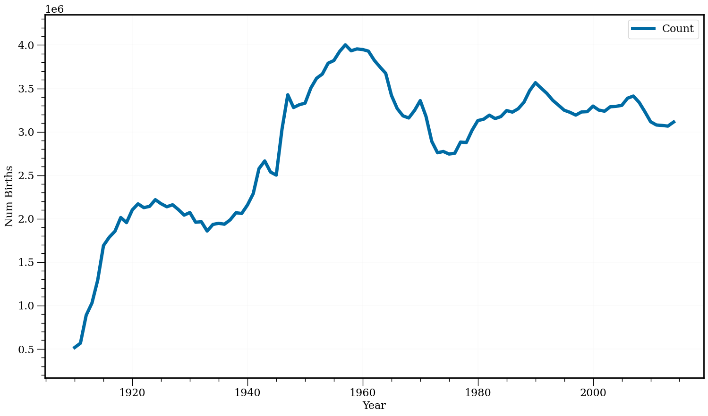
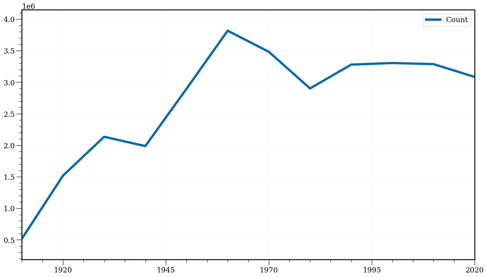
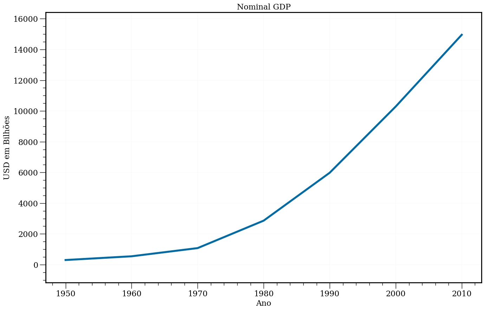
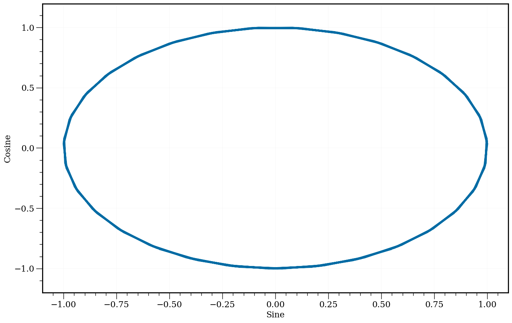
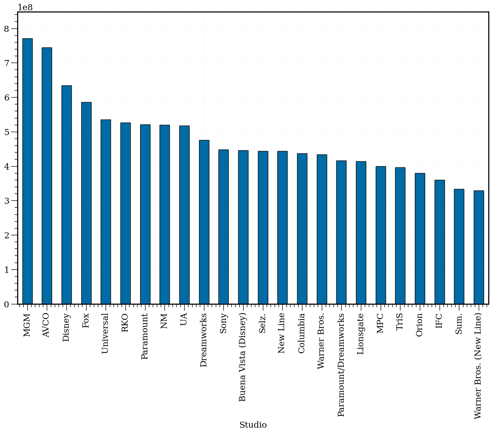
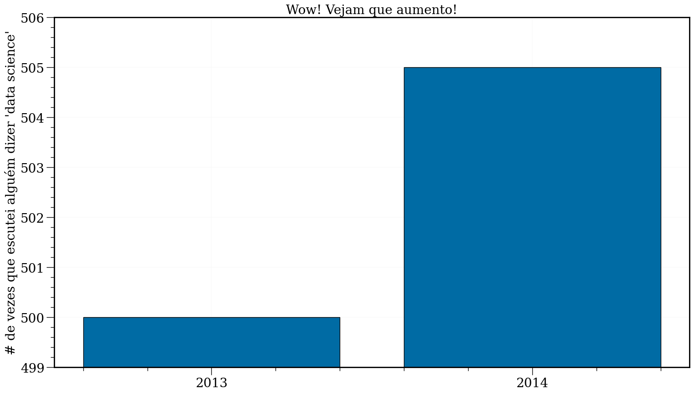
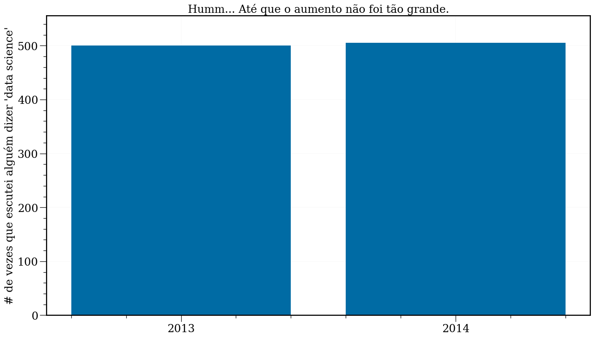
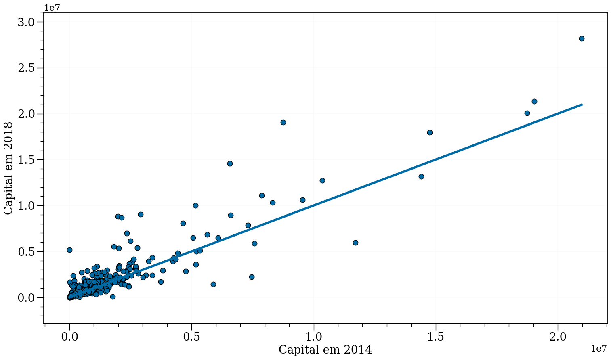

[](https://colab.research.google.com/github/icd-ufmg/icd-ufmg.github.io/blob/master/_lessons/03-viz.ipynb)

# Exploração e Visualização
{: .no_toc .mb-2 }

Um pouco de matplotlib.
{: .fs-6 .fw-300 }

{: .no_toc .text-delta }
Resultados Esperados

1. Junto com a aula passada, ferramentas simples para exploração de dados
1. Aprender a base de Matplotlib para realizar um plot simples
1. Aprender conceitos básicos de visualização dados
1. Um pouco mais de filtro e seleção de dados

---
**Sumário**
1. TOC
{:toc}
---


```python
#In: 
# -*- coding: utf8

import matplotlib.pyplot as plt
import numpy as np
import pandas as pd
```

<details>
<summary>Código de Configurar Plot (Oculto)</summary>


```python
#In: 
plt.rcParams['figure.figsize'] = (16, 10)

plt.rcParams['axes.axisbelow'] = True 
plt.rcParams['axes.grid'] = True
plt.rcParams['axes.labelsize'] = 16
plt.rcParams['axes.linewidth'] = 2
plt.rcParams['axes.spines.bottom'] = True
plt.rcParams['axes.spines.left'] = True
plt.rcParams['axes.titlesize'] = 16
plt.rcParams['axes.ymargin'] = 0.1

plt.rcParams['font.family'] = 'serif'

plt.rcParams['grid.color'] = 'lightgrey'
plt.rcParams['grid.linewidth'] = .1

plt.rcParams['xtick.bottom'] = True
plt.rcParams['xtick.direction'] = 'out' 
plt.rcParams['xtick.labelsize'] = 16
plt.rcParams['xtick.major.size'] = 12
plt.rcParams['xtick.major.width'] = 1
plt.rcParams['xtick.minor.size'] = 6
plt.rcParams['xtick.minor.width'] = 1
plt.rcParams['xtick.minor.visible'] = True

plt.rcParams['ytick.direction'] = 'out'
plt.rcParams['ytick.labelsize'] = 16
plt.rcParams['ytick.left'] = True
plt.rcParams['ytick.major.size'] = 12
plt.rcParams['ytick.major.width'] = 1
plt.rcParams['ytick.minor.size'] = 6
plt.rcParams['ytick.minor.width'] = 1
plt.rcParams['ytick.minor.visible'] = True

plt.rcParams['legend.fontsize'] = 16

plt.rcParams['lines.linewidth'] = 4
plt.rcParams['lines.markersize'] = 80
```


```python
#In: 
plt.style.use('tableau-colorblind10')
plt.ion();
```

</details>

## Introdução

Uma parte fundamental do kit de ferramentas do cientista de dados é a visualização de dados. Embora seja muito fácil criar visualizações, é muito mais difícil produzir boas visualizações.

Existem dois usos principais para visualização de dados:

    Para explorar dados;
    Para comunicar dados.

Nesta aula, nos concentraremos em desenvolver as habilidades que você precisará para começar a explorar os seus próprios dados e produzir as visualizações que usaremos ao longo do curso.

Como a maioria dos tópicos que veremos, a visualização de dados é um rico campo de estudo que merece o seu próprio curso.

No entanto, vamos tentar dar uma ideia do que contribui para uma boa visualização e o que não contribui.

## Análise Exploratória de Dados

Vamos iniciar explorando algumas chamadas sobre como fazer merge e tratar missing data. Alguns passos simples para
a Limpeza de Dados.

### Dados Sintéticos


```python
#In: 
people = pd.DataFrame(
    [["Joey",      "blue",       42,  "M"],
     ["Weiwei",    "blue",       50,  "F"],
     ["Joey",      "green",       8,  "M"],
     ["Karina",    "green",  np.nan,  "F"],
     ["Fernando",  "pink",        9,  "M"],
     ["Nhi",       "blue",        3,  "F"],
     ["Sam",       "pink",   np.nan,  "M"]], 
    columns = ["Name", "Color", "Age", "Gender"])
people
```


<div>
<style scoped>
    .dataframe tbody tr th:only-of-type {
        vertical-align: middle;
    }

    .dataframe tbody tr th {
        vertical-align: top;
    }

    .dataframe thead th {
        text-align: right;
    }
</style>
<table border="1" class="dataframe">
  <thead>
    <tr style="text-align: right;">
      <th></th>
      <th>Name</th>
      <th>Color</th>
      <th>Age</th>
      <th>Gender</th>
    </tr>
  </thead>
  <tbody>
    <tr>
      <th>0</th>
      <td>Joey</td>
      <td>blue</td>
      <td>42.0</td>
      <td>M</td>
    </tr>
    <tr>
      <th>1</th>
      <td>Weiwei</td>
      <td>blue</td>
      <td>50.0</td>
      <td>F</td>
    </tr>
    <tr>
      <th>2</th>
      <td>Joey</td>
      <td>green</td>
      <td>8.0</td>
      <td>M</td>
    </tr>
    <tr>
      <th>3</th>
      <td>Karina</td>
      <td>green</td>
      <td>NaN</td>
      <td>F</td>
    </tr>
    <tr>
      <th>4</th>
      <td>Fernando</td>
      <td>pink</td>
      <td>9.0</td>
      <td>M</td>
    </tr>
    <tr>
      <th>5</th>
      <td>Nhi</td>
      <td>blue</td>
      <td>3.0</td>
      <td>F</td>
    </tr>
    <tr>
      <th>6</th>
      <td>Sam</td>
      <td>pink</td>
      <td>NaN</td>
      <td>M</td>
    </tr>
  </tbody>
</table>
</div>


```python
#In: 
email = pd.DataFrame(
    [["Deb",  "deborah_nolan@berkeley.edu"],
     ["Sam",  np.nan],
     ["John", "doe@nope.com"],
     ["Joey", "jegonzal@cs.berkeley.edu"],
     ["Weiwei", "weiwzhang@berkeley.edu"],
     ["Weiwei", np.nan],
     ["Karina", "kgoot@berkeley.edu"]], 
    columns = ["User Name", "Email"])
email
```


<div>
<style scoped>
    .dataframe tbody tr th:only-of-type {
        vertical-align: middle;
    }

    .dataframe tbody tr th {
        vertical-align: top;
    }

    .dataframe thead th {
        text-align: right;
    }
</style>
<table border="1" class="dataframe">
  <thead>
    <tr style="text-align: right;">
      <th></th>
      <th>User Name</th>
      <th>Email</th>
    </tr>
  </thead>
  <tbody>
    <tr>
      <th>0</th>
      <td>Deb</td>
      <td>deborah_nolan@berkeley.edu</td>
    </tr>
    <tr>
      <th>1</th>
      <td>Sam</td>
      <td>NaN</td>
    </tr>
    <tr>
      <th>2</th>
      <td>John</td>
      <td>doe@nope.com</td>
    </tr>
    <tr>
      <th>3</th>
      <td>Joey</td>
      <td>jegonzal@cs.berkeley.edu</td>
    </tr>
    <tr>
      <th>4</th>
      <td>Weiwei</td>
      <td>weiwzhang@berkeley.edu</td>
    </tr>
    <tr>
      <th>5</th>
      <td>Weiwei</td>
      <td>NaN</td>
    </tr>
    <tr>
      <th>6</th>
      <td>Karina</td>
      <td>kgoot@berkeley.edu</td>
    </tr>
  </tbody>
</table>
</div>


```python
#In: 
people.merge(email, 
             how = "inner",
             left_on = "Name", right_on = "User Name")
```


<div>
<style scoped>
    .dataframe tbody tr th:only-of-type {
        vertical-align: middle;
    }

    .dataframe tbody tr th {
        vertical-align: top;
    }

    .dataframe thead th {
        text-align: right;
    }
</style>
<table border="1" class="dataframe">
  <thead>
    <tr style="text-align: right;">
      <th></th>
      <th>Name</th>
      <th>Color</th>
      <th>Age</th>
      <th>Gender</th>
      <th>User Name</th>
      <th>Email</th>
    </tr>
  </thead>
  <tbody>
    <tr>
      <th>0</th>
      <td>Joey</td>
      <td>blue</td>
      <td>42.0</td>
      <td>M</td>
      <td>Joey</td>
      <td>jegonzal@cs.berkeley.edu</td>
    </tr>
    <tr>
      <th>1</th>
      <td>Joey</td>
      <td>green</td>
      <td>8.0</td>
      <td>M</td>
      <td>Joey</td>
      <td>jegonzal@cs.berkeley.edu</td>
    </tr>
    <tr>
      <th>2</th>
      <td>Weiwei</td>
      <td>blue</td>
      <td>50.0</td>
      <td>F</td>
      <td>Weiwei</td>
      <td>weiwzhang@berkeley.edu</td>
    </tr>
    <tr>
      <th>3</th>
      <td>Weiwei</td>
      <td>blue</td>
      <td>50.0</td>
      <td>F</td>
      <td>Weiwei</td>
      <td>NaN</td>
    </tr>
    <tr>
      <th>4</th>
      <td>Karina</td>
      <td>green</td>
      <td>NaN</td>
      <td>F</td>
      <td>Karina</td>
      <td>kgoot@berkeley.edu</td>
    </tr>
    <tr>
      <th>5</th>
      <td>Sam</td>
      <td>pink</td>
      <td>NaN</td>
      <td>M</td>
      <td>Sam</td>
      <td>NaN</td>
    </tr>
  </tbody>
</table>
</div>


Como podemos tratar?

1. Missing data nas cores?
2. Missing data nos e-mails?


```python
#In: 
people['Age'] = people['Age'].fillna(people['Age'].mean())
people
```


<div>
<style scoped>
    .dataframe tbody tr th:only-of-type {
        vertical-align: middle;
    }

    .dataframe tbody tr th {
        vertical-align: top;
    }

    .dataframe thead th {
        text-align: right;
    }
</style>
<table border="1" class="dataframe">
  <thead>
    <tr style="text-align: right;">
      <th></th>
      <th>Name</th>
      <th>Color</th>
      <th>Age</th>
      <th>Gender</th>
    </tr>
  </thead>
  <tbody>
    <tr>
      <th>0</th>
      <td>Joey</td>
      <td>blue</td>
      <td>42.0</td>
      <td>M</td>
    </tr>
    <tr>
      <th>1</th>
      <td>Weiwei</td>
      <td>blue</td>
      <td>50.0</td>
      <td>F</td>
    </tr>
    <tr>
      <th>2</th>
      <td>Joey</td>
      <td>green</td>
      <td>8.0</td>
      <td>M</td>
    </tr>
    <tr>
      <th>3</th>
      <td>Karina</td>
      <td>green</td>
      <td>22.4</td>
      <td>F</td>
    </tr>
    <tr>
      <th>4</th>
      <td>Fernando</td>
      <td>pink</td>
      <td>9.0</td>
      <td>M</td>
    </tr>
    <tr>
      <th>5</th>
      <td>Nhi</td>
      <td>blue</td>
      <td>3.0</td>
      <td>F</td>
    </tr>
    <tr>
      <th>6</th>
      <td>Sam</td>
      <td>pink</td>
      <td>22.4</td>
      <td>M</td>
    </tr>
  </tbody>
</table>
</div>


```python
#In: 
email.dropna()
```


<div>
<style scoped>
    .dataframe tbody tr th:only-of-type {
        vertical-align: middle;
    }

    .dataframe tbody tr th {
        vertical-align: top;
    }

    .dataframe thead th {
        text-align: right;
    }
</style>
<table border="1" class="dataframe">
  <thead>
    <tr style="text-align: right;">
      <th></th>
      <th>User Name</th>
      <th>Email</th>
    </tr>
  </thead>
  <tbody>
    <tr>
      <th>0</th>
      <td>Deb</td>
      <td>deborah_nolan@berkeley.edu</td>
    </tr>
    <tr>
      <th>2</th>
      <td>John</td>
      <td>doe@nope.com</td>
    </tr>
    <tr>
      <th>3</th>
      <td>Joey</td>
      <td>jegonzal@cs.berkeley.edu</td>
    </tr>
    <tr>
      <th>4</th>
      <td>Weiwei</td>
      <td>weiwzhang@berkeley.edu</td>
    </tr>
    <tr>
      <th>6</th>
      <td>Karina</td>
      <td>kgoot@berkeley.edu</td>
    </tr>
  </tbody>
</table>
</div>


Voltando para os dados de nomes.

### Babies


```python
#In: 
df = pd.read_csv('https://media.githubusercontent.com/media/icd-ufmg/material/master/aulas/04-EDA-e-Vis/baby.csv')
df.head()
```


<div>
<style scoped>
    .dataframe tbody tr th:only-of-type {
        vertical-align: middle;
    }

    .dataframe tbody tr th {
        vertical-align: top;
    }

    .dataframe thead th {
        text-align: right;
    }
</style>
<table border="1" class="dataframe">
  <thead>
    <tr style="text-align: right;">
      <th></th>
      <th>Id</th>
      <th>Name</th>
      <th>Year</th>
      <th>Gender</th>
      <th>State</th>
      <th>Count</th>
    </tr>
  </thead>
  <tbody>
    <tr>
      <th>0</th>
      <td>1</td>
      <td>Mary</td>
      <td>1910</td>
      <td>F</td>
      <td>AK</td>
      <td>14</td>
    </tr>
    <tr>
      <th>1</th>
      <td>2</td>
      <td>Annie</td>
      <td>1910</td>
      <td>F</td>
      <td>AK</td>
      <td>12</td>
    </tr>
    <tr>
      <th>2</th>
      <td>3</td>
      <td>Anna</td>
      <td>1910</td>
      <td>F</td>
      <td>AK</td>
      <td>10</td>
    </tr>
    <tr>
      <th>3</th>
      <td>4</td>
      <td>Margaret</td>
      <td>1910</td>
      <td>F</td>
      <td>AK</td>
      <td>8</td>
    </tr>
    <tr>
      <th>4</th>
      <td>5</td>
      <td>Helen</td>
      <td>1910</td>
      <td>F</td>
      <td>AK</td>
      <td>7</td>
    </tr>
  </tbody>
</table>
</div>


```python
#In: 
cols = ['Year', 'Count']
df[cols]
```


<div>
<style scoped>
    .dataframe tbody tr th:only-of-type {
        vertical-align: middle;
    }

    .dataframe tbody tr th {
        vertical-align: top;
    }

    .dataframe thead th {
        text-align: right;
    }
</style>
<table border="1" class="dataframe">
  <thead>
    <tr style="text-align: right;">
      <th></th>
      <th>Year</th>
      <th>Count</th>
    </tr>
  </thead>
  <tbody>
    <tr>
      <th>0</th>
      <td>1910</td>
      <td>14</td>
    </tr>
    <tr>
      <th>1</th>
      <td>1910</td>
      <td>12</td>
    </tr>
    <tr>
      <th>2</th>
      <td>1910</td>
      <td>10</td>
    </tr>
    <tr>
      <th>3</th>
      <td>1910</td>
      <td>8</td>
    </tr>
    <tr>
      <th>4</th>
      <td>1910</td>
      <td>7</td>
    </tr>
    <tr>
      <th>...</th>
      <td>...</td>
      <td>...</td>
    </tr>
    <tr>
      <th>5647421</th>
      <td>2014</td>
      <td>5</td>
    </tr>
    <tr>
      <th>5647422</th>
      <td>2014</td>
      <td>5</td>
    </tr>
    <tr>
      <th>5647423</th>
      <td>2014</td>
      <td>5</td>
    </tr>
    <tr>
      <th>5647424</th>
      <td>2014</td>
      <td>5</td>
    </tr>
    <tr>
      <th>5647425</th>
      <td>2014</td>
      <td>5</td>
    </tr>
  </tbody>
</table>
<p>5647426 rows × 2 columns</p>
</div>


```python
#In: 
(df[cols].groupby('Year').
 sum().
 tail())
```


<div>
<style scoped>
    .dataframe tbody tr th:only-of-type {
        vertical-align: middle;
    }

    .dataframe tbody tr th {
        vertical-align: top;
    }

    .dataframe thead th {
        text-align: right;
    }
</style>
<table border="1" class="dataframe">
  <thead>
    <tr style="text-align: right;">
      <th></th>
      <th>Count</th>
    </tr>
    <tr>
      <th>Year</th>
      <th></th>
    </tr>
  </thead>
  <tbody>
    <tr>
      <th>2010</th>
      <td>3116548</td>
    </tr>
    <tr>
      <th>2011</th>
      <td>3079145</td>
    </tr>
    <tr>
      <th>2012</th>
      <td>3073858</td>
    </tr>
    <tr>
      <th>2013</th>
      <td>3066443</td>
    </tr>
    <tr>
      <th>2014</th>
      <td>3113611</td>
    </tr>
  </tbody>
</table>
</div>


```python
#In: 
series = df[cols].groupby('Year').sum()
```


```python
#In: 
series.plot(figsize=(18, 10), fontsize=16, lw=5)
plt.xlabel('Year')
plt.ylabel('Num Births');
```


    

    


Pequena gambiarra abaixo, vou colocar cada ano no formato 1-1-ANO. Assim o pandas sabe criar uma data.


```python
#In: 
new_series = series.copy()
['1-1-{}'.format(str(x)) for x in new_series.index][0]
```


    '1-1-1910'


Depois vou criar um novo índice


```python
#In: 
dates = pd.to_datetime(['15-6-{}'.format(str(x)) for x in new_series.index])
new_series.index = pd.DatetimeIndex(dates)
new_series.head()
```


<div>
<style scoped>
    .dataframe tbody tr th:only-of-type {
        vertical-align: middle;
    }

    .dataframe tbody tr th {
        vertical-align: top;
    }

    .dataframe thead th {
        text-align: right;
    }
</style>
<table border="1" class="dataframe">
  <thead>
    <tr style="text-align: right;">
      <th></th>
      <th>Count</th>
    </tr>
  </thead>
  <tbody>
    <tr>
      <th>1910-06-15</th>
      <td>516318</td>
    </tr>
    <tr>
      <th>1911-06-15</th>
      <td>565810</td>
    </tr>
    <tr>
      <th>1912-06-15</th>
      <td>887984</td>
    </tr>
    <tr>
      <th>1913-06-15</th>
      <td>1028553</td>
    </tr>
    <tr>
      <th>1914-06-15</th>
      <td>1293322</td>
    </tr>
  </tbody>
</table>
</div>


```python
#In: 
new_series.resample('10Y').sum()
```


<div>
<style scoped>
    .dataframe tbody tr th:only-of-type {
        vertical-align: middle;
    }

    .dataframe tbody tr th {
        vertical-align: top;
    }

    .dataframe thead th {
        text-align: right;
    }
</style>
<table border="1" class="dataframe">
  <thead>
    <tr style="text-align: right;">
      <th></th>
      <th>Count</th>
    </tr>
  </thead>
  <tbody>
    <tr>
      <th>1910-12-31</th>
      <td>516318</td>
    </tr>
    <tr>
      <th>1920-12-31</th>
      <td>15177269</td>
    </tr>
    <tr>
      <th>1930-12-31</th>
      <td>21345615</td>
    </tr>
    <tr>
      <th>1940-12-31</th>
      <td>19870213</td>
    </tr>
    <tr>
      <th>1950-12-31</th>
      <td>28952157</td>
    </tr>
    <tr>
      <th>1960-12-31</th>
      <td>38165483</td>
    </tr>
    <tr>
      <th>1970-12-31</th>
      <td>34817092</td>
    </tr>
    <tr>
      <th>1980-12-31</th>
      <td>29009332</td>
    </tr>
    <tr>
      <th>1990-12-31</th>
      <td>32787986</td>
    </tr>
    <tr>
      <th>2000-12-31</th>
      <td>33042354</td>
    </tr>
    <tr>
      <th>2010-12-31</th>
      <td>32866450</td>
    </tr>
    <tr>
      <th>2020-12-31</th>
      <td>12333057</td>
    </tr>
  </tbody>
</table>
</div>


```python
#In: 
new_series.resample('10Y').mean().plot(figsize=(18, 10), fontsize=16, lw=5)
plt.xlabel('');
```


    

    


## matplotlib

Existe uma grande variedade de ferramentas para visualizar dados. 

Nós usaremos a biblioteca `matplotlib`, que é amplamente utilizada (embora mostre sua idade). 

Se você estiver interessado em produzir visualizações interativas elaboradas para a Web, provavelmente não é a escolha certa, mas para gráficos de barras simples, gráficos de linhas e diagramas de dispersão, funciona muito bem.

Em particular, estamos usando o módulo `matplotlib.pyplot`.

Em seu uso mais simples, o `pyplot` mantém um estado interno no qual você constrói uma visualização passo a passo. 

Quando terminar, você poderá salvá-lo (com `savefig()`) ou exibi-lo (com `show()`).

Vamos iniciar com duas listas simples de dados.


```python
#In: 
anos = [1950, 1960, 1970, 1980, 1990, 2000, 2010]
pib = [300.2, 543.3, 1075.9, 2862.5, 5979.6, 10289.7, 14958.3]
```


```python
#In: 
# cria um gráfico de linhas, com os anos no eixo x e o pib no eixo y
fig, ax = plt.subplots()

ax.plot(anos, pib)

# Adiciona um título
ax.set(
    title = 'Nominal GDP',
    xlabel = 'Ano',
    ylabel = 'USD em Bilhões'
);
```


    

    


Podemos também usar vetores numpy sem problemas


```python
#In: 
x = np.linspace(-100, 100, 100) * 0.1
x
```


    array([-10.        ,  -9.7979798 ,  -9.5959596 ,  -9.39393939,
            -9.19191919,  -8.98989899,  -8.78787879,  -8.58585859,
            -8.38383838,  -8.18181818,  -7.97979798,  -7.77777778,
            -7.57575758,  -7.37373737,  -7.17171717,  -6.96969697,
            -6.76767677,  -6.56565657,  -6.36363636,  -6.16161616,
            -5.95959596,  -5.75757576,  -5.55555556,  -5.35353535,
            -5.15151515,  -4.94949495,  -4.74747475,  -4.54545455,
            -4.34343434,  -4.14141414,  -3.93939394,  -3.73737374,
            -3.53535354,  -3.33333333,  -3.13131313,  -2.92929293,
            -2.72727273,  -2.52525253,  -2.32323232,  -2.12121212,
            -1.91919192,  -1.71717172,  -1.51515152,  -1.31313131,
            -1.11111111,  -0.90909091,  -0.70707071,  -0.50505051,
            -0.3030303 ,  -0.1010101 ,   0.1010101 ,   0.3030303 ,
             0.50505051,   0.70707071,   0.90909091,   1.11111111,
             1.31313131,   1.51515152,   1.71717172,   1.91919192,
             2.12121212,   2.32323232,   2.52525253,   2.72727273,
             2.92929293,   3.13131313,   3.33333333,   3.53535354,
             3.73737374,   3.93939394,   4.14141414,   4.34343434,
             4.54545455,   4.74747475,   4.94949495,   5.15151515,
             5.35353535,   5.55555556,   5.75757576,   5.95959596,
             6.16161616,   6.36363636,   6.56565657,   6.76767677,
             6.96969697,   7.17171717,   7.37373737,   7.57575758,
             7.77777778,   7.97979798,   8.18181818,   8.38383838,
             8.58585859,   8.78787879,   8.98989899,   9.19191919,
             9.39393939,   9.5959596 ,   9.7979798 ,  10.        ])


```python
#In: 
plt.figure(figsize=(18, 10))

plt.plot(x, np.sin(x), label='Sine')
plt.plot(x, np.cos(x), label='Cosine')
plt.legend()

ax = plt.gca()
for item in ([ax.title, ax.xaxis.label, ax.yaxis.label] +
             ax.get_xticklabels() + ax.get_yticklabels()):
    item.set_fontsize(20)
plt.show()
```


    

    


```python
#In: 
plt.plot(np.sin(x), np.cos(x))
plt.xlabel('Sine')
plt.ylabel('Cosine')
```


    Text(0, 0.5, 'Cosine')


    

    


## Movies Dataset

Vamos olhar para mais ou menos 50 atores e algumas métricas dos filmes que os mesmos fazem parte. Em particular, vamos iniciar explorando uma forma de visualizar dados que é o histograma.


```python
#In: 
df = pd.read_csv('https://media.githubusercontent.com/media/icd-ufmg/material/master/aulas/04-EDA-e-Vis/top_movies.csv')
```


```python
#In: 
df.head(6)
```


<div>
<style scoped>
    .dataframe tbody tr th:only-of-type {
        vertical-align: middle;
    }

    .dataframe tbody tr th {
        vertical-align: top;
    }

    .dataframe thead th {
        text-align: right;
    }
</style>
<table border="1" class="dataframe">
  <thead>
    <tr style="text-align: right;">
      <th></th>
      <th>Title</th>
      <th>Studio</th>
      <th>Gross</th>
      <th>Gross (Adjusted)</th>
      <th>Year</th>
    </tr>
  </thead>
  <tbody>
    <tr>
      <th>0</th>
      <td>Star Wars: The Force Awakens</td>
      <td>Buena Vista (Disney)</td>
      <td>906723418</td>
      <td>906723400</td>
      <td>2015</td>
    </tr>
    <tr>
      <th>1</th>
      <td>Avatar</td>
      <td>Fox</td>
      <td>760507625</td>
      <td>846120800</td>
      <td>2009</td>
    </tr>
    <tr>
      <th>2</th>
      <td>Titanic</td>
      <td>Paramount</td>
      <td>658672302</td>
      <td>1178627900</td>
      <td>1997</td>
    </tr>
    <tr>
      <th>3</th>
      <td>Jurassic World</td>
      <td>Universal</td>
      <td>652270625</td>
      <td>687728000</td>
      <td>2015</td>
    </tr>
    <tr>
      <th>4</th>
      <td>Marvel's The Avengers</td>
      <td>Buena Vista (Disney)</td>
      <td>623357910</td>
      <td>668866600</td>
      <td>2012</td>
    </tr>
    <tr>
      <th>5</th>
      <td>The Dark Knight</td>
      <td>Warner Bros.</td>
      <td>534858444</td>
      <td>647761600</td>
      <td>2008</td>
    </tr>
  </tbody>
</table>
</div>


```python
#In: 
mean_g = df.groupby('Studio').mean()['Gross (Adjusted)']
```


```python
#In: 
mean_g.sort_values()[::-1].plot.bar(edgecolor='k');
```


    

    


```python
#In: 
plt.figure(figsize=(18, 10))
mean_g = df.groupby('Studio').mean()['Gross (Adjusted)']
mean_g /= 1e8
ax = mean_g.sort_values()[::-1].plot.bar(fontsize=20, edgecolor='r')
plt.ylabel('Média de Lucro em Milhões')
for item in ([ax.title, ax.xaxis.label, ax.yaxis.label] +
             ax.get_xticklabels() + ax.get_yticklabels()):
    item.set_fontsize(20)
```


    

    


```python
#In: 
mean_g = df.groupby('Studio').mean()['Gross (Adjusted)']
mean_g /= 1e8
plt.figure(figsize=(18, 10))
plt.hist(mean_g, edgecolor='k')
plt.xlabel('Millions of Dollars')
plt.ylabel('# of Studios')

ax = plt.gca()
for item in ([ax.title, ax.xaxis.label, ax.yaxis.label] +
             ax.get_xticklabels() + ax.get_yticklabels()):
    item.set_fontsize(20)
```


    

    


## Base de actors


```python
#In: 
df = pd.read_csv('https://media.githubusercontent.com/media/icd-ufmg/material/master/aulas/04-EDA-e-Vis/actors.csv')
df
```


<div>
<style scoped>
    .dataframe tbody tr th:only-of-type {
        vertical-align: middle;
    }

    .dataframe tbody tr th {
        vertical-align: top;
    }

    .dataframe thead th {
        text-align: right;
    }
</style>
<table border="1" class="dataframe">
  <thead>
    <tr style="text-align: right;">
      <th></th>
      <th>Actor</th>
      <th>Total Gross</th>
      <th>Number of Movies</th>
      <th>Average per Movie</th>
      <th>#1 Movie</th>
      <th>Gross</th>
    </tr>
  </thead>
  <tbody>
    <tr>
      <th>0</th>
      <td>Harrison Ford</td>
      <td>4871.7</td>
      <td>41</td>
      <td>118.8</td>
      <td>Star Wars: The Force Awakens</td>
      <td>936.7</td>
    </tr>
    <tr>
      <th>1</th>
      <td>Samuel L. Jackson</td>
      <td>4772.8</td>
      <td>69</td>
      <td>69.2</td>
      <td>The Avengers</td>
      <td>623.4</td>
    </tr>
    <tr>
      <th>2</th>
      <td>Morgan Freeman</td>
      <td>4468.3</td>
      <td>61</td>
      <td>73.3</td>
      <td>The Dark Knight</td>
      <td>534.9</td>
    </tr>
    <tr>
      <th>3</th>
      <td>Tom Hanks</td>
      <td>4340.8</td>
      <td>44</td>
      <td>98.7</td>
      <td>Toy Story 3</td>
      <td>415.0</td>
    </tr>
    <tr>
      <th>4</th>
      <td>Robert Downey, Jr.</td>
      <td>3947.3</td>
      <td>53</td>
      <td>74.5</td>
      <td>The Avengers</td>
      <td>623.4</td>
    </tr>
    <tr>
      <th>5</th>
      <td>Eddie Murphy</td>
      <td>3810.4</td>
      <td>38</td>
      <td>100.3</td>
      <td>Shrek 2</td>
      <td>441.2</td>
    </tr>
    <tr>
      <th>6</th>
      <td>Tom Cruise</td>
      <td>3587.2</td>
      <td>36</td>
      <td>99.6</td>
      <td>War of the Worlds</td>
      <td>234.3</td>
    </tr>
    <tr>
      <th>7</th>
      <td>Johnny Depp</td>
      <td>3368.6</td>
      <td>45</td>
      <td>74.9</td>
      <td>Dead Man's Chest</td>
      <td>423.3</td>
    </tr>
    <tr>
      <th>8</th>
      <td>Michael Caine</td>
      <td>3351.5</td>
      <td>58</td>
      <td>57.8</td>
      <td>The Dark Knight</td>
      <td>534.9</td>
    </tr>
    <tr>
      <th>9</th>
      <td>Scarlett Johansson</td>
      <td>3341.2</td>
      <td>37</td>
      <td>90.3</td>
      <td>The Avengers</td>
      <td>623.4</td>
    </tr>
    <tr>
      <th>10</th>
      <td>Gary Oldman</td>
      <td>3294.0</td>
      <td>38</td>
      <td>86.7</td>
      <td>The Dark Knight</td>
      <td>534.9</td>
    </tr>
    <tr>
      <th>11</th>
      <td>Robin Williams</td>
      <td>3279.3</td>
      <td>49</td>
      <td>66.9</td>
      <td>Night at the Museum</td>
      <td>250.9</td>
    </tr>
    <tr>
      <th>12</th>
      <td>Bruce Willis</td>
      <td>3189.4</td>
      <td>60</td>
      <td>53.2</td>
      <td>Sixth Sense</td>
      <td>293.5</td>
    </tr>
    <tr>
      <th>13</th>
      <td>Stellan Skarsgard</td>
      <td>3175.0</td>
      <td>43</td>
      <td>73.8</td>
      <td>The Avengers</td>
      <td>623.4</td>
    </tr>
    <tr>
      <th>14</th>
      <td>Anthony Daniels</td>
      <td>3162.9</td>
      <td>7</td>
      <td>451.8</td>
      <td>Star Wars: The Force Awakens</td>
      <td>936.7</td>
    </tr>
    <tr>
      <th>15</th>
      <td>Ian McKellen</td>
      <td>3150.4</td>
      <td>31</td>
      <td>101.6</td>
      <td>Return of the King</td>
      <td>377.8</td>
    </tr>
    <tr>
      <th>16</th>
      <td>Will Smith</td>
      <td>3149.1</td>
      <td>24</td>
      <td>131.2</td>
      <td>Independence Day</td>
      <td>306.2</td>
    </tr>
    <tr>
      <th>17</th>
      <td>Stanley Tucci</td>
      <td>3123.9</td>
      <td>50</td>
      <td>62.5</td>
      <td>Catching Fire</td>
      <td>424.7</td>
    </tr>
    <tr>
      <th>18</th>
      <td>Matt Damon</td>
      <td>3107.3</td>
      <td>39</td>
      <td>79.7</td>
      <td>The Martian</td>
      <td>228.4</td>
    </tr>
    <tr>
      <th>19</th>
      <td>Robert DeNiro</td>
      <td>3081.3</td>
      <td>79</td>
      <td>39.0</td>
      <td>Meet the Fockers</td>
      <td>279.3</td>
    </tr>
    <tr>
      <th>20</th>
      <td>Cameron Diaz</td>
      <td>3031.7</td>
      <td>34</td>
      <td>89.2</td>
      <td>Shrek 2</td>
      <td>441.2</td>
    </tr>
    <tr>
      <th>21</th>
      <td>Liam Neeson</td>
      <td>2942.7</td>
      <td>63</td>
      <td>46.7</td>
      <td>The Phantom Menace</td>
      <td>474.5</td>
    </tr>
    <tr>
      <th>22</th>
      <td>Andy Serkis</td>
      <td>2890.6</td>
      <td>23</td>
      <td>125.7</td>
      <td>Star Wars: The Force Awakens</td>
      <td>936.7</td>
    </tr>
    <tr>
      <th>23</th>
      <td>Don Cheadle</td>
      <td>2885.4</td>
      <td>34</td>
      <td>84.9</td>
      <td>Avengers: Age of Ultron</td>
      <td>459.0</td>
    </tr>
    <tr>
      <th>24</th>
      <td>Ben Stiller</td>
      <td>2827.0</td>
      <td>37</td>
      <td>76.4</td>
      <td>Meet the Fockers</td>
      <td>279.3</td>
    </tr>
    <tr>
      <th>25</th>
      <td>Helena Bonham Carter</td>
      <td>2822.0</td>
      <td>36</td>
      <td>78.4</td>
      <td>Harry Potter / Deathly Hallows (P2)</td>
      <td>381.0</td>
    </tr>
    <tr>
      <th>26</th>
      <td>Orlando Bloom</td>
      <td>2815.8</td>
      <td>17</td>
      <td>165.6</td>
      <td>Dead Man's Chest</td>
      <td>423.3</td>
    </tr>
    <tr>
      <th>27</th>
      <td>Woody Harrelson</td>
      <td>2815.8</td>
      <td>50</td>
      <td>56.3</td>
      <td>Catching Fire</td>
      <td>424.7</td>
    </tr>
    <tr>
      <th>28</th>
      <td>Cate Blanchett</td>
      <td>2802.6</td>
      <td>39</td>
      <td>71.9</td>
      <td>Return of the King</td>
      <td>377.8</td>
    </tr>
    <tr>
      <th>29</th>
      <td>Julia Roberts</td>
      <td>2735.3</td>
      <td>42</td>
      <td>65.1</td>
      <td>Ocean's Eleven</td>
      <td>183.4</td>
    </tr>
    <tr>
      <th>30</th>
      <td>Elizabeth Banks</td>
      <td>2726.3</td>
      <td>35</td>
      <td>77.9</td>
      <td>Catching Fire</td>
      <td>424.7</td>
    </tr>
    <tr>
      <th>31</th>
      <td>Ralph Fiennes</td>
      <td>2715.3</td>
      <td>36</td>
      <td>75.4</td>
      <td>Harry Potter / Deathly Hallows (P2)</td>
      <td>381.0</td>
    </tr>
    <tr>
      <th>32</th>
      <td>Emma Watson</td>
      <td>2681.9</td>
      <td>17</td>
      <td>157.8</td>
      <td>Harry Potter / Deathly Hallows (P2)</td>
      <td>381.0</td>
    </tr>
    <tr>
      <th>33</th>
      <td>Tommy Lee Jones</td>
      <td>2681.3</td>
      <td>46</td>
      <td>58.3</td>
      <td>Men in Black</td>
      <td>250.7</td>
    </tr>
    <tr>
      <th>34</th>
      <td>Brad Pitt</td>
      <td>2680.9</td>
      <td>40</td>
      <td>67.0</td>
      <td>World War Z</td>
      <td>202.4</td>
    </tr>
    <tr>
      <th>35</th>
      <td>Adam Sandler</td>
      <td>2661.0</td>
      <td>32</td>
      <td>83.2</td>
      <td>Hotel Transylvania 2</td>
      <td>169.7</td>
    </tr>
    <tr>
      <th>36</th>
      <td>Daniel Radcliffe</td>
      <td>2634.4</td>
      <td>17</td>
      <td>155.0</td>
      <td>Harry Potter / Deathly Hallows (P2)</td>
      <td>381.0</td>
    </tr>
    <tr>
      <th>37</th>
      <td>Jonah Hill</td>
      <td>2605.1</td>
      <td>29</td>
      <td>89.8</td>
      <td>The LEGO Movie</td>
      <td>257.8</td>
    </tr>
    <tr>
      <th>38</th>
      <td>Owen Wilson</td>
      <td>2602.3</td>
      <td>39</td>
      <td>66.7</td>
      <td>Night at the Museum</td>
      <td>250.9</td>
    </tr>
    <tr>
      <th>39</th>
      <td>Idris Elba</td>
      <td>2580.6</td>
      <td>26</td>
      <td>99.3</td>
      <td>Avengers: Age of Ultron</td>
      <td>459.0</td>
    </tr>
    <tr>
      <th>40</th>
      <td>Bradley Cooper</td>
      <td>2557.7</td>
      <td>25</td>
      <td>102.3</td>
      <td>American Sniper</td>
      <td>350.1</td>
    </tr>
    <tr>
      <th>41</th>
      <td>Mark Wahlberg</td>
      <td>2549.8</td>
      <td>36</td>
      <td>70.8</td>
      <td>Transformers 4</td>
      <td>245.4</td>
    </tr>
    <tr>
      <th>42</th>
      <td>Jim Carrey</td>
      <td>2545.2</td>
      <td>27</td>
      <td>94.3</td>
      <td>The Grinch</td>
      <td>260.0</td>
    </tr>
    <tr>
      <th>43</th>
      <td>Dustin Hoffman</td>
      <td>2522.1</td>
      <td>43</td>
      <td>58.7</td>
      <td>Meet the Fockers</td>
      <td>279.3</td>
    </tr>
    <tr>
      <th>44</th>
      <td>Leonardo DiCaprio</td>
      <td>2518.3</td>
      <td>25</td>
      <td>100.7</td>
      <td>Titanic</td>
      <td>658.7</td>
    </tr>
    <tr>
      <th>45</th>
      <td>Jeremy Renner</td>
      <td>2500.3</td>
      <td>21</td>
      <td>119.1</td>
      <td>The Avengers</td>
      <td>623.4</td>
    </tr>
    <tr>
      <th>46</th>
      <td>Philip Seymour Hoffman</td>
      <td>2463.7</td>
      <td>40</td>
      <td>61.6</td>
      <td>Catching Fire</td>
      <td>424.7</td>
    </tr>
    <tr>
      <th>47</th>
      <td>Sandra Bullock</td>
      <td>2462.6</td>
      <td>35</td>
      <td>70.4</td>
      <td>Minions</td>
      <td>336.0</td>
    </tr>
    <tr>
      <th>48</th>
      <td>Chris Evans</td>
      <td>2457.8</td>
      <td>23</td>
      <td>106.9</td>
      <td>The Avengers</td>
      <td>623.4</td>
    </tr>
    <tr>
      <th>49</th>
      <td>Anne Hathaway</td>
      <td>2416.5</td>
      <td>25</td>
      <td>96.7</td>
      <td>The Dark Knight Rises</td>
      <td>448.1</td>
    </tr>
  </tbody>
</table>
</div>


```python
#In: 
plt.figure(figsize=(18, 10))
plt.hist(df['Average per Movie'], edgecolor='k')
plt.xlabel('Média por Filme')
plt.ylabel('Número de linhas')
ax = plt.gca()
for item in ([ax.title, ax.xaxis.label, ax.yaxis.label] +
             ax.get_xticklabels() + ax.get_yticklabels()):
    item.set_fontsize(20)
```


    

    


Obtendo a densidade de pontos em cada barra. Note que isto nem sempre vai traduzir para um valor entre `[0, 1]`. Depende do eixo-x. 


```python
#In: 
plt.figure(figsize=(18, 10))
plt.hist(df['Average per Movie'], edgecolor='k')
plt.xlabel('Média por Filme')
plt.ylabel('P(x)')
ax = plt.gca()
for item in ([ax.title, ax.xaxis.label, ax.yaxis.label] +
             ax.get_xticklabels() + ax.get_yticklabels()):
    item.set_fontsize(20)
```


    

    


```python
#In: 
plt.figure(figsize=(18, 10))
data = df['Average per Movie'][df['Average per Movie'] < 100]
plt.xlabel('Média por Filme')
plt.ylabel('P(x)')
plt.hist(data, edgecolor='k')
ax = plt.gca()
for item in ([ax.title, ax.xaxis.label, ax.yaxis.label] +
             ax.get_xticklabels() + ax.get_yticklabels()):
    item.set_fontsize(20)
```


    

    


```python
#In: 
plt.figure(figsize=(18, 10))
data = df['Average per Movie']
plt.xlabel('Média por Filme')
plt.ylabel('P(x)')
plt.hist(data, bins=50, edgecolor='k')
ax = plt.gca()
for item in ([ax.title, ax.xaxis.label, ax.yaxis.label] +
             ax.get_xticklabels() + ax.get_yticklabels()):
    item.set_fontsize(20)
```


    

    


# Problemas de escala


```python
#In: 
plt.figure(figsize=(18, 10))
mentions = [500, 505]
years = [2013, 2014]

plt.bar(years, mentions, edgecolor='k')

plt.xticks(years)
plt.ylabel("# de vezes que escutei alguém dizer 'data science'")

# define o os limites do eixo y:
plt.ylim(499,506)

plt.title("Wow! Vejam que aumento!")

ax = plt.gca()
for item in ([ax.title, ax.xaxis.label, ax.yaxis.label] +
             ax.get_xticklabels() + ax.get_yticklabels()):
    item.set_fontsize(20)
```


    

    


```python
#In: 
plt.figure(figsize=(18, 10))

plt.bar(years, mentions)

plt.xticks(years)
plt.ylabel("# de vezes que escutei alguém dizer 'data science'")

plt.ylim(0, max(mentions)*1.1)
plt.title("Humm... Até que o aumento não foi tão grande.")

ax = plt.gca()
for item in ([ax.title, ax.xaxis.label, ax.yaxis.label] +
             ax.get_xticklabels() + ax.get_yticklabels()):
    item.set_fontsize(20)
```


    

    


# Dados 2d com e leitura de JSON

O pandas também sabe ler dados em json! Vamos tentar.


```python
#In: 
df = pd.read_json('capital.json')
```


```python
#In: 
df.head()
```


<div>
<style scoped>
    .dataframe tbody tr th:only-of-type {
        vertical-align: middle;
    }

    .dataframe tbody tr th {
        vertical-align: top;
    }

    .dataframe thead th {
        text-align: right;
    }
</style>
<table border="1" class="dataframe">
  <thead>
    <tr style="text-align: right;">
      <th></th>
      <th>estado</th>
      <th>patrimonio_eleicao_1</th>
      <th>patrimonio_eleicao_2</th>
      <th>nome_urna</th>
      <th>cpf</th>
      <th>sigla_partido</th>
      <th>cod_unidade_eleitoral_1</th>
      <th>cod_unidade_eleitoral_2</th>
      <th>unidade_eleitoral</th>
      <th>cargo_pleiteado_1</th>
      <th>cargo_pleiteado_2</th>
      <th>ano_um</th>
      <th>ano_dois</th>
      <th>sequencial_candidato_1</th>
      <th>sequencial_candidato_2</th>
      <th>situacao_eleicao_1</th>
      <th>situacao_eleicao_2</th>
    </tr>
  </thead>
  <tbody>
    <tr>
      <th>0</th>
      <td>MG</td>
      <td>2326963.85</td>
      <td>2890296.74</td>
      <td>Stefano Aguiar</td>
      <td>1608657</td>
      <td>PSD</td>
      <td>MG</td>
      <td>MG</td>
      <td>Minas Gerais</td>
      <td>DEPUTADO FEDERAL</td>
      <td>DEPUTADO FEDERAL</td>
      <td>2014</td>
      <td>2018</td>
      <td>130000001189</td>
      <td>130000613225</td>
      <td>ELEITO</td>
      <td>ELEITO</td>
    </tr>
    <tr>
      <th>1</th>
      <td>RJ</td>
      <td>4239563.82</td>
      <td>3943907.61</td>
      <td>Altineu Cortes</td>
      <td>7487738</td>
      <td>PR</td>
      <td>RJ</td>
      <td>RJ</td>
      <td>Rio De Janeiro</td>
      <td>DEPUTADO FEDERAL</td>
      <td>DEPUTADO FEDERAL</td>
      <td>2014</td>
      <td>2018</td>
      <td>190000001858</td>
      <td>190000604181</td>
      <td>ELEITO</td>
      <td>ELEITO</td>
    </tr>
    <tr>
      <th>2</th>
      <td>BA</td>
      <td>1077668.74</td>
      <td>2281417.64</td>
      <td>Mário Negromonte Jr</td>
      <td>31226540</td>
      <td>PP</td>
      <td>BA</td>
      <td>BA</td>
      <td>Bahia</td>
      <td>DEPUTADO FEDERAL</td>
      <td>DEPUTADO FEDERAL</td>
      <td>2014</td>
      <td>2018</td>
      <td>50000000167</td>
      <td>50000605225</td>
      <td>ELEITO</td>
      <td>ELEITO</td>
    </tr>
    <tr>
      <th>3</th>
      <td>CE</td>
      <td>14399524.97</td>
      <td>13160762.14</td>
      <td>Roberto Pessoa</td>
      <td>113735391</td>
      <td>PSDB</td>
      <td>CE</td>
      <td>CE</td>
      <td>Ceará</td>
      <td>VICE-GOVERNADOR</td>
      <td>DEPUTADO FEDERAL</td>
      <td>2014</td>
      <td>2018</td>
      <td>60000000604</td>
      <td>60000611570</td>
      <td>NÃO ELEITO</td>
      <td>ELEITO</td>
    </tr>
    <tr>
      <th>4</th>
      <td>SP</td>
      <td>713217.64</td>
      <td>972916.79</td>
      <td>Vitor Lippi</td>
      <td>168780860</td>
      <td>PSDB</td>
      <td>SP</td>
      <td>SP</td>
      <td>São Paulo</td>
      <td>DEPUTADO FEDERAL</td>
      <td>DEPUTADO FEDERAL</td>
      <td>2014</td>
      <td>2018</td>
      <td>250000001354</td>
      <td>250000605413</td>
      <td>ELEITO</td>
      <td>ELEITO</td>
    </tr>
  </tbody>
</table>
</div>


```python
#In: 
plt.figure(figsize=(18, 10))
plt.scatter(df['patrimonio_eleicao_1'], df['patrimonio_eleicao_2'], s=80, edgecolor='k')
linha45 = np.unique(df['patrimonio_eleicao_1'])
plt.plot(linha45, linha45)

plt.xlabel('Capital em 2014')
plt.ylabel('Capital em 2018')
ax = plt.gca()
for item in ([ax.title, ax.xaxis.label, ax.yaxis.label] +
             ax.get_xticklabels() + ax.get_yticklabels()):
    item.set_fontsize(20)
plt.show()
```


    

    

