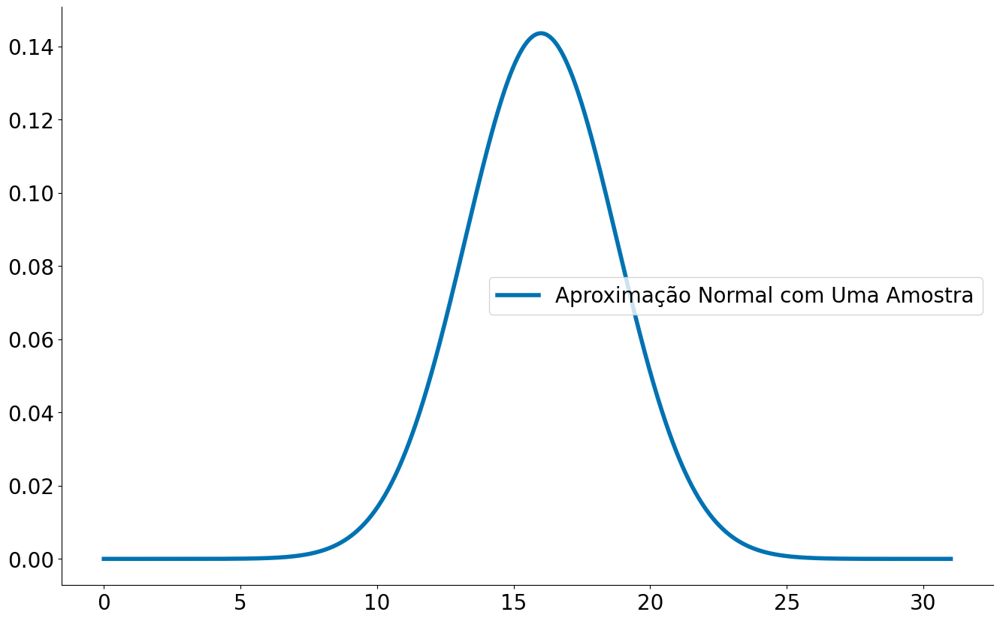
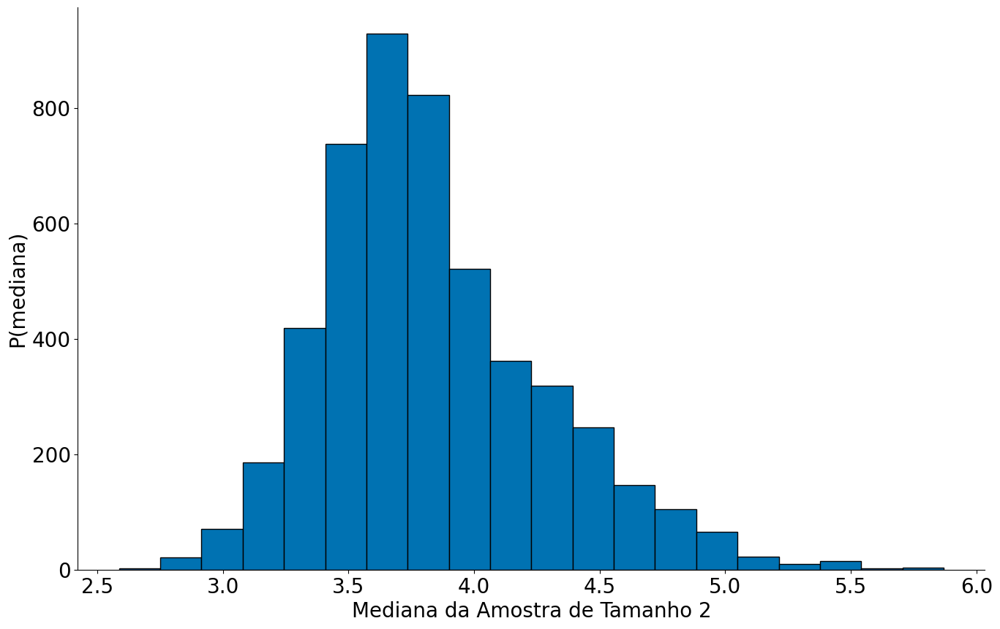
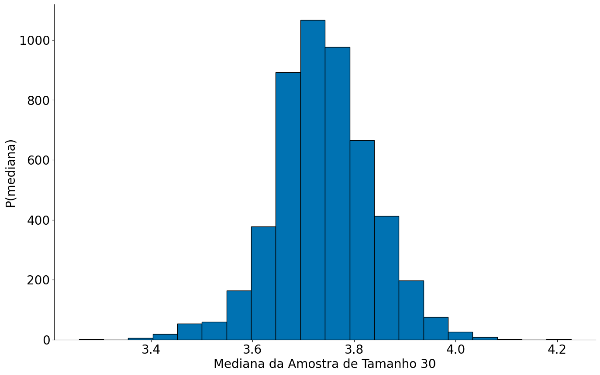

# -*- coding: utf8

from IPython.display import HTML
from matplotlib import animation
from scipy import stats as ss

import numpy as np
import matplotlib.pyplot as plt
import pandas as pd

# Para evitar a confusão da aula passada, colocando alguns defaults!
plt.rcParams['figure.figsize']  = (18, 10)
plt.rcParams['axes.labelsize']  = 20
plt.rcParams['axes.titlesize']  = 20
plt.rcParams['legend.fontsize'] = 20
plt.rcParams['xtick.labelsize'] = 20
plt.rcParams['ytick.labelsize'] = 20
plt.rcParams['lines.linewidth'] = 4
```


```python
#In: 
plt.ion()

plt.style.use('seaborn-colorblind')
plt.rcParams['figure.figsize']  = (12, 8)
```


```python
#In: 
def despine(ax=None):
    if ax is None:
        ax = plt.gca()
    # Hide the right and top spines
    ax.spines['right'].set_visible(False)
    ax.spines['top'].set_visible(False)

    # Only show ticks on the left and bottom spines
    ax.yaxis.set_ticks_position('left')
    ax.xaxis.set_ticks_position('bottom')
```

# Aula 08 - Intervalos de Confiança e Bootstrap

## Introdução, mais uma vez o TCL

Vamos explorar a ideia de intervalos de confiança. Inicialmente, lembre-se do teorema central do limite que diz: se $X_1, ..., X_n$ são variáveis aleatórias. Em particular, todas as VAs foram amostradas de uma mesma população com média $\mu$ (finita), desvio padrão $\sigma$ (finito). Além do mais, a geração de cada VA é independente da outra, sendo toas identicamente distribuídas. Quando $n$ é grande, então

$$\frac{1}{n}(X_1 + \cdots + X_n)$$

é aproximadamente distribuído por uma Normal com média $\mu$ e desvio padrão $\sigma/\sqrt{n}$:

$$\frac{1}{n}(X_1 + \cdots + X_n) \sim Normal(\mu, \sigma/\sqrt{n})$$.

## Distribuição amostral e Intervalos de Confiança

A distribuição dos valores de uma estatística a partir de amostras é chamada de *distribuição amostral* daquela estatística. Ela tem um papel importante, porque é a partir do entendimento dela que estimaremos quanta confiança temos em uma estatística que estamos calculando a partir de uma amostra. No exemplo acima, cada $X_i$ é uma amostra e $X_i/n$ é a média desta amostra. Então, $\frac{1}{n}(X_1 + \cdots + X_n)$ é a distribuição amostral das médias!

O principal a entender aqui é que se conhecermos a distribuição amostral, saberemos quão longe normalmente a estatística calculada para uma amostra está daquela calculada para a população. Sabendo isso, podemos calcular uma margem de erro para a estimativa feita a partir da amostra, tal estimativa será o nosso intervalo de confiança.

Vamos iniciar com um caso que conheçemos a distribuição da população.

## Exemplo Moedas (Caso onde Sabemos da População!)

**É importante falar que por um bom tempo este notebook não vai computar ICs, preste atenção no fluxo de ideias.**

Por simplicidade, vamos fazer uso um exemplo de lançamento de moedas. Isto é, vamos explorar a probabilidade de uma moeda ser justa usando estatística e amostragem (conceitos não exclusivos).

Lembrando, temos um espaço amostral:

\begin{align}
\mathcal{S} &= \{h, t\} \\
P(h) &= 0.5 \\
P(t) &= 0.5
\end{align}

No caso das moedas é simples saber a **distribuição da população**. O número de sucessos de lançamentos de uma moeda segue uma distribuição Binomial. A mesma se parece bastante com a Normal. A PMF de uma Binomial é:

$$P(k; p, n) = \binom{n}{k} p^k (1-p)^{n-k}$$

onde $n$ captura o número de caras e $k$ o número de lançamentos.


```python
#In: 
p = 0.5 # probabilidade de heads/tails
k = 30  # temos 30 jogadas
x = np.arange(0, 31) # Valores no eixo x
prob_binom = ss.distributions.binom.pmf(x, k, p)
plt.stem(x, prob_binom)
plt.xlabel('Num Caras - x')
plt.ylabel('P(sair x caras)')
despine()
```


    

    


Usando a função `ppf` podemos ver onde ficam $95\%$ dos lançamentos de moedas. Para isto, temos que considerar $2.5\%$ para a esquerda e $2.5\%$ para a direita.

A `ppf` pode é inverso da CDF. Pegamos valor no percentil, não o percentil dado um valor.


```python
#In: 
p = 0.5 # probabilidade de heads/tails
k = 30  # temos 30 jogadas
x = np.arange(0, 31) # Valores no eixo x
prob_binom = ss.distributions.binom.cdf(x, k, p)
plt.step(x, prob_binom)
plt.xlabel('Num Caras - x')
plt.ylabel('P(X <= x)')
plt.title('CDF da Binomial')
despine()
```


    

    


```python
#In: 
# 2.5% dos dados P[X <= 10] = 0.025
ss.distributions.binom.ppf(0.025, k, p)
```


    10.0


```python
#In: 
print(1-0.025)
# 2.5% dos dados para cima P[X > 20] = 0.025
ss.distributions.binom.ppf(1-0.025, k, p)
```

    0.975


    20.0


**Caso 1: Quando sabemos a população é fácil responder a pergunta**

$95\%$ dos lançamentos de 30 moedas justas deve cair entre 10 e 20. Acamos de computar lá em cima usando o inverso da CDF `a PPF`.


```python
#In: 
p = 0.5 # probabilidade de heads/tails
k = 30  # temos 30 jogadas
x = np.arange(0, 31) # Valores no eixo x
prob_binom = ss.distributions.binom.pmf(x, k, p)
plt.stem(x, prob_binom)
plt.xlabel('Num Caras - x')
plt.ylabel('P(sair x caras)')
despine()

x2 = np.arange(10, 21) # Valores no eixo x
prob_binom = ss.distributions.binom.pmf(x2, k, p)
plt.fill_between(x2, prob_binom, color='r', alpha=0.5)
```


    <matplotlib.collections.PolyCollection at 0x7f7584e6adf0>


    

    


## Simulando

Agora, vamos assumir que não sei disto. Isto é, não sei nada de ppf, pdf, pmf, cdf etc. Mas eu sei jogar moedas para cima. Será que consigo estimar o mesmo efeito?!


```python
#In: 
# Jogando uma única moeda
np.random.randint(0, 2)
```


    1


```python
#In: 
# Jogando 30 moedas
np.random.randint(0, 2, size=30)
```


    array([0, 0, 0, 1, 0, 0, 0, 1, 0, 1, 1, 1, 1, 0, 0, 0, 1, 0, 1, 0, 0, 1,
           1, 1, 1, 1, 0, 1, 0, 1])


```python
#In: 
NUM_SIMULACOES = 100000
resultados = []
for i in range(NUM_SIMULACOES):
    jogadas = np.random.randint(0, 2, size=30) # joga 30 moedas para cima
    n_caras = (jogadas == 1).sum()             # conta quantas foram == 1, caras
    resultados.append(n_caras)
bins = np.arange(0, 31) + 0.5
plt.hist(resultados, bins=bins, edgecolor='k');
despine()
plt.xlabel('Numero de Caras')
plt.ylabel('Fração de Casos')
```


    Text(0, 0.5, 'Fração de Casos')


    

    


**Caso 2: Quando sabemos gerar dados que seguem a população é fácil responder a pergunta.**

Podemos verificar o resultado empiricamente na CDF. Estou usando `side='left'` pois por motivos que não entendo o statsmodels faz `P[X < x]` e não `P[X <= x]` por default. Com side `left` corrigimos isto.


```python
#In: 
from statsmodels.distributions.empirical_distribution import ECDF
ecdf = ECDF(resultados, side='left')

plt.plot(ecdf.x, ecdf.y)
plt.xlabel('Num caras')
plt.ylabel('P[X <= x]')
despine()
```


    

    


```python
#In: 
np.percentile(resultados, 2.5)
```


    10.0


```python
#In: 
np.percentile(resultados, 97.5)
```


    20.0


```python
#In: 
ecdf(10)
```


    0.020980000000000002


```python
#In: 
ecdf(21)
```


    0.97828


Até agora eu estou assumindo muito.

1. Sei da população
1. Sei amostrar de forma uniforme da população.

E quando eu estiver apenas com 1 amostra?!

1. amostras = []
1. para cada amostra de tamanho 100:
    1. amostra[i] = np.mean(amostra)
1. plt.hist(amostras) --> normal
1. estou trabalhando com uma delas: amostra[10]


## Quando não sabemos de muita coisa

**Preste atenção a partir daqui**

Não sei nem jogar uma moeda para cima. Desempilhe o TCL.

Lembre-se que distribuição Binomial captura a **média** de caras esperadas em _n_  lançamentos. Note que, ao somar cada um dos meus experimentos estou justamente voltando para o **TCL**. A distribuição amostral aqui é a média de caras a cada 30 jogadas. Assim, podemos ver a aproximação abaixo.


```python
#In: 
bins = np.arange(0, 31) + 0.5
plt.hist(resultados, bins=bins, edgecolor='k');
plt.xlabel('Numero de Caras')
plt.ylabel('Fração de Casos')

x = np.linspace(0, 31, 1000)
y = ss.distributions.norm.pdf(loc=np.mean(resultados),
                              scale=np.std(resultados, ddof=1), ## ddof=1 faz dividir por n-1
                              x=x)
plt.plot(x, y, label='Aproximação Normal')
plt.legend()
despine()
```


    

    


**Qual o siginificado do plot acima??**

1. Cada experimento foi n-lançamentos. Tiramos a média dos n.
1. Tenho a variância das médias, ou seja, a variância do estimaodor (lembre-se das aulas passadas)
1. Resultado final --> Normal!

Observe como com uma única jogada de 30 moedas eu chego em uma normal bem próxima da anterior!

Cada jogo é um vetor de booleans.


```python
#In: 
np.random.randint(0, 2, size=30)
```


    array([0, 1, 1, 1, 1, 0, 1, 1, 1, 1, 0, 1, 0, 0, 0, 1, 0, 1, 0, 1, 1, 0,
           0, 1, 0, 1, 1, 0, 1, 1])


A média é a fração de caras


```python
#In: 
np.random.randint(0, 2, size=30).mean()
```


    0.5666666666666667


E ao multiplicar por 30, tenho o número de caras, afinal foram 30 lançamentos.


```python
#In: 
np.random.randint(0, 2, size=30).mean() * 30
```


    13.0


Colando tudo junto, note que estou computando o desvio do estimador! Para isto, use a variância do estimador.

$Var(\hat{\mu}) = s^2 / n$

$Std(\hat{\mu}) = s / \sqrt{n}$


```python
#In: 
uma_vez = np.random.randint(0, 2, size=30)
mean_uma = np.mean(uma_vez)  * 30
std_uma = np.std(uma_vez, ddof=1) * 30 # o desvio padrão é na mesma unidade da média
std_est = std_uma / np.sqrt(30)
```

Observe uma normal muito próxima da anterior com uma jogada!


```python
#In: 
x = np.linspace(0, 31, 1000)
y = ss.distributions.norm.pdf(loc=mean_uma,
                              scale=std_est,
                              x=x)
plt.plot(x, y, label='Aproximação Normal com Uma Amostra')
plt.legend()
despine()
```


    

    


Observe que ao fazer várias amostras existe uma variabilidade na normal estimada. Vamos entender teóricamente.


```python
#In: 
for _ in range(30):
    uma_vez = np.random.randint(0, 2, size=30)
    mean_uma = np.mean(uma_vez) * 30
    std_uma = np.std(uma_vez, ddof=1) * 30
    std_est = std_uma / np.sqrt(30)
    x = np.linspace(0, 31, 1000)
    y = ss.distributions.norm.pdf(loc=mean_uma,
                                  scale=std_est,
                                  x=x)
    plt.plot(x, y)
despine()
```


    

    


## ICs com Normal

Considere o caso que tenho **UMA** amostra apenas. Aqui eu não tenho mais distribuição amostral, pois só fiz uma coleta de dados. Felizmente, eu tenho algo para me ajudar, o TCL.

Quando o TCL funciona, podemos computar o intervalo de confiança usando uma Normal. Essa é a base comum que motivamos algumas aulas atrás. Vamos brincar um pouco de shiftar/escalar nossa Normal. Sabendo que:

$$\frac{1}{n}(X_1 + \cdots + X_n) \sim Normal(\mu, \sigma/\sqrt{n}).$$

Vamos fazer:

$$Z_i = X_i - \mu$$

Note que estamos apenas jogando todo mundo para a esquerda $-\mu$. O valor esperado (média) de uma VA X, $E[x]$, menos uma constante $c$ nada mais é do que $E[x]-c$. Além do mais, a variânçia não muda. Veja as propriedades no Wikipedia. 

Assim:

$$\frac{1}{n}\sum_i Z_i = \frac{1}{n}\sum_i X_i - \mu \sim Normal(0, \sigma/\sqrt{n})$$

Agora, vamos dividir $Z_i$ por. Neste caso, o desvio padrão e a média vão ser divididos pelo mesmo valor:

$$\frac{1}{n}\sum_i Z_i = \frac{1}{n}\sum_i \frac{X_i - \mu}{\sigma/\sqrt{n}} \sim Normal(0, 1)$$

Isto quer dizer que **a média** (note a soma e divisão por n) das **distribuições amostrais** $Z_i$ seguem uma $Normal(0, 1)$. Note que estamos assumindo que o TCL está em voga. Às vezes (quando quebramos IID ou Variância finita), o mesmo não vale, mas vamos ignorar tais casos. Bacana, e daí? **Não importa a população inicial, essa é a beleza do TCL!**. 

Então, mesmo sem saber a média real da população $\mu$, eu posso brincar com a equação acima. Primeiramente vamos focar na média $\frac{1}{n}\sum_i Z_i$, vamos chamar esta distribuição de $Z$ apenas. Sabendo que uma população segue uma Normal, eu consigo facilmente saber onde caem 95\% dos casos. Isto é similar ao exemplo das moedas e da Binomial acima. Porém, note que eu não assumo nada da população dos dados. 

Uma forma comum de computar tais intervalos é usando tabelas ou uma figura como a apresentada abaixo. Hoje em dia, podemos usar a função `ppf`. A mesma indica que 95% dos casos estão ente $-1.96$ e $1.96$. 


```python
#In: 
ss.norm.ppf(0.975)
```


    1.959963984540054


```python
#In: 
ss.norm.ppf(1-0.975)
```


    -1.959963984540054


Agora eu preciso apenas voltar para $X$. Para tal, vamos fazer uso de estimador não viésado de $\sigma$, o desvio padrão da amostra.

$$s = \sqrt{\frac{\sum_i ({x_i - \bar{x}})^2}{n-1}}$$

Fazendo $z=1.96$ e $P(-z \le Z \le z) = 0.95$

\begin{align}
0.95 & = P(-z \le Z \le z)=P \left(-1.96 \le \frac {\bar X-\mu}{\sigma/\sqrt{n}} \le 1.96 \right) \\
& = P \left( \bar X - 1.96 \frac \sigma {\sqrt{n}} \le \mu \le \bar X + 1.96 \frac \sigma {\sqrt{n}}\right).
\end{align}

Substituindo $\sigma$ por $s$: a probabilidade da média da população está entre $\bar{X} +- 1.96 \frac \sigma {\sqrt{n}}$ é de 95%. 

1. https://en.wikipedia.org/wiki/Variance#Properties
1. https://en.wikipedia.org/wiki/Expected_value#Basic_properties

## Computando um IC dos dados


```python
#In: 
# brinque com este valor um pouco, observe a mudança nas células abaixo.

TAMANHO_AMOSTRA = 100
resultados = []
for i in range(TAMANHO_AMOSTRA):
    jogadas = np.random.randint(0, 2, size=30) # joga 30 moedas para cima
    n_caras = (jogadas == 1).sum()             # conta quantas foram == 1, caras
    resultados.append(n_caras)
```


```python
#In: 
s = np.std(resultados, ddof=1)
s
```


    2.5434407618599866


```python
#In: 
s_over_n = s / np.sqrt(len(resultados))
s_over_n
```


    0.25434407618599864


```python
#In: 
mean = np.mean(resultados)
mean
```


    15.34


```python
#In: 
mean - 1.96 * s_over_n
```


    14.841485610675443


```python
#In: 
mean + 1.96 * s_over_n
```


    15.838514389324557


```python
#In: 
# até aqui.
```

## Entendendo um IC

Diferente de quando temos uma distribuição populacional, temos que interpretar o IC diferente. Note que:

1. **Não estamos computando onde caem 95% dos casos da população**. Basta comparar os valores acima.
1. **Não estamos computando onde caem 95% das médias**. Bast comparar com os valores acima.

Estamos resolvendo:

$$P(-z \le Z \le z)=P \left(-1.96 \le \frac {\bar X-\mu}{\sigma/\sqrt{n}} \le 1.96 \right)$$

E chegando em:

$$P \left( \bar X - 1.96 \frac \sigma {\sqrt{n}} \le \mu \le \bar X + 1.96 \frac \sigma {\sqrt{n}}\right)$$

Ou seja:

**A PROBABILIDADE DA MÉDIA REAL $\mu$ CAIR ENTRE $X +- 1.96 \frac \sigma {\sqrt{n}}$ É DE 95%**

ou

**EU TENHO 95% DE CONFIANÇA DE QUE A MÉDIA ESTÁ ENTRE $X +- 1.96 \frac \sigma {\sqrt{n}}$**

ou

**95% DAS AMOSTRAS DE TAMANHO N VÃO CONTER A MÉDIA REAL**


```python
#In: 
# Construindo um IC
(mean - 1.96 * s_over_n, mean + 1.96 * s_over_n)
```


    (14.841485610675443, 15.838514389324557)


**95% de chance da média cair no intervalo de tamanho n acima. O mesmo não inclui o 22, então podemos assumir que o valor é não esperado.**

Observe que existe uma chance de cometermos erros, qual é?

## A situação mais comum na vida real

Normalmente temos *uma amostra* da população apenas. Daí não conhecemos a distribuição amostral. Mas gostaríamos de a partir da nossa amostra estimar onde está a estatística para a população. 

Exemplo: queremos estimar qual a proporção de pessoas que gostará do produto (a estatística) entre todos os usuários (a população) a partir do cálculo da proporção de pessoas que gostou do produto (a mesma estatística) em um teste com 100 pessoas (a amostra).

Repare que se conhecermos como a estatística varia na distribuição amostral (ex: 2 pontos pra mais ou pra menos cobrem 99% dos casos) e temos a estatística calculada para a amostra, poderíamos estimar uma faixa de valores onde achamos que a estatística está para a população _com 99% de confiança_.

### A ideia central que usaremos

Para exemplificar o caso acima, vamos explorar alguns dados reais de salários da Billboard. 
A ideia principal que usaremos, em uma técnica chamada *boostrapping* é que _usar a amostra como substituto da população e simular a amostragem através de reamostragem com reposição fornece uma estimativa precisa da variação na distribuição amostral_. 

Para implementar o Bootstrap, vamos implementar uma função para o bootstrap_raw. A mesma faz uso da função `df.sample` que gera uma amostra aleatória de n elementos retirados do df. O funcionamento é similar a função `np.random.choice`. Note que estamos fazendo um bootstrap da mediana, podemos fazer patra outras medidas centrais.

1. Dado `n` e `size`
2. Gere `n` amostras de tamanho `size` com reposição
3. Tira a mediana (podia ser média ou qualquer outra medida central)
4. Retorne as novas amostras e veja a distribuição das mesmas


```python
#In: 
def bootstrap_median(df, n=5000, size=None):
    if size is None:
        size = len(df)
    values = np.zeros(n)
    for i in range(n):
        sample = df.sample(size, replace=True)
        values[i] = sample.median()
    return values
```


```python
#In: 
# 1. lendo dados
df = pd.read_csv('https://media.githubusercontent.com/media/icd-ufmg/material/master/aulas/09-ICs/billboard_2000_2018_spotify_lyrics.csv',
                 encoding='iso-8859-1', na_values='unknown')
# 2. removendo na
df = df.dropna()
df = df[['title', 'main_artist', 'duration_ms']]

# 3. convertendo para minutos
df['duration_m'] = df['duration_ms'] / (60*1000)

# 4. apagando coluna antiga
del df['duration_ms']
df.head(5)
```


<div>
<style scoped>
    .dataframe tbody tr th:only-of-type {
        vertical-align: middle;
    }

    .dataframe tbody tr th {
        vertical-align: top;
    }

    .dataframe thead th {
        text-align: right;
    }
</style>
<table border="1" class="dataframe">
  <thead>
    <tr style="text-align: right;">
      <th></th>
      <th>title</th>
      <th>main_artist</th>
      <th>duration_m</th>
    </tr>
  </thead>
  <tbody>
    <tr>
      <th>1017</th>
      <td>Unsteady</td>
      <td>x ambassadors</td>
      <td>3.225767</td>
    </tr>
    <tr>
      <th>1018</th>
      <td>Too Much Sauce</td>
      <td>dj esco</td>
      <td>3.718217</td>
    </tr>
    <tr>
      <th>1021</th>
      <td>Key To The Streets</td>
      <td>yfn lucci</td>
      <td>4.699783</td>
    </tr>
    <tr>
      <th>1024</th>
      <td>Careless Whisper</td>
      <td>wham!</td>
      <td>5.205917</td>
    </tr>
    <tr>
      <th>1025</th>
      <td>Faith</td>
      <td>george michael</td>
      <td>3.220000</td>
    </tr>
  </tbody>
</table>
</div>


Imagine por agora que os dados que temos de apenas 100 música Billboard são completos. Sei que tenho mais no `df`, mas preciso de small data aqui para executar o notebook.


```python
#In: 
df = df.sample(100)
```


```python
#In: 
plt.hist(df['duration_m'], bins=30, edgecolor='k')
plt.xlabel('Duração em minutos')
plt.ylabel('P[mediana]')
despine()
```


    

    


A mediana foi de:


```python
#In: 
df['duration_m'].median()
```


    3.878333333333333


Se calcularmos a mediana do números de novas músicas para três amostras de 1000 elementos, teremos 3 resultados diferentes. Estamos usando 1000 pois é o mesmo tamanho da nossa **falsa** população. A ideia do bootstrap é usar amostras da amostra original como diferentes visões da população.


```python
#In: 
for _ in range(3):
    print(df.sample(len(df), replace=True).median())
    print()
```

    duration_m    3.835225
    dtype: float64
    
    duration_m    3.961667
    dtype: float64
    
    duration_m    3.876608
    dtype: float64
    


Se fizermos isso muitas vezes podemos ver como essa variação acontece. Em particular, vamos fazer 10000 vezes. Note que o código abaixo é essenciamente o mesmo da função `bootstrap` acima.


```python
#In: 
S = len(df)
N = 5000
values = np.zeros(N)
for i in range(N):
    sample = df.sample(S, replace=True)
    values[i] = sample.median()
print(values)
```

    [3.79710833 3.74245    3.86755833 ... 3.90744167 3.90555    3.874775  ]


```python
#In: 
plt.hist(values, bins=30, edgecolor='k')
plt.xlabel('Mediana da Amostra de Tamanho 1000')
plt.ylabel('P(mediana)')
despine()
```


    

    


Usando a função score at percentile sabemos onde ficam 95% dos dados sintéticos.


```python
#In: 
np.percentile(values, 2.5)
```


    3.730225


```python
#In: 
np.percentile(values, 97.5)
```


    3.9803333333333333


Acamos de construir um **IC**.

Pegando por partes: 

 * Consideramos a amostra $A$ que tem tamanho $n$ como sendo um substituto da população  
 * Repetimos $b$ vezes o seguinte processo: criamos uma amostra de tamanho proporcional a $n$ obtendo elementos aleatoriamente de $A$, repondo cada elemento depois de cada sorteio. 
 * Calculamos a estatística $e$ que nos interessa (média, mediana, desvio padrão, o que for) para cada uma das $b$ amostras. 
 
Como resultado, sabemos como a estatística $e$ varia em uma simulação de $b$ amostragens. Podemos usar os percentis para criar um IC. Assim, se estimamos que em $P[E <= e_l] = 0.025$ e $P[E > e_h] = 0.025$ ou $P[E <= e_h] = 0.975$, nosso IC será: $(e - e_l, e + e_h)$.

1. Podemos usar bootstrap para tendências centrais não extremas.
1. O bootstrap falha quando os dados tem cauda pesada.

Um pouco de código de animações abaixo, pode ignorar o mesmo!

**Ingore daqui, caso queira**


```python
#In: 
def update_hist(num, data):
    plt.cla()
    plt.hist(data[0:100 * (num+1)], bins=20, edgecolor='k')
    plt.xlabel('Mediana da Amostra de Tamanho 1000')
    plt.ylabel('P(mediana)')
    despine()
```


```python
#In: 
values = bootstrap_median(df)
fig = plt.figure()
ani = animation.FuncAnimation(fig, update_hist, 30, fargs=(values, ))
HTML(ani.to_html5_video())
```


<video width="864" height="576" controls autoplay loop>
  <source type="video/mp4" src="data:video/mp4;base64,AAAAIGZ0eXBNNFYgAAACAE00ViBpc29taXNvMmF2YzEAAAAIZnJlZQAAtUxtZGF0AAACrQYF//+p
3EXpvebZSLeWLNgg2SPu73gyNjQgLSBjb3JlIDE2MCByMzAxMSBjZGU5YTkzIC0gSC4yNjQvTVBF
Ry00IEFWQyBjb2RlYyAtIENvcHlsZWZ0IDIwMDMtMjAyMCAtIGh0dHA6Ly93d3cudmlkZW9sYW4u
b3JnL3gyNjQuaHRtbCAtIG9wdGlvbnM6IGNhYmFjPTEgcmVmPTMgZGVibG9jaz0xOjA6MCBhbmFs
eXNlPTB4MzoweDExMyBtZT1oZXggc3VibWU9NyBwc3k9MSBwc3lfcmQ9MS4wMDowLjAwIG1peGVk
X3JlZj0xIG1lX3JhbmdlPTE2IGNocm9tYV9tZT0xIHRyZWxsaXM9MSA4eDhkY3Q9MSBjcW09MCBk
ZWFkem9uZT0yMSwxMSBmYXN0X3Bza2lwPTEgY2hyb21hX3FwX29mZnNldD0tMiB0aHJlYWRzPTYg
bG9va2FoZWFkX3RocmVhZHM9MSBzbGljZWRfdGhyZWFkcz0wIG5yPTAgZGVjaW1hdGU9MSBpbnRl
cmxhY2VkPTAgYmx1cmF5X2NvbXBhdD0wIGNvbnN0cmFpbmVkX2ludHJhPTAgYmZyYW1lcz0zIGJf
cHlyYW1pZD0yIGJfYWRhcHQ9MSBiX2JpYXM9MCBkaXJlY3Q9MSB3ZWlnaHRiPTEgb3Blbl9nb3A9
MCB3ZWlnaHRwPTIga2V5aW50PTI1MCBrZXlpbnRfbWluPTUgc2NlbmVjdXQ9NDAgaW50cmFfcmVm
cmVzaD0wIHJjX2xvb2thaGVhZD00MCByYz1jcmYgbWJ0cmVlPTEgY3JmPTIzLjAgcWNvbXA9MC42
MCBxcG1pbj0wIHFwbWF4PTY5IHFwc3RlcD00IGlwX3JhdGlvPTEuNDAgYXE9MToxLjAwAIAAACcf
ZYiEABP//vexj4FNyAANlzqKeh/hFbH0kFF6sdmgZOoAAAMAAAMAAAMAADB3r8eMuGtI5hAAAAMA
AnYARwAj5PfxFGdwAHQD0F+o/IT+GMQ2VCBBFz7yftSfgdg1RN1QyJpKWB5zC6BeHSDf87sWBxdq
s1yki/1cTJafdbr2ib0/6cveAVhn87Jy4kniDqYor5t9bEX60z0TcFLOIoc17ETJ8O1e17fnk7WB
ZcNx/Vb3WNw8cMLfHz8C11KSr/+MkzShxg8wmUscdX2e9xsWj/0uqP9a+wbxZ221d96rfiBalUXA
X2VGVNmhzpNqHaSU2X3uR73k/xjGUpQq8kFheF/PQdxTUN+cNnF4mFCCQ5iPrZ2FAbgXsopSIEoc
AL/6/MSl2FlhSVjSr+k9GI/WMbSuvUeMT7++X+31HqdUvGHCdbDkHOT2lIG4Ff92lFN2T54deKuk
b2DQBN7S9GdCY+roOEp5irodLJkWLUMJI3AeLJSkv82CA7ICqD4aGB+L6UyVx++rvLn7sccB2OgI
JNe/z/TT8ARYF3uJFySaM1/V3SaIaLT4POz8YIEWlAc19NuACxqgvpE14M+6lV0YCUBp2ZciqO/3
QOAHqRznRLXwLLqaNh//+VZU96G3qQOAQCfadRYHUaSscEVZaJG125m+ErYDZyscUg52JYxg/pQN
w5lmUp0RQyHIXAwSjjXTtTBE+/mCejHGM0KLibpQSrBAVn0/Hy4mqtDxfJleq1CvzFGGhgP0hK7V
1Dfwhtm97QNEHPtLwele8bMl3J9+i3ZBuRX+YffZxDkI9OiWl9vi8DrV0NOxp7hNFeuzx9YSs3YV
vexAbUjs2XKRXr1GKMfzy4ImvfkI85dRPaTAVS6MsoPJwoAADX/MjqA/eNjr5Z8qFHrd5K+eJ9lw
oo1lbWZr63HdxuwA3KcMu+h+Ig9E9nWTG2hxCHJHFmMkLtRfY6ohM7LRAwY1sNuhM0MgxtzUYs3V
tcS4N6SaKG7eV5x8Q/kXbuZkrrAQdOlIn6OKIA9LjxcOjsYUACiKCpmEcrXFZU66WEsL/pjTHWq6
/OL2wo8CWhfPVI9hwgAZuVbVojFSdzF7WEAA7BKnroANNP+HKpPw9N8HDCq8Crlh+Gb78f2hVlRz
zIrVb4Bm5xSCX7Ye6RfxbvcZkUzPklyFG+6yx4B/cOANaqEVXq2EBqmKJlVnXBMFn8hGD49X1QTG
pqBYqjNU9P9jDRK4uUBxRU++/Av6baC0w1b79v9+by/QPDo+dKGeAD1bUhz+drtkcfXICCweAuXF
RoMpl59d0BAU33NxHb57zLGX4SuaYV7j9pfcgkv80DT6mNbbV8BVdw24SptIDuNt7hdqjEH0N/q0
jX7nWTmcDIkGgyJ+fpmDKdHhR6Om/vZorR0Msm9WvlxmDaq2UrX4vsMf4Cuyjak/TpR2whZaNFvQ
we2QQr6Wcp1NwnOV8VeLST5Su75hTpkwSzpHDB30F6VPzChF7pzZMBAfnkMfOHwd1/bFVQXVpnBK
UyM1D+Uk+mJccCfAbDCUjZc6WZ18xMfUnYk2zJmKwQVGzb6VguAlHxhsrg82O/V2SYickwxkfznJ
k9XdW+QdIRhHYokICIo8/cAyz9VTO9DTmlRpP+Tm7SUjpXLPZMMbnr/6tYsZ/xmeq5Mpqa8J0t5D
CB+cPA/7+J92w+0HU3WzOjDzun1rojy01uZHitx28jdxZIf/VnRkjLSbks75gSsBlL6T1/1aMiYl
78s42biLHN88pfPoF34aIyGPekbaXC0qdqZLSOCTPnrIhY1RPtKb+X1nxQBCjRs4L4uGNJdhp1N8
FtGKMK2otYkojdh1mC+1Ka8zSfj6oIAElRjLwdssZ3/bKP0nF51azEbdKbaACpcD3o0Uq5JW0oFH
8kaWpWDD6cFEtjW4t5oq0kybpsiTtTukXII21A2Y18o6tzqePCHVowcwbRsbToX9gUro/mYMPxFC
hzgn/qXPCW6gmbqZwJbpeqtdnCYEqMAH0DzABAi2YxWbAvS6AHQrA/u7wHbhF+Tq8YggmKUgKONw
8MDhPzoF+ZZnESkFzPBqD3P3Re85IzTOr9AJC/m1cnuPEnKI2KyKl7nkypwYG4DTx04Jv94lnkA6
wEN788KQ93X5jmegtCx3zn6Di0FwjLl+RXob5f1HC7qyU13dvYOixwtc1Qf/lXBrf19Bl/y74+L/
IJaXfjwHLaN9Hj4laGA3p4Usm0avXZ/hbSPkXAyfqjdlL4Uh1pM6SkRCWZ6I4H/whn9OEh9dytkz
fV6UfNfrlexoiv2II3mOvvIoHzaImbXK3IxoqizdU3j6xMvJ5FygQ72sTFVJ9MBN+Oa135go/ikC
EOda7gb9PkN2CRgR/6ZUeN6eosJwv/Php6x5nJKWi36zKu6E7Wh+9QMqI7KQfj865iwi+XGbB+5p
V3F2SYM3q3XC8QQ1xYx95/zBI7jsutzIRWFZUnvnYX17y+/HbywKVibyZJ315+5bgWJlRzWUpf7x
q3hVmgwx7eSxHIzyg7j6tyqRfBnGklViF6tiZeHbiN6J/5KyIVUUqn0jD2QZ2mvpn3ogEghkFn9s
wI/yTmmu8ZEzftHUFC0soPMKd6ioZ/wcCXDvF+Gx9iL5OFkicb0n0+sdrwalmnCVo9swGf6YvxYL
3H7c83PjR1o+j6crZ5J3qk71z9bg9lHwGDKUJKjSe7chwDvwstOe03Fy8IhbDfaGIILp5ijQR1yH
RbQPvwaUwb9P9MREaV+gf3wrZFIhFbnFLb85ayPzliNvUd0IuL8W56d4LmbYTVYM/obMTy98VkJR
ZCl0aQfhZwA1DWdu2vNxG2IsbHm9sjCT6wLFJg08bKly1UWDP3e6dZxMdroqBYlRuoXVV9gdyfcw
F8ZH/qxbLeyU3RXbrf9Tr+X/4bQKJ77/pWsj+8tfC348bhP8URAMA5f/ozd50pwePbgaohMJ0Ud5
N7nkzBTKC+x2qPKOSB2gRl0f7sNafHGzD5kveZcNoR6EjyYdrn/9dA3uBNI/fXnrp3lpC2L0qC8I
N9lkZE6PyRXG3SmaL2Z3z8XiaxJhVtRAoVLWU+5UTo/Il195+4FpIx0CF2tbR89qrwzKu4G2rivu
Qe3qW+tHxvsP6tAI+XomB8VzPltSCWC9bkfRcYYJeBi1uUNSHtRBFAbyJwQKTu649QAoypEVY+nE
JuEJTe+Ngt4GOZbNDunvMmUrf5lxYDk6x5PF7sPs4xHkUUO1e30199UuGLSWt7wKSOBVqxGtWEgb
6FIJsmUEH1/nBECv/cS1xC7UjDGGLIr1QpELzTMz60XjoN28qh9hbD5uTfUjXIzOTRWhuJOzdNDN
w/GMHj4ItOpJajAkkSxrxX5g+lohQgaspvoP1U21A8XTzPuABdvfBvUJDzqUCYZe0pHEBUcPDCUp
GASQnsfLuz2RcSgvcJG7pIKbtTCLhgTkqdmO7Nv5kxoDCXlRsz8Ik9BAzgKLYfbZHDTT7THfImKg
iXRjz9D0ujHyh7FFg41/ul6WsarrmsGI8Q+3dWrKvMLNgxAsKn6L/+pT8oxz/n+I3rt0L1cXVWiU
zV7Fs3Ms6uO3EXTUIsnGxNAx2uQTxccLV1SE/7DDEKt+CIxK/bXM8yngbhvaePBxAAg3FyYR2Gpv
OnOyT4uOoqKDLOEvf/bdnTdQSjE21swputHAyjAge3ZA34YYKVvoq5w/dkQ0RznvKRTGFeLY8rko
fug8EOfM6UgOFwjVNg2VG6gPgwzWf9IiOORTIu4hlxAv29Rc37H3NIm9sduI2elV2ktQekQc1BZ7
9sQZK8R8jasoFhLXNcH51TFGQ+Rt6nDpULS8uFKvhqMYiXP03vKk647GYFYEPPVmL418zEHMgObp
8BTozyHCFL4FqTu83XP+/9EWXfjsHL4lJZoZ2kN3y1Yg/+n8hlWFdaSCyatdFtKWGvbPEn7flpC0
InvHsrdapx0WxTX5kA1ynYn6yeqmbeG3MTnkGGMopHK5TL1cS8cXYih/0GPPS8HFRZ8czUsPrj/W
xvI+sM7DI5jj5nL/bBz0lpLadLSHMR0NFRzves4UnttCNZeO+Lf54CpcJ1kAii1aOWS6uTy2wUiq
TnFAza2Mj8d46kWbpiHqE7ZS+4jFIMDDOemHXF3fIVWdXLJ7d2vrtdAHKir9RNZN+xSQ+O5nSqt7
8UUqyI8n5Jyl6O8SI1svjNFwkz3ZZm3efTVaj5Sx0kAF35ltqoPdT8mo/vbng8A41TOfAvlOmcUw
ETJ/0SXzBCBGNHrP1H1CtFjrPIFmlLjGQyhv8p3hdxuv1r3sGB6Oe/0Ll+9O27Rbit36y3WGXrns
zE8eld02Ux6oxUI+eoMysx5fhwTylL2GT4uo8LXBN/6bQv5iQYHg/al/Fewhscaurym06Jbg/T++
5U+4j/ircwpi79ev4ALDHpd7ZqFFCBO1QGY7QoiNwOf+4SFeq+HLJ/2dlu8ZIbpOuwiT3O3FYQ5H
Y7KSnJXg0caCw4rmPNlZcAUzJGmc7nvm4uR0RXa1I1qrBrvPaHH9vqzPgSYQFpEYhBksiJ0QPsDB
TOFndI5BaEu/A2TgZI+/hmwap2RT4ZbNiJ0VsHFWN9ghW2qmWeSLI9xvwW7UgV2/J2iaT3fW0Hyg
ElaC+0nKfSZASkwYf/QK/BS46i7/fK5hKgmAlOtP+UOA8zWMrvWNUzVaN7md05XcsWUE6v9lH/g+
MSGslIRfuZZLffpFAzmYXRHvLNxago3CTXcL3r+EBbQ9yHAMi0JIMI1wRpx4TOJ5EWnhaHVjmA9c
/6iLcTOYIMOF2NTu8lWR9NkHKwd8W4D8MfL+dz3zptGrWVp3Kb/IBwJ+eKZIAEEW5VSmpChcv3LT
qos6tOj5Jn0r3/9fkKTsvzAz7B0jQU/xDwisPn7rDtZywovfd4qqnk0mmIGoi5/7i4RAMQUbtwYE
GvYrJuPKiAiOeQjs22XHwrahblQHFjdeG3ZoVrchdy7rqrx0TKkSGQD0ew7yj8lLWmmpKWI2KAU0
cL7udX9JYAxSafeeq89Z4W7DRyY5gP0RVoRndNb7ROL36iYSkt7Uvo4fEJmWXbz0vVAirqXIWiWk
JGJ+4qd67Y32ChT0SBM2h1RLA8C0IQz/PisJAZ9bMmHw0pjhLpmiu3f6dkWunVpb5R7E4QE0jH/3
ETMu4oMhgQC83Q5iA+ON7Wc5zivQrr72pWp96IDe93VaF+GyA/gUCIipzB48j0ukez/H7fMcNkXn
9OcSB++zbsiXa7MbvKJpgJ95lMACf8Od0Zk1cvNFdeaT6dsdNd9Dz70BcBBYjkA3wEiGZGtTNTTB
dWud3DZKCavvrEuzKXHcLVmsaR2N0Jv9XZMg2P+Kg46qfw8Qh5gN7GWMvzBp78J7V7rXmu8VmHoj
iqR+I2PTHeZ4tTlDXjZgF1aaoTWVAYubQ26TmDTuib4uV8yYC9W1zeFKyYCMEGerQx6kjrpuYNdw
KYBwZhixg/jMKW07F+8uNZ0meCVc+0IqDFyujESGeHpFt10rZl/1Y5PwoxZStEk//ym3PbFxNxc4
bS4htHxF34ITMONFTJEu5MHUFQL1KMNzNc9tL+8oxKbRI69uzbs8vXRxwqRaRdaA+9FkOZRp9wai
Hpv8WFXx77FIhkZp4j+fGvx41ztpEM5rp0oQBeGWitODY/MN5vX0EYHZ3EnC3ayebqKHvMGWz8TG
wIo3mMRtkKKyvTniWET9cT/vv/4+lbim8GnxMDLu3wUhbEGVqP6t6wgpl0FIrhck5ydPWi1NYmb/
S7Acd9geTekGdeJOET35k6U9/r0n8x8qbAIxNWOPkY5+cX4+Z1tcc0X/yDFLKpjEgxIA1cS2UU30
x/F8hDVzHcJywn8NYRJ0ooxwBLtYpHpkL2ZixlPb+eUulmgiC/tWOcmo2jZssaudO/RoVFR22KOH
c9RZvnx8p5gRlve3a3NbSck2gGuLRlggT7Ga9yVfL860MBzeO9n8W59uxFoeVHaKSmvov5jLtjgt
+8vSJMFIBMogXXAew5wpVtsGmjJSVeWZaKhraKruZ8LtgNrxgqKUqXkLCpQjUlX1uPBGDLVzxzaf
rLpwUQ7RiTx/sWj/iCyVaILMlDoR23Vi7q7qNBln/QqS7m606oszqeL1pgoPqkVbdWdRM/QaHZX3
3+FbkYrN/gGR5mRq3effS2JUCCGpCC9nSkcqnU+yhGid4t3YExAs2iW+RmoyewBo0gtYd8bjC6N9
ghdZlIDQob59yg001z5oRmvywI4ZLM21WOB7x9F7X9WRPa1qxAnWiSHX9Qjnch1o78QZkHyqYvhq
ePjsLfTxfOYaXm+WsO4mdONWXOleKV1fSDCxkEfJ+Cf9kErbYJE4L1RMN0jVKGwAwWxXmhinXJUv
zd7lwtyKUbY/Rblr3/1ptDtAiC884w7Ns3f6VxIBlCa/AC7a0LqZ8jOayUTKGNC7cAACZT/o8B0/
75Ep1nm/aSlMHJWvFiG2eqh9u/daiYJK5SoTZTIKIPoQYqzyRd2vFcVSbMBCAql9JC+LSvnBKUqu
vW6hoa8p9A7yTJjzYvzGf+wWUsXOkNQGn3JoXRPVe+Wtucz2ywB+JruulRtApC7mhSyZ5586oWHL
cn9LBMoVF1xh3q0NnXTnUf7HmWhutYh7bzmiEt7XPjU6/RxPv4cJ2aJLgzOIX0Q06GIK1Bd471dP
LkSAaKrAx0zvSFk/4FvYgATmclQ+XpV4JyM5ljA4hYptFwXf+BN5zTdpwitNuBbd7AHvdApyMeLa
5rL3/aP37rnCT+BKa9G4MO+3VS9vCf+jfHo5Zb+CbdQmPHVlh8k5e///kjtNjGi5UjvTX+bSMN5C
VB5mgQ3EfcVhWlHjAFkiUt9QUQFMUybe5pLiyeFeRSr/kjuMQFAYbxfYMyl3nrsxANjI+rFxjgX7
8Sv9Y1ffXV1/QveSIOtdi0JWfNb6xzwyKnTfxiFPg9QpumNkK4W2K31XL8sOOVwQRcCc6ICpzLb6
2C4JLOWt9cXtG7y+H1phNq3t9hZZcHjfihs/xZNp8YMrxWixA2eDatR06cdp/5gUcVUvZyt0RH2c
OEY6EN35APdJfeBt05dvHwW8M9fHlDOAvQd3j5TtsOZcbnP4IdQ5ujDiY7Zl3JzBrYeurp8fEmyD
EuO4k48uQzKYA6kwXPeaCegrvUoOgb+t/7q/usHfZ6WZd2NC6ouThudRlSoRWyWDDucRlmrTEnK/
m7qygFfX08Yl6wsWlfoPNmZb19i9EouH5mnfCfQuOCzFB9EPnAaPEqQDisd3pSOo9GqhIxUgSxT0
nlSlbAgycZOsk+bB8YN0o9o3aKDYag2fWdVbiWGKdhO3ETjCxD3BRUc9HmwhtJrPTf00M3XyhuVM
HF64AUla+v0On4bIsIy2cFjV977uWG3a0YkQA6CW8v/vtmhzJ2qowIZm5c/ab/RxDcEFpba49K4R
oQDl0DgwjMMNRXmIzffW1ZCUBJRLNcTjKJ0W94hiDfbDvP+vUSeeICHCCt58e/cGGTnivB4ZgFvb
Dk4M4zS09Cdt8vFWQh59LozIp9f7dAkR5s2JZA0zz0+60NgQA9N2gilB1xoImgg9aTqDcrztdC2g
m7/9keofR55f+5BuZiZ5/SKLWjsaWSbosAXbj3oCfENIKgnNjr5pP5frs5+UfBSaM3KdP9UW+0VH
rABfso4jfR1m71QfnKh4cIl2UncBdGeokEdHuaWmvOVixVgQBEuKWMV4Gmy4vm2p7hxv2bFaGvZK
C0/fRyhIlTS2coA2Dtf/qV5CgTV2BPHUCtkFck2x8ygLbQvcBM3PvIpi8B1JqY0PygUrGkD/vnJ9
//FUGswFTRbIOJN5hbae7JdkSQrrSaUj1J59uS4biAC5FzvwwnCGOSix5itwob7lx9isCcUwM332
eE+CUKoU96WF9LjRBFSMS951yOx60NF4DaQf9vfVCZcMamJxW3GqrYlST7ZGJog74Y4aCPW/8u4k
5ADMnjY7BI5WqUnltRxLN4pa66+HG2dqi7iOTKZCZw45RyTJnMTq6bMJKH8yhLKYCZ9euz+diQ0N
3E+tCkWjAjaFWaf3czO4hMcFHpXESpa2LlH9YJlkrkwb9slult0dgpu49HUizZNnIRnimX1T9KPT
Xhq2vkn4Nj3IyD2HnSnPRWbcuXJw3EvxgskYsw3/kYU8CiVuvs25ytXwqh+m3H5IuM+YnH/jRBgp
pEuC6YaTeQ8G/Ccu18GKf3lZI2CZ71tHl4nTttW8/36/CewlHSYO3eryuUL+v+lTR44fIhzlToS4
AvW9HFEMyidmM2Gjy3qgJivB+9yf1iAYmv3Z/WIpdiEsyjBfhHNJWB1fc0Mnwm9ram52zoj4Sf9n
Pw/xscllyp7/CwS5XQexrHYGkZ964GRwgWBKQYP+q9YEGmwKM8kVZSRsLTa5K+qsyYzjhTqdgZf7
9rWVzwW+phlkcQRpBG4hn9vDDEliiRIuU+qWICnYmGBE4cwn6hpr+MoeTYGaM0O2z5DdY4sVJFeh
x7XJ4Z3EDFRcold3ZdHX7fy/bLzrLlIKIMFf5Zom/YpJuWxrPY/h+rXtgsrQ9V+O+6k/MYGCaCxW
3pZ/k+xUtAURndES0M3DcUA3u52Ez7I5UJ7RlWaMk7qBznxEFhZClUmczfVg/FomkddAABfTSuMA
lYBY40gW8M066D8JUH7wgmQQ9dMcIQB7Qv0Tvr8l9VQdZiU6UqL753s+uumrUC2Njj/k65kPNfjX
Gt7tFa95cy+b06+wJ3VQ/VEaxyFikyDRLbxcmyF11uU3n5a8/wNF5paeDPpN0zVOx4oxQBA3RFOR
BCQANpstWT2humSbDW70t9yoMShuxSoraOSgNkkgPOMiqsvY7ESdG6bEbVFwLJOyTXuHoqs4e113
lvUywKwDHKUT2og7kEwobzpniMH5puv/OiZGVkYo2p0nXElvzmm4ZW9c2/z71MmMumaw37ygFxb/
VK8V+q3idbHB3qqq8C5+EvF6SjPrWXdg9YuTy6KF7bxUps++kA+GRcc0D8kXB1wb58oy+j2hgiL4
ajP/CWopW5zQ40KFozfAnrn6gqYV0HijYy74pc+maBl7MTQeC0ydPI0xvMXN8YDllKJRv7/m//xn
72/By/JDgbjWc+YV5sZ+JS3EqnjeihutFndWtfHh4Uh3EgwY2qAgbVMOpp/Jp80OJ2HHtLwQQxus
K5TCU6nRAUtuKNEMCLqLNj3xpbXp766K1wUg5hCrcJcoe8dGZDDpcV78SvPGOcXPA/fizz3uX3ej
tP1JtbZPXotm387KAOwWcVhNeQ6cJ2aSgudSOBO8lcbtkV4xNCtJsG53Zj0O9EnsHwk+rz8u/LuZ
lBtJ8bR8mpQtgvghOPBaMQAZQJ+YgUFIL9qvEH5W4paLDsbetx4f18bSRUsPGgDW1EURzcxkyHlm
KQTDqx1Yn6EMymixzus411Fr0OBozvs/d0qE3NORORFVmYkFwiYR4/u29AOzjA8ll2+kzfzwtrT6
IeJ14R8JKvmPuDhHk74cLWFMd0ts0zcyKN2b0Kb+qRtdtYkJuryERPUwps+x1mdjX3plVlLhGVQL
vB2tEVkcVnQi83/agoXmQH9VLecSAYH2NpMePa/7wKBR2elS+zhD7rMMI1mQ7bssTms3HGRwR5M2
SzE4GGBS0BEC91PaZIa2S7PaZSX7fUv3TP3Rih8Y6MrEhlme+6ZCLGEdrzoYX1ssR7kaWeBKxP04
ia5tl2/9Mu2pIOFUpmb/qcVn39rCnaXrcFVFepS1fLDY7FstT/DP6jv4xKaLmbmq1n2+gRcJlhh+
g4B8qpemfCWN70OpSjY65NjjVgZHrPvTcbavVhbBHsV/3ERTYgEL/yPDm3vtaNB+vwwrAGvmR6JA
oWN+k9XLAq1NLRLHBA0/+xgGMr2BKGlPJfmyC5P2k0FuVH4JwZYoAUO2f1k9fNrWa59TppJ/9g6C
AJ/QSmO/Vdc8qt6AZlJ+TBPmM1BEFHeAFyOqa/kQv35zbSKTOANCm27ovkoM+3WyyD1mjP3re/aF
uT/5hri1q4FKYaUzE/HsCy95UBMwtBgsWeXKklNuoocfCKP//KuTqX82qD4GSn6RHAujy5PZT/Ms
tdpn2MvH/8ysRBkB2mu5M6BJx/w+kr3xKrbr8TMBtsp9AXHdbqwySX6F/ZyKDyE4xZlHm14MmtZg
RQWV0fa4Tgf6arszzLJuHexQtz6SdR1UwMLCCIZi3lDeqVHjnMmPC8j3FuS+r+X3H0vCinbzadlk
psyF//QKjZh1tZ2/5KnEH9kP6jZfZkSJGtOchFGTaSlLW4AKt36leUQtThZwJJka6gB+Ycz2Hoq5
KL66F12b5py+S3a06LCGxGBR+PaDIDEXt/C7DGkjnHnnwyHoEIgBxhLAahyWVEd4V41lvNdx7aoE
EJtbFH5251g9YGQULu5IJ3RJQb7ZO9/930bgkpzKinWphR3UVJ1UfR5P5s1WbjL62IZJ2a/TAtnO
2B1VZ8enUKZxiXYDQ7vihFIvL6JOlZwxz/pY4Q4Zrc/xjZVYuBwSOUzsPekFOMNvld1RUIxQ5unY
bsfBBnejf6BJVKdofM5cKic7HM806w4kzfYHF15zqBnOkVZSYy1+hwOyQC6gJv3be2jZY5DafuS7
cI4y1043b3jao0LTzaov//CpSK1xRRiSLozzB0Z9H776v26tAM19Vms5Ge0gDlKHOewu1a/tX8Kt
EYGIlUL7er65m8JCpin8TbBLNe79OH8kYFtyFUrz/6SUcNcx28XNV4dhHAkzYnNXdb/7VFV9MRtn
98732mgyZTtvQuVYLfJIzlutU918ayAbFxNqXwOs3vr+BiDojjU9eHF6Hec16EH4z0CerBA5ghmk
G50SxjfThpPLiN0/NX/ZhPavjEDtSWieJEj9w6SemCKIvkwcip/I4b7IX1incyl6li3lvpsD0xOr
5yN8PDPnbun9V7Or/ppLro+msFfY6kvctVrfywor2aZ4QvUtd31R4QQcZWKy+u0HU0x9gdgljRlk
ITHwSJhcUplvl5E8rZELpzmiIyt3HIFkDFRIa5KsR3bGraiKrLz3Q/cnKfgcS/ZJzdLxl7JaE5Ag
S8ggM2vuETo+Qpz1zFxL6dO9M7k9WvtBBZDwuXqzHO9CAe1JVTb/7Et2C+rGljtizWdQv6hAc/Qm
FnXf+OU3POn4Q4A6+3Ae+mtEsqtoXfongYZ8JR0/KmeCf52lVMYd1ecJVULeLLxFCmR6GekmMVXB
XaH6Zz3oYlDKPSp+oZSh1ZlNqEwFi9pZvoDi+MNRxFA6AbFxC1BALcBN93Nagd7qCxKGdLLSavQ/
EAT2wR2c1VP37hNCK2lcIL9gn7sVQ43d2vOAGiGAxihyyZ3q2aNETACN00BGmn16hSJVD9Ft9Sv+
j6J/W0OIlUHPb/qZiAU+ixuq8LOkEyO2NIt2wY+sRC3EOyuqAk9tvO5VCBup572eR6euKAn8Jesw
P/XLideKRXj05PyCbmvhp0bwDpwARxDosmXEqfqT29AtKVTLn70BKbVwv6fc7TNGNMmqoN+eWsIo
sqXskBPvm+JxxLKvLmXYGQ3PJFBpIX8AcZUoYpeY7Vp5DMAUw51GAiFrW++WDPEnVcZ4yTBnBaX+
6tXxET7S5YdLHvatlOgyJEvpzLE2vYBD2DB5Y9DvsgI3JePypIexaJXaLVH5u/ZbXY2Afg77IFb/
hGAAvoOnltzy8Y0A0MLtmzK5/oAqRJ1qu9c6RB4TyEHi2YukylzGRpFg+Brjo9vEMHG0d1RFeIUR
TnnqqpWeTTxXkeRQlzpORsMIOl2yiDS/Ej4Wo/5Eaij77uFUTe1MPYg/GUNBSa+7X2nP0NQMTyaA
8XQ5WhcSgBA69axtF+LO8JqpYXiZi2DY/KI8uQAi9jWCGf/7RFL3QVEL3Vh8Pg56xfmUGUY2NmFr
dLifdQSXp8U1R/G56vmqT6U4soaYl+U2kSAh04iG9oNd5fwp4zGnWLTmFCMTSSZLtkF9RTENayLL
0sQcyFu0us7Sj2nfSe0r0ifsQALp656A7bQYn3Km3+bDUYFylukOSVdrQ37F43WFnyevasFpTD2r
93pFAhGAY/yIMW2+2KaJdtPX8z9wUCJ3o5TQdX83RtCzD2Knr+zEa5r3j1RPrZqINMQvdHoTazHQ
rgZQ2amYUJryqZASzeM+pSCfUt4JmimyO66NEE/+sdsnrgAZssox/T5OEbt2VVH5xrythmHWEZWZ
Y0Oi9LqWe9Z60r/dJwt+Q9MlQsDDnNJlIcKlKHCyUCRYEh2hLHeerVZR/YN0Pez/Br54AqT+fhDw
PD1AFZ4z2moCRd207n9SqGHJ0o7DegAjgo2qcUUHbr4WIGeION2zbQu5Yuy1CuhK5nSYni86T0qm
47Aqi8xoiYBTZ/ZxI8U0HBa7vRctpyf3PN8D9uTzxyVsv3fuusCKonZo2kn49TDOb/HW6Jz4emIb
ZNwNWXKgcLe+dpij61SlGq1O1F7FYjWskzXsk6Yobqoipox1qO0Eawh/hdGkmTGExKAu10/JIsRK
t2/WhWMPgTOdsHHQiFUgesFSJi1ie0f5wohvA2El+0drCARrLFuFEMiAbZVnpQBxWQRMd0PSaj5Q
1Jt73xHSKjqrEMUtxoJ0ch5WAmnYoL/w4lribg1Wm24OS6N/ETURsmZC9J0Rm68bxFYCfQ0DpSpy
Z2q2MqQyvIN+/wtjXuIYcAgshT6OxKsYVo3k8kabDWMl03GlN47ddGiCf/bZSoTMvDjXahYn48+1
L+KQCytL/nFTLZft7fQva/x1txUBdChsURrMlWQY3f5bxYxkHNZBbZ2q2MV7wDSdbYs+blUMOAAs
mnEG2cJrY8eibS8tfb6HibeDUNKE4RPffm0jA8dNKTOwkYF501UezkerIixvHY39w3RBxv99cRiu
j1Kj+hDQKF3/HT/NpzcYz6Ecr1700hi7+qJzE7ju65XbNAnKL7awDlNOKU5oNO6DQYBvtylC1+lr
6Pu24p6m52K3d/tmJF90XasAfnAW02QQaz4TQ0GbHsLJQouf76qbAvYSFdGlTm9ersXylUX3haKc
GSAosb2USnH0t2Lc8H7oc1TpeknX+NJx5Tl3LEwEiOw6IRWwk9M7NEF+nqAinuAyKcTYU04inTsN
JgOe/fds8w/A8ZC8Op9mJST66E3WDkhIZAcnknTFr0AzGkGFJY+mbSa8vCKrUT/MhJdDZpxU56l2
wY+Sz6MsBxiAEP2FsUO90RkwaFeHmiDd+dNVHdROyqRztmSbkfA/f0JYTFPyAGo4KxUBL8vQ9kp3
YrzMlIWBCHaPCW0HqlLNqmEAZWLy/a9qBG6TEIP+A+6BMPjI7ojVsQAAFxpBmiNsQT/+tSqAAAwX
ylHeSdXorLJ0kACyk7juBagXQa3h3sH329X/yjBMur+FSFcwqg4FbF3tqdSNIN9jq7TcTjFEtq+Q
2nFV+EVQymmhFzdrC9/gYyrtsNsmB2TZxyQuoXXGz+D3FEoduH9egagwIgleRm5eAnCUu6Z0IGfW
NK6iCpOc/HGM4VBASVKFbUWu38hM7CcpvM+b7voa7VBTVX4zNT0h633PqVEIu2maeGQpUYTmhAIU
FntKtGQZdKAlN/CNMpxcouptNmLawp2NrnEm8o6GniJpDFe45y/YV5bgxsa1B4n+JNiTXuZloOlm
Skc8CmGDm9aw+MFVK2ewfP7hq5LEITt/byhue4BkzusSoIKpi8ODUmjupEwQLv5ccz52EDKDmcxQ
8sHWTp5I2CGSRZoISK4VcItiaqfg4O3CrwTFOO1V3sAdbmN9uk8U+vFw+dsUz1hbwwhku3lBnvlU
Kp3fC6dmi2W0bJ6YyVH1dgDkHNsyZoisjB0eWdvu8sXcKvzVVjydsItrbyf/uWh8zRkzJSs0bdRO
JVvk5JwdIs6M7mbwmb1SJw0tt8BXiXxZ/9qxu1jK+XEej2pj6Wnf81LjQ3e8XzJrU436/N+y4WCQ
8n1bt4disUoI9GsMgudflaA8jYjb5kHfVoKIGd9qImWTAMW7lYFCdx3kPVYiH2UuPAxkqTDeEu6t
RZDXwCXa+xpEirEkiJxMD2Fmsp1EipWbOjsrci47AIv4Alb6HHE1d0H2ZBp1Xr1wuuzbOsL+fdqA
ldLsBA7Z3J3ZZoCWeFxOOne1VWWdBSk+dWGhhbRoFlR/WOUs6e5BfSRsJmuZVxVGAXFzCtumrEeT
ej83MhL0KWq4E/CCLZFwhwrgIGiXQucSeCt/cNG6DsxTld9YAZ6ZrPIZ/ti8L/yGo4xtYCoJQpLY
agBSCZnJugQflsUi3WlMGzmSlu8zWPBuCBXzfq2DuY1rcrXy6lD1BfSooZfXDcRaoCcPf8Op3OkM
QI0xbqHYRVh43b4Xc6pqfSn/KKo0rP3qA0lJ1313/PdVqTmlue5WQk2zZw36IzUHtxUs8EBUBWS1
BTOfK3XF4uvfiwYisALu+dLkGHsBdFuaY6LNu4U3DIqVOR7VrVBo1+mkvHbfPcdAcMZ5ob7qDyuF
ytyAm0vRwSM0VgBq9KVO3+ij6DLJrjLkq1hZQBLxK1aCvXsUIEUAD2a/10S55HucRcxVDw9qp8Oj
ONe/X4WJvRx0uePWeGBLVAu9mJB8lf5x/qku/1IDut9WCGUegLfUVRM4j6kuKVpge5UB6GGSZvsk
KYrOsHmOt8hqn4A29OWSKUtoFsVwBBonp6BFOzjB/Cc7a+hAisY6qbWd+FpJ5wJ62O0nBTc2U8QI
wbZFAl+H8MvpbdSsS2imXl2hbiugQNltbo1WrfMKinkUmkzA3QBPMLrpNCJ+glH57qffZXdClMe7
7cHZBSqjjRZqhffMiA01cowhPdE1BOWNsBqaeI55uMQpUqEYfkVCH0xm+Xk58HZFzk5vYUc2w2vr
1gBj/UJdgZq4BXZ7lgSAG7g4LzYbjvgLqrpB+/fCbi6T/ntm50wwXllvdlxPJ7CtxTUeHKg90EvI
brybcLFM4T6WbNTstGzb+YuMGFveAF/vVL7fUXAa9ePlMloTi18okkF9sz7JZgiQWQTRBzmYzmGO
Od7UT6LH3LexGS8KXIjHGu3tQEDLNv8j0DJI4Y9CPjva2EUVHl0hB6oBD1rvPAs+uwubpR1neMYH
VrQRxjJy+K9AbSdUE1HfMbU1VhAgWKjLrQ0OHTAcTIemFTeT7dCvN1uVhtAjMQRN/N3//XdEHqFR
e6QhVbRwQq0kqdJs96rYvWqs6zgup23YLrG/I6gZqLV0IV4dYD6naDjVzzkemndNvqQ4yEqLA0m9
BqMk/WI52sVjpm5GlzvwiySXrAFkHoIKctc90f5LQsdy6L/00n6Ez6Eb0OTd6bZ0shke/8URKYhZ
XDwB1WETNwkyLepY19oGXMSQeFNdhy5JkXO+a5O68PCEscKW5m9Wk9f102rFNBMoTOOfH2e+DJ/k
VFQOR8UX5bEV58Ocf46sjXTcbJG2gfou//7YI43ahDHZ/f6p1jF5CiswV1jGEJ9KO/zUymfvaSd9
ZPJ/++wsVJV5wk4KN8Tln3ATvY4pwIeQcgi4fHKB+Oy0zJjA22oRloxRVshhQgbG7GuBHGTLVXn/
F6SouZtCEHncKXstP2d59v5Nuohe14Hch9q2fx/889q5k5JYHeWdkySF+F1Hs+q6pUuISORpL9X1
cpzayQKdXcswqa7OEFd74ilmmfiZlImFaOpYRuChxXOeV3XUXytM++1LXOiBy/ypv9ekBkRqB3Kw
gG7/k9Xf7+MMPBOUI+40jSWkj00MvGyxiLF4BhZYGAHNByMOWlvMycV/jsuc+jNG92E6ASptKjh7
/ilX8xC9kO7/A4m5dZtb1GvVGr/jThOo5gv3t24h7Kc3DssFdYP/uuQ2zTFCwF3j588rAkp+N3vy
syL8tdc6DgZd36pWEDOL/SoDBGr+Mp5hshCD/gLl8MREIwsm7kw39WyITPv94ags6gJt+fF37XyQ
OumhTWed2bMedhbvJgH7f0dl/4Kon8JSlGI38Tboej9Lg4Hgq6Zr2ptGpoMEJsOWmtoPyaRbzCjw
hZcYq9EcN95Wo83xbirqI4iJf+05vzWxROPbkn3+pmgnWKOhMe0SKgAcz/b5cElVuTtIb7t7tr4z
IMAnSWZYadXx1gNUCnEYODvA3b7SLr/pi40g/py5Y1+u10R+L73/0lYqjKbLV2RO3+s4QQH1EiJJ
czEjE1NVFBSJnclksxc+YjgYHREVtiN/a5J8Pwb72hnisgagx7bauNpaxvrsazoCN/I5rPPozgJE
tI6WkNxD9OYP/O3tQOrXzmRwsTHkuET6QqfWQOx7qnjBspDXOsoiQN1c++WO7oWIPNHA3BgN39u6
VYMtRYCeocOGYOcFq2fAx5EfxEzYFqcIfPybfwey53cgXnWmA0EB4a3zUY/905/QbpizUVAU+Oid
R6PfP2322xSNwyfJ8XdOmaAo+9jfBDlv7uah8sy5mBUonrHazMHWRBYbxG/OJHT0L31FwAOmVnsB
4uSukLEV7RT2EUWIaWIRoRdYL/OtsTX5qfUhNYhIrA/P8lnHnCld7GmbVxWt+OvS7kxzocWlsOrI
SG6sN2+GFqhDzD6UsWLdewrIXZrVMHfuEPaYi0j7guLHQrUjRTpjtCwVVjpRpF78bghq3P59mAzc
35VDI21/f/zMnjpLD5BFpeK9mGb7Rl/+AtCg+gMtk8V2o2TOZXQ7o3Eb157WedRkTtdy5eP/wbG3
3TOzqwqb/ertM+Si87lwxo9N9sEhm8R9uv0jE6eHYDM0vDoKGFf3vSxgf0dLjH1lpfrGTHos36O5
U99u8J3rB+9nlK51HOo8Xr0ITgv7ZimtpXIT9GYpHYv3p2SXKllslHC6koGXC4bVRZguMC6Hz8IL
Oa0ldqvov1iuwf+mfS8s5RTJKqasV0hgDsrKDkMsOqf6jnUyWynoVEMh7dGTcAPyb5DYV3TQjdcO
XxDBnlt1Ej42wQ/pIntGC7Cy7FCHABtCmUXIcveBzBul0bZYIlQAznNN+4qKbY+CqYXj5KSOCVwK
Pj3tnKMBoYHG4f17ZiZelS21xmjX9oymJ/J/NKT012l8WG5j1jlET0dOMS9FqLIKQu8tL1zVZgnN
B9Cn56o7eVmRjuHud2bU95EkSriQiBmIAz53NxPzLom3ILNc1Q9ZXsCX5keARuMTydPkDHz1OZF/
cUJcCx4753879hTRnqzG5luZi1rPUi+Sprzd9y5Hx1qhzlqrb1n3hFmIoS7pd4YkmCpCr2caT45F
6xqIcOBRSM3AW8l0djgWOYVf7NBr39w5mvy9tsd/k6fXAqkGZFNzoL+iJheiInLQeGTtIimOxrGK
n2KNJKECV1iOsaHveAXQ4gI0MY0L5EWE6o1BZGKx+A420BWwGKPwoxc7c6gNJsT5cafGWN8RboiE
Zlhdq3KiKibNaNFnbwYDzDYloRS7mCBjzbj4PILohkNXlRH1gMN5RUQ8N7eoSBwEqZvcuoGyh91x
ECOkjhrjBr0iwPdi9qS0lu++6ChjiXZWwdu6g4HjtaMP9cPZB2HOL3vNqy1tww3uZRcEyeqriYzB
FxMSCCb9twxV3zmDtyEnLua9M4HwrpsgKuISFvKpCadMbqAGEV2uhHeQs1umKW2yyPpQF/L5y54O
J+Q/VTf6rPIQCpqd3N9rDyVPcQnDWSiXTYQhxDyAANmfVZBR/3HHsVzQ3VjavHVIfeXSoL8XNcwL
o6zzoPdG94+D0hoDsYVFVdGln5PlTWa663xm8q5hVyuor/yEEd0fmeN40PCixh6YOMn6rwDuWI1n
wspweJCyKAbI9Mc5MC1kHop/mn4feI0wOtxBNkbxhmmsv25VoLSaZYgHPqP6hs+e4voTilEIkHWD
UF7XU+9q9YGtM58MNIqt8XGdgmSHjqhCO8ncLL8ls06kDYDyCT8h3pTCXoc/7HzeU/0V/PkmcpQF
IaJTqtHQd7WkpTZXCEyuT7EJJ/sj84YOenkRju1mMeiheOx4o82ifS0Vp/By80+wE/GF3Zmxq5tN
bYrX8PfwGYxyN+c2w/SByXU+2kCZjvvxYoUbxyTytmU2AsmYlZtINGm96MZTcIonbO518M34mOpp
ZomNVizKHvGSBmAjHAHI3jLnPDm1+IA1iYtgdyjGFeD0XaXISeUPBQlYuB/oyNRTaPpGf2wVo5+Z
DqDw9g/VGONDI8ajXo1ZCznZSrad8UCWyPTIBVC4plRs7f1OKnrpfMDv5ETtyZwp2radqMaG/k/B
0KXh5FfYd2nw7qPbt6jv/+5n7vUDKa1gkNq6B47wVFSeqdM3PJoJGHDPHo7SeVdoYIwcOJZeVZC8
MQbgx6jUA5oJRTGntaCFsDf9vyc3vFx5bzqtLd9WaG4YhQam328zyVttHl536g4g1k2naiglQlDy
3bAp5qW9zFH+zSIu7GCdVXldLgzMNOi3/4iJJXMzxAiG8kry4g0Vxon1sLcKrIWpp4ULbVh5kH/4
M4m6YWwQ/QlYBCwcgzLPYCO9kJ1r5fkcE//aR0Su5HyMm+I3K55R7Ck7a/bgPkvqf+6NH5eahtlT
7HuuS1Q2ybHJ5gWITvoBP8Pf8uZoDoxj6gGU3c9e1nojweri/9eZbOXpqQs2uQBQaaRflJ9gex2N
7yYPIOFD8T5fup7ltNT9TN8RpW/wB7l/zXQvlN8njFQOVyIe2kCIga2EIhKaWBT8+KTqtY5rTJtM
qFJ+NDmTRtT7iMoDDlwNa07zOz4vFyDv3/2yL1wi8ijF+4mcvCa+d5+o8srKejuOYTqyX/i0XvcR
wB1MdwFwBWhLNQ8cXsGLwAqTY2/SMQeyfD1tZi6V8neanU6BSxl/A1Gdl3qf8tlkL8KJfuER+bSp
Einw7MkgkX4RUpS7Xewonf+2cUfVRmFtVOfIfaDljd2iRngp9ocR4AoA+36ft5D7MRgEwolm7QAM
zAzVNYz937Us6/VNg4hqgVdMv0n+NkYgAj24QkDheVfkd9SkuPgm/s6CGN1Tk8QEhFeZV24E1m8w
e0VO9taamEj9KJ0HuE+5af4KxXauNChKZg41BYDBmJKwR6Ax5Gvk6RQZqpxP2aD1mfXlECx3xNBO
TGRRBjsQHP9hq8Xf7SkxQENMuLeN3FIsywMS0/TC6SJIi9A3e8AAWwRQuuI+CtnCo4COX2Wix2Ex
HB4dDUxVAsmswkG7+KIp6hYjGys6qZzWc261ZtEW8B01XeSx/6S0ZXGd6UhjoHCTxkQ0aH+rsEQi
yFPPNgw5AC0FHNJwwO4cTNZ3FCI8s9gJ2QMKSrbhcfycmf/5WJM8zTDn46jsz/kqe/HapGXAqBFW
U6O/cOFa/wxNVK6B00IYOqaKceIEbMnFaJjvf1+Ca1Yg3EVwHZR5Chu13gNzm6+XcVUMtUxwnrui
mnOv0ZstbJhUxD9zFsPHWACaLS34gDKlvk7vblGHKbUTgYOr979kg0pKUBpIPRTax4E56J3fIrpa
AhjUf0onoK5Bfi8atIqLW3JvPnKjbZhUKFKYR7H0VPcbmW80ro7v/DACoDJWlYvxLAV4XhXqgNYV
drOreYG7oiT05YMrhE8yCsrscDxm8Walyksk7Ckg4q2y1cy94/3lj092Ga3yjKfRCuTf6NP4pESI
rEtAcqitQJrYNGbAFuMkx9y1e0bvL4gLvyaexBKQqh3pLWKDKgefKDfX0rxWixA2d/Kv1lSkBBxR
Y8luxhMrdERzlDVX6YAF+4ntpW7SjiqqnYuEoL82tLdatXoO7x8cHXsbOTPVg59uioiZYjRuWebk
6QAiBss4PsVHYSNR/t4NU/SBL40vH20gujIG492n7/Pldm5f8+LlBf4XApL9a7l1FpKfMJ1dh69h
w5YFkACrncoznkIajo+xHB0Gu535kNvUTSFFcFGqz0usDcFkDr81oHK/j0OqCt26fxzibZDQ+rpT
YhW/eqVnbgFzbRjU3D/stUEd/KUFxhwy1LdTkV2noU6VJD9x2qqsLPoYNyPlvSyYb+HHCs/fOylc
n4H4LGlW1Vxg2m3+spT6mBTQnDCNDv7bpuwlleJM0NFHdMAPhejF6WkeanbN/MZdSHDWwyAM+r1l
n//RwCWIgFNGffnsn9mjCMEixxsYc6CtJ2VqhHJ9Mf0bOeXwJdaWD4dvB0qbsQXQF5HX3OBcFIQC
vsWRP739FXVkumj0Sd60fqcYnvtbdrvjgiNZDlEgrexhqNNUlEQUw2O8QZCNWpryBBv+gpH9e6yh
/70JMs5s1fUmyFWkL9JbsFDCr8DbkILZvYo+re46skJQWKI2vQoyFdWsrQWief/Yo9sc6iT9Hl47
g79KGRI4vWAsg2IOfGL/wwQrFnzpLxsCX0iNMxYmmB0q/hHgzTZ3KdlB0cEBRcDZ3bN/Hyz4woje
r0pj5Txd8N+zcTIszM1EZeZKG8FDhmGcU67f6IgBjq0Zea8k42dSbOypOSatD3MeYwzLG+v334cL
0RWybjV6Ha+zIh0FZu7GV1SyviOuk7/G4OQlOHg1fnjF36qmaHHVR37VIqs5RiuE4X/wFkCObB2+
Ht2KslhEF1lrkohvvD1t/yasBMis14FQbRgHeWpavJVlgARS0RFpaoVV1+7K7I+eD9k+tf+ll8d/
ryA8N7QJdBbha85H/KVyCfZPIWWGApccL8uJKzXcF1wwwh3dTX/A+kSbNU8HrOffQGDkTSMsLmbp
VqjPR/yMS0HMlOc5hh4BRHof2bJQRGsG3Oeh6mBB+pYq5c7mzD8QK22QW//Jm0fmIYsVupq6EfVV
We6dZ+5+64dFB9o0aIvL3EkzIWudjkHs3py1tEUfPYEz/+mHsVvJ5AGvynHD3xp2BgKAkuV9J7cI
j7/H4QlCj2Umbu0s4qESGQYnqhtFv11ghDLkcG83SSKhwjD3Le3Lc0alvd8C+JeHdR/5KoLJ3XlH
O6T0rhVNlX2l70Mx1Drma9+WR7XoRtunRsVtHWyg+ZDYnOHONpE1f7exWXw45uNYKJFq5FuWyRRI
5jAqsc4j5UbRqeJDLSbZJHB6dYxxjg5OZgKkaEmi8U7J4Yvgbh6EnC0vi+3rsVZI1d2c52q9UnTC
VQYwB41x6sbRh0VSrsVb13Beuv37tfxcm22la0TdP601UTY6mESfOwP1ebsGI22EQAXC0sZM4aIn
ksBi+bAaFFSTbiT1B3bDwOJkjGH/uUtTkg+VkAZjItuMRZqev6qdkoW4ilENvHKGTjaAT76l1tiv
MvXqDcc4f3zu02R/8vtrefoZvcdANDXC7nZ5DBqAAAAOiEGeQXiCHwAAIlV7t9OnqAEzKb/691th
MGm/rnfxh9kMlT8LRrXni32Hl2ZyHk+urRAI0dW13DyFuNM7wfPXaU2NVmQu9Z2cyDPgNXC+4+IW
P1+VVkccND2evJM4e+NQYrQuj5ytqUY7XKF6l1XaSkOlb2YHA5TZ+GaONhnDNHXa2C3L1+saGgif
E4tjlGMqMmvDavRTM5nYCommoHk0220Ix7OXBYIQdmY+tRz+ZhwBrrHGoo9vS2qzIXXQP8FtmC4w
FjLLaYQ75APwkhKwRxCvloIulH5qFTx02sCR9Pd1ok/y8Td0wGGbuYi0rNqKGO2/gXImCCBZO/vD
EP2h34jt8tC5sSrkA4BgSpibU3BAf9Rt3yj+k2A+AP8TtZ4ZsC7//FeKvM9lJY/TN8ReW20VfGPZ
gYdPXEACNu7fJxJ1/qlPzvDntdqR9Zu7wj9TRc9lqechbHzxxzKBIFByLsHYf45/m7scbR3FMCLL
t6N2ja41Hydqbmq3zYdyfp13RaiqwKfX5KFYoyupDQwp8BG99QT3HMTib1wElCG9uoHHSi0lgF/x
Q2OYcK4wp1tFrwkloSCLMMCKY0FqEB1PUoDuWa8eILN1gfAqSPaLNnZHZxdYSNIYvLuLWBb5FCzM
0v5T1SqK3gadfhX8TAaCnrE69tpWNsmzglRlJZc3TLTtm3jjvDCfHu4lvdfE0IIJcI8Uw+o/LsD4
f4krzKZz1VK/I/4wxgOOWzWH4Zk+VV9BdWF5VvjLAgbwXfzfd8jpswjGOJbZnbGiTHhiBLKeeoz1
tW95uLKjH1ZRWmLBouPRaMOTbtrlsaQq0jnu6Pk2EdIDvlLSPn+3kkghkMxZZQt9bwuA9+4nXCcO
n3ZMgLlPeIQdM8/9w/zsP9rwtsB63y6qqoyj5GryW4QlPxuQVelCnLantzuZ+pSj7kBA+Hevlvre
kkDK1IbB6JYCHB48bMtzAzfbw2e2TMUSgWyDTyymZQYvay99k48rJVNrpAAO/Si6f2qYbF79UPvI
oPtfTUdbqNOiGTTKkQtQpYTfoIqVdIYXKYHCO1ZgTiJkUziEUJ56qbcKX2uep/yqR9L7XhqFDjBh
0ogYScHiID3OZiY0SZkzftIjyX/B1K6qBwsgHF9uKx5Ufo7IIAf5c1/kThaXpM2DFzRDGVDv0OWJ
vH87GeJRnl1E+gLd9R8EHvcjS95dhmy9pTmm5mfyemodup3toQo5cAo4q9Oqkn/rGUOHHuVmuuRW
xnUUMNc03cxbADo/Yj3MMrhaKTyiTz9DbK7VmSM7qKhD30aDymkWi87d/JSv/uK9/Hf2iL0j2Bi9
JfQZ7u9UCj3wN26tg0Nm/uG9AHxSZuSnDYavDLGecGNJIwfyh6Q6Cvvc52lvjWF0ily7cax+ODjL
5c7qQsoC8X4l7eQrQm7WamQGxv+xgMpHkDdrR9RF2W9JTYR1KAYG12/RHFmDRuQGWnJLCLwdhGQr
bKgLqNhm4ANHhDu/jqPGxAMNFe6+b1I2/dMpeMj6MrGR7d62OeRN3G89VV2QRXXfMYZByoenaKED
mydLgElFUyvUc2I6i45+VlRXtCrTUBH3lNFIQkLl+k27inn6WRM88qVpRQ5NlXbM9+mt2n0ET0Z8
lwEjCTOsO3Jgmzf6J46y5ViKMAAsSQdQNLncZozHZ0BPeBEhaZGNrGhchCX4cpQCLDx/FXVON2U3
VFPotRrWNLLibysedaE58JiHBL3CRid1w/eq3Ou6uWJafX2ASyckGJNF+A46fHSVL2ZLAc/1W07f
+EP7hvnCsf0uuC6+h+GRAcJqYEIQEm4kto7/kyP42kocKGJ0/zTo0tu4qCb9FZ8wHQuI6Z2Q+BBd
JclLZgj+TD5qKzIk2kp5ckX8LkO4EiJqJTBCjNSHiNmzAY9HUMaXebC3nz81TEnlec8W207XUzyw
xLto4nRW/aAUevQx6n7GmKIEVyr4WSJMAw2L+qdOWpjMl6M3Z9zHENe6aPLQQCV+86YZtbZ+MXkc
X1hPz5j3RSvkVO4bzjcAZYsTV2iSv7mTiZksZbDo+K4dNuPWshcXw8MIF/pBgqWrtVQqtbfBlYXk
NPkHmuMlDvUlpWtCalJOUdBdoQJN0/c7db4icy7ODX72ZD1S98IxJrvYtGkdt+ZJJODN1PP/9ZEX
ufxjr252Lk010t0TXQjHlZM6ogRrGrZ8rCB7veei4Ec2HPKZ17+RCG3M+3EpWj3V9SjW1Ztmox0K
sOA6qtkZ/+2UWkY7LZAf2NdoPaHJhp2HmEpwbnVPumnV8WZWDZFyMInus5qaiwsog0e2XLCGKDc+
rTGGIS8kBGXkceSGNtA5d1zF+s5EleeafLPblimZ1Vihvmn7LPfYMSWAIucALkEIlahM3oswyzpJ
td7hxGoGIhPFM3Aw7u8gp3sY5p903cdaJOovSsWhFwrhfr2fH7IVCZbU0ncYnAaF1ViiW4uev/Xl
Ul+jUC58drERDY90xYbpXaszfhg7E3o3UYBtpG1EEJjrUHrzM4lnkrmRCzrbU/Qxo9dN0M/NXGkz
sNza3c+io9zNKClWRl7rK0LHdc4XrMpg8KBibaxVCnj4j7TK9YPU/MSESZvHaJSd2Ye4+NIeA6d2
vxHUsyQbe+2mUA+m58nnSmIcbVsCJAocrpgrqp9kGqaLPWXM3veSCLvoLgis8MyTLz3llN4HOD6U
LzVfe6KFFB8Q2kDWLU48XBcZbV7YKtDfcp8283TLtB8/U3RrvQano3QE1FAh3bLp82qNlFik/vWS
++cZfhEwG03VFqzgGgprbLj8XsKoxYFQ1Xgc7YR1DpYccN2ZbcLQ6mKIwtfJq61eUUqZ3TiXF0eo
i70CMyHRvPl8eBx+VvT+LmIVfugLfsMsCYp27tlBoAgxMMXCXlJFH5/PwQrObLDTOflkh0t6zoq6
VJ35dty+ZpCCaxKh00QCIzDzFWpb2/4Sf+GgbWUIax64jPzPzHSK4SqmOdZyawgFcFyoczK4iZrG
oFxif7JNzjIMtRZUsGMHZtQg4svXrllNs99/6PLlQnqDoy43dP38LnMz7pV9lN9k8q+VgJ7u5bvM
xOPxhfaUhh69CAi5Z5VEoUBukq4lPOeOL8wb5aTnWaX4e/2YoG8DHzvWbqkHn+KHEF3bOdFCgkTO
Gcdu+XmMYhlkt8hpIz3LIm0F46hfTShsDf9iVwtC/WgTg2T+eAmWIhoZ28zY8KmTDuoD5D4REukF
G0sY0ZjVYuf8nUuthzwvA5K2pc3vgrqvDsttdcNmuTwP3VyDsUxIeP44b0LeAqZiyUkTgcX//OcR
i08XUExyCSrIe+y41RkBIAz4ydAJWAPzFNuPI4xcUWPlD7A6HZXkArFlSr0GL2/DMt+AO5wciJE5
4sge9j46XvyBOHnX+L+qhqS0cvW5Oi7yDmzd7mAMAC+jnYwE/+KTzSMuwBpvhmratJyUPJBl1Q7q
RFQ+/cFJNwhTmmIfBmW6Mwrf7Ozq4pSdR2ZCl2Id81YF88RzY94Vd17xchUB4E5epNftDyfEO5gS
o000zsUv60Faotf1dhk1ZWXL5/R8URZhkbcwdU7+8PKWwmpweIOX/7nv0AXQHXWucdvC88AdoDlN
L/lkoMLg4FdFOZoa0472BOxg9LfCbpqpuLfejVpH3Yk9YwRLm1SfwSp7HQHSOxCSEWBbsLFUTlo5
UafWr54G2+/RwAvFzqdC0c7E/m/tH20D3M+v2eWY99nJqpyGbo82D10ejBJ8j3sHApBgXwZ7fNBH
qvdbhGVPf8o2WavJXwdDvAcnJXAWWIj30NXRUJ9TYL/aWHgzdjvLPCmLbxEPdDcy7/igO+W2CPeG
syThUiIP/n1qPENPsIsovVTMd+YNu860ztCkXdFShoxNi6zQ2H7Ofga0HtEQqlna3P0K89YXtcvc
45gpXFtKo9ws97XJhwOttE0/xBFZsP1DmQvOcsx6GTLm1JdYT3e4DgGw6NOpBNPc7VxMYBh0qUe2
mnQ/N+hTRJtUWUjVTk1kQD78/hHP8lHBBa6OA8zv72WG+Vfe0HUx95YL3Zwv/3Jhdolxhb9txox0
JPZnAKeetz5q6auP2tkZZ/FYnNt9CjXhJ5QFYQ4Pz6L1+1SqeX6p5Fw4+wopwHcNZ1mcBHNIkTrS
SGMVKJ6cUlDfKSm6fw3VYfuSM8UBcL/LxbKHY9Q6DX9ZGTQzUNzogyD2XOBwiGcihVL2zm0873Ht
OvWyoAEJ396Y9xI52ZxuaNfq6Hd3ev7MM/5drebufgD8gH/krVtF2Ufq7kGN/QUssplarks8OyWx
MdT96i9QwKn2FOPdg25dm25zWCk/55NUSSWj/DRr5BxqNUsjar1pLwSYJpv+Bjo5k3So1/s9qvHK
jie8wTrmELNzmRFLysHlqrkkaD8S27yPt64b+L3ST+S7V8D2yghciGKQzMaIUJXzGPfsSGFGiRCF
KN3IP5wGXjNyckVpCWGipCzSr9Zw683KiNypx1EaiU+XN1oliuv/XJaUgZ0vuff8zhjJKare1slH
fUIhEkdh3tkmX30DjK+CT2CmHY6iyUb1HDxGVXOi1u+EqzJsUNbAR9wgkIhIX0SQDg0kcJLdRAWq
NCsDtRrOTEh3bw7un6IDdfMkn0AZ3LXRdpUpqrUksKpDbIaa+AcIQl3xolOPV9XWeUa2tFtCWJ8+
RpyAkOo5ak+xzxR75GIkvxzvsO7uQvT0P9BE2YY2IdysFQc4ymUo/A6SwV/GJgNQPNh4gwtUhOhp
YtVjuYRea0BQ5L0J93T35IQXO6DomeSfPCJw6X9Us6VGaiYfXHFcqmVmsFb3tI9RaAXRUtnc6W4N
JFdaUYeofE6pncgaEo60O4zTE6ZiqqF/htUis9NDqGSHfDZtVV/T9SJ+XJEWGJq7wBCsdX52QA5z
cppugwZGNtoz7m13v/X6UbGCrrpqKYGwZ+YO6Sy1naqolA5IwwO+/xhGln2+wwwMSQAABWQBnmJq
Q/8AATLHPZCoP/gBMxXkVGpuT0yFN14gidD3CFvgirw08YCJ/dXepVCtLiWlEGjXY1yuRkKdIV+n
3mUuwzRHe1lnLRqZKeqLDhVFJdJ+isMx2rXW9sst9V24mqimy259bmi6oAf1WqtEOGWmcmZ1bL2+
prPdz7DitIsT0jLH24mAu7tq5aGn4kSNV2y1xTcyQejDpu70PECA4k2b6wN5sfum14lXecw+Yxm4
BlLRuNrRMGBjhLBPUMOYVMtsgIv3bniMtKXEylcBmL363E5pmglKiuXBMyXSGxbNls05UX9IyWyX
NhyOKnnvbq8+Q9wABjt8x3mGLKTY2SAgvUzcVwbPfpONtn4l2nvFQYxGSr0mvEoaX4nRfrOKm3Yz
rnjAdMRDlKTFfGdncaRPR7ZtFv1w9vTJQrEsTQL2HGZcDtCRHK0PvKK8a9ENfO/KAwpsukqRgYbN
/F75ts9V2Kvvs3m0dN77Ia5nLugwGDLGBKCakOC14E2F8uc+7+JfgLs5Q7dU13mWrEJR4TD9Se3p
geNKkSL6rrBtnH8QZf0/VTmXs+nPSeZLe49u+oJH3SyfvjDQofnyQOUoqfdYnN8oaOB9i05qj8bs
6nqTrt7BmwFaFf63Co7D65ibesU9HVoBZNyAoYUsinvsqEaEYX+s7qcHAX2oM45ulmCxaU5HVeY/
4RToJj+LIVOOua52fJXz4RGmNg2LiLrhqY641lxIJWddhUn5Y+PNVwZZJt9aV0ExR/KbS8IKEe42
vBoo06FI0/WYunNk0lbGIoZa1qzx+rFbi70VPmKDtXZhoU49tn8pKJSS+0wL2HlUmMFpY5SXYEle
lIZ1bUvH8GJY6qtNQlKu+xyY3/T6Svuknb1kkHfqIowN4QUQ7e1yWRyrFrPR+8AV/JLiflmG6pAa
eZ462nXPEizfx01F5X4OY1q0D3x3//pMmEMwbISyYYTFyHvslp//7yiHuQc32MjTK40q2HD+eou5
Lyg5uUhktjt/1sjL1I6OdeiFLW19KQk0H35cEaYQUz92Vi/m/inwJRrlj6krfGVK1xlG5aeuCSRF
Q48xXE8kUA8rmJUC9+nVJsTn15jgcZ8P8cNfC7I4OuBSdjrITuJxCTuDaNqF1YF2Woo3vWMnDtgZ
+lqkuFBBkc975Kf/DKf08O5xnyuo/lRE/Gtbqqz6wJTJ3ef1M8iBvkqe+P5geHXQIVTmaR4oCNeK
Uue0zZwTs0H1pay/4gjTZEVCuqKzRwRw2rlVDbo7ZNhJJ2Y9UoJ0yK2BxGieLIwbFB9R1OjGN12V
iZjy8PCPLgBDP41PjTmaiDFBWhH28FjLnuE+07MP7QeIsLboRXL/elD3j1rMBUeLfQYuwoPgq1iG
WrPSFTzas4lNeEMvwB5bzUU8zeKbQFwoscaV2Y5zvGl7KV2i1XSqS62OwL/zUHS6FbiG/ugYp0T2
ZdVEwKwfZLiPJm4vAC/6RB1VFo3LzMtQF+nmGhdP8WkID9bMMYoEUNHc1HhUdn7gYEMtNqulCeIW
jM9SkIMA2wcYaVO95j6ZNFYUoufZdyK34J/tBtJ412cgwWrl1mbrLh70AZEAm0rYYa5B+V4DqfPD
IJ7O0YTKlWqRE/9Lz/lBHrfnCHhk6w+WYudiD1jQhON4fxVDcP4qvrVNPQYoPqCn/rcdbfcgDXmZ
Z9sGBb+Zaq8CqJcAxWDjfxXgUKVxGLevv0j1v5n/qBppOAVYkgmrT4mJyG/nyzYzV8ZtRc0qTclr
0CHwPdKr2E9MDzHlrfloGm94MIIJ1XvaSr5W133jrfnOrFnItPG2k8WJmfivlABtI3NCz7Bcq2Op
pTvGhcw6ToIAAAnHQZpmSahBaJlMCCX//rUqgAANVuP+jb4oMAEuYckDhqhYsT0VLuttt72aB68q
IuaygBH0xds/5vnXm0czg9y3uwOLDk3QAqoGlNZMYpMG9He4wn1VHg7KS+cgoy816sbDrL9cJF/r
sn5krQNox2nhX6E7WrXnSGMtSkSEvYH2Ihn9HwtzhxP+kF9OlfxdEs09+N5Adoon2RKlt8h4j9qY
zmz/FdpOF0pWX+8yxt3NEbHV4i3mh6IKUB2T+cS2Jp0uBZaCfpiYKjWVw0I03u6uSvaRqc3nh6Xf
1bpKrR+fNU4hMs3NrKSClg7DI9A7Wu34hUPw+t8tCoXTaA4IN3DZrPP+IyqPP3B35r/teeKyfP0E
7Hb0ELgoq1n5JEXzSZdkG8dJix6TWuY9hFhexvuOwdVNlQgmWk6SR+MV+GQCdKTA8xrFWEIJrHmq
NcQAqVAUKNzpLzpV/+77PdQefuIlOm7rbjXZvVuk47zacwPMMzEs9ds/ttAcLAZkMu6NIkQlfvXd
p6dnGdcZWAfVPxM221p8jEKWSTqYVv2FsctD7SoXI9dWKscoMNq6pjS3rHNrFPiwlSi7DlrQ7CBg
LpVOPhoKCWbCQh13IBzg+fsJSos5kbfEQp55OssR0J/sAApnzvfFNNhrV8sBRvPdrLakDERSNGNG
xcOic/54ZLeA7ml/1K65bZzKmmkyVSNlup08N3RqSv/hEOJ4WfDCaf7qf1wjRto/EsTzs1f3CFRy
6aZtpF0kLXIgJUMY3lNBXSUpRfdr7X2dDu0Gy1P3FvKibx8OdMayrclSPrhi34ls9ZMcnAj8ph+n
0FW5wzL5Z+am2YhamgP/3sx92FLC85EDXkW5rEjTU5CjdNTG6Tsv7p6OVS92WtvIpzr6qIxptY4N
UXgq0jBhZijv98BFLcHc30zebaRHRsGqhTF67RBfP4BFYFqpMz1Pjn+E5r/lftk1F3QFuWOsXaxo
yQBCoXUO7QqQg/SgpEh0jJZIcpo0Dz0MoNgxRYLwDHhhB6sTRNLK8XulxK0k851HY0cloSWdc16l
Gf9rYPgJAPAhJ5raVzy8qtw9+LMX6/ALL38FqFwrhQjYV/rwg//4eyLCYgnDA1gD9+4WUZi08B9C
/KLaSpBsWy4i4SXF2eMAOsGUUksRRKWyqIgiIBAKbiyb2DleFoYod6QjbLKOg1/qeOltyu9TGsek
qbm0KXQCV9jOjK52YIduzeVKH1620ZIvUBL/E5uix3m1CuTU7N1FqZofVs4zNg7VFxbp7eBX5Tfp
vFybDPFGbT2X5dvgYIwSGebTm6fDlmodn69xZ1fXwEOF4kPUcAWhjJTepromGARjZV/lm6pzgmL4
rQiVZgOfdPmMCaxVI6jhjFtwl0tKTznOZ++l1oQvOnsNwAQARX4ytxN/S9ZD0hgauzNA2jZKBuAV
Xq1XD/T2WTef5Q6drTsz7Xfh6kiOqjyH8eZ9fGWhgRoz9+L+Ujvr8SniackmYBp3Ko7g0ol5cPh0
nVvRUG43a5NHR6h6hvWBRw6q3YLQOTTrJ187xBHRB6chukxNmGyAAKLyLSVTdxH4dEZShl9DDTSi
MUuJEUVz8vajbNkOJj4q/SCkFEWWvnqPavA0W9GMkOPZ3yLm3PUsSxJguZn41Tdd89sRb/TlAyet
jv6MP9bXsXQn0Q2J0DCRDc2rqeo8SaDieN0QEOTCcF7AiLF4PNT2WQyPVe/Uhmcp3LRiWssEFKcb
ZnNpWK/dtYihSG2PrUmJrGSh92Mcy0vPs8bp8pjIYf3shRf8FgwyWHZjNLlZQvqf0I7eHNVVv6Df
B4wNT2RpCQHs8PmMntcKjLcJlvwVrDltoa2U6eI2N1jktKQ/UROn2HCv/CqeFWtIe6GYteQoyjcy
X4Z5nfMB0yILO+WNQyO8qhb6MKnJhUaU/TF5i9uQDwR4OcuzvmBeQPt/i2Ct9c1upa+8uMfHJbTK
okoTB4vfu8E5PI8Y9Js/JmrqxLQMfFj8VBZTIZN6ANVII+EEboE4PEhpSNp2lAl5RXQgYC8+8aix
5BimZDgQbNC1EDyRCKalIddvKnK5hBE9DOuYnu8xcZxwe74JgA6EAHEwLQATW4dtGWAKw6VdycB1
DVvfAFXBURo2vP0YucWiWhEzJ6FNxcQ1SFfqsR77usYJ5YT6TQNH1j85UG3CGIZ5SDYGYCVEvo+/
iLTzIwCko8R4iL+wLskTICwnoNlwgENVo1yZ6EqWibuNma9Of4ghq99fEk/MNGr1K/Lri+Nnvayh
f9dvGWyH4OXEeBJbY+fvwLRLVTpnuoZTiKHTKaffIayHRqD//19hUSOwuEh7XIX+Is1rG0DXQO1a
TxknKr21rUcoHuhs9174XOAVqpxrrhB2GcD7CVU6h90ZlTjsTljiSifEqEjwx0jsohGG7Or6kMpv
vVK90G91cqN+2xuK5+d/DA6TLlMGNQByz4S4NWsFc231gZhnI0vH+VYE2XrKxg7IqMNpoI1ZU6RR
BXlmIEfj1S55dKV0zJyC/8De7p46MUCFrvU+vtsZR2T5uyc1pUj12XPXhVu6eMSZ22G2C5rPqw5O
L3limQRrkv3wUY7DeX1sba8XJwYsuweCWCXbEikIjMPae/gyz0tliNth2mjXqjqcus8Lntamj2A8
6U+B6RrKWA3m+grOhJR+oIhWzM7fQfRkKvnkBbR5nT9azDTIEVtS4hd5vmGHun/qA3f4XyTQRYpg
FjTO1B0ksIWWbN2jdknCNrdsOIBlXRXQocLaL9y1rOg/Yjlx4lyo0Ps2KNzw6dk5zU5D5UZRfDwi
GvtPaxnL9j56B+CNzh8XRm7jOvoZjNgcru+OTKDJDt5zWpPKwP/jpEybK+jH934ZQZG7qCLM/haf
6UA8E7llntMke2LInN1aH2H7Cy6hcBOMG4i9rfElG/SK6LXxE9poXQAZUo+Xz6I9DaOw+Qjj01xI
ySloEunaZAmKCMwDQmjHe3QyPiMQzmNYY3gFsk4Q2suSiYJYJu3rm0oeCVz4MNcCo1f+gZ1S8FyK
DvATzaBWrjTuN6ojSZX7/gG5//bWTY6REfVXb85EtbnL8yPt5kV7wGy8bT3m9kif88rlVYAz5Sbs
fHTscXJHE3oQ/l/0IR8/QBhdryOPvnv+gNgntk5KOsUOIrACL8X02SnM6lskjaWGy63wVd0huFor
QwoOjnzpEx1A4U1axMPcGqYdk4NMw2N4RJ7ci/VQHDIoPYJXsD6MYaGu/3Iw/ViR+1Fhf3NDlGAQ
HcUxjtTOjB38Q+fM4qmVqsCZ8j1G98HUeqBMPo1OQLycpT66uQaN5hoX2A1+nsL/+w8hGTKWqa/F
RgoS93aN4QAABQJBnoRFESwQ/wAAEFQ65QhJi9NPYlM6pqEMJxHWukVX4DEIAAmD+eUxfrkUdVVk
7SQDOWCBxH2hQvLppg/lQ1wnD/RBj7DBi2LIqzV169LDH7734Ghithkw0HlGzqpNKBkkoJ9mnaEu
Exi2Slsd7Di55OIHpXlkXQ+zjHQJ06M0qp0lXyCbR6I22BwEnGzaHQO/MIi9apB4PyeM1JetLmGF
LggYHa6StF4+ar1FsdWwNEBvkHLyoGeg2PsfG1iqlXoRTT6k2OVjt57YiBlmogGN8dLrSrooxLw9
8jd1XqftTRPPh5/bTSonzvNG9f0mXkQsvZlydX3tmR8l2NFOfLH7jKAbdazUBsUXTXKXVDIfqQBe
JX1C4Wf3NjktWi3qbBJwT07644HtaZqreOLoEI9qzRuubFN3Ag3h+CUOuJL6+SAR6Dw6pxHL4NCj
KW6msJw+X7JHgc3LX5COEjwJEjic6VjVQ1HVT34IGzW0ddEOte3IJK/CuC2Vn7hfEzBltxXFSN/R
Q58Oo7EDP7ehDqWebttqBacHzJ8SC58ea/gMYYcttz+mb2F0lWuZEVy4fv8yafhJkmWkolvnPyWr
TW6If+gmM6Syh2yaTZkzRsPCz3+mVFkyWT8Fp42tfw2yTXivZQvwLKuJs+ZnFRBBaBMVDS3IuaWK
3Ng2yPkxvNwLLgw8zjZNOldMuNFKYabKl/aCnTkmtdHgPDI/QrsDq1HJnbxiHpUlGXbfaOA2AG4b
3PCLQ+DZrwPo6F8lMXGOe2XgZWJh47CkE/FidxOwXbWRoXhZQkR7lmO23iQdZfaAiHidZGL3kitG
UCqQ/3eaHEK6prppE7DJ5KvvjBbvDdAQ/vp+4yfDXBIyendWHtWQOkwTRxM7CzaeoDFWhxySxOXS
0Twf9T0VwnlYR610BI4lN5HfwyjaZwCShqZx2gmGJmJSIRvnt4VaPylf884Ofd418gdBrpB/WTSx
3//8KcGpZWuCBurVeYRHpDW/3B1/WwSj4pIZIvQCAc7C1+bzNPKEpthCl+NaLfAv2wgENKixnpkD
eZXueSCUKpI/A8G+3OgiUKsbN1PFoWIx6nbJ+dL2H7H/rCsvrsHhVgGlsTVcT0+BpXzDcSCVLLUu
JGpTaXfJ/Ek8dCl6Qes/TS7i+Q5AMsyBn/G2TQu7dqDt7m8CgwLAiURRz7oYkjT2cjAV3EcatG6L
hsLebu7Yj6t85uyKucJW/Za33SBtyp19U1hIPZ7nICSS9C+durt//ykn9C8ClerBp2Vimj+Kz+hD
EUneO0GFeu/Da1hld2rRojySG8OIj7gBuQ1bbFfoArXSqWBv8MVAc68cLhstI2GGnqtIB9aD5K1V
p0twRq6xc4mRxnl82DRGsxIMjiC8WOzXpWf1tKSsrFFB9uEiKFEOli4+642gT1EBTEhc8n97PLKo
5scUhgqKrCSDcPTOqKyL5tjwtREKlWRRjLdJX4UgSXockaPxzTyEYYdzaNu6+nspwKc5YV/w/Q89
3IY7ujhREYvLzWSslOmG8bw9eZPeQ+a+T0QVxcY0/iCg0OZsppivMGbnkEoFcNhg/VYAqcOEqNkX
TCt0EfG0jLT9hXz7WSg2xWPVGNU3wCK/yttbb6o2tUogAN4aADzzD8FBkW6eiNHgq/gYBP5jaUJr
WGE79953NLwnQxM/VS5RI4uZUTNlb/oAJ9oOgS73SMXITIISW6NXAAADSgGepWpD/wAATWDaDkz1
hw+FxzS6z87Txhhy/wlABeoA3gvmjfNB+tSOa8Nn7fPuQFphgODITr7ys7y2h41se9p/Fo/ffomP
L0OkxID3i7hHmvoS2P5PgESHp0MfAWC8KXyc3zyxpNnbgCTm4SQZnJH+et8T1qelzGj0qcN2mZIK
QuZn+R8ps7smDbcBqMAQYMyuQ3f5B0+brUmodfXm+3q/6Cxj5A89p6damzD5AfMweTm5pvtzziQf
HI8ixACcKSuhWW7LYMA9MHJLu3cFa34QJdweV482YJLEbHL5aFX63MkJ3k9FTlpNslx9/GP5faXN
gF7uNCVFtWA5Ga5GgHrJ+bCbzl62jdgcQqqBk4yXgHIq0vi+BbZYSXkUPaLQYZrdtCy2BBHlsp6K
R56dkW44Xru/IjAC2cvfeT2fbgiU8/1XWv3XaBAdOyGW4Rb1+kbxE8xSltzfmPp5i3aIxWtRxdc2
xZrCNkqy8Ow7LmWPHV8INgT5KC6yxCasVqUazQ6HWcFXndMG6wGv2exib4Ht1CjQNDVAlw0u4tEY
22kxwMzObwOyOdQYIvmhm4NNxaCDK2U4O+PF0mfnuGX9CABUJg8iF3vi6qXkSeKwFB9J4ps0OJQ0
QnLiRLXwe7gXLFrIrVcRuA1nc2qf+xlR/c2aSLAQH9XA6CxDCO+OrFlcxYYrVtpi8VFGBEN/4beF
6Fcu9g/EVP6bcuWPpvLVqmtpqQWF74tfcgvfHxPFKJE1PjJdgZVP7/tRIWSmaHrURpT9VSOUDm3o
VdXQGtK3uu1gMkNeh4BeMbwWStIaJ7CTkByXiu4khG1dF83HRq538/sVH8sy2oOEKj90P43LqP3d
1T1Tc9sXV0MWtrPYiYprT8IAbG2/jjoCgYh81m3C+N7S4rWT9E3H7hfeX/epnJ6ylserKRAvdgsD
jHK5/bUxhmmFmokxCA8OsZmABGDFNxRzqxdDOnUyfJm+mphX4JbKitE+iovk9w0ncq+uXqjlyzD8
600Dv7gwumaIu4yBRK7EIcwqRDQO9uEYzjp+ZHKKUvRyx0jeZ9cLQsRp0ICxIe1bDO0vE9Gglf6S
sF1Sj3GaTa8AvSeeE7zjLWSmVsWQ8TQBG2EMAHpBAAAJkEGap0moQWyZTAgn//61KoAADVfKUd66
jG7mf0EfeYwANznd8mR9+5lWV3tjzt13jz/7gwfXsAQmE3fypo2kvA1Q7x67KFJYYh938IkWTmn7
F+Zhz0X50FbhcR9nUekRJeQUh/2sYYEQnzSQ/fuphYQ+uidkCEgRJ37jWWtQWW+tCNK/i6q/1lvo
9kGjBrabd0UTbMT8zeRwi49MO/qIYN/LBMmgE9mWHsOMK1mfWRXQ04G7jixoCDlOsOc6vq/ecZ6w
bOyoHOuZ6phtLWlT1MZSkE5QJ1cKtul2RNRrt79vK417eMD0x+LseWOg57sA8i+EmmGLiMG9YYt6
IYUuX7CAyqrZfvo/iZ3NAWqPfX7XtZdro188Sg2Ycre+Mwhsxn1U85+Hb6C1FzR2fpsuITYC7EbM
3Cd8VdlxDiOvWs+lJXhwFt/VIOtbELeR8qiK4qgY7MJFZgeFDzB6Ok5oxlTLGJqAzI+2gV90zMeE
88udVbZqxj7dvLoqCBEzuZZ3+tUkKj1Q09xoic3K10RLhci4wLQdg04shvQcZ0c2tyNtGiYpHh/D
qbQoyISlqKcopBdTeNgv7wbL315EumJnFW7e6ihzoex5/5/G3eaX0RiBF5U/mN07heyuniqHSTnw
UefDX6HmmE0i4zDC3KTlLwSuk/goGaaitINUd96XiroqNe+595GacfmOxlERwK8budJgJqO3U+y9
M8fMrBSZn8aH1+FjvH2v2qfimUGMnh9vOJ0ny+HFnrKOdWJcn8rkRTP3FkGn10/GkMxxvMKevwnC
Riekj/wmy2zroict1Xu+90wDUscVyq+2MudRwU1rDmpBpuz8Q4BOLuE8dIeNxRHh9J1Seyya2iB9
PIcD8mGqu3fCMatyynPJ+p4lTqpE6wHfXLT6bGIBHD9SqXOYv6EG9qgKCcMiwCschMHTF93P5gxl
zlr6+zyBoO4sx0DfAKi+WVEWWNbquPwqq5DMYUdkssVP4aypuILfleNtb8fUH0D0ui3JmbtgnDM4
+J0fZP9Zm4DE1AQPawWshZr6Ec15kbNlAJKXcPFszJOV2vfQWULXqmrE9f/dMH7HAEnH4FjjDup7
t0BS4vcx4r3YQKivEMI4lJeT1QPY2osVTxZwxKdVrWaQ32vXxgrdr1qbr2PF/RDD1tNnQBP2ouNN
HFjWI/S9z94LXNmiWKV2KUC+f6uXq1C5L1q0oQPNZyf43/5xKcpEwSPWkTvvoH96084NaBtnR2Cd
z8yWBhpoDJ2rNsbly0g0ln6a0dDGWGZS9iWPQZ7hvL8mcIClt76+ohg3P58g2SYf59kn0Me2htyU
LpTLo0Iu/q+5uKpjLfkfxDf/wq3fP/pe2OTYJUlmfTLLEaT4H8Nd4dytmSbIsrrLDn9m0DxIXvjU
N3q520SJSVVhHD1RkTQR2bWvjJtr8j6e/hDKji1gpwtA8NrsvInghmuFOzGc0Qze6gW80sUFfSL4
NCKulK2RcFw2AzYOfF08AVHPaB2ofMAofAByL8yI8i9r8uytzWYYrlQFepfSHF3JRZc4vlYXyTXB
nRWOSzpSCJNLlSPqb42AVa0OsA99C/UUojMEsNC1O9AmCtQW2CUYSiwvhhO8v396CDkMis7MHhIR
Dmg9ntQ3C9q4vM18MokPVxhBuYExS9jPZL6m4NehzBg1ee9XK3QekwHEBsXGUd4X27x8QqFtgq2S
fLcfLKpERr8lFwNUOsmfXv6+nm2hjWBJ4YAYtZSX/KFtsxy38G4oHyeUqzw2Hx/3CT1FDItzSLt0
OMqWNt8Xnj+7DUMBpyO/q+keZclFWa8SGSgkRUQ+fHMV2IDGV+Z0HkbGtcB1mBjuj67lITeFjJKp
WIpoqzrp6jtSMb1YBJHdbZQycdUlk4664MKaRvGQHCm6azKmWlvqyVoKpiwJhYOo0GObV3ovcIp5
haDjVgrg+7P1aaKX7WMSpT6WCnK1HC8bSA5CHLw368Qp9sCjW4QHEXZavKQ5nhPPIEO6tELH5Gfd
Y/CAdbQhnLH+8ZTmWaRT/4sowG7xZF/MPsSsGKupOO0Sq5QM48Qyu1bJ2PdwDxHJ/IehcfATf9kH
LXt/HKA+AbFjrrfV67qJc8FNXyVMqhf1f/6UKSn3EPepqvLyaVT5AQDDeRIB2nqn+ERKahktPmp3
QjXCSFUErzHWm7BMWHX3AbzUypPwlksw8ppU2N80eON9lERG7MX8Xh/WUxSg1aoJSuIS+wbZCwSA
PvSn7n1h598NNy0nQWjRS9oGg7obvMbl8+fvJCLpivDVHH1JnT3cvR/yFvMII7qvN+nSrDvr60F3
Li0Au2QT/lietl6hxAmf89PxTYHAvayIjS36OE2jUpifgeiv6jSW8sEAGlrcpctBGDNc1YmgI7wj
lKpklSgfuEEU6tpJ4iT6hU1G+nkQt+bR+6U3rHdTTBh5oJAWddZJOJkqZcNZiPyMokBfac/gZd0u
kWIsANBofQ4etHWDnhEhKfG6/UdYu8FahEBBh8VZCrwtciwG8aMk0DcOle9MocCdM7ExBQDuz/Kw
f6h53U+hqsLjqx0AiFew1JDfb4BwZ8AbAXkHsRFYRO9DG/ysYXDH8chwWFM5kc7RqJGyI4uNhqLU
iAYNJeiAoUaXYGOy4u2jwOONm1XxH3tfAHE82x+VyF+tjec1apcyLP/ZuFQ0END356ZpUa/JLZo5
qh1wIm4/0vi2Zp0lZfZiKIs98D3Hap1Lj0Yb0poNuz63YB5yzhTWVnISXdJvkGPYMjBdkKBjgR+b
mrCDONKqbaaRtxyVU0YYYUyPoiFpugSBqo1BDRkoVG1crjnSKZd0SjGRCwHGUye9s2X4h5rynjaO
a3NAolngAuXmHsU+Q1kpDCo4P8SdFonNBkYDZ5CoNtBOmN09b7JO/ikTl2nXASO7Hldq/OlFOWoA
gL/DYaPcNLApH/lUM8bE6opt2MrlmUjtSf/ZJ6LS7KffT1MGP7I8513MpxlB3hk7ZPAC9x5pmTnF
gltl9ulWFIxp8dFG4+hQgURvGTSNk00K6N42ZTCrPRidZifYMl3Afxv46n/jXjD9S1W3/z/EHQOC
fSWE0T7m/0WV6kJUQMbamNDHYd16ored3svFGK3qv2BULmDIiPUOanrdPmyddRmPT6mqXbdq2NZS
DxFQy58Vu46bo5CNYzPVQXCOwCm/VipVZaNPECIr4/ypBtApI+/st3CQpRbsdBh0XPKR9Flx/vw5
AnyeBBP4WrjfeFetqhbd5p+gftqU4GY6lNAeajiZ3wAACIhBmspJ4QpSZTAgn//+tSqAABvtiEAX
3q0AoAAuJO8FVROfds3Xy1GbN/rWSWWjgG3mj7aNhBxH+4Dw3Df3QznQP+z/+YYig28S0W8NDajV
Kn96bCgJQ9xn9r0LAVSNEUShZ6QmSEHoKElZV1YaswKZdBUCVFkcnAuwMgjGo/VPc7l0agoOX3rb
Mj1MqmgfssLBCR1RTSx4+P6iKJNHRXUCZ6Mfr2FMw+iYCPxDOjJXXrogG+cL7xGH6BWx3EHIFT7U
GsrNfOdNcm4tKmO7/QBVcmqTw3M8S7+QvQzPBT6aREChexzCO6XdyGnw0dx7UxWqUgZyQSPp5pw7
DCxrchnFVI67152K2PrclwocJIGnFKMVYTCsvWPhHRCFee2qG9J9jLmgQ2x28DQHR8F9qbdBJJET
IBD32Sum72yXj81lSTyXsetzUst3k3U+fZ3mqSf2/Aw53wV7d7HJ0uu7aqmAGY27yig258LKDvRm
FEn4GLnfWue78qrrpAh8JfTPLuQ+QbUc/WP4BPgcHzuuzHFTDqlGuSx/yK4rMAw0Uuici4cWXSLU
KqgFw06w0w/rR3geV8wrb/qSml42J35hKo/LRGaI28Qwe2rw+u5FfuTLDsQWcxelxk04ySdb9rk4
+aeMtRWC5lSbb0DRbIYlQeEpNTFZPS0ejugliZNznoytLuDBCrLm3l3/uS3PAAu/3+aIv2xAczG2
TWcVT6ibnxtVROtb6/kkTCx2ooc1zk5Q9cInz097NxyDO4lC4TE4ljb2qmNlL1Y2j2kbnwW818xH
Uf0bXFGEv3NbW9QOtOOLDZLC/jz5yhCEMdUF3MsxajAZHB8FTmSLFPqCqF4TRNLpMmDtpsO3/eEq
D4iqqQ9XNF+IwUuQ64pRw6dvCSweQIUAUV9X4Hm2m9vsM+WKDb/Mgqs30qYNk4vr0L3dEwBfyKMm
GgGBAoTg/9jBDj5q1gn4nIt3bEFXxobmNSFb5RzEZ5A4nOsBityad/mY/hTNXxwIYFkFpYrVbaAg
tyeA1basZ3CQG1A64QQbp01PgZWZyekvp4Y0FcUctLAcA0bdh6k+of1s8AsleX15xWDy5QcFcDAH
oitkZXt9D3MmLYB00VgvZ6RRWC7a4tkeu4m2vLp53YZo5husOEATkmJ/Ux2wKh6IaIwAif+KfL2t
oJmWetcki/o/vrr4uiHDF0JRH2sfmhFkeEmI9NeTxSkZBT45hFiEvF67nUVtwX7TxMdDiRwHnmuv
agq235z3ncwvWBBCn7ct3cNCWCm5NCjHrm/RBJa5iuMyNqHurdGgGc7kHIZWIGmmdf/6ht+Y0u43
Wz4kawMy/qiSC06VbmBO4U293/JO4vjhLgXESaCkgHRDNHDetHwWuiX30QifbtKCqK8A5a9P2Sjc
hsMcfNZnM5CijGZD3atELkGvzpsS8Cmf9AGd2ju7i+ovrwGFQ9Lu4Te3U/rcK7qqRO7SY6RLcu1X
xvCJU74woQoLgQUQalvOID8KDv30b2+X95yoljD0oJLlKBgOL3/aLUSECX7yzsPajWvBsDRrfGDZ
sLZe1TCaN/nXJ/2ICH7vNz0Id/kwa5CoUoALWklkUZfakpbheBO+BJFgvpmjaQc9Z7sXLYTZMC9n
ahb1PvaURwmBMet+qmuoitBKWhRuvK2f4i22kj4t4xoiCejPd7xn3m3RsrUtAmxV1pyOhGG2wBNd
WCqONV33wu9iPYxD+E1h/aFK0EWz1JkrzsnXP1EbPBA5xDLRF6W+MzTMpiJYzH+27uZhIxvQ/Hg+
KkS+i/FUpqXgugqRzRIBkSL9rFRbvv8OEZPUCJ2uDW0JkKH7a77adNPUBIBms5/UVSG0F0LKr41L
KMVtlIeBnuWmV6lzxXYuFhufXBCip33JV92WYDlmvi/hGzD24aOSqrMwN35nFA6UdX1h23ClBWrC
dW0inc0NwN+iWrKj4zSZjtvq/6jIeIknpR9gEReWJF2ho/imBhhFhfIdh5MBIxgn8Q+zzQZ/8/CB
IzKjr+hwjLoBcYjFwB0LLVJmEiO+Nxfe5l9V1uOWajdjRQbLr7SoOWgAMWsWv9xIWvapdk2DAgN0
pt/O+5eo5SXPts8qmrgfuWVqPtlEHy+PZDfl6bI2qVksZ07DF0uxRdvjGA+Wiexhkrtn4Tnxk5o0
JCBbmuecUD06rT5pWWywz6OZtlsD23XvQkdZKNjR/J30vfAEioLu5u6VpCQD5g0HGMzRkdN0gimw
aapDKst90qm3ay9IvXue6cP/yu8Uw80ALFiBJNdqwk1j5nDCEbYcn/3vgPt5QxUe36vHiqDGw+ra
ffpLRBy2SS2+HVJAn79hbyxThsA7n6yy33TcRjA3snHbRbm5+qRjUGFULQKVy5GUpv3QdMFgUgfI
g3oThFeHAvjCK+6/c0JS3gXOwGU7Ws534U34/Mrr4m0JdwuMRb1NVBiL+vIzOGb87eJeCzhEVp56
x3/NvxsErb4gCkhvEGV4s/fOwCO9q3VVdhVrau6h3uEO6e+TWIL/oHbGvMAEiibumB+BqcDlAwc6
vhmDzT9tFmIRN26LGOpui/SOi4tvb9kDTG04xVOJinwXEX47CyqQjyW14WS/5t5CpZ8R4Ch0E+vf
+7YCRrT4NpV/gNJYlNOQEqSRVH/gHtgP4xRJJfu6DdoyPOQCuEV17nwY7rkNl0z8SoYG+OoZXj2I
heuLjmPlln+ye/fp8/4gGyQl5kstlHcLBnDnK4z8ZjFvRgqqu9JhYYfjdG4it6jnMt3UNb2Op96I
BQSq8Eze4GgnQwXK3U02977GkRQbz2Pz/TpqjrHO3JapMN4PurBOVBIIXq3HH8xjTrE18NY9iedu
8l0SLJpqmuP4wmT0E+GvqirxNn7vUMrM03MMZBCl73zlgta5EiPnVhGgykRLp3rxxY42gaEAAAJy
QZ7oRTRMEP8AACIzJ3xDIR+vQUwAANCV2xQXSZyKoqXCLtpZwA3pDabx+LBB5stD6qUIFzSOS9QU
pLW3Sz52qPZrklgAan8+xf9gmUZdE3LiuuyJltiVWnz7s5OpuvottqXjLDxpvkBgpQyruorkFzj7
7YYQdBt00pDeXBeMgCfH6udwcyfck5dP60YPBDwm2QuYezvRp8YQPAWi/111MWUwWF14zymmY/Fq
gDArNSNOZNzv3xXeWhf3C7bDpER2aXItArI2zqDuR1snnBUSQRLsE0qscKX5A0q22wC5B95SdM2P
SOVEm7Sp/OfeF7QQJZh1FjQyDxjIlw0h8XEN+9v7CiiBm3RDllKT8DEt8h1d6zPh54zqVwU4rRCf
nzCuu9TlGVxI0Zkff3HW2zbF+Uw3gn6GKkVNOYOlLPaw95yusfj7ePvlEfMDiL+Vp2Jt8lhDSVE1
PadGPQ0vKxZ23IYtp8oMShSL5z78fwocRg8Jzl2svE/me8K0TiyoVhd6tai9u1vB6wjT/7xGv7AW
djbAnVmwnMuxKSMcDiLFlN/AzeTXJLkEtghdHetZd53y9nCzam8a7dfx6V8PELdo84NT0Ij9NiH8
RQLcFzn6hnQKqklj8vb3LsPLJebNJ4jR4G/gsreldXdwPiVh5dVyHTd5DkA3vxBgNma5SqyoUwmR
TCBoADg/iCIc7Gd1mPW46NSj97uAqWt/k8kC3LVI7dmzUJ0hHuodd1QqMLsOEM8S9exbd2T0KwLP
w9DdF65Xa+I1RakY61hMtI69UW/Oty9brdsFfymWLwb6BQxpaV1A4T2qTVuC/+fn2Ml6EsbmDqgA
AAJBAZ8JakP/AAE1g1ubfWUxa+RuhtFmzeR7qKwAOu+Vr5ek52u5Q9/5OLfL+BQuFkMj57cH23AW
8Pmku0OanW1CbSOy/crzKF+EHMqO6W0tm1xiuD+VbdzEOWOKMHhVvHMCG3LTggwrIqkvLh89/KZz
tymyDsiQNI6RTnliSCPO3vwj+aZzTudyc+1UZJoItA69JFrHoier6BO9+JRkfgtKc78JlRytbMq7
Bvaa9tLxERz3G076wnBI+yyDFmNtZ4nOlIun1eSsw33koPriEgk7ZKnetu9decKV9xScL/G8FkWS
Tdd+qxE4vW51LVQhZy9weN3akqLa19AOcH8+itJV//j5uZWfyLvf9GSgWxtJNoxjG5Etc99bW2UT
eMc/fINXzBMvavg41tJIEt8Cu5IqmpuBWBuAUvTZpu/dncV6mMqB7FNVYTVLnMNByDJXg5ruNd5l
QVwjyykCsbun4CLbKVIJJ7fw29WlBsWYftcTZ2gcctTAd6XQeuzmLHrz5goySer32b4nOMOXPtVd
5Bf92FetUZbuycpTYiZTGTXA0TCv77yWZ9DD1pl2Y0dRTkfZkWEwY+i8UFZ8sSr5ql3fTMwLAt6R
+DWi44Oaejpp3rwNuwMAPuLXHuh18xY2tHg8aJXT029ix3oEYemJFr5TfUtECyVFVy5WsGKyvnC1
gSrgS+MbL8TvM/kLwKormjKh8wGvtO5KmZBT46I1cxGoz8ZLL9lZb1rBEeRnyarEythK2f4BDYnK
ej+VnT4lNOapIQAABO1Bmw5JqEFomUwIJf/+tSqAAG+5DLRVABCARBD3YrovGyOU+hKLsxtasA3n
KgjETWpVGW3gBY6h6i8e0mUi7Ail05Z67vQIgT6uGBY3quBLdQtOhdJvsIkq2MpFAYQjf8ug9TZj
kwaaUeKgUZdAhVN0I9/bwYlnIYu5chSTEOWwu5oQUlKBIRDWfaMf+O1s6zaOaehsYyMBXIbMOKnC
yE+ZMYCmjdLfatAsh4DmYpVniac69Ndo5KcYWh4/2Nhxp6fzTvkX1+kSWPgVCblIT1c/JOz9I48J
moj6AjqYf+6yaeEwi+kjXvPqMF/RsWYxE02lvKXmmJ000zWZvQ0i9I/R7bVmy3adXb+mFdoeRtZP
jyqmh4otSnX3ZSm1MnK/ot7MoLtQoDh2sA/S2t8+3tpD2g4Lsf36FSQ69niP1naomfzk3bUB9R8j
ZyGc1U51ONVCtXEm2HAEVwdFxv5maY+PFqGcQrtrfRXplaYm6wYOC7rRNp4XxxANnLqacJnNGPJs
raka2IGi1EZxSHX4d8LwWsUdC2s2NAPJr4L7wzDA4Teel3x1QgBLZ6WeADoActvRuWjBeG1Tla69
WgKfA45RHd5peLQ4fB1+uhBUNkZOLuoSaOCCXMSQHnpD0sSsZsbmfMEFQU3r7gEl+zRonBWu/aTH
k5eVzByAgBmzG9rzxpm1gc59A3c5P0ATU8VXEURlv85CRlVuZRaLbH7F2wt1dVWJRpxyMkjzmrqs
hEo91eiuyXsb5q8VE5SDm+0woJHftfKLfSDqZjrDaJShaYL1b+PSAudJ/5I2nI/VWL2jBSYYE0PC
zcP/ZY/HqPtXiVZ0S3vhnvYTzYFSA7QKtuJGZFXfS8X8CcmrjL6ghqzE2GY0BUrxijdXaZqIXMDI
N9H5zaqpqFkYBrhM3qkLtYNUMJWXLE65H0++YmFCJ3uzlEZc6ng+E4SrAf3sNrhdd3fbVRhSCvJr
0CMSo1B3p/Fr3IXwRWR0UYgzK8lQOkmAcT6IKkZHh5vnrjzH5081VDV0OuP6JTwCb+F+OTyZrLFl
ocXgPMMEpVGLvZzPaV3Y9LTjIfGnj24cy5tU4McLR6GDR6K6Q9izwD3RX2grCADRYAoVsFhsdUOW
5CyH6LOsuYSEoewNmkFk5Z8Lb1TsjNWbU5fcJFjbmMR/wnH3SnGRF3nQiXUCAYIkHMi75RtYOfVC
EyF04r+wEfY53Vlxaz0119cKkFVIq42cWHEvnLYrYlAEFVW2jKITzzUFUVhbJueaPgnIeo+rshYF
a6qGptYcjS/xeHp2DinFNwMRiYBq7mGW3lA0Lnfr1bMU8l32VygBSbDsijpq02PKBNnv6JUmtGeQ
p9GFhjEhot7ELSc9gINu18s3GgaEopgxypFAkiKHAjiGP82GqySQM6oiAH/Y7fe0Q/VFO2elGJ7O
0k9fEMNNg06Gk56vxMt0FdMNvP4pvkrKtWV13vRb1pGeNimWWvfGlHz6QK3T6ifQ1gV3l8lTRRuG
D+aD8kIjYZg9h4vp6QvqfxFU7IZNQgtnAeHWQYVTK7nY26BfAHWEi2BDd9Id9trIneBCbFNeqAKL
z4VgBVCYGgwcUwNqRq6iRMwn4tU21LRkhVfT7dwZjYqv+xkCxZwrk/rEyjA+b7WPY2GkEgOO6Rmf
49akVqFGgAIcr9ya7FL9aofPj43AAAAEjkGfLEURLBD/AACKtsaIiv0iF4UMnoe8OAAXzbW7Cl7O
rIawH1FROy9yd5lc81j77amNXtc4qJb5tK8dgOAp9QKC9j7UA9rzcD1p1dHvwQfCgqO3U7jV9LFh
sgG8ZLcNfb8OSonJ68Vi20WqO3PwtReUkSE5ZHuP7eS30r+dSQVvTKvbLYhl0Ppx1FBNT57SVubA
ZGNeFHbtezA05kALwLdLe1hIj5cteD3JTt4/lu+ns2/DpRLGxsuAWb8kfxAtFSiQqz7dxlqSDej3
WZcqRBZScPpOTHDYbvhOdB3nL4kgJJjsmenJv1MEnqhR4okiO4OcGVVNtmcanCPoTcSaxbZxtXxy
vLRHNbCEYsZ8/h81Jzy314GWRxQd/tUPU2/7ix+fzDwlAZ7aBdz3QCGmrWrn/X/rFugk691gLoQU
gWwCs8snT51NX09cGHdpEdpW8ebq3DOS+7748rPz8C0vQppsY6mdCWN8xzpn3FFjKU1iMONz4EiS
PF+OhszKG8bKw5cFtE0N1B4EWMzL7A9p8yyGLDWMEJxxy1/ICa1t/4/B3OTZikB44vELGqDq0JaV
OzQaurEcPnOvdmnyoci/aWVRvdvlaHfgO9MXWQw1dCN9RfN3vd6NudFrHb23MEgUHcFLbj9Q6Qe+
6Di6oACdswVUolyfGRhoCfWaVOTUpLV93nXcLFkmAC/HoMphFYMy9yFTv5KzShnGkjskeHc4LIg1
fdxdqKd8NcOe1IBHe6N0fz1F3MOr07NEAgR3mMEbEz8XhO2bHqB0AaUHvKSbWCG8fUH3/p3jnVNP
09R19d5cwJhBFO+FlUGzelUVYVsJqa3vpW/kQ6/rxqzohv04/ejL69pLrZuYLVx04bj81eJqekeW
DbgZwKvhkrZ3u59erFpLQfyFV2UY7o4WglsRmA1VYWp499Vt4ZVYAnapbu5xtJdr7ExBlTl/zE3H
r5VLKCBkqJrVk4bUWbTbfyVNd5BR+D/bMpvF0vAdGQj43GDFeR/YNJSIrzA8q7hQ6cOvtwZ+0IZU
exKbjJSf0Ff1E1+awoXwJoEfRh/1+T5fNI/k2ebD2aMBXX+lUdk6tfkjCeIC5KiSiTOrZBAqu5c+
cZQ4WwlCi8lZwS+2M4EdrybDcuYuWsgGdfZygzQE+EA94jMQ0eavel1izWBCPhixlcOh2Ym7J7aB
mt9zgNVzlABS764p+Pvg1zXJUL7YRn142feVGdbwBVTH41kOZyk99WDCbD35HUJ5dZOPD3r0/XDU
D4EK3XBJ/jAJ2CjgAK4VM88Zug3ZZ4k7P1TCp2o5ThPghmvgmayGJmAIqKqdd3AP6Wtsx1yC9RIw
3H2f0ro6oL4CYUg8Di0jO4omghelypFAhTTY8XNIyMNi+PkA1g56bRs5OjOahqCQrlPogedvxsCL
j6j9KCgswTbmxIIUbAiMZ6pQwctaPSUVi03UJA9aqb1252edDwbI04SR7ZWL3nKcnrQRWPDHnzzY
KF9S7UZVv//2/9vqMRdFt384DtF4IRbjMn9TtGszvYJ7tbNMChO9XqI78EpBtPpMBBlQAAABVwGf
S3RD/wABNVyTHwpvt2xp4qNke0i4byc5WXSbCyASQXVQgTVczX4IgJqugA2XYiUCjiylXEICJCWq
6/OE2TKPBaI/l302evGZDUeMVeGrDnCsW7O1m8V5W1wCuGOc6SxOC3UZ5XpVS5TDwZ6rCZ5bjo69
++Nej9d6Kh1Uovr/PHiiOiIbKDRSH1drbnMzgYxqM/SrsZEDW+AfZBHeFMp6Vd22ow2ISjF25YHz
jaHT/pibBvIFkz1Xjp+oB5TGGbDR8DkVaCCqYewDgRx3yFSLZhti1JYf+/a9YVNuoO0G/ynyWLYQ
A76tZEYcGQGUvUxTrlvokQ+xp8hwIfHXetpPeK23LQm85Br3CnjNhG0DhYjguq4QWixD67MCLKgz
HTXmigs8WQcR0lZfO5hN0Z+Fh/uYg9rzhyjTTsDp0fpU3vYCL7fDpRVhL3NDhz/8+DH0NZf/h4UA
AAFYAZ9NakP/AAE1g1uZx29sN1sTVlRPBGhgErF22cafLqqqAAh3hJgwimo63xHYq+uXo0peyIV5
Y+IZwT+rZXz6PJg1tR+bgv2mtt71TZiDza/akQw0IYC1NZ5kDGg5lfYyax0H9MFjPEMEV9WEHBlC
848gv9R3O+U+fcuJuHZ8nwFpkEehltiCdbM1ySbpQP9gOVjzqSfvaNHbTXMNKRVzpXbyQeQlBXZn
dMgxw42kYjXJUosGys4Dgu4rijy+xzP9PbqvRO2Fd9DbgKwu3y9/+CrnhlwtH5DndDbjqQlZw8pU
RYV2pU2LsLCf69djiRBoxPtD6WNkvo6hid50sfPuN2XJmT1mFmQ0uKmwox5It5kkFF3yfwKYExyW
FZBCkiKn66lamhhh9TqT+E9xcwsJ8cPCPzqP96b1S4ZDj6c95Lzh+kR23wyTTgJLuRxAIcdEC5ia
t8HwPSEAAAR+QZtQSahBbJlMFEwS//61KoAAb741jbPwaIfZuXzKJIhADbeV5NEioAJcbH8pmHKm
OCWac9WVa2thrZ3fsR46Z/qnxExEvUbi7tpVIQIob76iD6yk5ILxsLBkGZAnm6KPkTa+VFn1zTgx
ASnd7csuHvOWc0GOn1HctfGgJrRTdHYPXMqIHnT4e2den+t7VI4RmTaN6TZLp9GUehpxSwCF8GZw
9NXmE/2zzEm25FDUlVa7BEeX4yKxmpuHVsTL82Au7JlQLGqL0+ZLQnlTIn48HSWvZCVLdLe05egm
IQFGIrWc/h086Z3ArFKfnm/CdKg4U3ZSJWPTN6vEJAWwm6HF3xxAMFi8Ja88YAfy4Myvo8LKChnq
BTPtNcm3tv0VwKzlvzLp16m5MghCRW0P33STTp38NqkW0cT55QC5ZwCOoCdDrb5foHNvPLVHNZp3
jh2MAVXV1bp9eoR76glMZLbkA9KZ/qexhzkikTzaHB5XZJumhtU3j6VpTYDbLFriKAV4R6wYErfD
rNHclJXPTOEFQQkgtu/AW0Bv1avFqGyQgR0BSVkHujGjF4/+xAsQfYtQTUXhOFqI4ic4sB2H56un
ti1VU0MOJut36bTQIWZzMyKR0B+Br4En6OIeHLrRmbpNT7ZMYivxEoKJ/1xPbdh5WYfLdPtALed2
eh18lStzZzSWcwITdhBlxCSLhUN7IaOqqyfO0jnJq6CAj+PX/5K2q4Ag22xcbT73xH25ofH46ACt
rrqAIuU3Gt1LTaVcXLpotWzBGBpQ7ibzMJQ51NOXCmoyHA/Yu+3NX2TDuSxhRhfSA2S/5mM8FN7w
hGWUSKXa1m+cJYz/3gJBWwCgP+XaZKtsFeEG8diHmZR80vTvtv3KbgCUEY+EnWfsGff4jyT4kJkP
PG90a0x9rtqeDLtd3FqxDHyeIAo/GZDHapX5XRvA5yUaw97JMoebWQEWzx8xDJ9puXE4lGkH2acy
HdTX5tS1kQXDIKd0WOwM05SixmRcwgm6hL8/LOomSKteMxG84LmJJvpyH0wrl90a2jeaq144KW1S
xWAEzBDGRmCBhu2rbLWR1qjDY6oBH0aFbr9E7SuZzDHC3yF7FE6yeOP8A4k8hk72jM/WVNC2qN4c
UDPueIisFxBnL3gxDGVO5q9N1UcLOk5pYikOfC5B/vB/s06Pqq36stM0h8IZr3gQM8DI4//xjtXP
zeJ5tqRYN4rzbvkJoeyw8rh+0bFMAWp7RgaN+0ipnBa1Ldz7iLlBHVesS2lm4OgNWg9puagRzR9E
5d3QAERazUTzsZTZSW/sGJTWfGVjadZE88bdmPQnV5L+fQZmMmMvzAfVqmhGgCG1ogThJ5/81B5Y
akQhPp3WjQfYIVxWoW0YUUZtw4EL3+0H2skjsMs7I6nOeHia1rw5vXpn8PDEf32VvCz+X75IC2k3
0c3yAazrE7Cn88ejra7/+9+v44arU1tj/1isG5dnkZ3h9tpkwF9LW29+L0guRkgY9gQ+/Xk7RnRr
BsTrXEecXarTb+2QIGYseACygQAAAQYBn29qQ/8AATVo0g4Fyw5FzkunWL1cNG4oh88ACaY7YD3X
Hkt+lHHh56kkqGBgle1Uf2wvcm+5MQdT/7okUuE2oRjHdn6RFkDfw/sKpAaaSL0fW4IO0qPOKoNM
N/k0duoC4SBkRYyH0fQMmckyMTJ/81GeCSWvxno+cwM1K3L+8b8d3JxCMPbNFoXjID2AnYo1LyvW
p+Oyjs4AZbmABkRU81v5VKW3qL7anmWFkp9yM84mR7pw4i9URgM4SO10Hwax3z6Ae0AggvDaU5TR
TGrY4AuQBDL/F0qHyDcmcqFi0EVHGH72fjTXYLe9Ige//B8NUbE35Vs53uPS2flg7sEVqTJYUCGZ
AAAJfkGbcknhClJlMFLBL/61KoAAb6aE/6wAfJOWeX+9jkO2cY640wpnYuDXN+FS9AGT/MkB1fzF
gxrJtIfGS1cF6T/W4uiI6YGxLOdhPB587USeQJL5KVY5p/Q8+jmydvMDNbP3CYv/sKP5m6huLjUA
uZnlyKSKUMiJHwh6gMeCgoxlXiy0ptQBMyPhfB7N892ykvGhOQCSJjN0c/YqboLWPPXX7hbJ9ISm
OnIt5tnlvy7TrSHC0E/QzYaIF/okd9dhoSrjDLiJsan4ey1+60sFL9oniS841kblz3fZ4ZJOx2SO
FSVgsnjnH2rOV/9p4W6WcGzd0RfDvcZ/KiLxmkcxkL6ZRCEgthRA13UQ/enSfkVTfD4Qs824zWKA
CzOIxcVOsBAxtXLveXT6HYB4TXjTAuWGsFQ4vJK8rMqbbUp5MGwwLbc4aWqyIguHbtTlltMuPqtJ
TrfdfZLixkuYbP1pPkIBi5EEBuZT91idRKwLjtxksb7uVX0lTasYPI0iD9HCFaUvA+GC92kaczFB
kIDAnea2kiFRTnLZTVzdeeHpb4QVPrRpMOZoBiKTJH5o5QBFslBRH/jgvte8CwSPHiCpej3YngGo
UYrRc2wBVXOHJXR8Y1dtY44Upfa1+aZoJU70Axn2RWyAKLmtFA7d3N0/el4DwRkUujJwzYFoJ3g8
dATPAuEL/C/LHjDbdok4z7LJOK8ywg+aCgUeDv3RUYWJMHU6BdcFjkE0n+wFb1I7ok/bH2KmUhZH
AuBCpDlh03O/xTZN4wIaRDcLJ9tBI/Yx1itpJTSRjcIqewdg63mrLfQX/9623XcWAJOF1mJMgR1O
9m0twHyme6WyXa15SCCiAyRg2F+LxUijODwJ60kl3L8E/cG15RLoIzzcJVSR46bx2zQi3TIrWvlO
DeEcOcYiRmL/thh+gKyW5Cyo6WmdiFkPDLreoGGYq8zxzCb9YRLSC6VjdCeFj72ccsN/4ZHeA5sd
35bwB/MHqqrr0OREpNjesZ4qy+AErftCsZGi0p6sSsDITXD10KfJrZhecWNyeEZXf303acO67dbY
AzofLS8vJLuaMHxEUQkebvEUz21wQuHyxsbhS7jJRZ6w06w2OjAfKZf9DNSnzo4wtAUHkfwDHHW6
1H5I4lM1g8SXViipM/8NtwuERzNosFLSYLfjKGk2qErllCqi+yDYnMhoAHPMBJAQP6+DnxoxnCXs
v7f91MoWnV4rkBKYsq2jLY2p+OI7v4f8P1cOi2K7gdW+iqxh+SCK7jUc9utpnpk7MAc0OepXo04r
bAPWQW5OTbVEf9qI/eGmFCxvbZ23neGfreQ2FUe36QbHsfYts+UrD+XWZLYwqjphKDGOV84wQIo4
1nuo7wHznHQsmoAYAEiE7hpwYdIof9sq59qSiljShYBraTD6OSeZlYjmfutLtVlsO1roqJOrw9e8
O+FGlF9ygjGrOT9QBgrISmR1YI3Dq4e6o97WKF5gv/6Ar2xBrd8kEjtVblv6zMyyzoh9Y2ERQaWc
znZKNrGC+0hNnNlNlq53L0hke7wszysxJgzGK49/oUyPY/bPuSDPJHABIvsnlfxg5o1TQpgVSkIO
FzUfZ0hKhrwNIVAAlYA0XmZqPTJe7LJFiNCn+5jvBhXbp1x/zmHLuU7RyNjb5q979q2uVdX0wca5
5wLArU5ZmMxMuG8Ra2T7VjxSs7O0yQ2EETwkVObsMvuKqHLO8hDq9xRtVTv5OaNYsIfYIANbKzBU
GwDwUcy9lQpre2X57vA/JNZxjk+9dWWpdrw1Gidq3b9DQwAN7mg9cZBtJlRzAXQXvU9+EZ80+uHb
6nufv/tTiu+uoU3Tf5eFeZaPno4SHi+erRYyA6OXgIt/ZjK0QLoMm/RN+Ecnc48BKbZShxhdU5GR
jFe9Z4uXa1H8igWNOOdaBtODd50U0jBh4hg7hYlwlt51t1QiwPuA5xoMQpyMm/N6ZUjQ6H6zIQlD
qAPh9X5rdufoOmrHsgeRqTM6PYGrh1+PDJqFCmUCHJG5obISBAc4yrg6iAcSlsUibHs51mNZsWa2
F/A54CkkONpcc+IpWJC2iRGdormWMCcwM0V76H/QFawOoIpqAnlMygvzdD6ShdvusEo6LpeMEWcH
64Hp72/cAKeU7DJECpTHH9oL5geRW+IL27uHMBPximMetAGO/+TK+dsxn2UcpXQfhQydujY+uNb+
z8yeiWfvhMoK6Sb7rAeNV1J4wbQXaHtpsDukj5TloBOL+L0Q46iaT6EoqkD76BSpQrExxa/U0X3Q
ZTAr3GNcVDYNB+TwKfwWPVEEblCldGyX5ci1v0kF0Rb5CVTgWbKFMmr7tN4j+n0NixCDQK0nY6aX
F5/IxagNHGP+bjWdFw6EYRNq1zySGFjvu9n8Pcf38y/52tnNi5oq7SD64i6yAyNeshsNgi7GvGnL
jwZLnKsxnc+PwtEC6MK0TVRY3Z5J2BbLUPTo5nnVO0GML+QF8tpUVrAViuy1f++nlJftY0+Skdlh
wSf6wVF4FOCo54tiJG4cnfCS8eXJ3vCL+CAz+qqjVyYxnCkTlQ2dzHlQ1mvvkfoGCFLOfA8LSx9n
ZM/5gYv1I6AVvnEqH2Gh0vxw7awabre8Vb0tAHnoy2Cnci+UaZeNRRooygVxMCI2P399BK2cKZ8W
eTVsbxvDFeNfZjcMUrQY5sgZAwAu1HHVFksTAWy4HnQTecIBLcdVpR2TddHrTbmZVjpJjHjj/5Hg
lxAEZ0B/kTI0Mw0CEin51STDh1GvrC3Og4qhxk6KUYHa1eftsZjoevd5worhEFk11JPD02A2nXzE
ZXhiNxfmC8o2Iuk39+FUTMpi2XM7DHXy2uz3x0129fLobj0KhxcDnNL/ssZwSeg8Y8iSzhX+Ujz9
TrJloMgmv54tNGvM4xNhPJSBb2tQJQj2Zv83ns162njYfXz8rrgEY9S7to7UfHjrObK/IKKov2Bm
grJOubHw5iBAYGIFYWOcdAmUFjLLqeRC1xkf29kRkfJWlJypENKJ60OG+Z08/tTsv5ZsWXV4qroO
UzDUV/knAg+C+J3jnjMI1OI83eFkcvj1blLSSHBhMQk+hwoez8TckFkZAnGpgqSbXONSzFzQrfsA
GIoLOV6P7GVkC6LPLwshT2XLgkVIK926eSLND1Iif0NYR14oLVrskNwsFQ4c77VAbyMLYeyL/Ne9
PkEEgdb4uXBKLm4nr5MCD3KnsZf83MiYpRCpo6b2ZbG7mR6ZW4AtIAAAAcIBn5FqQ/8AATV3R4ng
A2q6r1gb9/cENlQkLu0gfhS9zQPSnqxuCjmHVjc9QCPyAkGBTrPg9yCwk9vanphdx/8K3lkIjLf9
mAaqHThLtVsitytJplirCfpe4ztNYww6klaSu6D1sa9UEg8rp5tqZRsK9/afydBE+y26agRyxxfj
/110ELvcaEWzvSlJpUrw9+qwd9bjscpPyUgJimK6PzquRsIe5kApmfed1elMXlhlrgCZkSI4nrYw
XeoKstFGLiR+Y+fGu/J3wLMEcgmr8e+preJprkKn4SnDvEPDzsdzMK0aINl2VRLtR+KVoNyFzB5t
P6FX+4pU53ln9K5s6izQinheIUH90xXyguP1eAa41QDDBU6G/FXMm3XESLOJot+EIpPhf/oEzvGk
aaXbxVo6rgCHDGRCxtUnRZHWhikXviha5r7+5H2LuWMSphvakRlA7aPHr2WJKL+kwgsVr0fEaFgY
LrsvUzNl2tH5EKQqY1qSDtAm6F9JVT660T/fWRHB7ZQbvxA7VXYgqvPoUx9z1Wus+8aUvowiJXA+
7Cwi5/AS2lYkVmodWAboW4im8jFqmJwId6pRHbdHnbd98N/4FBEAAAH7QZuTSeEOiZTAgl/+tSqA
AG++NY2z8GmDzcdTd6uB/Lv4ABCFHIUYSFEL7/K0BtxJPKKHHS6Jzi3PtYHA9MSvb0w29uByKm0q
avt26qq1RiFeasBHvqwRd2wWdPf9vJgiVrnFShm4R04r/0auhrHemb459QNzUlnS9gkVoRih8wjr
ugYt/1O98rorMr+xwYnpn0J6zfxKTV0+sxg8JYzBoeT1cIpgrdGCms12n5PrRIlQs4ba0Opwsf6w
4r6X/f5uBpP5V5sCKV76s6GBoalAdCVz587hGnfkee4legd0Pyn6posuK+zKrOxWx2OxQb/8gOPp
Y9F7QiAfB4eskbUFk5+ZIZu4WV0tAq70IzAVlHf79vQ3G7CfWAoFwD2i32WxzhKqVuGSphvGP7HX
oaqZIoWxiE5aDg93C5LlxdwORId8zmae8T4Iaq2puBr06vR9sKMH+pCKiNPBXTS3MykhlNIA9YSR
XzR8roGU8VgPljmYFg7KFw9EO5baysr6zn6jBefIkBYBrvuz6uP8QfXbCuXrqv/nIJMYd0NGgvda
nqzplS7EYqm/f+kDf70ID6NQfS1Jp8se3djCd+SaSaodF3veRctXMipAOYFP0uKwFJSbnpG9R1El
a8um/b+qTcUimhOvLt/q4w6KNY8gwtBcdDgwA1/eDonSBHpAAAABd0GbtEnhDyZTAgl//rUqgAAb
741jbezcO3kvIlC/vdSCEOZek7UR1TZPSpnWjvnYXirwJWGRNl3IOfHDn+gRJYRNSxmqu/iWILwQ
+RPlsEWKifo2xZtxJodURIMJwlta9tv8gXBV01ASHOK+pVivJnKW+EQncXNJcX+9PJ+sFhlKqyfO
6ZHktAGBSFCP6dWuP41yFRxp89w9fX0UY/gcClAxaDf+2zSS/zakGzNz58HIfAFRrmJ4TpYRpMb6
2Rl+JrFGJc5Xi+5BDtxOKCUm3LAO70AHGe9Bb+2hHEppBAyztRnTNDIRWuvl+UBjykznFi33XSz6
7L9DjxEmZXOWlqlKqqrKRR21oP2CxvdQTPdXajAnnj6g7JWDDWDTE43X054wQwAQrDoxMdDdS0K+
+9HvycVVwe7wFmSIfjJSoVslKXP89p0iZJpiEoEnSqK24HhgBKsLfR+bGh0BDsentxKpMzYvKlzA
l+zZwsKGWdcS8I60bvAi4AAAAmBBm9VJ4Q8mUwIJf/61KoAAb7cf+yVgdQqgA2WAo/Q7Ju54+4/o
hjzJg2JsaRiLlxOX3cZzEpD4JYPbffNooIidUXUlmOHEi2VDGyXXmWZvGKdxR3Z7CprLTu54nPl0
ypp0e2obFjQGPuQ9BaWFnnLbKlPiGCpuuni62e3ADyLdrVEAXHV6bjNvPaLkflX1peoXmRO0qAw8
1saofAUozwIkNs9HPlwO7Jm5NCg81xNVe9dv8L2NrQvcqsEXyqqPTZ9tc2EUMixqEU2k/R9NXHr+
vH7D8ofv0t/FHgMUnrW8bvWKLswYlVDAPyKX60aAQMYVuJY2VgpcjVP2vJN1rK0AsOdwdJEW6hxx
h3WzgBLwLL/TF9O606xjcP6lGqAR6T4d4C5WeQr2V9qZCl8fr1OFx7kKm6yhhbYH00ph14qFumDI
Cei3WOrKnm22QohU5jdafkEDkJ0fMFH8M8uRJPpquju53YvA1LvMX1pSPR87U/2BJJVL8pI99440
l/ie5unDZLZNNbM9Ca5EUGyB1Y09j1vxM6HNwl0dd+cHiU5VvQIzO8p/LwL/6A/So7DxIEYhYi3e
Czef2pxpDGBr9ra5i7Y0BaIvQDN8i2WOmmcI5TIFmIxNR7iMa2i0g1xw7FkpbW36JHBKaZO6qgmS
fc1Ev/R97n7kyBR1eoBJxwvvfwXmIjnnJEk1ko+0tSM4069cISrQGDnvIqBFHa/TZNiRsrIbpfKl
MsCqxYgP/GjSm63Wn/8LSq0fULcdTfEbrPB1UT+9+4pIUEHLGCRxLOXJKq2An7Hh+LfTEjUI56A+
4QAAAaBBm/dJ4Q8mUwURPBL//rUqgABvvjWNs/Bpk2fDA4j8yh5tQ2Hc6F92elGZpMaU/xACBLO9
F/Ub5mhQcbk61IU2rVhmm+Fzer/swkgjGac/HVZqTeqGzOt/hQf6HQQX2KZAXJwz3J4A6kqHFGhz
frr8ilxaAVm2zhDxzalDAditoJ4oaK12teOiRZ/nN0oq/QkvHr9anopqfblNwYXq64tgPAwYKhVK
d5baX7P0d6Q+7KlSDjUa8JQ7MVT3k0IyaDkZ2Y1/k3E1Ky+NTDfQRegm3kDCu97iAuedFHtDva86
IXQOTFG+9z2pWCAPSVkeS4Wyl3u40Ch5ORldJeHs6VqjWBFCAI5R1DAzKLEFAiDgj3QNAP7b8PA/
1ReDLltUe91daEAAlKUhI1xRkQFc6866cDIe5U8Mswiactl6DSEHqFWctZWcxlqZ//RhoxqZpX/1
NrIKibzRdmssX6o04rTYZfIkH6TZA+9EWe79aN4ibICb3gJDWAO+G7IvkHt6n9AY7ZyVgmozn/Z9
Mqid2BAoJIki9XWtIdefqSBVh0ACggAAAP0BnhZqQ/8AATVo0g210agIlwbrr1wayuGSfdKChpIH
GkvT2KDhDNdtdT1Dhk06kfHOURDj3UeK86rNTVUTKmBTZAdpEkAygBI7G/D32MAAut71LMgxc2De
rngqB6fhJAIPu7ag2L7oWQVKpC4hV4X4zF6XnIdk1use2jhST4ytlQ6U/QTAo+3ha/u9vp2ISVNK
rFiONQdzhcej1L4tA9UhdEOKWP/S+i15a5AMSjkPeICueycTgGoMjSHtGpQt580XV0U3ukCB0X0/
8/GrOteLtHSdlm+HxCRZV8t7X3Oy/77PlWSotGEo5bSM1hcQwRmVcnJs7w9TPxvsZ9BxAAAJ40Ga
GUnhDyZTBTwR//61KoABvtwf3GtXqAK1cMXFx5P9WiIlE8dFXIflTC7IypKYq7QU66FhU5wzW4Ps
Lwfg3zvdQosVyIERapr+bT9KX98Y94Wlu01ux1zc4ABb1e0P+NVmziLhptrIF0Y1ZVSEP2NO3XDV
jloD3Dnwv6LWOgQiB0yasLj6qtzL6rfwVqnN2hxer+zYAGRltrakG5Jg51AQ/9dORG3iPsCeGygH
bmHIHQMAQjyGrO07+GsGpwMiOgkyu0DHayA17FLjfHmFPYXzkG1d68A7uoyQBxp0Yn7vBJi6ZLZt
qiDF7a8F/pOBZdqk5zgNtvNOR7zbJWvlDKxCFanHjlChlVr7KYMfcrHVNnktK+A5eCbZX4oNj68P
iRp98xf48QUsOUM1JmXw2wB2j1lI0vMKO+VmBYB28CezzJ3b7jbAo1vPc/Q3e/uX/RHmodrtqLpP
nTvCTbr0IAc/oafttktg0M9JxBgUsgKAW10weYs9j1iUMT66Xo8e1sXz6qkO7fA31Px11irH6wME
YdON/CyJWAW2tHJnxrH/9FBB7ClSxXRmGrQbT8N8LZSzg8ZMkLbt2m3RfTT8zxCEwMIx6C175KNR
iG/kcDz+xOCSXeikZJsVArzba0Zl8EY22/RvgWITJeSBbP6zrQqX6SLP1lCcSlEQEG9ADPkWN8bo
j67TrllidttZTOJA+2flDxa0VnxqpHEaGb6oUtlLpVOuMSuAp2e/gJiWzuuFb3V88ofLE4oG3jnd
MtyG/YOBz/QLISkJB6O+WX0yydYgsJE9Xg9/PrvgLlw8rIBLtssMOlPfByHwnxcnqag3IAsrv5UV
3FyLvCSs5kCtkjYvF+tHKWwZP9+Zl/B7lPhuVvTetuTR4jgXXn8kv6hTKSMXwToP2QOy27ZoTVwM
kwy8csrivIhsbQSLtGzvKw54cMYxsVbtMJfd6FQSZ/RKNZIH+o3mcTl/LvalUhjrVYczAk0/Ei14
mNh8wEtStWunNteI2TQEEyWM/vBwKLLLSVPpr7hahvJ4DkHffDqB0lgSJ9Or7z1GKIKifjRLDppJ
9lcfINwQ64rnoFxUO36PoInc+5qTGodZkg4HtilcQ3fCyu2X1sxdqQo/kQdbVkYJb0srTtqj/dsz
1nBTzdQcui5B1hwG9LZ/S6lB++dzp9tH8YlgJW5X66+PLsThspfabot7I9SnWkHshxO/afD5lnsy
LtSmQ738UFpw0aJ/GY8krlhd5KjoMH2xz6J+ro4Qdp6eDEmX5elYSwj218W0Czd+TumM4qrGZF/6
sqjChnLjGcECfSxdC8xd+789pn32egLRWbpB1n/m71c6B2S6jLJ60CPBZddoJqibr+1HzrOTYFEJ
R29BcsuKvb//+34SFYNPlhDbbKpZIxu6NNdosb7HHFiPs0Dw9/VjwZeWomnDxEyvIU6VTHRP3pPn
uJxkobJkgg3/tgaNHalHoyvZdRaiJM8GkU3YhwViQ8iiAi4OVkbNgVgb/qSq56dU6ZsPKHAuxeYQ
iXhneWN1eA+Rdp+yldygGzTMtKGwgSbXkSn2+vub7yXCRXGq3c0Q3tbowVB5o+MF7XTjabyH4dED
JPC4yhWHVBafzJsuhpz/ig5zVpixaUkRy56xp4Qe6jqJ68ukao0grz6VfsltYUTGmlJESZQfKyHB
ccm/GHYBQo6NT5WXGX4bkzOoJFJg5bvC/yqYbZqbcapXQyBmzLoNP/HMS9VN9G1GaXJKPizZW8eX
neZHRabha9zx7zLa8bAgDsWDaZg7NRdd2hRdUSAv3ZS3OLfWVoeiVORcB79RcXmiv/zT8BOnctQ6
wWhg5ZthagFIHE4GuPK96w2CqpuseMERxttL2XSJqe0dgTPbqEPEtU8QsVo6zihb1FZQQEAw+Vgl
NgWp9wZ+mEeDydg9ffSfv+iI5DWBFWZY2YvU4FPZodq6ykAyIJmVqdvCtKbJqPU6l1Xw+CQb5lDX
PBPxrHp6GcMTocX1LXirtwzqyWhkdjfMRSQJdKPGyOgCYP6nPOcY3NfsdGqH9z7arFuECBKr9sMa
/f7RiTjBIlPqDZReJs7A+33azRzfhaL5VskqtNuVkTwEfy+6XFwdz4owkJUH1I0v4uAQwNfIYIqh
z+cSqkIAUwOgPWvuDT0n3wF4JBs1RGf6C6WQLpNFQUq2PsVvwWcP9eJdFC+aoj7CrOkIRc09DtT0
EOBDzHcVznJLwDyx12Z8Urh8UYFrjx/YLUkCMVCYXLkodQ4eIXf1XCD2BBitJSiGf7yQTKJ+rQGT
+hcVjrMDQEECQoMiqE4LZiEbUFt+PvO+Tth2JWhmdZBJyUZQmvrCq3G9AnOSgU2G1JquoeoATubq
bhDJELfC5LkSVke2RxJP67iTWGwFO7T7TEUa5jODCdhNR6T2AdeZnVEUh7kgIdXJbkCbHlpD9Ktd
dAD9EriyhYdxuF/ZQ5YvLxmI+afjVKUGfVNdTvE+hjTzLwiaJq2fNKePmswW1elLIUaWiR50vYTR
Lw/soHvl93v87G7B0tuwNMeJubxo1GXhcDOe63cJ7taYsUkCgUO16CZ+g0XwwkunC+GNKFt9WDyy
qAwgr5JEZMgRlMOb/ToC80D/Gh+QfugsMW/dCe4lfYhbSdi/sI6S9QBQgcMBmgMDbqwMp2miNDhK
PjtryRD6NC9EEXllTwEOec7BpoVpJQHehZwqkgz1/xY8ZAMTFrJWBd6l4d1S/oK1pFLQ00THt2rZ
uELxe9L4lItVuKU1KxuhiWwzSFhqfGniAmlhGDej7u1YhmLBSosJVS/QniV/1020VZVqA62Ttmd9
0acDMndWr0XZ+zxvk6IpRLjJmJTrLSJWbVXS0YpHfntGjzVPxz5DA6IlJn/ref/TRuoIgdDoGX31
xzVjUcNMeU3lRtpzFP9Jf1m8LqkGlbHczv7BX1+FPEO6zcwJ5l5gM6birI/NA1lk1hbRQOknP6RD
60l7B6qnzHsYmOXlYm8J9wEiwELABxlC682QMnjhkv5zbBMQrz5Yb9q3V6RZ4CEaBMLG0S11rFKw
82GfkhoiRYnOdqZybmuxNBXngk47mkv7XGqYPy2aN4ECJyb/4vJcE8aA3syH8bWad7+0n+l7oS+x
MvvX3O2krTtDNFVKx4JAcDDh1iLCqMN7EvXXa8uVpthQ4ajUz78TlmvnUcGIoNgu8A6BAryRc+3v
awChDvhO3yqli5eZa7KLxszuCoRRZz2dbZMxsjL/9SZ8WnaWxrhArmynRBkOgk4tMcm1ROYI1QXk
noJXzsnyf+AT35Dqw8kXStdqN1ZAGNWN2TsSMSvnwPy+T8QZn0FeroU2ltu+zqjTn991DwgDqkMi
R9ge74xZwuHzseD8fHKDsAJ1wlr5AAACRAGeOGpD/wAE1g1uZyG43Muf/e60VyhXdTKgjheACAsZ
pAcCGO9GoJPhVlHiKZtby0cHo+nii+qxy9khPacumYfddEeF5Vbk03pASM3UOPrpuQEl1uFQw/D4
OphjZv0eqzNG00MUxc1d6EC8ZOyk2qgPzli5miw16J1QbfnYFhkhIC/7Qvo5NWRQYaI4SqWuHC5U
1s19gfe6hcJJwkvKR6jaB758+iD7/B4v0srYO6CCWTJokgOhrRQ10fc0rtZCKIk9b0GxYTXZVn3u
+QNw4/kd32kJGgs/jbWm7XyRoOdEv9XnMi3xycBGhZ3sRSL9LLkXa+M6036yqTB2CKFFsj4QZrBB
7Xf01IPB2PJP4uYjQcjyvanTU22uyxUteYiovr1dTGi2NGAO0OJM77sQXpCUx9Nhdr28Gom7yGrT
MmRf2TIv5tqL8vQBeAmej4XiZZFyVHFGynytiDrWzX5QnDHhp4ZSToAYuYZ44vZBgS5WzLjhI4gx
qsDDMk+szgt3mXdiykWulbmCLD+M6sJE48gzStM0Z70gTJrmNj2vr4JndiBP5R6nSDzMZOp0lsLa
8puRSAm9a63GoQ8yycVbDjP3dBt1OwA1ZeGuKwQ0z0gmqzbUEhws9UR6nJfcMoh2/0QZjfOMWe4P
TDME0lWKvckrZ0IgAZkDP9jerSOd/A0JyhqNd0UyDcENptNSEZPtwJOZPJAluBHnE1d7DkJ9fES2
2qTkIDFq943LfZKLaZA6hzY7FZsOYIBTfGS6UkCAhlpjE/wAAAH6QZo6SeEPJlMCCP/+tSqAAb74
+ZK6bs9J20b1WQCCPY6xY970zlAAeV8EKjwGM+RZJmPJ6qBtEnK7QuRP5cqxkNiAVW5BeUJsNH0k
DicE1vgzd8U83Qf/l8TnLAQLQdDxB3+LRE1EF4yNboL2AkjnF71WZ0+mA+j+qtcP7b4j/RHOiEkJ
lL/v+zs/eimvAYZP24ekuUDR8Gzc2JsVVee3G/rt1kKsXu79Ms9/g7DALMiRbCs210yTdZfxyENg
caQ4ma6t0EZuOEbEAiXipLLjfbsR61GxFrrJ7uwzktxZnslUQLLPSMaJ+LsbrpFGijwz27WY3RXC
q8snrNQpMppI0umMLvlh7ZrHPUoJMGy8raY9+JyoIRZVHDnk1Yn3nFJH77UtvyqSNFuw4HXFB9K3
oFsQ4tFa/6HYdMJbD7C+BJVAEEjRSkl5+mV9jIC6x/Cvynx6/QsBoBYV3kLQQfwZXGb6yk40IYhp
Q2ldIVIEnn2Xq1alXfdlNP//f4nDeNU/yS4fW85OMJAktVJL5cHqbZjYOGZAnmacKcmC4rZxx8gy
vZbt7MtJ7MEM5U+yiWKAEBipkk7JI/cUJv/kDqsqzdnMrleOTpZTrnNIOC/urXJhVkLp3XYqCiDF
gtSeJTRfuu58RS79pZiKS7Jx2VKlL80S0plPf+BlQcEAAAGXQZpbSeEPJlMCCP/+tSqAAG+5D5AO
CI4geCbdibIAjjPaF5J6qeqE/QT7hE7J0HbLp+rBfvScWZPSTwJp9HFh8V9we7koGZuv89ULwb4f
rwe9lQ7J6sCq8GWFw/zj2pEiOoLSP/0ADT/zr63b0+YazVFtCFhnRV2zzz5Fv+37NGbdVVFBOfeo
Gh7hpGJIKGDwi3es0mJLVyCjZ5SWO95tkbhuxq/p9jTjnPUYaMzJDnNMgDBGGx2jBMXq5eMqNhma
r5H2MiWLkEDDHzT6hnfvBFN7bB7NkcTLNzL8tUPQUkU5VnQL0/3vjnYF4YZBU977qvtfi+8FsXya
QPKjFMwRbKT0OW7P4v+48GOPICT087cKNcfL5V6GpXlO8qPQFNoxZfmYDxAGCmx8AtM3q8P0TQuY
N6h8JYaM1O+3Omw4K7mQp6M4yRvZWUXKFS5NtyVAJRxPftQz4UcTY7s2/dHXwur9e+zkF6mcuM3T
CZkJDrSYQA2gX9aiMbailOW78zYfb9jlB9NP5mMW7sZHTASmj9xTw4Ug24AAAAE4QZp9SeEPJlMF
ETw///6plgAA2nulHM/UM5JFF3uvrcCKQAvowVT+ZPSjLTM1MsfMKp5I1aQYlfyPCWRPU/37H4kG
lI/qF/sEAkH9gne7TjtWpt2lPGs/+80S4nOzxGOE1CLJ+VE4Zf9E1QoCGY5iGdWgE2VnsbJBfivy
F9kGaVYZysu6G/7pumYUisSNfMlGV6dH7TQFhs/n7beSf21MPwUALvoypCgVt8SHr+praEhhWWFi
mLSbFNTPu2CSJRcE96EG1D9VkJN9ndQEC+53b9zf7K09wLDCR4Zd5cloFxYsNybJtLTfCL3X4M+L
Orn3riYuqFUedz2kWNgEkJeyqT47rLraPlknCKnzqUaQWxrPDSbfjueP4Lk4vk2w0AVY34Aumgj4
DkIObk54rfDU1Gtc7hLEocdVAAAAywGenGpD/wAATqwmpKtvaVNY4yi4R4iNkeNYTDZo5EdKoWBU
TWnUTToopqAyDeRoTGgBWHHGZjYlLC1v1E9ffmOzKMV5ZZSD4FdS1R0V50IHznM9tqP5srnuRxBa
8lE0lelQPLajOfXhoRzIOgaVQb1O6gNmdnqJfwerZkS9fIK5jEyVPL9kWSrORFWbT+O+FFf3zs1S
jK9iPnUo+ATkT56vzBkEM/KK0fLQeFhKF++TK67uSH19RcJoFknq2zN2kAuzs+rdEzAbiMG9AAAE
a21vb3YAAABsbXZoZAAAAAAAAAAAAAAAAAAAA+gAABdwAAEAAAEAAAAAAAAAAAAAAAABAAAAAAAA
AAAAAAAAAAAAAQAAAAAAAAAAAAAAAAAAQAAAAAAAAAAAAAAAAAAAAAAAAAAAAAAAAAAAAAAAAAIA
AAOVdHJhawAAAFx0a2hkAAAAAwAAAAAAAAAAAAAAAQAAAAAAABdwAAAAAAAAAAAAAAAAAAAAAAAB
AAAAAAAAAAAAAAAAAAAAAQAAAAAAAAAAAAAAAAAAQAAAAANgAAACQAAAAAAAJGVkdHMAAAAcZWxz
dAAAAAAAAAABAAAXcAAAEAAAAQAAAAADDW1kaWEAAAAgbWRoZAAAAAAAAAAAAAAAAAAAKAAAAPAA
VcQAAAAAAC1oZGxyAAAAAAAAAAB2aWRlAAAAAAAAAAAAAAAAVmlkZW9IYW5kbGVyAAAAArhtaW5m
AAAAFHZtaGQAAAABAAAAAAAAAAAAAAAkZGluZgAAABxkcmVmAAAAAAAAAAEAAAAMdXJsIAAAAAEA
AAJ4c3RibAAAALhzdHNkAAAAAAAAAAEAAACoYXZjMQAAAAAAAAABAAAAAAAAAAAAAAAAAAAAAANg
AkAASAAAAEgAAAAAAAAAAQAAAAAAAAAAAAAAAAAAAAAAAAAAAAAAAAAAAAAAAAAAABj//wAAADZh
dmNDAWQAH//hABlnZAAfrNlA2BJoQAAAAwBAAAADAoPGDGWAAQAGaOvjyyLA/fj4AAAAABx1dWlk
a2hA8l8kT8W6OaUbzwMj8wAAAAAAAAAYc3R0cwAAAAAAAAABAAAAHgAACAAAAAAUc3RzcwAAAAAA
AAABAAAAAQAAANBjdHRzAAAAAAAAABgAAAABAAAQAAAAAAEAACAAAAAAAgAACAAAAAABAAAgAAAA
AAIAAAgAAAAAAQAAEAAAAAABAAAgAAAAAAIAAAgAAAAAAQAAKAAAAAABAAAQAAAAAAEAAAAAAAAA
AQAACAAAAAABAAAYAAAAAAEAAAgAAAAAAQAAGAAAAAABAAAIAAAAAAMAABAAAAAAAQAAGAAAAAAB
AAAIAAAAAAEAABgAAAAAAQAACAAAAAACAAAQAAAAAAEAABgAAAAAAQAACAAAAAAcc3RzYwAAAAAA
AAABAAAAAQAAAB4AAAABAAAAjHN0c3oAAAAAAAAAAAAAAB4AACnUAAAXHgAADowAAAVoAAAJywAA
BQYAAANOAAAJlAAACIwAAAJ2AAACRQAABPEAAASSAAABWwAAAVwAAASCAAABCgAACYIAAAHGAAAB
/wAAAXsAAAJkAAABpAAAAQEAAAnnAAACSAAAAf4AAAGbAAABPAAAAM8AAAAUc3RjbwAAAAAAAAAB
AAAAMAAAAGJ1ZHRhAAAAWm1ldGEAAAAAAAAAIWhkbHIAAAAAAAAAAG1kaXJhcHBsAAAAAAAAAAAA
AAAALWlsc3QAAAAlqXRvbwAAAB1kYXRhAAAAAQAAAABMYXZmNTguNDUuMTAw
">
  Your browser does not support the video tag.
</video>


    

    


**Até aqui!**

## Brincando com o bootstrap

E se a amostra fosse muito menor? Parece que temos alguns problemas! Voltamos a estimar o histograma, qual o motivo?


```python
#In: 
S = 2
N = 5000
values = bootstrap_median(df, size=S, n=N)
plt.hist(values, bins=20, edgecolor='k');
plt.xlabel('Mediana da Amostra de Tamanho 2')
plt.ylabel('P(mediana)')
despine()
```


    

    


No geral, devemos gerar amostras perto do tamanho da amostra original, ou pelo menos algum valor alto. Note que algumas centenas, neste caso, já se comporta similar ao caso com 1000.


```python
#In: 
S = 30
N = 5000
values = bootstrap_median(df, size=S, n=N)
plt.hist(values, bins=20, edgecolor='k');
plt.xlabel('Mediana da Amostra de Tamanho 30')
plt.ylabel('P(mediana)')
despine()
```


    

    


Um novo problema. Se forem poucas amostras, mesmo sendo um `S` razoável?!


```python
#In: 
S = len(df)
N = 10
values = bootstrap_median(df, size=S, n=N)
plt.hist(values, bins=10, edgecolor='k');
plt.xlabel('Mediana de 10 amstras de Tamanho 100')
plt.ylabel('P(mediana)')
despine()
```


    

    


Gerando 2000 bootstraps e observar os que não capturam a mediana. O código abaixo demora usar um pouco de mágia numpy para executar de forma rápida.

## Comparando o Bootstrap com o caso Teórico


```python
#In: 
# voltando para as moedas

TAMANHO_AMOSTRA = 100
resultados = []
for i in range(TAMANHO_AMOSTRA):
    jogadas = np.random.randint(0, 2, size=30) # joga 30 moedas para cima
    n_caras = (jogadas == 1).sum()             # conta quantas foram == 1, caras
    resultados.append(n_caras)
resultados = np.array(resultados)
```


```python
#In: 
def bootstrap_mean(x, n=5000, size=None):
    if size is None:
        size = len(x)
    values = np.zeros(n)
    for i in range(n):
        sample = np.random.choice(x, size=size, replace=True)
        values[i] = sample.mean()
    return values
```


```python
#In: 
boot_samples = bootstrap_mean(resultados)
```


```python
#In: 
np.percentile(boot_samples, 2.5)
```


    14.85


```python
#In: 
np.percentile(boot_samples, 97.5)
```


    15.82


```python
#In: 
s = np.std(resultados, ddof=1)
s_over_n = s / np.sqrt(len(resultados))
mean = np.mean(resultados)
```


```python
#In: 
(mean - 1.96 * s_over_n, mean + 1.96 * s_over_n)
```


    (14.83867137702188, 15.82132862297812)


```python
#In: 
plt.hist(boot_samples)
```


    (array([   5.,   36.,  292.,  818., 1383., 1419.,  810.,  199.,   35.,
               3.]),
     array([14.36 , 14.558, 14.756, 14.954, 15.152, 15.35 , 15.548, 15.746,
            15.944, 16.142, 16.34 ]),
     <BarContainer object of 10 artists>)


    

    


```python
#In: 

```
