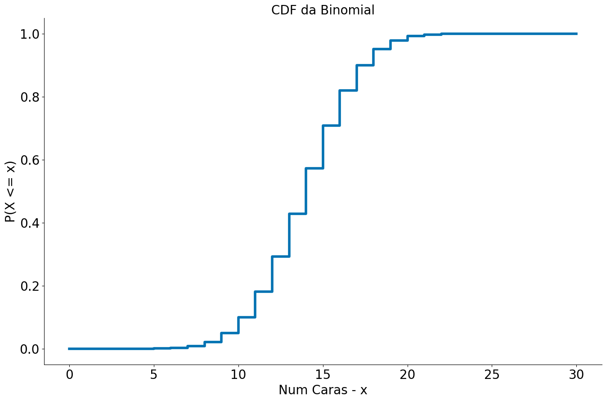
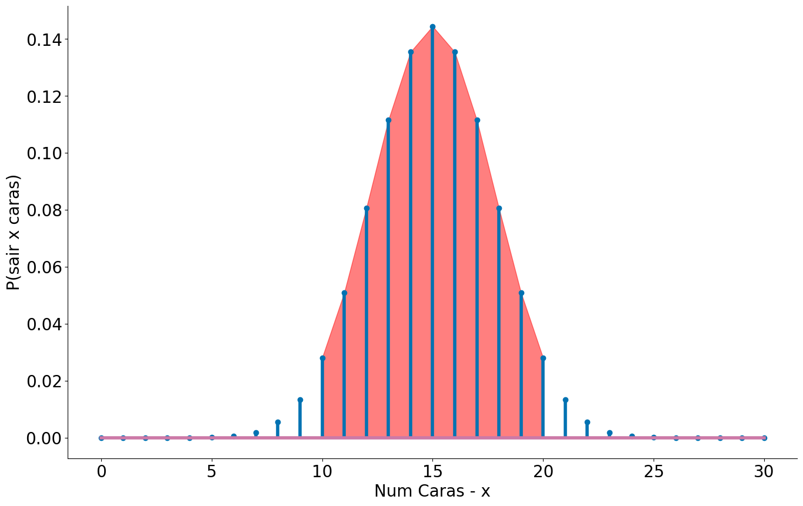
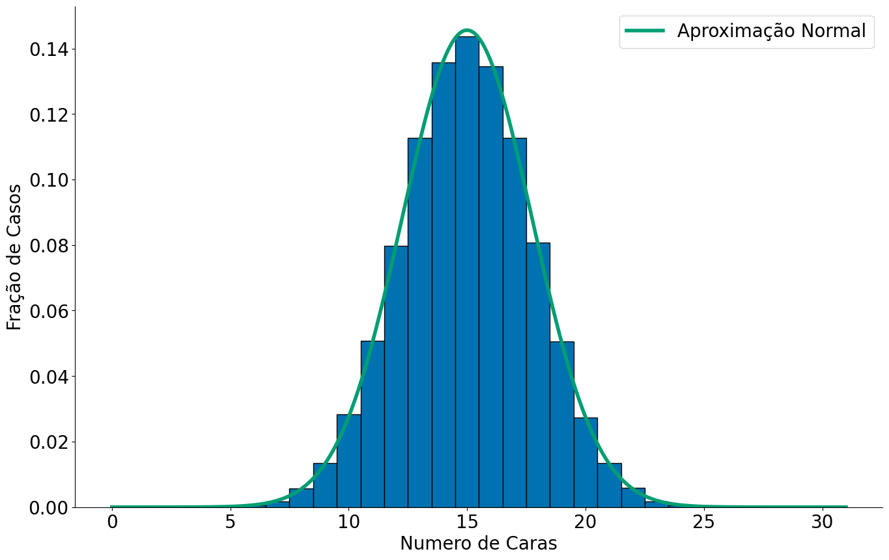
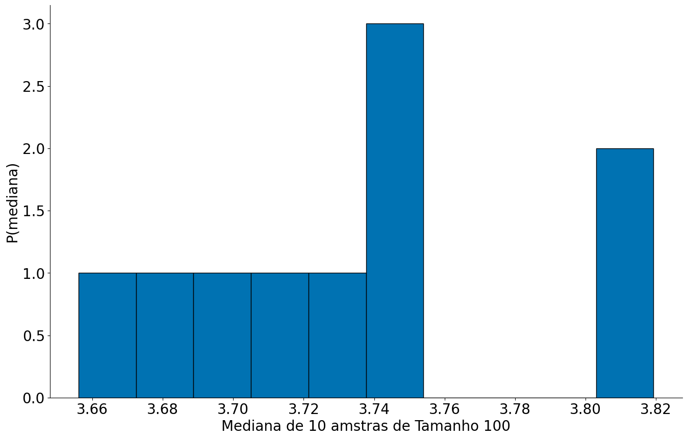

[](https://colab.research.google.com/github/icd-ufmg/icd-ufmg.github.io/blob/master/_lessons/09-ics.ipynb)

# Intervalos de Confiança
{: .no_toc .mb-2 }

Conceito base para pesquisas estatísticas
{: .fs-6 .fw-300 }

{: .no_toc .text-delta }
Resultados Esperados

1. Entender como a distribuição amostral faz inferência
1. Uso e entendimento de ICs através do teorema central do limite
1. Uso e entendimento de ICs através do bootstrap
1. Como os dois se ligam

---
**Sumário**
1. TOC
{:toc}
---


```python
#In: 
# -*- coding: utf8

from IPython.display import HTML
from matplotlib import animation
from scipy import stats as ss

import numpy as np
import matplotlib.pyplot as plt
import pandas as pd
```


```python
#In: 
plt.style.use('seaborn-colorblind')

plt.rcParams['figure.figsize']  = (16, 10)
plt.rcParams['axes.labelsize']  = 20
plt.rcParams['axes.titlesize']  = 20
plt.rcParams['legend.fontsize'] = 20
plt.rcParams['xtick.labelsize'] = 20
plt.rcParams['ytick.labelsize'] = 20
plt.rcParams['lines.linewidth'] = 4
```


```python
#In: 
plt.ion()
```


```python
#In: 
def despine(ax=None):
    if ax is None:
        ax = plt.gca()
    # Hide the right and top spines
    ax.spines['right'].set_visible(False)
    ax.spines['top'].set_visible(False)

    # Only show ticks on the left and bottom spines
    ax.yaxis.set_ticks_position('left')
    ax.xaxis.set_ticks_position('bottom')
```

## Introdução

Vamos explorar a ideia de intervalos de confiança. Inicialmente, lembre-se do teorema central do limite que diz: se $X_1, ..., X_n$ são variáveis aleatórias. Em particular, todas as VAs foram amostradas de uma mesma população com média $\mu$ (finita), desvio padrão $\sigma$ (finito). Além do mais, a geração de cada VA é independente da outra, sendo toas identicamente distribuídas. Quando $n$ é grande, então

$$\frac{1}{n}(X_1 + \cdots + X_n)$$

é aproximadamente distribuído por uma Normal com média $\mu$ e desvio padrão $\sigma/\sqrt{n}$:

$$\frac{1}{n}(X_1 + \cdots + X_n) \sim Normal(\mu, \sigma/\sqrt{n})$$.

## Distribuição amostral e Intervalos de Confiança

A distribuição dos valores de uma estatística a partir de amostras é chamada de *distribuição amostral* daquela estatística. Ela tem um papel importante, porque é a partir do entendimento dela que estimaremos quanta confiança temos em uma estatística que estamos calculando a partir de uma amostra. No exemplo acima, cada $X_i$ é uma amostra e $X_i/n$ é a média desta amostra. Então, $\frac{1}{n}(X_1 + \cdots + X_n)$ é a distribuição amostral das médias!

O principal a entender aqui é que se conhecermos a distribuição amostral, saberemos quão longe normalmente a estatística calculada para uma amostra está daquela calculada para a população. Sabendo isso, podemos calcular uma margem de erro para a estimativa feita a partir da amostra, tal estimativa será o nosso intervalo de confiança.

Vamos iniciar com um caso que conheçemos a distribuição da população.

## Exemplo Moedas (Caso onde Sabemos da População!)

**É importante falar que por um bom tempo este notebook não vai computar ICs, preste atenção no fluxo de ideias.**

Por simplicidade, vamos fazer uso um exemplo de lançamento de moedas. Isto é, vamos explorar a probabilidade de uma moeda ser justa usando estatística e amostragem (conceitos não exclusivos).

Lembrando, temos um espaço amostral:

\begin{align}
\mathcal{S} &= \{h, t\} \\
P(h) &= 0.5 \\
P(t) &= 0.5
\end{align}

No caso das moedas é simples saber a **distribuição da população**. O número de sucessos de lançamentos de uma moeda segue uma distribuição Binomial. A mesma se parece bastante com a Normal. A PMF de uma Binomial é:

$$P(k; p, n) = \binom{n}{k} p^k (1-p)^{n-k}$$

onde $n$ captura o número de caras e $k$ o número de lançamentos.


```python
#In: 
p = 0.5 # probabilidade de heads/tails
k = 30  # temos 30 jogadas
x = np.arange(0, 31) # Valores no eixo x
prob_binom = ss.distributions.binom.pmf(x, k, p)
plt.stem(x, prob_binom)
plt.xlabel('Num Caras - x')
plt.ylabel('P(sair x caras)')
despine()
```


    

    


Usando a função `ppf` podemos ver onde ficam $95\%$ dos lançamentos de moedas. Para isto, temos que considerar $2.5\%$ para a esquerda e $2.5\%$ para a direita.

A `ppf` pode é inverso da CDF. Pegamos valor no percentil, não o percentil dado um valor.


```python
#In: 
p = 0.5 # probabilidade de heads/tails
k = 30  # temos 30 jogadas
x = np.arange(0, 31) # Valores no eixo x
prob_binom = ss.distributions.binom.cdf(x, k, p)
plt.step(x, prob_binom)
plt.xlabel('Num Caras - x')
plt.ylabel('P(X <= x)')
plt.title('CDF da Binomial')
despine()
```


    

    


```python
#In: 
# 2.5% dos dados P[X <= 10] = 0.025
ss.distributions.binom.ppf(0.025, k, p)
```


    10.0


```python
#In: 
print(1-0.025)
# 2.5% dos dados para cima P[X > 20] = 0.025
ss.distributions.binom.ppf(1-0.025, k, p)
```

    0.975


    20.0


**Caso 1: Quando sabemos a população é fácil responder a pergunta**

$95\%$ dos lançamentos de 30 moedas justas deve cair entre 10 e 20. Acamos de computar lá em cima usando o inverso da CDF `a PPF`.


```python
#In: 
p = 0.5 # probabilidade de heads/tails
k = 30  # temos 30 jogadas
x = np.arange(0, 31) # Valores no eixo x
prob_binom = ss.distributions.binom.pmf(x, k, p)
plt.stem(x, prob_binom)
plt.xlabel('Num Caras - x')
plt.ylabel('P(sair x caras)')
despine()

x2 = np.arange(10, 21) # Valores no eixo x
prob_binom = ss.distributions.binom.pmf(x2, k, p)
plt.fill_between(x2, prob_binom, color='r', alpha=0.5)
```


    <matplotlib.collections.PolyCollection at 0x7f8f40708d90>


    

    


## Simulando

Agora, vamos assumir que não sei disto. Isto é, não sei nada de ppf, pdf, pmf, cdf etc. Mas eu sei jogar moedas para cima. Será que consigo estimar o mesmo efeito?!


```python
#In: 
# Jogando uma única moeda
np.random.randint(0, 2)
```


    1


```python
#In: 
# Jogando 30 moedas
np.random.randint(0, 2, size=30)
```


    array([1, 1, 1, 0, 0, 1, 1, 0, 1, 0, 0, 0, 0, 0, 1, 1, 1, 1, 1, 1, 0, 0,
           0, 0, 1, 1, 0, 0, 0, 0])


```python
#In: 
NUM_SIMULACOES = 100000
resultados = []
for i in range(NUM_SIMULACOES):
    jogadas = np.random.randint(0, 2, size=30) # joga 30 moedas para cima
    n_caras = (jogadas == 1).sum()             # conta quantas foram == 1, caras
    resultados.append(n_caras)
bins = np.arange(0, 31) + 0.5
plt.hist(resultados, bins=bins, edgecolor='k');
despine()
plt.xlabel('Numero de Caras')
plt.ylabel('Fração de Casos')
```


    Text(0, 0.5, 'Fração de Casos')


    

    


**Caso 2: Quando sabemos gerar dados que seguem a população é fácil responder a pergunta.**

Podemos verificar o resultado empiricamente na CDF. Estou usando `side='left'` pois por motivos que não entendo o statsmodels faz `P[X < x]` e não `P[X <= x]` por default. Com side `left` corrigimos isto.


```python
#In: 
from statsmodels.distributions.empirical_distribution import ECDF
ecdf = ECDF(resultados, side='left')

plt.plot(ecdf.x, ecdf.y)
plt.xlabel('Num caras')
plt.ylabel('P[X <= x]')
despine()
```


    

    


```python
#In: 
np.percentile(resultados, 2.5)
```


    10.0


```python
#In: 
np.percentile(resultados, 97.5)
```


    20.0


```python
#In: 
ecdf(10)
```


    0.022150000000000003


```python
#In: 
ecdf(21)
```


    0.97919


Até agora eu estou assumindo muito.

1. Sei da população
1. Sei amostrar de forma uniforme da população.

E quando eu estiver apenas com 1 amostra?!

1. amostras = []
1. para cada amostra de tamanho 100:
    1. amostra[i] = np.mean(amostra)
1. plt.hist(amostras) --> normal
1. estou trabalhando com uma delas: amostra[10]


## Quando não sabemos de muita coisa

**Preste atenção a partir daqui**

Não sei nem jogar uma moeda para cima. Desempilhe o TCL.

Lembre-se que distribuição Binomial captura a **média** de caras esperadas em _n_  lançamentos. Note que, ao somar cada um dos meus experimentos estou justamente voltando para o **TCL**. A distribuição amostral aqui é a média de caras a cada 30 jogadas. Assim, podemos ver a aproximação abaixo.


```python
#In: 
bins = np.arange(0, 31) + 0.5
plt.hist(resultados, bins=bins, edgecolor='k', density=True);
plt.xlabel('Numero de Caras')
plt.ylabel('Fração de Casos')

x = np.linspace(0, 31, 1000)
y = ss.distributions.norm.pdf(loc=np.mean(resultados),
                              scale=np.std(resultados, ddof=1), ## ddof=1 faz dividir por n-1
                              x=x)
plt.plot(x, y, label='Aproximação Normal')
plt.legend()
despine()
```


    

    


**Qual o siginificado do plot acima??**

1. Cada experimento foi n-lançamentos. Tiramos a média dos n.
1. Tenho a variância das médias, ou seja, a variância do estimaodor (lembre-se das aulas passadas)
1. Resultado final --> Normal!

Observe como com uma única jogada de 30 moedas eu chego em uma normal bem próxima da anterior!

Cada jogo é um vetor de booleans.


```python
#In: 
np.random.randint(0, 2, size=30)
```


    array([1, 1, 1, 0, 0, 1, 0, 0, 0, 1, 0, 0, 1, 1, 1, 0, 0, 1, 0, 1, 0, 1,
           1, 0, 1, 1, 0, 0, 1, 0])


A média é a fração de caras


```python
#In: 
np.random.randint(0, 2, size=30).mean()
```


    0.5


E ao multiplicar por 30, tenho o número de caras, afinal foram 30 lançamentos.


```python
#In: 
np.random.randint(0, 2, size=30).mean() * 30
```


    14.0


Colando tudo junto, note que estou computando o desvio do estimador! Para isto, use a variância do estimador.

$Var(\hat{\mu}) = s^2 / n$

$Std(\hat{\mu}) = s / \sqrt{n}$


```python
#In: 
uma_vez = np.random.randint(0, 2, size=30)
mean_uma = np.mean(uma_vez)  * 30
std_uma = np.std(uma_vez, ddof=1) * 30 # o desvio padrão é na mesma unidade da média
std_est = std_uma / np.sqrt(30)
```

Observe uma normal muito próxima da anterior com uma jogada!


```python
#In: 
x = np.linspace(0, 31, 1000)
y = ss.distributions.norm.pdf(loc=mean_uma,
                              scale=std_est,
                              x=x)
plt.plot(x, y, label='Aproximação Normal com Uma Amostra')
plt.legend()
despine()
```


    

    


Observe que ao fazer várias amostras existe uma variabilidade na normal estimada. Vamos entender teóricamente.


```python
#In: 
for _ in range(30):
    uma_vez = np.random.randint(0, 2, size=30)
    mean_uma = np.mean(uma_vez) * 30
    std_uma = np.std(uma_vez, ddof=1) * 30
    std_est = std_uma / np.sqrt(30)
    x = np.linspace(0, 31, 1000)
    y = ss.distributions.norm.pdf(loc=mean_uma,
                                  scale=std_est,
                                  x=x)
    plt.plot(x, y)
despine()
```


    

    


## ICs com Normal

Considere o caso que tenho **UMA** amostra apenas. Aqui eu não tenho mais distribuição amostral, pois só fiz uma coleta de dados. Felizmente, eu tenho algo para me ajudar, o TCL.

Quando o TCL funciona, podemos computar o intervalo de confiança usando uma Normal. Essa é a base comum que motivamos algumas aulas atrás. Vamos brincar um pouco de shiftar/escalar nossa Normal. Sabendo que:

$$\frac{1}{n}(X_1 + \cdots + X_n) \sim Normal(\mu, \sigma/\sqrt{n}).$$

Vamos fazer:

$$Z_i = X_i - \mu$$

Note que estamos apenas jogando todo mundo para a esquerda $-\mu$. O valor esperado (média) de uma VA X, $E[x]$, menos uma constante $c$ nada mais é do que $E[x]-c$. Além do mais, a variânçia não muda. Veja as propriedades no Wikipedia. 

Assim:

$$\frac{1}{n}\sum_i Z_i = \frac{1}{n}\sum_i X_i - \mu \sim Normal(0, \sigma/\sqrt{n})$$

Agora, vamos dividir $Z_i$ por. Neste caso, o desvio padrão e a média vão ser divididos pelo mesmo valor:

$$\frac{1}{n}\sum_i Z_i = \frac{1}{n}\sum_i \frac{X_i - \mu}{\sigma/\sqrt{n}} \sim Normal(0, 1)$$

Isto quer dizer que **a média** (note a soma e divisão por n) das **distribuições amostrais** $Z_i$ seguem uma $Normal(0, 1)$. Note que estamos assumindo que o TCL está em voga. Às vezes (quando quebramos IID ou Variância finita), o mesmo não vale, mas vamos ignorar tais casos. Bacana, e daí? **Não importa a população inicial, essa é a beleza do TCL!**. 

Então, mesmo sem saber a média real da população $\mu$, eu posso brincar com a equação acima. Primeiramente vamos focar na média $\frac{1}{n}\sum_i Z_i$, vamos chamar esta distribuição de $Z$ apenas. Sabendo que uma população segue uma Normal, eu consigo facilmente saber onde caem 95\% dos casos. Isto é similar ao exemplo das moedas e da Binomial acima. Porém, note que eu não assumo nada da população dos dados. 

Uma forma comum de computar tais intervalos é usando tabelas ou uma figura como a apresentada abaixo. Hoje em dia, podemos usar a função `ppf`. A mesma indica que 95% dos casos estão ente $-1.96$ e $1.96$. 


```python
#In: 
ss.norm.ppf(0.975)
```


    1.959963984540054


```python
#In: 
ss.norm.ppf(1-0.975)
```


    -1.959963984540054


Agora eu preciso apenas voltar para $X$. Para tal, vamos fazer uso de estimador não viésado de $\sigma$, o desvio padrão da amostra.

$$s = \sqrt{\frac{\sum_i ({x_i - \bar{x}})^2}{n-1}}$$

Fazendo $z=1.96$ e $P(-z \le Z \le z) = 0.95$

\begin{align}
0.95 & = P(-z \le Z \le z)=P \left(-1.96 \le \frac {\bar X-\mu}{\sigma/\sqrt{n}} \le 1.96 \right) \\
& = P \left( \bar X - 1.96 \frac \sigma {\sqrt{n}} \le \mu \le \bar X + 1.96 \frac \sigma {\sqrt{n}}\right).
\end{align}

Substituindo $\sigma$ por $s$: a probabilidade da média da população está entre $\bar{X} +- 1.96 \frac \sigma {\sqrt{n}}$ é de 95%. 

1. https://en.wikipedia.org/wiki/Variance#Properties
1. https://en.wikipedia.org/wiki/Expected_value#Basic_properties

## Computando um IC dos dados


```python
#In: 
# brinque com este valor um pouco, observe a mudança nas células abaixo.

TAMANHO_AMOSTRA = 100
resultados = []
for i in range(TAMANHO_AMOSTRA):
    jogadas = np.random.randint(0, 2, size=30) # joga 30 moedas para cima
    n_caras = (jogadas == 1).sum()             # conta quantas foram == 1, caras
    resultados.append(n_caras)
```


```python
#In: 
s = np.std(resultados, ddof=1)
s
```


    2.661434260550563


```python
#In: 
s_over_n = s / np.sqrt(len(resultados))
s_over_n
```


    0.2661434260550563


```python
#In: 
mean = np.mean(resultados)
mean
```


    14.74


```python
#In: 
mean - 1.96 * s_over_n
```


    14.21835888493209


```python
#In: 
mean + 1.96 * s_over_n
```


    15.26164111506791


```python
#In: 
# até aqui.
```

## Entendendo um IC

Diferente de quando temos uma distribuição populacional, temos que interpretar o IC diferente. Note que:

1. **Não estamos computando onde caem 95% dos casos da população**. Basta comparar os valores acima.
1. **Não estamos computando onde caem 95% das médias**. Bast comparar com os valores acima.

Estamos resolvendo:

$$P(-z \le Z \le z)=P \left(-1.96 \le \frac {\bar X-\mu}{\sigma/\sqrt{n}} \le 1.96 \right)$$

E chegando em:

$$P \left( \bar X - 1.96 \frac \sigma {\sqrt{n}} \le \mu \le \bar X + 1.96 \frac \sigma {\sqrt{n}}\right)$$

Ou seja:

**A PROBABILIDADE DA MÉDIA REAL $\mu$ CAIR ENTRE $X +- 1.96 \frac \sigma {\sqrt{n}}$ É DE 95%**

ou

**EU TENHO 95% DE CONFIANÇA DE QUE A MÉDIA ESTÁ ENTRE $X +- 1.96 \frac \sigma {\sqrt{n}}$**

ou

**95% DAS AMOSTRAS DE TAMANHO N VÃO CONTER A MÉDIA REAL**


```python
#In: 
# Construindo um IC
(mean - 1.96 * s_over_n, mean + 1.96 * s_over_n)
```


    (14.21835888493209, 15.26164111506791)


**95% de chance da média cair no intervalo de tamanho n acima. O mesmo não inclui o 22, então podemos assumir que o valor é não esperado.**

Observe que existe uma chance de cometermos erros, qual é?

## A situação mais comum na vida real

Normalmente temos *uma amostra* da população apenas. Daí não conhecemos a distribuição amostral. Mas gostaríamos de a partir da nossa amostra estimar onde está a estatística para a população. 

Exemplo: queremos estimar qual a proporção de pessoas que gostará do produto (a estatística) entre todos os usuários (a população) a partir do cálculo da proporção de pessoas que gostou do produto (a mesma estatística) em um teste com 100 pessoas (a amostra).

Repare que se conhecermos como a estatística varia na distribuição amostral (ex: 2 pontos pra mais ou pra menos cobrem 99% dos casos) e temos a estatística calculada para a amostra, poderíamos estimar uma faixa de valores onde achamos que a estatística está para a população _com 99% de confiança_.

### A ideia central que usaremos

Para exemplificar o caso acima, vamos explorar alguns dados reais de salários da Billboard. 
A ideia principal que usaremos, em uma técnica chamada *boostrapping* é que _usar a amostra como substituto da população e simular a amostragem através de reamostragem com reposição fornece uma estimativa precisa da variação na distribuição amostral_. 

Para implementar o Bootstrap, vamos implementar uma função para o bootstrap_raw. A mesma faz uso da função `df.sample` que gera uma amostra aleatória de n elementos retirados do df. O funcionamento é similar a função `np.random.choice`. Note que estamos fazendo um bootstrap da mediana, podemos fazer patra outras medidas centrais.

1. Dado `n` e `size`
2. Gere `n` amostras de tamanho `size` com reposição
3. Tira a mediana (podia ser média ou qualquer outra medida central)
4. Retorne as novas amostras e veja a distribuição das mesmas


```python
#In: 
def bootstrap_median(df, n=5000, size=None):
    if size is None:
        size = len(df)
    values = np.zeros(n)
    for i in range(n):
        sample = df.sample(size, replace=True)
        values[i] = sample.median()
    return values
```


```python
#In: 
# 1. lendo dados
df = pd.read_csv('https://media.githubusercontent.com/media/icd-ufmg/material/master/aulas/09-ICs/billboard_2000_2018_spotify_lyrics.csv',
                 encoding='iso-8859-1', na_values='unknown')
# 2. removendo na
df = df.dropna()
df = df[['title', 'main_artist', 'duration_ms']]

# 3. convertendo para minutos
df['duration_m'] = df['duration_ms'] / (60*1000)

# 4. apagando coluna antiga
del df['duration_ms']
df.head(5)
```


<div>
<style scoped>
    .dataframe tbody tr th:only-of-type {
        vertical-align: middle;
    }

    .dataframe tbody tr th {
        vertical-align: top;
    }

    .dataframe thead th {
        text-align: right;
    }
</style>
<table border="1" class="dataframe">
  <thead>
    <tr style="text-align: right;">
      <th></th>
      <th>title</th>
      <th>main_artist</th>
      <th>duration_m</th>
    </tr>
  </thead>
  <tbody>
    <tr>
      <th>1017</th>
      <td>Unsteady</td>
      <td>x ambassadors</td>
      <td>3.225767</td>
    </tr>
    <tr>
      <th>1018</th>
      <td>Too Much Sauce</td>
      <td>dj esco</td>
      <td>3.718217</td>
    </tr>
    <tr>
      <th>1021</th>
      <td>Key To The Streets</td>
      <td>yfn lucci</td>
      <td>4.699783</td>
    </tr>
    <tr>
      <th>1024</th>
      <td>Careless Whisper</td>
      <td>wham!</td>
      <td>5.205917</td>
    </tr>
    <tr>
      <th>1025</th>
      <td>Faith</td>
      <td>george michael</td>
      <td>3.220000</td>
    </tr>
  </tbody>
</table>
</div>


Imagine por agora que os dados que temos de apenas 100 música Billboard são completos. Sei que tenho mais no `df`, mas preciso de small data aqui para executar o notebook.


```python
#In: 
df = df.sample(100)
```


```python
#In: 
plt.hist(df['duration_m'], bins=30, edgecolor='k')
plt.xlabel('Duração em minutos')
plt.ylabel('P[mediana]')
despine()
```


    

    


A mediana foi de:


```python
#In: 
df['duration_m'].median()
```


    3.688225


Se calcularmos a mediana do números de novas músicas para três amostras de 1000 elementos, teremos 3 resultados diferentes. Estamos usando 1000 pois é o mesmo tamanho da nossa **falsa** população. A ideia do bootstrap é usar amostras da amostra original como diferentes visões da população.


```python
#In: 
for _ in range(3):
    print(df.sample(len(df), replace=True).median())
    print()
```

    duration_m    3.674117
    dtype: float64
    
    duration_m    3.662225
    dtype: float64
    
    duration_m    3.64845
    dtype: float64
    


Se fizermos isso muitas vezes podemos ver como essa variação acontece. Em particular, vamos fazer 10000 vezes. Note que o código abaixo é essenciamente o mesmo da função `bootstrap` acima.


```python
#In: 
S = len(df)
N = 5000
values = np.zeros(N)
for i in range(N):
    sample = df.sample(S, replace=True)
    values[i] = sample.median()
print(values)
```

    [3.65463333 3.77355833 3.77555833 ... 3.79645    3.80211667 3.69533333]


```python
#In: 
plt.hist(values, bins=30, edgecolor='k')
plt.xlabel('Mediana da Amostra de Tamanho 1000')
plt.ylabel('P(mediana)')
despine()
```


    

    


Usando a função score at percentile sabemos onde ficam 95% dos dados sintéticos.


```python
#In: 
np.percentile(values, 2.5)
```


    3.628775


```python
#In: 
np.percentile(values, 97.5)
```


    3.834225


Acamos de construir um **IC**.

Pegando por partes: 

 * Consideramos a amostra $A$ que tem tamanho $n$ como sendo um substituto da população  
 * Repetimos $b$ vezes o seguinte processo: criamos uma amostra de tamanho proporcional a $n$ obtendo elementos aleatoriamente de $A$, repondo cada elemento depois de cada sorteio. 
 * Calculamos a estatística $e$ que nos interessa (média, mediana, desvio padrão, o que for) para cada uma das $b$ amostras. 
 
Como resultado, sabemos como a estatística $e$ varia em uma simulação de $b$ amostragens. Podemos usar os percentis para criar um IC. Assim, se estimamos que em $P[E <= e_l] = 0.025$ e $P[E > e_h] = 0.025$ ou $P[E <= e_h] = 0.975$, nosso IC será: $(e - e_l, e + e_h)$.

1. Podemos usar bootstrap para tendências centrais não extremas.
1. O bootstrap falha quando os dados tem cauda pesada.

Um pouco de código de animações abaixo, pode ignorar o mesmo!

**Ingore daqui, caso queira**


```python
#In: 
def update_hist(num, data):
    plt.cla()
    plt.hist(data[0:100 * (num+1)], bins=20, edgecolor='k')
    plt.xlabel('Mediana da Amostra de Tamanho 1000')
    plt.ylabel('P(mediana)')
    despine()
```


```python
#In: 
values = bootstrap_median(df)
fig = plt.figure()
ani = animation.FuncAnimation(fig, update_hist, 30, fargs=(values, ))
HTML(ani.to_html5_video())
```


<video width="1152" height="720" controls autoplay loop>
  <source type="video/mp4" src="data:video/mp4;base64,AAAAIGZ0eXBNNFYgAAACAE00ViBpc29taXNvMmF2YzEAAAAIZnJlZQAAuu5tZGF0AAACrQYF//+p
3EXpvebZSLeWLNgg2SPu73gyNjQgLSBjb3JlIDE2MCByMzAxMSBjZGU5YTkzIC0gSC4yNjQvTVBF
Ry00IEFWQyBjb2RlYyAtIENvcHlsZWZ0IDIwMDMtMjAyMCAtIGh0dHA6Ly93d3cudmlkZW9sYW4u
b3JnL3gyNjQuaHRtbCAtIG9wdGlvbnM6IGNhYmFjPTEgcmVmPTMgZGVibG9jaz0xOjA6MCBhbmFs
eXNlPTB4MzoweDExMyBtZT1oZXggc3VibWU9NyBwc3k9MSBwc3lfcmQ9MS4wMDowLjAwIG1peGVk
X3JlZj0xIG1lX3JhbmdlPTE2IGNocm9tYV9tZT0xIHRyZWxsaXM9MSA4eDhkY3Q9MSBjcW09MCBk
ZWFkem9uZT0yMSwxMSBmYXN0X3Bza2lwPTEgY2hyb21hX3FwX29mZnNldD0tMiB0aHJlYWRzPTYg
bG9va2FoZWFkX3RocmVhZHM9MSBzbGljZWRfdGhyZWFkcz0wIG5yPTAgZGVjaW1hdGU9MSBpbnRl
cmxhY2VkPTAgYmx1cmF5X2NvbXBhdD0wIGNvbnN0cmFpbmVkX2ludHJhPTAgYmZyYW1lcz0zIGJf
cHlyYW1pZD0yIGJfYWRhcHQ9MSBiX2JpYXM9MCBkaXJlY3Q9MSB3ZWlnaHRiPTEgb3Blbl9nb3A9
MCB3ZWlnaHRwPTIga2V5aW50PTI1MCBrZXlpbnRfbWluPTUgc2NlbmVjdXQ9NDAgaW50cmFfcmVm
cmVzaD0wIHJjX2xvb2thaGVhZD00MCByYz1jcmYgbWJ0cmVlPTEgY3JmPTIzLjAgcWNvbXA9MC42
MCBxcG1pbj0wIHFwbWF4PTY5IHFwc3RlcD00IGlwX3JhdGlvPTEuNDAgYXE9MToxLjAwAIAAACbB
ZYiEABL//vet34FNwEDta7pXOLTLq5Q0PVH2lKZ4tkgAAAMAAAMAAAMAAAMDJJlQptRHDh/oPAAA
AwAAH0AAV0ACKgASI0r1qf+LTHgACorrFk69/UjDp43SADX96ceXr1HAVtN2U0DL1LLZ6Li6QPX6
JiGWVz2xIRdLkZ2alqSfEdgb/SvQiKN7t5HgKGWWkrxxhtwGYbvthDMmIzJTf/7bz7qR5u/w1j9V
d+po5HRd/8Z2sReOhsKCSsYIOiGj5jha0UCzpJjd9gcObXfychWufWoX7Rc+LTmLumC/z7JBWg0F
spJNfs95DgOBdhlouctzQVlJvZzI6Y8YAdTkW6jBdSX/SmV5ao2ck98caTGbGrZuYF3h+sVCtmzZ
Z2Frn5kzOYeu7F6uy5fAjJhxtWPfY33P2F8Yd6B21GXaNiQieIA3mSLn3Xg6JZBwQF0Ekwupc6/r
iAc0o6AvWWp9tJpf+ugSZzwNb3v82LE2nDvkvBacL7yFVv/ES0PoprnTAQi+RaQNo3dEF+hHBsAG
phXgiSjweD8vgBCphSYsUm3c36C5UtMW0/oOpoxkQmOAK6wKCvwQHlseQJEbiX5wK1kU/SqTBP2S
JImBlS+uGqCoPLPRQ1gw0H3049PStTS1vn6VCjEfhtbqLuTo0wBJaczx9CK5iLAIQhqOq4Idgxcl
vTJ6Zdwtnm+hAdXykRmB3JrctAPah8twkCWksTsFe8JzQiQ04X7/QqHZGT7K85EKEuaCqTAbI7Jx
995iObAsZFi5M8Ru/S3C52vkb4ODRzMg+ET6eX6m7l9QuLXkRX4wZNt82BWXJCq9TO6xCtZNZRxJ
jaTNnIJ9aYpYSUAVf44ABFHyABiRwACiRUAdgXJYmHrnyWjY6I7HuFtC7eyR5FtZZDjQ4AwNf5AE
LXdN1Bnonnv/GDbXSTi+ULOpGdmMhmfsNwxUIqQS5PRlBMBR6M1MYefop4lmIkZ0qmxZ1wTBZ+Za
SNV1Qdwic1bkpe4r04LhIRgnMpt0Y0Q5jW0+wGznUFgTgXddmxzYlZwNat9hhevfTPnfLcgl0Dl+
OTTrWUVWZWHZrTYVuEFda/AIul5bdraaxBQDggAiH2x/ivaSf5v2K0jUJ27UIlzzPgNMdP+MGOML
1g/+UAsTpP1JE8osBaFYskZyZtBCJ6g5cexUssdUolQkqxt31PcffCxfo1miTjVFzzsQECPoinJj
93HCklVqbNDrRGckfTKNxAq+o9iqLstkWZY0A6qPxLI3/5EnUPzRkxOQJDtMhJ/3CzGYhVyFnhD8
/ySer1OfPKZM73WXVi/abWPVNwfJ+IYUVY9IVi40JCqGXkD92tvhnGMBJ+/gBVsUckkDbJvk+YyQ
1D/t46D1qKyWDPg4c7UWu34NyelXipUsOv5/aED8cuQVvPlAtcn2ZdK+9O821M5qPuPD7BEUpgdq
D+5v0sv5c58jLsaGD6zeN0HaxClV8FpIVUTAqJMXsHrsGlMbJsyiIaX/rHPaBII/6nzsCzlfnUP6
2j7i+K041tuBlGj3PE8syC7hlLsHgf1niAZPOePmTC6C2YjzZbNo6xoOtvlqEN1okDnLfD9ZSvTG
i6ufPiT9kl0z0fQe0aR2J+BTqVOZXVOzy8J/zVDL84zHbn/PE9bhitHoPki7kbF3N+TPBMPvsB9U
3BPjgKGkYKFQ+m0SkPexj+WkBssQVkZJJ6mqgjt3ILd1gZrCt/Zj9q0CocjDyQngBj9npGChUPps
7zbZY9Q9NTBybLjOi324S7xz7QFWZz/mwTycmyeOkBEP3r5FJn0GtwPLcQiEl2Zs6J0GHdnaKKbP
BqkNLMwCNubLSvWCoPtJOKDj7I//NYvVC1XQgrv3lcMpoBUgwDMPpgpbznQ5nujisjbc5kkLnNu1
dpLdLYGPMrlAf3H1Xnxl8Q++U3Ak4NHFl1WaWzzzAgsOnXfeAlQ+MSYnZ2NIU8BoiHTcCxuMud1N
ZNeUXO887vm8Te8OFKM3DyS9oxNYlUb7BmupD7zbN1F8urAlVy71uN7G5bNi4TiC4BOD28FzhsBw
oieHM1/JN9W9oouMkELYHd2Jz8Ixam8x51BzICVaqPibe0IZtyk+smNSsVdFbs2MvyO/qsyO8uxG
xcJadmbI130DhZ6QT6gc9xRH3xzgdqUg2AfHNweDD/q23TcLEPtoLqu9GG2h/KTy2wB1Gk2/Jm+8
+CNQe9umacSyQHvTTR40tiAit8c+hFKGav2eGAjUiX7xCsgskGJojHBO8qcBc5tl3i5BGUI/Dvfs
px+Ykp4DoL+jfyKvIGQ6debhO3jWqcNt+pO3D7Z+5LQKLsGMGtcKHVo/PDDM+KFEl3UXzx1lqVT9
0tHW9vKwsosG583pCwU37xfimVTqWtssepgaLMllAnwaX2Jb/9WnseKrs7XEIfc/xiyeqhHUXEbg
rzgqOouMbuG8f23AQn863Irm8plNFL5g0qNXvtvsy/R+el+VqxNJ4p7vDmxXBVzvOnJjgDSGAjNw
K37zUCTPT5Ow5fmi2M8djYBXl+ioFOm369k/VowRnpC7DM2D77spT9fSZ6f7Kni5tOO7xuq+e6cB
jmeb/+4pXw6o9JqGYO6oAbjHFwffI493deuNjt3ccUs6vnUruu4bdQxFoOu3/cU9eUv0XKmO9F1i
7mSkIg0qUvbXIzhBvOh+F3VeTbqN1GquPvOYt0xOIiLED7a1Ynnm5qHjTWUxZqmUngfjd8p1YyEZ
MV5qm1SQttKKnFuTL8UG0uGbNzhZbMbXOKmmvgcRVgxYdL84BGN9urunW7H/Q+toRU5gS1wtlT7y
kJ6cBvJWQ28Ram+1iF/fZqeMAn3U8tsz0nFO9PJN8gOezkPk9y5Whdlyksf4/L88h+GdAU51p/hf
0BPdlX2mAZREC/VTqMH332fqA0D3G8Ec3pEYm+Yt/2PzutjNCOatv2TUQog7O8V8AQg8tqFTdTmp
/62LABIaAGjfC115lH5Y02SFzhuYsTMUQw1aRpOkzwDT7vjRVE1BNrvZqhIif8dQ9XDXF+kY/lPI
H0pavLI3FdMQR2LDYPf4cug4rcqKiM9TMgDLoevq590Gf4tTpZSALLE8MUsnGxNHF6f54wQ0ZQui
UFHU+UgWTQrnzSSSMiDjebAzwM82PowG0Vvu0W2eeDKoZ38uvGFKMAI0/USqpieRfWbNwojO6V8i
dxITCOt9nYkK2rf0tFncXDJMUkcoQANN/iSXf++KoMKIbu8sG4fwBrqzoZeRUV50yFN8pRC0r5G0
ewUPlHmZfAhpzkcms16ekfsUjejOnmAUMjuMLhKXaRxb+6ZOWKQ/JcsT31wjxlgeJ/sw90ypydLn
rdIjVie/2CKViw5D3Dwlj1iB8j/3R5GTFpziDzsTjks6qwUEN+3fSsmWIMR722qTddKrB0xGyCzE
5xcV7FdBANGmiwEmUeWH1WwsL0PFoso4/VqSPkBBJAGrBzGvn/EJBY/HDQ7TRpHXW89HmYDyD3wk
pOOUp3FohiXXBKCnRB1uBJn9wVVSml+t38dKQnfW+KcICqYvIL3gzbye+H5SuDvofoZraVnAAwUJ
HrV2TM1DNjVsgGYKAtWXlcYox5kLt366um3nuJ0CcivAlqsEGOul/fhzKWuclSqn1VAZnvhw+G2L
oz7F31FjoCvontWSqkgcSFArRv3xzyeyGdiY8328KJVkCCz9/F9xFIkwBS6TDIqIXtf0BOhXCUQT
kPUn4v00f5lY3onFKT2Tk6PW7vYz6LHiEBGCASwZG7yHBHwEJVhoveKVJRXlvBLE4RU1yFQKriHh
EAD8OvNiwaoTaiC9Frx+qKWAzU+vDM3naZKgl2mr9FLBXDL+SFu5eWzhpeRCu58ShwdRh4j4XI+m
d6hmbSEiLqFtJFJWBdk4dh+yqcFA1YrI96lhOuTA/jE+2krCZLjU97hjAAA0tsPYG72vaTjdlhKN
Ism+5jrVA0PZH9HIJft5TOxMZt0+A6f1xmd0fcEGM0e1BFS0vcItcrsEbli6cwzi//6pzXqp0n3I
6HjKL2BIasKebo8rFgnQ/LG2u7XwEIAUrqvex4US9Z9+YAK8x+v2KQxePn57N721QBxCbays3Po6
S8nDz31BKUoR6FX/YWiXCsk0SLDp+ABKXNtMsOXQM3jGsuB23Y93Im7DoyH9mYFkHGKUrHy1691e
gjMut353yXn+9F3YmY4km+IfNLDEnX/SmdYYBbR6IfpZwuIKvOf+brzz/stusv7KvGEiUNBPLVI/
P88AAAMARpxDEFJpSHh6flmTXMR/xYpUxb5/hAATzAlu3xCdnT1Jh4QYl9iaugnBoFnZkPhz6VQ+
zw+roy+nGekXFUDjB+nRGjqf4y2q4sfH2S4CY68CX3rIMAHpAnwAAAMBr5kkuc86JWakaiWwnR4r
sDF3K33sbFV0Xq8lWsw4uutYBjdD0PkuIPVzoBOOvFS1kQU0wLMnf4HQL0/9cQ/rSuZwfFX3qniY
0GNdUYEzPNc+PS7XTgWGO3+zd8DSZkE/GBWeFlaIMFOCZH3ZRWDhlbEKpVSr1F/9RAf18xYcvXrj
31NEO1Cf///yl2PspAoylbLHZVyd0dIX/AHY2YLGq/M7paN9Z1EEk2mZpbE+qL7Z8mlK39y7gS8f
ODAlyxG4O48D+2SNu4tu/PU9Le8g809siRjB0o1FeDBD9ijQujJJKQH2H/kTuhDDSCzMkhwQ9EDA
S95TFPE5Z+siuaLDheAc4L+AoiIOd6+h3YaJTNK4oF7yvZtmNK61c5AEGWkZE/N0i0jvvCFea0PQ
EoLpDZPh6cz3UphtTlD13vo2gm7BpSEPZDAa19YM/oCIKs7SH+OUExVm/twrNG57MHw55MiDF/oA
BYlTShik+ttAjmedmybOA4pbzybrQHEGcvOPKkPoR/VZXaWDDDF3nyzAoZ6GJRKRMwmeZfW2EG7c
DGnsrQzfB/Iry2tnErIIY2wejK9VLN4vyO0EThECr4bwiX6q2J4PnwL2QvV7aE8P/XUjqtJDMK7A
Y6uJC6m3yVDt7y1emyA8YHsKn+1mX+hijuOn2pNktSZLCgxYC4EAs6q6lrBGWkWu+e895p87jsB5
KRfijiMKF4EK61FEMeFckgPRJzqsQf5aA9pdrpqy7/N4nSQTiObWqis/fJtFqTFIf6J0XdORFOMS
JpwwRMNEbqmdIpZHVNzXje5102VrSpMEXUUH3k4Y9Lm7BDCDTWLVcsgrS2B2hOcCqQHGRL63D+lw
M9jN2Qd6gml7fIj+fyP82a2AvvwH+6+Lc3gxRENLf95uVvTvqHK5FvnYuCRrBxnZs83KcPWQF9Qm
off2/WNQhi3xp43NABLXnySu4R9kn7UR8gvtK3b2rIupIANgXgE6CgnBi8K/0LbWaxtJ+q/2Ss78
0hMVHf4rJjklKL3/Ke1oeG9nSw4QGbirgf/VUHvYbjU7Ct8UeHY/bjnFFH1k0uISZHECX/t38HrS
m4M6+5P0F+UbPfMWDsMbXc/MYv1qblb5u50PkqUt2Eb8VvLRGo0JsCJUo4/ex/Qb//+zD1x4DIVC
BG/PIEhatjCZ0UmR7kGsfIulwTzH5AX9ndxkh1MIVHHgtybLJ9xQwE6WDx0TeV+vmujDlwlzhRyg
dj8Oy1dcS1WFA1P/kOKTQ9MPwLnZMu3bzu6+ApLZOPprlJkhObBTk85VRCSDU54OOz1z0NNAQNmy
nd2ksAW0se0JHWvbmmDaSuQiej72/7xfyySUK/lBIh0TeDK4IWzMi7VPz5rdvRTx2sV7+LY1saig
MW/b5GPO96OOjuR+WAWJXcI0cgyDaQujl+duGpP5MdCj9pqex7aXEjLZs9Dfi++IyWau/Q3jj3z4
TXbqgkZaJpcboLr188rOja8Qz/JEDYZDI4ZL5ArYQ7JPdC8jaOp7PyPX2BlhEAQOZeDitCkKaJgD
R1NM0ccyq8t7tQnLaZjI9vPJrkqrKNLpv6QNDsd43xhybYB4JAIrAlVqq4D85FEFbsnsuAByUCal
2XRW35wBjtG7hjPN0N8rC1bxua7uT8IDS7bwm5602NXSNJ+8aFNauHQSRAgYvJH1UTE7snS0Ojrg
LhXs1yCET5Q23Nyyaa8JjE4atEXWFWVF3wVpe9A5Tcr/95G9rnjvmJ6r8iDumXZDnes1MiOzbJ9I
X6ohN0bkEOThBKl7rd5wPt6u6rtT5mLI/yHrvaMFX74Q8QltbHNzCPB0tt4iIMokeQRBfhX/lF0t
J5cMWLQRMQ6z8P3fILecdyGJDVzjXt0L1cLZx2AX81/k/s7bGTohlzcd9PjhdL34ZPXXeTde4RDb
k2lfX3/09NvXI/+25ZaF8ta3oAjT8H2nwofOK/uU+RcPSFBd5Ow9WAWu07yqiyaVJGnpeld8qOxz
vVVBzqce/5SQh9RKglsgUvqsqtyvu0U9x7LepMoIE3/QyypY0zvJSzA2rQckRP8gUrnkogOTJQ6E
Pq6QRmXz6GpbbFRDEIUL1vQNLmfEJ2ydwwC9jYixTjJOZikIdd0B4otnEmIMi/xTtXuuZ82WIl1U
CYhBg3phU7JNXI1kVJeSfxArQif1NjYpY/HN7SD9Vke8czuJnXxevei07AmmLSvpgj2Q0g/fX/ml
Yd2/eJ3n4FVht1l+uFdy4sXszYbZb2hYxNcr8yxhlVLFx/7sjrYLbtiVvsEQeZ+uZP/Xdg6cRvjA
SaEL0YgUbN/WN93IVE5pp0FOGaXbLL//oaxkIwqGRj+xiSEU+w/z/OUpPLRnacuSjeAAknCFoZQ2
ua8D3ZP8zKrZmiZo3agk7wF/N6b/5CMrRe2mN46jjr1NwH0rZnmrrWehEbzYan0jQJar2q3xI0jv
ycSG45rWI2Rck6AntP4Ve0inLpT/3/VM2wuyTLhAA5ZFIuWt0p4tCuv+i6wIq7hu04aCAWJno1q1
SeGa5fJkKKq/IJvJPRVVSI3b5wR2UI1soQjmB0QsIQxE7m5VyuvGqZ84dTlq1Y/rC8oV/JTnwStS
fRJQNNbwbxjM1PL5qGbNGmAFcmmhfd30vLvKygLOrvTl9CddJg5NF5CiKD1QLC0K9+UIR4V4u4PH
SH+150MqZPSnBEW0b4P6Jr2Wsr5DyQc2FMq3iOLYWAeg3+T7Cjw/Ui9qP92Q+72DWXzRFOxDhi7u
RyFg8fMhAccy7gyvuRsppQkNYiCRSVK2VGrLaTjaXlOGw/03g70n8Qmipj7q6amnPWmRkGtdct6c
bWp2eTqbb+JfYsKEmphjlTjDKzOFB7Xe39PtiYS97+4NBLLJiIgkJCaDFwO4+jrWoSl7KAJroVnq
2XfhqSbm5qqTyiJfI2f+cUD2izhEpNmVl6tl3heMELB8Vb3ilNsaa13A0amsb9HbVJ7uKTKOKf+p
DxhgXLzlRluRrv3h4jFibnqSz5qks+nB8asJDNwTL3EUhw8z+/93f2ibE8yUPtAISvTshF5tI2eW
SKdQDkCUmrvwgSU2L+bij7M0zCJqGs1t9c1KBk1vOjnvSWpSCTkbsxrsoBJGGBRdGORGBLns+0IV
zKcdThF6r8zkIoMuyWueDNHFpk//kJTVE7aah99juoSIPU0zqSo45ErdR+bRkfMDKAhPXhtVu81Q
IFgj7bdC8xhHnmUxcuQdlkDOIexyC7X99DHMj6hQ1A6ZTAMhsQlNL9QsAIqQpKsQot5mQb8/Zk5b
ds6blBEoF65lWHSaB6MU9TXuGrU60I0TtzQZpO9oXEOG8FOE9EZrxRXfvNQPNLHW52V1JTf+tXK0
fg/5ZfDy3LMRVLXKX6/KQ3w6afNmw7VWAhagDJbr7Ur3d2TDcuccOqPQljEcJ6LXtc8V4IuAxXUi
OYP51BslD4hnd8KMHQD19LlQN90tTOaFLELkVDTvMCCoj/I5VwKdCPNAcay096la8oF13XJhC/j7
55IV5HmXqJ0xb3wF2I/xKA8CogHKCjwNn1INmvonZVH8KHnZI/1elWGrVgdC5xbruoW+r9PB/XGw
IT9E+yj9Q+QRMgGy5YkLKf+DkIaw5Wh6pvMwZMKq6DmOe6u8tKBKSq974pO4Nt/JoxYym5ZPN1rU
4sk9upWfnIBzlPVMXNVIaxVDTk/oQE5KSXsI+A/4gAH4zTN2zyLToLIiG8jdUlc3DW4fC36rIrgK
erslI4rpyPSJrBZimKPOhzXjlOP3mggI68Iiwg/7zizm9KBmx5lPRsVjA2tUTnQPOFpgPY8ObYif
mv5pQ6HxprbxsP+wikwsGHQ4Zl2N5Mt3YHHsaBm2hBNs6ryRLTxhEkilbN/6YWbtZIAQIes2gDD4
fR4cF3ZCK3sdASdKsm6vQPkkxfl24PBAz2XuIuOLCGzgedMbvnuCX7Vri/kc3LUN31MY4Nyvxv+E
MbJpp1TPgAUAu1oQ2PkjvhjqDdwqjxmACC44HHdL9RtYXHT5d8BiueVAF2vlcCZDF4fI1QN+mDvS
Ap1/eJHtu3M79MFfYUrZ5Axn2AfeMVF2eZ4nPd1BsFd63qJdAPaTa7on/7LcpbAcUO+0fw+KIuA2
omlYbSwbLHHyNMc15b2EZUXVg6cHY5eFTjLyfiNjSi/qZFQhTwuTYce3Y5dzZMWJmvYrQAhecC8Y
iEx5hQ/5CLvq1bP4b6CckMps0j4XRJ/3egHEAPYUk/5EMpCkiMXf4rqeFBRvWMIP68+x5TjhlJNK
hboDdxxUqpEbzqpsMXUhP1Y3c4e72L3csSV+uJcWW94vcTXBYpxfmKVJUVvgFlCqrsVE6GOgzGQS
T1JGEu2jO2NXDUVXmPqdnowC8LdnrOxkY/VqB0HeZRdxayf4bTXBpEWoeERzAJMYF27jomvyjl/q
2H2PR1/dN1Kqhsa6i77n/K4YMq4e7rUgk1eleFaYn11TS5PI7gmbQljvN7Q/QuSdE2nDaYS3xbtq
Fd/tblyjjkS4DQbHG3Gt2Kn/5PY9taR+PiRateL15NfgaiDtznDZotv3l5S6R9M8L2cyrpyw+gBT
QAAAwGahSqlDaQEgiST0A/nh55+POG9A5scNmL2mBAwNNZHG+vuR5vj+5n0TX1RPPyTo2cE9A3VU
UrG+W5UC4yAd1kNeeLH/DXBv+8mnGGNVrECVd9sjePVF8FLJ2BxHvDClsk2oaHQqlW1GpSxMqtIw
YPxW2Eu0zCUWuX6so0wr+R5sSLUjgyop282nZZKa+85PlT/plTVrY6zeFWf44Q1eF+JeGylZQki1
lz2UewEMWrziR+5JNsdOzvGm42SyJukEBGvkdAwoGNNw6JPQbfxXStwUW9/S7cJWTJcmT8n68eP/
4zwraNd6cYBMR94ZljcY5MELDL3LkTxa3tmlhl38QPw6T1BOp1mMtwV+Br6afNEL7CI1N8JTHK6v
xQGoIURJMiNLQc9TGDsDnzI9NKCIjyW0xv/mYgiLl8A/E+iw2SfojhkHH7MiUI2T6WoGjdmuycmv
Kx9avbsWkh9uzJ2n4Z/qOmf90uqSx0HVeWviQM1dnqZFfhRwrriuDZDyYPKcKF291ezutUJLht3h
4N58Vul3ycvzpYVtb2vLtNGWocEFho8bp907Qyz71ANY4YbCzfcykpLaO6FWZx/TkoF242sV4WUQ
z7zbZC9ILhehPnBjwwmOfv/YUC3md0SV5M08dOoggK4d5swfBCr8MXDKi6IMLYS1EhXEDBnAUkIY
mOWHnBex2TVOK0IRx84md1gD57xdOHm7cwXLImg49VrwNuSiN9AatuuNJ8pjatwzmkqktiCeHtp7
qWhzRufu8QKl20Uqojcp0Xw6/kY8k3mpwR/RaxTc++O/Vg5acaJBdIzhTLXKpbcNU5eJNiLtyta+
d8XFsi+HnJVBs3SJWEyaCj20EpGaUvbuDu20zqDiVwTUaMqnKHeNdT5PKHxGYK57BnIgVajBBrRG
fitWfrFlEZEvlGvmLI8CjGgXuRpMIaBvPCI+I3nGzHZnn2G10pZop6wnb+NkxU9JlerW0eUUnQve
bVLYLAFDCW9qVplCGB3FURFCwM5goRTtZyC67N8UWAd2ANQ8sB1wgYUZ6glaniPYEksvfxr94BGU
t3vWILRhlms7cM92FOw4cDucwasMuwjW6xdnpEdVQvkzTXTOZh+eMszWzUU0F6T6D09XK9I6ZI95
SVX8GaQIbfVc9jX1FcJNlOZ+lTDHNDx+Of1fzeWQg5B7bz335y8XeDF2M/WBS3nPpIsBEe2vF6A9
MuqxAcvfgtrnV4vegJrm9i3mwEyzyboLqGoEycJ/F1pPyIBtjP4m27uzeKZx6iNMDslJZsjAhziq
zh7IV1IV1TE/ZrPC3C+Yz4EjpdtzS/2YT7wpPQo98BuD7yeWysTloa7iO9QsQlGjG7WasZkqQuar
hj5H/MnL1treR0guYnsxKuq/52VRvmupYAoAKes3THytLrpJxO7BQ0mrQGnlLrw38dp46RclqNC5
2LEiBGT1lu+ftTnJpVuK0AQAopz2IgHfO1ShCBdu8E3QcZ5rax5bmVxlaoMMivmrHTG9lDorA9O+
yP/khTs5OJEjP92NlMimJxJyeBRFydKKZ1RFdmRboWHBde6fwYuFHx9Vh9Kpn+a5tXL7RUlaQkOM
Qrlo/awNZJyLsJThq9t3Of5xxMwf4zRW2rgR39CBN+GVWA98BPLBa0OCljGWKVIn9d2q4jT9x3mp
CpR4iQsGkfX2Se21fy6Hs3AymS9s14oY+166c7+yJUcrhhdyZFPgz64G+I7BYTVLDgKWK7fyu2NR
tfqZzurD5ucG/WyphKsUciE+0vvSXpvRoYchFBhcIuUnFv79OVATC4QMeCysGYIliwxTyS2Za5VL
bhpMwpLRI6R8Dy2vo3693NA+EEaB2zx75n7g6wtNui8dh6nH+68TZGfhUZVe21gSd0ZLZ09iRwwl
0+BINtf1PL4agyxDvkGRdsYx78xy172/aXFaS5Bff7uDfrZUwlWKOQ9fMj7Kin3cY/4mDH93Stic
aKh15UBMOZIMrPnp8UpAAnYGuqxcnSGej1PBd+/ofhmRTphJw8Hnt9MGxunvYyNEzMJurIXkHnZ9
DjSHpFaqFEnoQGPSbz9EZNrXN6LypHbdoZSUX610C039F8auVG759NzTPRbn/vXSliCclq21jfRd
Pjprkf6lco8A7lmObWk61nr+XSZdZefAqoHHtC2QfxnE+JBXZAqdrFq61nhOIgOXvwW1zq9cZ38d
DwjvoGgNC0KfZbNgrLoysZ6abXtuRTXB5J4AjjcJrcX6KiI34Yd0XGUzBgoTfyjjBPKHdGj85bCI
GMEU06poi4nwSp2zKxm+gffBANcoMBll/oKcRqkExQumsIs7jLQpqZtcLtr4qx6NupbMGTlnobPW
DT6gPjfQ1jODf7vofY7/KH9GHroaxxIOSlwu7rIInSpyevRqB8chYAVV6wVXDKurYid7H4A1iH0g
7RsNf+GPalU3Up34T6sWt9Ihg8m5ShZ2vNzxTU7zQEKC15Fo70S/j5b862hSS/8LIkVH/eT5Dx5o
oLrJ0oRe+XpvjhsFgwXe0T8zpLNYS1yo0wyx+RD1tmZVKWZr9yUd4vHeC9IX1546NAssMRY/PLoc
cBetNGUrSveL3FGLo8zUztNe1G57R8H5bBSuls1rqQiaeKAVJatCmcpATPhHF1Q+BWREW4CSuIKK
gLJNdOUb1NSvB7yZKjd0AAADAABiPQC8N6ef+r7JkAxr92CudHE1JGTFg/mdrkJYaNHOWP691bMy
LkfifRGpdCy5Xo5WlLIP49upU1oBk33WqCKZ8ejyKFU1k4EdYKuCnvZXf16BcqyRe/Crqiq4+aKL
ZmPD5xq7fDluEG0CwU8DuVi2UWBhEXBZtLuXka0UB0XrizNNdLijU8pUDUbou1sbAD+XN87V/Q1G
2q6AY3eYpeR+gFJ56c72gbSzaH7FqeVpJAEP8Mr1VjCtypkfthB//nahlYHFr3M62LE7N+o28mT0
txX4KxSpKyzh2qPQrgNBXIZYQarwoZDZfA/nfDCfvS5IJLCMilFhFddBvVrwO070SVo5w6kZL6Dj
jJDqGvpQi8aO4JLImmZD++X6O2sI4YAL2UU+hLV+OdvTUU8C5xiRHP8sC+qfW6OBoQF+P/+RLWdA
y1nFG24dWi8JiRbHGmXdauA8prm3McOHybLY1+DtSSP88HvQHtzM8BbzBAQ7YjuvY9qxWlrXUlUT
zkRb1oCfiFOaY0//cQrZYfavObEyNi/FQu+tNYwkx2ehtFzrXTSAR/9Jnh1MCkduaBVFIRLrOv41
0rUXQXtvcF4DD5VpK31H3gYRw8UuyfIcwoud0W86VhsW+7p3DYY4ZeShQmIi45cuFgeGI4hPBW2D
MIM+hSW7uNL+l0gqfL0wJGt/JrTEw7gtN5GA/q5DeXV4CGoim60enWzLYT3djFC4/tNWW2xxsAMK
zDDZcgsmvGeAFuudZ0y6zGZ6ZcoSBk/Qy2yvwqQMAMWX4Qu9z/bwhxj+UVZNe6NdXQ1Pev2k5M1B
jDv3FVa8dO0w4ZCm9CeaSwbhze51aKr0mwB8bckR8+rR2jRmPfczNgC9gF2Wg3eoyLv7dha6OCsY
VozbyithuMeatT3mHZ7sDEHEIrIv+KnlP34+QPU/fuGkJpjjKT9jEmt9zGGLvIhCKmgWLNsdoxKz
bPjCPjjiH85oZUtseln/68f4iqp2o2UXhwh/UstiiMkfc9W+dqwZGc8pXQzvMOi3O/JQxyceDLSk
k2n3+lrLFACCcL1QsGPhjMvwhWkLKncsuJ9auTeaVkpLDM0/fU3DwuslZit0CCslXTFlubtlRrxK
3yAxVdU4jztWRRuW54QYnlRAwDE+YoxyIt4SRmT8DXITJBd3Dtatl3xvkPaS45ghWkLKlWHK/V8t
Yk2Qqn4rwj1wmrRAdCWMy/CFaQsoZX3OXVQ7YtBvY9DWbsMqVNvOlYbFt7wBfIzQfdiwN5M8aqtb
P8kj5V/jB82gmKsyv3488laKyitcDiiHlxsIkbxjhARwUbVH4ZNAl82MSj/2rMRYViGZskS2gN71
XBphR4V4b9cXvCyAIf4ZXqrGFbk1lZ5WM5w799/krFfQkscOm72vjYySNqv2DMIM+iMcvBIahodi
x04kOb0Rt3mGS5VWL0VHX0HNWgiPKVNcTKE+65xPKwy3QLXBSEaOgWY3WIwOMgq3UQbbxShyEvpR
BEZlhMJvBUcPg4ShmGIS9loPpXBvqgUzNICEvCm/PsKlGx2rzKVeFnCqTnF7ZwGaAByvJ/qdoA8Y
AAIjAAASjkGaIWxBL/61KoAAAqn0SG29mXNhUAm77UClX3Hmk9PZlCiY8HB7DngMmkeezP/f4ESY
UkFacoKL2y9LXgYvbIaH9B2FhOX2u+84Z22bq4qei+Fhia9wMtLoPPF7a/s7WPgeuh5S03bB5okE
chfEDNtVRsleLcBHnJYIREuSocNBvLyMYZRd6Tw31k2ptGEdT7eqcs2TXbcffCCewKbsQAnAPCWh
3fywNgx2Q+MvvnG3aOwgM8j23TyRaid6xc2DLizgrIMIxUQRgw+lFuG4LwShI7wJqHQL5IXKAAx/
JhBW0WgShPC/5lHZXbim60mkltVvUxrhck9es9CxU7SxlcykGVOv7PoSI/IsBFZSZdIy5BYtcaor
gvXpTnJcpIOs9aKK4glNVcVP4O5oGND0Hwq2Z+t/dsyhPkeFRJXEvBcFi75l5874qC6LJZ1/7hj/
1sbyXmKlv0O1x2WeIFwBoAWJsyPVa6betdu9AUm18cAVQB2xRwgMZimj22CuMhSsu4tSw975Hp7t
yrtvwVbAIQ+TZUD/cZniCFFpKd5fE5JcjTwjmLKPZy2KHEAzEFecvwES3kdnL/KOuwfiRswhuguj
egVKsYvwm5cdyG/Bf1OXYcWZoLdcpuj/IMDiBMiyUtfaAuhpK/FtupTpkulL8MoWpzlh+1iijaYL
PowiVbgMEgpNW3j2Qf4utbGQN39ijXQC22sK2BJhHiBv+Pk8V04thjzerwS4Ww8FNctAX0RDl0bL
ZGX6Myxk0hRcDmtdmskE/LwmV7D2uIau8+AA67f4gZxeW7qn8pJYLNObj18Z6jiXcoBlpb7sVNXK
zevOQ/mFUL9RTmkL4volz4QwuUws/o0gIsQ+wO4+s0z7QnwUWCCJ5e0BBUHz4GHe9YZ78dVuotSJ
GfIoPQs8PGda1L6bjStW3tKTV9bEbvJsffYpB+fQYcEyzSB9xXp2MRuoBZu82IxEfRQbVGxbWvmJ
MJ3RV2HW+qpP2IxZ6X4vNcjMS6Xb7In1pAKApWzpcePck0ZKZhj54PFnp31vz/lYbJ52YA2vPQlm
HTDNZBayyLVObG6w8NSpurvAhbheWe0jo5f5iPzlk6DVu0DUfrNXc49WjxYcYnCb0Qlo658JrYIV
KphcZAVzlRBqoFmx7IVUMkPM0+xCU/THTmuvlOagOnfXSGoSJbUThVJQGrfqrhgbyhfyljcyTusF
H7cx0qahwQKYA0u7uO7iwA9bwaSzb51mTXrs3m3/SuKtAuO9Fs8hkDvNbwAvs/JMKj0vza5g4DcO
da7dl1MToiKqzKN/IhM7zS/Tdy4/zf4f4+HrPAErJGLOKY+D9dmR+XHR+3PeM5ep3gTuCB6r5Kpf
ONVTbzrWDfJk2jW9eQ4Qd3EgIyRLRnvaIZVUDbEKVzitz6ZHsbQGNMHlZRgb4F/BiZn4Wjax4EE6
6kZpxp0v1Srdsh+BrxfyVmZuV3JJ85EMt4n9JI8PdSJoYVi7zezpe2cDilSWcCTXo3RqR6yVstyi
PuLTGZ3iKb7RbB7FgYgsVVtaw4R9R6/nuc+gSgw8YkKp/MIS955LCr5IJlRPJNZkBgYSCuHPpqf/
6o0Uvt9T+RvmfGuuypMXL6kYCJRmDcKbayq2FQRq2ykLmXrDaBtTO7YxYh+wVx6+GXn0awmsZoyX
R1tqvmyMo9z5xoUJzJAThEZ9W7nqsORrU127PuJjo/gy9GHkBOw8TiUl5fzhm0hyatfkW/sD1wjZ
CAFhk+iTPlF9wfMWCqTfv3cQs8k6en2WFun9HgV+TV9k6coeklPXCcSNj7lUZLX0KGVSnaNLNak4
fVyfFHhQlIfAmt4MNYt89d4d/M0/4bH+1Ae32soICw5BTTC3YwitFZoVTAcAN69mrWPL8JFoCAou
n/7gmW8rAvlgfXot61oRtVpNz+WpsQ07Mz1PCSTPkuILMES5vtaL9YpxgDnr3Jdf9iVuEpFsZb+d
ZBByX+FoVbgq8UnfuaMbGjXE9upb5WP3UbM9wWoiGshPz9WcJPEhRMwksa//gAxxXFC7AJK+Ob6u
Py1l68ZVkJ+Ui9IXf/N9HaxwX6ixhipO3RkgDC8l02hC+3i95LpLrqtwobvznSKc5nSmzG3cT1Fr
UclW1mxIo7e/THaMoF8wD2KAFNkDejP2h2oeuLbe6eDJ8JSHektUPJumr0Jb8l2o0EFZxEzQwcNt
vsXva8Ze5R1HAMlvVAkQ9CML6VeJIB+YSW6F339eFR28rjHeyshXMQKngqe4ahBZVIx3bD8cqdxG
F614kUXqNcgaSqkP/zPp8ojJhRUNc0QEghjmam6D2f7R1OOFCzz4BJxnpejGnp27E1PrdKtL47Hw
kfLIQWv1W6RN+8C2UcZ2P3cdFXkiy+DY4eQrZJnCQV/Y1PeP2MY0jLZjrq4hF9nZJnOtF/IwRLWT
m1nf8ARzYTjLRca73+mfnWrR6PQ3GavfynqzS0mu9XjkZRqm+TiXyTtcmimixzPNFw9nKjjF7FlM
KrF7PKB+X8rnmt/IjE2JG8ycWEV0/118LNhU4/pJvaptFKybrvoDXlb08x6E7VHzP/5gn6lUAfeF
c/jxsdJ8znPeaYFmhLmk4J6m01+r8uYWCIAv7HsJCg87sOWkf9C/n/G7oFHfklOF5NUZrBfbmh1M
KLv9HoZE44SrlXy4awZuKh8NTW2lns++VtIN4J9TB5aNHqulYM1dtBgUy1UV7TgFrIIj3OHh7cMV
tabzJn3w8uQE18CCetClSui2sS96ak/V4K2PZT2FTAfEr0DEsjV/H2n79Jidb+1QFzRNuLm0V6Ep
+q0vBMBGdpMqW0L8S5CMSxbkeNMyjgynykFhC+ckyOZZA81cWnfTJeqFoSip/uQfIhjBAIurTUbt
ypM4+KfZZVmGouUY2SaRypSnGgbnx2oPAavKzd1155uRn17fJuY7/FPB2Wd6AXofDDE8dMD/Wj/r
xaONyYZ+Zr7JILBBcM4eSc3jCBuPAU9L2JY/V4sUKdvgsDz6+cjFR0Miq0zxChvkPal6GGc4dlu+
ojve9/1TtbnAc3PjsFgUEILR/FRkS407CGzxborIR7ae8z9LtNW3zlhFbGhOD0QXNSvZNiA3t8iM
FEhHXIhnJqQFdwifOrkZG0kLRmfSDNlm8OiJz/mzpcU8dV5KBqGDi9n28HwVaiVSDLdhnu88Cp5z
vJGz1laVpz7JHkOP9IUNJP48EbAJBtbI//1MuJ+yYdxHfLQoCKhZJ+DI02QgOsXpcw2jG9ZP93Z0
5wu+Lthd5nBiFh1Uvr440FhyaPj2ed+AxNqiQwT336MImeP/XRqomKjuVwckciCR8g7ZPIUCGczl
/tQCCDNUAHYCEmrM6KO6bvnlYkfMc5cv6yXx/l10i5wx/jCuN1j9TmxQUMlF1wmCt6km7cTNy9v8
tfnZQHecgs0LzOO1c4tXeodsB0jkAtyU52oHJOBNN2qzNDqekLuGrZaI5NRS2aNGniQr2pyQ3kgN
M26Ba8/QUNrvAkcS8ckjG0pwwSmvM82NONxrdr6XKrZRqc050Jd0Q98yMZ5/3+aheuouaywnB5Nt
jUIsdsICYAk9Fs27gk1k4vi2jVIyalbJ9aDU5ypCX/72et7CF/xYIjVLpV1NFZivlT9djDf3AFc4
Ymx8aAIlvd0qDbO5qQOwt4sTk7xT0T/yyeHxObAxHwBH8YD/zw0G1uFK2e/GybhQngyvMM0giv6i
+lFXHYjj/gCnLoP7BsBssvm0HUxqxWvQg9hH/cKjUqy+I+aOt2xK4L1SOgDuzgcB3o/XjQ5WrkhF
U0UP0mZ7icG23SzUwTjsEoC6aqhLU+SBmRekrTCmRna004P08RkCNKq2svsbUdsJVivKeepL+np4
88IfOfnNzgUTIbbyhXMyBfSB1ZFddauicKEEkAfpR1OyC+9hw3PE0agvpNyhUAhoSd/VrK21qIsZ
p3SEwx7r4x5eTG+ojZ+2Kij2M47vclVkcJYA/oYrQps6uJNJ/BJbyu1eRwm43A1BNS5VmiRIJuvv
FLapUpHJveow1FK+lVIJwh/r/X598fMGEwXF74XuGHvIgIIbYthtfzNMh1zvXGtIlNDjkyl9Y1KG
Bb7dp+ef7okFpoJpdUNfHkW2beZu6mp4uxyldOJ9f849LdsIFYs/L2hMgxPoqL2nsXwWv0AjDAkd
K2+oJzoV6k44vtPiJh5MeaixyWXJ1hiGr6aVWe2k2LNU9c5eZ6XwGe+33/VqLn1+z+0UQYuxKlBI
X6eFwX7BR2lOGI7A4ycNOPgXMMYa+B8WcAEJ9//+AhUEyFgM+HAlwsN4dkALeaXMUqoBK91Fq3gW
Z1cz7mPaVyO/FMRTYyr1USKu65o1CK7MMvFZW5HbCDNE4mQ0//2oA44v8GPYGHa3y2FMpq/maYyB
fvfd5nlUb1V5a45CjpNR9mzPKwgdEPa+a/aS2HUQgDsmnDRttL2SgH+UXXSLd+13It2X4/VdDx9W
lQbldv5eVWd2osKA3IpHHOva0lbvC11ZlJ9eYNs0Yfsxa4gjjdiR1sSWsz9Ytck5cmn/1FEEljhr
0s8pmLt95kca9jOE9UFncoVCAD2YTCCe7zQOJ95SpIJ5sKC2Ub+Hh8E1CeQk1lEXlPq6cfQ/8H1Q
bN5VTY3BjkUlZ6BuO0qQQz2LZen9Lcc2Jt0Yml42j/f7jSLCSIxCfAsMiRI9sKDWjHaDThIUfbH9
/+gMZQKfaPBwHWmNY9LldLryTlG0Ijh2xCg2EnqxIw/rro8ihHuuY9Mjr+3SsfefoHqEknhK6t/y
inWR1+sONa2cPlkdxP1OTne+RuJWuyj0Dfvt3CMCc5WtdRrJFmVDHdT+re8TYBVXDGtaIvln1uW9
P8wn1tjakMndGl5F1Dt0f7PBF7XQJW53iFZoBoyszpx22yZHxWIivfms4jym1V1zbUQhmiLIffc+
5lsXeFmRwwsnzi0vQjliTy/EhGw88Yk47Ygq9OnbZ1wJuqj8M3cnAelH5Z48kgvF76SxyCEZ33RX
QWXtNu/OUaHRh5kfOZky8i6KOTWwC6YD4lFC0YHZhm/u3vhRBxFNguZ6zZ1fOY8XFeev0eSlQd0Q
IW3qH6GjJLE7HxN60zalFnTs4vau6je7yjnPoIlbTAg3wiLOW+8SrB7B436zaD8jJj33tAx2tlcv
edWJdK2mcRgPruYydj/UaHdGtWKVKuJMAim+aL3EFMpCWs6+lW3S6YBsDlQ2o/scUopqOODAoICW
vpMNn3nc4qkc83up4Ui8J3uvWV4YrTqfF3yIoftPfpOHY0sabUXc7AGFys7uc4ggadh8RjBV2HBs
2/W3bH4nWN4Vrv76PHnuGRuqkKyXeR9b21Ls3f/uzsCiyeAAGnke3SLE40+LSB8d97NZL90u1419
EH5rNa/BrqNljkhSzRZ50P5+OEoMzBosGrnBbLw1Na6qWyhAhauurrctGWcQg7x3RaNmJ6d5oOpw
aYtEQuvgVwVavXghbtgsUYhiFpAh25iBtfCuyO5FjBwGSmJiVmkm9p+m6Ircj5zQQkShMpss9aII
b1w9a6t1YCtm2MIM9f/3QnocIaMh/nMTQ9UOxEEMB3VlUr5KgOdNm3J1hYJgAlebzSBcsO+rTWI1
dUa3+jVGxkjWHdSY9SH4sTfvtNmADCJt+tLYPn23mAJPEZwbQFTgRzgYDl2rmTxL2WjD5JdnnXvy
WkKxE3ODOJKi2YIr5LScTN36+oefcuARThq5cm+z9v6ofSMBEcvhWIhjtM8dittyXyWRAVFsna31
ZHQCaoMXlzUF3Sa5OqABhzv/YLne8VEH1frbGeIY/dHC/Br14k/WXmM5wc+1riDjruPb9k+SW6jq
O26WWE3q00hvZr3cCJVFwQRGAEqHY3VzQ+lm4vS+8g3uXCzwQJBmJwYOVD2MDN7pWgkkp6GSnDpC
84XihmO+kL1AYWKcVwfzYK5RDLWs2GnPFXSkvp8QW/Objp11sbF0hJ1vtZGNR8CbxPBFkeQs4RAd
EBt1Ar+w47g+1ZTY8cPU5SK7+JXKIZYdwH8gCSqnyODhsTOas72LZXlRQ7+Ja1UFHlXzoph4pOjr
0ZTf9svBgp47iLk7Cb9UBtJswbsperWxyqgKoZUSU7TOSevQOdrojs80NYkJJKQcTKQ42FlgZCXu
Mzk2mxbrxhGQtxd1WdW/fBtu44K2p2CpdLpLGWP+DWJN4bxOTXs+RmQ+Gvn9rmrozjesASyVnhDW
E3xW2OcrkIDqb+RuK8mJmWec+6/LihsoyzL4Z69/LIaSUMOtZ9A1hK+5mccHa0xRtyX5RpPCR8D0
9jmODzDyJhTCeCNE3U18Acy0EaxB3RAqZcAAABHYQZpDPCGTKYQS//61KoAAAFL+iQ23s3SCOI0j
MYs95uJCwL4ismBmL1GWdI/QFOid9+xFSbLOFxSRFEQXWxvwQPATL/abE5fapUp+wNDBqhI0E6+y
NSUqazCl4UH8vYw/cWfhJgtUjPXJEe/3y1eyIiDt7cSSaz+B4/rTGCV2fCKxrkaAJOXS8zRL9rP7
vXGyK8Tw20rN9TD4oyp218YNyHWzOvxDTwwABbXfAzzO+KVXkpoAcJps5KJ0sROK9t4wlgOA3apl
GgUfK4IVx+867s8GZQyY6dwWV77mJvCH1O/Iy/cz0ijmqaSCU5O2/kM1pnitdReyw486veYxB8vD
k2AMjAVb0Y1Ld6lJQfm8kR9+8KyRu8tQBGrcA7xAfLka4oNkPLo8fkkXfpwHwCBTktoUpOh3Izr/
DPo334ww8I1AZTNnui8GVEiPbLWeum4Cdt4DgY5nok8oREhVYEbJ/sg9csyDn7lP1A/GYX+MChSJ
tIQy8sC1A2BWGsyiQhhk1BoJd8kDnQfbFux/upf3OI4/WdThweSehuWsoOLHnakU+7Tf0LILCkOO
K0pXgoG3ELgcsAVIVwVs8xR7EYIOdpN7dwvGsRxIfbYQhj0uh71GTP6fOiVVSDMzVP+L85yLrqvt
g16nENt55Er6iEL8Gt5GfkW1vMquknvYY93shVg4/x7lHxWeJJy6xFaxHeCehkKxJh5ujw01A60Z
xR5nvVFGJSde+CNZpBhSbb/BEGwGFC5uF2ANJE8+4mGqk2QdCEn1wLaLVkH2hCDinWQuk55LTuvV
y4RtVg267e9SpZ3m1c3sI0d7RkpNmUzuXKYz001IrQA2IlFteVqsZunfRqPwwCU9LY+QnFl7+TgM
NZZYg2vuLKngos7PNt2ERd2tT5QYqzVrTNsBxitfVpO6ZHxXLMLQJjvQoIulbMPRXD5o+FSSlZqO
vzBO2KDrlttV2TakqPoCbvbB/BGieOuJUOb5MnYNd5qRb7n/r3iI03LGnuP0jBayVihzp3+J4OXp
AK1o9hEEYAUZft2Ggqcw+V2LSeCXhjPMT+vil04z17eATJtWTmQwe8wHQ2p9nOsPrpgGbcomb/MS
Dj5MbxfGz4yHwaW2H/A4FyvvFge3RjGsb0Jg1rBKmGeZ+IbfGRLuLNY+h/AkHBAa2N7/3vDtV0Ii
ZmCP4c6brlCf9O0j6R8acEwUDbaAe2CXXV44poE/40WviNWscb9isNZOUXFe4/CJlypmUdJ+eYgJ
EZ1WPgBWPyjeABTlRNf4ZuOpzkp7DZ/MArTHz6PZRdZKVDTKR+Pyi5ech+3XoMvImvgsPeIyEKDt
In6+JQs4C6iuMccE/OiHUjVHbZtGUwl26QLfuwpJzmhXHHDNSLuiff+nlFi4m+QACuhSzq8UCYeJ
2huAipp89Ki5sdMsD8ftALdYwYo9DBkhAIV0W/wlz43xLcECy6DwN5wQK3EuE9uavxIAhCm6yGMh
1qMIVWlbzrlbpuT1cSBzMPcksG8xygha9lfYChMIfTdZ2BKNdvpaGzrDjwmqFhY4EODSAY9h+T/O
AQHDbx0JBgR63x9Hsvzaudmm6lG+KKPUkoi7qo/onaY7mKtstE7j1mMPFFKy6Q3ra74AP/mzFDSV
fKqMQ58EUywzEX2ZYzMBP0EEn4JKrA9VWr1myYkABzpZ5tN/NqG43YVWh86hPhyRNK6XvDZ07jJx
D1tcMQSP+wq8ICfC2gNP5pmBuo4V35aQr9PztO2dz1e6r7ugdelflI47+yO/TnJA1I1DnsqW3Xk5
qv2vsFvdBZgy9lxKM1fvPjZhJC3IryG062KX3I+7nYA8b0tNjX420uWcU3zKlFdhZwjwV6rrfT3o
1GMG5NLQzvoDZjdmNtHRQuOVayEPCK1gAg/gbJvm6nkqTjA6AikazIoHWhgaGymmITG7ijOK4ta9
bu7FMDEGqfc/ugxm3tEdJuNRywB5YI31v7TCPpGNMfbwrMC3uk5EyPRK9QXiUmBVl695kBjM7QTz
xVwujwUtQF2mVwPaD2wGWg3cG290HvMj1Q9iG4kzlk3WVTf4O5bj2QJ/LcVegkKf9ljQ73uREpag
UwHusj09OAkqJcxJqTRjYbhlkVAkVtzw8NOsKkCr+McdclokYSlxKNR9D8dksAtJIfiCSeQRZp39
wraKwbcD5/2NTRH5ZD7GW25sMZ9I7rUzeNRaSHaL09uygnQOHXCFviXEKvlbyKgFQpH3ZbYarQvJ
tCXki1hJ/KqVc2l7jXfXZbHeH5hENY1X70rg1prv4vbSdhPjb5XMxx2gCdXi9lUI/TX9A+2syq1U
8mwnIh/JgT8NlAnPUoMhQ8ZntcgId844XGN8SI/o0R1Zw9VQAKzCcwGyf/56jhx1bEhULLM2kAUf
x7BnbQo4t2WeEjPc/8B3om8U5w/Jo1I8xV6EmTScGjQj+hiNusWWluq6uiWEnIRtlidgM0gwg0f0
MqyDgppmiRVXnYDP+Yveke8gFVwKhmp7L6Y5rLbg71Nd/5QXNNCiEEyDYjJzyft4uaLlCGEshzgX
7xGJVcCgDTsL7s3/PWNRfZ0I13CIusPn6kA21sCAZkEeSuwwhu4UvoaRkhW7CgILFRmiyHATt2M9
jW+HjmxNf6fwt1p6g6wgMI6B02hU311HekdWd1sSnQGKFY4phnoaC6DKKjzfW+uTm81mucdKxWZL
FJeslkvEQfxxB8im+eAh2Lg3jine4FzcgfVvwkkcwkfh9Ev5Sj+iCnDZcol9IOC/gMgj+vbLGeQl
rXhfbADhYj+q555jKVR8BKP2d3NelKtwUC9eOy2tTdU/IOGZM9Lur+UndXqOuBa00H/ssepQvlAh
6HPhnaSzWSQAWQ/6dFt3hMukxxp0qGe1xThRvJ5djBEmn9GVTcAUI2NWr0XHxsBwth9o0TXbC4Xx
txeL1/CbRywWDbzLjmqBMbKsZ93+qcZ1vNO5XvrTehy0Pn4PPQgEvR4CyAocjoIncxOuR6p/Bx5R
VmyxQJ9+ZZbd3D7eUGFdcik1smlOBZwnPlqvgivMFbXH5cqg38lWSRGKzWjjcDLC24URJAItBJ/S
VLEh5Mhb4yJtc5501Recxd48rYtQLw6VGuKi+BsqdudHRLVM0auvSe7uxXjMKzwsb73aNwzCEeqx
7+0VWukTd8jBFJPAiSK/API+wGaB2tQmoBRIfffJed9Fh/wE/LG99pbUG606pxHbgWCGpUvjrwUV
TJG0h6R27ufMwFMjCHvgA4n06mvcldQn5UqD3bL1MQ2w0DovdGTRz2eYDYuBiAB+HA55NGxttq0m
RPywzr6pIgGEIIX86b7JEraT1iM1hZV8RuIMnGm8FHJPzakUFgnTEi4gkPMXoTke/0N/7TO8lxOE
e51tXb06FtPg//dhAnf1+aQvcQbugxMW76YYySd8pQiSFEoYCXXjShHiqrBh2RU86G7rLF+TnBAt
8vTOxNC3kDaB4QArO4KpgWwMV7DLHqT/6YdxBRCKxGbqezywWt2vOs+pjqhd+7+APfEIQPtFyr4W
mLacEDtCdzdth8DLvENGk24Z28XzB6Q4tDeN6DozILaxAVqe3jv8X5fn/ViwRvHUwiNftm6e5CYO
AlxoaHgopZ1fTo5HMtkrIlbhmq+gHlnvKOJrB+j3aaOXgd9qrZziZl9BUm2RFnjk6Mdnbpzb+cm2
sjdJ0IoevC/P8GjXSglILAfYNyj8tJModPY8sNbJ8ALTQVz0aollZHmo37l/iyA0X4brTKGY56Ze
zdWUcSd8TMuUA+q/ln1qgr5cVO6Qh2xIRLs6OzVeanSazWuduMWIa50BXjxycJtPFxGPevbEwFim
AWQIPUNogcuPyQR2fKM0Fh8NTnm2zSfZgLbu3DyHmQ2dYgJDk63GtuFbHCIXlizbqlofcBftyfgc
jGBSjHTWNJut96jDISv4MYEt+GZpbbEuC/aSAnU7th7JmEBccjfeAEGtSecIUCRANJoJCO9mjZWV
O7RUqpBPFl04Blmpb7dyy0ISG7mphDDDTS2HpgkynsudmgKdrEk3TOqgs/XCxCsMGor+03+nSoOi
ofSPz/P1lbNeQ1Y2LnXh496207ZN/6d6L84aF8wvOZxHsDAY2lpLNB6QrHawFQH1OGZIMwKDo8Uo
s056nLWMjSnEQvH9Zxhr58xidIK0TPUOaXNr7XEsHr3yNTSAVIUeT7lZofF/xcQp0JOCmaSgudR+
apDYH9Ipzp4+lCo1llIyuQSAs/kksvcC5dGAWQ0SWEDz2S2ifzw7QRzQMeLEaGbx6hCWiXbknxvQ
ktjFeCPLeujq/zctAJCkndD9r/hbz/ERh3Y8ABXiwEiLKtVRmH3vRTmpiL3La2QXZW/wjLrcxZ9j
/OogsOoPcI+/7YAiMQxqqyJVAQS2YowYJCl+OXF98sgnAesYEtwLoW3Dj2l0VOI/QRelToGbezdB
GfeRqUken7vVKpsekL4nsOTYGLTdlTN5ux+N1/8n503+evfRUt5n6avm3GyC7pFJqysUalsI+0VR
vNBcg0/cHC9+kpkR+wamsqJQJObRWQGgtobgJ/0sdr/KbODFUns3lRbFVtU8P7Q/OsJ9Qsc0xzKx
4KiBlPIh9O8q+U6dSCTTfcFmb+oo7d6EYO4dPz3yAi4bsF9mzxMb7HBl42Ub/RfHf44C06PJY+Tz
u+/rfM5CfYED4e+oG8BGhFoJNG3VoJwlDRXQ0quXlJAnqN8Qb00Zr2j9h3I9z7a26S7EPT318Xrm
ytn/k8NCI5rjzHoPwoU2bDcyXQVSeGbdQktjFeCPLer8BdKlNuIhwyq3QZsBMoyrSKPeHkFCWKbX
aP0TPoq9DFuG84GBA3VtExMTRGunU1gIAU3x8x6OstNcOUPNlML2Je49i0gVrW7lgYm2rrqlJvCn
LVCd+GU1eqcv6zH9d8rFGYEdfwv6780cpcCSQTqfbNzw9zLy/X+/ZDgM1RdcFsx4kSfdNzQ1mH5g
NfYxOOcIVCpGcO1r+oBhGxiEoeqDVu6q478JebEgIJylx7/zi08f5QJPC8gUr0/ueG7zMWGg9Pxp
GL7pBRdo/hjfRzxBQmfLE0I6B7FSh4cY+Mfn4wI0Abw4imVGbK/P38W1fiTA69QPITZUoXOg3hsd
r4zZRKsJwVGpYjTbcgsIvivQPaWGOehJj4/QNw4zyw6nXc0VmTIgQJNcRiggI4tkvGHeVo11fFSL
+oyxYzVH7MWMr3EMd4DOHyORZ8+AcZIMT7w5anYHm69jf5L62AhAmM3z7KBJYfX6qgr4KO+rwHCw
EXEXgMn2my0eT+gmxABhGxiPUeqDW09IxZ6BEK9OecZlDCkbENUEvGk++xlvoF3EUjELSURRhFrm
06hbZ8OUjg23Eslg6ISa1KJOk3Gij1UQ8i+tbg80bxBdRUaP16GOKPPK1AqCkR02Wnvmnu2asNC2
1fFzfpx4Z9Eirxdxduo21GXPbXK5R3S/yDRRKphNQOHICv3AxRX4/g7Tu1ulVFdHENveI3UiH+Yq
UTtJngFvgIomWDr9mrmO79etKTgF/YSdquA6R1dV3gCrOq4mVZFVy+ODPyBvAmRlgODENBX/r/TQ
ghm85nWQS6IcUzRpWzak+NTgua0AKtAIIt1prY+kr2suoxhc8jq/ryGHvkkdskNGN4+5OPJ3iIeN
dwyUWeP9FTV28NMlHfLrwvOptoWplq2DoFITLOllJ3NtPY/KNZfqbLO9dzMjndZ8ORuEGKutfsLT
WrMvcvlHKDh4qprMahZzrx4i9WbBVUX3+tn/UxuzT62O9aejkrlKx3Rt23Rg6REDgJhFY96NKB1F
dXMjWxTXEEhldEkqiI05o7SMVlXuOoygtn0U94jLMvwLrrs2qZ3OD7pJ7Flyy3qojPkLqc8H5+rG
9bJHvvkeZ0ZYv4jl+CEhC/fEAxcZ3U1EbpRKdeNf3B0tLJNXkHYQkTIvVWlDDzs8i031bhNcDHUT
rwekFSngSoHdUAPstQQZVV3iFeTz9mnpTZZVwMBQ6BNLIqVxmTU2JfAtskWrA35tvZQj9fL9tOqa
dHBATwX+ls/SURA6W4sfe0rMlZTNA02zrvbjksOFFi1aqgwAAWUAAAs1AZ5iakP/AAADAN0YxxHQ
HAQmDKVDLCwaiSWGRDSM84p0XvsC76BgDO2/jA8AG0HScjkYI7DKbhCbsdrw5E//2D3sj6Sj/CqC
h84fDPgiKp0HdXIa0j//CF9Ml7p1AeQAfUeXpLQesrjapg8YiFoRzhjeBJus7UuUIKTBFnqmN88y
KPicLZ/2W1Iqy5XJArpTwatttXzumouvidrRJqjHiGh2kzgvhiV9Lfgmzp4+fG1062O57XvZMcRN
2kaQUox4GOHq0beNj8zZzXLBcufl+upoH9DsSNqOo5cRkA5Uf4ESE63HNYS9+rQM5fr9sbxf/NDr
JKFNyvDTyUB7Yz6EDi8X5edTkjYR/mGaX461Ts2fidQIcKkLvFIX81t+AxgAGlPSE6notfiHeDv5
sQlFYP3xxTimBIzMJIDsyD26sAFrPZlU77S4HwdRidfQEH6obDcwhUlAHpevowANVzXhe3BzGHIL
q0QPfaY0A2nBbEAfJbxQzwxAGulEmOzO3BB1JaVAKAYjQXGgWI40c4/TBpI7m1DUEYol2wuzJB7J
7bv4Mr25mf8sGgVREiXzoWAtcaS0iAlkcuhSLmp12b/Qk8Q/xL4rY3jsLjBXEGyVE1x93if1M8Cg
WKxjvtycrcz4+7XMcFNmvDsjemrck908KG8KBzr6wB3RjGWgRpn7zhhM6ZJVJ7f2OXUpq0ZXSNrs
Ym059LtOn4BioTt95XLF9KZl8aaYDWwLwqfHeH3euYJ1h7PckPbbMjlf6eMz5cbdHq+bsBcr8Nlj
68e6lCp58HcY/zUtWxKx1KUh4ga7dRZI3SiJMllmToj/rO9PzoQUZL7ixLjWWeRTzXDPhhu7FX4f
sXugdT0pRSBTZ8ZIQFmrjS9fUPzpLsaS5qxn64BzE4V2uey28akaHgTD4+PqTVsqtIVFPf2ZAF2y
AjXRVI+6c1tE5Kv4SoODz6qXWW/xSTCOJr/CoJ23p29seJV/EvusiLcI7/Qr4YwcX9yeZi/zXHp3
MUsKAYyzkAbVDCI+/40GKbY25fmcU++AH4HEc8m6Wgm0WoU7kHNK2BVn3nhI5MQWkJY1XwPyjRL9
vQ5MPJSXLm/DVK2dv0fETkW3+z6nCMvRfrw8Us/ZoEkp41mFpIWCxH4PENDfJS5SUdwh82mbUq15
MouV9Xx4fueyLTBoJJ5O0TH19IB1AyW1gPL5z/dvjtAtT3jJB9TTcBoY6yKHIiWvNMKnwDVbD7Dc
HS/A19VtPKW0WuYE3b0c/M6dnDXwXrQ2+GL7VQhsUa/tgYVkYUXmYqGW91XR133z8aA53c8B3GU4
glvL1Z9Zs9sVKngIYg6HZmZb9QM2tbA06brV6ulFfvsMvR/J5mgtJi2Qt+MXxSnnppLnPHUK/mTY
HQc00XDOLUAnGbOjn2mafq9CUwMw73qcFFiQd0rgBRvluYF3XBsiGvUyXsnKpN3zf9QzrvvikTZZ
JKIzmBh4Ob5zaL9OAI5+Ud4JEKos/aR8+cymplAv14kzoiOU1cF/U6AcLotQ4j00rMUIKHVWDlFk
zGkTzHwp4U0vCQH4xbpUSuUNrQCmqugHDMYAdNVDjlmYBmQWrbr613bKo0tfmfTuAytYp/gDQcFz
t9c64TeO319p23fTN/5DNGwMguGJHw6tv5PDHANrBkfm8dVhBbMQ2Lub5xEczjQD5sm5omV6J49K
DSdPBYNINWjNrlWQU0PpwOUXB6gg/SwNeHsi8RL9WFKdGfOZYXfjhf6q1mrIPAk30f6Fy9S3RN5b
LHH/Wcvi99piIJ8Fg8w6LtAs1cU9iTQVdFGgnG46wnSB+vcgn+8hC1c7+ODpTddsoPY/z0gR1udA
dXOgcjxsnVq++3L5NW6rOG+jHC1dL2WH27VcrmZAaqjkmvstvpwAPeS4yygxMKQt+7G0EbSS8sAM
qtm8E2dJsLc4th7vl7jXacGzzZdwJaZXW+YX1qwe/wZUIjZvyuSD/S8Y8gKE0oyEqNbMYUR9U27f
c8VfgROkNlyjFNzbfZGP+mu6nvAEFnA5CLEyrQUXFbL8qu/Z7L0j3xwxxlJcGboZ8D31fDX7CMJq
QFKHQoIzO4eZmHH8YXPNPMoZDwkJVuVPiaigtcTu0UWcmBQiJfwTVGtzIG0ETd/CrItgbBlw7aw1
yo0f/SWEFv3SdSuyJe6q07HsNSW27tTRbOqci/PPVu+LsNEuaPkPW4ZLOfE+ZPN882uyLYgdNFz5
GZoNYwXGu0ryWH3H+pr2hOEDy8ulaKLr9/6nF43RYnhmUjkOCTKbyKoInMrmpybY1YrarqNWYEul
bbC8nIqWA/YFopo6vETcrZXLjUFEHgAdA7yrCkwBgC4e74tLjftozDRyif+MoJPPRwlEKzb/+ZYy
WKyfjYJtIzTjiApQkE+amrv75g5gACUs7oLPwatRcTm0ckphq39DALTKXD5QmXz+qldyH9Yf/Esy
pzjC5vWkj+YKJ2WLQ3gp2JV5Ql+YQ5O7Xp57APBxGCNuxfNdHDxDOrbye2lJcziU8zxLXJ/efL+Y
Jd9gjFiLEY/Dc1xtFOZFl0ProByD8wIaPkliQ5LN5WCD2l7Yua6zljhSH06G4ZuOL/gCZjP8EFqm
Uo8xHWcJF7C4rIphrv0sueKigfr2haSE8cjPijh+kSjqSYWIAj4RavnDtiB/CvYpMCw+vA5rHR9Z
2C8Fv+jDCTKtlF0tJcYvsE9Z4tmsjN411l3xsCoYU2/M9VQp59Nw1Jlwoix2WMRBaOB1yCN5RK2s
7/wNUQ2lgg22WgvbPD1OeLbJyZQxdPSDwspw5lSD0JoRyBk6X+lZwRuIDLcCZB6EgP/v5d9YpZ+9
LsC/sv6FaizfFerQ9wTDmMIsjdVDg/xM3Au3ugNLuuAAoFZdxQjD5eLvbf+7iPxteFQfU4rS665Z
3QBu0hj/2FNziRa3y0oHOAWNu0X4HT7qVpaG5mwHLqhqK68acUoUw1NYi0isF4s42Zth/2aMKfeI
BUTa0Fd6hjWX2hWx7/H5lhkmSK5LR1ZK4I4V6nnowyZTYNbckSpbR/pyvCwc8vX1tGhyCEuobviR
qyIY3eQ2a+F4D+04UAb3S/v36ia6m3wOK6TM/FXwDc2rCZIUftSJlv93a7V4CaYKaG1sFS2B/HvE
bLxVbqg1josCvb8rS0YVP/xXBof2hhKDRb1mxOZrGtIpX4DUcyFtZ6Zt9FGqIj+0g6G6KQutnE1d
oNu9QZI2nL1MTZpWujmS7PuBODFktCishLYDKDQub+5eQVtRR//N7cXhTkeeyAUpiJ48FDKoKXwp
4psdxYTFtZ28p7pzbQMS+s6gfS69NsJyn9OhZ0ol0hpOWKZmV/BA+2Evt869/QyM3Fq1Vw1SadEs
onhbMAGhevigHwfD/3rXNMsjilmem1g8K07T3+6gdgN3L2LK3/7b0Shpn6TFYUtkNPxx+9uUOkAx
ez/UuRHJo0i9I3ugDUGDdClHPYpyLNyWE/S9VbjL1rPmZDZIQ4V/9bALhCakqlONUvC+YHj4K//O
6fJ1tKTdjFwp6/dG5zEJ0FhEdYaenUmLN48sBqOn7Gc9aybRKmeCh/dMTVWNdwlLGxoYfBKQQdYc
3zzqyvevgCf87OPiXiIdQNUgZY6AOMxSyPi5Gaf1QaAMnPe5FIIJvShFz5oKF/f7vMH83D5Y3uob
rv9Ot6LsgEjTVSRxKX4lHprdRyF3612KWczpijvBrYM/eiajoReXX5m0dgr/nPtt76uoWwwDxFj+
A3/YNcFwr1Vxwd4AuSUNIh1C9+Eco0iV0rb8qCIJOpL3Ex3s44ELS390w32XS1QOl1mI0dUrgAFG
1YDcgAAAB89BmmVJ4Q8mUwU8Ev/+tSqAAAAKmYfa4AZ+w8OQMb7PubrnHBWBdOOncYZBLqvePpfp
rWN748EsPy+Bz1Vu0CgZgLJ4nYoI1ud3kQfHq+bG4cr1WXBH7bLl9ku121rGq1meAciMMdVzZ/N/
cod92SxYNabDgTARrWMkqL4WTqi93eVw4jHk7HhbHzLyd1v1GjWv7rEOUHnBk58+dwohWJw3Gofq
owCOsWQ7ULF99OOEPrJT5hRr1fFGFMxgPqqOjuvVnzAE0YjgL6AldIClnGPCdBlsC14UeQLU/mKn
uosnkVP0y1AV7FlZj1Uk98ZaZN4y/aTlD0Cd4u1nqQwTwWDTKf+5tna+q78tflr6WYFFIbJFUV2v
IBKSmHaIc8qmbjhy1+x39rTBKbOn1q/+HfkCZgSHBA3dLDQQ2PODu6XKjcLXio3ehvWGJU3QpOXl
v98MPWHZT1Yi6pbHLTqukMFYFmL6errtj4R0lUKGmJzHMKhjz3849vYGD1ShLBN03s6+V4ExmjzU
ltjGSsyfMMxlP+ux3ztED/1BummNd/9KveB4FoeVsAswPopF31Zcjv0fNnzFTSB1G42AVeEm3vMS
6rHgjzsG4qLQhZ51sdzkbmIzQ5v5xq6b1yo9IXZUSdZivDtJjz5gWX+EXominke6oD4gLsvq5pMy
MqsE/iezq/rmqALpizbRmWofWwwkNeM2rLLvGpAz99sWeRc2noEwaltWMblla9gsajf3yBZChubL
H/+lOdC/GPplD8JvmyaVRaAVPmXDluni3VbWMCO3BOJINn7vBj7UJaFJarmVDVIRPzrKk70RYSXk
Y0LwvaIEYgu1T1szT/YkZP3eED/nbTUgbxQlwbAzXIASTtT8nzWxvz1wt4Q7MRMSuX3VRjtk5nGr
i5a/leWw0DsMu7ZGXTON+nx1EfujJ/7gxi4XDCM6q+tXmvAv/coaaVuprpi5Sy/p9iORI8jcjCP/
Dp4Pb3dX8n6GhNW0N8n5AYtzskaZ8uEo0hf3GU4GFkXc69S/6uzb3AVVjrVh8u2/DHhaslccW0wT
BJlRmE4mZ+BPiKCU5n25wLeB9NckGk2pF0RahZ5+JKt3z02rm46mfNQWwF2gROsZ2lIIAIQeGJND
sOAHla8l1ESJ4Kutw0ZYV5cgQ7kFtcvKE77gdSnIaFvxRhxaEq7sZ6mKXWZmUxGVgj+as4ltm2pd
dBxBol0pJSkR8TKYjKwYtqxxWi0H8Y7m2CdOa0SkwtKZH1O+XQCFve/SzHqeSxgZsfSel84V3oRL
ywm8SlIsCKcsOwKGL9PGevbHAXyzJoxvV2KzOKbQxS+kj1AFHjBquFrVcHfjBUzkRL8E9MiLOSna
l+7f4s0FLlefADA0fXzzgIPNlWz2rEDOdsK/RSWD5jXOt3YpYFho3/nTyn+uI9wShf5LZZBoQ4AA
mUihb/JaZFtOEnnCkfXDy5Eyypf+Yr4dQ1g0VaPnZUc3Qb0KTqt4IOsLZKGWpXAaMMEURnGq6HTS
3LnTxksGfRrrtLDnj6MiufS5JimvE2ADhJ8AumkMb8BHGbJFqJSbErpIsrN04j4dO49EurMLytf1
da/YYxALfkl89lqvj1fkZbCyc9RSIKoO7FUYaEcXb9c0ReFP8xgbYcqCRfGYnlSa1SU+WGfLlxJx
qjwPKgB13+8+YFV2cTuM0ki2OiAeSm221nIeqlAzS1u6TWfXqfNqJWVCYDgTEJKokFe6VI8xMDen
1G54D0Kl2KwZBlLuNWpVjPs/Mm2TzG22af8BBzM/cOkAEqqjCMwmj5lsYuOG4+XGeQM9AlkEN3NK
b2iHgucsaKwmASPmxFqc6M5BjVUYe2fzafgRuKjBFAzbnUlRtpl5aolujBPdOetlncmnjP3HnCMJ
brWHkg7laekFbkfOakj5o4LpTXFGk0tD5a17w4+ncm44zyQUEaXiJex5zhM2sKpoc+BWV760t6Mk
IepTkZOdyBi9a14iU4iWxM2YNTMTgsM9WChDmGniareApjnEeJBshL25yhSTsFc7ACn3J2z4ZMSc
XQhN9Qa40bcgfx+osMcI1mtL2s3+0rE6T11gjD6rHEXsLP8Ai5p47qNMhDjntmUeNg7OEvB46IIZ
IkK6kptTPKzvmyZzZEKzrEdgIH+6v9R/hH7LaoxZpSOO8UbHPfhDCLNA2MJzq4FASXtOtBE0mr+0
d0nU5xD/r/fE4dfiTthm5CRqDveqmV1OeKghaXu96GCIBqpsauuAjQVzU/YbFMNE6O/eUNrZY88S
gnnrhwiP5q5sTKjYQ3jJNq4wq/Bd0OUHWbYq8MmSYZ29eD+yU1N4Xn87LcXxhfzF2A4Y25SisB3v
xsVVYH0v62cWk2e+C4zpp0sqs7g3SyfQjldbVCXC+YUQEg8hQXNnkBUqCRdVxefjtL9TLQM0X/7h
g+ympkI6mAsv8Rny8UENpu9pnPm1sP19YYVxqhcfrhV09scFytR7BEJ5aiYJUn6frgca93/OyZiy
vxSdpp8MT9Z7rB803WzooHsKJT3PpuhJPbI0Tm/QjCy+cM5EfrzUzuDXeUwP34rulNrlb4oen14d
eR1H8CXJn9Z3qi1ZMLOmsx2PhtY/DMphMYc3IsmSF420QAJU5ffCX2UAf0dbOTQw3QOiAZHCWCSN
VwOXOs58Z7xpACkhAAAELAGehGpD/wAAAwAc/CWZZo60E9Er94XcouxnYkBGX80nGEjhP8Qa61gA
bSiIO0GaTQeMWkQR4GbtqLfNqKyb16/5AuoyxPxJfx7KsT2s5AUpy9LPcp8HYO9UMFmuNHmLiLhl
26l43T6o65g70jKFJYfoxli22WsP/2a2AiUhOdimGvfPKo8mrt8aUQF0tfznZ2KtYFzLsacx8aKB
m+KDAcu8TECAMapAFzd2quYPyDxbJ+MIHm+9OKrKg+udommPFBVlznrOxV5Psj/f5sb8huKhoSHP
eZX9S2kuCxOOZ+wULe/WLbWMP7+Bw5Nj3Oq4bjiDQkVtQiwjAGxGxW6kLrLOnrAG6iWlVaXDznOD
o8G9oDbITMXtd1pahgKtK/FgMj4qwtZVebmFRLgMKS8k5MSgRTF6qBXPEx3+lweyaugyVTsxbYOl
Nso3Q7YHGwVIAQTCOBwmgPwG9u/eSghklIaM9tfKrqyz+KAlAdu3JnJoPL3c1mZYJb2yuJJ49wAM
NUdFPCjLpr2rsM5JpiSGfgVF9ZfjXbCHWLz9eDAVAZ8QroBSF9wPsHTznC00FvoXI834eb1qN3bT
uMJwEJgylQ1FgDUSSwyIaRrm1vtlEmlRIHmc5LFQ+8qby+0wjmRodt7ZsQlgys5NuvVjSbGK7Bme
ZjeA0HF2T4oIZroB2N+gCG5qPP5h0Ikqj3I8rhAjvB0WmsobCD5aSOeG/xGLrFiIetKCfMGKOhdy
Re1PTrZSP58ANlbrZOs1D5mY/mNePEtpFNiX0910xIMmnmUGa5E/vCqmRhlIhFz3YJ2Ag44TUh9f
XQ1hivGQTxi2crAHl3DTEJ+n0pA3hfUoPyUBr87ReL/ex+b6+UL+W//C2azHRRhL5DRnDQ4TOFni
yY3OGGcix322yI3LIGPwhSmV/TiP549ONosGHK5xhwUdFUCvADKbuDcDdBkveo+lbkFXKcvHDiES
4onaweTS341Pj5xcOHkIuG84ssGF7VwKRkt19+h/e6ByYKuxHC5r62vyFIX2Sd/yPmsggqXnwv8T
QQ7WrU9duh0cI5eZoHOHy4PvoeZV0ggMq0NNl0BjLAutebtEsk2HQmPlWat2DMSbFiTnPPZ4teqM
MV9YiKkNwJurnUtOP83Eq/ojtUDA0aCzTZr99Z93/nl8Sk896s038t2I1dGWw6Z0PSIXE5Dp2fE/
9001tjNxDhY/75TPVzQZhT8Vxrd6ZzdD7c7SqdyYWNCMxhu1sw0tfNipcWudYWlhE1uWfvTm08Gq
ba7vm0+a2IMMFiA/ksvLM6oa+dfmlQG50MM5S4ncgr4fwtZnmwDWIbrT2Z20Oo/UxtmEgOvCOBdB
n16YWGEz68bCBzX36JyjdgKmpxBkosJJJ/TSxfG3ZHnS4S5xXP6QeCzvEWWQin09pTFl7VQGm+CS
6QAAB6lBmoZJ4Q8mUwIJ//61KoAAAqnE/A6oRqgAqVSzOcbKBG7K0iC7pXTnK1kllmUMftcNjTPn
eKN1796kbNgPFRWk0/qNon2FK0j3sP2oEduH+C22emWk0bW+bY++BDOrXI3v/e76YC2CLn95QF8Q
/OsDxaGNvBGgVUQ4h9fDt7vfZyByd35iEnP7BjE5G3P4gCFmFOp/tWUcOZy0cRDDABQMVB78LVgB
07AW42cG4MHYdiCjwKsSVVO4mMSW+hW5ekGKkJROzGIgzb2hMzXNl1qm+HR1pmrJOvXQ6kh7zXqN
BLQEC7JXVu/8OhALUertqlGeSGh5FDo0LkTUum/8ORy5WLtPrYVQSnohv65zwPtEAB19IwsySiEg
ap4C+PlsqkBO9jjpcrNTRK9UugMo4Mtcksa6UDQTie+4hawb4cj8ZRItNtQxh5xbYDhM11P2FD6Y
UlBDiD1n6fxtlvgkz9/IY4xIo90SZQeeTbkMnV+GDN9nKP5CN+XcAEvyDsF5KSJIX8ZynSFE/j9j
DcGUguPzSzlhqBfRKJgJzQeU26o49tHjDghKfExxWR1VX6Efk5B/vSDRE5r+ubl46/PYcS32mAHI
e/bwXdDcRlBpbW1ngQPbkabs++mGokK2rQJE8pbFhTe4MmXUaIdVoh3EUUezjNiWEtBI15zMgvvs
/EyNZB19/ujdxMCUDXYBTd6NZ7ibcgECaHkAqIjHGMoOgVRvNkKTYYQZIceKATILIUF9WPbsEB2b
LyYV9uPRrK38oyfIeMB9yaYb5twekDGejWypzXnrakk7c2ng101aVTB91cSTfT6jfDsW/843LYTE
B9bWxMYOX3zORDBekukgJN5gNKj0rU+CZSVnseuti9KD/slDmcVBc37ltw66pcy0z2Sve++jJU2C
QO2sJb6UPnwAh7jDrPsBfkU+VYoxDuEwSFvLV6/RZR8XABTq+99tWCbzXV9DDLjwAV09U9LOACYM
4+N6Vjt3Y0DrjYirRIwirrWdbOab+vjNfRHkHkZ2ixdap198doqqTz+rLVUS8mOqu4Mob5f6q5De
UX4EFgVwBbMYXd+7GDMSlPoryQ0CF6e7JNxw75i9guUuP+ekGiK7XwHsY/1TRfbgsZiks+ZcXtQE
7fmSkklxA5C5uqaHslaXhvUPsThmWsplpnaRPHHKFoCjEfGRNSIwUYrWEMD+FNze8EozNpkQN3hf
BZuT1Gm+UMXRvbKmB/GZqIedo79vxdhUgwrW8PXnqbCFDUqr3lGuYaYmeQTc36Y8bROx9pQ+2q/W
ugWJr+n0IXKoq48J4lszJNdcIeihSxDBf+rCp6kDh2/bfTD8F30BnKqNijgXRDrfo0k9jPV+9lWo
SbC0Gzh3snY13k+6BYL7ZCzCJk7r6tVC0++s0JrKrvToQsRK07OrNmkgh3wKm7w+Sa1milEaElXq
05dSNdJHxzFrtjUsFxLOZLrkcG9NH+tvwF+ZNOep+Uon95vu59EAhMWkPb8HwH/KKGuMU0VRCbv9
EOyfoXrxbHBOncLMQjlvnd4IIqrXnklnG77I/hDtEvISPnMRf/2qcCCpERq4GP+hFKzOLhEAFmH9
qvxqWWjRaj641Wmu3FXulT6JM3TCh0NVMlKnPNTv3MYdM3b3pmvjcLBffrDxXppf5QT6vNPekgOF
+FE/UvqZ+vGlEziU6NZ7duGbVfHs9Yb+OBMd5BPKzvDxQfK1nnDqA6ElaFO/ny50be+ZTHwZDhxq
qFF9a8QJ+6/lflk96n6H6AIFsXJBR0GP5Ei1Gm64wvpl7mnII+63fr3Z6Z4zDEXaJ6vkqJR59k7/
k3Xcl+hBgFQ1h7nffgO14TzUu4Aj26hvi8feqdyQlPsWZSpZ80hujefdPoVDbIs/hsTsGQjl7cOZ
hMyigdB08DsTUmK7XCxStS48XnGYko65ixJXLolIF5GlLOjT39p7NdaFD+CcKJST4xZEshCyhoIS
zg3yD5g0k/1YYM/LJZP5JcAABARMyo2v9EMUp9hahVrgiVkw2F+iWxlPzVEeTNopDxBMG6e/+2uz
/f8MM5x+G4vUR7B74HdPOasq68vd94yErj0FqaqJp7+21z6bYmH8PheR311Hn2k3J+LB42tNFXNy
IIax6ZDCvZQt8Ep78RqFeLMN7ofuKtcXofNJrwWQZN6JPQ/rEAbPbrPFTgJyQkkE8nLV/bcaJ+mt
EFRz0am45pxGSSLb8q13EFOhDAdIr6aLFCEsXSFU7nNawt22Qidi374ioxfhjhc7bIXmTXuQvPn3
8k1fWw26uvwcOT3KrZ1vX1ECmTSszgiqeTLs0Id9jPgtuoY2dy0sFMz01MVMYPWdeSRkkXpXKUx3
dVOZcXY+SRc3hau9JtdzT16XFBgKTfhjfAZlNgIbZt1hDx84zRb9HtVjRhP7sAA6c1sNjLNHl4pl
XlJbxM5vzvfCxJUBNKDjIsq8RWZuokDD5ZJYbJQUGscTzjhig/rA7G1Ngbm5c8yNqgXNJS+DBpVt
i+iY1J0nBY+OJ0LZDEnBScDt/wlnLr5JkNUNiQY8kmqfe4wWWPUaJQ9nJ6QVthPpuiBdnH+z+r54
G8o7B/suQ1riGVcGCm+/NRt4YOd3kqLBiyABiwAACVZBmqlJ4Q8mUwIJ//61KoAAAqn0wHeuoYOE
NjbRKlBaRpp7nEzc0QQDV287E5cSuNwDrBajqIIDx2VT0qfhDGJbMfG6cK9Qp0iReQhCZF/JMv2S
7sydcqxhMC+VKqAjo6dpRAeEeeE0YwpFzJCePn3AXWJH9JAoNP1THzj9HOMIML663a0aE/mCQWhj
gkTXGvSZzoJMB8ng8LC/FZERLU22/m9cSDLFDpXcuhE3CcQ8B7GcDIiQPPD40PW92thiAgyM3DFr
V4jFUnDpIE5ped7o8chXrNPh5SRd4hiIl3I9x/U60QyNx9YJph1AQ7nGD5Kzx+P0MBRTikbzFlHx
QcKcclAYOkwRBu5FhK32a8MouQlydNdn3z0Ig//oK5S/hOnREs4Hn+0/1GxVuVq7AHdDuN40n24K
dKu/TLiRJFWwTVNbPdcw2FZJo/bx9hyyAcMWe9Qrg4qZ+9X73YKEFw7V960zKNOET0qkLGylByR1
VcCnUmUXiPb2He8QJLWYg+NjQODneamr/xyLUXVWiEU6CmzCfX/boh9iTY/FXVxD7PwCRqcloqR8
wWCuH08qPdeNoQ9mLEtt8D89I6+fJvy5Cu2/HXBEAL449bJw6f3rREWhX+w0w120+hrhRJFg2sW3
QwfIWjwjc2ZhzihC9XDxslAtk3sg1juJe5qT4Aw230q/U4u4+8zULmlinpbBZPeRmPHqlEU+0hA1
DWIhrLXSknlbygOe3Ekx5oPwEa9r/4kCx2HLmHqrP/FBw+oi5hOukuBZjP9WGwZPojPu1Or35kHM
65gzvHE7nr6ssDBF/g6VmghQs6q9nWjZU8QoDgzhLus+uHI7UPbdz/YRSO/w/58AD5s6d9tg8Cd8
/ByaElqELlfxwrjQpmSAWIxdLAsM1YOsa7Yn8xg26OS73O50fW0vmg6gSthYweYA6nR722MKC6uc
GqNPnkxub2nf8xNoa39cOFFNnwvuw3ypzaACZPpYSjgYu6osQ3okp4DnoufFcyzBUiIqsgW2HId2
iggiKcYe+YxYZWqlWQ0FhfYuVC+HldKZtedJFyEZ/hq+GSSDj+Y0C4nTjN4DTgf/Rmr3oV4aSP5t
j5iDzoVp5E853x4u2LkSkOqOllsDwM2Kkw26v+ChHwyfHZw6+Lrytil13Q89njQChyKs1k4iZEwU
IrV3nce8KOHbVEfPJ7NMfsdOUf5Fi6gEj2vAjcc5hJOBFs8vPXfuhc33ofG/JP+K5Azkb3KkkhRZ
4Qy2vX+STBnVg0yAxLEjbMYK7hhjHgmC37fZB4RrE4qvTLlND126V3Zv6F4D1ZW/RtPy7BLyn50C
SOTS/uxf9ZOWrbwQf0gv/wl/nHX8zsZYC526sON120m5nr8GL0A1RheqvIC7X2rVWytLASxNd7TE
7g+7EJ6Z3bwtfcH1ZuZyJ9jRUNyCJv+qnK2rzm/u2M46spcHQCTKlz4jCU2Wui3yQep9OMLDCAxJ
U8jdjk3dje9reQCorczKSok3i+39BTlEGEYDuvJGtHeKoZG7fcpPMZHQyx+SIj2NYw1uvq4EqAN0
pBcSsuVoBYNVuQhz5PdXUWERNpiRrGhMBFbz0iZ0gh6Uxtjjo5yjGhWoZygW/9hj0yM1rcBExVhb
z1k+PNfq/81uZ+E4iF7804o83+KlbQPLOG7ckBzuzL4uoYxTZPRaif9Km81EjpiO7EyhfE1CqBpm
Jd51X6QyHrvkuDzA0MKHNZBxvsFjU8XuSUp5SZ55HcSvqIqk8E62t1aqR1wgwb0Kj6bC//qIA0LY
Z6zLQ4urwE5A3HZShWcHUDWCPHBeWR+ePp9DRbIl/wKnWavUEuRNN190X7PAIse/oXbKg55LaZhy
HhyINwi+wEgwZQ6+2XOJNk0V0igDUNF/YDBzpu7204eqLvLJErYHalJJKQvxnatGJUiUKPdHo6fm
R1ViLT3td+JhsXyU5tUEGGeIj4Sk1SppdYU3+FZ5e20oiS9q/i58+tutdnydrZxeAOuMFmvJMkPV
sFaK6AFGnFswmLadjIcSRK4nD1dSbUYf3kARcl70E9fjxJp4POKmUwF9g+9H9V9AN0YwRaVrSAuf
ykjNHS72c08po+iMy2NW9PAsMXVnuRp+Mbx11Ew2uchobI2bGKhTyKbs8U4HEIo+AW2nrf6EWNzO
kzD6LuaHbadSzsvkVNvQ2bInWbuIjzjfpzajtrreSDK71XKFuj7xInHdgxjclGf5+UZve9NWlQQh
LzyOhGmrd6I5QncHBb6DodgD6QNN3SWVm5d2bVDlzUmYjlY4E9elkBznGjE6n5mh/6OEsWL04RyG
bgwbZrWRmJJT52TRda/UNvYcu1eM6Cqie4yr6XwMiiEte/lLZjkdgVhM4KPxn71cnFCSr0tB0HzS
Q6Ks7xuB0ICLK5VSGlExXyeO0cERpRpSAbkQXm+sNt6/EtvIAY7czKNbV8w3C5xKVbt6/lpQSPpE
LVV/utwK5Bw9EOl2ofse2fj0qyeQfqQFA7fZeJbo2duHCAv1q1JmUuU1RewHILXEw243/3yxdTvz
IIOV+nX7/OqVSJ3DV7pGJSq6zsf09KbR5LOmxYfA/cz1clbGC9epYp+Su8oX6qCpMF6SLjpWMEM/
itY4jxyK2J70lW+6HomppgZIpvlUY4IAaWj1QvxItat2rqYqDePhdR8Fd8r/7RyL53NqHbkHZ2US
19KItuFmRv479BqXZj/YM7Y2/61fxS2ChnuruaUgPuoA9+fZrISf5JxULZrFJ5+hdi5WZHeWGgt0
3rnToBg/hIHUEif24/SyaP4oBhtuvpbbpL4/YE55IlcNduvxsLw7kQITvIperpYcTY940PcpYxmM
cldWhyCKMABUHuRmwW6jW3nAJr4QJSR4160hpTvQ6LGJVIXk06rBefcwWflxNPZzyR0KFYpaHqDr
23Xr0+VTCmhONLtFMPoActXEFXmq+qqV+UtNrnQ2yzM4XUck1hdVY25IjIGPQycOLGB8Yq+urRS7
ZCnz9sH+E1wO8FicOgQIaVgnJfcTgHD5vVtuPkL+lwevhknlH8xnVezLV/cCGpEY+CLDaQlq2dFs
XG3kmteaUtx4CMGi/i9Yrg2bU2k1r7ytHkRzr+bjA2YnH/yTd39szTZhna1BYnmIcTyoNCkRWLAJ
Ls0TEKEKji1euqHiEyvFXe2MNeWDO7CT9QABFwAAA6BBnsdFETwQ/wAAAwNLQ6ZPLiSbfK4oACpA
k/QbXU2qRa87OKpk3sqLWPThMgEDRfCdV9KubMml6Fr2RsheuV05HkdWsthPeqBMg/6Elh+10xaO
y2DnhBLGpIM4Rz5AMXaDsD5ZLwSR3ttXZ8FKJTagpbyOAGT2vgBeq1c3KsoYWps/wNrenA7eDQiH
3Ibp5M0B0JTqzd1NpSRclredECQyeFlpFBUG7izhjJjZdv4l7ZE4Dono6OhvAp+FLrx7WM7X83XE
l4H1tyDyR9soxQeQuIsxxyU9Yf/gDL3wmI+2HMNdfNFc5M/nNvQTxFPRGemDuepL6mSjVY1aHQ8r
LalOkCzh8RtpIzQail6XLiiWJ64bM2diu/e6trl8SmbZBOX6ww3bF3P34LF0wbcV9p4XdflCj+V7
N4MkTLW3tOsUa59Lh+ApdjxamYC+S8utuQ54LQeZbiG7J4SXd0uW6LBVAuLUU5JW/cOBFpMFu8bv
W/6+qhKV/4MOxk/YYB8Ug3/aEH16bk3ewtr3uAu+fbbGNfsicIrxZIAzdX0+AKQcNmjssx0VVEKw
gm/UlEYxRG8A4FkHT7jeuOk5Ji2Ea3HsxlUjJWXfDdpfTB1BCkPGU88xwWWDoNKmzLo9KF7x5MEL
VlwMbTdbGLT5eiNi+sPbdXmwCs7rzKP7wVRIHInYB8sE0fFGBFUulcBniu0uq0hSoKC022OZGF6e
P+PGEJeH5MC0B2OrCF4Vrwn9o5IoEuzLFyEF2Lh0/Wuvz20DI5ok55ZL0RPoAsz/grxAvHE+DwS5
2A9Q8odbNwJUl8fYADw9RFJxlAZGkNhRRaofuq6usKSfF+yvDFNRxDGuGz2PjM2iDq8T6nUVfpWF
XoBcGKgV1F2THoiYk9Q7EXES5AJyH6vWNIVvxSKyTa9FakGDT4+Lkn7AxkQHIvwATdHvczZhn0U8
cqiy45YwjiTnDyvVWAr/p0kaGYkCzT1FSlv1EnERz5smUIIE9WeIW1jSHer+bsEHukbI91j/bLzR
DAPNBttv5MDqj7bzy4nNrLScFWkekUrhzbQAi9YP9nE0I2n45IaPJfqlmFGpv63R7TMRqSKf59HA
8NCzW/OxFOv2an4MlHGmjYIeZwnHObP4joenHS//gTzleJimC12XDhYkXmYGhVCz91YFrf/tO17b
NYaMqPkVK3LmmHaDXTHycQOnfdtI1FfrApDYBjyR2SOadnr39vieb9hreCLSGSWAAAAEZgGe6GpD
/wAAAwElaNIOInNHhoFH/zpUauu3YAOvJUx6IlyXlVScHolYGB76hZm1b6ou2psJ6uz2+oaTTtk9
dXIJRmsRGPFQEWUOBMLHHd5viJRTkLqgRFDkvARFb1/3ZvwH/tnPcD7SIIT+ZAB9X9ShCUIN0cAB
jX2VXXME9BL08To95rwZNLpwBqCyayF0onR29AXjEhCf+ikhijqJEbOjvAmB0+wrKlCc2W6uPgGD
BP1ORy5Uz7gNlgiH9Dzf2730FRrkNQYAqgk3/MRSsh1M0SBXuTK8CA+JLDuTr9xGwxTUdmTtAFPw
7GQMCPn9ZFWKlAwhIs5LTIxMwfU/PquMhNDD3TE7JmY/ThpqcB0p8xHHvM1i/0uIEI819VzEiyBy
I4kYmINoTs2UYC2G615DZSSNjkupXijExPuIuuanFN1F/Si38sv3PaPxU+U8fT3ipYh1+jwN3XBg
gMPo4iow9P1p2LFnyVsv4DSxnCSn3TgSJDt0+Kfqy44hNl00aNMAS+lIn+HZfNPL4PBJ0lBVNKR3
xeABs+ZPqJ0rfhRKt86VugNzStJY2d9bo6AZhquH7JEWsjRt2/Mkz5GrPRyfD04zPvO1RFFpkg70
UaI+DqGQuTUxQ/VA7/2zj+/MPzE86ei95QIvG69tX+ICqbZ78VSPaQpAh2h4O8KPltXVovXaFgYK
rwDvIhNRZ0ZKUkiw9TderFOEAqwiHW6iHslrJ4hiV7TFIo/gmRWlz8ML0zZiMyTw65dzNyek85qO
WIHK6a1dqYf27rR7O8gPzgClQQbj7duKDJHaJa1zS5un3r4PfLnVbfcRvVvh0HSz0l6bA/cFJKEq
o0yQDmmDZKk8X7tReuE2dsTcX73/TqZram2ijFMmYAwmc5fvb+Y+FzndpCrHfB+2si3/nxx28AHV
K8bAOdwmqaWQwmMA2hhvBJik6X2bpwwDjs1lSgQI27AbIEK9eLU1ebTitkKyMlVQBYtDfY+lsKKv
9CUSe2REvGt53OHy8iD0tI1EcM+zxR//sT74Jc3I9+RixTSEgbDH4vfSIDHqRkECURwctbtw8F0L
gktgDX8EABfUrGFRixLRLRN9YDjbAl4yKVF4HlyNgrLvX9QEcaxIriCi+d9EZnwd/1C8B2idTx9P
nyZtWE+ra2LhzvS4rXSozRZJ3dEJ05I0klKriKpTvUaDxrU+bDZflmCM8GsiCy8QeYFJXI6priQ6
1fPjCxjIfi/8j/rtO8nyTq6z9yHomOLQpy1LiDg4iJHSATlGRr2AbJxXNZ4wM6tNS6rTuIiV9RqX
aWl7+61Ge9w/TQ+mqaJJIvVP3hUO/ajddJVd48Lve1338fuAYoYr9tWz89HbTWcq5HLChiy5fD/G
kzJSVGoPF9m+kVYWUUhuGfne0+0tI1qUCSw1WNYGMgMjdzk+XyVvPNo4ipFso/498DuBcFYa+O+Y
HmosGXbD7UBkHd4EnzN7cZ5XHhuE6wUHkLm1xQjlU3MGwAJX9/gAAAh+QZrtSahBaJlMCCX//rUq
gAAAamboA9jq2oAJ3UfEfh9Ro1fXIO2llib5sHb7hYtBHLbgc3DqLV72FlUnoJe/zmpnnRWYOu54
XDS47Fg0ogS2sBw4GzOIsNvI/pJY42ShDAsGnGKHIs4LpMTLzSLKiqexvpkSpIWIk25V6WSsGoA6
/S2P1IiY1J8SuAemYBva25jrE2F3r/ocGXfAehXHJ69MByj/3TeuZiGBmCJQSRTJMVZ36FyQcm49
6hUQvgZ3whea1if/XBm3L7mzlFrV01szgSzVYWkqsqnzVzApn1jGBDloyieLCsQzEa2oEiIoB2XC
jWkaoHJ+yEROK8AhWei6p0Rv/bkWq9JKNg28XqVDCboFtJ7SQqxQs2ILp9sWZcPBzye00KzHirbZ
bFQl8AaHd9Cm5IH2Pps75NDXBXpUenZrbA4dxrz6Jg6du5/jAHL/foNDmlSG5+cGKZpdew90a41i
eJ4NcEPQufgDFBnch//gERSR/GH9/w67gQEqNGt3t3mI2we3kBUbomzHsVOOKILpIzG/AZaGBbFI
zNqnKM8I5U54no/mBfy3Kg+OqBdHsLB03L2eNpMZKz0kF8vjLrROSqWUPSwsExOBES09T+HXas/c
HR8StIkLQnktHxl2lXwhsv1Pi7aMLsUaT9VHSMwiCSmUlN9yHF+4fJ8b1zMgKVQwWQAus4V33EcD
miqXKtKf/QgfPMNeF6JvPRs/hiA8EwyPMy6Z16psQYYP+a5SMdwCkTI4CGbhUjR9JxLiQs5ebErG
qYWQgyOgroP/3HBhTRmJ+Ygud875ywSGFgqhz8theTm8GzDXXQ/3w/KhntlA2BX6k2NzDsgcWFLj
pnEYfVhhqubkYIoeehRCOfisSrRBL81yHnGmpVIR4IJitX7wAhJwFhymjyPsQFPJGic/eWDzsbAt
rcNN5Lx7Z81zTDHzb5hD8Z4PocW1RWnNJJlSD31mBEsOeaNGjm1oDYzMxsmM7wrC59ibYx0RtM+Y
XbwDaT3Rh7CDUKBqVHUbiYcsHB4kilr5S0o1yD9YaG8cJ4edSQWUKHknXC9UPDPXFF3DbdTAlqkN
ZmMjTlwM0mCfHjQUS1YvLaWuY9o6yFW43Lrx/MdTOyIWHINVyGIzm52F+pXFoJ6fdbuf/tzI6iJ1
GrNyx+D4l+ibqM9hNBNOHzv8ICIU8iQDC1zGgzzlG307ai40bmnnFML+g/SNpKXzW+PjiDVBBzgN
wsoDSc2TTvIYdWYOnft7cCmTTGelQN4pxMqCTW5CeJZxVikSF29GkSLgdPo4RdV5b3Sk+4HgIj3z
auJUph/dHVmcrjH1sxx11enflhh9vbwXVkS1FbEz5ASg4Y41wM7SEiKtsoJsjJNxUgm8cIgKxl+5
D7p5ZybEWUjl1IOGVXKccgS6Hac1YmkOLZ8O5983ZVbtYAr+496U3+Roz6kxLkqHTKBw+fWVp++u
MtNxMlrdhCAx4kT8tDUYyT4YOeQhzQ4nui39ir6OoMOxAPVHWfFWmKjLnS9Mh2CvTx+rgBO+dQH7
bwqv6uKx9lPFc1ewlLmd/7zNJ4JVVovdeqV+mBd65NKYrk0rEoIncLA4L7NGiJBze1cXdWAW7iBv
S4uotT9l1NsGNcWE3PckQUXY4b0RNI/Lmk4PYoGwyb+/puuXmJc7VWz7gB4lJGT3Xgmhw3UV3tlu
g8b9RxcPhuBJ0CpjF/PfgoQBZwdMNYxnbTqQm+TBbiIBjx6O2g4azHAyGknlYCVMDwHRNQT4aS2y
VfaXT/r7ncDUtah8MX+15FXmRtJfe58hqH5DBqPpm0Gepu7Ubbk4VADqKdgQ+wqQbCasizRew7fw
9xYOAH92h4X6OAJC+ktCKoSP3ncX9O+8OZM7o4oxf6vcVUuxXZ74XKhGRztE6yGZ+VAa65GBHCoj
vucY+DhpjoQl03fUnbpkuamcBRtiR07AhvgHDsXrXRma2WTkaP7v7/mlUO2X8d9q0Oqr0bpqxpnn
N2TUfK0o7XEqhELBmBPuZurVBixxBP/Gm8KCPWxs85bfSSjyo9K4Umap/nad9mXeZp+NdNUsT2B5
Jw2EMhsM9fDUm5EHEDVKf4qEQ/YfYgyTtJIEWOveQytD/66dCfCNDGKk9fNtgO0bvkLXWL0socuF
DDXzxRRi/uvziGiYfFDao7ig/0eB08BlnkbMA59N//RxGMWCge7ZBODFboMcaiYgeqsV/dsVbzK8
aa74OKq97JPboMJXseQLGbDgkzwr0ZQtQfOL/EoMH2WGWj8uRjcX2XotRrRrD3INIuX7MUJBHKoL
PRpqYX//IcE2xr4k5mI/pFMn5l0UkpQqGeejWM7xBo7qjxcypCyfoNRzaMTRdQsg9cRFfWH7N0Cn
BZH7jljSF1/P5LwqIjDYiwi5dLB5V7gHvhrymjmjGwq1Bs62Fn1waV3CKLpGM3m8SdIUuobTGVtz
jV6kgsXiD3YlU2MhoVbiF2Lc5W+tEvjrlbjHxB0IIM8Fqk0B4gCDe3f6BxvJggRbMCS3JMtQXW5r
HEWy/pYOEoYzJAlQQaOuIeYVqINAuxhVh6f2+MWjgsH7uySEVGcZw3DgSKccjHVLWBSapH1c/CT5
K1hXXbW2+Pff0JJF7tTPn+AyNtSg/YIVnz1sNNm36/k/tuW453d9a3WZfHHRuJijBKmEFr6SiEzO
cd0A1armZ+vPmVtk5wU3HP7iIfj1WD6YdDNOr41wjIq2TxOptdiGm421SoGENnxi6H7lYEG7YQBb
vGzKe3uZKkSb/2wjlkAwOTvCf4A5rUptbbXUjT16cVk5eEqQk1AS5zyf3jWcY/4YVIqHzJiKd3AN
Q4ftAYAZK1vol8CvSfcyLfYMkCf5g9DGA8aBuhw/CA7j8eyFlHzmW/eyAdHEoUAAJOEAAAUsQZ8L
RREsEP8AAAMAgrAcz2QKOgAHZoy7CcTdgJy1NC/w78/H2gfl2Y2uM//Bz9EeulKocb7Ehp2znj8l
La+TTqf3voXAoIZsr+FeBz57HXbeEyCEe9q1Dlr7R2ykcr5BPWvZon7whEJW1dt6DlcR1ZDVKx3b
zr1stTP0DGKE0Me86y4Ol1H3cJWnCFKZ0xbVfrUp54h/f/lBqJNQCsUzs8gG40H8PL5KQ0W5HBbk
K4Md2tmVN2nTTBnIZ6n91QC6k/tbCTbKtch9W3bz+uTf5QwuFtzEZtaHqp5TgCN4aQzkvWQXBy0+
gKdULvwky1aPLaRpVEY6B5f9v7/UwevPIq5kbVJV+1TzpOITSOPO1PfueWot2n9fH+1KrylQDYEb
4zTMgR1hP+BQiDX4mwIIMymND1jrCHdC5v5mH+OoQaE7mA9HacR84+AVpkS42bFidI6OwmH1J3Wm
viv3r81gfEWLhWgEQ3BA7Uo+/ZrnjeJ0jb2E01kjBReJf2M/UL5XzyYMdJcqdIrvApgrz428jzAR
FcLQe2mOAf4D8i0Xo7rvDZ30i1i2v+ySPdcgiRP2lXnKtwlnpSKcCirDXp7Y7oW3dlXQEdskbWbL
b0Ix0E4z0aHZXVDOXU4nCEDzOfDhHH0hOEqfzFK4aVj7dvpfcIUYq6ZN7cdAD4giu3NApYxjr7FU
jsda+qJi+LzS8d4oMBxBFY1rtI3umiBVgL17YMwyfPCASa1GDahZqlxgZYBkjO9fF/av++XsPrxk
b8g1uwPRCLLhqjVGULfoL/opwX5jMMc6j7d6ySFy+oWdohrgi4pELcFv8RAWqIEc4o1ui/j1ndSI
4wxyFZ4v6vdVr7/jguJN+V7Wq7HM8/Slbko84/epe4/7VhIyT9knRSjV0byBY8xnJvutPEGpCW6d
L3qGw1bqf9HkKDGtHAV2KYIJURJGerVVzhcc4l3auvpwnZvPYYOLvdoKojLO/qMmBjXgYgBSn0dO
ZFyk6aw+9GIQJ4XER37ehW1RDW+jyJgL6BReZmlCq7oUJrl75NMGT9BvhnITPXJFgaW8UfZbkaWv
Lu3SGUgmc0W3Ml+m6Y67vhQqGOyh5zDyYv4M+8e2R7RqTolqe1QAN3Dc7BwGQ+t0fWcmBAOL7xPa
TFV74ViNyKcfvEYj65zwh1p5/85Oc8YV56L9OQKF9oB/JU0Ubhddt/il6WIPBAdVPUiWNYCDx5BG
KPcPB6HiQEMCXIdyIXYj7vWE52RLGNgp17wsg9fuUfeOUupw9bUGyO1Os43MCnUtsuiGyMBV1gWc
1OJh3J6+72Vrmh0EvOpZOyTx3hEHztRBC0mAkHOVg4Xmcj1IJ8reAe1EnrbndLJtPllERHS/zLZp
s6/1KTosY/BSgJlaYmWL/OlFPQGWKIZdbZaqzVOCDZPU/v9+d4zeck6hCQ2mWssUVmCqavi/+5tG
lPkBEo8ad5tiXFUC1eJ0kxJNlfD/AawrGm7g7O+DlhzIOxgmPOtMhj45l0hypPChTr6lwgZs6xFd
yJ1UNIE7GreVkSDPMN7tvKbUyhfWkp48XcWqSMkJbw1xe8UqxV1R02RFPRwKaKyd3TbInFKn9WdO
d/2TUlUEi9Xdsf/rkgmJ7lC9DBxSfYBv2EVCAKSxcju9+BQb/CzfNRCuzsXuytKzWo/upBr3Il0c
Qwu+nAJff+NWSa6yWIidOKQYbTbt91GCnNIsU5jLMGKivZjYFjIGsyMQnryKFLdNeoBnPtpDOGGt
DefQEtAAUXDgQAAAAw8Bnyp0Q/8AAAMBJYy5AaGvyBAg93qIpYF2bMVdDbUJ4l47HGADlyVMeChY
eh0b53CmbgJXr9kINthUsCv1TO3733vkZtP9ohZ8Ikrni6Xksc7kgMWRTnQbm5MeYmjTRZ/EvdcW
XbYiBAcUgtcoZF4vyUaxmx/VQayd99XI5xe/7ANdQJKoVxbVcNIj9XfR4kyXe95A9R14VSWyEWfz
BLP7m3UsZJsluaoWAYTCsutDZ89iacFkuJk17GUjQi2vac3tgRA7DN2MXFlNU8z10bMI1FN009dG
6L0HT+uamrTpMuQEByvYR6CZioN+qLbrK4IYmoJfLZET4NSVNjLtf0DFHiz5EGyX5Pkyj9KCB9Z6
kMIkRiqOcufa+pP5uZF2FEcKRZUEx6lAvegiDrZZMTYb6xP9UpWQdgIaM++MhGKsGjOv6Fe8fjEC
wEhzy8FfdrAVGjQ4HVSegraz1RhSmOiMR2qy27HgsLAu6lYr1RXErFsJAhgnClrtlhnDf+krHneZ
0DO0HhYsUxw1fDf/waKKsLAeJwYRz4dtRzW5LULMrcRr8KPn55rcLk0cDVnTPTSRXGQENQ83ZpUx
NiyNLxajEkKwOT3EtwDgHhi1RWMFIiTRw3ARCmp6laL95Fq44yvdxFU0yHeCYHKEfWP2M++MVr5E
hZJeB1kETk9yMzWEnHGofU3MVi5rp1hgmESCK/H1Zo6Ih4uVlzeB37WRAcBGhjRizsV3LZVyADVG
E1wSO5BlFov/evbBO6tDTF4QLYGUI/MT4eYeqgmBJgZmZvWYCSTwtS6T8Y1Wuizg30y9vNV/YhJd
3ia4OMc6SYlgezKECRuTTqMHFB/0G/8zusiWUV6X8grK7dgkFbiOcGtNiOqmeoJcL8jRtrKDVQgJ
CbvlMXaxqzSPjnxMvNZGdH91or+a44zsQs64Hk5aW2uLwlkQtjOlBVWoJFZgaD9BgTrLHxcmDpG8
XtXS9VQ97tSYiapoCBl8JBrpQycTjZWGShmtXszfo6IeFKZu7I63DGYd7fNv+iUODCy2wALjz3AA
AASOAZ8sakP/AAADASWVmYJeKAVAgQe8W6Ii/87ffdUABDYcD/n8Itwsw3m2m95qQzqK1KoZp8ua
VouPgdo490CmaqSY22uM5Nz8tOPaoUoNHplTIEfgQo7fkFFjYWxAIzgostUkco6t+I7lueOFlOfw
IYiLMSameUqJeU9rxsiD91+6Ud/pkNwp0RpVGORxDSv5D30Knv0rBvO2VvxW37SlP5mF9ubImDs2
8dg6Am7lcoaPNAE7WonOFIQghTnYe4jsAuJI/D47fGfrHDuOXxuiVkFaigw45jsAu2psYDUo/64p
q7iKN+lOTLdfuABgfK/mztZCaFdewCZ4zQ+8PZOW0keP32I03S5QMA2NOdx4IaahuNM1iu2fOw8r
mzTIwO4EfRrbeTRaCQxsMUogQry9OyuFHs/6xsp+ltBJMRyG41NFP+l4IfhHR/ttYTAbyyCPdV+5
SgIVHdPYBwlYV3Vp1rmoBhH6e//tl5AJbYTP9PLTy/pdJa8DFhynLCfKrfU8vbkNXgkU2EJsveFw
SjRpf7p9JPD8rKytjDNzy4i8vW7mRR+wk3ED3mN/Mj5PlGTFozBHYsirUC0wPpNAR0k1kWJ/5TdG
YY4KsGLszHArkH76ugulTTu2kt5wu1415gx8E9UWQNkPm5dq+3VFs6XfsNi8Wlm8pWu4hF1w7OJ+
IoGUJHhnQBpfbMbkEaTas7mUS7NoqapUINz6G86EPQ7l8SiwFwNkJcB7d1yycX1S8ffqsv40t6du
92EKdsfdgn733r9AlfYxcIQKaJb28bvXqo3j3gvx3N/Rz4+YmWAn+HOE+DWZGwJIizsjVd2fRgnO
sq2X+FR3+T0op2jZ2dzRMR+K8iY92Kw06MyZfFaJqU8r6RHkE+qUG3L8BJ0Mk/+9z5g/C1Di3zgH
5wh6v5KapgFHzq5bAlm2H9Z8+w01+uaSWPO8Tq84Srf9U72dwfv7gV8xVrlG5GMC+l18FXQ6QmWT
UbGFkK6xjdd972+eSvoJoZoA/hk9FTNrU4R3ni0ImPa1zVXueZYAqFQDH3BDamOMeGTtJ6DsDuuf
mUxEVL03gS8bLOe6h+u0b5itfmxF/C8b/QOxnvzxFh8EzQoMfe3a+lyvhrxidh9C1VieMeL7i67A
3Xz1/YhmJXj+sgr1rx1GwYBA/7nEjgXtR3/eta5UURFtoj0to3znWygeRYG8SydsDJKOPG36TxC4
FoMzosAuJR9kFCuII7dBkzUz0NXNlQWdDGhHaNqvrczUKwmHJeMAu1dCUa9jrpxQsfyvxRXxrF1C
M+N4zq1QVi8y4dGJb9NuEEWtuKdKbHlcOvdYXoWNSoyDZoNqg08FB/SSMPWaEUd+ID40qh1yu7Gt
ECVuyxBXZm8YYt+aZsDdb/RronXhSlu3A+WW0FPIf1N5b8AAYc2iyOd7xaGw7UIir+N/6Zihjsof
oS+Q6h+gu6K9118jYF8MsWMFPXTTft/d9i/gUcQRt1yVlo1YMXjR8mxAHbuYHggw187ckrKRoO+Q
YxANfErfKsmi2fZEhgOwJhbQAIBsBgL2YALmIqEAAAS1QZsvSahBbJlMFEwS//61KoAAAGq+NY23
s3L0iNwjkD5z8CRh7rFFIZDZ/5enmFBbohdlfrdRrem1u3+zi2dfxLbj95OSDuCXut/Bv1Inv8Xp
FBolpy11wdHvJMvFK4XX+oI++sAVRexZx3/n4a5NtOnPBsoa49YUUcJz8NBtgEYCb6/mTjQP3dF7
T8lNoNXSQPMvd++h+632ZIiS0LIT3dUT41fGwSUttp/4lMDrhuRWGmDrIb/lNUjUgRJZGLEZy6Jw
FDEYcCnzI/wcJOaHaYaCWg73QpKcYYoaAbiFSvyqqY2QiZtQ396T2cx36mp7wTX5bT1wNW7BwUwU
CmcPpYQoO8pP3bZTZZgQwRsY8+skBgeUTL6/gQLQ7KGA3uRt6giyu2Dn/H+S2xWhaGeygro371ct
DvzqwgivK/2fB06JKWOaFHIzARxfjxR7q20vPk87LxW6NTOek9aHS/mUC+esRj6lvVGyvggITTTM
t6Qwcl1Ag+BboEZCR0CWyNrS+TK03zIV1RNYP33BhkAQ2AfXuJy1pPRq3CP4h1/QwS2ape91D+4E
tWTfPrJHxRn6HW7F8KdcHVY3m78BfJYfXeDyW68ZQh6KIiK0QUhIAoUgAi+2DvogPuvjpIzviVHm
Op0gCjCMCrhJLRw5W1tK99y8T30B/6aK1lbStKthP9PC7Lh24TLBQ0LDzSDCMqYc19CdIv61qpaL
ilHQ8bsvLwjIRHEA4zK1i8s4nB62fzjCB6t+n+hCpglY8mpqsfHsAgK6qTY6CmiNYbYzU1VBVikD
VitQNojU8YuBgdkUur2QeSeP3qEIuHsDsO4h1rptsPpTGB+dv4YNUodZhVW179q/jbg4dhti0O1j
mcaVrztmsL6LlgCK2VxnCrxVTHjuxlujhlvUnt13SoNl52+YfmOUGViQszxCb2AnvX0auxIjmTMn
BoT4dIqVgXKv6eDPFv9px5hLYB2mtlUSy01VDMCabkRuaVsPiMJupASptONl192LQcaReqZnZWMi
nkqcrkjlOaYJx/t8qSt4SBe/oCHXF6y2gVTSU5xUVcCLZPeheRIZlotYCFhFxAUuP0xU2dIBF2B0
oXejcADyEUYqgi9m+oKPU8yr8EsOpM7NeohVFOVu30dCy4nZCZz+D2cwKywgZYgBiYEbmGOow0A4
vwqQVzW3hU9b8e0pLn3sSiCSR/l9hZOhwRCY7YE6HoIOjp/RSAiZR2sNt1Hxy3xRrkDIdDP1KeI4
YBkp0kJrdZfoRusL7Zh0XSZnJbfVF7LHq9mAYFapfjFFAixAc2ZBzNiVQl3H9FzBt6PuMMpOh+xJ
xy0TnQW71Jf3vv2NS0fGq9fi7EJEZnxDMOPrHZrc+CFGwjU3BPnDE6OUhqx/O7aphAmSNq+2Ftak
BK40vlx/ACgipYY0jIk+JWEOxf/aFAbPlYNnBczhExCBGuPOjjo3tVBkQWb7SjLN5TTI+WNrAypZ
So1vYZDuotGyqv9jKCL7SFZLgiGaul40lEtbwgFG5+3ncmpVyZRjunekTj/jcFhi0j9nnpeAz/W2
RDuMBLvbhCTZRSmTZMW3D6gobmtaUPddF1Z5CwkHg8/puD1vPEV3V8MAAAGOAZ9OakP/AAADASVo
0g434nTEtB58TiHFlJYLRDFfiH0GVUgf93JX6gq4bw7edN5aTXV8EnISI76LKeeJuyrKrEz7b28/
p4G+lbSHULQ0Pthew0ogdh0AK4n7MYCiHYQfoErDf3glzlfvnR8z0CAgG+b8Z2LX8oLO8sv5aGzd
ZGDZ0u8ZNDwYFrKft7CVFjKJ9ApCBhIlxNKXyuYsITO5zaLaM3ybTnfgCR5K1eRHzB0GU2R6NQjo
mNTmkykHQhoefntq9V12UDzB/iFpPcc7Tf3X5HuH3MBNvXdCD1J22hTK3UN40EYrMWpQmCmgULdP
kcLZ2c31W2DCVzBotnqDtdlP+IUY0eSx6Ub8BpI0dL0FHIv4/uqGXlqhQLThP0WqrkAup0lcpRbO
AxX20iXK7iTRJyE30d/LvgOujJFoMTOdP/qYDgznPXTJkta0+njVaqtk4UqLlYsm5H2xyBulSHsa
5XUG5kLTgYOlqF9akkp/DiLGsfheDoo7/wawnvMqZYJMPSSbbW4qKBMGttEAAAIDQZtQSeEKUmUw
IJf//rUqgAAAEJ+xp9BsCdgYGiSo85SciSxP/gdE5EJEAkPrLGm0wdfn9aW0KZ8a6QCIkmrskRd0
jEOAgOnXgJnvlblbc3MCnmbMBkRh0sd9/U+9HRj+N0sAj6vVHv5Mkzb4hjEeif5ajVBbd7P60x1U
u5ZCPYIyLQ1Qdbgjih2taUpKUtdmLcyc220Q7ghwqxv2tT5aHXmfNiRUv3v0aFFe/QX2pnZOIU2v
ZBZFYI48nUcy3roe5hYA2wv6sXWYY5hJUiCtRP3jzpn397P8BCDI1o1Wu2eOi+/53Aydtvu6UG90
xk2UX2kWf7BPDn/4iVjbQ1CYK8nkrK34M4XxNy1dEqEH0iBL0vRbHVFeg9OQIByB7+HmfQ0CmWUp
A31W8pvCePbGauQ/hQQdHYD/P0o+Eft7TPWv4zyPLwq5TvwknsuQ8G9lbfifgZdVJXtG8q1WjE3Q
4R3yuHCA8FcxI66Cpt1lQPYfENTsiCsdsmivbCyl/1p8vJKut//kHa2X2K626x3h85uU+AD6sYUY
C+ElMliHtm6qDViZjhcE4aERfAnT615+QAZq5RpIx3mkwsxTtWUdAOhgIUZ5rTXlUkpvClxV96ps
4OV8dn/hVmEmFfGS6vJdThnlXjEdt06cgxUDGfZ5F/YIPsqkTf8pnxXCh1xOAAADArYAAAQ7QZtx
SeEOiZTAgl/+tSqAAABqtx/w3kplACa09MTIMgEnKmlXUzqqtyvWTeN9PCV8FjBrGUR4RpMEql3+
EZZI6iOmPvQj66wb9GrQhxS+G3rYomypyvf+ITIJcxvh7tgOrvU1KGYr0IuGc+lWL4MzaKpyst5e
JgRMSpVdXYN52Dh7tMyqtaoypGCPyOIpoTHEsydTpLoQVqLJjoskruWLHI4rcJ29KdXUyzyfYV/P
Mvm8jASuTKy5bLpvH1u5iqG8BhrqOCp+0eAYbhjLjxemO4gSqKNu9XssUTtkTA3CM7V087eCr/+7
pYrArxQ8O7KpJy9mx4E/5AHSaIqyR4B1yEN9YBwl3fQnR/9ePLlId9E5a+emS52gywoTxG7cq0As
bGFNImsFBC9TDM62H4OtbLxNjO9O1RACF6TWAM6Bq9Xzq1hrAMw4IujdImyt/pu/mvrUcww2ombq
K8+QRRB3fi+EwWL4/vtQDpxjPtELCCWdkuBccWBXoxADH0+1JmYHR0PAA6Az1yPQyDyxao830y0E
oNcbgbXHLCTnMs4JX6qOA8mLclGAoQ6TTWlEE8oYR10uTe1+bH2gINvb2va62XBZ0T0Q3F6Q+Qu7
8N2fRaqTm3LpDgqGUevzbCt0/gRc+R6RswqtD2WfhDK9IOL77oxhwKyj+HCpq1s9SLi16nSurNF+
JkIGsZ8J9ogKCy273H1BPWengjBdd+qiwkcuxsXQbRuqZRoMCCOKc0X+0RWXkVzuOiTDjGr1hhnG
Q8nT5Ds1RfeNOCzhhCwO/Egn7wSF+rt3BO08u/0ln+moLHWDNnEeNWM/rDc+lOl5KKjTMRT0Sois
LPxUWfuHpynNpUPc5hNGzAkMbUNctUuDS3fxF6tLtvKq+JshslB3e9+JGa/t5F+ZvgmmSfJOb3Ui
+imVSv2jQEKVtEiyGzTOhetTIrLDrK3f5okBT1Y9bcuT8WsIxYBD5rE0d75gapa+Vw87w06A3HDG
bge9HKzJtc9i0xEtFg249eLsqE9M+saQ9YABxUC7/QAEVtwBlslG8e/W1k4DWBrKixUq4m3/jCwK
M8K4o8crjErKs2BJt6hBPaPlijCYCGZE6VvaaQTR+Us5aNiEZKYsQCPMGOOZ12MFDuPsP1YLApm3
ASf1PxGEycW1vX6cQfkwhrUG6kLUfKiYyqNdSd3pZYOhNmz9rLeq6CE0xAdJ/TdsDeVMkaszj1T6
ce5OhY2tP6Eciz0MPfEB0ZT0wpGNxDEO9cLKt6NYq+oVJHvZ+kCTMTJw2XuHTdOvGFU6/dawdr2H
FB23w70jcJOhoYwAm9EjGxSp31RVH/NUit1+ksg1OXANpcEPKgbw3TL9B6vfcHREg6jAfmf1QM/C
17KcDy+M+ck5untpjwKNULuUrTTVM2YlEh2ZzxNNLSFLkOlhCFoG5Hj2drPKjr6wHaNAAB6QAAAC
30GbkknhDyZTAgl//rUqgAAAar41jbezcOipB8VZ4s85P8c7MpQPRFOXeTzBwUvEBqiih0rbDQJF
fj/AcP0B0eRDcKlKjPdtjBVY6pnwzO10xgEJ1Y+ZQig6UTr+r/3EajUXtFjD5iOPDmJuVdaqRdbP
XE1JxaZA3qKmo+3l/P2KFJKJt/tAJNEQaR+D26Apm8Kpq7jh5YfbKCPOkgdARMdFpFHUCZWOdefA
voYXtpbZnqVVRg6Q1+t/+Qob7ntjPvJj0OCd9JVgjycHsc4hBSNAaj9T9+KZN4S2/uddImLdnZG5
kaxqvZjx3oB9BDNkk+tbDNNTHglsekQxpmvXn9TR2H8VnoinTEmrYwSEF720ZURo4LblmqpEwW4S
t8oFYAJPubhLNB0SC/SCpZppEAf35DEu9de3ZviG9Sfb/DoI/gcPAFrG/nQmjMzG6mixTs7hquWx
BDbb11ht5aaJTQ0JQuaDIs2Bod7SSK80g8Qq96dXLkrlnLoqPCjybHOWJSAgGRZc+jcTTj33ETkd
87MHEbEIzAijgcXwxSzEwAQvAE3udCYFb3npc+Kqv+OhQvNnWwWvOUmu7hVrCkujtMWmRmqCo6db
TpWNRYC+Wh3h2yHf6vVctE5qa8sC6U1WDOWg6urImbDlxwePSOmKaTaH5gg4T+MK/iv4hv6DOREy
iTLPFsgtVtYL8kQ5nZc1bufObbAIHl6dcnALUTO3ggZTnHttqjfboOfU5/ZEqFNt7yk8bLuFxLHK
mQ36fgpHK7kFOMniRhtyN3bxcl8kM3x3puOnU0OlGtvcAbdzvUEg6HeMgD7U3E2VhS0Daa+z3s+x
bX2Q3Sbew/SowHPm503Moj6ATdlUR4EOpBtABNRuIAnh/tNFNPkBD87gyt5WSc5NyrcHV/dCB6cw
WLu81Y1xIKOPZYm5Qyjs8RSpPe53yJwa5fGws7Cud9FodGR8SQResZ92/4PjCTP4AACygQAAAytB
m7NJ4Q8mUwIJf/61KoAAAqnE/8FBGgAqQ32m5+B7o79EJ+rJLbUmlef3LJC/HWYuoC6bTpJo/dz4
HIIULPGGH7UUnwwOmSXJ0LMTyNfmaYF0vsVI2KKA9/3UuFXnW8dVbgQqtRYcK9qBDTkxrGWcATJZ
2O3PDSQ9Yb/A2YOp/MRjw1NSXaEpsACaEg27js0L7ykK3M0W+P8lPjozTF4NNfFMg6v3pFTqMiMc
pQXJtx3TeMRPB45VyXGymPABDh8cQRDUeSEzMiDW7YrR1i42gbs+tGF76K+eyqFMesphXaRL3JyK
sofXktQjsPRdsSk8c2h3d6D3ao6nojDTzu95wn+GEAbqPH8tZuh64AfycNV3iJw+E5ORbCR5DaBd
htBY1/zRIbFSw4RJUBU1HlEdXLRpFO/N1ZDH+0LpKdxe+1Kh27oF3IlLYj1KRD0TzLFJXxdaHm5A
5tigfHNjFpiObp/XCh0jkfAIv9STAtekLPCjX3w0tDDrQRgmqO84JlCQ0RRnO+zM1J95Ed4RmTPZ
RiY90Z0Gl956a10T4590xfFO0anwujpv3y5FF+Z9HX/fAC7tIJs25HIIBB3ChSLAOGWLumslPu4s
CwN7je9nBZO23vbwLHzfYG1YwVDnwhEjYsK6M/1LzfVlNNZVgbl9eJW6Q7BVmv18tpurzSxUiO8L
M/Dt0Hwo8gWsz4BHTMBF0I2e/vWhkYHq5RsDqa5uGRaaxAXXm0etWZ5/WuSJbIIvmpSCe5kp/ylc
gkcr45sdANz6QwANtrwkdrC1+x5ci7SulvPNnlxB+QCjt8nhDzGb2OMACpqMATlXXjhn6l3zGHgm
81feMBvF/RC3nSmRoIBkH6I6TmBm7JPYnOl5d34438nkWhVYHyF6UvECAx9K16oTZgn3TjaX9DRn
v/GRDmfWXzsgltEjMbBAnAC+0+PVThFJTEGzyDABoRtNaWKIe+AiR4ZjxsAaaJ0QWsi39KwaUhHT
XiO+lmnx3MTTydy7iut8xMqz8q3tv9MNlk8z963sOqVZV0v3gM1jFIGWh5IVBmpLuM1pcqn2ijMZ
8JeaxRJFNuhAAAi4AAADUUGb1UnhDyZTBRE8Ev/+tSqAAAKp9EhtvZuHRQNElVHzY4PrT8bcVoAE
7G4JliF/e94L8wGZwt82DpHuI8LXCKfxBGO56QKBKop8AewCQmLb5WwJOkiwsJsOc2e6rJOdX6Bt
Dx8GLYAgePGej8JPQQMuqxbKAPJ30zWZOz17bnuzXLbzQoDlAcc5yZy8wNSOGmuOV2K4iiP0WSgj
wpPz6gKRRhy/FfEoRNX1octDf5avJCrcQU9lfUochTI4XU5kvRIVvYUFfQAf50z7dm4K3Kw0E4SK
ycwdDnIMI18vFLGrz2+BFawLdm/BBIBtGeP1GcH1p7fZrNC+EPbCjrVQ81COowNoUQeqCwy6iOZU
ewfonuUb6D8Ke7trwHPEAG3A1BCpyAg1lf0QpUK3ePSiAj547yKkvTyevFd2LuSWiEiUYIVFw8xy
x38v7QVzS75lOvWrBlhUMJTvdQi3fPzRrvMbayeeoi1yywAPaIczTRxD7ycjC8R8jACQp4cvkQ0o
XtaDPhpVQxRgHj62bOazSGPa3EQBoWHUNqcbCgHGApAXyTbYkEl3sjl20cVa2PqT0rG4lS66JpYS
z33EfXnSdNK7eWhP1mcAHbnF1TLJRRze9v7OH75R5p8u/Hi6ZcD8ZYVmTGlre+SZfrMotLLk+dRs
fwmFqcus//QCo1wPUv8PClRsZckJwR6Kgk+DAllYsj2G3jRafelw4tbTnerDcLLvcl5Nwjpp3AXh
QgS+JAoDuJYfcrzygn894xA3bFB7ciTLsepVAKiXpkfpf5v7IEhlA69Howm5FmVyhxb9mjURCTzg
yXx0PVNwNyRrcr/C2lMulEgasNw8hVQfVOQl6HamYPE8Kz75di/AxLyqYmxV15cmneq+B18eYow/
IhmiF+f849EH2fMSe3pDUXE69CfR2w6V+ovbm826YSHGeDjxVgOKrPCmFESEo2BLg7zmIGbpAMSW
eCk+e3a0tYQDSq8eZjkDqSqioH7tnS88G84g5mQKay6l7zc2hGHUH0JMJe6RwDWLHrvrAxwIM3Au
LIUvuWEcx0wrkAw0HNCcQWbTVDeRi4ox1STMeMDz7+bs6zJDDLNn5tfOahBUK+XmnPhO+fZjcV4G
BFzy9oCTLAAF3AAABDQBn/RqQ/8AAAc/CE/RBJOBUkEQAOLZ4XfdgnO/H3H9ENGi/NXGhhh4sSKl
f6/uNYneSIIvIKt9egErtF/UGOnKljJ6FpWRjenohrn//tEHLVHRA5iKPbZ/N82GJEGMOyhJ4TjE
mugsd88CRDKoOf/s4gcBCYRc1wIVwyNCaHHelAdmHMJQLE9LgfeTFy+CnHfsUcfw9RBsTRZjAR7F
0skNiZ3vaHhV1dzA6iFaeHcfAvCyJLjnNm1nFBj6LptdEMpJdLz5eSABUKU/1HvAaCPqdLL124GO
Ma+FclnIH34RbjgtrqVogSZjwKPZoXJ120SEpPedh2eorA5/Lzj6q/6gTSGZnxa6CYQdFcOJxOg3
JeVas7W0JlaOmX1IyffyreoADvk1V3gqR8aOkRkJArLXlrm12r2BJ2ckJgp8epgSaNL/hbPt79DL
Z24i+H8oVnzIGZoTDcznTYJjSsXQEC5cEIBmVWLoegHTZ8Vj6psTK7quxJc5lcmBIF0J25HzXeas
LZPfwrmlgM/UfBaQt7uhd2LGBi17uxr5XFLvEOUL/65w84w4OOR752zEHRrt7ubk0fv0Vfv1rC6N
5zSZ1gS4JWPnsi5gir0LTkd3f5vpim1aSbQoVl9flKHNQ6UvlQ1BdcNoH1wK9HOrhMCSHrz6w5HK
gLM6Bd09wbWjW0VAdvHu7Rz7LO4wHG1rg91v8H2B3rD++dDGQnxh0w9t1suKbLnR/1OUcFHF2QVg
bLZGx9SBOBpNxqdjeDDXdUq+e5z1i49dHxcfdcTOpts2M8FMO+KvgwdHmgGeNIM1iIkR+7wEOd08
cg4cK6kTBivjmMUEjAxBehkjixD5U1B3/C2wCMYFTZBAVFY8pVoxLR5crY6nbrlW80DpMc6ym7ZL
UGokSCgePi0ZVpu2f9ErdHfS288NgesHNEDXSSqYlKpUcHErI3emNYW2HaM61BahiPtHMn+lPa0y
2n7Mid7fp74PrTsEOOskaLOBQBPbRuuA7pf409LT4iAbT/nl4Qt/z+9cV6a/LWtn+iaPCi6kcujw
ypZyabbj+TjOIjPHLVzb3hdoxTfvCL82+beTBijZoD5iOoIQtttaKztoKREn7xgwpN5wLvCxXYxk
1vJutnYVq5fyMe+BG8V6D7bQbc5d5Z/YWz0WBWC2WgTprqGLNeCFub7PfMY1AtZP7KnL1lBaEFXa
c5tPcy0LwAttfrrb2gPSWBA6K81mVopaFU8LZmNW+2QTqWE3KUKEiElkD4d+pCbwnaM6zI6cVddS
gdVv4jHA1pjoisuys7VCesPCzYgV516OJ4mtxQwGTfqIP69Ea+/UcC2EYK2N4wT4Y+0rNAK0DffK
Le1+odr5s83/FwUuY1dDDwY9UK+EhkWMVV35o3ZmrHbUjvi/UdOypx9aPe2By3livSiihRKonh1Q
IFrgOq9XBQAAAXtBm/ZJ4Q8mUwIJf/61KoAAAAMBx0iuwCONxwuQ+6HeaVmI4Phv9yIlIIV15PN8
gYu4QOlGzldKQReqjTPSbaCyYsNCSCZNVz3OwYxvmyo4Jz8PIoriF861RAdbLeus8DaMhXpBDktO
IraedWOYM+TQBME1FUfw1baa9eOGe/HAw1dYzDd7TR7G5zmqg+fl7RW3ZyHbPZ8L4AMdRGOfcW5F
aif18pRngbAMgX6JyOaWxxOICF/2WS31EwjBZiNWWErJs2ja68bNigq1BoWnX/UbMY84/yNg1+GB
2u/lwifhAvXwdruAjpMgUEbyY4OjrknvxK53it96qnXqVoHar0dzPH0v6tq/FbVpBD0A9aPSO2tf
NQn64vrP5y7Ne1dIaDQKxBodQTiZl5b/SRx3Tc6ZkYTEXOnrOkql22C7eIium5fPsxhC4hqIZg77
QFNuh7z9eoMYiJWZu3U/URu8ON8yuH7XXsuX5TSSzMHfl8v8QmohYLRN3TwAAGVAAAABrkGaF0nh
DyZTAgl//rUqgAAAAwHIcz0RCGvOvrY2x/E3MYyEEyFJiH3BvIPSpAFVR8h9/I55LH661WiWOREn
soqu3X3TJafsT4bmEFMAtO4Lz72mn9zhdepc7DFtHkI9gJzZlt+skT7vY7q4Fb4HTdOD0nsdxzf/
NjPTO38C0rTc4U8NotHveGRtEcUT7gqJtU3RwObDfhLrADa+0sQLbMnoAw2KYVoCyd/VxP6XnIez
TsWViKiD6kbqaLiFWYVpTl/TIf16HmwBry/f1rbd4Y1i4gCfIPXdKIoKJeDGFeSn9MVZr46f3kHA
jrHnrewjoEiKKsZVnXQsMQTZU483kKBVTZ2rEl+AEVVeZQugokAxzfwGbu3JKCKADS2vOv8xINjU
KdHY52bY3MwN3+vQA3ZsaYtM/S2G7fC6NkNLeb8oKr0g6fS7gcsCrVmb/3lT/CaBquCMvesjhJdw
9Y4J21KiYdewyejFFCSFPAtLICTWX/EgZE/5WMS6rCBpCj/8NWMgAIKqol3ySgrV8rhdGvpdA4A1
hkBo7wwRIfsWBlYBIztKXhum0BSVLyAATcEAAAKTQZo4SeEPJlMCCX/+tSqAAABqtx8gWKObCoAT
Woq0r2Th5Y7Gr2r+jL9nS3aDnsB9JACy1ZkQBXhmcCTIsbrkQiBaDFqT+RWt8bTLIIPmycbxDESi
QJiZVsYaoO+mCaEHI0mCMH+8uYzfHohkAg6wPCs6f/EWoa1AwOhLC2krw+0BOOEq79QdBCjFMmtt
TnYbNc7r/W3mBA5Gc70k6nFE3dZcCXZwReihI3/+w0oCpWAOCPi14BISmPNuGUBdXAoczId5XVJ8
fDigQG5UUey3D7YFebhkKcXJGsFO3cwHTAEmxOSubqfkQGnHjnQKpMYF51dXdlOQHKx2U2IKQW5x
OaduopIh9fV8amYPpoa3LMhg8sIeCgDFRXjWymBQxybVWnHU7WfAHfESqFM4DoamDGxm2SBZEkPn
3tX/YrbfWieyWuOiSBbMv8XGCCdC7ipU2Y14ieXW9WkzV8BhXgCIrhBAIsXf4l7FQGbsTk5sPMkN
tRHT+sahi4GoKiUA9GBqHRcOQNBIC/N4D/QTznlRd4JkFBpTdAwgdUb/qMEvtiAQCC8zgFioLxmB
khSZjHZ1zG09Av1wJcF/GaFzdi4xzQ3XTKKmSf4ewUdp0Tp8XR6vG9QjKm0DdHqEJSgyWpNxmQp0
+28owEOlLTokk1C41RHLaYAq2rXgqCq0XYOOwPiYdI/DiegKsg0tzp1kERk4DHxVOR6SN9p+nMTQ
vcjuSt6m/X9CVzKpqoArUSY6577QAOlOSbmn5a0ZYzaQKey6vj4ELdQfEKNeJTV7oFVAOd8x3yzO
5fxgqBuWOjXEdpADEkZULz4CS1P4N/hiVAPNROtmQM8iAFQ5JREdzYaEjiaw16cEHsC9Jphdwz2G
F5wgAXEAAAFwQZpaSeEPJlMFETwS//61KoAAAGq+NY23s3DooGiSo85T8iT+pKoeXPABCG2mE2PX
amNKgeZ/B/pa69SA7aM6BVmdjyKsBs9FSfMZxkuhPvN8cvxN4HAwf5b3lwb9wpH89OtOO2VwjbJo
/Mkeu7qZDTJL/vRuhk0NOwW7HX8RbWNVet82cws+A8ICtyznpB/k7LSUC3KaEsADCLsAXIEWltt8
8BOkuph5BvlYt6wrEAXOpC1YxmTIyArVXZNLF9ADAp7CuABJXc8h1lB+usVLtmqHdRWSr3SRl6g7
2x3y6C0DuFVHW41Vno21lcZXkPYBExfH6Hg8oeJA5Ddi/DFHkjBK24N+bsxJdo6eDTEEdv1HjFb0
yF/bWJ+lZMdzc7Z0YUQ1Ryj+c1lXpDhcRXdhtwromsoy+NvTTd5NYTjSlJWA6ZY/wRtjOf/MIcVD
BOB3DLXTjPFRI6BB6zzl3eT5FVY/PPiRfyAEUNUQwgAAScAAAAEJAZ55akP/AAADASVo0g4kG1tZ
jrTqUEaACIDrvTeQ+q8BHy52zCQsYKoKTmPBiwlRD+XZYEO3WF6/gWOBbC4eg5TLmm902A0f8Col
sDKNHpWEB9p/58nVqqnJs8/6RwnZXAVMbYHNNM2V+8j6pqEMPUoK8Xxkc+jt8UcBjlVKbyyG1i6w
htvT1BRGDfVCoJoUo5JyHoOPwshcyLXFmKfozKFk+yuAelOeVwU8nwCoRjh1HbOWm7Q6jZOa/QgC
SrBPZ4EcrLJG8L/5lOmpSg7joOJg1xd28tFKNUBhhjk6TF0b6y8co48VjKnlCzgfTya8ZOvvhzEc
AnLySOXX0xn5I8qaXoEDOSHFMQAAAa5BmnxJ4Q8mUwU8EP/+qlUAAAMABVPi9eq7HNcvNbR4Af9F
Tjd4KCX4jYP36i5I9dx+f8b/Fso78dS62zLlkbsELbMCjvCT+weoGLBDtDv9n0V8xkjakhhpIs6i
HkIUGrMn+aBtYdO90f8CzCyFGBlSpiuLtFjEzOr2vD35Q+87O5u/IG5qhNICVg0O0XEB1SHttMO3
24CnchdLTCPLDnYCl16eVZIXs0iCZVlCK8VzfDqR2ueBQG6kQ9gYUkTIAgkVCkyZXbyYBd/pCwxs
+o4iwwW3TNozxwE3QvmU9/u+Zg43U8YZk4GS+4HnkllTV9+saK0ItYDlNDbzhvKVgvjEBf/gp3g9
zJiNw0L/3vgnQOcPMn9MDgLi8rv4xft5H06zKvMeVh6dZ4bNZS6UZcCMW9zFeEKqSjoq+GuN8MOu
NMpo4fXnPor1KzUeZKj890wIwWCxau5FQEPvjMhs06JCpX8Fx+CYv5q8GnP/TiQL+weqO1BCRtUF
eB5GlNEI6ihoTwm8U5j50WoDC6gHtJsQkc5mlerq1ZcEVpZYr3REJNMVYEp66uBBObMaPpQCAAAB
WAGem2pD/wAAAwAHPwhP0VZemxeYk7WFDcRteNvjogIvXZ3Gw0FOWVuj/mzVBs4nX/zEZs2zICx3
7OlC69FEtAs5TPmPAAQp6rmXIlxTijOEHDknL1HtqlLz6Ay/iwatBFFNQGQbyH2/+VX50Qh5NA/N
GGOgmzX74Fnpe6vRrby8l1BAmoC6UnnPt6UlqRH21fzHoKJuloehONFpN8snveL3rJApgbAOzp/F
jxWP57eFdkcWTeTYVCRLwcF4Xa8BIyQxTRJSHvg9EPr/FDbdNu6posoOwq9GMyrZeetu6DT4jLfK
LXfXlF6KlvP6CLW3YjV42hLI8fsqsUsKpwMwBT/BzNDihijFVbuOqn26oI5+vzPoXvPGtIjn58//
/zzgXfzt18v9VKVIyUF1jFeAn4SLzhLpgroPBIPmX3YpMwOnS1QmkYEEsN1mxACdrxRi5IFRYAF0
iNk/AAABz0GanUnhDyZTAh///qmWAAAUvhb8IHs8AG1WvIXT1Kdk1iCwfo031dYAq1ytIRT+Pzqo
RiMiqt8hDEqirF22KX8FXUPPAsnaXCt1nj4YxetQv+pbGrRPIZUQ29xmyEjsT5gcWlBiPovPJ2LZ
T8k/bTsnJpaGqeRMxhKhddalvoGNbIQKxRwyDuRAZtiEZXbZ7r4S4iJlARIbmBPlsjfbrndF6FAc
h1NqGzH9r+gqKXd7wBwvmaMV/h6td/yKRoIL//8NT478/xekTx5ptjvy3tYB975NUOk6FNo/ThSk
SkL/mTINam351+iXabS2S0CpYVmd/qAUWuohFBqn9/ADXAWGWf4mmlRSAxjS7XP14UcvnIJ5fi9B
5r8aOlFlY/Eo2X/QPpxIxa444uwkvQo+hH2XivSUQonCtW0MVIJgwrtYrY6+YRHFFkFv9v8B7YFQ
v1YfeADyOtSQC/ohZerS0xLdhMOdTUS4ZUHeAHiSt73DHOUixj2OQ7hUYp9ts+3CH6XM5UAJ8A7C
PVYzxoNOyP28uE1U2vSI8/h6e7YSU/e/9am2EIWSCT63omTDUWk2OYklVn8AdECVdDbvCfPXJ/9U
qR5wY+1FG3FHxVAcA3sAAARjbW9vdgAAAGxtdmhkAAAAAAAAAAAAAAAAAAAD6AAAF3AAAQAAAQAA
AAAAAAAAAAAAAAEAAAAAAAAAAAAAAAAAAAABAAAAAAAAAAAAAAAAAABAAAAAAAAAAAAAAAAAAAAA
AAAAAAAAAAAAAAAAAAAAAgAAA410cmFrAAAAXHRraGQAAAADAAAAAAAAAAAAAAABAAAAAAAAF3AA
AAAAAAAAAAAAAAAAAAAAAAEAAAAAAAAAAAAAAAAAAAABAAAAAAAAAAAAAAAAAABAAAAABIAAAALQ
AAAAAAAkZWR0cwAAABxlbHN0AAAAAAAAAAEAABdwAAAQAAABAAAAAAMFbWRpYQAAACBtZGhkAAAA
AAAAAAAAAAAAAAAoAAAA8ABVxAAAAAAALWhkbHIAAAAAAAAAAHZpZGUAAAAAAAAAAAAAAABWaWRl
b0hhbmRsZXIAAAACsG1pbmYAAAAUdm1oZAAAAAEAAAAAAAAAAAAAACRkaW5mAAAAHGRyZWYAAAAA
AAAAAQAAAAx1cmwgAAAAAQAAAnBzdGJsAAAAuHN0c2QAAAAAAAAAAQAAAKhhdmMxAAAAAAAAAAEA
AAAAAAAAAAAAAAAAAAAABIAC0ABIAAAASAAAAAAAAAABAAAAAAAAAAAAAAAAAAAAAAAAAAAAAAAA
AAAAAAAAAAAAGP//AAAANmF2Y0MBZAAf/+EAGWdkAB+s2UBIBboQAAADABAAAAMAoPGDGWABAAZo
6+PLIsD9+PgAAAAAHHV1aWRraEDyXyRPxbo5pRvPAyPzAAAAAAAAABhzdHRzAAAAAAAAAAEAAAAe
AAAIAAAAABRzdHNzAAAAAAAAAAEAAAABAAAAyGN0dHMAAAAAAAAAFwAAAAIAABAAAAAAAQAAGAAA
AAABAAAIAAAAAAEAABgAAAAAAQAACAAAAAABAAAQAAAAAAEAACAAAAAAAgAACAAAAAABAAAoAAAA
AAEAABAAAAAAAQAAAAAAAAABAAAIAAAAAAEAABgAAAAAAQAACAAAAAAEAAAQAAAAAAEAABgAAAAA
AQAACAAAAAADAAAQAAAAAAEAABgAAAAAAQAACAAAAAABAAAYAAAAAAEAAAgAAAAAAQAAEAAAAAAc
c3RzYwAAAAAAAAABAAAAAQAAAB4AAAABAAAAjHN0c3oAAAAAAAAAAAAAAB4AACl2AAASkgAAEdwA
AAs5AAAH0wAABDAAAAetAAAJWgAAA6QAAARqAAAIggAABTAAAAMTAAAEkgAABLkAAAGSAAACBwAA
BD8AAALjAAADLwAAA1UAAAQ4AAABfwAAAbIAAAKXAAABdAAAAQ0AAAGyAAABXAAAAdMAAAAUc3Rj
bwAAAAAAAAABAAAAMAAAAGJ1ZHRhAAAAWm1ldGEAAAAAAAAAIWhkbHIAAAAAAAAAAG1kaXJhcHBs
AAAAAAAAAAAAAAAALWlsc3QAAAAlqXRvbwAAAB1kYXRhAAAAAQAAAABMYXZmNTguNDUuMTAw
">
  Your browser does not support the video tag.
</video>


    

    


**Até aqui!**

## Brincando com o bootstrap

E se a amostra fosse muito menor? Parece que temos alguns problemas! Voltamos a estimar o histograma, qual o motivo?


```python
#In: 
S = 2
N = 5000
values = bootstrap_median(df, size=S, n=N)
plt.hist(values, bins=20, edgecolor='k');
plt.xlabel('Mediana da Amostra de Tamanho 2')
plt.ylabel('P(mediana)')
despine()
```


    

    


No geral, devemos gerar amostras perto do tamanho da amostra original, ou pelo menos algum valor alto. Note que algumas centenas, neste caso, já se comporta similar ao caso com 1000.


```python
#In: 
S = 30
N = 5000
values = bootstrap_median(df, size=S, n=N)
plt.hist(values, bins=20, edgecolor='k');
plt.xlabel('Mediana da Amostra de Tamanho 30')
plt.ylabel('P(mediana)')
despine()
```


    

    


Um novo problema. Se forem poucas amostras, mesmo sendo um `S` razoável?!


```python
#In: 
S = len(df)
N = 10
values = bootstrap_median(df, size=S, n=N)
plt.hist(values, bins=10, edgecolor='k');
plt.xlabel('Mediana de 10 amstras de Tamanho 100')
plt.ylabel('P(mediana)')
despine()
```


    

    


Gerando 2000 bootstraps e observar os que não capturam a mediana. O código abaixo demora usar um pouco de mágia numpy para executar de forma rápida.

## Comparando o Bootstrap com o caso Teórico


```python
#In: 
# voltando para as moedas

TAMANHO_AMOSTRA = 100
resultados = []
for i in range(TAMANHO_AMOSTRA):
    jogadas = np.random.randint(0, 2, size=30) # joga 30 moedas para cima
    n_caras = (jogadas == 1).sum()             # conta quantas foram == 1, caras
    resultados.append(n_caras)
resultados = np.array(resultados)
```


```python
#In: 
def bootstrap_mean(x, n=5000, size=None):
    if size is None:
        size = len(x)
    values = np.zeros(n)
    for i in range(n):
        sample = np.random.choice(x, size=size, replace=True)
        values[i] = sample.mean()
    return values
```


```python
#In: 
boot_samples = bootstrap_mean(resultados)
```


```python
#In: 
np.percentile(boot_samples, 2.5)
```


    14.56


```python
#In: 
np.percentile(boot_samples, 97.5)
```


    15.68


```python
#In: 
s = np.std(resultados, ddof=1)
s_over_n = s / np.sqrt(len(resultados))
mean = np.mean(resultados)
```


```python
#In: 
(mean - 1.96 * s_over_n, mean + 1.96 * s_over_n)
```


    (14.546674550530332, 15.673325449469667)


```python
#In: 
plt.hist(boot_samples, edgecolor='k');
```


    (array([  27.,  114.,  412.,  927., 1248., 1213.,  691.,  267.,   86.,
              15.]),
     array([14.19 , 14.381, 14.572, 14.763, 14.954, 15.145, 15.336, 15.527,
            15.718, 15.909, 16.1  ]),
     <BarContainer object of 10 artists>)


    

    

