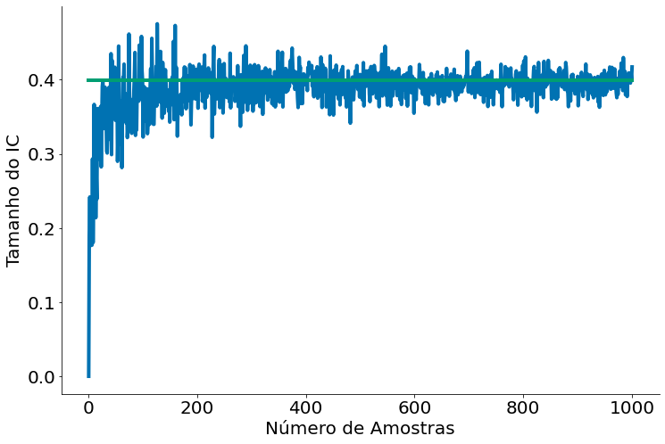
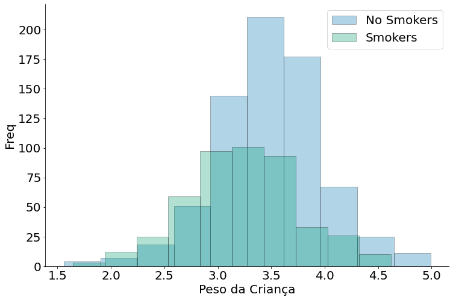
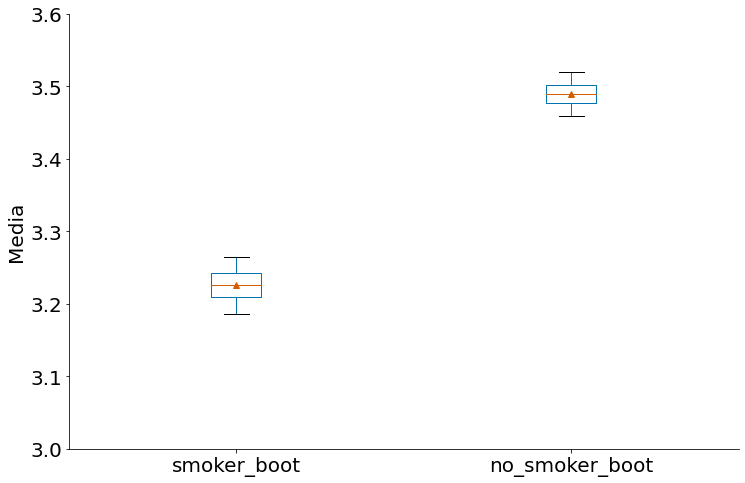
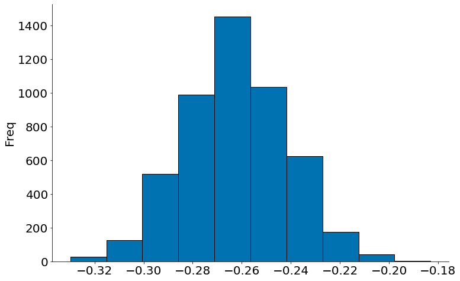
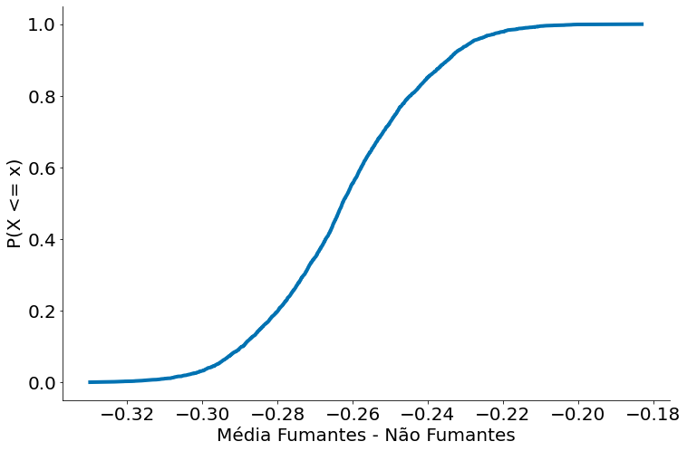

[](https://colab.research.google.com/github/icd-ufmg/icd-ufmg.github.io/blob/master/_lessons/10-ab.ipynb)

# Testes AB
{: .no_toc .mb-2 }

Como comparar dois grupos
{: .fs-6 .fw-300 }

{: .no_toc .text-delta }
Resultados Esperados

1. Comparar dois grupos usando intervalos de confiança
1. Entender como fazer um comparativo de dois grupos
1. Fazer uso do Bootstrap para comparar grupos
1. Fazer uso de ICs para comparar grupos

---
**Sumário**
1. TOC
{:toc}
---


```python
#In: 
# -*- coding: utf8

from scipy import stats as ss

import numpy as np
import matplotlib.pyplot as plt
import pandas as pd
```


```python
#In: 
plt.style.use('seaborn-colorblind')
plt.rcParams['figure.figsize']  = (12, 8)
plt.rcParams['axes.labelsize']  = 20
plt.rcParams['axes.titlesize']  = 20
plt.rcParams['legend.fontsize'] = 20
plt.rcParams['xtick.labelsize'] = 20
plt.rcParams['ytick.labelsize'] = 20
plt.rcParams['lines.linewidth'] = 4
```


```python
#In: 
def despine(ax=None):
    if ax is None:
        ax = plt.gca()
    # Hide the right and top spines
    ax.spines['right'].set_visible(False)
    ax.spines['top'].set_visible(False)

    # Only show ticks on the left and bottom spines
    ax.yaxis.set_ticks_position('left')
    ax.xaxis.set_ticks_position('bottom')
```

## Introdução

**Partes da discussão vem do material do Professor Nazareno Andrade**

Neste notebook vamos continuar nossa exploração de intervalos de confiança e o significado dos mesmos. Em particular, vamos continuar também usando o **bootstrap** para entender o conceito. Lembre-se que a ideia de um intervalo de confiança é entender _a média da população com base em uma amostra_. Por isso o teorema central do limite é tão importante. Na aula anterior iniciamos assumindo que conhecíamos a população. Quando isso ocorre tudo é muito mais simples, quase nunca é verdade. Então como falar algo da população usando apenas uma amostra?

Perguntas como esta acima são a base da __estatística frequentista__. Assumimos que uma verdade existe, na população, e queremos saber como entender essa população só com uma amostra.

Para este notebook, preparei algumas funções abaixo que computa.
1. IC da média usando o TCL
1. IC da média usando bootstrap
1. IC da diferença entre duas médias usando bootstrap

### Funções abaixo com documentação


```python
#In: 
def bootstrap_mean(df, column, n=5000, size=None):
    '''
    Faz um boostrap da média. Gera amostras.
    
    Parâmetros
    ----------
    df: o dataframe
    column: a coluna que queremos focar
    n: número de amostras para o bootstrap
    size: tamanho de cada amostra, por padrão vira o tamanho do df.
    '''
    if size is None:
        size = len(df)
    values = np.zeros(n)
    for i in range(n):
        sample = df[column].sample(size, replace=True)
        values[i] = sample.mean()
    return values
```


```python
#In: 
def ic_bootstrap(df, column, n=5000, size=None):
    '''
    Faz um IC boostrap da média. Gera um Intervalo.
    
    Parâmetros
    ----------
    df: o dataframe
    column: a coluna que queremos focar
    n: número de amostras para o bootstrap
    size: tamanho de cada amostra, por padrão vira o tamanho do df.
    '''
        
    values = bootstrap_mean(df, column, n, size)
    return (np.percentile(values, 2.5), np.percentile(values, 97.5))
```


```python
#In: 
def ic_classic(df, column):
    '''
    Faz um IC clássico usando o teorema central do limite.
    
    Parâmetros
    ----------
    df: o dataframe
    column: a coluna que queremos focar
    n: número de amostras para o bootstrap
    size: tamanho de cada amostra, por padrão vira o tamanho do df.
    '''
    data = df[column]
    mean = data.mean()
    std = data.std(ddof=1)
    se = std / np.sqrt(len(data))
    
    return (mean - 1.96 * se, mean + 1.96 * se)
```

## Entendimento Inicial com Dados Sintéticos

Vamos, mais uma vez entender um IC usando o bootstrap. Inicialmente, vamos assumir uma população $Normal(0, 1)$. Obviamente, teremos média perto de = 0 e std = 1. 

Caso queira, brinque com o size acima e observe como a média fica mais correta. Além do mais, códigos scipy usam dois parâmetros: __loc__ e __scale__. LEIA ATENTAMENTE A DOCUMENTAÇÃO ANTES DE USAR AS DISTRIBUIÇÕES. ÀS VEZES, LOC e SCALE MAPEAM DIRETAMENTE PARA O UM LIVRO/WIKIPEDIA. NO CASO DA NORMAL BATE.

__Sobre Scipy__. Leia o link abaixo para entender a API um pouco mais.
https://www.johndcook.com/blog/distributions_scipy/


```python
#In: 
pop = ss.distributions.norm.rvs(size=10000, loc=0, scale=1)
```


```python
#In: 
pop.mean()
```


    -0.003189792945110248


```python
#In: 
pop.std(ddof=1)
```


    0.9998611935142725


Vou converter os dados para um DataFrame. Além do mais, vou comparar o IC do bootstrap com o IC real ao variar o número de amostras no meu Bootstrap.


```python
#In: 
pop = ss.distributions.norm.rvs(size=100, loc=0, scale=1)
data = pd.DataFrame()
data['values'] = pop

serie_1 = []
serie_2 = []
ns = np.arange(1, 1001)
for n in ns:
    ic_bs = ic_bootstrap(data, 'values', n=n)
    ic_c = ic_classic(data, 'values')
    tamanho_bs = ic_bs[1] - ic_bs[0]
    tamanho_c = ic_c[1] - ic_c[0]
    
    serie_1.append(tamanho_bs)
    serie_2.append(tamanho_c)
```

No gráfico abaixo note que como o IC com bootstrap vai cada vez mais parecendo com o IC clássico (com SE/erro padrão). Ou seja, os dois estimam o mesmo intervalo. O gráfico mostra o tamanho do intervalo, mas já discutimos como o valor do intervalo é similar.


```python
#In: 
plt.plot(ns, serie_1, label='Bootstrap')
plt.plot(ns, serie_2, label='Real')
plt.xlabel('Número de Amostras')
plt.ylabel('Tamanho do IC')
despine()
```


    

    


## Dados Reais

Agora vamos explorar dados reais para entender se existe algum efeito entre fumar o peso.

### Algumas hipóteses

Tente brincar com os dados para entender um pouco mais cada caso.

1. __Mães que fumam tendem a ter bebês com pesos menores.__
1. Mães que têm idade menor tendem a ter bebês com pesos menores.
1. Mães que têm peso menor tendem a ter bebês com pesos menores.

Vamos explorar a primeira.

Primeiro, vamos dar uma olhada na base como um todo.


```python
#In: 
df = pd.read_csv('https://media.githubusercontent.com/media/icd-ufmg/material/master/aulas/10-AB/baby.csv')

# Convertendo para unidades não EUA
df['Birth Weight'] = 0.0283495 * df['Birth Weight']
df['Maternal Pregnancy Weight'] = 0.0283495 * df['Maternal Pregnancy Weight']
df['Maternal Height'] = 0.0254 * df['Maternal Height']

df.head()
```


<div>
<style scoped>
    .dataframe tbody tr th:only-of-type {
        vertical-align: middle;
    }

    .dataframe tbody tr th {
        vertical-align: top;
    }

    .dataframe thead th {
        text-align: right;
    }
</style>
<table border="1" class="dataframe">
  <thead>
    <tr style="text-align: right;">
      <th></th>
      <th>Birth Weight</th>
      <th>Gestational Days</th>
      <th>Maternal Age</th>
      <th>Maternal Height</th>
      <th>Maternal Pregnancy Weight</th>
      <th>Maternal Smoker</th>
    </tr>
  </thead>
  <tbody>
    <tr>
      <th>0</th>
      <td>3.401940</td>
      <td>284</td>
      <td>27</td>
      <td>1.5748</td>
      <td>2.834950</td>
      <td>False</td>
    </tr>
    <tr>
      <th>1</th>
      <td>3.203493</td>
      <td>282</td>
      <td>33</td>
      <td>1.6256</td>
      <td>3.827183</td>
      <td>False</td>
    </tr>
    <tr>
      <th>2</th>
      <td>3.628736</td>
      <td>279</td>
      <td>28</td>
      <td>1.6256</td>
      <td>3.260193</td>
      <td>True</td>
    </tr>
    <tr>
      <th>3</th>
      <td>3.061746</td>
      <td>282</td>
      <td>23</td>
      <td>1.7018</td>
      <td>3.543687</td>
      <td>True</td>
    </tr>
    <tr>
      <th>4</th>
      <td>3.855532</td>
      <td>286</td>
      <td>25</td>
      <td>1.5748</td>
      <td>2.636503</td>
      <td>False</td>
    </tr>
  </tbody>
</table>
</div>


```python
#In: 
df.describe()
```


<div>
<style scoped>
    .dataframe tbody tr th:only-of-type {
        vertical-align: middle;
    }

    .dataframe tbody tr th {
        vertical-align: top;
    }

    .dataframe thead th {
        text-align: right;
    }
</style>
<table border="1" class="dataframe">
  <thead>
    <tr style="text-align: right;">
      <th></th>
      <th>Birth Weight</th>
      <th>Gestational Days</th>
      <th>Maternal Age</th>
      <th>Maternal Height</th>
      <th>Maternal Pregnancy Weight</th>
    </tr>
  </thead>
  <tbody>
    <tr>
      <th>count</th>
      <td>1174.000000</td>
      <td>1174.000000</td>
      <td>1174.000000</td>
      <td>1174.000000</td>
      <td>1174.000000</td>
    </tr>
    <tr>
      <th>mean</th>
      <td>3.386703</td>
      <td>279.101363</td>
      <td>27.228279</td>
      <td>1.626855</td>
      <td>3.642307</td>
    </tr>
    <tr>
      <th>std</th>
      <td>0.519609</td>
      <td>16.010305</td>
      <td>5.817839</td>
      <td>0.064163</td>
      <td>0.587807</td>
    </tr>
    <tr>
      <th>min</th>
      <td>1.559222</td>
      <td>148.000000</td>
      <td>15.000000</td>
      <td>1.346200</td>
      <td>2.466407</td>
    </tr>
    <tr>
      <th>25%</th>
      <td>3.061746</td>
      <td>272.000000</td>
      <td>23.000000</td>
      <td>1.574800</td>
      <td>3.238930</td>
    </tr>
    <tr>
      <th>50%</th>
      <td>3.401940</td>
      <td>280.000000</td>
      <td>26.000000</td>
      <td>1.625600</td>
      <td>3.543687</td>
    </tr>
    <tr>
      <th>75%</th>
      <td>3.713785</td>
      <td>288.000000</td>
      <td>31.000000</td>
      <td>1.676400</td>
      <td>3.940580</td>
    </tr>
    <tr>
      <th>max</th>
      <td>4.989512</td>
      <td>353.000000</td>
      <td>45.000000</td>
      <td>1.828800</td>
      <td>7.087375</td>
    </tr>
  </tbody>
</table>
</div>


Agora vamos ver os dados de quem fuma.


```python
#In: 
smokers = df[df['Maternal Smoker'] == True]
smokers.describe()
```


<div>
<style scoped>
    .dataframe tbody tr th:only-of-type {
        vertical-align: middle;
    }

    .dataframe tbody tr th {
        vertical-align: top;
    }

    .dataframe thead th {
        text-align: right;
    }
</style>
<table border="1" class="dataframe">
  <thead>
    <tr style="text-align: right;">
      <th></th>
      <th>Birth Weight</th>
      <th>Gestational Days</th>
      <th>Maternal Age</th>
      <th>Maternal Height</th>
      <th>Maternal Pregnancy Weight</th>
    </tr>
  </thead>
  <tbody>
    <tr>
      <th>count</th>
      <td>459.000000</td>
      <td>459.000000</td>
      <td>459.000000</td>
      <td>459.000000</td>
      <td>459.000000</td>
    </tr>
    <tr>
      <th>mean</th>
      <td>3.226717</td>
      <td>277.897603</td>
      <td>26.736383</td>
      <td>1.628256</td>
      <td>3.598101</td>
    </tr>
    <tr>
      <th>std</th>
      <td>0.518654</td>
      <td>15.201427</td>
      <td>5.713139</td>
      <td>0.066135</td>
      <td>0.566761</td>
    </tr>
    <tr>
      <th>min</th>
      <td>1.644271</td>
      <td>223.000000</td>
      <td>15.000000</td>
      <td>1.346200</td>
      <td>2.466407</td>
    </tr>
    <tr>
      <th>25%</th>
      <td>2.863300</td>
      <td>271.000000</td>
      <td>22.000000</td>
      <td>1.587500</td>
      <td>3.175144</td>
    </tr>
    <tr>
      <th>50%</th>
      <td>3.260193</td>
      <td>278.000000</td>
      <td>26.000000</td>
      <td>1.625600</td>
      <td>3.543687</td>
    </tr>
    <tr>
      <th>75%</th>
      <td>3.572037</td>
      <td>286.000000</td>
      <td>30.000000</td>
      <td>1.676400</td>
      <td>3.869707</td>
    </tr>
    <tr>
      <th>max</th>
      <td>4.620969</td>
      <td>330.000000</td>
      <td>43.000000</td>
      <td>1.828800</td>
      <td>6.095142</td>
    </tr>
  </tbody>
</table>
</div>


Contra os dados de quem não fuma.


```python
#In: 
no_smokers = df[df['Maternal Smoker'] == False]
no_smokers.describe()
```


<div>
<style scoped>
    .dataframe tbody tr th:only-of-type {
        vertical-align: middle;
    }

    .dataframe tbody tr th {
        vertical-align: top;
    }

    .dataframe thead th {
        text-align: right;
    }
</style>
<table border="1" class="dataframe">
  <thead>
    <tr style="text-align: right;">
      <th></th>
      <th>Birth Weight</th>
      <th>Gestational Days</th>
      <th>Maternal Age</th>
      <th>Maternal Height</th>
      <th>Maternal Pregnancy Weight</th>
    </tr>
  </thead>
  <tbody>
    <tr>
      <th>count</th>
      <td>715.000000</td>
      <td>715.000000</td>
      <td>715.000000</td>
      <td>715.000000</td>
      <td>715.000000</td>
    </tr>
    <tr>
      <th>mean</th>
      <td>3.489407</td>
      <td>279.874126</td>
      <td>27.544056</td>
      <td>1.625955</td>
      <td>3.670685</td>
    </tr>
    <tr>
      <th>std</th>
      <td>0.493953</td>
      <td>16.472823</td>
      <td>5.866317</td>
      <td>0.062895</td>
      <td>0.599603</td>
    </tr>
    <tr>
      <th>min</th>
      <td>1.559222</td>
      <td>148.000000</td>
      <td>17.000000</td>
      <td>1.422400</td>
      <td>2.523105</td>
    </tr>
    <tr>
      <th>25%</th>
      <td>3.203493</td>
      <td>273.000000</td>
      <td>23.000000</td>
      <td>1.574800</td>
      <td>3.260193</td>
    </tr>
    <tr>
      <th>50%</th>
      <td>3.486988</td>
      <td>281.000000</td>
      <td>27.000000</td>
      <td>1.625600</td>
      <td>3.572037</td>
    </tr>
    <tr>
      <th>75%</th>
      <td>3.798833</td>
      <td>289.000000</td>
      <td>31.000000</td>
      <td>1.676400</td>
      <td>3.968930</td>
    </tr>
    <tr>
      <th>max</th>
      <td>4.989512</td>
      <td>353.000000</td>
      <td>45.000000</td>
      <td>1.803400</td>
      <td>7.087375</td>
    </tr>
  </tbody>
</table>
</div>


Oberserve que sim, existem diferenças nos valores. Porém precisamos de um __arcabouço__ para entender exatamente como comparar os grupos. Não é impossível que tais erros sejam factíveis em uma amostra. Até na distribuição temos diferença, mas podemos fazer alguma coisa mais fundamentada (com garantias estatísticas) com uma amostra?!


```python
#In: 
plt.hist(no_smokers['Birth Weight'], alpha=0.3, edgecolor='k', label='No Smokers')
plt.hist(smokers['Birth Weight'], alpha=0.3, edgecolor='k', label='Smokers')
despine()
plt.xlabel('Peso da Criança')
plt.ylabel('Freq')
plt.legend()
```


    <matplotlib.legend.Legend at 0x7efda8347dc0>


    

    


Por isso que ICs são bem interessante. Vemos qual a chance do parâmetro na população, depois comparamos os ICs.

Abaixo temos o IC de cada caso com bootstrap. Podemos falar alguma coisa?!


```python
#In: 
ic_bootstrap(smokers, 'Birth Weight')
```


    (3.18088801633987, 3.2741541655228756)


```python
#In: 
ic_bootstrap(no_smokers, 'Birth Weight')
```


    (3.452928459108392, 3.526363576520979)


```python
#In: 
samples_smokers = bootstrap_mean(smokers, 'Birth Weight')
samples_no_smokers = bootstrap_mean(no_smokers, 'Birth Weight')
to_plot = pd.DataFrame()
to_plot['smoker_boot'] = samples_smokers
to_plot['no_smoker_boot'] = samples_no_smokers
```


```python
#In: 
to_plot.boxplot(grid=False, sym='', whis=[5, 95], showmeans=True)
plt.ylim(3, 3.6)
plt.ylabel('Media')
despine()
```


    

    


Uma forma mais simples de entender é comparar a diferença entre os dois grupos. Note que o bootstrap também pode ser utilizado, agora vamos comparar a média de cada amostra. É o mesmo arcabouço.


```python
#In: 
def bootstrap_diff(df1, df2, column, n=5000, size=None):
    '''
    Faz um boostrap da diferença das média. Gera amostras.
    
    Parâmetros
    ----------
    df: o dataframe
    column: a coluna que queremos focar
    n: número de amostras para o bootstrap
    size: tamanho de cada amostra, por padrão vira o tamanho do df.
    '''
    if size is None:
        size = len(df)
    values = np.zeros(n)
    for i in range(n):
        sample1 = df1[column].sample(size, replace=True)
        sample2 = df2[column].sample(size, replace=True)
        values[i] = sample1.mean() - sample2.mean()
    return values
```


```python
#In: 
caso2 = pd.DataFrame()
diff = bootstrap_diff(smokers, no_smokers, 'Birth Weight')
```


```python
#In: 
plt.hist(diff, edgecolor='k')
plt.ylabel('Média Fumantes - Não Fumantes')
plt.ylabel('Freq')
despine()
```


    

    


```python
#In: 
from statsmodels.distributions.empirical_distribution import ECDF
ecdf = ECDF(diff)
plt.plot(ecdf.x, ecdf.y)
plt.xlabel('Média Fumantes - Não Fumantes')
plt.ylabel('P(X <= x)')
despine()
```


    

    

