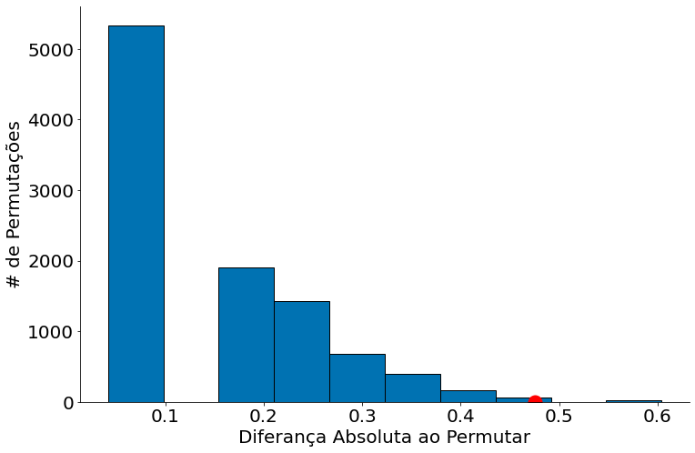

# -*- coding: utf8

from scipy import stats as ss

import numpy as np
import matplotlib.pyplot as plt
import pandas as pd

# Para evitar a confusão da aula passada, colocando alguns defaults!
plt.rcParams['figure.figsize']  = (18, 10)
plt.rcParams['axes.labelsize']  = 20
plt.rcParams['axes.titlesize']  = 20
plt.rcParams['legend.fontsize'] = 20
plt.rcParams['xtick.labelsize'] = 20
plt.rcParams['ytick.labelsize'] = 20
plt.rcParams['lines.linewidth'] = 4
```


```python
#In: 
plt.ion()
plt.style.use('seaborn-colorblind')
plt.rcParams['figure.figsize']  = (12, 8)
```


```python
#In: 
def despine(ax=None):
    if ax is None:
        ax = plt.gca()
    # Hide the right and top spines
    ax.spines['right'].set_visible(False)
    ax.spines['top'].set_visible(False)

    # Only show ticks on the left and bottom spines
    ax.yaxis.set_ticks_position('left')
    ax.xaxis.set_ticks_position('bottom')
```

# Aula 13 - Causalidade

## Introdução

Aqui, vamos brincar um pouco com dados onde posso falar algo de causalidade. Isto é, foi feito um experimento controlado e randomizado. Note que minha ferramenta é a mesma de antes, permutação, porém a forma que os dados foram coletados mudara. Esta é a diferença.

Abaixo tenho uma função simples que permuta uma coluna de um dataframe. Vamos usar ela para implementar o nosso teste de permutação. Este exemplo é bem similar ao teste de permutação já feito. Use o mesmo para revisar!


```python
#In: 
def permuta(df, coluna):
    '''
    Permuta um dataframe com base e uma coluna categórica.
    Este código é mais lento pois cria uma cópia.
    
    Parâmetros
    ----------
    df: o dataframe
    coluna: uma coluna categórica
    
    Retorna
    -------
    um novo df permutado
    '''
    
    novo = df.copy()            # Cópia dos dados
    dados = df[coluna].copy()   # Copia da coluna, evitar um warning pandas. Deve ter forma melhor de fazer.
    np.random.shuffle(dados)    # Faz o shuffle
    novo[coluna] = dados        # Faz overwrite da coluna
    return novo
```

## Dados

O DataFrame consiste de dois grupos. Um de controle, outro de tratamento. No primeiro, foi medicado placebo. No segundo, foi utilizado um novo medicamento. Quando o resultado é 1, dizemos que houve melhoria nos pacientes.


```python
#In: 
df = pd.read_csv('https://media.githubusercontent.com/media/icd-ufmg/material/master/aulas/13-CausalidadeRCT/bta.csv')
df.head()
```


<div>
<style scoped>
    .dataframe tbody tr th:only-of-type {
        vertical-align: middle;
    }

    .dataframe tbody tr th {
        vertical-align: top;
    }

    .dataframe thead th {
        text-align: right;
    }
</style>
<table border="1" class="dataframe">
  <thead>
    <tr style="text-align: right;">
      <th></th>
      <th>Group</th>
      <th>Result</th>
    </tr>
  </thead>
  <tbody>
    <tr>
      <th>0</th>
      <td>Control</td>
      <td>1.0</td>
    </tr>
    <tr>
      <th>1</th>
      <td>Control</td>
      <td>1.0</td>
    </tr>
    <tr>
      <th>2</th>
      <td>Control</td>
      <td>0.0</td>
    </tr>
    <tr>
      <th>3</th>
      <td>Control</td>
      <td>0.0</td>
    </tr>
    <tr>
      <th>4</th>
      <td>Control</td>
      <td>0.0</td>
    </tr>
  </tbody>
</table>
</div>


```python
#In: 
control = df.query('Group == "Control"')
control.head()
```


<div>
<style scoped>
    .dataframe tbody tr th:only-of-type {
        vertical-align: middle;
    }

    .dataframe tbody tr th {
        vertical-align: top;
    }

    .dataframe thead th {
        text-align: right;
    }
</style>
<table border="1" class="dataframe">
  <thead>
    <tr style="text-align: right;">
      <th></th>
      <th>Group</th>
      <th>Result</th>
    </tr>
  </thead>
  <tbody>
    <tr>
      <th>0</th>
      <td>Control</td>
      <td>1.0</td>
    </tr>
    <tr>
      <th>1</th>
      <td>Control</td>
      <td>1.0</td>
    </tr>
    <tr>
      <th>2</th>
      <td>Control</td>
      <td>0.0</td>
    </tr>
    <tr>
      <th>3</th>
      <td>Control</td>
      <td>0.0</td>
    </tr>
    <tr>
      <th>4</th>
      <td>Control</td>
      <td>0.0</td>
    </tr>
  </tbody>
</table>
</div>


```python
#In: 
medicados = df.query('Group != "Control"')
medicados.head()
```


<div>
<style scoped>
    .dataframe tbody tr th:only-of-type {
        vertical-align: middle;
    }

    .dataframe tbody tr th {
        vertical-align: top;
    }

    .dataframe thead th {
        text-align: right;
    }
</style>
<table border="1" class="dataframe">
  <thead>
    <tr style="text-align: right;">
      <th></th>
      <th>Group</th>
      <th>Result</th>
    </tr>
  </thead>
  <tbody>
    <tr>
      <th>16</th>
      <td>Treatment</td>
      <td>1.0</td>
    </tr>
    <tr>
      <th>17</th>
      <td>Treatment</td>
      <td>1.0</td>
    </tr>
    <tr>
      <th>18</th>
      <td>Treatment</td>
      <td>1.0</td>
    </tr>
    <tr>
      <th>19</th>
      <td>Treatment</td>
      <td>1.0</td>
    </tr>
    <tr>
      <th>20</th>
      <td>Treatment</td>
      <td>1.0</td>
    </tr>
  </tbody>
</table>
</div>


Ao somar o resultado de cada caso, vejo quantos melhoraram. Note que o valor é bem maior nos medicados.


```python
#In: 
control['Result'].sum()
```


    2.0


```python
#In: 
medicados['Result'].sum()
```


    9.0


Como os dados são 1/0, a média aqui vira uma proporção. Cada observação, $x_i \in \{0, 1\}$. 0 é quando não temos um efeito positivo e 1 quando temos.

$$\sum_{i=1}^{N} x_i/n$$


```python
#In: 
control['Result'].mean()
```


    0.125


```python
#In: 
medicados['Result'].mean()
```


    0.6


Aqui tenho o efeito nos dados reais, mensurados em abs.


```python
#In: 
abs(medicados['Result'].mean() - control['Result'].mean())
```


    0.475


```python
#In: 
tobs = abs(medicados['Result'].mean() - control['Result'].mean())
```


```python
#In: 
tobs
```


    0.475


## Dados permutados


```python
#In: 
p1 = permuta(df, 'Group')
p1.head()
```


<div>
<style scoped>
    .dataframe tbody tr th:only-of-type {
        vertical-align: middle;
    }

    .dataframe tbody tr th {
        vertical-align: top;
    }

    .dataframe thead th {
        text-align: right;
    }
</style>
<table border="1" class="dataframe">
  <thead>
    <tr style="text-align: right;">
      <th></th>
      <th>Group</th>
      <th>Result</th>
    </tr>
  </thead>
  <tbody>
    <tr>
      <th>0</th>
      <td>Control</td>
      <td>1.0</td>
    </tr>
    <tr>
      <th>1</th>
      <td>Control</td>
      <td>1.0</td>
    </tr>
    <tr>
      <th>2</th>
      <td>Treatment</td>
      <td>0.0</td>
    </tr>
    <tr>
      <th>3</th>
      <td>Treatment</td>
      <td>0.0</td>
    </tr>
    <tr>
      <th>4</th>
      <td>Treatment</td>
      <td>0.0</td>
    </tr>
  </tbody>
</table>
</div>


```python
#In: 
p1.query('Group == "Control"').mean()
```


    Result    0.5
    dtype: float64


```python
#In: 
p1.query('Group == "Treatment"').mean()
```


    Result    0.2
    dtype: float64


```python
#In: 
df.head()
```


<div>
<style scoped>
    .dataframe tbody tr th:only-of-type {
        vertical-align: middle;
    }

    .dataframe tbody tr th {
        vertical-align: top;
    }

    .dataframe thead th {
        text-align: right;
    }
</style>
<table border="1" class="dataframe">
  <thead>
    <tr style="text-align: right;">
      <th></th>
      <th>Group</th>
      <th>Result</th>
    </tr>
  </thead>
  <tbody>
    <tr>
      <th>0</th>
      <td>Control</td>
      <td>1.0</td>
    </tr>
    <tr>
      <th>1</th>
      <td>Control</td>
      <td>1.0</td>
    </tr>
    <tr>
      <th>2</th>
      <td>Control</td>
      <td>0.0</td>
    </tr>
    <tr>
      <th>3</th>
      <td>Control</td>
      <td>0.0</td>
    </tr>
    <tr>
      <th>4</th>
      <td>Control</td>
      <td>0.0</td>
    </tr>
  </tbody>
</table>
</div>


## Teste de Permutação abaixo.


```python
#In: 
valores = []
for _ in range(10000):
    novo = permuta(df, 'Group')
    controle = novo.query('Group == "Control"')['Result']
    medicados = novo.query('Group != "Control"')['Result']
    valores.append(abs(controle.mean() - medicados.mean()))
```


```python
#In: 
valores = np.array(valores)
```


```python
#In: 
valores
```


    array([0.04166667, 0.3       , 0.0875    , ..., 0.21666667, 0.04166667,
           0.04166667])


```python
#In: 
bins = np.arange(0.15, 0.75, 0.05)
print(bins)
plt.hist(valores, bins=10, edgecolor='k')
plt.ylabel('# de Permutações')
plt.xlabel('Diferança Absoluta ao Permutar')
plt.plot([tobs], [0], 'ro', ms=15)
despine()
```

    [0.15 0.2  0.25 0.3  0.35 0.4  0.45 0.5  0.55 0.6  0.65 0.7 ]


    

    


```python
#In: 
valor_p = (valores > tobs).mean()
valor_p
```


    0.0023


## Diferença de outros exemplos

Neste exemplo foi feito uma intervenção. Isto é, medicamos parte dos dados. Não estamos observando dados apenas. Por isto um exemplo como este é causal, vemos um efeito real em um experimento controlado! Mais importante do que isto, em 2011 foi averiguado que este pequeno estudo é um dos mais corretos quando se trata de dor crônica lombar! O ferramental aqui foram testes simples + uma boa amostra! 


```python
#In: 

```
