[](https://colab.research.google.com/github/icd-ufmg/icd-ufmg.github.io/blob/master/_lessons/14-correlacao.ipynb)

# Correlação

{: .no_toc .mb-2 }

Entendimento de relação entre dados.
{: .fs-6 .fw-300 }

{: .no_toc .text-delta }
Resultados Esperados

1. Entender como sumarizar dados em duas dimensões.
1. Entender correlação e covariância.
1. Entender o paradoxo de simpson.
1. Sumarização de dados em duas dimensões.
1. Correlação não é causalidade.

---
**Sumário**
1. TOC
{:toc}
---


```python
#In: 
# -*- coding: utf8

from scipy import stats as ss

import seaborn as sns

import numpy as np
import matplotlib.pyplot as plt
import pandas as pd
```


```python
#In: 
plt.style.use('seaborn-colorblind')
plt.rcParams['figure.figsize']  = (16, 10)
plt.rcParams['axes.labelsize']  = 20
plt.rcParams['axes.titlesize']  = 20
plt.rcParams['legend.fontsize'] = 20
plt.rcParams['xtick.labelsize'] = 20
plt.rcParams['ytick.labelsize'] = 20
plt.rcParams['lines.linewidth'] = 4
```


```python
#In: 
plt.ion()
```


```python
#In: 
def despine(ax=None):
    if ax is None:
        ax = plt.gca()
    # Hide the right and top spines
    ax.spines['right'].set_visible(False)
    ax.spines['top'].set_visible(False)

    # Only show ticks on the left and bottom spines
    ax.yaxis.set_ticks_position('left')
    ax.xaxis.set_ticks_position('bottom')
```

## Introdução

Lembrando das aulas anteriores, podemos usar estatísticas para sumarizar dados e suas tendências centrais. Embora seja um campo rico, ainda não exploramos a ideia de tendências centrais em dados de duas dimensões. Nesta aula, teremos uma abordagem de exploração.

## Dados Sintéticos

Vamos inicial entendendo os gráficos de dispersão para pares de colunas. Inicialmente, queremos ter alguma indicação visual da correlação entre nossos dados. Sendo $X = \{x_1, x_2, \cdots\}$ e $Y = \{y_1, y_2, \cdots\}$ um par de colunas, o gráfico mostra um ponto em cada coordenada ($x_i$, $y_i$). 

No primeiro vamos mostrar um plot de números aleatórios de uma normal. Para cada linha, vamos gerar de forma **independente** outra normal. Como seria um formato esperado do gráfico?


```python
#In: 
x = np.random.randn(1000)
y = np.random.randn(1000)
plt.scatter(x, y, edgecolor='k', alpha=0.6)
plt.xlabel('Random Normal X')
plt.ylabel('Random Normal Y')
despine()
```


    
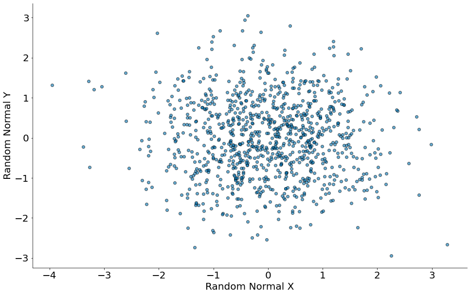
    


No segundo vamos mostrar um plot no eixo x números aleatórios de uma normal. No eixo y, vamos plotar o valor de x adicionados de outra normal. Qual é o valor esperado?


```python
#In: 
x = np.random.randn(1000)
y = x + np.random.randn(1000)
plt.scatter(x, y, edgecolor='k', alpha=0.6)
plt.xlabel('Random Normal X')
plt.ylabel('Random Normal Y + Outra Normal')
despine()
```


    
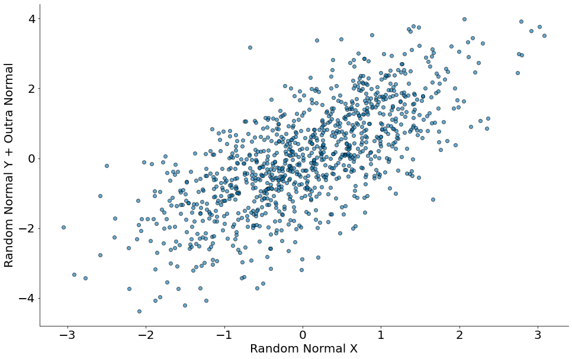
    


Agora vamos fazer $-x - Normal(0, 1)$.


```python
#In: 
x = np.random.randn(1000)
y = -x - np.random.randn(1000)
plt.scatter(x, y, edgecolor='k', alpha=0.6)
plt.xlabel('Random Normal X')
plt.ylabel('-X - Outra Normal')
despine()
```


    
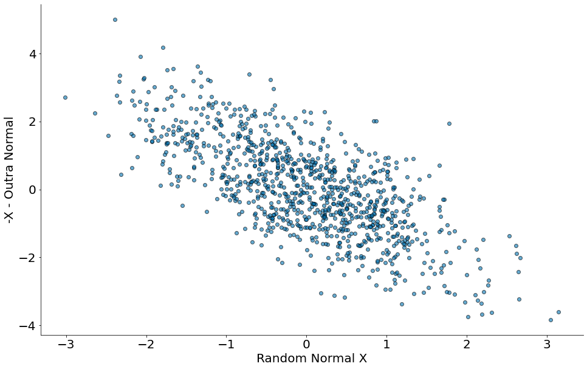
    


Por fim, um caso quadrático.


```python
#In: 
x = np.random.randn(1000)
y = x * x + np.random.randn(1000) + 10
plt.scatter(x, y, edgecolor='k', alpha=0.6)
plt.xlabel('Random Normal X')
plt.ylabel('X * X + Random')
despine()
```


    
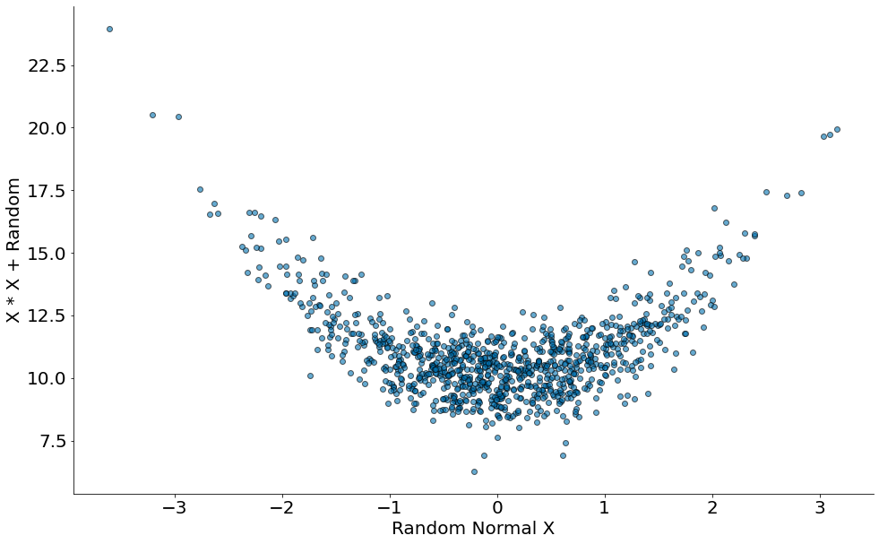
    


## Dados Reais

Nesta aula vamos utilizados dados de preços de carros híbridos. Nos EUA, um carro híbrido pode rodar tanto em eletricidade quanto em combustível. A tabela contém as vendas de 1997 até 2003.

Uma máxima dessa aula será: **Sempre visualize seus dados**. 

As colunas são:

1. **vehicle:** model of the car
1. **year:** year of manufacture
1. **msrp:** manufacturer’s suggested retail price in 2013 dollars
1. **acceleration:** acceleration rate in km per hour per second
1. **mpg:** fuel econonmy in miles per gallon
1. **class:** the model’s class.

### Olhando para os Dados

Vamos iniciar olhando para cada coluna dos dados.


```python
#In: 
df = pd.read_csv('https://media.githubusercontent.com/media/icd-ufmg/material/master/aulas/15-Correlacao/hybrid.csv')
df['msrp'] = df['msrp'] / 1000
df.head()
```


<div>
<style scoped>
    .dataframe tbody tr th:only-of-type {
        vertical-align: middle;
    }

    .dataframe tbody tr th {
        vertical-align: top;
    }

    .dataframe thead th {
        text-align: right;
    }
</style>
<table border="1" class="dataframe">
  <thead>
    <tr style="text-align: right;">
      <th></th>
      <th>vehicle</th>
      <th>year</th>
      <th>msrp</th>
      <th>acceleration</th>
      <th>mpg</th>
      <th>class</th>
    </tr>
  </thead>
  <tbody>
    <tr>
      <th>0</th>
      <td>Prius (1st Gen)</td>
      <td>1997</td>
      <td>24.50974</td>
      <td>7.46</td>
      <td>41.26</td>
      <td>Compact</td>
    </tr>
    <tr>
      <th>1</th>
      <td>Tino</td>
      <td>2000</td>
      <td>35.35497</td>
      <td>8.20</td>
      <td>54.10</td>
      <td>Compact</td>
    </tr>
    <tr>
      <th>2</th>
      <td>Prius (2nd Gen)</td>
      <td>2000</td>
      <td>26.83225</td>
      <td>7.97</td>
      <td>45.23</td>
      <td>Compact</td>
    </tr>
    <tr>
      <th>3</th>
      <td>Insight</td>
      <td>2000</td>
      <td>18.93641</td>
      <td>9.52</td>
      <td>53.00</td>
      <td>Two Seater</td>
    </tr>
    <tr>
      <th>4</th>
      <td>Civic (1st Gen)</td>
      <td>2001</td>
      <td>25.83338</td>
      <td>7.04</td>
      <td>47.04</td>
      <td>Compact</td>
    </tr>
  </tbody>
</table>
</div>


A coluna MSRP é o preço médio de venda. Cada linha da tabela é um carro. 


```python
#In: 
plt.hist(df['acceleration'], bins=20, edgecolor='k')
plt.title('Histograma de Aceleração')
plt.xlabel('Aceleração em Milhas por Hora')
plt.ylabel('Num. Carros')
despine()
```


    
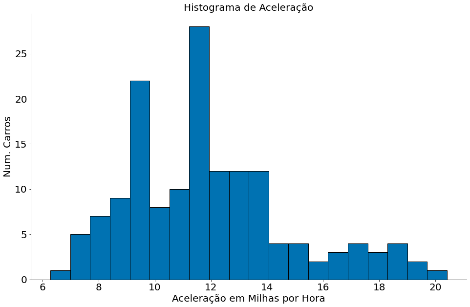
    


A coluna Year é o ano de fabricação.


```python
#In: 
bins = np.arange(1997, 2013) + 0.5
plt.hist(df['year'], bins=bins, edgecolor='k')
plt.title('Histograma de Modelos por Ano')
plt.xlabel('Ano')
plt.ylabel('Num. Carros')
despine()
```


    
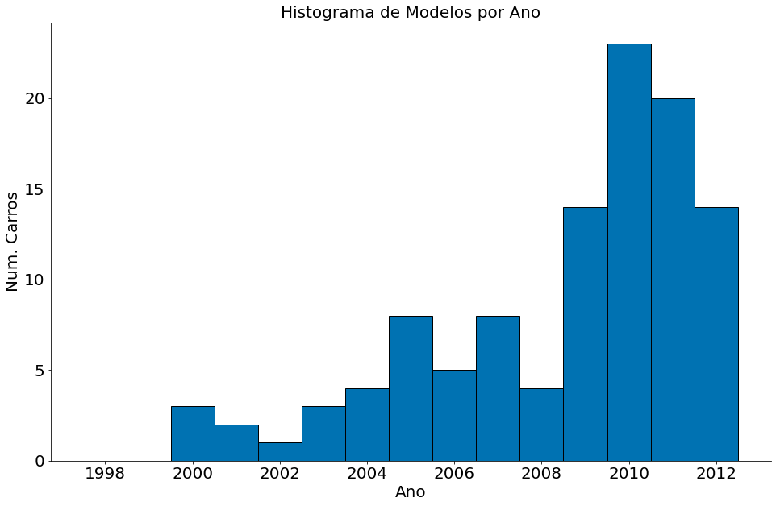
    


A coluna MSRP é o preço do carro.


```python
#In: 
plt.hist(df['msrp'], bins=20, edgecolor='k')
plt.title('Histograma de Modelos por Ano')
plt.xlabel('Preço em Mil. Dólar')
plt.ylabel('Num. Carros')
despine()
```


    
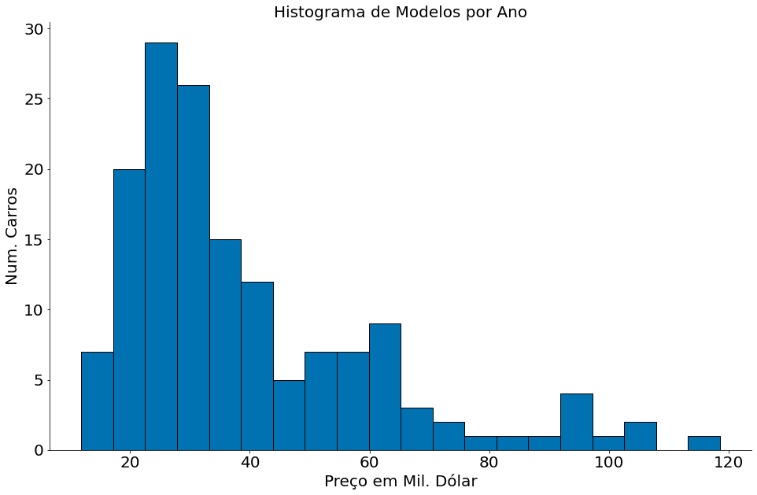
    


A coluna MPG captura as milhas por hora.


```python
#In: 
plt.hist(df['mpg'], bins=20, edgecolor='k')
plt.title('Histograma de Modelos por Ano')
plt.xlabel('Milhas por Hora')
plt.ylabel('Num. Carros')
despine()
```


    
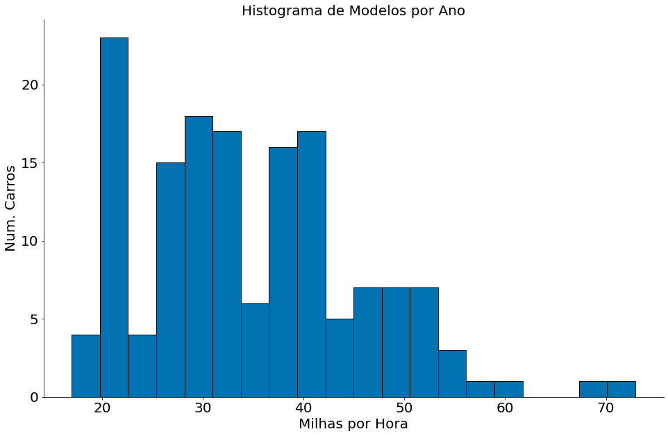
    


Os gráficos acima nos dão uma visão geral dos dados. Note que, como esperado, cada coluna tem uma faixa diferente de valores no eixo-x. Além do mais, a concentração (lado esquerdo/direito) diferente entre as colunas. Como que podemos comparae as colunas? Cada uma está representada em uma unidade diferente.

Vamos fazer os gráficos de dispersão para todos os pares.

### Dispersão


```python
#In: 
plt.scatter(df['acceleration'], df['msrp'], edgecolor='k', alpha=0.6, s=80)
plt.xlabel('MSRP')
plt.ylabel('Acc.')
plt.title('Consumo vs Acc')
despine()
```


    
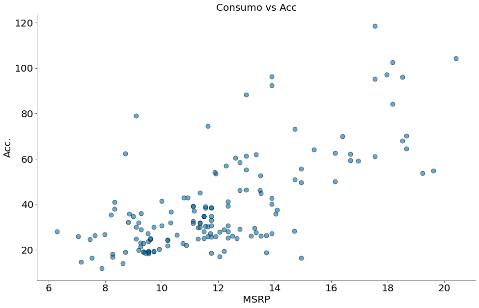
    


```python
#In: 
plt.scatter(df['mpg'], df['acceleration'], edgecolor='k', alpha=0.6, s=80)
plt.xlabel('MPG')
plt.ylabel('Acc.')
plt.title('Consumo vs Aceleração')
despine()
```


    
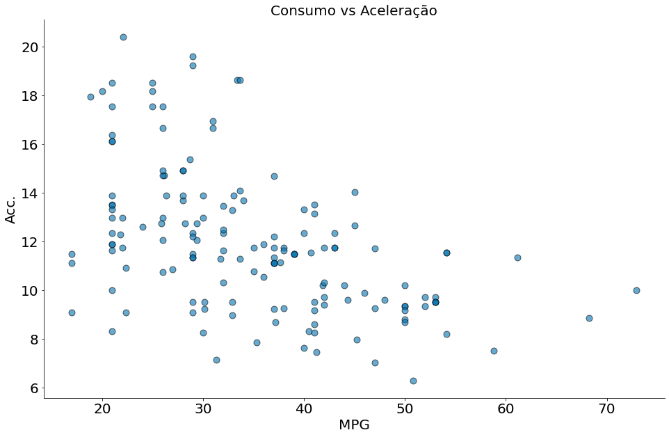
    


```python
#In: 
plt.scatter(df['msrp'], df['mpg'], edgecolor='k', alpha=0.6, s=80)
plt.xlabel('MSRP')
plt.ylabel('MPG')
plt.title('Preço vs Consumo')
despine()
```


    
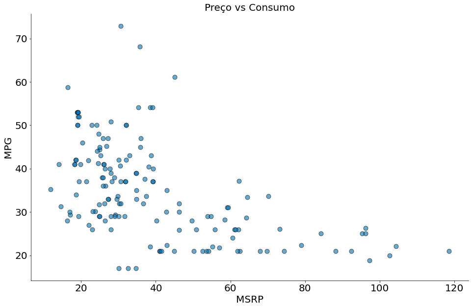
    


## Covariânça

Agora analisaremos a covariância, o análogo pareado da variância. Enquanto a variância mede como uma única variável se desvia de sua média, a covariância mede como duas variáveis $X = \{x_1, \cdots, x_n\}$ e $Y = \{y_1, \cdots, y_n\}$  variam em conjunto a partir de suas médias $\bar{x}$ e $\bar{y}$:

$$cov(X, Y) = \frac{\sum_{i=1}^{n}{(x_i - \bar{x})(y_i - \bar{y})}}{n-1},$$

$$(x_i - \bar{x})(y_i - \bar{y})$$


```python
#In: 
def covariance(x, y):
    n = len(x)
    x_m = x - np.mean(x)
    y_m = y - np.mean(y)
    return (x_m * y_m).sum() / (n - 1)
```


```python
#In: 
covariance(df['acceleration'], df['msrp'])
```


    43.809528657120744


```python
#In: 
covariance(df['msrp'], df['mpg'])
```


    -125.00248062016253


Entendendo a estatística. Quando os elementos correspondentes de `x` e `y` estão ambos acima de suas médias ou ambos abaixo de suas médias, um número positivo entra na soma. Quando um está acima de sua média e o outro abaixo, um número negativo entra na soma. Assim, uma covariância positiva “grande” significa que `x` tende a ser grande quando `y` é grande, e pequeno quando `y` é pequeno. Uma covariância negativa “grande” significa o oposto - que `x` tende a ser pequeno quando `y` é grande e vice-versa. Uma covariância próxima de zero significa que não existe tal relação.

Para entender, veja a tabela abaixo que mostra três colunas novas. Inicialmente podemos ver a diferença de cada coluna com sua média. Por fim, podemos ver também uma coluna impacto. A mesma tem valor 1 quando o sinal é o mesmo das colunas subtraídas da média. Uma métrica de correlação vai ser proporcional ao valor da soma deste impacto.


```python
#In: 
df_n = df[['msrp', 'mpg']].copy()
df_n['msrp_menos_media'] = df_n['msrp'] - df['msrp'].mean()
df_n['mpg_menos_media'] = df_n['mpg'] - df['mpg'].mean()
df_n['impacto'] = np.zeros(len(df_n)) - 1
df_n['impacto'][(df_n['mpg_menos_media'] > 0) & (df_n['msrp_menos_media'] > 0)] = 1
df_n['impacto'][(df_n['mpg_menos_media'] < 0) & (df_n['msrp_menos_media'] < 0)] = 1
df_n.head(n=20)
```


<div>
<style scoped>
    .dataframe tbody tr th:only-of-type {
        vertical-align: middle;
    }

    .dataframe tbody tr th {
        vertical-align: top;
    }

    .dataframe thead th {
        text-align: right;
    }
</style>
<table border="1" class="dataframe">
  <thead>
    <tr style="text-align: right;">
      <th></th>
      <th>msrp</th>
      <th>mpg</th>
      <th>msrp_menos_media</th>
      <th>mpg_menos_media</th>
      <th>impacto</th>
    </tr>
  </thead>
  <tbody>
    <tr>
      <th>0</th>
      <td>24.50974</td>
      <td>41.26</td>
      <td>-14.809695</td>
      <td>6.462549</td>
      <td>-1.0</td>
    </tr>
    <tr>
      <th>1</th>
      <td>35.35497</td>
      <td>54.10</td>
      <td>-3.964465</td>
      <td>19.302549</td>
      <td>-1.0</td>
    </tr>
    <tr>
      <th>2</th>
      <td>26.83225</td>
      <td>45.23</td>
      <td>-12.487185</td>
      <td>10.432549</td>
      <td>-1.0</td>
    </tr>
    <tr>
      <th>3</th>
      <td>18.93641</td>
      <td>53.00</td>
      <td>-20.383025</td>
      <td>18.202549</td>
      <td>-1.0</td>
    </tr>
    <tr>
      <th>4</th>
      <td>25.83338</td>
      <td>47.04</td>
      <td>-13.486055</td>
      <td>12.242549</td>
      <td>-1.0</td>
    </tr>
    <tr>
      <th>5</th>
      <td>19.03671</td>
      <td>53.00</td>
      <td>-20.282725</td>
      <td>18.202549</td>
      <td>-1.0</td>
    </tr>
    <tr>
      <th>6</th>
      <td>19.13701</td>
      <td>53.00</td>
      <td>-20.182425</td>
      <td>18.202549</td>
      <td>-1.0</td>
    </tr>
    <tr>
      <th>7</th>
      <td>38.08477</td>
      <td>40.46</td>
      <td>-1.234665</td>
      <td>5.662549</td>
      <td>-1.0</td>
    </tr>
    <tr>
      <th>8</th>
      <td>19.13701</td>
      <td>53.00</td>
      <td>-20.182425</td>
      <td>18.202549</td>
      <td>-1.0</td>
    </tr>
    <tr>
      <th>9</th>
      <td>14.07192</td>
      <td>41.00</td>
      <td>-25.247515</td>
      <td>6.202549</td>
      <td>-1.0</td>
    </tr>
    <tr>
      <th>10</th>
      <td>36.67610</td>
      <td>31.99</td>
      <td>-2.643335</td>
      <td>-2.807451</td>
      <td>1.0</td>
    </tr>
    <tr>
      <th>11</th>
      <td>19.23731</td>
      <td>52.00</td>
      <td>-20.082125</td>
      <td>17.202549</td>
      <td>-1.0</td>
    </tr>
    <tr>
      <th>12</th>
      <td>20.35564</td>
      <td>46.00</td>
      <td>-18.963795</td>
      <td>11.202549</td>
      <td>-1.0</td>
    </tr>
    <tr>
      <th>13</th>
      <td>30.08964</td>
      <td>17.00</td>
      <td>-9.229795</td>
      <td>-17.797451</td>
      <td>1.0</td>
    </tr>
    <tr>
      <th>14</th>
      <td>58.52114</td>
      <td>28.23</td>
      <td>19.201705</td>
      <td>-6.567451</td>
      <td>-1.0</td>
    </tr>
    <tr>
      <th>15</th>
      <td>26.35444</td>
      <td>39.99</td>
      <td>-12.964995</td>
      <td>5.192549</td>
      <td>-1.0</td>
    </tr>
    <tr>
      <th>16</th>
      <td>29.18621</td>
      <td>29.40</td>
      <td>-10.133225</td>
      <td>-5.397451</td>
      <td>1.0</td>
    </tr>
    <tr>
      <th>17</th>
      <td>19.38776</td>
      <td>52.00</td>
      <td>-19.931675</td>
      <td>17.202549</td>
      <td>-1.0</td>
    </tr>
    <tr>
      <th>18</th>
      <td>18.23633</td>
      <td>41.00</td>
      <td>-21.083105</td>
      <td>6.202549</td>
      <td>-1.0</td>
    </tr>
    <tr>
      <th>19</th>
      <td>19.32256</td>
      <td>29.00</td>
      <td>-19.996875</td>
      <td>-5.797451</td>
      <td>1.0</td>
    </tr>
  </tbody>
</table>
</div>


```python
#In: 
def corr(x, y):
    n = len(x)
    x_m = x - np.mean(x)
    x_m = x_m / np.std(x, ddof=1)
    y_m = y - np.mean(y)
    y_m = y_m / np.std(y, ddof=1)
    return (x_m * y_m).sum() / (n - 1)
```

No entanto, a covariância pode ser difícil de interpretar por duas razões principais:

* Suas unidades são o produto das unidades das entradas. Como interpretar o produto de aceleração por preço?
* A métrica não é normalizada. Cov(X, Y) de -125 é um valor alto? Note que ao multiplica X * 2 a mesma duplica, mas uma relação linear não muda muito neste caso.

Por esse motivo, é mais comum observar a [correlação de Pearson](https://pt.wikipedia.org/wiki/Coeficiente_de_correla%C3%A7%C3%A3o_de_Pearson). Uma forma de estimar a mesma é padronizar as variáveis. Assim, vamos fazer uma transformada $Z$:

$$\hat{X} = \frac{X - \bar{x}}{s_x}$$

$$\hat{Y} = \frac{Y - \bar{y}}{s_y}$$

Lembrando que $\bar{x}$ é a média e $s_x$ o desvio padrão. Podemos estimar os mesmos dos dados. Ao computar a covariânça com os novos valores normalizados, teremos um resultado final entre 0 e 1. 

$$corr(X, Y) = \frac{\sum_i \frac{x_i - \bar{x}}{s_x} \frac{y_i - \bar{x}}{s_y}}{n-1}$$

Ou de forma equivalente:

$$corr(X, Y) = \frac{cov(X, Y)}{s_x s_y}$$.


```python
#In: 
corr(df['acceleration'], df['msrp'])
```


    0.6955778996913979


```python
#In: 
corr(df['msrp'], df['mpg'])
```


    -0.5318263633683785


Por fim, a biblioteca __seaborn__ permite observar todas as correlações em um único plot!


```python
#In: 
sns.pairplot(df, diag_kws={'edgecolor':'k'}, plot_kws={'alpha':0.5, 'edgecolor':'k'})
```


    <seaborn.axisgrid.PairGrid at 0x7f570e8dfa00>


    
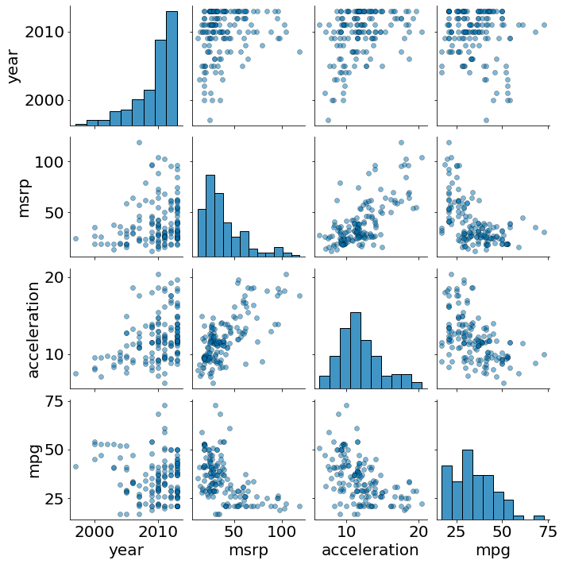
    


## Spearman

Para casos não lineares você pode usar um coeficiente de correlação de posto (*rank correlation coefficient*). 

O [coeficiente de correlação de *Spearman*](https://pt.wikipedia.org/wiki/Coeficiente_de_correla%C3%A7%C3%A3o_de_postos_de_Spearman) $\rho$ é definido como o coeficiente de correlação de Pearson para os postos das variáveis. Para uma amostra de tamanho $n$, os valores originais $X_{i},Y_{i}$ das variáveis $X$ e $Y$ são convertidos em postos (*ranks*) $\operatorname {rg} X_{i},\operatorname {rg} Y_{i}$, sendo $\rho$ calculado como:

$$\rho = r({\operatorname {rg} _{X},\operatorname {rg} _{Y}})={\frac {\operatorname {cov} (\operatorname {rg} _{X},\operatorname {rg} _{Y})}{\sigma _{\operatorname {rg} _{X}}\sigma _{\operatorname {rg} _{Y}}}}$$

em que

$r(.)$  denota o coeficiente de correlação de Pearson usual, mas calculado sobre os postos das variáveis;

$\operatorname {cov} (\operatorname {rg} _{X},\operatorname {rg} _{Y})$ são as covariâncias dos postos das variáveis;

$\sigma _{\operatorname {rg} _{X}}$ and $\sigma _{\operatorname {rg} _{Y}}$ são os desvios padrões dos postos das variáveis. 

Para computar o posto vamos usar a função abaixo.


```python
#In: 
def rank(x):
    aux = x.argsort()
    return aux.argsort()
```

Primeiro, fazemos um `argsort` no vetor. Esta operação retorna, para cada elemento do vetor, sua posição quando o vetor for ordenado. Isto é:

`x[x.argsort()] == x.sort()`


```python
#In: 
x = np.array([7, 8, 9, 10, 1])
x
```


    array([ 7,  8,  9, 10,  1])


```python
#In: 
x.argsort()
```


    array([4, 0, 1, 2, 3])


```python
#In: 
x[x.argsort()]
```


    array([ 1,  7,  8,  9, 10])


Quando chamamos `argsort` duas vezes:

1. Retorna a posição dos elementos quando o vetor for ordenado.
2. Ao ordenar as posições, qual é o posto (rank) do item? Isto é, é o primeiro, segundo, terceiro menor.


```python
#In: 
x.argsort().argsort()
```


    array([1, 2, 3, 4, 0])


```python
#In: 
x
```


    array([ 7,  8,  9, 10,  1])


Observe no resultado acima que:

1. 7 é o segundo elemento
1. 8 é o terceiro
1. 9 é o quarto
1. 0 é o primeiro

Assim, para computar a correlação de spearman basta correlacionar o vetor de postos.

### Spearman com Dados Sintéticos


```python
#In: 
x = np.random.normal(10, 100, 1000)
x = x[x > 0]
y = np.log2(x) + np.random.normal(0, 0.1, len(x))
plt.scatter(x, y, edgecolor='k', alpha=0.6)
plt.xlabel('X')
plt.ylabel('Y')
despine()
```


    
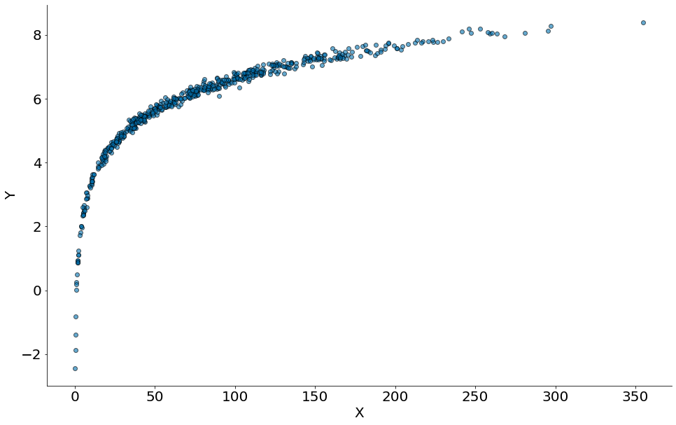
    


Comparando os postos (ranqueamento).


```python
#In: 
x_p = rank(x)
y_p = rank(y)
plt.scatter(x_p, y_p, edgecolor='k', alpha=0.6)
plt.xlabel('X')
plt.ylabel('Y')
despine()
```


    
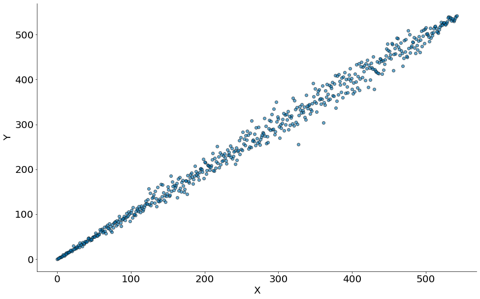
    


```python
#In: 
corr(x, y)
```


    0.8167497869189468


```python
#In: 
corr(x_p, y_p)
```


    0.9956422157250499


Como sempre, as funções já existem em Python:


```python
#In: 
rho, p_val = ss.pearsonr(x, y)
print(rho)
print(p_val)
```

    0.8167497869189468
    2.603256400260837e-131


```python
#In: 
rho, p_val = ss.spearmanr(x, y)
print(rho)
print(p_val)
```

    0.9956422157250497
    0.0


## Valores-p de Correlações

Note que os resultados de scipy vêm com um Valor-p. Lembrando das aulas anteriores, como seria uma hipótese nula para uma correlação?

1. H0: A correlação observada é estatisticamente explicada por permutações.
1. H1: A correlação observada é mais extrema do que permutações

Observe como os dados abaixo tem uma correlação quase que perfeita!


```python
#In: 
x = np.array([7.1, 7.1, 7.2, 8.3, 9.4])
y = np.array([2.8, 2.9, 2.8, 2.6, 3.5])
plt.scatter(x, y, edgecolor='k', alpha=0.6, s=80)
despine()
```


    
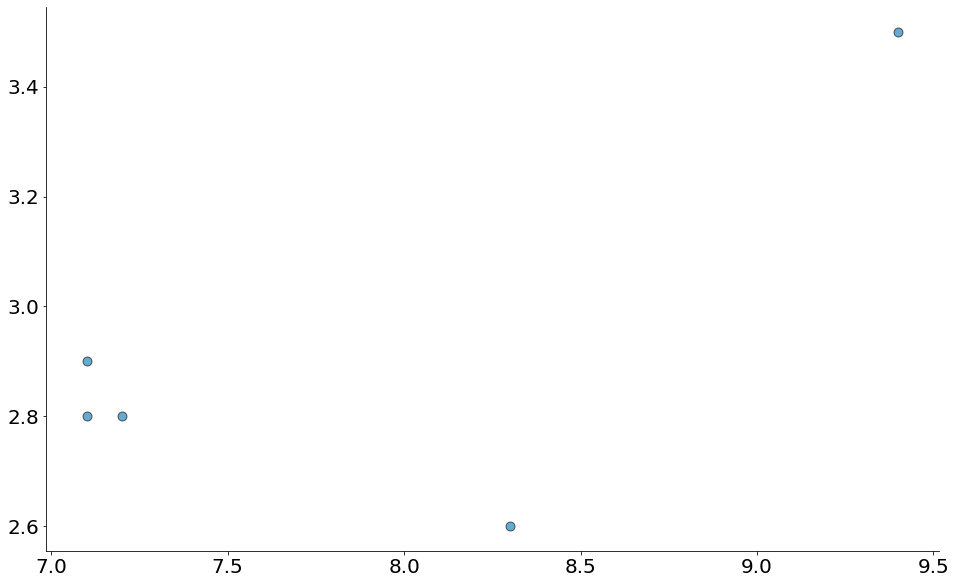
    


```python
#In: 
corr(x, y)
```


    0.6732254696830964


Temos uma correlação até que OK! Agora vamos permutar X 10,000 vezes.


```python
#In: 
x_perm = x.copy()
perm_corr = []
for _ in range(10000):
    np.random.shuffle(x_perm)
    perm_corr.append(corr(x_perm, y))
perm_corr = np.array(perm_corr)
```


```python
#In: 
plt.hist(perm_corr, edgecolor='k')
plt.xlabel('Correlação na Permutação')
plt.ylabel('Quantidade de Permutações')
plt.vlines(corr(x, y), 0, 1500, color='r')
plt.text(0.68, 1000, 'Observado')
despine()
```


    
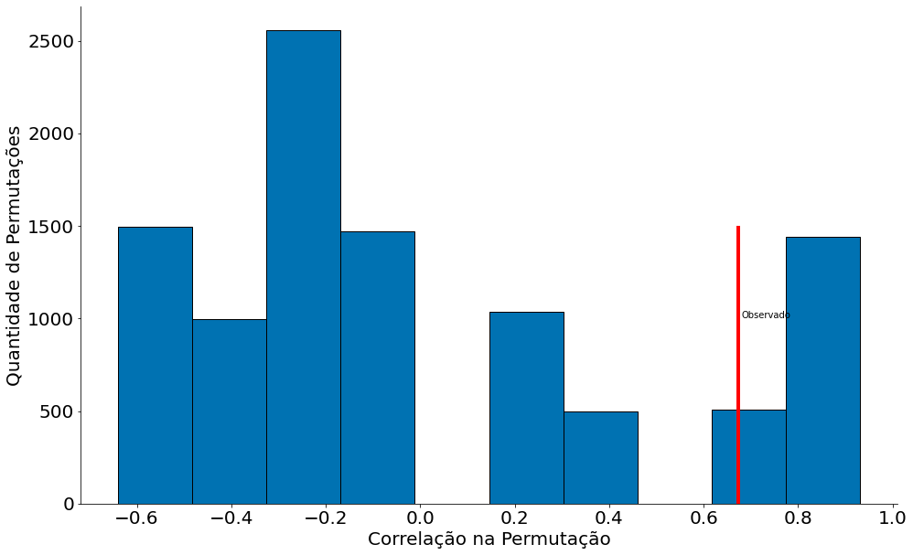
    


```python
#In: 
sum(perm_corr > corr(x, y)) / len(perm_corr)
```


    0.1614


A mesma não é significativa :-(

### Spearman com Dados Reais

Note como a correlação de spearman é um pouco melhor nos dados abaixo:


```python
#In: 
x = df['mpg']
y = df['msrp']

plt.scatter(x, y, edgecolor='k', alpha=0.6, s=80)
plt.xlabel('MPG')
plt.ylabel('MSRP')
despine()
```


    
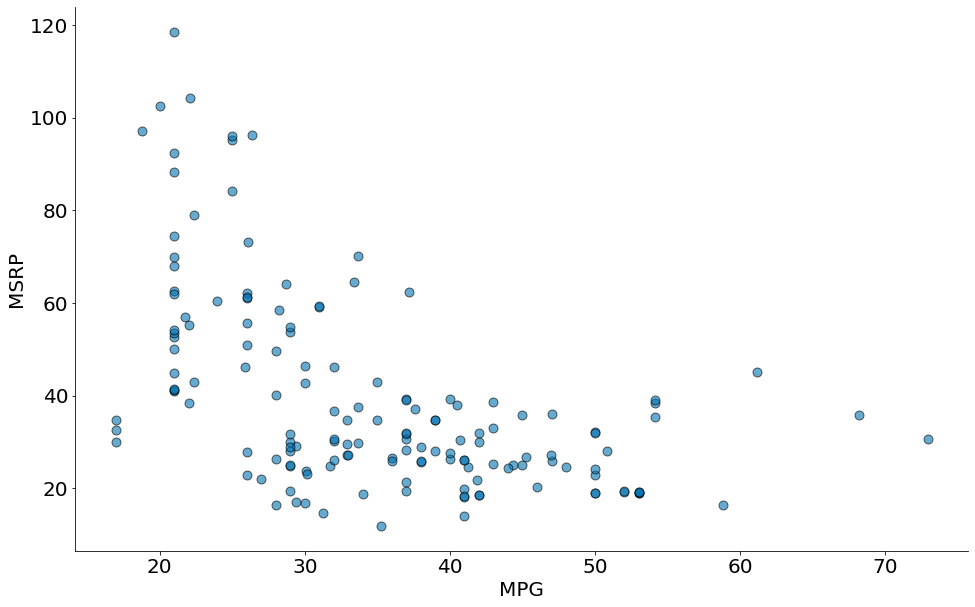
    


```python
#In: 
x_p = rank(x)
y_p = rank(y)
```


```python
#In: 
corr(x, y)
```


    -0.5318263633683785


```python
#In: 
corr(x_p, y_p)
```


    -0.5772419015453071


## Entendendo uma correlação

Nas próximas aulas vamos explorar o conceito de regressão linear. As nossas correlações até o momento já estão explorando tal correlação. Abaixo vemos 4 bases de dados com a melhor regressão.


```python
#In: 
anscombe = sns.load_dataset('anscombe')
sns.lmplot(x='x', y='y', col='dataset', hue='dataset', data=anscombe, ci=None)
```


    <seaborn.axisgrid.FacetGrid at 0x7f570e859af0>


    
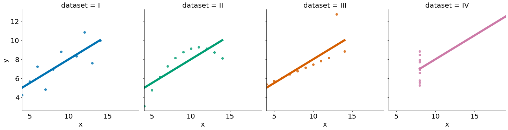
    


```python
#In: 
for data in ['I', 'II', 'IV', 'V']:
    sub = anscombe.query(f'dataset == "{data}"')
    if sub.values.any():
        print('spearman', ss.spearmanr(sub['x'], sub['y'])[0])
        print('pearson', ss.pearsonr(sub['x'], sub['y'])[0])
        print()
```

    spearman 0.8181818181818182
    pearson 0.8164205163448399
    
    spearman 0.690909090909091
    pearson 0.8162365060002427
    
    spearman 0.5
    pearson 0.8165214368885029
    


## Algumas Outras Advertências Correlacionais

Uma correlação de zero indica que não há relação linear entre as duas variáveis. No entanto, outros tipos de relacionamentos podem existir. Por exemplo, se:


```python
#In: 
x1 = np.random.normal(5, 1, 10000)
x2 = np.random.normal(-5, 1, 10000)
y1 = np.random.normal(10, 1, 10000)
y2 = np.random.normal(-10, 1, 10000)
x = np.concatenate((x1, x2, x2, x1))
y = np.concatenate((y1, y2, y1, y2))
plt.scatter(x, y, alpha=0.6, edgecolors='k')
despine()
```


    
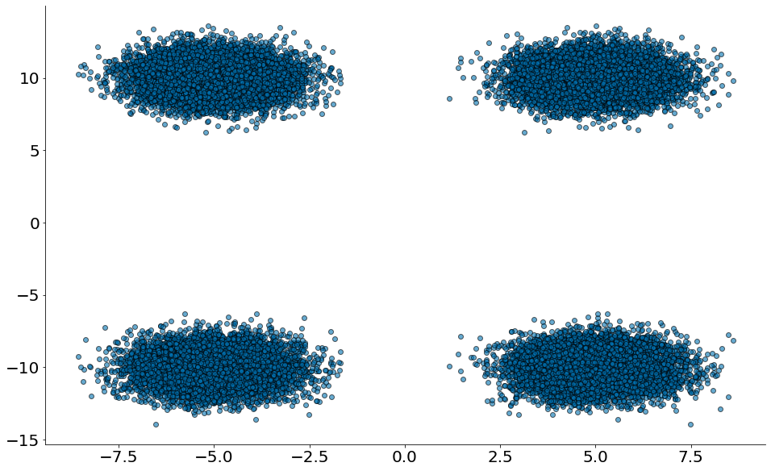
    


então `x` e `y` têm correlação perto de zero. Mas eles certamente têm um relacionamento. Observe os quatro grupos!

## Correlação e Causalidade

Lembrando de que que "correlação não é causalidade", provavelmente por alguém que olha dados que representam um desafio para partes de sua visão de mundo que ele estava relutante em questionar. No entanto, este é um ponto importante - se `x` e `y` estão fortemente correlacionados, isso pode significar que `x` causa `y`, `y` causa `x`, que cada um causa o outro, que algum terceiro fator causa ambos, ou pode não significar nada.

Nos exemplos acima:

1. Quanto maior o consumo de um carro, mais o mesmo acelera. Podemos concluir causalidade?
1. Quanto maior a aceleração, maior o preço. Podemos concluir causalidade?

No primeiro caso temos uma relação física, para obter uma maior velocidade precisamos queimar mais combustível. Isto é esperado dado a mecânica do carro. E no segundo caso?! Pode existir uma série de variáveis que levam a um maior preço. Não podemos dizer que é apenas a aceleração. Pode ser que os carros que aceleram mais são carros esportivos. O mesmo vai ter um preço alto mesmo se não acelerar muito.

## Dados Categóricos

Para explorar dados categóricos vamos fazer um da estatística $\chi^2$. Para uma tabela de dados, a estatística $\chi^2$ é definida como:

$$\chi^2=\sum_{i=1}^n \frac{(O_i-E_i)^2}{E_i}$$

Aqui, $O_i$ é um valor observado e $E_i$ é um valor esperado. Note que quanto maior este valor, mais o Observado difere do Esperado. O problema é, como definir $E_i$? É aqui que podemos levantar uma hipótese nula. Qual é ao valor esperado caso a seleção fosse uniforme?

Vamos explorar essa ideia abaixo. Para tal, vamos fazer um teste de permutações.


```python
#In: 
def permuta(df, coluna):
    '''
    Permuta um dataframe com base e uma coluna categórica.
    Este código é mais lento pois cria uma cópia.
    
    Parâmetros
    ----------
    df: o dataframe
    coluna: uma coluna categórica
    
    Retorna
    -------
    um novo df permutado
    '''
    
    novo = df.copy()            # Cópia dos dados
    dados = df[coluna].copy()   # Copia da coluna, evitar um warning pandas. Deve ter forma melhor de fazer.
    np.random.shuffle(dados)    # Faz o shuffle
    novo[coluna] = dados        # Faz overwrite da coluna
    return novo
```

Aqui leio os dados do Titanic.

1. class: a classe, quanto maior mais cara a passage. O caso especial 0 é a classe de tripulantes. 
1. Age, Sex e Survived. Valor um quando presente (sobreviveu), zero quando ausente (não sobreviveu). Para age, 1 e 0 captura crianças (0) e adultos (1).


```python
#In: 
df = pd.read_csv('https://media.githubusercontent.com/media/icd-ufmg/material/master/aulas/15-Correlacao/survival_titanic.csv')
df.tail()
```


<div>
<style scoped>
    .dataframe tbody tr th:only-of-type {
        vertical-align: middle;
    }

    .dataframe tbody tr th {
        vertical-align: top;
    }

    .dataframe thead th {
        text-align: right;
    }
</style>
<table border="1" class="dataframe">
  <thead>
    <tr style="text-align: right;">
      <th></th>
      <th>class</th>
      <th>Age</th>
      <th>Sex</th>
      <th>Survived</th>
    </tr>
  </thead>
  <tbody>
    <tr>
      <th>2196</th>
      <td>0</td>
      <td>1</td>
      <td>0</td>
      <td>1</td>
    </tr>
    <tr>
      <th>2197</th>
      <td>0</td>
      <td>1</td>
      <td>0</td>
      <td>1</td>
    </tr>
    <tr>
      <th>2198</th>
      <td>0</td>
      <td>1</td>
      <td>0</td>
      <td>0</td>
    </tr>
    <tr>
      <th>2199</th>
      <td>0</td>
      <td>1</td>
      <td>0</td>
      <td>0</td>
    </tr>
    <tr>
      <th>2200</th>
      <td>0</td>
      <td>1</td>
      <td>0</td>
      <td>0</td>
    </tr>
  </tbody>
</table>
</div>


Vamos montar uma tabela de contigência na mão. Para tal, vou inidicar contando a fração de pessoas que sobreviveram por classe. Podemos aplicar o group-by na classe e tirar a média. Lembrando que a média de 1s e 0s captura uma fração.


```python
#In: 
df[['class', 'Survived']].groupby('class').mean()
```


<div>
<style scoped>
    .dataframe tbody tr th:only-of-type {
        vertical-align: middle;
    }

    .dataframe tbody tr th {
        vertical-align: top;
    }

    .dataframe thead th {
        text-align: right;
    }
</style>
<table border="1" class="dataframe">
  <thead>
    <tr style="text-align: right;">
      <th></th>
      <th>Survived</th>
    </tr>
    <tr>
      <th>class</th>
      <th></th>
    </tr>
  </thead>
  <tbody>
    <tr>
      <th>0</th>
      <td>0.239548</td>
    </tr>
    <tr>
      <th>1</th>
      <td>0.624615</td>
    </tr>
    <tr>
      <th>2</th>
      <td>0.414035</td>
    </tr>
    <tr>
      <th>3</th>
      <td>0.252125</td>
    </tr>
  </tbody>
</table>
</div>


Agora montar o dataframe novo. 

ps: existe uma função `crosstab` do pandas que faz tudo isso. Estamos fazendo na mão para aprender.


```python
#In: 
cont = df[['class', 'Survived']].groupby('class').mean() # taxa survival
cont['Died'] = 1 - cont['Survived'] # não survival, nova coluna 1-
cont['Count'] = df[['class']].groupby('class').size() # número em cada classe
cont
```


<div>
<style scoped>
    .dataframe tbody tr th:only-of-type {
        vertical-align: middle;
    }

    .dataframe tbody tr th {
        vertical-align: top;
    }

    .dataframe thead th {
        text-align: right;
    }
</style>
<table border="1" class="dataframe">
  <thead>
    <tr style="text-align: right;">
      <th></th>
      <th>Survived</th>
      <th>Died</th>
      <th>Count</th>
    </tr>
    <tr>
      <th>class</th>
      <th></th>
      <th></th>
      <th></th>
    </tr>
  </thead>
  <tbody>
    <tr>
      <th>0</th>
      <td>0.239548</td>
      <td>0.760452</td>
      <td>885</td>
    </tr>
    <tr>
      <th>1</th>
      <td>0.624615</td>
      <td>0.375385</td>
      <td>325</td>
    </tr>
    <tr>
      <th>2</th>
      <td>0.414035</td>
      <td>0.585965</td>
      <td>285</td>
    </tr>
    <tr>
      <th>3</th>
      <td>0.252125</td>
      <td>0.747875</td>
      <td>706</td>
    </tr>
  </tbody>
</table>
</div>


Agora, vamos computar a taxa de sobrevência global.


```python
#In: 
df['Survived'].mean()
```


    0.3230349840981372


Com a taxa acima posso criar um novo dataframe do que seria esperado em um mundo uniforme.


```python
#In: 
unif = cont.copy()
unif['Survived'] = df['Survived'].mean()
unif['Died'] = 1 - df['Survived'].mean()
unif
```


<div>
<style scoped>
    .dataframe tbody tr th:only-of-type {
        vertical-align: middle;
    }

    .dataframe tbody tr th {
        vertical-align: top;
    }

    .dataframe thead th {
        text-align: right;
    }
</style>
<table border="1" class="dataframe">
  <thead>
    <tr style="text-align: right;">
      <th></th>
      <th>Survived</th>
      <th>Died</th>
      <th>Count</th>
    </tr>
    <tr>
      <th>class</th>
      <th></th>
      <th></th>
      <th></th>
    </tr>
  </thead>
  <tbody>
    <tr>
      <th>0</th>
      <td>0.323035</td>
      <td>0.676965</td>
      <td>885</td>
    </tr>
    <tr>
      <th>1</th>
      <td>0.323035</td>
      <td>0.676965</td>
      <td>325</td>
    </tr>
    <tr>
      <th>2</th>
      <td>0.323035</td>
      <td>0.676965</td>
      <td>285</td>
    </tr>
    <tr>
      <th>3</th>
      <td>0.323035</td>
      <td>0.676965</td>
      <td>706</td>
    </tr>
  </tbody>
</table>
</div>


E por fim, computar:

$$\chi^2=\sum_{i=1}^n \frac{(O_i-E_i)^2}{E_i}$$


```python
#In: 
chi_sq = (cont - unif) ** 2
chi_sq = chi_sq / unif
chi_sq
```


<div>
<style scoped>
    .dataframe tbody tr th:only-of-type {
        vertical-align: middle;
    }

    .dataframe tbody tr th {
        vertical-align: top;
    }

    .dataframe thead th {
        text-align: right;
    }
</style>
<table border="1" class="dataframe">
  <thead>
    <tr style="text-align: right;">
      <th></th>
      <th>Survived</th>
      <th>Died</th>
      <th>Count</th>
    </tr>
    <tr>
      <th>class</th>
      <th></th>
      <th></th>
      <th></th>
    </tr>
  </thead>
  <tbody>
    <tr>
      <th>0</th>
      <td>0.021577</td>
      <td>0.010296</td>
      <td>0.0</td>
    </tr>
    <tr>
      <th>1</th>
      <td>0.281551</td>
      <td>0.134351</td>
      <td>0.0</td>
    </tr>
    <tr>
      <th>2</th>
      <td>0.025635</td>
      <td>0.012233</td>
      <td>0.0</td>
    </tr>
    <tr>
      <th>3</th>
      <td>0.015566</td>
      <td>0.007428</td>
      <td>0.0</td>
    </tr>
  </tbody>
</table>
</div>


Por coluna


```python
#In: 
chi_sq.sum()
```


    Survived    0.344328
    Died        0.164307
    Count       0.000000
    dtype: float64


Tudo


```python
#In: 
t_obs = chi_sq.sum().sum()
t_obs
```


    0.5086353797871764


Daqui para frente é só fazer o teste de permutação! Observe uma permutação abaixo.


```python
#In: 
permut = permuta(df, 'class')
cont_p = permut[['class', 'Survived']].groupby('class').mean()
cont_p['Died'] = 1 - cont_p['Survived']
cont_p['Count'] = df[['class']].groupby('class').size()
cont_p
```


<div>
<style scoped>
    .dataframe tbody tr th:only-of-type {
        vertical-align: middle;
    }

    .dataframe tbody tr th {
        vertical-align: top;
    }

    .dataframe thead th {
        text-align: right;
    }
</style>
<table border="1" class="dataframe">
  <thead>
    <tr style="text-align: right;">
      <th></th>
      <th>Survived</th>
      <th>Died</th>
      <th>Count</th>
    </tr>
    <tr>
      <th>class</th>
      <th></th>
      <th></th>
      <th></th>
    </tr>
  </thead>
  <tbody>
    <tr>
      <th>0</th>
      <td>0.329944</td>
      <td>0.670056</td>
      <td>885</td>
    </tr>
    <tr>
      <th>1</th>
      <td>0.338462</td>
      <td>0.661538</td>
      <td>325</td>
    </tr>
    <tr>
      <th>2</th>
      <td>0.305263</td>
      <td>0.694737</td>
      <td>285</td>
    </tr>
    <tr>
      <th>3</th>
      <td>0.314448</td>
      <td>0.685552</td>
      <td>706</td>
    </tr>
  </tbody>
</table>
</div>


Como o valor muda


```python
#In: 
chi_sq = (cont_p - unif) ** 2
chi_sq = chi_sq / unif
chi_sq.sum().sum()
```


    0.0030879681358975675


1000 permutações. 10000 demora muito. Mas neste caso com 1000 já podemos ver que `t_obs=0.5` é bem raro.


```python
#In: 
chi_sqs = []
for _ in range(1000):
    permut = permuta(df, 'class')
    cont_p = permut[['class', 'Survived']].groupby('class').mean()
    cont_p['Died'] = 1 - cont_p['Survived']
    cont_p['Count'] = df[['class']].groupby('class').size()
    chi_sq = (cont_p - unif) ** 2
    chi_sq = chi_sq / unif
    stat = chi_sq.sum().sum()
    chi_sqs.append(stat)
```


```python
#In: 
plt.hist(chi_sqs, edgecolor='k')
plt.xlabel(r'$\chi^2$')
plt.ylabel('Num Amostras Permutadas')
```


    Text(0, 0.5, 'Num Amostras Permutadas')


    
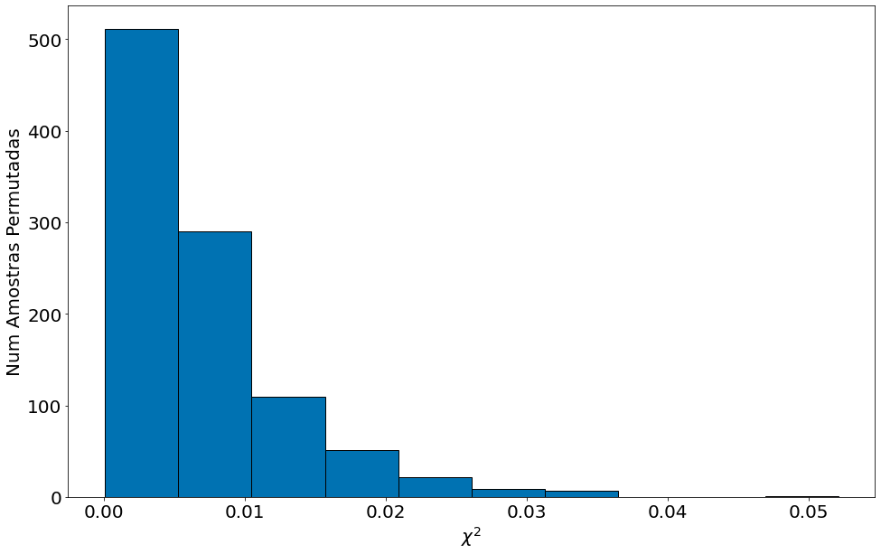
    


## Paradoxo de Simpson

Correlação está medindo a relação entre suas duas variáveis **sendo todo o resto igual**. Ou seja, não controlamos por nenhum outro efeito. Assuma que os dados agoram vêm de grupos diferentes. Se seus grupos de dados são atribuídos uniforme, como em um experimento bem projetado, **sendo todo o resto igual** pode não ser uma suposição terrível. Mas quando há um padrão mais profundo para atribuições de grupos, **sendo todo o resto igual** pode ser uma suposição terrível.

Considere os dados sintéticos abaixo. Parece que temos uma correlação linear!


```python
#In: 
x1 = np.random.normal(10, 1, 1000)
y1 = -x1 + np.random.normal(0, 2, 1000)

x2 = np.random.normal(12, 1, 1000)
y2 = -x2 + np.random.normal(6, 2, 1000)

x3 = np.random.normal(14, 1, 1000)
y3 = -x3 + np.random.normal(12, 2, 1000)

x = np.concatenate([x1, x2, x3])
y = np.concatenate([y1, y2, y3])
plt.scatter(x, y, edgecolor='k', alpha=0.6)
plt.xlabel('Excercise')
plt.ylabel('Cholesterol')
plt.xticks([])
plt.yticks([])
despine()
```


    
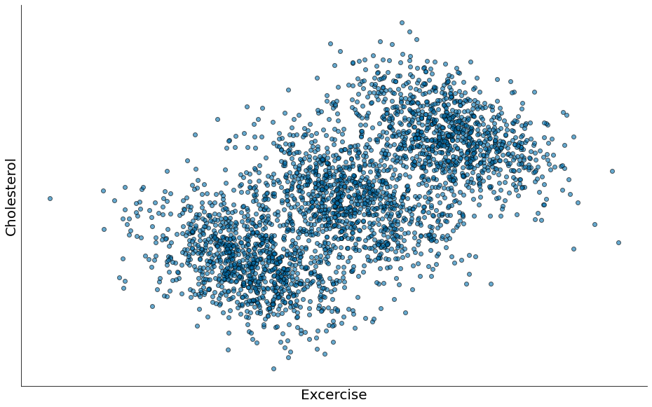
    


Porém eu, Flavio, escolhi os grupos de forma que afetam o resultado. Embora sejam dados sintéticos, tal efeito já foi observado em estudos sobre colesterol.

1. Existe um crescimento no colesterol com a idade.
1. Porém, existe uma redução com atividade física.

O paradoxo: Não podemos ver o segundo ponto, pois o crescimento com a idade domina.


```python
#In: 
x1 = np.random.normal(10, 1, 1000)
y1 = -x1 + np.random.normal(0, 2, 1000)

x2 = np.random.normal(12, 1, 1000)
y2 = -x2 + np.random.normal(6, 2, 1000)

x3 = np.random.normal(14, 1, 1000)
y3 = -x3 + np.random.normal(12, 2, 1000)

plt.scatter(x1, y1, edgecolor='k', alpha=0.6, label='Children')
plt.scatter(x2, y2, edgecolor='k', alpha=0.6, label='Teenagers')
plt.scatter(x3, y3, edgecolor='k', alpha=0.6, label='Adults')
plt.xlabel('Excercise')
plt.ylabel('Cholesterol')
plt.xticks([])
plt.yticks([])
plt.legend()
despine()
```


    
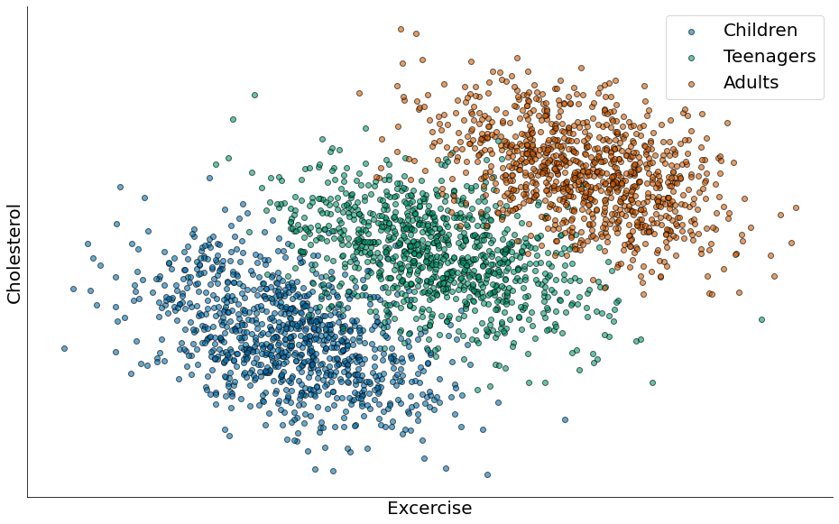
    


### Paradoxo em Dados Categóricos

Por fim, temos dados reais de contratações em Berkeley nos anos 70. Os dados estão estratificados por departamento. Quebrei os mesmos por gênero.


```python
#In: 
df = pd.read_csv('https://media.githubusercontent.com/media/icd-ufmg/material/master/aulas/15-Correlacao/berkeley.csv', index_col=0)
male = df[['Admitted_Male', 'Denied_Male']]
female = df[['Admitted_Female', 'Denied_Female']]
male.head()
```


<div>
<style scoped>
    .dataframe tbody tr th:only-of-type {
        vertical-align: middle;
    }

    .dataframe tbody tr th {
        vertical-align: top;
    }

    .dataframe thead th {
        text-align: right;
    }
</style>
<table border="1" class="dataframe">
  <thead>
    <tr style="text-align: right;">
      <th></th>
      <th>Admitted_Male</th>
      <th>Denied_Male</th>
    </tr>
    <tr>
      <th>Department</th>
      <th></th>
      <th></th>
    </tr>
  </thead>
  <tbody>
    <tr>
      <th>A</th>
      <td>512</td>
      <td>313</td>
    </tr>
    <tr>
      <th>B</th>
      <td>313</td>
      <td>207</td>
    </tr>
    <tr>
      <th>C</th>
      <td>120</td>
      <td>205</td>
    </tr>
    <tr>
      <th>D</th>
      <td>138</td>
      <td>279</td>
    </tr>
    <tr>
      <th>E</th>
      <td>53</td>
      <td>138</td>
    </tr>
  </tbody>
</table>
</div>


```python
#In: 
male.head()
```


<div>
<style scoped>
    .dataframe tbody tr th:only-of-type {
        vertical-align: middle;
    }

    .dataframe tbody tr th {
        vertical-align: top;
    }

    .dataframe thead th {
        text-align: right;
    }
</style>
<table border="1" class="dataframe">
  <thead>
    <tr style="text-align: right;">
      <th></th>
      <th>Admitted_Male</th>
      <th>Denied_Male</th>
    </tr>
    <tr>
      <th>Department</th>
      <th></th>
      <th></th>
    </tr>
  </thead>
  <tbody>
    <tr>
      <th>A</th>
      <td>512</td>
      <td>313</td>
    </tr>
    <tr>
      <th>B</th>
      <td>313</td>
      <td>207</td>
    </tr>
    <tr>
      <th>C</th>
      <td>120</td>
      <td>205</td>
    </tr>
    <tr>
      <th>D</th>
      <td>138</td>
      <td>279</td>
    </tr>
    <tr>
      <th>E</th>
      <td>53</td>
      <td>138</td>
    </tr>
  </tbody>
</table>
</div>


No geral, mulheres são admitidas com uma taxa menor!


```python
#In: 
male.sum() / male.sum().sum()
```


    Admitted_Male    0.436816
    Denied_Male      0.563184
    dtype: float64


```python
#In: 
female.sum() / female.sum().sum()
```


    Admitted_Female    0.303542
    Denied_Female      0.696458
    dtype: float64


Só que por departamento, a taxa é maior! Qual o motivo? Estamos computando frações. Mulheres aplicavam para os departamentos mais concorridos!


```python
#In: 
male.T / male.sum(axis=1)
```


<div>
<style scoped>
    .dataframe tbody tr th:only-of-type {
        vertical-align: middle;
    }

    .dataframe tbody tr th {
        vertical-align: top;
    }

    .dataframe thead th {
        text-align: right;
    }
</style>
<table border="1" class="dataframe">
  <thead>
    <tr style="text-align: right;">
      <th>Department</th>
      <th>A</th>
      <th>B</th>
      <th>C</th>
      <th>D</th>
      <th>E</th>
      <th>F</th>
    </tr>
  </thead>
  <tbody>
    <tr>
      <th>Admitted_Male</th>
      <td>0.620606</td>
      <td>0.601923</td>
      <td>0.369231</td>
      <td>0.330935</td>
      <td>0.277487</td>
      <td>0.058981</td>
    </tr>
    <tr>
      <th>Denied_Male</th>
      <td>0.379394</td>
      <td>0.398077</td>
      <td>0.630769</td>
      <td>0.669065</td>
      <td>0.722513</td>
      <td>0.941019</td>
    </tr>
  </tbody>
</table>
</div>


```python
#In: 
female.T / female.sum(axis=1)
```


<div>
<style scoped>
    .dataframe tbody tr th:only-of-type {
        vertical-align: middle;
    }

    .dataframe tbody tr th {
        vertical-align: top;
    }

    .dataframe thead th {
        text-align: right;
    }
</style>
<table border="1" class="dataframe">
  <thead>
    <tr style="text-align: right;">
      <th>Department</th>
      <th>A</th>
      <th>B</th>
      <th>C</th>
      <th>D</th>
      <th>E</th>
      <th>F</th>
    </tr>
  </thead>
  <tbody>
    <tr>
      <th>Admitted_Female</th>
      <td>0.824074</td>
      <td>0.68</td>
      <td>0.340641</td>
      <td>0.349333</td>
      <td>0.239186</td>
      <td>0.070381</td>
    </tr>
    <tr>
      <th>Denied_Female</th>
      <td>0.175926</td>
      <td>0.32</td>
      <td>0.659359</td>
      <td>0.650667</td>
      <td>0.760814</td>
      <td>0.929619</td>
    </tr>
  </tbody>
</table>
</div>


