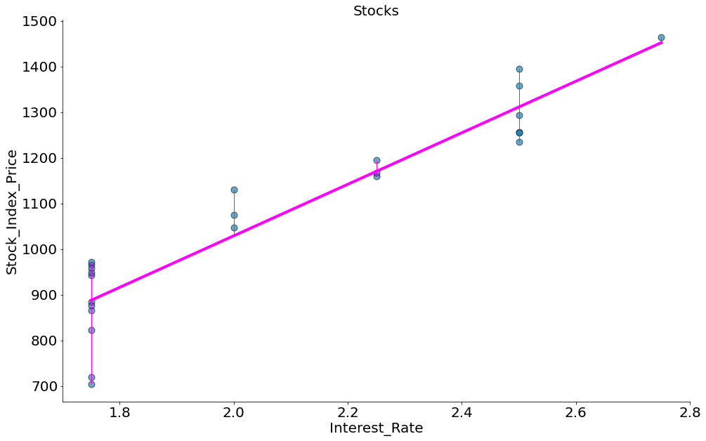

[](https://colab.research.google.com/github/icd-ufmg/icd-ufmg.github.io/blob/master/_lessons/16-vero.ipynb)

# Verossimilhança

{: .no_toc .mb-2 }

Entendimento de relação entre dados.
{: .fs-6 .fw-300 }

{: .no_toc .text-delta }
Resultados Esperados

1. Revisitar os mínimos quadrados (ALC)
1. Entender a regressão linear do ponto de vista probabilístico
1. Entender o conceito de verossimilhança

---
**Sumário**
1. TOC
{:toc}
---


```python
#In: 
# -*- coding: utf8

from scipy import stats as ss

import matplotlib.pyplot as plt
import numpy as np
import pandas as pd
import seaborn as sns
```


```python
#In: 
plt.style.use('seaborn-colorblind')
plt.rcParams['figure.figsize']  = (16, 10)
plt.rcParams['axes.labelsize']  = 20
plt.rcParams['axes.titlesize']  = 20
plt.rcParams['legend.fontsize'] = 20
plt.rcParams['xtick.labelsize'] = 20
plt.rcParams['ytick.labelsize'] = 20
plt.rcParams['lines.linewidth'] = 4
```


```python
#In: 
plt.ion()
```


```python
#In: 
def despine(ax=None):
    if ax is None:
        ax = plt.gca()
    # Hide the right and top spines
    ax.spines['right'].set_visible(False)
    ax.spines['top'].set_visible(False)

    # Only show ticks on the left and bottom spines
    ax.yaxis.set_ticks_position('left')
    ax.xaxis.set_ticks_position('bottom')
```

## Introdução

Continuando da aula passada. Vamos ver mais uma forma de entender um modelo de regressão linear. Lembre-se até agora falamos de correlação e covariância cobrindo os seguintes tópicos:

1. Covariância
1. Coeficiente de Pearson (Covariância Normalizada)
1. Coeficiente de Pearson como sendo a fração do desvio de y capturado por x
1. Mínimos Quadrados

Todos os passos acima chegam no mesmo local de traçar a "melhor" reta no gráfico de dispersão. Melhor aqui significa a reta que que minimiza o erro abaixo:

$$\Theta = [\alpha, \beta]$$
$$L(\Theta) = \sum_i (y_i - \hat{y}_i)^2$$
$$L(\Theta) = \sum_i (y_i - \beta x_i + \alpha)^2$$

Chegamos em:

\begin{align}
 \alpha & = \bar{y} - \beta\,\bar{x}, \\[5pt]
  \beta &= \frac{ \sum_{i=1}^n (x_i - \bar{x})(y_i - \bar{y}) }{ \sum_{i=1}^n (x_i - \bar{x})^2 } \\[6pt]
            &= \frac{ \operatorname{Cov}(x, y) }{ \operatorname{Var}(x) } \\[5pt]
            &= r_{xy} \frac{s_y}{s_x}. \\[6pt]
\end{align}

## Visão probabílistica

Vamos aprender uma última forma de pensar na regressão. Em particular, vamos fazer uso de uma visão probabílistica. Para tal, exploraremos o caso dos apartamentos de BH abaixo.

Inicialmente, vamos observar os dados além do resultado da melhor regressão.


```python
#In: 
df = pd.read_csv('https://raw.githubusercontent.com/icd-ufmg/material/master/aulas/17-Verossimilhanca/aptosBH.txt', index_col=0)
df['preco'] = df['preco'] / 1000
plt.scatter(df['area'], df['preco'], edgecolors='k', s=80, alpha=0.6)
plt.title('Preco de Apartamentos em BH')
plt.ylabel(r'Preço * $10^3$ (R\$)')
plt.xlabel(r'Área ($M^2$)')
despine()
```


    

    


O seaborn tem uma função regplot que plota a melhor reta além de um IC (estmado via bootstrap -- aula passada).


```python
#In: 
sns.regplot(x='area', y='preco', data=df, n_boot=10000,
            line_kws={'color':'magenta', 'lw':4},
            scatter_kws={'edgecolor':'k', 's':80, 'alpha':0.8})
plt.title('Preco de Apartamentos em BH')
plt.ylabel(r'Preço * $10^3$ (R\$)')
plt.xlabel(r'Área ($M^2$)')
despine()
```


    

    


A reta pode ser recuperada usando scipy.


```python
#In: 
model = ss.linregress(df['area'], df['preco'])
# beta = slope
# alpha = intercept
model 
```


    LinregressResult(slope=3.5357191563336516, intercept=200.5236136898945, rvalue=0.694605637960645, pvalue=1.917920339304322e-32, stderr=0.2503210673009473)


Usando esta reta podemos prever o preço de um apartamento usando apenas a área do mesmo.


```python
#In: 
beta = model.slope
alpha = model.intercept
novo_apt_area = 225
preco = beta * novo_apt_area + alpha
preco
```


    996.0604238649662


Ou seja, quando um apartamento de 225m2 entra no mercado o mesmo custa em torno de 1M de reais.

## Erros Normais

Agora, será que conseguimos chegar no mesmo pensando na regressão como um modelo probabilístico?

[Discussão nos Slides](https://docs.google.com/presentation/d/1nSmN9ch1x6ABczaAzB292XgTqbXcIo1UIX1xjCrF1d8/edit#slide=id.g5a114266c3_0_26)


```python
#In: 
x = np.linspace(-5, 5, 100)
plt.plot(x, ss.distributions.norm.pdf(x, scale=1))
plt.xlabel(r'$\epsilon_i$')
plt.ylabel(r'$p(\epsilon_i \mid \mu=0, \sigma=1)$')

despine()
```


    

    


```python
#In: 
beta = 1
alpha = 1

fig = plt.figure(figsize=(36, 10))

x = np.array([2, 8, 5])
y = np.array([0, 1, 3])

plt.subplot(121)
plt.scatter(x, y, edgecolors='k', s=80, alpha=0.6)
plt.title('3 Pontinhos')
plt.ylabel(r'Y')
plt.xlabel(r'X')

y_bar = x * beta + alpha
plt.plot(x, y_bar, color='magenta')

y_min = [min(y_i, y_bar_i) for y_i, y_bar_i in zip(y, y_bar)]
y_max = [max(y_i, y_bar_i) for y_i, y_bar_i in zip(y, y_bar)]
plt.vlines(x, ymin=y_min, ymax=y_max, color='magenta', lw=1)

despine()

plt.subplot(122)
plt.title('PDF da Normal')
ei_x = np.linspace(-10, 10, 100)
sigma = (y - y_bar).std(ddof=1)
plt.plot(ei_x, ss.distributions.norm.pdf(ei_x, scale=sigma))
plt.xlabel(r'$\epsilon_i$')
plt.ylabel(r'$p(\epsilon_i \mid \mu=0, \sigma={})$'.format(np.round(sigma, 2)))
despine()
```


    

    


```python
#In: 
beta = 3.535719156333653
alpha = 200.52361368989432

fig = plt.figure(figsize=(36, 10))

x = df['area']
y = df['preco']

plt.subplot(121)
plt.scatter(x, y, edgecolors='k', s=80, alpha=0.6)
plt.title('Preco de Apartamentos em BH')
plt.ylabel(r'Preço * $10^3$ (R\$)')
plt.xlabel(r'Área ($M^2$)')

y_bar = x * beta + alpha
plt.plot(x, y_bar, color='magenta')

y_min = [min(y_i, y_bar_i) for y_i, y_bar_i in zip(y, y_bar)]
y_max = [max(y_i, y_bar_i) for y_i, y_bar_i in zip(y, y_bar)]
plt.vlines(x, ymin=y_min, ymax=y_max, color='magenta', lw=1)

despine()

plt.subplot(122)
plt.title('PDF da Normal')
ei_x = np.linspace(-1000, 1000, 100)
sigma = (y - y_bar).std(ddof=1)
plt.plot(ei_x, ss.distributions.norm.pdf(ei_x, scale=sigma))
plt.xlabel(r'$\epsilon_i$')
plt.ylabel(r'$p(\epsilon_i \mid \mu=0, \sigma={})$'.format(np.round(sigma, 2)))
despine()
```


    

    


```python
#In: 
sns.residplot(x='area', y='preco', data=df,
              line_kws={'color':'magenta', 'lw':4},
              scatter_kws={'edgecolor':'k', 's':80, 'alpha':0.8})
plt.ylabel(r'$\epsilon_i$')
plt.xlabel(r'Área ($M^2$)')
despine()
```


    

    


```python
#In: 
ss.probplot(y - y_bar, plot=plt.gca());
```


    ((array([-2.72615229, -2.41925291, -2.24456515, -2.11960108, -2.02096546,
             -1.93878946, -1.86793868, -1.80538627, -1.74919165, -1.69803298,
             -1.65096767, -1.6072989 , -1.56649638, -1.5281468 , -1.49192147,
             -1.45755452, -1.42482771, -1.39355955, -1.36359747, -1.33481187,
             -1.3070917 , -1.28034108, -1.25447654, -1.22942504, -1.20512221,
             -1.18151106, -1.15854082, -1.13616613, -1.11434623, -1.09304437,
             -1.07222728, -1.05186477, -1.0319293 , -1.01239573, -0.99324101,
             -0.97444395, -0.95598503, -0.93784624, -0.92001088, -0.90246348,
             -0.88518965, -0.868176  , -0.85141001, -0.83488001, -0.81857505,
             -0.80248485, -0.78659978, -0.77091076, -0.75540925, -0.74008717,
             -0.7249369 , -0.70995122, -0.69512332, -0.6804467 , -0.6659152 ,
             -0.65152299, -0.63726449, -0.62313438, -0.60912761, -0.59523934,
             -0.58146495, -0.56780001, -0.55424028, -0.5407817 , -0.52742038,
             -0.51415256, -0.50097464, -0.48788315, -0.47487475, -0.46194622,
             -0.44909444, -0.43631642, -0.42360925, -0.41097012, -0.3983963 ,
             -0.38588516, -0.37343413, -0.36104072, -0.34870253, -0.3364172 ,
             -0.32418243, -0.311996  , -0.29985573, -0.2877595 , -0.27570523,
             -0.26369089, -0.25171449, -0.23977409, -0.22786778, -0.21599368,
             -0.20414996, -0.19233481, -0.18054645, -0.16878313, -0.15704311,
             -0.14532471, -0.13362622, -0.121946  , -0.11028238, -0.09863376,
             -0.0869985 , -0.07537501, -0.06376169, -0.05215696, -0.04055926,
             -0.02896701, -0.01737865, -0.00579262,  0.00579262,  0.01737865,
              0.02896701,  0.04055926,  0.05215696,  0.06376169,  0.07537501,
              0.0869985 ,  0.09863376,  0.11028238,  0.121946  ,  0.13362622,
              0.14532471,  0.15704311,  0.16878313,  0.18054645,  0.19233481,
              0.20414996,  0.21599368,  0.22786778,  0.23977409,  0.25171449,
              0.26369089,  0.27570523,  0.2877595 ,  0.29985573,  0.311996  ,
              0.32418243,  0.3364172 ,  0.34870253,  0.36104072,  0.37343413,
              0.38588516,  0.3983963 ,  0.41097012,  0.42360925,  0.43631642,
              0.44909444,  0.46194622,  0.47487475,  0.48788315,  0.50097464,
              0.51415256,  0.52742038,  0.5407817 ,  0.55424028,  0.56780001,
              0.58146495,  0.59523934,  0.60912761,  0.62313438,  0.63726449,
              0.65152299,  0.6659152 ,  0.6804467 ,  0.69512332,  0.70995122,
              0.7249369 ,  0.74008717,  0.75540925,  0.77091076,  0.78659978,
              0.80248485,  0.81857505,  0.83488001,  0.85141001,  0.868176  ,
              0.88518965,  0.90246348,  0.92001088,  0.93784624,  0.95598503,
              0.97444395,  0.99324101,  1.01239573,  1.0319293 ,  1.05186477,
              1.07222728,  1.09304437,  1.11434623,  1.13616613,  1.15854082,
              1.18151106,  1.20512221,  1.22942504,  1.25447654,  1.28034108,
              1.3070917 ,  1.33481187,  1.36359747,  1.39355955,  1.42482771,
              1.45755452,  1.49192147,  1.5281468 ,  1.56649638,  1.6072989 ,
              1.65096767,  1.69803298,  1.74919165,  1.80538627,  1.86793868,
              1.93878946,  2.02096546,  2.11960108,  2.24456515,  2.41925291,
              2.72615229]),
      array([-581.7392924 , -544.95333458, -496.95306183, -413.52456833,
             -384.93361007, -375.34604074, -339.81127622, -338.16737677,
             -327.3932956 , -295.52429558, -295.52429558, -295.02436377,
             -293.91727448, -288.81004883, -280.88148714, -264.52443195,
             -258.73833776, -252.13131667, -251.59587027, -250.16710401,
             -245.52429558, -244.09552932, -238.23840595, -234.09552932,
             -228.01047273, -223.69757724, -210.66730858, -205.56836094,
             -204.09552932, -201.60835549, -201.60835549, -194.09552932,
             -192.68176615, -190.15262542, -190.15262542, -189.45272089,
             -189.45272089, -185.76340254, -180.95251632, -180.34535885,
             -176.7741251 , -174.42297671, -173.3811462 , -171.63154226,
             -171.36085515, -170.88148714, -170.88148714, -166.59587027,
             -166.2386787 , -166.2386787 , -158.73833776, -158.73833776,
             -158.73833776, -157.52402282, -148.6311121 , -145.70255041,
             -145.63152123, -133.59559751, -124.09552932, -116.2386787 ,
             -114.09552932, -104.09552932, -100.68906851,  -93.91727448,
              -93.91727448,  -93.02463652,  -90.88148714,  -88.45285726,
              -86.95306183,  -86.37564854,  -84.09552932,  -76.2386787 ,
              -75.70255041,  -75.70255041,  -74.80991245,  -73.3811462 ,
              -66.2386787 ,  -61.70309592,  -60.16710401,  -54.08189002,
              -46.2386787 ,  -44.80991245,  -41.02490927,  -34.23826957,
              -33.3811462 ,  -28.17436433,  -28.02395463,  -23.3811462 ,
              -23.3811462 ,  -22.31025339,  -22.31025339,  -22.13131667,
              -18.73833776,  -18.23840595,  -11.59082378,   -9.59082378,
               -9.1317258 ,   -6.2386787 ,   -4.09552932,   -3.59082378,
               -3.3811462 ,   -3.02395463,   -1.7741251 ,    1.40917622,
                4.46777268,    5.15457296,    6.6188538 ,    6.6188538 ,
                9.36577268,   13.7613213 ,   15.19008755,   19.11851286,
               19.65464115,   21.41177816,   21.41177816,   21.41177816,
               21.41177816,   21.41177816,   21.41177816,   21.41177816,
               21.41177816,   21.97604537,   21.97604537,   24.14777268,
               24.47570442,   24.47570442,   25.90447068,   25.90447068,
               26.29717683,   26.6188538 ,   31.97604537,   31.97604537,
               31.97604537,   31.97604537,   33.41177816,   34.47477268,
               41.97604537,   43.58306646,   44.05603446,   44.15402745,
               44.41177816,   44.41177816,   44.41177816,   44.41177816,
               44.41177816,   44.41177816,   48.33310055,   51.97604537,
               57.54768825,   58.2258749 ,   58.41177816,   58.41177816,
               58.41177816,   59.40657284,   61.54714274,   61.54714274,
               61.54714274,   61.97604537,   80.11459944,   82.51018029,
               82.51018029,   86.40917622,   90.40917622,  100.44005346,
              100.44005346,  101.97604537,  102.97590899,  103.97577261,
              104.63161178,  113.4758408 ,  115.62192794,  119.11851286,
              124.19022393,  124.65395926,  125.02054089,  128.4758408 ,
              128.94025802,  136.97536348,  142.86868333,  142.86868333,
              146.36820601,  148.94025802,  149.19022393,  159.11851286,
              171.54714274,  171.97604537,  178.4758408 ,  185.47556805,
              199.66219524,  200.44005346,  203.41729684,  215.03040315,
              229.22196147,  231.26166224,  237.76077579,  256.40917622,
              260.62617718,  266.40917622,  268.04625628,  269.83289599,
              271.61817192,  277.15361832,  289.22196147,  289.83289599,
              290.54727911,  290.54727911,  290.54727911,  328.68961023,
              339.22196147,  389.22196147,  570.83275961,  622.33187316,
              840.11837648,  840.11837648,  856.97536348, 1026.68988298])),
     (208.8589454277071, 8.64308059430921e-14, 0.9535520964832741))


    

    


## Close Nova Dataset

Abaixo temos a dispersão dos dados


```python
#In: 
df = pd.read_csv('https://media.githubusercontent.com/media/icd-ufmg/material/master/aulas/17-Verossimilhanca/close_novas.csv')
x = df.values[:, 0]
y = df.values[:, 1]

plt.scatter(x, y, alpha=0.8, edgecolors='k', s=80)
plt.xlabel(df.columns[0])
plt.ylabel(df.columns[1])
plt.xlim((0, 300))
plt.ylim((0, 0.03))
plt.title('Close Nova Dataset')
despine()
```


    

    


```python
#In: 
1e6 / (ss.pearsonr(x, y)[0] * y.std(ddof=1) / x.std(ddof=1))
```


    14612822334.220728


```python
#In: 
x = df['Distance (million parsecs)']
y = df['Speed (parsecs/year)']

model = ss.linregress(x, y)
beta = model.slope
alpha = model.intercept

plt.scatter(x, y, edgecolors='k', s=80, alpha=0.6)
plt.title('Closed Novas')
plt.ylabel(r'Speed (parsecs/year)')
plt.xlabel(r'Distance (million parsecs)')

y_bar = x * beta + alpha
plt.plot(x, y_bar, color='magenta')

y_min = [min(y_i, y_bar_i) for y_i, y_bar_i in zip(y, y_bar)]
y_max = [max(y_i, y_bar_i) for y_i, y_bar_i in zip(y, y_bar)]
plt.vlines(x, ymin=y_min, ymax=y_max, color='magenta', lw=1)

despine()
```


    

    


```python
#In: 
sns.residplot(x='Distance (million parsecs)', y='Speed (parsecs/year)', data=df,
              line_kws={'color':'magenta', 'lw':4},
              scatter_kws={'edgecolor':'k', 's':80, 'alpha':0.8})
plt.ylabel(r'$\epsilon_i$')
despine()
```


    

    


```python
#In: 
ss.probplot(y - y_bar, plot=plt);
```


    ((array([-2.61714799, -2.29873202, -2.11640064, -1.98538788, -1.88158842,
             -1.79481923, -1.71977641, -1.65333021, -1.59347236, -1.53883391,
             -1.48843794, -1.44156183, -1.39765528, -1.35628912, -1.31712186,
             -1.27987709, -1.24432777, -1.21028503, -1.17758993, -1.14610741,
             -1.11572166, -1.08633257, -1.05785299, -1.03020655, -1.0033259 ,
             -0.97715135, -0.9516297 , -0.92671332, -0.90235939, -0.87852925,
             -0.85518785, -0.83230334, -0.80984663, -0.78779108, -0.76611227,
             -0.74478767, -0.7237965 , -0.70311953, -0.68273889, -0.66263799,
             -0.64280133, -0.62321445, -0.60386381, -0.58473669, -0.56582115,
             -0.54710594, -0.52858043, -0.51023459, -0.4920589 , -0.47404433,
             -0.45618232, -0.43846468, -0.42088364, -0.40343174, -0.38610187,
             -0.36888719, -0.35178115, -0.33477743, -0.31786997, -0.3010529 ,
             -0.28432055, -0.26766742, -0.2510882 , -0.23457772, -0.21813094,
             -0.20174296, -0.18540899, -0.16912433, -0.15288441, -0.13668471,
             -0.1205208 , -0.10438832, -0.08828297, -0.07220048, -0.05613665,
             -0.04008729, -0.02404825, -0.0080154 ,  0.0080154 ,  0.02404825,
              0.04008729,  0.05613665,  0.07220048,  0.08828297,  0.10438832,
              0.1205208 ,  0.13668471,  0.15288441,  0.16912433,  0.18540899,
              0.20174296,  0.21813094,  0.23457772,  0.2510882 ,  0.26766742,
              0.28432055,  0.3010529 ,  0.31786997,  0.33477743,  0.35178115,
              0.36888719,  0.38610187,  0.40343174,  0.42088364,  0.43846468,
              0.45618232,  0.47404433,  0.4920589 ,  0.51023459,  0.52858043,
              0.54710594,  0.56582115,  0.58473669,  0.60386381,  0.62321445,
              0.64280133,  0.66263799,  0.68273889,  0.70311953,  0.7237965 ,
              0.74478767,  0.76611227,  0.78779108,  0.80984663,  0.83230334,
              0.85518785,  0.87852925,  0.90235939,  0.92671332,  0.9516297 ,
              0.97715135,  1.0033259 ,  1.03020655,  1.05785299,  1.08633257,
              1.11572166,  1.14610741,  1.17758993,  1.21028503,  1.24432777,
              1.27987709,  1.31712186,  1.35628912,  1.39765528,  1.44156183,
              1.48843794,  1.53883391,  1.59347236,  1.65333021,  1.71977641,
              1.79481923,  1.88158842,  1.98538788,  2.11640064,  2.29873202,
              2.61714799]),
      array([-2.02379790e-03, -1.88382586e-03, -1.69877179e-03, -1.69171658e-03,
             -1.46854729e-03, -1.45632481e-03, -1.43118117e-03, -1.19308513e-03,
             -1.14299438e-03, -1.03860480e-03, -9.66239814e-04, -9.56636124e-04,
             -8.78130311e-04, -8.46013759e-04, -7.70164376e-04, -7.63366122e-04,
             -7.38923989e-04, -7.32074673e-04, -7.30279805e-04, -7.21866353e-04,
             -7.11317289e-04, -6.64569386e-04, -6.39561386e-04, -6.39071968e-04,
             -6.12688434e-04, -5.84989272e-04, -5.54950166e-04, -5.43245939e-04,
             -5.27685042e-04, -5.21587236e-04, -5.21440051e-04, -5.14828899e-04,
             -4.89786984e-04, -4.69661863e-04, -4.40780754e-04, -4.03047063e-04,
             -3.70474363e-04, -3.70354876e-04, -3.53053803e-04, -3.52871761e-04,
             -3.51743014e-04, -3.50591562e-04, -3.45131664e-04, -3.42469701e-04,
             -3.27911447e-04, -3.22017926e-04, -3.07244491e-04, -3.02621606e-04,
             -2.94923240e-04, -2.88685505e-04, -2.75431468e-04, -2.69799987e-04,
             -2.64058127e-04, -2.46921766e-04, -2.44174108e-04, -2.33499856e-04,
             -2.30820325e-04, -2.23774386e-04, -2.14740712e-04, -2.10131049e-04,
             -2.06310685e-04, -2.05342571e-04, -2.00796535e-04, -1.95505237e-04,
             -1.89871601e-04, -1.86875378e-04, -1.85290563e-04, -1.70200624e-04,
             -1.54667380e-04, -1.48952569e-04, -1.13419340e-04, -9.85629293e-05,
             -7.36289260e-05, -4.56484205e-05, -4.21780718e-05, -1.82781888e-05,
             -1.71351293e-05, -6.24585746e-06,  6.14152384e-06,  2.17914673e-05,
              3.82292260e-05,  4.53248426e-05,  4.90114626e-05,  6.02065660e-05,
              7.19836485e-05,  8.99151259e-05,  1.16975919e-04,  1.33122068e-04,
              1.33294352e-04,  1.41465772e-04,  1.50519890e-04,  1.63498022e-04,
              1.69915884e-04,  1.71810122e-04,  1.74380020e-04,  1.76306177e-04,
              1.82451934e-04,  1.88256460e-04,  2.02922063e-04,  2.05799701e-04,
              2.20100033e-04,  2.29353201e-04,  2.37475716e-04,  2.37559899e-04,
              2.53413236e-04,  2.53964396e-04,  2.56420865e-04,  2.57785972e-04,
              2.64886779e-04,  2.72271192e-04,  2.76905267e-04,  2.81273800e-04,
              2.92746719e-04,  3.04580650e-04,  3.06626484e-04,  3.22718933e-04,
              3.23993822e-04,  3.24472954e-04,  3.36425448e-04,  3.37803251e-04,
              3.50220173e-04,  3.63491050e-04,  3.80383577e-04,  3.98622833e-04,
              4.31060852e-04,  4.37991110e-04,  4.48398048e-04,  4.50911597e-04,
              4.69031413e-04,  4.84096743e-04,  4.94533310e-04,  4.96308797e-04,
              5.29246319e-04,  5.31758017e-04,  5.39225429e-04,  6.12901108e-04,
              6.33709790e-04,  6.42822591e-04,  6.69874529e-04,  7.55508460e-04,
              8.28828000e-04,  8.45879913e-04,  8.81945180e-04,  9.09124622e-04,
              1.04072154e-03,  1.05594477e-03,  1.09643546e-03,  1.21495608e-03,
              1.23177119e-03,  1.51313815e-03,  1.52109514e-03,  1.53952527e-03,
              1.86729798e-03,  2.21119941e-03,  2.36977275e-03,  2.79228144e-03])),
     (0.0007222757798776553, -1.3575669791851328e-18, 0.9752858477835388))


    

    


```python
#In: 
import statsmodels.api as sm

stocks = {'Year': [2017,2017,2017,2017,2017,2017,2017,2017,2017,2017,2017,2017,2016,2016,2016,2016,2016,2016,2016,2016,2016,2016,2016,2016],
          'Month': [12, 11,10,9,8,7,6,5,4,3,2,1,12,11,10,9,8,7,6,5,4,3,2,1],
          'Interest_Rate': [2.75,2.5,2.5,2.5,2.5,2.5,2.5,2.25,2.25,2.25,2,2,2,1.75,1.75,1.75,1.75,1.75,1.75,1.75,1.75,1.75,1.75,1.75],
          'Unemployment_Rate': [5.3,5.3,5.3,5.3,5.4,5.6,5.5,5.5,5.5,5.6,5.7,5.9,6,5.9,5.8,6.1,6.2,6.1,6.1,6.1,5.9,6.2,6.2,6.1],
          'Stock_Index_Price': [1464,1394,1357,1293,1256,1254,1234,1195,1159,1167,1130,1075,1047,965,943,958,971,949,884,866,876,822,704,719]        
         }

df = pd.DataFrame(stocks, columns=['Year','Month', 'Interest_Rate', 'Unemployment_Rate', 'Stock_Index_Price'])
```


```python
#In: 
x = df['Interest_Rate']
y = df['Stock_Index_Price']
model = ss.linregress(x, y)
beta = model.slope
alpha = model.intercept

plt.scatter(x, y, edgecolors='k', s=80, alpha=0.6)
plt.title('Stocks')
plt.ylabel(r'Stock_Index_Price')
plt.xlabel(r'Interest_Rate')

y_bar = x * beta + alpha
plt.plot(x, y_bar, color='magenta')

y_min = [min(y_i, y_bar_i) for y_i, y_bar_i in zip(y, y_bar)]
y_max = [max(y_i, y_bar_i) for y_i, y_bar_i in zip(y, y_bar)]
plt.vlines(x, ymin=y_min, ymax=y_max, color='magenta', lw=1)

despine()
```


    

    


```python
#In: 
sns.residplot(x='Interest_Rate', y='Stock_Index_Price', data=df,
              line_kws={'color':'magenta', 'lw':4},
              scatter_kws={'edgecolor':'k', 's':80, 'alpha':0.8})
plt.ylabel(r'$\epsilon_i$')
despine()
```


    

    


```python
#In: 
ss.probplot(y - y_bar, plot=plt);
```


    ((array([-1.90380091, -1.48287381, -1.22601535, -1.03156092, -0.8698858 ,
             -0.7282709 , -0.59996024, -0.48085763, -0.36822879, -0.26009875,
             -0.154935  , -0.05146182,  0.05146182,  0.154935  ,  0.26009875,
              0.36822879,  0.48085763,  0.59996024,  0.7282709 ,  0.8698858 ,
              1.03156092,  1.22601535,  1.48287381,  1.90380091]),
      array([-183.89249305, -168.89249305,  -77.04541242,  -65.89249305,
              -57.04541242,  -55.04541242,  -21.89249305,  -18.04541242,
              -11.89249305,  -10.9944393 ,   -3.89249305,   -2.9944393 ,
               11.90361446,   18.05653383,   25.0055607 ,   45.95458758,
               46.05653383,   55.10750695,   61.10750695,   70.10750695,
               77.10750695,   82.95458758,   83.10750695,  101.05653383])),
     (74.6230273581124, -1.1664016504917942e-13, 0.9597002266879965))


    

    


```python
#In: 
x = df['Unemployment_Rate']
y = df['Stock_Index_Price']
model = ss.linregress(x, y)
beta = model.slope
alpha = model.intercept

plt.scatter(x, y, edgecolors='k', s=80, alpha=0.6)
plt.title('Stocks')
plt.ylabel(r'Unemployment_Rate')
plt.xlabel(r'Stock_Index_Price')

y_bar = x * beta + alpha
plt.plot(x, y_bar, color='magenta')

y_min = [min(y_i, y_bar_i) for y_i, y_bar_i in zip(y, y_bar)]
y_max = [max(y_i, y_bar_i) for y_i, y_bar_i in zip(y, y_bar)]
plt.vlines(x, ymin=y_min, ymax=y_max, color='magenta', lw=1)

despine()
```


    

    


```python
#In: 
sns.residplot(x='Unemployment_Rate', y='Stock_Index_Price', data=df,
              line_kws={'color':'magenta', 'lw':4},
              scatter_kws={'edgecolor':'k', 's':80, 'alpha':0.8})
plt.ylabel(r'$\epsilon_i$')
despine()
```


    

    


```python
#In: 
ss.probplot(y - y_bar, plot=plt);
```


    ((array([-1.90380091, -1.48287381, -1.22601535, -1.03156092, -0.8698858 ,
             -0.7282709 , -0.59996024, -0.48085763, -0.36822879, -0.26009875,
             -0.154935  , -0.05146182,  0.05146182,  0.154935  ,  0.26009875,
              0.36822879,  0.48085763,  0.59996024,  0.7282709 ,  0.8698858 ,
              1.03156092,  1.22601535,  1.48287381,  1.90380091]),
      array([-159.67065868, -120.46307385, -115.7744511 , -112.35928144,
              -73.04790419,  -56.84031936,  -37.04790419,  -34.94411178,
              -31.46307385,  -12.67065868,   -6.15169661,    1.95209581,
                2.2255489 ,    5.32934132,    7.15968064,   15.74451098,
               44.15968064,   70.32934132,   78.53692615,   79.32934132,
               80.84830339,  109.43313373,  114.15968064,  151.2255489 ])),
     (84.44568675783013, -8.667143147774442e-13, 0.9909228257133791))


    

    


```python
#In: 
df = pd.read_csv('http://www.statsci.org/data/oz/dugongs.txt', sep='\t')
df
```


<div>
<style scoped>
    .dataframe tbody tr th:only-of-type {
        vertical-align: middle;
    }

    .dataframe tbody tr th {
        vertical-align: top;
    }

    .dataframe thead th {
        text-align: right;
    }
</style>
<table border="1" class="dataframe">
  <thead>
    <tr style="text-align: right;">
      <th></th>
      <th>Age</th>
      <th>Length</th>
    </tr>
  </thead>
  <tbody>
    <tr>
      <th>0</th>
      <td>1.0</td>
      <td>1.80</td>
    </tr>
    <tr>
      <th>1</th>
      <td>1.5</td>
      <td>1.85</td>
    </tr>
    <tr>
      <th>2</th>
      <td>1.5</td>
      <td>1.87</td>
    </tr>
    <tr>
      <th>3</th>
      <td>1.5</td>
      <td>1.77</td>
    </tr>
    <tr>
      <th>4</th>
      <td>2.5</td>
      <td>2.02</td>
    </tr>
    <tr>
      <th>5</th>
      <td>4.0</td>
      <td>2.27</td>
    </tr>
    <tr>
      <th>6</th>
      <td>5.0</td>
      <td>2.15</td>
    </tr>
    <tr>
      <th>7</th>
      <td>5.0</td>
      <td>2.26</td>
    </tr>
    <tr>
      <th>8</th>
      <td>7.0</td>
      <td>2.35</td>
    </tr>
    <tr>
      <th>9</th>
      <td>8.0</td>
      <td>2.47</td>
    </tr>
    <tr>
      <th>10</th>
      <td>8.5</td>
      <td>2.19</td>
    </tr>
    <tr>
      <th>11</th>
      <td>9.0</td>
      <td>2.26</td>
    </tr>
    <tr>
      <th>12</th>
      <td>9.5</td>
      <td>2.40</td>
    </tr>
    <tr>
      <th>13</th>
      <td>9.5</td>
      <td>2.39</td>
    </tr>
    <tr>
      <th>14</th>
      <td>10.0</td>
      <td>2.41</td>
    </tr>
    <tr>
      <th>15</th>
      <td>12.0</td>
      <td>2.50</td>
    </tr>
    <tr>
      <th>16</th>
      <td>12.0</td>
      <td>2.32</td>
    </tr>
    <tr>
      <th>17</th>
      <td>13.0</td>
      <td>2.43</td>
    </tr>
    <tr>
      <th>18</th>
      <td>13.0</td>
      <td>2.47</td>
    </tr>
    <tr>
      <th>19</th>
      <td>14.5</td>
      <td>2.56</td>
    </tr>
    <tr>
      <th>20</th>
      <td>15.5</td>
      <td>2.65</td>
    </tr>
    <tr>
      <th>21</th>
      <td>15.5</td>
      <td>2.47</td>
    </tr>
    <tr>
      <th>22</th>
      <td>16.5</td>
      <td>2.64</td>
    </tr>
    <tr>
      <th>23</th>
      <td>17.0</td>
      <td>2.56</td>
    </tr>
    <tr>
      <th>24</th>
      <td>22.5</td>
      <td>2.70</td>
    </tr>
    <tr>
      <th>25</th>
      <td>29.0</td>
      <td>2.72</td>
    </tr>
    <tr>
      <th>26</th>
      <td>31.5</td>
      <td>2.57</td>
    </tr>
  </tbody>
</table>
</div>


```python
#In: 
x = df['Age']
y = df['Length']
model = ss.linregress(x, y)
beta = model.slope
alpha = model.intercept

plt.scatter(x, y, edgecolors='k', s=80, alpha=0.6)
plt.title('Dugongos')
plt.ylabel(r'Length')
plt.xlabel(r'Age')

y_bar = x * beta + alpha
plt.plot(x, y_bar, color='magenta')

y_min = [min(y_i, y_bar_i) for y_i, y_bar_i in zip(y, y_bar)]
y_max = [max(y_i, y_bar_i) for y_i, y_bar_i in zip(y, y_bar)]
plt.vlines(x, ymin=y_min, ymax=y_max, color='magenta', lw=1)

despine()
```


    

    


```python
#In: 
sns.residplot(x='Age', y='Length', data=df,
              line_kws={'color':'magenta', 'lw':4},
              scatter_kws={'edgecolor':'k', 's':80, 'alpha':0.8})
plt.ylabel(r'$\epsilon_i$')
despine()
```


    

    


```python
#In: 
df = pd.read_csv('http://www.statsci.org/data/oz/dugongs.txt', sep='\t')
y, x = df.values.T
```
