[](https://colab.research.google.com/github/icd-ufmg/icd-ufmg.github.io/blob/master/_lessons/17-gradiente.ipynb)

# Gradiente Descendente

{: .no_toc .mb-2 }

Entendimento de relação entre dados.
{: .fs-6 .fw-300 }

{: .no_toc .text-delta }
Resultados Esperados

1. Entender como o computador otimiza funções
1. Entender o algoritmo de gradiente descendente e ascendente
1. Implementar os dois

---
**Sumário**
1. TOC
{:toc}
---


```python
#In: 
# -*- coding: utf8

from scipy import stats as ss

import matplotlib.pyplot as plt
import numpy as np
import pandas as pd
import seaborn as sns
```


```python
#In: 
plt.style.use('seaborn-colorblind')
plt.rcParams['figure.figsize']  = (16, 10)
plt.rcParams['axes.labelsize']  = 20
plt.rcParams['axes.titlesize']  = 20
plt.rcParams['legend.fontsize'] = 20
plt.rcParams['xtick.labelsize'] = 20
plt.rcParams['ytick.labelsize'] = 20
plt.rcParams['lines.linewidth'] = 4
```


```python
#In: 
plt.ion()
```


```python
#In: 
def despine(ax=None):
    if ax is None:
        ax = plt.gca()
    # Hide the right and top spines
    ax.spines['right'].set_visible(False)
    ax.spines['top'].set_visible(False)

    # Only show ticks on the left and bottom spines
    ax.yaxis.set_ticks_position('left')
    ax.xaxis.set_ticks_position('bottom')
```

# Aula 18 - Gradiente Descendente (*Gradient Descent*)


**Material adaptado do Professor Pedro Olmo**

Ao fazer ciência de dados é comum se deparar com casos onde buscamos um melhor modelo. Diferente dos testes de hipóteses, onde buscamos a chance dos nossos dados em um modelo. Aqui, estamos tentando encontrar o melhor modelo para uma determinada situação. Geralmente "melhor" significará algo como "minimiza o erro do modelo" ou "maximiza a verossimilhaça dos dados". 

Para casos simples, como na regressão linear, é possível achar o melhor modelo usando cálculo. Porém, em casos particulares, precisamos achar tal modelo na marra. Nossa abordagem será uma técnica chamada gradiente descendente, que funciona muito bem para diferentes cenário. Gradiente descendente é a base da maioria dos __frameworks__ de aprendizado de máquina. Você pode não achar isso super excitante por si só, mas ao combinar gradiente descendente com modelos complexos temos a fórmula do sucesso de aprendizando hoje em dia.

## A ideia por trás do gradiente descendente

Vamos focar no caso de regressão linear com dados z-normalizados. Aqui, temos um modelo muito simples:

$$y_i = \beta x_i + \epsilon_i$$

Sabemos tratar com o mesmo de um ponto de vista de minimos quadrados como também de máxima verossimilhança. Vamos explorar uma base onde queremos prever o comprimento dos narizes de Kangaroos. Para isto vamos usar uma feature fantástica, a largura do nariz do Kangaroo.


```python
#In: 
df = pd.read_csv('https://media.githubusercontent.com/media/icd-ufmg/material/master/aulas/18-GradienteDescendente/gray-kangaroos.csv', names=['comprimento', 'largura'], header=0)
df.head()
```


<div>
<style scoped>
    .dataframe tbody tr th:only-of-type {
        vertical-align: middle;
    }

    .dataframe tbody tr th {
        vertical-align: top;
    }

    .dataframe thead th {
        text-align: right;
    }
</style>
<table border="1" class="dataframe">
  <thead>
    <tr style="text-align: right;">
      <th></th>
      <th>comprimento</th>
      <th>largura</th>
    </tr>
  </thead>
  <tbody>
    <tr>
      <th>0</th>
      <td>609</td>
      <td>241</td>
    </tr>
    <tr>
      <th>1</th>
      <td>629</td>
      <td>222</td>
    </tr>
    <tr>
      <th>2</th>
      <td>620</td>
      <td>233</td>
    </tr>
    <tr>
      <th>3</th>
      <td>564</td>
      <td>207</td>
    </tr>
    <tr>
      <th>4</th>
      <td>645</td>
      <td>247</td>
    </tr>
  </tbody>
</table>
</div>


Abaixo temos o modelo.


```python
#In: 
sns.regplot(x='largura', y='comprimento', data=df, n_boot=10000,
            line_kws={'color':'magenta', 'lw':4},
            scatter_kws={'edgecolor':'k', 's':80, 'alpha':0.8})
despine()
```


    
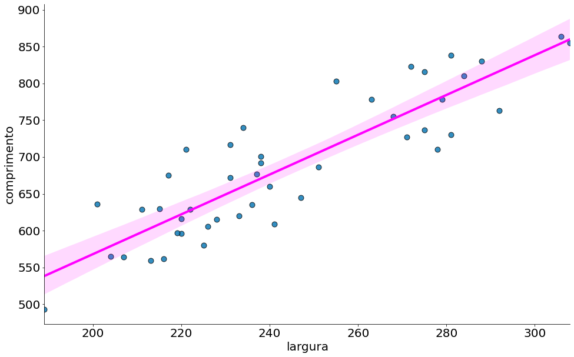
    


z-normalizando


```python
#In: 
df -= df.mean()
df /= df.std(ddof=1)
sns.regplot(x='largura', y='comprimento', data=df, n_boot=10000,
            line_kws={'color':'magenta', 'lw':4},
            scatter_kws={'edgecolor':'k', 's':80, 'alpha':0.8})
despine()
```


    
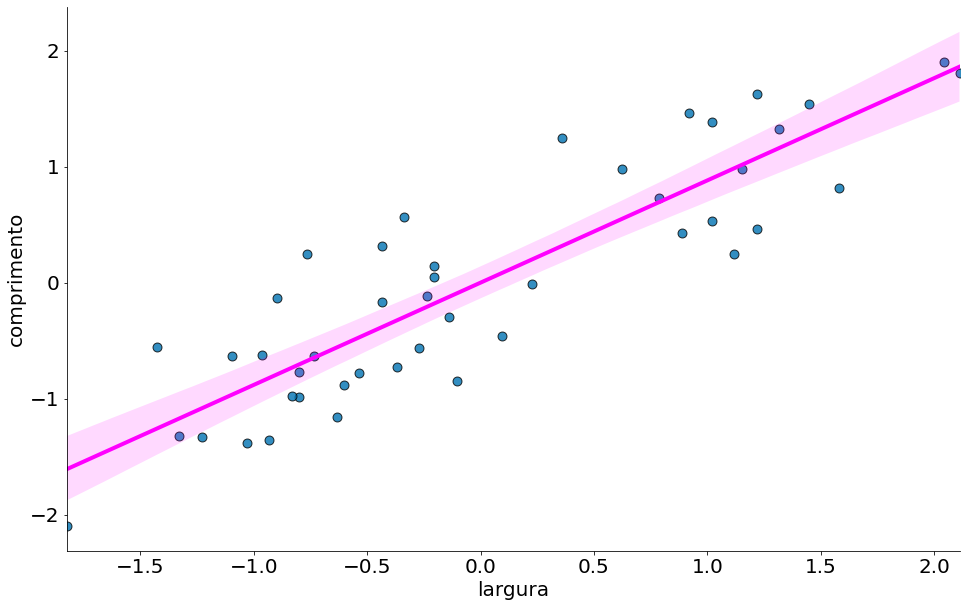
    


A regressão. Note o intercepto = 0.


```python
#In: 
y = df['comprimento']
x = df['largura']
ss.linregress(x, y)
```


    LinregressResult(slope=0.8814144365382701, intercept=5.560934949938166e-16, rvalue=0.8814144365382703, pvalue=1.3423645343535288e-15, stderr=0.07203174220550969)


Abaixo temos um plot com a soma dos erros ao quadrado que é utilizado para chegar na reta. Lembre-se das aulas anteriores. Chegamos no resultado acima usando cálculo, isto é, setamos as derivadas para zero. Uma outra abordagem para minimizar o erro é escolher um ponto de partida aleatório. Deste, calculamos o gradiente (derivadas). Depois, damos um pequeno passo na oposta do gradiente.

Inicialmente, observe como o erro é para um ponto. Lembrando que estamos trabalhando com uma função de erros quadrado. Diferente das aulas anteriores, ao invés de somar a mesma vamos tirar a média. Como o número de pontos, $n$, é uma constante, não afeta nossos algoritmos. Ao setar a derivada para zero o n some. De qualquer forma, pode ajudar os nossos algoritmos (evitar overflow).

$L(\beta) = n^{-1} \sum_i (y_i - \beta x_i)^2$


```python
#In: 
betas = np.linspace(0.1, 16, 100)
errs = np.zeros_like(betas)
for j in range(len(betas)):
    err = ((y[0] - betas[j] * x[0]) ** 2).mean()
    errs[j] = err
plt.plot(betas, errs, label='L(beta)')
plt.xlabel(r'$\beta$')
plt.title(r'Erro para um ponto: x = {:.2f}, y = {:.2f}'.format(x[2], y[2]))
plt.ylabel(r'$(y_i - \beta x_i)^2$')
plt.grid()
despine()
```


    
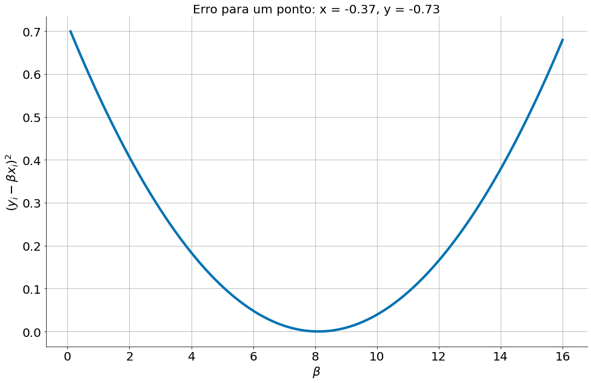
    


A soma de duas funções convexas é convexa. Então, a soma do erro quadrado nos pontos tamém é convexa. (prova nos slides)


```python
#In: 
betas = np.linspace(0.1, 1.7, 100)
errs = np.zeros_like(betas)
grads = np.zeros_like(betas)
for j in range(len(betas)):
    err = ((y - betas[j] * x) ** 2).mean()
    grads[j] = (-2 * (y - betas[j] * x) * x).mean()
    errs[j] = err
plt.plot(betas, errs, label='L(beta)')
#plt.plot(betas, grads, label='L\'(beta)')
plt.xlabel(r'$\beta$')
plt.title(r'Erro na soma para todos os pontos')
plt.ylabel(r'$\sum_i(y_i - \beta x_i)^2$')
plt.legend()
plt.grid()
despine()
```


    
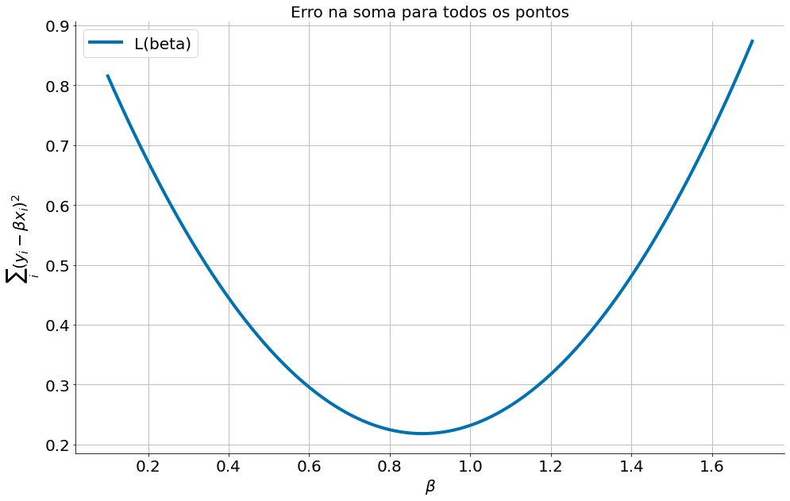
    


Observe que essa função possui um ponto de mínimo nas quando $\beta \approx 0.9$.  Observe que o gradiente, ou a derivada, é negativa quando estamos do lado esquero do mínimo. É positiva do lado direto e zero no valor ótimo. Então, a partir de um local inicial o sinal da derivada, na verdade o oposto do sinal como estamos minimizando, indica a direção que devemos ir.


```python
#In: 
plt.plot(betas, errs, label='L(beta)')
plt.plot(betas, grads, label='L\'(beta)')
plt.xlabel(r'$\beta$')
plt.title(r'Erro na soma para todos os pontos')
plt.ylabel(r'$\sum_i(y_i - \beta x_i)^2$')
plt.legend()
plt.grid()
despine()
```


    
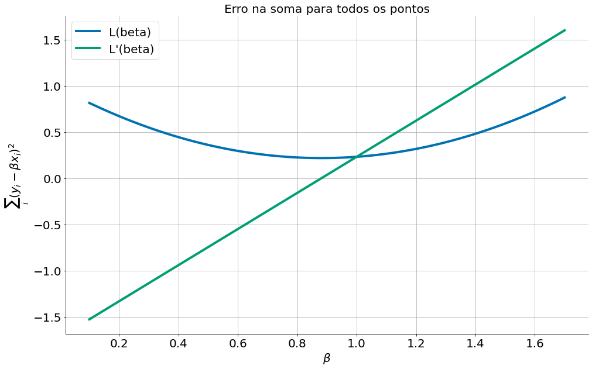
    


Caso você tenha problemas com derivadas, use o módulo sympy. Abaixo temos a derivadas para um ponto apenas.


```python
#In: 
import sympy as sy

x_i , y_i, beta = sy.symbols('x_i y_i beta')
fun = (y_i - beta * x_i)**2
sy.diff(fun, beta)
```


$\displaystyle - 2 x_{i} \left(- \beta x_{i} + y_{i}\right)$


## Gradiente Descendente

Com o conhecimento acima temos a base do Gradiente Descendente. Iniciando de um local qualquer, $\beta=2$. Vamos:

1. Computar a derivada $\frac{dL(\beta)}{d\beta}$
1. Setar $\beta = \beta - \lambda \frac{dL(\beta)}{d\beta}$
1. Repetir

O valor de $\lambda$ define nossa taxa de aprendizado. 


```python
#In: 
def ssq_znormed(x, y, beta):
    return ((y - beta * x) ** 2).mean()
```


```python
#In: 
def grad_znormed(x, y, beta):
    return (-2 * x * (y - beta * x)).mean()
```


```python
#In: 
beta = 2
beta_passo = [beta]
erros = []
for _ in range(500):
    err_sq = ssq_znormed(x, y, beta)
    grad = grad_znormed(x, y, beta)
    beta = beta - 0.01 * grad
    beta_passo.append(beta)
    erros.append(err_sq)
plt.plot(beta_passo)
plt.xlabel('Passo')
plt.ylabel('Valor de Beta')
despine()
```


    
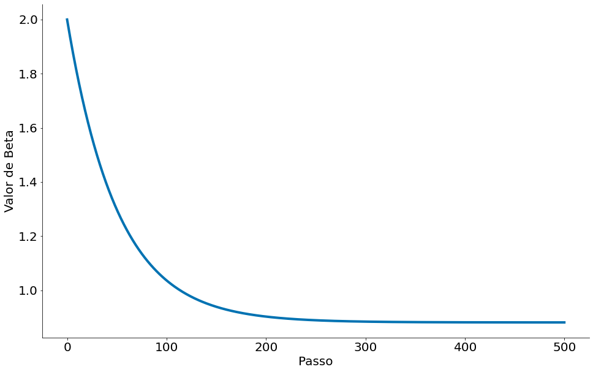
    


Observe os erros


```python
#In: 
plt.plot(erros)
plt.xlabel('Passo')
plt.ylabel('Erro Sq')
despine()
```


    
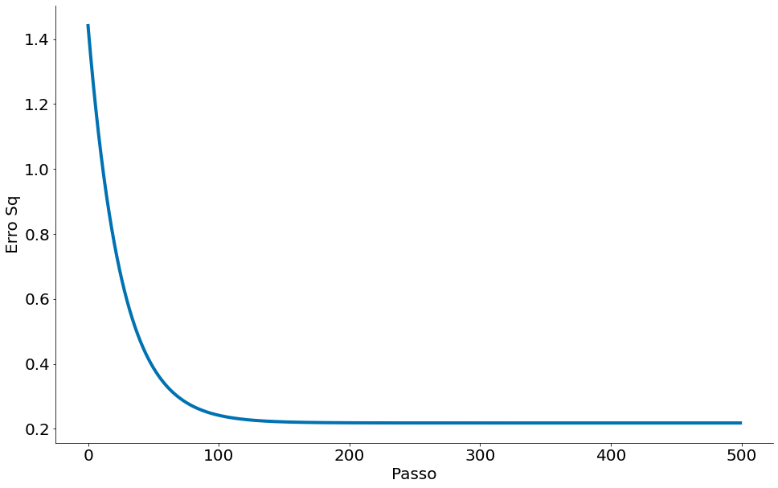
    


## Gradiente Descendente Estocástico

Muitas vezes usaremos o gradiente descendente para escolher os parâmetros de um modelo de maneira a minimizar alguma noção de erro. Usando a abordagem em lote anterior, cada etapa do método exige que façamos uma previsão e calculemos o gradiente para todo o conjunto de dados, o que faz com que cada etapa demore muito.

Geralmente, essas funções de erro são *aditivas*, o que significa que o erro preditivo em todo o conjunto de dados é simplesmente a soma dos erros preditivos para cada ponto de dados.

Quando este é o caso, podemos, em vez disso, aplicar uma técnica chamada gradiente descendente estocástico (ou *stochastic gradient descent*), que calcula o gradiente (e dá um passo) para apenas um ponto por vez. Ele passa sobre os dados repetidamente até atingir um ponto de parada.

Durante cada ciclo, queremos iterar nossos dados em uma ordem aleatória:


```python
#In: 
beta = 2
beta_passo = [beta]
erros = []
for _ in range(1000):
    i = np.random.randint(0, len(x))
    x_i, y_i = x[i], y[i]
    err_sq = ssq_znormed(x, y, beta) # esta linha ainda precisa ser em todos os pontos
    grad = grad_znormed(x_i, y_i, beta)
    beta = beta - 0.01 * grad
    beta_passo.append(beta)
    erros.append(err_sq)
plt.plot(beta_passo)
plt.xlabel('Passo')
plt.ylabel('Valor de Beta')
despine()
```


    
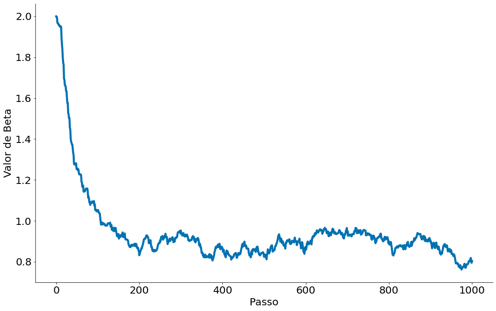
    


```python
#In: 
plt.plot(erros)
plt.xlabel('Passo')
plt.ylabel('Erro Sq')
despine()
```


    
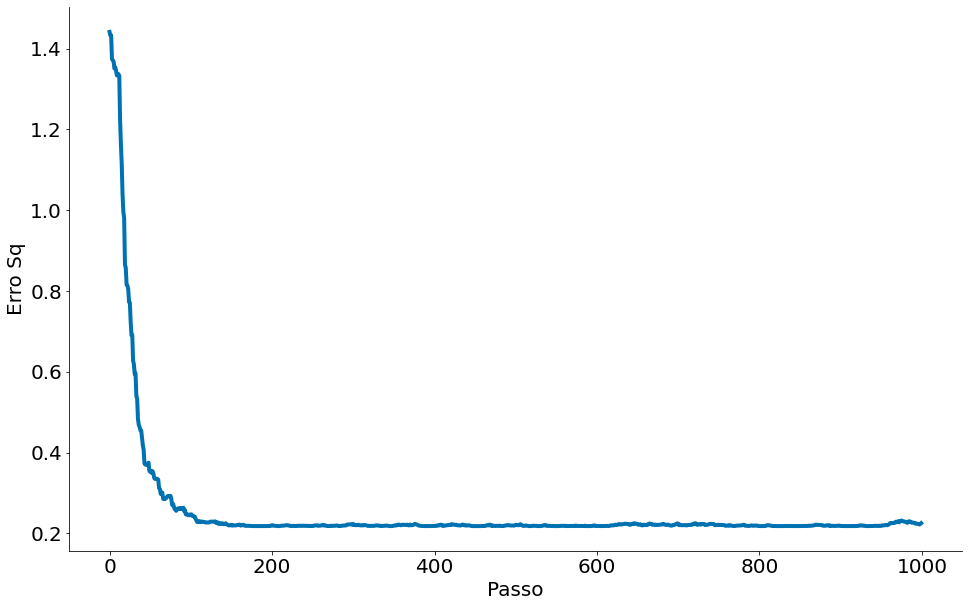
    


## Escolhendo o tamanho certo do passo

Embora o raciocínio para se mover na direção oposta ao gradiente seja claro, até que ponto mover-se não é. De fato, escolher o tamanho certo do passo que devemos nos mover é mais uma arte do que uma ciência. Opções populares incluem:

* Usar um tamanho de passo fixo;

* Diminuir gradualmente o tamanho do passo ao longo do tempo;

* Em cada etapa, escolha o tamanho do passo que minimiza o valor da função objetivo.

O último parece ótimo, mas é, na prática, um cálculo caro. Podemos aproximá-lo tentando uma variedade de tamanhos de passo e escolhendo aquele que resulta no menor valor da função objetivo:

## Caso Multivariado

Até agora estamos roubando um pouco ao normalizar os dados. Isto é, estamos forçando $\alpha=0$ na equação abaixo:

$$y_i = \beta x_i + \alpha$$

Vamos voltar para os dados originais. Note que o resultado da regressão é outro. Em particular, o intercepto é 22. Queremos estimar o mesmo também.


```python
#In: 
x = np.random.normal(size=1000)
y = 2 * x + np.random.normal(loc=3, size=1000)
ss.linregress(x, y)
```


    LinregressResult(slope=1.9870711866177047, intercept=3.045956609697555, rvalue=0.8872730877369849, pvalue=0.0, stderr=0.032698062940909774)


```python
#In: 
plt.scatter(x, y, alpha=0.8, s=80, edgecolors='k')
despine()
```


    
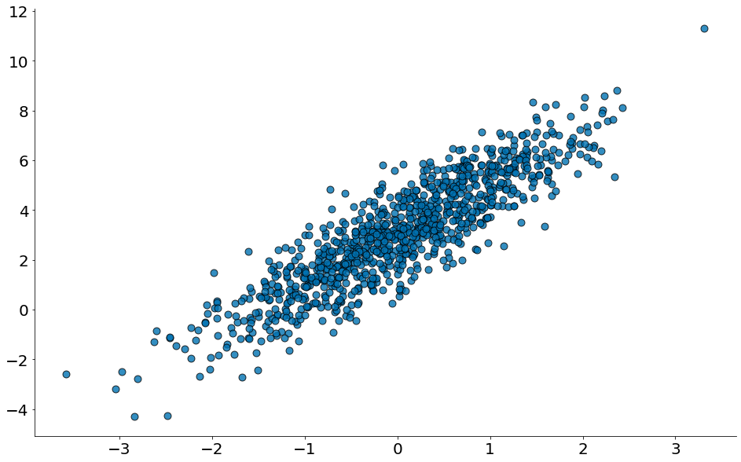
    


Abaixo tenho as derivadas:

$$\frac{dL}{d\alpha} = n^{-1}\sum_i 2 (-y_i + \beta x_i + \alpha)$$

$$\frac{d L}{d\beta} =n^{-1} \sum_i 2 (-y_i + \beta x_i + \alpha) x_i$$


```python
#In: 
def derivadas_regressao(parametros, x, y):
    alpha, beta = parametros
    da = (-2 * y) + (2 * beta * x) + (2 * alpha)
    db = (-2 * y * x) + (2 * beta * (x ** 2)) + (2 * alpha * x)
    return np.array([da.mean(), db.mean()])
```

Um gradient descent simples. O mesmo vai parar de executar quando os parâmetros convergem. Aqui temos uma função mais organizada. A mesma recebe uma outra função de derivada.


```python
#In: 
def gd(parametros, d_fun, x, y, lambda_=0.01):
    parametros = parametros.copy()
    for i in range(1000):
        grad = d_fun(parametros, x, y)
        parametros_novos = parametros - lambda_ * grad
        if np.abs(parametros - parametros_novos).mean() <= 0.00001:
            break
        parametros = parametros_novos
        print('Iter {}; alpha, beta = '.format(i), parametros)
    return parametros
```

Resposta!


```python
#In: 
parametros_iniciais = np.array([1, 1])
gd(parametros_iniciais, derivadas_regressao, x, y)
```

    Iter 0; alpha, beta =  [1.04138194 1.02020639]
    Iter 1; alpha, beta =  [1.08192677 1.03999936]
    Iter 2; alpha, beta =  [1.12165142 1.05938738]
    Iter 3; alpha, beta =  [1.16057248 1.07837872]
    Iter 4; alpha, beta =  [1.19870622 1.0969815 ]
    Iter 5; alpha, beta =  [1.23606856 1.11520366]
    Iter 6; alpha, beta =  [1.27267512 1.13305298]
    Iter 7; alpha, beta =  [1.30854117 1.15053709]
    Iter 8; alpha, beta =  [1.3436817  1.16766346]
    Iter 9; alpha, beta =  [1.3781114 1.1844394]
    Iter 10; alpha, beta =  [1.41184463 1.20087209]
    Iter 11; alpha, beta =  [1.44489549 1.21696853]
    Iter 12; alpha, beta =  [1.47727779 1.2327356 ]
    Iter 13; alpha, beta =  [1.50900505 1.24818005]
    Iter 14; alpha, beta =  [1.54009053 1.26330847]
    Iter 15; alpha, beta =  [1.5705472  1.27812732]
    Iter 16; alpha, beta =  [1.60038779 1.29264293]
    Iter 17; alpha, beta =  [1.62962476 1.30686151]
    Iter 18; alpha, beta =  [1.65827033 1.32078913]
    Iter 19; alpha, beta =  [1.68633645 1.33443175]
    Iter 20; alpha, beta =  [1.71383486 1.34779518]
    Iter 21; alpha, beta =  [1.74077703 1.36088514]
    Iter 22; alpha, beta =  [1.76717422 1.37370723]
    Iter 23; alpha, beta =  [1.79303746 1.38626692]
    Iter 24; alpha, beta =  [1.81837754 1.39856958]
    Iter 25; alpha, beta =  [1.84320505 1.41062047]
    Iter 26; alpha, beta =  [1.86753036 1.42242473]
    Iter 27; alpha, beta =  [1.89136363 1.43398741]
    Iter 28; alpha, beta =  [1.91471481 1.44531346]
    Iter 29; alpha, beta =  [1.93759366 1.45640771]
    Iter 30; alpha, beta =  [1.96000973 1.4672749 ]
    Iter 31; alpha, beta =  [1.98197239 1.47791968]
    Iter 32; alpha, beta =  [2.0034908 1.4883466]
    Iter 33; alpha, beta =  [2.02457395 1.49856011]
    Iter 34; alpha, beta =  [2.04523065 1.50856458]
    Iter 35; alpha, beta =  [2.06546953 1.51836429]
    Iter 36; alpha, beta =  [2.08529903 1.52796342]
    Iter 37; alpha, beta =  [2.10472744 1.53736608]
    Iter 38; alpha, beta =  [2.12376288 1.54657628]
    Iter 39; alpha, beta =  [2.14241329 1.55559797]
    Iter 40; alpha, beta =  [2.16068646 1.564435  ]
    Iter 41; alpha, beta =  [2.17859002 1.57309114]
    Iter 42; alpha, beta =  [2.19613146 1.5815701 ]
    Iter 43; alpha, beta =  [2.21331809 1.58987551]
    Iter 44; alpha, beta =  [2.23015709 1.59801091]
    Iter 45; alpha, beta =  [2.2466555  1.60597978]
    Iter 46; alpha, beta =  [2.2628202  1.61378552]
    Iter 47; alpha, beta =  [2.27865795 1.62143148]
    Iter 48; alpha, beta =  [2.29417536 1.62892093]
    Iter 49; alpha, beta =  [2.30937891 1.63625706]
    Iter 50; alpha, beta =  [2.32427495 1.64344301]
    Iter 51; alpha, beta =  [2.3388697  1.65048186]
    Iter 52; alpha, beta =  [2.35316926 1.65737662]
    Iter 53; alpha, beta =  [2.36717959 1.66413023]
    Iter 54; alpha, beta =  [2.38090655 1.67074558]
    Iter 55; alpha, beta =  [2.39435586 1.6772255 ]
    Iter 56; alpha, beta =  [2.40753316 1.68357275]
    Iter 57; alpha, beta =  [2.42044393 1.68979007]
    Iter 58; alpha, beta =  [2.43309356 1.6958801 ]
    Iter 59; alpha, beta =  [2.44548736 1.70184544]
    Iter 60; alpha, beta =  [2.45763047 1.70768866]
    Iter 61; alpha, beta =  [2.46952799 1.71341225]
    Iter 62; alpha, beta =  [2.48118487 1.71901865]
    Iter 63; alpha, beta =  [2.49260599 1.72451026]
    Iter 64; alpha, beta =  [2.50379611 1.72988944]
    Iter 65; alpha, beta =  [2.5147599  1.73515848]
    Iter 66; alpha, beta =  [2.52550195 1.74031964]
    Iter 67; alpha, beta =  [2.53602674 1.74537512]
    Iter 68; alpha, beta =  [2.54633866 1.75032709]
    Iter 69; alpha, beta =  [2.55644202 1.75517767]
    Iter 70; alpha, beta =  [2.56634104 1.75992893]
    Iter 71; alpha, beta =  [2.57603985 1.7645829 ]
    Iter 72; alpha, beta =  [2.58554251 1.76914157]
    Iter 73; alpha, beta =  [2.59485297 1.7736069 ]
    Iter 74; alpha, beta =  [2.60397513 1.77798079]
    Iter 75; alpha, beta =  [2.61291279 1.78226512]
    Iter 76; alpha, beta =  [2.6216697  1.78646171]
    Iter 77; alpha, beta =  [2.63024949 1.79057237]
    Iter 78; alpha, beta =  [2.63865577 1.79459886]
    Iter 79; alpha, beta =  [2.64689203 1.79854288]
    Iter 80; alpha, beta =  [2.65496172 1.80240615]
    Iter 81; alpha, beta =  [2.6628682  1.80619029]
    Iter 82; alpha, beta =  [2.67061478 1.80989694]
    Iter 83; alpha, beta =  [2.67820468 1.81352769]
    Iter 84; alpha, beta =  [2.68564109 1.81708407]
    Iter 85; alpha, beta =  [2.6929271  1.82056763]
    Iter 86; alpha, beta =  [2.70006576 1.82397984]
    Iter 87; alpha, beta =  [2.70706005 1.82732217]
    Iter 88; alpha, beta =  [2.71391288 1.83059605]
    Iter 89; alpha, beta =  [2.72062712 1.83380287]
    Iter 90; alpha, beta =  [2.72720557 1.83694402]
    Iter 91; alpha, beta =  [2.73365098 1.84002083]
    Iter 92; alpha, beta =  [2.73996604 1.84303463]
    Iter 93; alpha, beta =  [2.74615339 1.84598669]
    Iter 94; alpha, beta =  [2.7522156 1.8488783]
    Iter 95; alpha, beta =  [2.75815522 1.85171067]
    Iter 96; alpha, beta =  [2.76397471 1.85448504]
    Iter 97; alpha, beta =  [2.76967652 1.85720257]
    Iter 98; alpha, beta =  [2.77526301 1.85986445]
    Iter 99; alpha, beta =  [2.78073653 1.8624718 ]
    Iter 100; alpha, beta =  [2.78609935 1.86502574]
    Iter 101; alpha, beta =  [2.79135372 1.86752737]
    Iter 102; alpha, beta =  [2.79650182 1.86997775]
    Iter 103; alpha, beta =  [2.80154582 1.87237794]
    Iter 104; alpha, beta =  [2.80648781 1.87472897]
    Iter 105; alpha, beta =  [2.81132986 1.87703183]
    Iter 106; alpha, beta =  [2.81607399 1.87928752]
    Iter 107; alpha, beta =  [2.82072218 1.881497  ]
    Iter 108; alpha, beta =  [2.82527637 1.88366122]
    Iter 109; alpha, beta =  [2.82973846 1.8857811 ]
    Iter 110; alpha, beta =  [2.83411032 1.88785755]
    Iter 111; alpha, beta =  [2.83839376 1.88989147]
    Iter 112; alpha, beta =  [2.84259058 1.89188372]
    Iter 113; alpha, beta =  [2.84670253 1.89383515]
    Iter 114; alpha, beta =  [2.85073133 1.8957466 ]
    Iter 115; alpha, beta =  [2.85467865 1.89761889]
    Iter 116; alpha, beta =  [2.85854615 1.89945282]
    Iter 117; alpha, beta =  [2.86233545 1.90124918]
    Iter 118; alpha, beta =  [2.86604811 1.90300874]
    Iter 119; alpha, beta =  [2.86968569 1.90473224]
    Iter 120; alpha, beta =  [2.87324972 1.90642043]
    Iter 121; alpha, beta =  [2.87674167 1.90807404]
    Iter 122; alpha, beta =  [2.88016301 1.90969376]
    Iter 123; alpha, beta =  [2.88351516 1.91128029]
    Iter 124; alpha, beta =  [2.88679952 1.91283432]
    Iter 125; alpha, beta =  [2.89001747 1.9143565 ]
    Iter 126; alpha, beta =  [2.89317035 1.91584749]
    Iter 127; alpha, beta =  [2.89625947 1.91730794]
    Iter 128; alpha, beta =  [2.89928612 1.91873845]
    Iter 129; alpha, beta =  [2.90225157 1.92013966]
    Iter 130; alpha, beta =  [2.90515705 1.92151215]
    Iter 131; alpha, beta =  [2.90800378 1.92285651]
    Iter 132; alpha, beta =  [2.91079295 1.92417333]
    Iter 133; alpha, beta =  [2.91352571 1.92546316]
    Iter 134; alpha, beta =  [2.91620322 1.92672656]
    Iter 135; alpha, beta =  [2.91882658 1.92796407]
    Iter 136; alpha, beta =  [2.92139689 1.92917622]
    Iter 137; alpha, beta =  [2.92391523 1.93036353]
    Iter 138; alpha, beta =  [2.92638265 1.9315265 ]
    Iter 139; alpha, beta =  [2.92880017 1.93266564]
    Iter 140; alpha, beta =  [2.93116881 1.93378144]
    Iter 141; alpha, beta =  [2.93348955 1.93487437]
    Iter 142; alpha, beta =  [2.93576336 1.9359449 ]
    Iter 143; alpha, beta =  [2.9379912  1.93699349]
    Iter 144; alpha, beta =  [2.94017399 1.93802058]
    Iter 145; alpha, beta =  [2.94231264 1.93902663]
    Iter 146; alpha, beta =  [2.94440805 1.94001205]
    Iter 147; alpha, beta =  [2.94646108 1.94097728]
    Iter 148; alpha, beta =  [2.9484726  1.94192273]
    Iter 149; alpha, beta =  [2.95044345 1.94284879]
    Iter 150; alpha, beta =  [2.95237445 1.94375588]
    Iter 151; alpha, beta =  [2.9542664  1.94464437]
    Iter 152; alpha, beta =  [2.9561201  1.94551465]
    Iter 153; alpha, beta =  [2.95793631 1.94636709]
    Iter 154; alpha, beta =  [2.95971581 1.94720206]
    Iter 155; alpha, beta =  [2.96145931 1.94801991]
    Iter 156; alpha, beta =  [2.96316757 1.948821  ]
    Iter 157; alpha, beta =  [2.96484129 1.94960566]
    Iter 158; alpha, beta =  [2.96648116 1.95037424]
    Iter 159; alpha, beta =  [2.96808787 1.95112707]
    Iter 160; alpha, beta =  [2.9696621  1.95186446]
    Iter 161; alpha, beta =  [2.9712045  1.95258673]
    Iter 162; alpha, beta =  [2.97271571 1.9532942 ]
    Iter 163; alpha, beta =  [2.97419636 1.95398717]
    Iter 164; alpha, beta =  [2.97564708 1.95466593]
    Iter 165; alpha, beta =  [2.97706847 1.95533077]
    Iter 166; alpha, beta =  [2.97846111 1.95598198]
    Iter 167; alpha, beta =  [2.9798256  1.95661984]
    Iter 168; alpha, beta =  [2.9811625  1.95724463]
    Iter 169; alpha, beta =  [2.98247236 1.9578566 ]
    Iter 170; alpha, beta =  [2.98375575 1.95845603]
    Iter 171; alpha, beta =  [2.98501318 1.95904316]
    Iter 172; alpha, beta =  [2.98624519 1.95961826]
    Iter 173; alpha, beta =  [2.98745229 1.96018157]
    Iter 174; alpha, beta =  [2.98863498 1.96073333]
    Iter 175; alpha, beta =  [2.98979377 1.96127377]
    Iter 176; alpha, beta =  [2.99092912 1.96180313]
    Iter 177; alpha, beta =  [2.99204152 1.96232164]
    Iter 178; alpha, beta =  [2.99313142 1.96282952]
    Iter 179; alpha, beta =  [2.99419929 1.96332698]
    Iter 180; alpha, beta =  [2.99524557 1.96381424]
    Iter 181; alpha, beta =  [2.9962707  1.96429151]
    Iter 182; alpha, beta =  [2.99727509 1.96475899]
    Iter 183; alpha, beta =  [2.99825919 1.96521688]
    Iter 184; alpha, beta =  [2.99922338 1.96566539]
    Iter 185; alpha, beta =  [3.00016808 1.9661047 ]
    Iter 186; alpha, beta =  [3.00109368 1.966535  ]
    Iter 187; alpha, beta =  [3.00200057 1.96695647]
    Iter 188; alpha, beta =  [3.00288912 1.9673693 ]
    Iter 189; alpha, beta =  [3.00375971 1.96777366]
    Iter 190; alpha, beta =  [3.0046127  1.96816974]
    Iter 191; alpha, beta =  [3.00544844 1.96855768]
    Iter 192; alpha, beta =  [3.00626728 1.96893767]
    Iter 193; alpha, beta =  [3.00706957 1.96930987]
    Iter 194; alpha, beta =  [3.00785564 1.96967444]
    Iter 195; alpha, beta =  [3.00862581 1.97003152]
    Iter 196; alpha, beta =  [3.00938042 1.97038129]
    Iter 197; alpha, beta =  [3.01011977 1.97072388]
    Iter 198; alpha, beta =  [3.01084417 1.97105944]
    Iter 199; alpha, beta =  [3.01155393 1.97138812]
    Iter 200; alpha, beta =  [3.01224933 1.97171006]
    Iter 201; alpha, beta =  [3.01293068 1.97202539]
    Iter 202; alpha, beta =  [3.01359825 1.97233426]
    Iter 203; alpha, beta =  [3.01425233 1.97263679]
    Iter 204; alpha, beta =  [3.01489318 1.97293311]
    Iter 205; alpha, beta =  [3.01552108 1.97322336]
    Iter 206; alpha, beta =  [3.01613629 1.97350765]
    Iter 207; alpha, beta =  [3.01673905 1.97378611]
    Iter 208; alpha, beta =  [3.01732963 1.97405886]
    Iter 209; alpha, beta =  [3.01790827 1.97432601]
    Iter 210; alpha, beta =  [3.01847522 1.97458768]
    Iter 211; alpha, beta =  [3.0190307  1.97484398]
    Iter 212; alpha, beta =  [3.01957495 1.97509503]
    Iter 213; alpha, beta =  [3.0201082  1.97534092]
    Iter 214; alpha, beta =  [3.02063066 1.97558177]
    Iter 215; alpha, beta =  [3.02114257 1.97581768]
    Iter 216; alpha, beta =  [3.02164413 1.97604875]
    Iter 217; alpha, beta =  [3.02213554 1.97627508]
    Iter 218; alpha, beta =  [3.02261703 1.97649677]
    Iter 219; alpha, beta =  [3.02308878 1.9767139 ]
    Iter 220; alpha, beta =  [3.02355099 1.97692658]
    Iter 221; alpha, beta =  [3.02400386 1.9771349 ]
    Iter 222; alpha, beta =  [3.02444757 1.97733894]
    Iter 223; alpha, beta =  [3.02488232 1.9775388 ]
    Iter 224; alpha, beta =  [3.02530827 1.97773455]
    Iter 225; alpha, beta =  [3.02572562 1.97792629]
    Iter 226; alpha, beta =  [3.02613452 1.97811409]
    Iter 227; alpha, beta =  [3.02653517 1.97829805]
    Iter 228; alpha, beta =  [3.02692771 1.97847822]
    Iter 229; alpha, beta =  [3.02731232 1.9786547 ]
    Iter 230; alpha, beta =  [3.02768915 1.97882756]
    Iter 231; alpha, beta =  [3.02805836 1.97899686]
    Iter 232; alpha, beta =  [3.02842011 1.9791627 ]
    Iter 233; alpha, beta =  [3.02877455 1.97932513]
    Iter 234; alpha, beta =  [3.02912182 1.97948423]
    Iter 235; alpha, beta =  [3.02946208 1.97964006]
    Iter 236; alpha, beta =  [3.02979545 1.9797927 ]
    Iter 237; alpha, beta =  [3.03012209 1.9799422 ]
    Iter 238; alpha, beta =  [3.03044212 1.98008863]
    Iter 239; alpha, beta =  [3.03075568 1.98023206]
    Iter 240; alpha, beta =  [3.03106291 1.98037255]
    Iter 241; alpha, beta =  [3.03136392 1.98051015]
    Iter 242; alpha, beta =  [3.03165885 1.98064492]
    Iter 243; alpha, beta =  [3.03194782 1.98077694]
    Iter 244; alpha, beta =  [3.03223095 1.98090624]
    Iter 245; alpha, beta =  [3.03250835 1.98103288]
    Iter 246; alpha, beta =  [3.03278015 1.98115693]
    Iter 247; alpha, beta =  [3.03304645 1.98127843]
    Iter 248; alpha, beta =  [3.03330737 1.98139744]
    Iter 249; alpha, beta =  [3.03356302 1.981514  ]
    Iter 250; alpha, beta =  [3.03381349 1.98162818]
    Iter 251; alpha, beta =  [3.03405891 1.98174   ]
    Iter 252; alpha, beta =  [3.03429936 1.98184954]
    Iter 253; alpha, beta =  [3.03453495 1.98195682]
    Iter 254; alpha, beta =  [3.03476579 1.9820619 ]
    Iter 255; alpha, beta =  [3.03499195 1.98216482]
    Iter 256; alpha, beta =  [3.03521354 1.98226564]
    Iter 257; alpha, beta =  [3.03543066 1.98236438]
    Iter 258; alpha, beta =  [3.03564338 1.98246109]
    Iter 259; alpha, beta =  [3.03585181 1.98255582]
    Iter 260; alpha, beta =  [3.03605602 1.9826486 ]
    Iter 261; alpha, beta =  [3.03625611 1.98273948]
    Iter 262; alpha, beta =  [3.03645215 1.9828285 ]
    Iter 263; alpha, beta =  [3.03664423 1.98291568]
    Iter 264; alpha, beta =  [3.03683242 1.98300108]
    Iter 265; alpha, beta =  [3.03701682 1.98308472]
    Iter 266; alpha, beta =  [3.03719748 1.98316664]
    Iter 267; alpha, beta =  [3.03737449 1.98324689]
    Iter 268; alpha, beta =  [3.03754793 1.98332548]
    Iter 269; alpha, beta =  [3.03771786 1.98340246]
    Iter 270; alpha, beta =  [3.03788436 1.98347786]
    Iter 271; alpha, beta =  [3.03804749 1.98355171]
    Iter 272; alpha, beta =  [3.03820732 1.98362405]
    Iter 273; alpha, beta =  [3.03836392 1.9836949 ]
    Iter 274; alpha, beta =  [3.03851736 1.98376429]
    Iter 275; alpha, beta =  [3.03866769 1.98383226]
    Iter 276; alpha, beta =  [3.03881499 1.98389884]
    Iter 277; alpha, beta =  [3.03895931 1.98396404]
    Iter 278; alpha, beta =  [3.03910071 1.98402791]
    Iter 279; alpha, beta =  [3.03923926 1.98409047]
    Iter 280; alpha, beta =  [3.039375   1.98415174]
    Iter 281; alpha, beta =  [3.039508   1.98421175]
    Iter 282; alpha, beta =  [3.03963832 1.98427053]
    Iter 283; alpha, beta =  [3.03976599 1.9843281 ]
    Iter 284; alpha, beta =  [3.03989109 1.9843845 ]
    Iter 285; alpha, beta =  [3.04001366 1.98443973]
    Iter 286; alpha, beta =  [3.04013376 1.98449383]
    Iter 287; alpha, beta =  [3.04025142 1.98454681]
    Iter 288; alpha, beta =  [3.04036671 1.98459871]
    Iter 289; alpha, beta =  [3.04047967 1.98464954]
    Iter 290; alpha, beta =  [3.04059034 1.98469933]
    Iter 291; alpha, beta =  [3.04069878 1.9847481 ]
    Iter 292; alpha, beta =  [3.04080502 1.98479586]
    Iter 293; alpha, beta =  [3.04090912 1.98484264]
    Iter 294; alpha, beta =  [3.04101112 1.98488846]
    Iter 295; alpha, beta =  [3.04111105 1.98493334]
    Iter 296; alpha, beta =  [3.04120896 1.9849773 ]
    Iter 297; alpha, beta =  [3.0413049  1.98502036]
    Iter 298; alpha, beta =  [3.04139889 1.98506253]
    Iter 299; alpha, beta =  [3.04149099 1.98510383]
    Iter 300; alpha, beta =  [3.04158122 1.98514429]
    Iter 301; alpha, beta =  [3.04166964 1.98518391]
    Iter 302; alpha, beta =  [3.04175626 1.98522272]
    Iter 303; alpha, beta =  [3.04184113 1.98526074]
    Iter 304; alpha, beta =  [3.04192429 1.98529797]
    Iter 305; alpha, beta =  [3.04200577 1.98533443]
    Iter 306; alpha, beta =  [3.0420856  1.98537015]
    Iter 307; alpha, beta =  [3.04216382 1.98540514]
    Iter 308; alpha, beta =  [3.04224046 1.9854394 ]
    Iter 309; alpha, beta =  [3.04231554 1.98547296]
    Iter 310; alpha, beta =  [3.04238911 1.98550583]
    Iter 311; alpha, beta =  [3.0424612  1.98553803]
    Iter 312; alpha, beta =  [3.04253183 1.98556956]
    Iter 313; alpha, beta =  [3.04260103 1.98560045]
    Iter 314; alpha, beta =  [3.04266883 1.9856307 ]
    Iter 315; alpha, beta =  [3.04273526 1.98566033]
    Iter 316; alpha, beta =  [3.04280035 1.98568935]
    Iter 317; alpha, beta =  [3.04286412 1.98571778]
    Iter 318; alpha, beta =  [3.0429266  1.98574562]
    Iter 319; alpha, beta =  [3.04298783 1.98577288]
    Iter 320; alpha, beta =  [3.04304781 1.98579959]
    Iter 321; alpha, beta =  [3.04310658 1.98582575]
    Iter 322; alpha, beta =  [3.04316417 1.98585137]
    Iter 323; alpha, beta =  [3.04322059 1.98587647]
    Iter 324; alpha, beta =  [3.04327587 1.98590105]
    Iter 325; alpha, beta =  [3.04333003 1.98592512]
    Iter 326; alpha, beta =  [3.0433831 1.9859487]
    Iter 327; alpha, beta =  [3.0434351  1.98597179]
    Iter 328; alpha, beta =  [3.04348604 1.98599441]
    Iter 329; alpha, beta =  [3.04353596 1.98601657]
    Iter 330; alpha, beta =  [3.04358487 1.98603827]
    Iter 331; alpha, beta =  [3.04363279 1.98605952]
    Iter 332; alpha, beta =  [3.04367974 1.98608034]
    Iter 333; alpha, beta =  [3.04372574 1.98610072]
    Iter 334; alpha, beta =  [3.04377081 1.98612069]
    Iter 335; alpha, beta =  [3.04381497 1.98614025]
    Iter 336; alpha, beta =  [3.04385824 1.98615941]
    Iter 337; alpha, beta =  [3.04390064 1.98617817]
    Iter 338; alpha, beta =  [3.04394217 1.98619655]
    Iter 339; alpha, beta =  [3.04398287 1.98621455]
    Iter 340; alpha, beta =  [3.04402275 1.98623218]
    Iter 341; alpha, beta =  [3.04406182 1.98624944]
    Iter 342; alpha, beta =  [3.0441001  1.98626636]
    Iter 343; alpha, beta =  [3.04413761 1.98628292]
    Iter 344; alpha, beta =  [3.04417436 1.98629914]
    Iter 345; alpha, beta =  [3.04421037 1.98631503]
    Iter 346; alpha, beta =  [3.04424565 1.9863306 ]
    Iter 347; alpha, beta =  [3.04428021 1.98634584]
    Iter 348; alpha, beta =  [3.04431408 1.98636077]
    Iter 349; alpha, beta =  [3.04434726 1.98637539]
    Iter 350; alpha, beta =  [3.04437978 1.98638971]
    Iter 351; alpha, beta =  [3.04441163 1.98640374]
    Iter 352; alpha, beta =  [3.04444285 1.98641748]
    Iter 353; alpha, beta =  [3.04447343 1.98643094]
    Iter 354; alpha, beta =  [3.04450339 1.98644412]
    Iter 355; alpha, beta =  [3.04453275 1.98645703]
    Iter 356; alpha, beta =  [3.04456151 1.98646967]
    Iter 357; alpha, beta =  [3.0445897  1.98648205]
    Iter 358; alpha, beta =  [3.04461731 1.98649418]
    Iter 359; alpha, beta =  [3.04464437 1.98650606]
    Iter 360; alpha, beta =  [3.04467088 1.98651769]
    Iter 361; alpha, beta =  [3.04469685 1.98652909]
    Iter 362; alpha, beta =  [3.0447223  1.98654025]
    Iter 363; alpha, beta =  [3.04474724 1.98655118]
    Iter 364; alpha, beta =  [3.04477167 1.98656189]
    Iter 365; alpha, beta =  [3.04479561 1.98657238]
    Iter 366; alpha, beta =  [3.04481906 1.98658265]
    Iter 367; alpha, beta =  [3.04484204 1.98659271]
    Iter 368; alpha, beta =  [3.04486456 1.98660256]
    Iter 369; alpha, beta =  [3.04488662 1.98661221]
    Iter 370; alpha, beta =  [3.04490823 1.98662166]
    Iter 371; alpha, beta =  [3.04492941 1.98663092]
    Iter 372; alpha, beta =  [3.04495016 1.98663998]
    Iter 373; alpha, beta =  [3.04497049 1.98664886]
    Iter 374; alpha, beta =  [3.04499041 1.98665756]
    Iter 375; alpha, beta =  [3.04500993 1.98666608]
    Iter 376; alpha, beta =  [3.04502905 1.98667442]
    Iter 377; alpha, beta =  [3.04504779 1.98668259]
    Iter 378; alpha, beta =  [3.04506615 1.9866906 ]
    Iter 379; alpha, beta =  [3.04508414 1.98669844]
    Iter 380; alpha, beta =  [3.04510176 1.98670611]
    Iter 381; alpha, beta =  [3.04511903 1.98671363]
    Iter 382; alpha, beta =  [3.04513595 1.986721  ]
    Iter 383; alpha, beta =  [3.04515253 1.98672821]
    Iter 384; alpha, beta =  [3.04516877 1.98673528]
    Iter 385; alpha, beta =  [3.04518468 1.98674219]
    Iter 386; alpha, beta =  [3.04520028 1.98674897]
    Iter 387; alpha, beta =  [3.04521555 1.98675561]
    Iter 388; alpha, beta =  [3.04523052 1.98676211]
    Iter 389; alpha, beta =  [3.04524519 1.98676848]
    Iter 390; alpha, beta =  [3.04525956 1.98677471]
    Iter 391; alpha, beta =  [3.04527364 1.98678082]


    array([3.04527364, 1.98678082])


Observe como alpha é o intercept e beta o slope da regressão com scipy


```python
#In: 
ss.linregress(x, y)
```


    LinregressResult(slope=1.9870711866177047, intercept=3.045956609697555, rvalue=0.8872730877369849, pvalue=0.0, stderr=0.032698062940909774)


## Gradiente Ascendente

Vamos agora chegar no mesmo resultado usando Gradiente Ascendente. Em particular, ainda vamos nos manter em uma regressão linear. Porém, queremos maximizar a log-verossimilhança. Da aula anterior, nosso modelo é:

$$y_i = \beta x_i + \alpha + \epsilon_i $$
$$\epsilon_i = y_i - \beta x_i - \alpha $$
$$\epsilon_i \sim Normal(0, \sigma) $$

Partindo do mesmo chegamos em:

$$p(\epsilon_i\mid \sigma^2, \alpha, \beta) = \frac{1}{\sqrt {\sigma ^22\pi } }
e^{- ({y_i - \beta x_i - \alpha })^2 / 2\sigma^2} $$


Assumindo que cada erro é independente, a verossimilhança de todos os erros é:

$$p_{\Theta}(E) = \prod_{i} p_{\Theta}(\epsilon_i) \\
\log(p_{\Theta}(E)) = \mathcal{l}_{\Theta}(E) =  \sum_{i} \log(p_{\Theta}(\epsilon_i))$$

O log da mesma é:

$$\mathcal{l}_{\Theta}(E) =  -n \log(\sqrt{2\pi}) - n{\log(\sigma) } - { \sum^n_{i=1} ({y_i - \beta x_i - \alpha })^2 \over 2\sigma^2} $$

A derivada em $\sigma$ é:

$${d \mathcal{l}_{\Theta} \over d\sigma} =  -{n\over \sigma} + { 2 \sum^n_{i=1} ({y_i - \beta x_i - \alpha })^2 \over 2\sigma^3}$$

A derivada em $\alpha$ e $\beta$ é a mesma de antes, apenas invertemos o sinal:

$$\frac{d\mathcal{l}_{\Theta}}{d\alpha} = -n^{-1} \sum_i 2 (-y_i + \beta x_i + \alpha)$$

$$\frac{d\mathcal{l}_{\Theta}}{d\beta} = -n^{-1} \sum_i 2 (-y_i + \beta x_i + \alpha) x_i$$

Em outras palavras, vamos chegar no mesmo resultado.


```python
#In: 
def derivadas_vero(parametros, x, y):
    alpha, beta = parametros
    da = -1 * ((-2 * y) + (2 * beta * x) + (2 * alpha))
    db = -1 * ((-2 * y * x) + (2 * beta * (x ** 2)) + (2 * alpha * x))
    return np.array([da.mean(), db.mean()])
```


```python
#In: 
def ga(parametros, d_fun, x, y, lambda_=0.01):
    parametros = parametros.copy()
    print('Iter {}; alpha, beta = '.format(-1), parametros)
    for i in range(1000):
        grad = d_fun(parametros, x, y)
        parametros_novos = parametros + lambda_ * grad
        if np.abs(parametros - parametros_novos).mean() <= 0.00001:
            break
        parametros = parametros_novos
        print('Iter {}; alpha, beta = '.format(i), parametros)
    return parametros
```


```python
#In: 
parametros_iniciais = np.array([0.1, 0.1])
parametros = ga(parametros_iniciais, derivadas_vero, x, y)
```

    Iter -1; alpha, beta =  [0.1 0.1]
    Iter 0; alpha, beta =  [0.15980392 0.13817765]
    Iter 1; alpha, beta =  [0.21839386 0.17558283]
    Iter 2; alpha, beta =  [0.27579447 0.21223117]
    Iter 3; alpha, beta =  [0.33202988 0.24813798]
    Iter 4; alpha, beta =  [0.38712375 0.28331827]
    Iter 5; alpha, beta =  [0.44109924 0.31778673]
    Iter 6; alpha, beta =  [0.49397906 0.35155779]
    Iter 7; alpha, beta =  [0.54578546 0.38464554]
    Iter 8; alpha, beta =  [0.59654021 0.41706382]
    Iter 9; alpha, beta =  [0.64626466 0.44882617]
    Iter 10; alpha, beta =  [0.69497974 0.47994586]
    Iter 11; alpha, beta =  [0.74270592 0.5104359 ]
    Iter 12; alpha, beta =  [0.78946328 0.54030904]
    Iter 13; alpha, beta =  [0.83527149 0.56957775]
    Iter 14; alpha, beta =  [0.88014981 0.59825426]
    Iter 15; alpha, beta =  [0.92411712 0.62635056]
    Iter 16; alpha, beta =  [0.96719191 0.6538784 ]
    Iter 17; alpha, beta =  [1.0093923  0.68084926]
    Iter 18; alpha, beta =  [1.05073603 0.70727443]
    Iter 19; alpha, beta =  [1.0912405  0.73316495]
    Iter 20; alpha, beta =  [1.13092274 0.75853162]
    Iter 21; alpha, beta =  [1.16979944 0.78338507]
    Iter 22; alpha, beta =  [1.20788695 0.80773566]
    Iter 23; alpha, beta =  [1.2452013  0.83159358]
    Iter 24; alpha, beta =  [1.28175817 0.85496879]
    Iter 25; alpha, beta =  [1.31757295 0.87787106]
    Iter 26; alpha, beta =  [1.35266069 0.90030997]
    Iter 27; alpha, beta =  [1.38703616 0.92229488]
    Iter 28; alpha, beta =  [1.42071381 0.94383498]
    Iter 29; alpha, beta =  [1.45370781 0.96493928]
    Iter 30; alpha, beta =  [1.48603203 0.9856166 ]
    Iter 31; alpha, beta =  [1.51770007 1.00587557]
    Iter 32; alpha, beta =  [1.54872526 1.02572465]
    Iter 33; alpha, beta =  [1.57912063 1.04517215]
    Iter 34; alpha, beta =  [1.60889897 1.06422618]
    Iter 35; alpha, beta =  [1.63807282 1.08289472]
    Iter 36; alpha, beta =  [1.66665444 1.10118555]
    Iter 37; alpha, beta =  [1.69465584 1.11910633]
    Iter 38; alpha, beta =  [1.72208882 1.13666453]
    Iter 39; alpha, beta =  [1.74896491 1.15386751]
    Iter 40; alpha, beta =  [1.7752954  1.17072243]
    Iter 41; alpha, beta =  [1.80109139 1.18723636]
    Iter 42; alpha, beta =  [1.82636371 1.20341618]
    Iter 43; alpha, beta =  [1.851123   1.21926866]
    Iter 44; alpha, beta =  [1.87537967 1.23480041]
    Iter 45; alpha, beta =  [1.89914393 1.25001794]
    Iter 46; alpha, beta =  [1.92242576 1.2649276 ]
    Iter 47; alpha, beta =  [1.94523497 1.27953561]
    Iter 48; alpha, beta =  [1.96758114 1.29384809]
    Iter 49; alpha, beta =  [1.98947368 1.307871  ]
    Iter 50; alpha, beta =  [2.0109218  1.32161022]
    Iter 51; alpha, beta =  [2.03193451 1.33507147]
    Iter 52; alpha, beta =  [2.05252065 1.34826039]
    Iter 53; alpha, beta =  [2.07268889 1.36118248]
    Iter 54; alpha, beta =  [2.09244771 1.37384315]
    Iter 55; alpha, beta =  [2.11180541 1.38624768]
    Iter 56; alpha, beta =  [2.13077014 1.39840125]
    Iter 57; alpha, beta =  [2.14934988 1.41030895]
    Iter 58; alpha, beta =  [2.16755244 1.42197574]
    Iter 59; alpha, beta =  [2.18538548 1.43340651]
    Iter 60; alpha, beta =  [2.2028565  1.44460603]
    Iter 61; alpha, beta =  [2.21997284 1.45557897]
    Iter 62; alpha, beta =  [2.23674172 1.46632992]
    Iter 63; alpha, beta =  [2.25317018 1.47686338]
    Iter 64; alpha, beta =  [2.26926513 1.48718374]
    Iter 65; alpha, beta =  [2.28503334 1.49729531]
    Iter 66; alpha, beta =  [2.30048144 1.50720232]
    Iter 67; alpha, beta =  [2.31561594 1.51690891]
    Iter 68; alpha, beta =  [2.3304432  1.52641914]
    Iter 69; alpha, beta =  [2.34496945 1.53573697]
    Iter 70; alpha, beta =  [2.35920081 1.5448663 ]
    Iter 71; alpha, beta =  [2.37314326 1.55381094]
    Iter 72; alpha, beta =  [2.38680267 1.56257463]
    Iter 73; alpha, beta =  [2.40018479 1.57116103]
    Iter 74; alpha, beta =  [2.41329523 1.57957373]
    Iter 75; alpha, beta =  [2.42613952 1.58781624]
    Iter 76; alpha, beta =  [2.43872306 1.59589201]
    Iter 77; alpha, beta =  [2.45105114 1.6038044 ]
    Iter 78; alpha, beta =  [2.46312895 1.61155673]
    Iter 79; alpha, beta =  [2.47496157 1.61915223]
    Iter 80; alpha, beta =  [2.48655398 1.62659408]
    Iter 81; alpha, beta =  [2.49791105 1.63388539]
    Iter 82; alpha, beta =  [2.50903756 1.64102919]
    Iter 83; alpha, beta =  [2.51993819 1.64802848]
    Iter 84; alpha, beta =  [2.53061752 1.65488617]
    Iter 85; alpha, beta =  [2.54108006 1.66160514]
    Iter 86; alpha, beta =  [2.55133019 1.66818819]
    Iter 87; alpha, beta =  [2.56137223 1.67463807]
    Iter 88; alpha, beta =  [2.57121041 1.68095748]
    Iter 89; alpha, beta =  [2.58084886 1.68714904]
    Iter 90; alpha, beta =  [2.59029164 1.69321536]
    Iter 91; alpha, beta =  [2.59954272 1.69915896]
    Iter 92; alpha, beta =  [2.60860599 1.70498233]
    Iter 93; alpha, beta =  [2.61748527 1.7106879 ]
    Iter 94; alpha, beta =  [2.62618428 1.71627805]
    Iter 95; alpha, beta =  [2.63470669 1.72175512]
    Iter 96; alpha, beta =  [2.64305609 1.72712139]
    Iter 97; alpha, beta =  [2.65123598 1.73237911]
    Iter 98; alpha, beta =  [2.65924981 1.73753048]
    Iter 99; alpha, beta =  [2.66710095 1.74257764]
    Iter 100; alpha, beta =  [2.6747927 1.7475227]
    Iter 101; alpha, beta =  [2.68232829 1.75236773]
    Iter 102; alpha, beta =  [2.68971091 1.75711476]
    Iter 103; alpha, beta =  [2.69694364 1.76176576]
    Iter 104; alpha, beta =  [2.70402954 1.76632268]
    Iter 105; alpha, beta =  [2.71097158 1.77078742]
    Iter 106; alpha, beta =  [2.71777269 1.77516184]
    Iter 107; alpha, beta =  [2.72443573 1.77944778]
    Iter 108; alpha, beta =  [2.73096349 1.78364702]
    Iter 109; alpha, beta =  [2.73735873 1.78776132]
    Iter 110; alpha, beta =  [2.74362414 1.7917924 ]
    Iter 111; alpha, beta =  [2.74976235 1.79574193]
    Iter 112; alpha, beta =  [2.75577594 1.79961158]
    Iter 113; alpha, beta =  [2.76166745 1.80340295]
    Iter 114; alpha, beta =  [2.76743935 1.80711762]
    Iter 115; alpha, beta =  [2.77309407 1.81075716]
    Iter 116; alpha, beta =  [2.77863399 1.81432308]
    Iter 117; alpha, beta =  [2.78406144 1.81781687]
    Iter 118; alpha, beta =  [2.7893787  1.82123999]
    Iter 119; alpha, beta =  [2.79458801 1.82459387]
    Iter 120; alpha, beta =  [2.79969156 1.82787991]
    Iter 121; alpha, beta =  [2.8046915  1.83109948]
    Iter 122; alpha, beta =  [2.80958994 1.83425392]
    Iter 123; alpha, beta =  [2.81438892 1.83734456]
    Iter 124; alpha, beta =  [2.81909048 1.84037269]
    Iter 125; alpha, beta =  [2.82369658 1.84333956]
    Iter 126; alpha, beta =  [2.82820917 1.84624642]
    Iter 127; alpha, beta =  [2.83263015 1.84909449]
    Iter 128; alpha, beta =  [2.83696137 1.85188495]
    Iter 129; alpha, beta =  [2.84120466 1.85461896]
    Iter 130; alpha, beta =  [2.8453618  1.85729768]
    Iter 131; alpha, beta =  [2.84943455 1.85992221]
    Iter 132; alpha, beta =  [2.85342461 1.86249366]
    Iter 133; alpha, beta =  [2.85733366 1.86501309]
    Iter 134; alpha, beta =  [2.86116334 1.86748157]
    Iter 135; alpha, beta =  [2.86491528 1.86990011]
    Iter 136; alpha, beta =  [2.86859105 1.87226974]
    Iter 137; alpha, beta =  [2.87219218 1.87459144]
    Iter 138; alpha, beta =  [2.87572021 1.87686618]
    Iter 139; alpha, beta =  [2.87917661 1.87909491]
    Iter 140; alpha, beta =  [2.88256284 1.88127855]
    Iter 141; alpha, beta =  [2.88588032 1.88341804]
    Iter 142; alpha, beta =  [2.88913044 1.88551425]
    Iter 143; alpha, beta =  [2.89231458 1.88756806]
    Iter 144; alpha, beta =  [2.89543408 1.88958033]
    Iter 145; alpha, beta =  [2.89849024 1.8915519 ]
    Iter 146; alpha, beta =  [2.90148435 1.89348359]
    Iter 147; alpha, beta =  [2.90441768 1.89537621]
    Iter 148; alpha, beta =  [2.90729145 1.89723055]
    Iter 149; alpha, beta =  [2.91010687 1.89904739]
    Iter 150; alpha, beta =  [2.91286514 1.90082748]
    Iter 151; alpha, beta =  [2.91556741 1.90257156]
    Iter 152; alpha, beta =  [2.91821481 1.90428038]
    Iter 153; alpha, beta =  [2.92080846 1.90595462]
    Iter 154; alpha, beta =  [2.92334946 1.90759501]
    Iter 155; alpha, beta =  [2.92583887 1.90920222]
    Iter 156; alpha, beta =  [2.92827773 1.91077692]
    Iter 157; alpha, beta =  [2.93066708 1.91231978]
    Iter 158; alpha, beta =  [2.93300792 1.91383142]
    Iter 159; alpha, beta =  [2.93530123 1.9153125 ]
    Iter 160; alpha, beta =  [2.93754799 1.91676362]
    Iter 161; alpha, beta =  [2.93974913 1.91818539]
    Iter 162; alpha, beta =  [2.94190557 1.91957841]
    Iter 163; alpha, beta =  [2.94401824 1.92094325]
    Iter 164; alpha, beta =  [2.94608801 1.92228049]
    Iter 165; alpha, beta =  [2.94811576 1.92359068]
    Iter 166; alpha, beta =  [2.95010234 1.92487437]
    Iter 167; alpha, beta =  [2.95204859 1.9261321 ]
    Iter 168; alpha, beta =  [2.95395532 1.9273644 ]
    Iter 169; alpha, beta =  [2.95582334 1.92857177]
    Iter 170; alpha, beta =  [2.95765344 1.92975472]
    Iter 171; alpha, beta =  [2.95944638 1.93091375]
    Iter 172; alpha, beta =  [2.96120291 1.93204934]
    Iter 173; alpha, beta =  [2.96292378 1.93316196]
    Iter 174; alpha, beta =  [2.96460972 1.93425208]
    Iter 175; alpha, beta =  [2.96626142 1.93532015]
    Iter 176; alpha, beta =  [2.96787959 1.93636662]
    Iter 177; alpha, beta =  [2.9694649  1.93739192]
    Iter 178; alpha, beta =  [2.97101803 1.9383965 ]
    Iter 179; alpha, beta =  [2.97253962 1.93938075]
    Iter 180; alpha, beta =  [2.97403032 1.9403451 ]
    Iter 181; alpha, beta =  [2.97549076 1.94128994]
    Iter 182; alpha, beta =  [2.97692154 1.94221568]
    Iter 183; alpha, beta =  [2.97832327 1.9431227 ]
    Iter 184; alpha, beta =  [2.97969654 1.94401137]
    Iter 185; alpha, beta =  [2.98104194 1.94488207]
    Iter 186; alpha, beta =  [2.98236001 1.94573516]
    Iter 187; alpha, beta =  [2.98365132 1.946571  ]
    Iter 188; alpha, beta =  [2.98491642 1.94738993]
    Iter 189; alpha, beta =  [2.98615583 1.9481923 ]
    Iter 190; alpha, beta =  [2.98737007 1.94897845]
    Iter 191; alpha, beta =  [2.98855966 1.9497487 ]
    Iter 192; alpha, beta =  [2.9897251  1.95050337]
    Iter 193; alpha, beta =  [2.99086688 1.95124278]
    Iter 194; alpha, beta =  [2.99198547 1.95196723]
    Iter 195; alpha, beta =  [2.99308135 1.95267704]
    Iter 196; alpha, beta =  [2.99415498 1.95337249]
    Iter 197; alpha, beta =  [2.99520682 1.95405387]
    Iter 198; alpha, beta =  [2.99623729 1.95472148]
    Iter 199; alpha, beta =  [2.99724685 1.95537558]
    Iter 200; alpha, beta =  [2.9982359  1.95601646]
    Iter 201; alpha, beta =  [2.99920488 1.95664438]
    Iter 202; alpha, beta =  [3.00015418 1.9572596 ]
    Iter 203; alpha, beta =  [3.00108421 1.95786237]
    Iter 204; alpha, beta =  [3.00199535 1.95845296]
    Iter 205; alpha, beta =  [3.00288799 1.95903161]
    Iter 206; alpha, beta =  [3.00376251 1.95959855]
    Iter 207; alpha, beta =  [3.00461927 1.96015403]
    Iter 208; alpha, beta =  [3.00545864 1.96069827]
    Iter 209; alpha, beta =  [3.00628097 1.96123151]
    Iter 210; alpha, beta =  [3.0070866  1.96175397]
    Iter 211; alpha, beta =  [3.00787587 1.96226586]
    Iter 212; alpha, beta =  [3.00864911 1.9627674 ]
    Iter 213; alpha, beta =  [3.00940666 1.96325879]
    Iter 214; alpha, beta =  [3.01014882 1.96374025]
    Iter 215; alpha, beta =  [3.01087592 1.96421198]
    Iter 216; alpha, beta =  [3.01158825 1.96467416]
    Iter 217; alpha, beta =  [3.01228612 1.965127  ]
    Iter 218; alpha, beta =  [3.01296981 1.96557068]
    Iter 219; alpha, beta =  [3.01363963 1.96600539]
    Iter 220; alpha, beta =  [3.01429585 1.96643131]
    Iter 221; alpha, beta =  [3.01493874 1.96684862]
    Iter 222; alpha, beta =  [3.01556858 1.96725748]
    Iter 223; alpha, beta =  [3.01618563 1.96765808]
    Iter 224; alpha, beta =  [3.01679015 1.96805058]
    Iter 225; alpha, beta =  [3.0173824  1.96843514]
    Iter 226; alpha, beta =  [3.01796262 1.96881193]
    Iter 227; alpha, beta =  [3.01853106 1.9691811 ]
    Iter 228; alpha, beta =  [3.01908796 1.9695428 ]
    Iter 229; alpha, beta =  [3.01963355 1.96989718]
    Iter 230; alpha, beta =  [3.02016807 1.97024441]
    Iter 231; alpha, beta =  [3.02069173 1.97058461]
    Iter 232; alpha, beta =  [3.02120475 1.97091793]
    Iter 233; alpha, beta =  [3.02170737 1.97124451]
    Iter 234; alpha, beta =  [3.02219977 1.97156449]
    Iter 235; alpha, beta =  [3.02268218 1.97187799]
    Iter 236; alpha, beta =  [3.02315479 1.97218516]
    Iter 237; alpha, beta =  [3.02361781 1.97248612]
    Iter 238; alpha, beta =  [3.02407142 1.97278099]
    Iter 239; alpha, beta =  [3.02451583 1.9730699 ]
    Iter 240; alpha, beta =  [3.02495121 1.97335296]
    Iter 241; alpha, beta =  [3.02537775 1.97363031]
    Iter 242; alpha, beta =  [3.02579563 1.97390204]
    Iter 243; alpha, beta =  [3.02620502 1.97416828]
    Iter 244; alpha, beta =  [3.0266061  1.97442914]
    Iter 245; alpha, beta =  [3.02699904 1.97468472]
    Iter 246; alpha, beta =  [3.027384   1.97493514]
    Iter 247; alpha, beta =  [3.02776114 1.97518049]
    Iter 248; alpha, beta =  [3.02813062 1.97542088]
    Iter 249; alpha, beta =  [3.02849261 1.97565641]
    Iter 250; alpha, beta =  [3.02884724 1.97588718]
    Iter 251; alpha, beta =  [3.02919467 1.97611328]
    Iter 252; alpha, beta =  [3.02953505 1.97633481]
    Iter 253; alpha, beta =  [3.02986851 1.97655186]
    Iter 254; alpha, beta =  [3.03019521 1.97676452]
    Iter 255; alpha, beta =  [3.03051527 1.97697288]
    Iter 256; alpha, beta =  [3.03082883 1.97717703]
    Iter 257; alpha, beta =  [3.03113602 1.97737705]
    Iter 258; alpha, beta =  [3.03143698 1.97757303]
    Iter 259; alpha, beta =  [3.03173183 1.97776504]
    Iter 260; alpha, beta =  [3.03202069 1.97795317]
    Iter 261; alpha, beta =  [3.03230368 1.9781375 ]
    Iter 262; alpha, beta =  [3.03258093 1.9783181 ]
    Iter 263; alpha, beta =  [3.03285254 1.97849505]
    Iter 264; alpha, beta =  [3.03311865 1.97866843]
    Iter 265; alpha, beta =  [3.03337935 1.97883829]
    Iter 266; alpha, beta =  [3.03363475 1.97900472]
    Iter 267; alpha, beta =  [3.03388497 1.97916779]
    Iter 268; alpha, beta =  [3.03413011 1.97932756]
    Iter 269; alpha, beta =  [3.03437027 1.9794841 ]
    Iter 270; alpha, beta =  [3.03460555 1.97963748]
    Iter 271; alpha, beta =  [3.03483606 1.97978775]
    Iter 272; alpha, beta =  [3.03506189 1.97993498]
    Iter 273; alpha, beta =  [3.03528313 1.98007924]
    Iter 274; alpha, beta =  [3.03549987 1.98022058]
    Iter 275; alpha, beta =  [3.03571222 1.98035907]
    Iter 276; alpha, beta =  [3.03592026 1.98049475]
    Iter 277; alpha, beta =  [3.03612407 1.98062769]
    Iter 278; alpha, beta =  [3.03632374 1.98075795]
    Iter 279; alpha, beta =  [3.03651936 1.98088557]
    Iter 280; alpha, beta =  [3.036711   1.98101061]
    Iter 281; alpha, beta =  [3.03689876 1.98113312]
    Iter 282; alpha, beta =  [3.0370827  1.98125315]
    Iter 283; alpha, beta =  [3.0372629  1.98137076]
    Iter 284; alpha, beta =  [3.03743945 1.98148599]
    Iter 285; alpha, beta =  [3.03761241 1.98159889]
    Iter 286; alpha, beta =  [3.03778186 1.98170951]
    Iter 287; alpha, beta =  [3.03794787 1.98181789]
    Iter 288; alpha, beta =  [3.03811051 1.98192408]
    Iter 289; alpha, beta =  [3.03826984 1.98202812]
    Iter 290; alpha, beta =  [3.03842594 1.98213006]
    Iter 291; alpha, beta =  [3.03857887 1.98222994]
    Iter 292; alpha, beta =  [3.0387287 1.9823278]
    Iter 293; alpha, beta =  [3.03887548 1.98242368]
    Iter 294; alpha, beta =  [3.03901928 1.98251762]
    Iter 295; alpha, beta =  [3.03916016 1.98260967]
    Iter 296; alpha, beta =  [3.03929818 1.98269985]
    Iter 297; alpha, beta =  [3.0394334  1.98278821]
    Iter 298; alpha, beta =  [3.03956587 1.98287478]
    Iter 299; alpha, beta =  [3.03969566 1.98295961]
    Iter 300; alpha, beta =  [3.0398228  1.98304271]
    Iter 301; alpha, beta =  [3.03994737 1.98312414]
    Iter 302; alpha, beta =  [3.0400694  1.98320392]
    Iter 303; alpha, beta =  [3.04018896 1.98328209]
    Iter 304; alpha, beta =  [3.04030609 1.98335868]
    Iter 305; alpha, beta =  [3.04042084 1.98343372]
    Iter 306; alpha, beta =  [3.04053326 1.98350725]
    Iter 307; alpha, beta =  [3.0406434  1.98357928]
    Iter 308; alpha, beta =  [3.0407513  1.98364986]
    Iter 309; alpha, beta =  [3.04085701 1.98371902]
    Iter 310; alpha, beta =  [3.04096058 1.98378677]
    Iter 311; alpha, beta =  [3.04106204 1.98385316]
    Iter 312; alpha, beta =  [3.04116144 1.9839182 ]
    Iter 313; alpha, beta =  [3.04125882 1.98398193]
    Iter 314; alpha, beta =  [3.04135422 1.98404437]
    Iter 315; alpha, beta =  [3.04144769 1.98410555]
    Iter 316; alpha, beta =  [3.04153926 1.98416549]
    Iter 317; alpha, beta =  [3.04162897 1.98422422]
    Iter 318; alpha, beta =  [3.04171686 1.98428176]
    Iter 319; alpha, beta =  [3.04180296 1.98433814]
    Iter 320; alpha, beta =  [3.04188731 1.98439338]
    Iter 321; alpha, beta =  [3.04196995 1.98444751]
    Iter 322; alpha, beta =  [3.04205092 1.98450054]
    Iter 323; alpha, beta =  [3.04213024 1.98455249]
    Iter 324; alpha, beta =  [3.04220795 1.9846034 ]
    Iter 325; alpha, beta =  [3.04228408 1.98465328]
    Iter 326; alpha, beta =  [3.04235866 1.98470215]
    Iter 327; alpha, beta =  [3.04243173 1.98475003]
    Iter 328; alpha, beta =  [3.04250332 1.98479694]
    Iter 329; alpha, beta =  [3.04257345 1.98484291]
    Iter 330; alpha, beta =  [3.04264216 1.98488794]
    Iter 331; alpha, beta =  [3.04270947 1.98493207]
    Iter 332; alpha, beta =  [3.04277541 1.9849753 ]
    Iter 333; alpha, beta =  [3.04284002 1.98501766]
    Iter 334; alpha, beta =  [3.04290332 1.98505916]
    Iter 335; alpha, beta =  [3.04296533 1.98509983]
    Iter 336; alpha, beta =  [3.04302608 1.98513967]
    Iter 337; alpha, beta =  [3.04308559 1.98517871]
    Iter 338; alpha, beta =  [3.0431439  1.98521696]
    Iter 339; alpha, beta =  [3.04320102 1.98525443]
    Iter 340; alpha, beta =  [3.04325699 1.98529115]
    Iter 341; alpha, beta =  [3.04331181 1.98532712]
    Iter 342; alpha, beta =  [3.04336553 1.98536237]
    Iter 343; alpha, beta =  [3.04341815 1.98539691]
    Iter 344; alpha, beta =  [3.0434697  1.98543074]
    Iter 345; alpha, beta =  [3.04352021 1.9854639 ]
    Iter 346; alpha, beta =  [3.04356969 1.98549638]
    Iter 347; alpha, beta =  [3.04361817 1.98552821]
    Iter 348; alpha, beta =  [3.04366566 1.98555939]
    Iter 349; alpha, beta =  [3.04371219 1.98558994]
    Iter 350; alpha, beta =  [3.04375777 1.98561988]
    Iter 351; alpha, beta =  [3.04380243 1.98564921]
    Iter 352; alpha, beta =  [3.04384618 1.98567795]
    Iter 353; alpha, beta =  [3.04388904 1.9857061 ]
    Iter 354; alpha, beta =  [3.04393103 1.98573369]
    Iter 355; alpha, beta =  [3.04397217 1.98576072]
    Iter 356; alpha, beta =  [3.04401248 1.9857872 ]
    Iter 357; alpha, beta =  [3.04405196 1.98581315]
    Iter 358; alpha, beta =  [3.04409064 1.98583858]
    Iter 359; alpha, beta =  [3.04412854 1.98586349]
    Iter 360; alpha, beta =  [3.04416567 1.98588789]
    Iter 361; alpha, beta =  [3.04420204 1.9859118 ]
    Iter 362; alpha, beta =  [3.04423768 1.98593523]
    Iter 363; alpha, beta =  [3.04427259 1.98595819]
    Iter 364; alpha, beta =  [3.04430679 1.98598068]
    Iter 365; alpha, beta =  [3.0443403  1.98600272]
    Iter 366; alpha, beta =  [3.04437312 1.98602431]
    Iter 367; alpha, beta =  [3.04440529 1.98604547]
    Iter 368; alpha, beta =  [3.04443679 1.9860662 ]
    Iter 369; alpha, beta =  [3.04446766 1.98608651]
    Iter 370; alpha, beta =  [3.0444979 1.9861064]
    Iter 371; alpha, beta =  [3.04452753 1.9861259 ]
    Iter 372; alpha, beta =  [3.04455655 1.986145  ]
    Iter 373; alpha, beta =  [3.04458499 1.98616372]
    Iter 374; alpha, beta =  [3.04461285 1.98618206]
    Iter 375; alpha, beta =  [3.04464014 1.98620002]
    Iter 376; alpha, beta =  [3.04466688 1.98621763]
    Iter 377; alpha, beta =  [3.04469307 1.98623488]
    Iter 378; alpha, beta =  [3.04471873 1.98625178]
    Iter 379; alpha, beta =  [3.04474388 1.98626833]
    Iter 380; alpha, beta =  [3.04476851 1.98628456]
    Iter 381; alpha, beta =  [3.04479264 1.98630045]
    Iter 382; alpha, beta =  [3.04481628 1.98631603]
    Iter 383; alpha, beta =  [3.04483944 1.98633129]
    Iter 384; alpha, beta =  [3.04486213 1.98634624]
    Iter 385; alpha, beta =  [3.04488436 1.98636089]
    Iter 386; alpha, beta =  [3.04490614 1.98637524]
    Iter 387; alpha, beta =  [3.04492747 1.9863893 ]
    Iter 388; alpha, beta =  [3.04494837 1.98640308]
    Iter 389; alpha, beta =  [3.04496885 1.98641658]
    Iter 390; alpha, beta =  [3.04498891 1.98642981]
    Iter 391; alpha, beta =  [3.04500857 1.98644277]
    Iter 392; alpha, beta =  [3.04502783 1.98645547]
    Iter 393; alpha, beta =  [3.04504669 1.98646791]
    Iter 394; alpha, beta =  [3.04506517 1.9864801 ]
    Iter 395; alpha, beta =  [3.04508328 1.98649204]
    Iter 396; alpha, beta =  [3.04510101 1.98650375]
    Iter 397; alpha, beta =  [3.04511839 1.98651521]
    Iter 398; alpha, beta =  [3.04513542 1.98652645]
    Iter 399; alpha, beta =  [3.0451521  1.98653745]
    Iter 400; alpha, beta =  [3.04516844 1.98654824]
    Iter 401; alpha, beta =  [3.04518445 1.9865588 ]
    Iter 402; alpha, beta =  [3.04520013 1.98656916]
    Iter 403; alpha, beta =  [3.04521549 1.9865793 ]
    Iter 404; alpha, beta =  [3.04523055 1.98658924]
    Iter 405; alpha, beta =  [3.04524529 1.98659898]
    Iter 406; alpha, beta =  [3.04525974 1.98660852]
    Iter 407; alpha, beta =  [3.0452739  1.98661787]
    Iter 408; alpha, beta =  [3.04528776 1.98662703]
    Iter 409; alpha, beta =  [3.04530135 1.986636  ]
    Iter 410; alpha, beta =  [3.04531466 1.98664479]
    Iter 411; alpha, beta =  [3.0453277  1.98665341]
    Iter 412; alpha, beta =  [3.04534047 1.98666185]
    Iter 413; alpha, beta =  [3.04535299 1.98667012]
    Iter 414; alpha, beta =  [3.04536525 1.98667823]


```python
#In: 
ss.linregress(x, y)
```


    LinregressResult(slope=1.9870711866177047, intercept=3.045956609697555, rvalue=0.8872730877369849, pvalue=0.0, stderr=0.032698062940909774)


## MLE

Abaixo tenho os plots para MLE. O material está nos slides.


```python
#In: 
x = np.array([1, 0, 1, 1, 0, 1, 1, 1, 0, 0, 1, 0])
x
```


    array([1, 0, 1, 1, 0, 1, 1, 1, 0, 0, 1, 0])


```python
#In: 
thetas = np.linspace(0.01, 0.99, 1000)
```


```python
#In: 
l = []
for theta in thetas:
    model = (theta ** x) * ((1 - theta) ** (1-x))
    l.append(model.prod())
```


```python
#In: 
plt.plot(thetas, l)
plt.xlabel(r'$\theta$')
plt.ylabel('Verossimilhança')
despine()
```


    
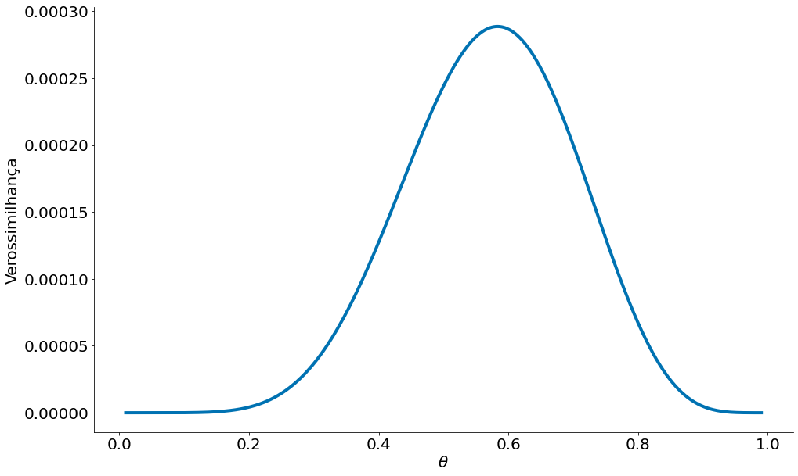
    


```python
#In: 
ll = []
for theta in thetas:
    model = np.log((theta ** x) * ((1 - theta) ** (1-x)))
    ll.append(model.sum())
```


```python
#In: 
plt.plot(thetas, ll)
plt.xlabel(r'$\theta$')
plt.ylabel('Log-Verossimilhança')
despine()
```


    
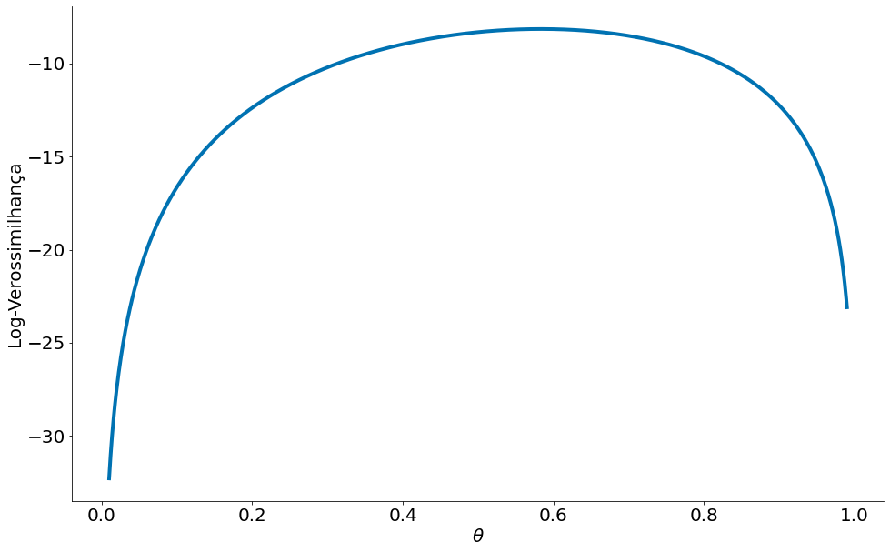
    


```python
#In: 

```
