[](https://colab.research.google.com/github/icd-ufmg/icd-ufmg.github.io/blob/master/_lessons/18-multipla.ipynb)


# Regressão Múltipla

{: .no_toc .mb-2 }

Entendimento de relação entre dados.
{: .fs-6 .fw-300 }

{: .no_toc .text-delta }
Resultados Esperados

1. Entender a Regressão com Vários Fatores
1. Entender como o gradiente descendente resolve tal problema

---
**Sumário**
1. TOC
{:toc}
---


```python
#In: 
# -*- coding: utf8

from scipy import stats as ss

import seaborn as sns
import numpy as np
import matplotlib.pyplot as plt
import pandas as pd
```


```python
#In: 
plt.style.use('seaborn-colorblind')
plt.rcParams['figure.figsize']  = (16, 10)
plt.rcParams['axes.labelsize']  = 20
plt.rcParams['axes.titlesize']  = 20
plt.rcParams['legend.fontsize'] = 20
plt.rcParams['xtick.labelsize'] = 20
plt.rcParams['ytick.labelsize'] = 20
plt.rcParams['lines.linewidth'] = 4
```


```python
#In: 
plt.ion()
```


```python
#In: 
def despine(ax=None):
    if ax is None:
        ax = plt.gca()
    # Hide the right and top spines
    ax.spines['right'].set_visible(False)
    ax.spines['top'].set_visible(False)

    # Only show ticks on the left and bottom spines
    ax.yaxis.set_ticks_position('left')
    ax.xaxis.set_ticks_position('bottom')
```

# Aula 19 - Regressão Múltipla

Continuando da aula passada, vamos agora focar em casos mais específicos de regressão. Nesta aula, vamos estender a ideia de mínimos quadrados e de regressão linear para modelos mais complexos. Para tal, vamos continuar nosso foco nos dados de preços de apartamentos em BH.

## Dados

Observe como temos 4 possíveis preditores de preço:
1. Area
1. Quartos
1. Suites
1. Vagas


```python
#In: 
df = pd.read_csv('https://raw.githubusercontent.com/icd-ufmg/material/master/aulas/19-Multipla/aptosBH.txt', index_col=0)
df.head()
```


<div>
<style scoped>
    .dataframe tbody tr th:only-of-type {
        vertical-align: middle;
    }

    .dataframe tbody tr th {
        vertical-align: top;
    }

    .dataframe thead th {
        text-align: right;
    }
</style>
<table border="1" class="dataframe">
  <thead>
    <tr style="text-align: right;">
      <th></th>
      <th>area</th>
      <th>quartos</th>
      <th>suites</th>
      <th>vagas</th>
      <th>preco</th>
    </tr>
    <tr>
      <th>ID</th>
      <th></th>
      <th></th>
      <th></th>
      <th></th>
      <th></th>
    </tr>
  </thead>
  <tbody>
    <tr>
      <th>353534.0</th>
      <td>110.00</td>
      <td>3.0</td>
      <td>1.0</td>
      <td>2.0</td>
      <td>880000.0</td>
    </tr>
    <tr>
      <th>366113.0</th>
      <td>101.89</td>
      <td>3.0</td>
      <td>1.0</td>
      <td>4.0</td>
      <td>900000.0</td>
    </tr>
    <tr>
      <th>186728.0</th>
      <td>191.00</td>
      <td>3.0</td>
      <td>1.0</td>
      <td>3.0</td>
      <td>920000.0</td>
    </tr>
    <tr>
      <th>366115.0</th>
      <td>101.89</td>
      <td>3.0</td>
      <td>1.0</td>
      <td>4.0</td>
      <td>950000.0</td>
    </tr>
    <tr>
      <th>353022.0</th>
      <td>280.61</td>
      <td>3.0</td>
      <td>1.0</td>
      <td>4.0</td>
      <td>1000000.0</td>
    </tr>
  </tbody>
</table>
</div>


Cada preditor é de uma forma correlacionado com o preço. No pairplot abaixo, preste atenção na última coluna.


```python
#In: 
sns.pairplot(df, diag_kws={'edgecolor':'k'}, plot_kws={'alpha':0.5, 'edgecolor':'k'})
```


    <seaborn.axisgrid.PairGrid at 0x7f1bac6d8880>


    
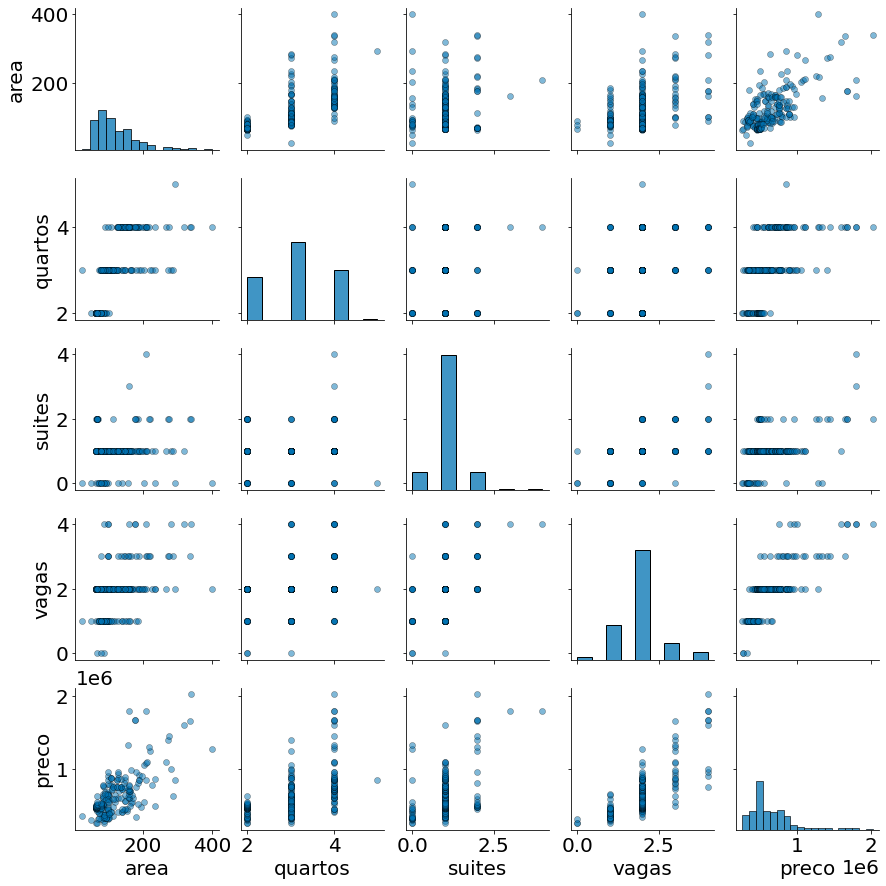
    


## Regressão Múltipla

Para realizar uma regressão múltipla, vamos representar nossos dados na forma matricial. Sendo `n` o número de linhas nos nossos dados (observações) e `f` o número de colunas (features/atríbutos). Os dados podem ser vistos como a matriz abaixo:

$$
\mathbf{X} = \begin{pmatrix}\mathbf {x} _{1}^{\mathsf {T}}\\\mathbf {x} _{2}^{\mathsf {T}}\\\vdots \\\mathbf {x} _{n}^{\mathsf {T}}\end{pmatrix} =\begin{pmatrix}1&x_{11}&\cdots &x_{1f}\\1&x_{21}&\cdots &x_{2f}\\\vdots &\vdots &\ddots &\vdots \\1&x_{n1}&\cdots &x_{nf}\end{pmatrix}
$$

Observe como a primeira coluna é toda `1`. A mesma vai capturar o fator constante, intercepto, da regressão linear. O nosso modelo é capturado pela equação abaixo:

$$y_i = \theta_0 x_{i0} + \theta_1 x_{i1}^{1} + \theta_2 x_{i2}^{2} + \cdots + \theta_f x_{if}^{f} + \epsilon_i$$.

Aqui, $x_{i0} = 1$ sempre! Por isso usamos uma coluna de 1s.

$$y_i = \theta_0 + \theta_1 x_{i1}^{1} + \theta_2 x_{i2}^{2} + \cdots + \theta_f x_{if}^{f} + \epsilon_i$$.

Vamos organizar uma matrix de fatores explanatórios X usando pandas.


```python
#In: 
y = df['preco']
X = df[['area', 'quartos', 'suites', 'vagas']]
X['intercepto'] = 1
X = X[['intercepto', 'area', 'quartos', 'suites', 'vagas']]
X.head()
```


<div>
<style scoped>
    .dataframe tbody tr th:only-of-type {
        vertical-align: middle;
    }

    .dataframe tbody tr th {
        vertical-align: top;
    }

    .dataframe thead th {
        text-align: right;
    }
</style>
<table border="1" class="dataframe">
  <thead>
    <tr style="text-align: right;">
      <th></th>
      <th>intercepto</th>
      <th>area</th>
      <th>quartos</th>
      <th>suites</th>
      <th>vagas</th>
    </tr>
    <tr>
      <th>ID</th>
      <th></th>
      <th></th>
      <th></th>
      <th></th>
      <th></th>
    </tr>
  </thead>
  <tbody>
    <tr>
      <th>353534.0</th>
      <td>1</td>
      <td>110.00</td>
      <td>3.0</td>
      <td>1.0</td>
      <td>2.0</td>
    </tr>
    <tr>
      <th>366113.0</th>
      <td>1</td>
      <td>101.89</td>
      <td>3.0</td>
      <td>1.0</td>
      <td>4.0</td>
    </tr>
    <tr>
      <th>186728.0</th>
      <td>1</td>
      <td>191.00</td>
      <td>3.0</td>
      <td>1.0</td>
      <td>3.0</td>
    </tr>
    <tr>
      <th>366115.0</th>
      <td>1</td>
      <td>101.89</td>
      <td>3.0</td>
      <td>1.0</td>
      <td>4.0</td>
    </tr>
    <tr>
      <th>353022.0</th>
      <td>1</td>
      <td>280.61</td>
      <td>3.0</td>
      <td>1.0</td>
      <td>4.0</td>
    </tr>
  </tbody>
</table>
</div>


Temos 216 observações.


```python
#In: 
y.shape
```


    (216,)


5 atributos, onde um deles é o intercepto.


```python
#In: 
X.shape
```


    (216, 5)


```python
#In: 
X.values
```

retorna a matriz.


```python
#In: 
X = X.values
y = y.values # pegar a matrix
X
```


    array([[  1.  , 110.  ,   3.  ,   1.  ,   2.  ],
           [  1.  , 101.89,   3.  ,   1.  ,   4.  ],
           [  1.  , 191.  ,   3.  ,   1.  ,   3.  ],
           ...,
           [  1.  ,  70.  ,   2.  ,   2.  ,   2.  ],
           [  1.  ,  70.  ,   2.  ,   2.  ,   2.  ],
           [  1.  , 115.  ,   3.  ,   1.  ,   2.  ]])


Sendo $\mathbf{y}$ a nossa resposta. Na forma matricial o nosso modelo tem a seguinte forma:


$$\mathbf {y} =\mathbf{X}{\boldsymbol {\theta }}+{\boldsymbol {\varepsilon }} $$

Observa na figura abaixo como cada observação $y_i$ vai ser capturada pelo modelo linear $y_i = \theta_0 + \theta_1 x_{i1}^{1} + \theta_2 x_{i2}^{2} + \cdots + \theta_f x_{if}^{f} + \epsilon_i$. Basta pensar em operações de matrizes e vetores como somatórios! Cada linha de $\mathbf{X}$ multiplica um vetor de parâmetros $\theta$.

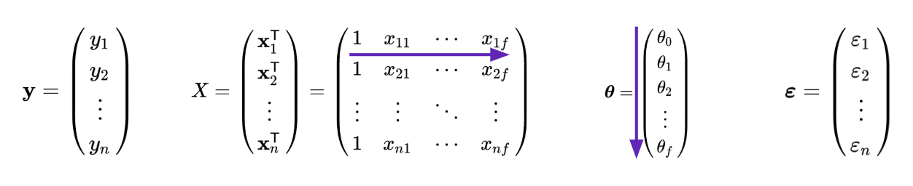

Nossa função de perda na forma matricial é:

$$L({\boldsymbol {\theta }}) = n^{-1} ||\mathbf{y} - \mathbf{X} {\boldsymbol {\theta }}||^2_2$$

A bela arte abaixo demonstra a ideia. Enquanto multplicação de matrizes capturam somatórios, a norma L2 (acima) capturam uma soma ao quadrado. 

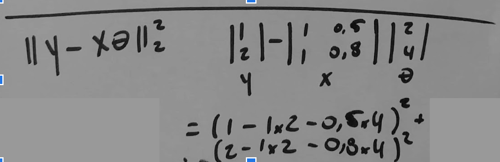

Um fator bastante interessante deste modelo é que todas as derivadas (para cada $\theta_i$) têm a mesma forma. Para chegar neste resultado, basta observar que na regressão simples a derivada da inclinação da curva é $L'(\beta) = 2 n^{-1} \sum e_i x_i$. Como temos uma soma de fatores lineares, cada $\theta_i$ vai ter o mesmo formato. Assim:

$$\frac{dL}{d\theta_j} = -2n^{-1} \sum_{i=1}^{n} (y_i - \sum_{j=0} \theta_j x_{ij}) x_{ij}$$

$$\frac{dL}{d\theta_j} = -2n^{-1} \sum_{i=1}^{n} \epsilon_i x_{ij}$$

A função abaixo computa tal derivada explorando broadcasting em numpy. Ver nos slides a discussão de como a mesma funciona.


```python
#In: 
def derivadas_regressao(theta, X, y):
    return -2 * ((y - X @ theta) * X.T).mean(axis=1)
```

Agora podemos realizar gradiente descendente!


```python
#In: 
def gd(theta, d_fun, X, y, lambda_=0.01, tol=0.00001, max_iter=10000):
    theta = theta.copy()
    print('Iter {}; theta = '.format(0), theta)
    old_err_sq = np.inf
    i = 0
    while True:
        # Computar as derivadas
        grad = d_fun(theta, X, y)
        # Atualizar
        theta_novo = theta - lambda_ * grad
        
        # Parar quando o erro convergir
        err_sq = ((X.dot(theta) - y) ** 2).mean()
        if np.abs(old_err_sq - err_sq) <= tol:
            break
        theta = theta_novo
        old_err_sq = err_sq
        print('Iter {}; theta = '.format(i+1), theta)
        i += 1
        if i == max_iter:
            break
    return theta
```

Caso queira, normalize os dados para nos ajudar no gradiente. O algoritmo funciona sem tal passo, porém demora mais tempo para finalizar.


```python
#In: 
df = pd.read_csv('https://raw.githubusercontent.com/icd-ufmg/material/master/aulas/19-Multipla/aptosBH.txt', index_col=0)
df = df - df.mean()
df = df / df.std(ddof=1)

y = df['preco']
X = df[['area', 'quartos', 'suites', 'vagas']]
X['intercepto'] = 1

X = X.values
y = y.values

theta = np.ones(5)
theta = gd(theta, derivadas_regressao, X, y)
theta
```

    Iter 0; theta =  [1. 1. 1. 1. 1.]
    Iter 1; theta =  [0.96965016 0.96989804 0.97556218 0.97103314 0.98      ]
    Iter 2; theta =  [0.9406106  0.94101718 0.95201827 0.94331228 0.9604    ]
    Iter 3; theta =  [0.91282625 0.91330653 0.92933306 0.91678573 0.941192  ]
    Iter 4; theta =  [0.88624437 0.88671737 0.90747276 0.89140395 0.92236816]
    Iter 5; theta =  [0.86081439 0.86120297 0.88640494 0.86711945 0.9039208 ]
    Iter 6; theta =  [0.83648787 0.83671857 0.8660985  0.84388667 0.88584238]
    Iter 7; theta =  [0.81321837 0.81322127 0.84652359 0.82166198 0.86812553]
    Iter 8; theta =  [0.79096142 0.79066997 0.82765156 0.80040349 0.85076302]
    Iter 9; theta =  [0.76967436 0.76902526 0.80945492 0.78007109 0.83374776]
    Iter 10; theta =  [0.74931635 0.7482494  0.7919073  0.7606263  0.81707281]
    Iter 11; theta =  [0.72984823 0.72830622 0.77498338 0.74203222 0.80073135]
    Iter 12; theta =  [0.71123249 0.70916103 0.75865886 0.72425351 0.78471672]
    Iter 13; theta =  [0.69343319 0.69078063 0.74291043 0.70725624 0.76902239]
    Iter 14; theta =  [0.67641586 0.67313318 0.72771571 0.69100791 0.75364194]
    Iter 15; theta =  [0.6601475  0.65618817 0.71305323 0.67547735 0.7385691 ]
    Iter 16; theta =  [0.64459649 0.63991637 0.69890238 0.66063469 0.72379772]
    Iter 17; theta =  [0.6297325  0.62428977 0.68524337 0.64645127 0.70932177]
    Iter 18; theta =  [0.61552651 0.60928153 0.67205721 0.63289964 0.69513533]
    Iter 19; theta =  [0.60195067 0.59486591 0.65932567 0.61995345 0.68123262]
    Iter 20; theta =  [0.58897832 0.58101829 0.64703127 0.60758746 0.66760797]
    Iter 21; theta =  [0.57658392 0.56771503 0.6351572  0.59577746 0.65425581]
    Iter 22; theta =  [0.56474297 0.5549335  0.62368734 0.58450026 0.6411707 ]
    Iter 23; theta =  [0.55343203 0.54265202 0.61260623 0.5737336  0.62834728]
    Iter 24; theta =  [0.54262861 0.53084981 0.60189899 0.56345614 0.61578034]
    Iter 25; theta =  [0.53231118 0.51950696 0.59155138 0.55364745 0.60346473]
    Iter 26; theta =  [0.5224591  0.50860437 0.58154969 0.54428791 0.59139544]
    Iter 27; theta =  [0.5130526  0.49812378 0.57188078 0.53535872 0.57956753]
    Iter 28; theta =  [0.50407274 0.48804766 0.56253202 0.52684186 0.56797618]
    Iter 29; theta =  [0.49550138 0.47835922 0.55349131 0.51872005 0.55661665]
    Iter 30; theta =  [0.48732111 0.46904238 0.54474699 0.51097673 0.54548432]
    Iter 31; theta =  [0.47951528 0.46008173 0.5362879  0.50359601 0.53457463]
    Iter 32; theta =  [0.47206792 0.4514625  0.5281033  0.49656267 0.52388314]
    Iter 33; theta =  [0.46496375 0.44317053 0.52018289 0.4898621  0.51340548]
    Iter 34; theta =  [0.45818811 0.43519227 0.51251678 0.48348032 0.50313737]
    Iter 35; theta =  [0.45172696 0.42751473 0.50509547 0.47740389 0.49307462]
    Iter 36; theta =  [0.44556686 0.42012546 0.49790982 0.47161996 0.48321313]
    Iter 37; theta =  [0.43969492 0.41301253 0.49095107 0.46611619 0.47354887]
    Iter 38; theta =  [0.43409879 0.40616451 0.48421081 0.46088075 0.46407789]
    Iter 39; theta =  [0.42876666 0.39957046 0.47768094 0.45590231 0.45479633]
    Iter 40; theta =  [0.4236872  0.39321987 0.4713537  0.45117001 0.4457004 ]
    Iter 41; theta =  [0.41884955 0.3871027  0.46522163 0.44667341 0.4367864 ]
    Iter 42; theta =  [0.41424332 0.38120932 0.45927755 0.44240253 0.42805067]
    Iter 43; theta =  [0.40985854 0.3755305  0.45351459 0.43834779 0.41948965]
    Iter 44; theta =  [0.40568569 0.37005739 0.44792612 0.4345     0.41109986]
    Iter 45; theta =  [0.40171561 0.36478152 0.44250579 0.43085037 0.40287786]
    Iter 46; theta =  [0.39793957 0.35969477 0.4372475  0.42739046 0.39482031]
    Iter 47; theta =  [0.39434916 0.35478938 0.43214537 0.42411217 0.3869239 ]
    Iter 48; theta =  [0.39093637 0.35005788 0.42719376 0.42100775 0.37918542]
    Iter 49; theta =  [0.38769349 0.34549313 0.42238726 0.41806976 0.37160171]
    Iter 50; theta =  [0.38461315 0.3410883  0.41772067 0.41529106 0.36416968]
    Iter 51; theta =  [0.38168831 0.33683683 0.41318896 0.41266484 0.35688629]
    Iter 52; theta =  [0.37891219 0.33273244 0.40878734 0.41018453 0.34974856]
    Iter 53; theta =  [0.37627832 0.32876911 0.40451118 0.40784386 0.34275359]
    Iter 54; theta =  [0.37378051 0.32494109 0.40035604 0.40563679 0.33589852]
    Iter 55; theta =  [0.3714128  0.32124284 0.39631764 0.40355757 0.32918055]
    Iter 56; theta =  [0.36916951 0.31766909 0.39239187 0.40160065 0.32259694]
    Iter 57; theta =  [0.3670452  0.31421475 0.3885748  0.39976074 0.316145  ]
    Iter 58; theta =  [0.36503464 0.31087497 0.38486262 0.39803274 0.3098221 ]
    Iter 59; theta =  [0.36313283 0.30764509 0.38125168 0.39641178 0.30362566]
    Iter 60; theta =  [0.361335   0.30452067 0.37773848 0.39489319 0.29755314]
    Iter 61; theta =  [0.35963655 0.30149742 0.37431963 0.39347249 0.29160208]
    Iter 62; theta =  [0.35803311 0.29857126 0.3709919  0.39214539 0.28577004]
    Iter 63; theta =  [0.35652046 0.29573827 0.36775215 0.39090776 0.28005464]
    Iter 64; theta =  [0.35509458 0.29299468 0.3645974  0.38975567 0.27445354]
    Iter 65; theta =  [0.35375162 0.2903369  0.36152474 0.38868533 0.26896447]
    Iter 66; theta =  [0.35248788 0.28776148 0.35853141 0.38769311 0.26358518]
    Iter 67; theta =  [0.35129985 0.28526512 0.35561472 0.38677555 0.25831348]
    Iter 68; theta =  [0.35018412 0.28284466 0.35277211 0.38592931 0.25314721]
    Iter 69; theta =  [0.34913747 0.28049705 0.3500011  0.38515121 0.24808427]
    Iter 70; theta =  [0.3481568  0.2782194  0.34729932 0.38443817 0.24312258]
    Iter 71; theta =  [0.34723912 0.27600892 0.34466446 0.38378727 0.23826013]
    Iter 72; theta =  [0.34638161 0.27386294 0.34209433 0.3831957  0.23349493]
    Iter 73; theta =  [0.34558154 0.27177892 0.33958681 0.38266076 0.22882503]
    Iter 74; theta =  [0.34483631 0.2697544  0.33713984 0.38217988 0.22424853]
    Iter 75; theta =  [0.34414341 0.26778703 0.33475147 0.38175057 0.21976356]
    Iter 76; theta =  [0.34350047 0.26587458 0.3324198  0.38137047 0.21536829]
    Iter 77; theta =  [0.34290521 0.26401489 0.33014301 0.38103731 0.21106092]
    Iter 78; theta =  [0.34235542 0.26220589 0.32791934 0.38074891 0.2068397 ]
    Iter 79; theta =  [0.34184903 0.2604456  0.32574711 0.38050318 0.20270291]
    Iter 80; theta =  [0.34138402 0.25873215 0.32362468 0.38029812 0.19864885]
    Iter 81; theta =  [0.34095848 0.25706371 0.32155049 0.38013182 0.19467587]
    Iter 82; theta =  [0.34057058 0.25543854 0.31952302 0.38000245 0.19078236]
    Iter 83; theta =  [0.34021855 0.25385497 0.31754083 0.37990823 0.18696671]
    Iter 84; theta =  [0.33990072 0.25231142 0.31560251 0.37984749 0.18322737]
    Iter 85; theta =  [0.33961548 0.25080636 0.31370671 0.37981862 0.17956283]
    Iter 86; theta =  [0.3393613  0.24933831 0.31185214 0.37982006 0.17597157]
    Iter 87; theta =  [0.33913668 0.24790588 0.31003752 0.37985034 0.17245214]
    Iter 88; theta =  [0.33894024 0.24650772 0.30826167 0.37990803 0.1690031 ]
    Iter 89; theta =  [0.33877062 0.24514254 0.30652341 0.37999177 0.16562303]
    Iter 90; theta =  [0.33862653 0.24380911 0.30482161 0.38010027 0.16231057]
    Iter 91; theta =  [0.33850674 0.24250624 0.30315521 0.38023228 0.15906436]
    Iter 92; theta =  [0.33841007 0.2412328  0.30152314 0.38038659 0.15588307]
    Iter 93; theta =  [0.33833538 0.2399877  0.29992441 0.38056207 0.15276541]
    Iter 94; theta =  [0.33828161 0.23876991 0.29835805 0.38075762 0.14971011]
    Iter 95; theta =  [0.33824771 0.23757841 0.29682311 0.38097218 0.1467159 ]
    Iter 96; theta =  [0.33823271 0.23641227 0.2953187  0.38120477 0.14378158]
    Iter 97; theta =  [0.33823564 0.23527056 0.29384394 0.3814544  0.14090595]
    Iter 98; theta =  [0.33825562 0.2341524  0.29239798 0.38172017 0.13808783]
    Iter 99; theta =  [0.33829178 0.23305695 0.29098003 0.38200118 0.13532608]
    Iter 100; theta =  [0.33834329 0.23198341 0.2895893  0.3822966  0.13261956]
    Iter 101; theta =  [0.33840937 0.230931   0.28822502 0.38260561 0.12996716]
    Iter 102; theta =  [0.33848925 0.22989898 0.28688647 0.38292744 0.12736782]
    Iter 103; theta =  [0.33858222 0.22888664 0.28557295 0.38326136 0.12482047]
    Iter 104; theta =  [0.33868759 0.2278933  0.28428377 0.38360664 0.12232406]
    Iter 105; theta =  [0.33880469 0.2269183  0.28301827 0.38396262 0.11987757]
    Iter 106; theta =  [0.33893291 0.22596103 0.28177583 0.38432864 0.11748002]
    Iter 107; theta =  [0.33907163 0.22502088 0.28055582 0.38470409 0.11513042]
    Iter 108; theta =  [0.33922028 0.22409727 0.27935766 0.38508836 0.11282781]
    Iter 109; theta =  [0.33937831 0.22318966 0.27818076 0.38548089 0.11057126]
    Iter 110; theta =  [0.3395452  0.22229751 0.27702459 0.38588114 0.10835983]
    Iter 111; theta =  [0.33972044 0.22142032 0.2758886  0.38628858 0.10619264]
    Iter 112; theta =  [0.33990356 0.22055761 0.27477228 0.38670273 0.10406878]
    Iter 113; theta =  [0.3400941  0.2197089  0.27367512 0.38712309 0.10198741]
    Iter 114; theta =  [0.34029162 0.21887375 0.27259664 0.38754923 0.09994766]
    Iter 115; theta =  [0.3404957  0.21805173 0.27153637 0.3879807  0.09794871]
    Iter 116; theta =  [0.34070594 0.21724244 0.27049387 0.38841708 0.09598973]
    Iter 117; theta =  [0.34092197 0.21644546 0.26946869 0.38885799 0.09406994]
    Iter 118; theta =  [0.34114343 0.21566044 0.26846041 0.38930304 0.09218854]
    Iter 119; theta =  [0.34136995 0.214887   0.26746862 0.38975187 0.09034477]
    Iter 120; theta =  [0.34160122 0.2141248  0.26649293 0.39020414 0.08853787]
    Iter 121; theta =  [0.34183692 0.2133735  0.26553294 0.39065951 0.08676712]
    Iter 122; theta =  [0.34207675 0.21263278 0.26458829 0.39111766 0.08503177]
    Iter 123; theta =  [0.34232041 0.21190233 0.26365861 0.3915783  0.08333114]
    Iter 124; theta =  [0.34256765 0.21118186 0.26274357 0.39204114 0.08166451]
    Iter 125; theta =  [0.34281818 0.21047109 0.26184281 0.39250591 0.08003122]
    Iter 126; theta =  [0.34307178 0.20976974 0.26095602 0.39297233 0.0784306 ]
    Iter 127; theta =  [0.34332819 0.20907756 0.26008287 0.39344017 0.07686199]
    Iter 128; theta =  [0.34358719 0.20839428 0.25922306 0.39390918 0.07532475]
    Iter 129; theta =  [0.34384857 0.20771968 0.25837629 0.39437914 0.07381825]
    Iter 130; theta =  [0.34411211 0.20705351 0.25754226 0.39484983 0.07234189]
    Iter 131; theta =  [0.34437764 0.20639556 0.25672071 0.39532104 0.07089505]
    Iter 132; theta =  [0.34464495 0.20574562 0.25591136 0.39579258 0.06947715]
    Iter 133; theta =  [0.34491387 0.20510347 0.25511394 0.39626426 0.06808761]
    Iter 134; theta =  [0.34518423 0.20446892 0.2543282  0.39673591 0.06672585]
    Iter 135; theta =  [0.34545588 0.20384179 0.25355389 0.39720734 0.06539134]
    Iter 136; theta =  [0.34572865 0.20322189 0.25279077 0.39767841 0.06408351]
    Iter 137; theta =  [0.3460024  0.20260905 0.2520386  0.39814895 0.06280184]
    Iter 138; theta =  [0.34627699 0.20200309 0.25129717 0.39861882 0.0615458 ]
    Iter 139; theta =  [0.3465523  0.20140385 0.25056624 0.39908789 0.06031489]
    Iter 140; theta =  [0.34682819 0.20081119 0.2498456  0.39955602 0.05910859]
    Iter 141; theta =  [0.34710455 0.20022495 0.24913505 0.40002308 0.05792642]
    Iter 142; theta =  [0.34738126 0.19964499 0.24843438 0.40048896 0.05676789]
    Iter 143; theta =  [0.34765822 0.19907116 0.2477434  0.40095355 0.05563253]
    Iter 144; theta =  [0.34793533 0.19850334 0.24706191 0.40141673 0.05451988]
    Iter 145; theta =  [0.34821248 0.1979414  0.24638974 0.40187842 0.05342948]
    Iter 146; theta =  [0.34848959 0.19738521 0.24572669 0.4023385  0.05236089]
    Iter 147; theta =  [0.34876657 0.19683466 0.2450726  0.40279689 0.05131368]
    Iter 148; theta =  [0.34904333 0.19628962 0.24442728 0.40325351 0.0502874 ]
    Iter 149; theta =  [0.3493198  0.19574999 0.24379059 0.40370828 0.04928165]
    Iter 150; theta =  [0.34959591 0.19521567 0.24316235 0.40416111 0.04829602]
    Iter 151; theta =  [0.34987158 0.19468655 0.24254241 0.40461194 0.0473301 ]
    Iter 152; theta =  [0.35014675 0.19416253 0.24193061 0.4050607  0.0463835 ]
    Iter 153; theta =  [0.35042136 0.19364351 0.2413268  0.40550732 0.04545583]
    Iter 154; theta =  [0.35069534 0.19312941 0.24073085 0.40595174 0.04454671]
    Iter 155; theta =  [0.35096864 0.19262014 0.2401426  0.40639392 0.04365578]
    Iter 156; theta =  [0.35124121 0.1921156  0.23956192 0.40683379 0.04278266]
    Iter 157; theta =  [0.351513   0.19161572 0.23898868 0.4072713  0.04192701]
    Iter 158; theta =  [0.35178396 0.19112042 0.23842274 0.40770641 0.04108847]
    Iter 159; theta =  [0.35205404 0.19062962 0.23786398 0.40813908 0.0402667 ]
    Iter 160; theta =  [0.35232321 0.19014324 0.23731228 0.40856926 0.03946137]
    Iter 161; theta =  [0.35259143 0.18966122 0.2367675  0.40899692 0.03867214]
    Iter 162; theta =  [0.35285865 0.18918347 0.23622954 0.40942203 0.0378987 ]
    Iter 163; theta =  [0.35312485 0.18870995 0.23569827 0.40984454 0.03714072]
    Iter 164; theta =  [0.35339    0.18824058 0.23517359 0.41026443 0.03639791]
    Iter 165; theta =  [0.35365405 0.18777529 0.23465539 0.41068168 0.03566995]
    Iter 166; theta =  [0.35391699 0.18731403 0.23414355 0.41109625 0.03495655]
    Iter 167; theta =  [0.35417879 0.18685673 0.23363798 0.41150812 0.03425742]
    Iter 168; theta =  [0.35443942 0.18640335 0.23313856 0.41191728 0.03357227]
    Iter 169; theta =  [0.35469886 0.18595382 0.23264521 0.4123237  0.03290083]
    Iter 170; theta =  [0.35495709 0.18550809 0.23215782 0.41272737 0.03224281]
    Iter 171; theta =  [0.35521409 0.18506611 0.2316763  0.41312827 0.03159795]
    Iter 172; theta =  [0.35546983 0.18462782 0.23120056 0.41352638 0.03096599]
    Iter 173; theta =  [0.35572432 0.18419318 0.2307305  0.4139217  0.03034667]
    Iter 174; theta =  [0.35597752 0.18376215 0.23026603 0.41431421 0.02973974]
    Iter 175; theta =  [0.35622942 0.18333466 0.22980707 0.41470391 0.02914495]
    Iter 176; theta =  [0.35648002 0.18291069 0.22935354 0.41509078 0.02856205]
    Iter 177; theta =  [0.3567293  0.18249018 0.22890535 0.41547482 0.02799081]
    Iter 178; theta =  [0.35697724 0.18207309 0.22846241 0.41585603 0.02743099]
    Iter 179; theta =  [0.35722385 0.18165938 0.22802466 0.4162344  0.02688237]
    Iter 180; theta =  [0.3574691  0.18124901 0.22759201 0.41660992 0.02634472]
    Iter 181; theta =  [0.357713   0.18084194 0.22716438 0.41698261 0.02581783]
    Iter 182; theta =  [0.35795553 0.18043813 0.22674171 0.41735245 0.02530147]
    Iter 183; theta =  [0.35819669 0.18003755 0.22632391 0.41771944 0.02479544]
    Iter 184; theta =  [0.35843647 0.17964016 0.22591092 0.4180836  0.02429953]
    Iter 185; theta =  [0.35867488 0.17924592 0.22550266 0.41844491 0.02381354]
    Iter 186; theta =  [0.3589119  0.17885479 0.22509908 0.41880339 0.02333727]
    Iter 187; theta =  [0.35914753 0.17846676 0.22470009 0.41915904 0.02287053]
    Iter 188; theta =  [0.35938178 0.17808177 0.22430564 0.41951185 0.02241312]
    Iter 189; theta =  [0.35961463 0.1776998  0.22391566 0.41986185 0.02196485]
    Iter 190; theta =  [0.35984609 0.17732082 0.22353009 0.42020903 0.02152556]
    Iter 191; theta =  [0.36007616 0.1769448  0.22314887 0.42055341 0.02109505]
    Iter 192; theta =  [0.36030483 0.1765717  0.22277193 0.42089498 0.02067314]
    Iter 193; theta =  [0.36053211 0.1762015  0.22239921 0.42123376 0.02025968]
    Iter 194; theta =  [0.360758   0.17583417 0.22203066 0.42156975 0.01985449]
    Iter 195; theta =  [0.3609825  0.17546968 0.22166623 0.42190297 0.0194574 ]
    Iter 196; theta =  [0.36120561 0.175108   0.22130584 0.42223343 0.01906825]
    Iter 197; theta =  [0.36142733 0.17474911 0.22094946 0.42256113 0.01868688]
    Iter 198; theta =  [0.36164767 0.17439297 0.22059702 0.42288609 0.01831315]
    Iter 199; theta =  [0.36186663 0.17403957 0.22024847 0.42320832 0.01794688]
    Iter 200; theta =  [0.3620842  0.17368887 0.21990377 0.42352783 0.01758795]
    Iter 201; theta =  [0.36230041 0.17334086 0.21956285 0.42384463 0.01723619]
    Iter 202; theta =  [0.36251524 0.1729955  0.21922567 0.42415874 0.01689146]
    Iter 203; theta =  [0.36272871 0.17265278 0.21889218 0.42447016 0.01655363]
    Iter 204; theta =  [0.36294082 0.17231267 0.21856233 0.42477892 0.01622256]
    Iter 205; theta =  [0.36315157 0.17197514 0.21823607 0.42508502 0.01589811]
    Iter 206; theta =  [0.36336096 0.17164018 0.21791336 0.42538848 0.01558015]
    Iter 207; theta =  [0.36356901 0.17130775 0.21759415 0.42568931 0.01526855]
    Iter 208; theta =  [0.36377572 0.17097785 0.2172784  0.42598752 0.01496317]
    Iter 209; theta =  [0.36398109 0.17065044 0.21696606 0.42628314 0.01466391]
    Iter 210; theta =  [0.36418512 0.17032551 0.21665708 0.42657617 0.01437063]
    Iter 211; theta =  [0.36438784 0.17000303 0.21635143 0.42686664 0.01408322]
    Iter 212; theta =  [0.36458923 0.16968298 0.21604907 0.42715455 0.01380156]
    Iter 213; theta =  [0.36478931 0.16936535 0.21574995 0.42743992 0.01352552]
    Iter 214; theta =  [0.36498809 0.1690501  0.21545403 0.42772277 0.01325501]
    Iter 215; theta =  [0.36518556 0.16873723 0.21516127 0.42800312 0.01298991]
    Iter 216; theta =  [0.36538175 0.16842672 0.21487163 0.42828097 0.01273012]
    Iter 217; theta =  [0.36557664 0.16811853 0.21458507 0.42855634 0.01247551]
    Iter 218; theta =  [0.36577025 0.16781267 0.21430157 0.42882926 0.012226  ]
    Iter 219; theta =  [0.36596259 0.16750909 0.21402106 0.42909974 0.01198148]
    Iter 220; theta =  [0.36615367 0.16720779 0.21374354 0.42936778 0.01174185]
    Iter 221; theta =  [0.36634348 0.16690876 0.21346894 0.42963342 0.01150702]
    Iter 222; theta =  [0.36653204 0.16661196 0.21319725 0.42989666 0.01127688]
    Iter 223; theta =  [0.36671936 0.16631738 0.21292842 0.43015753 0.01105134]
    Iter 224; theta =  [0.36690544 0.16602501 0.21266242 0.43041603 0.01083031]
    Iter 225; theta =  [0.36709028 0.16573482 0.21239921 0.43067219 0.01061371]
    Iter 226; theta =  [0.3672739  0.16544681 0.21213877 0.43092602 0.01040143]
    Iter 227; theta =  [0.36745631 0.16516094 0.21188106 0.43117754 0.0101934 ]
    Iter 228; theta =  [0.36763751 0.16487722 0.21162604 0.43142677 0.00998953]
    Iter 229; theta =  [0.3678175  0.16459561 0.21137369 0.43167372 0.00978974]
    Iter 230; theta =  [0.3679963  0.1643161  0.21112398 0.43191841 0.00959395]
    Iter 231; theta =  [0.36817391 0.16403868 0.21087686 0.43216085 0.00940207]
    Iter 232; theta =  [0.36835035 0.16376333 0.21063232 0.43240107 0.00921403]
    Iter 233; theta =  [0.36852561 0.16349004 0.21039032 0.43263908 0.00902975]
    Iter 234; theta =  [0.36869971 0.16321878 0.21015083 0.43287489 0.00884915]
    Iter 235; theta =  [0.36887264 0.16294955 0.20991383 0.43310853 0.00867217]
    Iter 236; theta =  [0.36904443 0.16268232 0.20967928 0.43334001 0.00849873]
    Iter 237; theta =  [0.36921508 0.16241708 0.20944715 0.43356934 0.00832875]
    Iter 238; theta =  [0.36938459 0.16215382 0.20921743 0.43379654 0.00816218]
    Iter 239; theta =  [0.36955297 0.16189252 0.20899008 0.43402164 0.00799893]
    Iter 240; theta =  [0.36972023 0.16163317 0.20876506 0.43424464 0.00783895]
    Iter 241; theta =  [0.36988638 0.16137575 0.20854237 0.43446557 0.00768218]
    Iter 242; theta =  [0.37005143 0.16112024 0.20832197 0.43468443 0.00752853]
    Iter 243; theta =  [0.37021537 0.16086664 0.20810383 0.43490125 0.00737796]
    Iter 244; theta =  [0.37037823 0.16061492 0.20788793 0.43511604 0.0072304 ]
    Iter 245; theta =  [0.37054    0.16036508 0.20767424 0.43532882 0.00708579]
    Iter 246; theta =  [0.37070069 0.1601171  0.20746274 0.43553961 0.00694408]
    Iter 247; theta =  [0.37086032 0.15987097 0.2072534  0.43574842 0.0068052 ]
    Iter 248; theta =  [0.37101888 0.15962666 0.20704621 0.43595526 0.00666909]
    Iter 249; theta =  [0.37117639 0.15938418 0.20684113 0.43616016 0.00653571]
    Iter 250; theta =  [0.37133286 0.1591435  0.20663814 0.43636313 0.006405  ]
    Iter 251; theta =  [0.37148828 0.15890461 0.20643722 0.43656418 0.0062769 ]
    Iter 252; theta =  [0.37164267 0.15866749 0.20623835 0.43676334 0.00615136]
    Iter 253; theta =  [0.37179603 0.15843215 0.2060415  0.43696061 0.00602833]
    Iter 254; theta =  [0.37194837 0.15819855 0.20584665 0.43715601 0.00590777]
    Iter 255; theta =  [0.37209971 0.15796669 0.20565378 0.43734957 0.00578961]
    Iter 256; theta =  [0.37225003 0.15773655 0.20546287 0.43754129 0.00567382]
    Iter 257; theta =  [0.37239936 0.15750813 0.20527389 0.43773119 0.00556034]
    Iter 258; theta =  [0.3725477  0.15728141 0.20508683 0.43791928 0.00544913]
    Iter 259; theta =  [0.37269505 0.15705637 0.20490166 0.43810558 0.00534015]
    Iter 260; theta =  [0.37284143 0.15683301 0.20471836 0.43829012 0.00523335]
    Iter 261; theta =  [0.37298684 0.1566113  0.20453692 0.43847289 0.00512868]
    Iter 262; theta =  [0.37313128 0.15639125 0.20435731 0.43865392 0.00502611]
    Iter 263; theta =  [0.37327476 0.15617284 0.20417951 0.43883322 0.00492559]
    Iter 264; theta =  [0.3734173  0.15595605 0.2040035  0.4390108  0.00482707]
    Iter 265; theta =  [0.37355889 0.15574087 0.20382927 0.43918669 0.00473053]
    Iter 266; theta =  [0.37369954 0.15552729 0.20365679 0.43936089 0.00463592]
    Iter 267; theta =  [0.37383926 0.1553153  0.20348604 0.43953343 0.0045432 ]
    Iter 268; theta =  [0.37397806 0.15510489 0.20331702 0.4397043  0.00445234]
    Iter 269; theta =  [0.37411594 0.15489604 0.20314969 0.43987354 0.00436329]
    Iter 270; theta =  [0.37425291 0.15468875 0.20298404 0.44004115 0.00427603]
    Iter 271; theta =  [0.37438898 0.154483   0.20282005 0.44020715 0.00419051]
    Iter 272; theta =  [0.37452414 0.15427878 0.20265771 0.44037156 0.0041067 ]
    Iter 273; theta =  [0.37465841 0.15407608 0.20249699 0.44053438 0.00402456]
    Iter 274; theta =  [0.3747918  0.15387489 0.20233789 0.44069563 0.00394407]
    Iter 275; theta =  [0.37492431 0.15367519 0.20218038 0.44085532 0.00386519]
    Iter 276; theta =  [0.37505594 0.15347698 0.20202444 0.44101347 0.00378789]
    Iter 277; theta =  [0.37518671 0.15328024 0.20187006 0.4411701  0.00371213]
    Iter 278; theta =  [0.37531661 0.15308497 0.20171722 0.44132521 0.00363789]
    Iter 279; theta =  [0.37544566 0.15289115 0.20156591 0.44147882 0.00356513]
    Iter 280; theta =  [0.37557386 0.15269877 0.20141612 0.44163094 0.00349383]
    Iter 281; theta =  [0.37570122 0.15250783 0.20126781 0.44178159 0.00342395]
    Iter 282; theta =  [0.37582774 0.1523183  0.20112098 0.44193077 0.00335547]


    array([0.37582774, 0.1523183 , 0.20112098, 0.44193077, 0.00335547])


```python
#In: 
theta
```


    array([0.37582774, 0.1523183 , 0.20112098, 0.44193077, 0.00335547])


Observe como os resultados batem com o scikit learn.


```python
#In: 
from sklearn.linear_model import LinearRegression
model = LinearRegression(fit_intercept=True)
model.fit(X, y)
```


    LinearRegression()


```python
#In: 
model.coef_
```


    array([0.39547414, 0.12651004, 0.18641188, 0.45621635, 0.        ])


```python
#In: 
model.intercept_
```


    -7.202231225161153e-18


Com SGD também funciona! Temos que acetar a taxa de aprendizado.


```python
#In: 
def sgd(theta, d_fun, X, y, lambda_=0.001, tol=0.00001, max_iter=10000):
    theta = theta.copy()
    print('Iter {}; alpha, beta = '.format(0), theta)
    old_err_sq = np.inf
    for i in range(1000):
        # Escolhe ponto aleatório
        r = np.random.randint(len(y))
        X_r, y_r = X[r], y[r]
        X_r = X_r[None] # np.array([1, 2])[None] -> [[1, 2]]. Vira matriz
        
        # Deriva e atualiza
        grad = d_fun(theta, X_r, y_r)
        theta_novo = theta - lambda_ * grad
        err_sq = ((X.dot(theta) - y) ** 2).mean()
        
        theta = theta_novo
        old_err_sq = err_sq
        
        print('Iter {}; alpha, beta = '.format(i+1), theta)
        if i == max_iter:
            break
    return theta
```


```python
#In: 
df = pd.read_csv('https://raw.githubusercontent.com/icd-ufmg/material/master/aulas/19-Multipla/aptosBH.txt', index_col=0)
df = df - df.mean()
df = df / df.std(ddof=1)

y = df['preco']
X = df[['area', 'quartos', 'suites', 'vagas']]

X = X.values
y = y.values

theta = np.ones(4)
theta = sgd(theta, derivadas_regressao, X, y, lambda_=0.002)
theta
```

    Iter 0; alpha, beta =  [1. 1. 1. 1.]
    Iter 1; alpha, beta =  [1.00210784 1.00038719 1.00025609 0.98422537]
    Iter 2; alpha, beta =  [1.00212633 1.0004065  1.00026886 0.98420931]
    Iter 3; alpha, beta =  [0.99638647 0.99152991 0.99998436 0.98456696]
    Iter 4; alpha, beta =  [0.99438423 0.99126312 0.99980791 0.97946508]
    Iter 5; alpha, beta =  [0.9876046  0.98146945 0.99949402 0.97985968]
    Iter 6; alpha, beta =  [0.98049606 0.97035971 0.9998883  0.97936402]
    Iter 7; alpha, beta =  [0.97917833 0.97021491 0.99979253 0.97948441]
    Iter 8; alpha, beta =  [0.97836243 0.97007479 0.99969986 0.97960091]
    Iter 9; alpha, beta =  [0.9633535  0.94549478 0.96487915 0.9568229 ]
    Iter 10; alpha, beta =  [0.95866646 0.93573687 0.96522546 0.95638755]
    Iter 11; alpha, beta =  [0.94457991 0.92343394 0.96566209 0.94266527]
    Iter 12; alpha, beta =  [0.94427486 0.92339758 0.96563804 0.9426955 ]
    Iter 13; alpha, beta =  [0.87918206 0.90074119 0.93170614 0.89316594]
    Iter 14; alpha, beta =  [0.87796374 0.89506072 0.93190774 0.8929125 ]
    Iter 15; alpha, beta =  [0.87214211 0.88665096 0.93163821 0.89325134]
    Iter 16; alpha, beta =  [0.87255191 0.88672027 0.93168405 0.89319371]
    Iter 17; alpha, beta =  [0.87257408 0.88674342 0.93169936 0.89317446]
    Iter 18; alpha, beta =  [0.86998797 0.88645925 0.93151141 0.89341074]
    Iter 19; alpha, beta =  [0.86248475 0.86578021 0.90221693 0.87424771]
    Iter 20; alpha, beta =  [0.86180919 0.86564293 0.90212614 0.87162254]
    Iter 21; alpha, beta =  [0.86099986 0.86551663 0.9020426  0.87172755]
    Iter 22; alpha, beta =  [0.85946526 0.86531215 0.90190736 0.86781727]
    Iter 23; alpha, beta =  [0.85387568 0.85723759 0.90164856 0.8681426 ]
    Iter 24; alpha, beta =  [0.81829729 0.85815384 0.90225458 0.83081332]
    Iter 25; alpha, beta =  [0.82114447 0.85841585 0.90242787 0.82536712]
    Iter 26; alpha, beta =  [0.81903711 0.85805941 0.90219212 0.81855066]
    Iter 27; alpha, beta =  [0.81957992 0.85511429 0.90229664 0.82157275]
    Iter 28; alpha, beta =  [0.81371014 0.84663496 0.90202487 0.82191439]
    Iter 29; alpha, beta =  [0.81258876 0.84140647 0.90221043 0.82168113]
    Iter 30; alpha, beta =  [0.81408956 0.84168215 0.90239277 0.81044946]
    Iter 31; alpha, beta =  [0.79998918 0.82172836 0.8741257  0.79195852]
    Iter 32; alpha, beta =  [0.78622974 0.81444582 0.87438416 0.79163362]
    Iter 33; alpha, beta =  [0.78513307 0.8143069  0.87429227 0.79174912]
    Iter 34; alpha, beta =  [0.78521292 0.81420408 0.87422427 0.79183461]
    Iter 35; alpha, beta =  [0.78669021 0.81648869 0.87113427 0.79174256]
    Iter 36; alpha, beta =  [0.78115448 0.80849193 0.87087797 0.79206476]
    Iter 37; alpha, beta =  [0.77824441 0.79898386 0.87121541 0.78145978]
    Iter 38; alpha, beta =  [0.77765089 0.79888347 0.87114902 0.77953997]
    Iter 39; alpha, beta =  [0.77351204 0.78855122 0.87151571 0.779079  ]
    Iter 40; alpha, beta =  [0.77308534 0.78166967 0.87175993 0.77140354]
    Iter 41; alpha, beta =  [0.77235822 0.78154668 0.87167859 0.76905159]
    Iter 42; alpha, beta =  [0.77190855 0.7814838  0.871637   0.76910387]
    Iter 43; alpha, beta =  [0.76883471 0.7750844  0.87186411 0.76881837]
    Iter 44; alpha, beta =  [0.76376757 0.76776455 0.87162951 0.76911329]
    Iter 45; alpha, beta =  [0.76456772 0.76900197 0.86995585 0.76906343]
    Iter 46; alpha, beta =  [0.76450216 0.76904511 0.86998439 0.76902756]
    Iter 47; alpha, beta =  [0.76078851 0.76225347 0.87022542 0.76872456]
    Iter 48; alpha, beta =  [0.7600117  0.76212069 0.8701376  0.76883496]
    Iter 49; alpha, beta =  [0.76051551 0.75938722 0.87023461 0.77163988]
    Iter 50; alpha, beta =  [0.76048212 0.75897781 0.87024914 0.77162161]
    Iter 51; alpha, beta =  [0.75646463 0.74894853 0.87060508 0.77117416]
    Iter 52; alpha, beta =  [0.72523189 0.72167042 0.74610768 0.71154096]
    Iter 53; alpha, beta =  [0.72228696 0.71581212 0.74591992 0.71177699]
    Iter 54; alpha, beta =  [0.71787042 0.70943211 0.74571544 0.71203405]
    Iter 55; alpha, beta =  [0.69275862 0.69693252 0.72699511 0.69809241]
    Iter 56; alpha, beta =  [0.69103123 0.69664034 0.72680186 0.69250499]
    Iter 57; alpha, beta =  [0.6859282  0.6895489  0.71618119 0.67700225]
    Iter 58; alpha, beta =  [0.68057922 0.68043038 0.71588894 0.66855222]
    Iter 59; alpha, beta =  [0.67532321 0.67147034 0.71560176 0.66024906]
    Iter 60; alpha, beta =  [0.67438263 0.67131125 0.71549654 0.65720667]
    Iter 61; alpha, beta =  [0.67398572 0.6712661  0.71546668 0.65634323]
    Iter 62; alpha, beta =  [0.6715708  0.6714774  0.71560643 0.65616755]
    Iter 63; alpha, beta =  [0.66732227 0.66578377 0.7158085  0.65591353]
    Iter 64; alpha, beta =  [0.66879242 0.66541596 0.70505595 0.64887974]
    Iter 65; alpha, beta =  [0.66470487 0.6595112  0.7048667  0.64911764]
    Iter 66; alpha, beta =  [0.65967366 0.65093439 0.70459181 0.64116961]
    Iter 67; alpha, beta =  [0.65551777 0.6449309  0.7043994  0.6414115 ]
    Iter 68; alpha, beta =  [0.65159069 0.63925795 0.70421758 0.64164007]
    Iter 69; alpha, beta =  [0.6477095  0.63365129 0.70403788 0.64186596]
    Iter 70; alpha, beta =  [0.64098464 0.62777792 0.70424633 0.635315  ]
    Iter 71; alpha, beta =  [0.63122677 0.61396932 0.68468469 0.62251873]
    Iter 72; alpha, beta =  [0.62755981 0.60867213 0.68451491 0.62273216]
    Iter 73; alpha, beta =  [0.6283157  0.60874169 0.68456092 0.62267432]
    Iter 74; alpha, beta =  [0.6283944  0.60970681 0.68452667 0.62271738]
    Iter 75; alpha, beta =  [0.62750763 0.60959448 0.68445237 0.62281078]
    Iter 76; alpha, beta =  [0.62694195 0.60949733 0.68438812 0.62289155]
    Iter 77; alpha, beta =  [0.62470806 0.60929176 0.68425215 0.61896033]
    Iter 78; alpha, beta =  [0.62387741 0.60920765 0.68419652 0.61735186]
    Iter 79; alpha, beta =  [0.6143599  0.59786701 0.66721193 0.6168459 ]
    Iter 80; alpha, beta =  [0.61417278 0.59783264 0.6671892  0.61756035]
    Iter 81; alpha, beta =  [0.61325748 0.59756617 0.66701295 0.61778191]
    Iter 82; alpha, beta =  [0.60398973 0.58652313 0.65047406 0.61728923]
    Iter 83; alpha, beta =  [0.60185881 0.58628897 0.65031919 0.61748392]
    Iter 84; alpha, beta =  [0.59775572 0.57774678 0.65062235 0.60795624]
    Iter 85; alpha, beta =  [0.59423116 0.57732666 0.63834062 0.59992212]
    Iter 86; alpha, beta =  [0.58872411 0.57267879 0.63850557 0.59473804]
    Iter 87; alpha, beta =  [0.57249713 0.56460168 0.62640869 0.5857291 ]
    Iter 88; alpha, beta =  [0.57338383 0.56468328 0.62646266 0.58566125]
    Iter 89; alpha, beta =  [0.57347526 0.56469333 0.6264693  0.5856529 ]
    Iter 90; alpha, beta =  [0.57150826 0.5598897  0.62663978 0.59058209]
    Iter 91; alpha, beta =  [0.56836535 0.55534954 0.62649427 0.59076501]
    Iter 92; alpha, beta =  [0.55493771 0.55479569 0.61030301 0.58017348]
    Iter 93; alpha, beta =  [0.55478801 0.5547521  0.61027419 0.57934003]
    Iter 94; alpha, beta =  [0.55263558 0.55494044 0.61039875 0.57918345]
    Iter 95; alpha, beta =  [0.55257267 0.55498183 0.61042613 0.57914903]
    Iter 96; alpha, beta =  [0.55026648 0.55141535 0.61031182 0.57929272]
    Iter 97; alpha, beta =  [0.55164934 0.55364671 0.60729386 0.57920282]
    Iter 98; alpha, beta =  [0.55151763 0.55367966 0.60731565 0.57983296]
    Iter 99; alpha, beta =  [0.55157256 0.55357578 0.60724695 0.57991933]
    Iter 100; alpha, beta =  [0.55143386 0.55355232 0.60723144 0.5794707 ]
    Iter 101; alpha, beta =  [0.54888475 0.54889042 0.60739689 0.57926271]
    Iter 102; alpha, beta =  [0.54678872 0.54472083 0.60726325 0.5794307 ]
    Iter 103; alpha, beta =  [0.54434048 0.53916239 0.60746052 0.57918272]
    Iter 104; alpha, beta =  [0.54141425 0.53493523 0.60732504 0.57935303]
    Iter 105; alpha, beta =  [0.54051934 0.5346747  0.60715272 0.57956966]
    Iter 106; alpha, beta =  [0.54077415 0.5347027  0.60717124 0.57954637]
    Iter 107; alpha, beta =  [0.538182   0.53095813 0.60705122 0.57969725]
    Iter 108; alpha, beta =  [0.52648826 0.52688798 0.60095545 0.5707994 ]
    Iter 109; alpha, beta =  [0.52672865 0.52690961 0.60096976 0.57078142]
    Iter 110; alpha, beta =  [0.52494737 0.52336615 0.60085619 0.57092419]
    Iter 111; alpha, beta =  [0.52321962 0.51772106 0.60105653 0.56462784]
    Iter 112; alpha, beta =  [0.52313566 0.51770686 0.60104714 0.56435628]
    Iter 113; alpha, beta =  [0.52051079 0.51252876 0.58535316 0.55303634]
    Iter 114; alpha, beta =  [0.52006534 0.51160138 0.58538607 0.55398797]
    Iter 115; alpha, beta =  [0.52012509 0.51166378 0.58542734 0.55393608]
    Iter 116; alpha, beta =  [0.51774763 0.5089594  0.58552332 0.55381543]
    Iter 117; alpha, beta =  [0.51601458 0.50528944 0.58565357 0.55365169]
    Iter 118; alpha, beta =  [0.51598945 0.50528595 0.58565126 0.55358505]
    Iter 119; alpha, beta =  [0.51364961 0.50190588 0.58554293 0.55372124]
    Iter 120; alpha, beta =  [0.50602347 0.49281891 0.57193361 0.55331582]
    Iter 121; alpha, beta =  [0.50680875 0.49298694 0.57204475 0.55317612]
    Iter 122; alpha, beta =  [0.50671067 0.49297511 0.57203692 0.55294989]
    Iter 123; alpha, beta =  [0.50411185 0.48756465 0.57222894 0.5527085 ]
    Iter 124; alpha, beta =  [0.50412275 0.48780895 0.57222027 0.5527194 ]
    Iter 125; alpha, beta =  [0.49884277 0.47993589 0.57196793 0.53781044]
    Iter 126; alpha, beta =  [0.49702116 0.4763122  0.57185179 0.53795644]
    Iter 127; alpha, beta =  [0.49461403 0.47283492 0.57174035 0.53809654]
    Iter 128; alpha, beta =  [0.49410399 0.47045684 0.57182474 0.53799045]
    Iter 129; alpha, beta =  [0.4942618  0.47048354 0.5718424  0.53850088]
    Iter 130; alpha, beta =  [0.49408065 0.4704594  0.57182643 0.5380393 ]
    Iter 131; alpha, beta =  [0.49412237 0.47046519 0.57183026 0.53814996]
    Iter 132; alpha, beta =  [0.49394168 0.47051039 0.57186016 0.53901446]
    Iter 133; alpha, beta =  [0.493435   0.46814796 0.571944   0.53890906]
    Iter 134; alpha, beta =  [0.49361127 0.46813183 0.57193334 0.53924419]
    Iter 135; alpha, beta =  [0.48705515 0.45545321 0.55397246 0.52749505]
    Iter 136; alpha, beta =  [0.48512384 0.45524098 0.55383209 0.5276715 ]
    Iter 137; alpha, beta =  [0.48488662 0.45526426 0.55384749 0.52811669]
    Iter 138; alpha, beta =  [0.48413391 0.45509069 0.55373269 0.528261  ]
    Iter 139; alpha, beta =  [0.48053514 0.44946626 0.5539323  0.52801007]
    Iter 140; alpha, beta =  [0.4789178  0.44609914 0.5540518  0.52785985]
    Iter 141; alpha, beta =  [0.47900823 0.44635944 0.55404256 0.52787146]
    Iter 142; alpha, beta =  [0.47566971 0.43715839 0.54100812 0.51934496]
    Iter 143; alpha, beta =  [0.47546388 0.43720989 0.54104217 0.52032971]
    Iter 144; alpha, beta =  [0.46657758 0.42702985 0.52662086 0.51089599]
    Iter 145; alpha, beta =  [0.46660482 0.42703446 0.52662391 0.51098411]
    Iter 146; alpha, beta =  [0.46614192 0.42696222 0.52657613 0.51104418]
    Iter 147; alpha, beta =  [0.45758249 0.41715664 0.51268529 0.50195747]
    Iter 148; alpha, beta =  [0.45920254 0.41734975 0.51281301 0.49409008]
    Iter 149; alpha, beta =  [0.46004756 0.41713834 0.50663265 0.49004719]
    Iter 150; alpha, beta =  [0.45723828 0.41255746 0.50679523 0.48984282]
    Iter 151; alpha, beta =  [0.45753339 0.41258989 0.50681668 0.48981585]
    Iter 152; alpha, beta =  [0.45475886 0.41278941 0.50694864 0.49363131]
    Iter 153; alpha, beta =  [0.45289164 0.40937459 0.50706983 0.49347896]
    Iter 154; alpha, beta =  [0.45159519 0.40513867 0.50722016 0.48875436]
    Iter 155; alpha, beta =  [0.45037415 0.40391611 0.50726355 0.48869982]
    Iter 156; alpha, beta =  [0.44837567 0.4040989  0.50738445 0.48854784]
    Iter 157; alpha, beta =  [0.44613978 0.39944401 0.50754965 0.48834016]
    Iter 158; alpha, beta =  [0.44695637 0.39961874 0.50766521 0.48819489]
    Iter 159; alpha, beta =  [0.44687716 0.39960982 0.50765932 0.4882023 ]
    Iter 160; alpha, beta =  [0.44410863 0.39269843 0.5079046  0.48789395]
    Iter 161; alpha, beta =  [0.44087273 0.38764113 0.50808408 0.48766832]
    Iter 162; alpha, beta =  [0.43945809 0.38559757 0.50801859 0.48775065]
    Iter 163; alpha, beta =  [0.44150507 0.37914508 0.50824759 0.48055375]
    Iter 164; alpha, beta =  [0.44033965 0.37627838 0.50815571 0.47789722]
    Iter 165; alpha, beta =  [0.4411542  0.37607459 0.50219812 0.47400005]
    Iter 166; alpha, beta =  [0.44119817 0.37706062 0.50216312 0.47404404]
    Iter 167; alpha, beta =  [0.44140648 0.37961502 0.50207247 0.47415801]
    Iter 168; alpha, beta =  [0.43955531 0.37690325 0.50198556 0.47426727]
    Iter 169; alpha, beta =  [0.4374179  0.37245339 0.50214348 0.47406874]
    Iter 170; alpha, beta =  [0.43198205 0.36213054 0.48751985 0.46450267]
    Iter 171; alpha, beta =  [0.43001726 0.36231025 0.48763871 0.46435325]
    Iter 172; alpha, beta =  [0.43027505 0.36233397 0.4876544  0.46433353]
    Iter 173; alpha, beta =  [0.43225299 0.36539282 0.48351722 0.46421029]
    Iter 174; alpha, beta =  [0.42816853 0.36504836 0.47344736 0.45762307]
    Iter 175; alpha, beta =  [0.42637923 0.36098597 0.47359154 0.45744183]
    Iter 176; alpha, beta =  [0.42500977 0.35900768 0.47352813 0.45752154]
    Iter 177; alpha, beta =  [0.42533727 0.35995039 0.47349468 0.4575636 ]
    Iter 178; alpha, beta =  [0.42383582 0.35778144 0.47342516 0.45765099]
    Iter 179; alpha, beta =  [0.42276072 0.3576825  0.47335972 0.455759  ]
    Iter 180; alpha, beta =  [0.42102544 0.35749182 0.47323361 0.45591755]
    Iter 181; alpha, beta =  [0.41978164 0.35490237 0.47332551 0.45580202]
    Iter 182; alpha, beta =  [0.42170853 0.34882842 0.47354107 0.44902734]
    Iter 183; alpha, beta =  [0.41926402 0.34484234 0.47368254 0.4488495 ]
    Iter 184; alpha, beta =  [0.41960193 0.344911   0.47372795 0.45016258]
    Iter 185; alpha, beta =  [0.41862732 0.34474615 0.47361892 0.44701012]
    Iter 186; alpha, beta =  [0.42051273 0.34766191 0.46967529 0.44689264]
    Iter 187; alpha, beta =  [0.42086924 0.34770491 0.46970373 0.44771501]
    Iter 188; alpha, beta =  [0.41805517 0.34545602 0.46633563 0.44520668]
    Iter 189; alpha, beta =  [0.41754054 0.34536806 0.46627745 0.44527982]
    Iter 190; alpha, beta =  [0.41727067 0.34532241 0.46624726 0.44440689]
    Iter 191; alpha, beta =  [0.41775513 0.34536699 0.46627675 0.44436982]
    Iter 192; alpha, beta =  [0.4178326  0.34526722 0.46621076 0.44445277]
    Iter 193; alpha, beta =  [0.41906504 0.34717316 0.46363293 0.44437598]
    Iter 194; alpha, beta =  [0.41911757 0.34835111 0.46359112 0.44442854]
    Iter 195; alpha, beta =  [0.42127407 0.35168611 0.45908045 0.44429417]
    Iter 196; alpha, beta =  [0.42069345 0.35172102 0.45910354 0.44356848]
    Iter 197; alpha, beta =  [0.42070135 0.35172236 0.45910443 0.44356737]
    Iter 198; alpha, beta =  [0.42087611 0.35174565 0.45911983 0.44401269]
    Iter 199; alpha, beta =  [0.42135228 0.35178946 0.45914881 0.44397625]
    Iter 200; alpha, beta =  [0.41962009 0.35159912 0.45902292 0.44413451]
    Iter 201; alpha, beta =  [0.41984567 0.35162196 0.45903802 0.44457132]
    Iter 202; alpha, beta =  [0.41955753 0.35157119 0.45900444 0.44461354]
    Iter 203; alpha, beta =  [0.42070246 0.3533418  0.45660964 0.4445422 ]
    Iter 204; alpha, beta =  [0.42141028 0.35342232 0.45666289 0.44608199]
    Iter 205; alpha, beta =  [0.42581813 0.35320302 0.45651785 0.44626433]
    Iter 206; alpha, beta =  [0.4246483  0.35151312 0.45646369 0.44633242]
    Iter 207; alpha, beta =  [0.42423826 0.3514427  0.45641711 0.44639097]
    Iter 208; alpha, beta =  [0.42473823 0.34873005 0.45651338 0.44917452]
    Iter 209; alpha, beta =  [0.4241605  0.34752728 0.45655607 0.44912086]
    Iter 210; alpha, beta =  [0.42319651 0.34736423 0.45178941 0.44600274]
    Iter 211; alpha, beta =  [0.42079618 0.34513863 0.4552806  0.44590345]
    Iter 212; alpha, beta =  [0.4198994  0.34335467 0.45522342 0.44597532]
    Iter 213; alpha, beta =  [0.42010711 0.34338981 0.45524666 0.4466472 ]
    Iter 214; alpha, beta =  [0.41955296 0.34223613 0.45528761 0.44659573]
    Iter 215; alpha, beta =  [0.41846697 0.34066734 0.45523732 0.44665894]
    Iter 216; alpha, beta =  [0.41647148 0.33651294 0.45538476 0.44647359]
    Iter 217; alpha, beta =  [0.41620086 0.33642087 0.45532387 0.44655014]
    Iter 218; alpha, beta =  [0.41869634 0.33995228 0.45054755 0.44640786]
    Iter 219; alpha, beta =  [0.41636047 0.33351456 0.4414277  0.4404421 ]
    Iter 220; alpha, beta =  [0.41537708 0.33342407 0.44136785 0.43871152]
    Iter 221; alpha, beta =  [0.41982113 0.33320296 0.44122161 0.43889535]
    Iter 222; alpha, beta =  [0.41865299 0.33077103 0.44130792 0.43878685]
    Iter 223; alpha, beta =  [0.41928377 0.33201537 0.44507932 0.44150714]
    Iter 224; alpha, beta =  [0.41124172 0.33168366 0.43538209 0.43516368]
    Iter 225; alpha, beta =  [0.41154879 0.33171192 0.43540078 0.43514018]
    Iter 226; alpha, beta =  [0.41204271 0.32903208 0.43549588 0.43789006]
    Iter 227; alpha, beta =  [0.41119027 0.32894354 0.43543733 0.43796368]
    Iter 228; alpha, beta =  [0.40970152 0.32622087 0.43553395 0.43784221]
    Iter 229; alpha, beta =  [0.40767332 0.32460002 0.43310644 0.43603436]
    Iter 230; alpha, beta =  [0.40643394 0.32280965 0.43304906 0.4361065 ]
    Iter 231; alpha, beta =  [0.40609282 0.32277216 0.43302427 0.43613766]
    Iter 232; alpha, beta =  [0.40575407 0.3222483  0.43300748 0.43615877]
    Iter 233; alpha, beta =  [0.40617757 0.32346734 0.43296421 0.43621316]
    Iter 234; alpha, beta =  [0.40559074 0.323393   0.43291504 0.43627497]
    Iter 235; alpha, beta =  [0.40528366 0.32335926 0.43289273 0.43630302]
    Iter 236; alpha, beta =  [0.38657649 0.32382501 0.43320077 0.42662176]
    Iter 237; alpha, beta =  [0.38630405 0.32255472 0.43324586 0.42656508]
    Iter 238; alpha, beta =  [0.38618109 0.32253213 0.43323092 0.42703457]
    Iter 239; alpha, beta =  [0.38696086 0.32266402 0.43331815 0.4269249 ]
    Iter 240; alpha, beta =  [0.38638315 0.32177061 0.43328952 0.4269609 ]
    Iter 241; alpha, beta =  [0.38670003 0.32190027 0.43337528 0.42685309]
    Iter 242; alpha, beta =  [0.38583721 0.32182087 0.43332276 0.42533469]
    Iter 243; alpha, beta =  [0.38630301 0.32188547 0.43336549 0.4265701 ]
    Iter 244; alpha, beta =  [0.38689504 0.32173735 0.42903547 0.42373761]
    Iter 245; alpha, beta =  [0.38608573 0.3216533  0.42897987 0.4238075 ]
    Iter 246; alpha, beta =  [0.38539683 0.32028288 0.42893595 0.42386272]
    Iter 247; alpha, beta =  [0.38744415 0.32344903 0.42465365 0.42373515]
    Iter 248; alpha, beta =  [0.38786121 0.32349486 0.42468396 0.42369705]
    Iter 249; alpha, beta =  [0.38772118 0.32201838 0.42473636 0.42363117]
    Iter 250; alpha, beta =  [0.38547462 0.31993536 0.4280039  0.42353824]
    Iter 251; alpha, beta =  [0.38498419 0.31985153 0.42794846 0.42360794]
    Iter 252; alpha, beta =  [0.38718903 0.32063254 0.42911816 0.42447905]
    Iter 253; alpha, beta =  [0.3867673  0.32055507 0.42906692 0.42608932]
    Iter 254; alpha, beta =  [0.38881008 0.32371418 0.42479413 0.42596203]
    Iter 255; alpha, beta =  [0.38150316 0.3234128  0.41598334 0.42019844]
    Iter 256; alpha, beta =  [0.38066479 0.32220172 0.41594453 0.42024724]
    Iter 257; alpha, beta =  [0.38052507 0.32217182 0.41592475 0.42027209]
    Iter 258; alpha, beta =  [0.38070102 0.32225194 0.41597774 0.42180412]
    Iter 259; alpha, beta =  [0.38057219 0.3215663  0.41600207 0.42177353]
    Iter 260; alpha, beta =  [0.39278214 0.32581613 0.42236693 0.43106417]
    Iter 261; alpha, beta =  [0.39239594 0.32574981 0.42232307 0.43111931]
    Iter 262; alpha, beta =  [0.39284732 0.32579941 0.42235587 0.43107807]
    Iter 263; alpha, beta =  [0.38833761 0.3218607  0.40437962 0.4224676 ]
    Iter 264; alpha, beta =  [0.38808153 0.32164458 0.40438729 0.42222654]
    Iter 265; alpha, beta =  [0.38860659 0.32170227 0.40442545 0.42217857]
    Iter 266; alpha, beta =  [0.38613504 0.31941064 0.40802023 0.42207633]
    Iter 267; alpha, beta =  [0.38480938 0.31963236 0.40816688 0.42189197]
    Iter 268; alpha, beta =  [0.38505186 0.31947281 0.40350252 0.41884078]
    Iter 269; alpha, beta =  [0.38434946 0.31935401 0.40002936 0.41656881]
    Iter 270; alpha, beta =  [0.38143409 0.31956365 0.40016802 0.42057794]
    Iter 271; alpha, beta =  [0.38003388 0.3170029  0.4002589  0.42046369]
    Iter 272; alpha, beta =  [0.37727487 0.31269092 0.40041193 0.42027132]
    Iter 273; alpha, beta =  [0.37750743 0.31336034 0.40038817 0.42030118]
    Iter 274; alpha, beta =  [0.37523249 0.30862415 0.40055626 0.41501859]
    Iter 275; alpha, beta =  [0.374204   0.30713843 0.40050864 0.41507845]
    Iter 276; alpha, beta =  [0.37383161 0.30707447 0.40046634 0.41513163]
    Iter 277; alpha, beta =  [0.37407991 0.3077892  0.40044098 0.41516351]
    Iter 278; alpha, beta =  [0.37335889 0.30790057 0.40051464 0.41507092]
    Iter 279; alpha, beta =  [0.37311143 0.30674679 0.40055558 0.41501944]
    Iter 280; alpha, beta =  [0.37239733 0.30571521 0.40052252 0.41506101]
    Iter 281; alpha, beta =  [0.37245812 0.3071742  0.40047074 0.4151261 ]
    Iter 282; alpha, beta =  [0.37219488 0.30705434 0.40039147 0.41522576]
    Iter 283; alpha, beta =  [0.37272158 0.30711712 0.40043299 0.41517356]
    Iter 284; alpha, beta =  [0.37303226 0.30716967 0.40046774 0.41617848]
    Iter 285; alpha, beta =  [0.37216173 0.30582342 0.4004246  0.41623272]
    Iter 286; alpha, beta =  [0.37144186 0.30593461 0.40049814 0.41614028]
    Iter 287; alpha, beta =  [0.37148203 0.30597656 0.40052588 0.41610539]
    Iter 288; alpha, beta =  [0.36946659 0.30573632 0.39350284 0.40671739]
    Iter 289; alpha, beta =  [0.36765046 0.30195535 0.39363703 0.4065487 ]
    Iter 290; alpha, beta =  [0.36752453 0.30062757 0.39368415 0.40648946]
    Iter 291; alpha, beta =  [0.3670485  0.3005462  0.39363034 0.40655712]
    Iter 292; alpha, beta =  [0.36573376 0.30076609 0.39377578 0.40637428]
    Iter 293; alpha, beta =  [0.36426025 0.29825416 0.39369527 0.40404651]
    Iter 294; alpha, beta =  [0.36356239 0.29809324 0.39358883 0.40418031]
    Iter 295; alpha, beta =  [0.36293866 0.29798774 0.3905047  0.40216282]
    Iter 296; alpha, beta =  [0.36812305 0.29982418 0.39325509 0.40421113]
    Iter 297; alpha, beta =  [0.36972074 0.30229497 0.38991328 0.40411158]
    Iter 298; alpha, beta =  [0.36910448 0.30219074 0.38686605 0.40211822]
    Iter 299; alpha, beta =  [0.36770986 0.30032175 0.38693238 0.40203484]
    Iter 300; alpha, beta =  [0.36777218 0.30181733 0.3868793  0.40210156]
    Iter 301; alpha, beta =  [0.3675349  0.30071099 0.38691856 0.4020522 ]
    Iter 302; alpha, beta =  [0.36926896 0.29524485 0.38711256 0.39595545]
    Iter 303; alpha, beta =  [0.37021859 0.29535287 0.38718401 0.39802126]
    Iter 304; alpha, beta =  [0.36944374 0.29527239 0.38713078 0.39808818]
    Iter 305; alpha, beta =  [0.3652186  0.28724871 0.37576421 0.38289399]
    Iter 306; alpha, beta =  [0.36575582 0.28731275 0.37580657 0.38284075]
    Iter 307; alpha, beta =  [0.36376169 0.28433927 0.37571126 0.37720997]
    Iter 308; alpha, beta =  [0.36418037 0.2843778  0.37573675 0.37717794]
    Iter 309; alpha, beta =  [0.36160174 0.28034772 0.37587977 0.37699814]
    Iter 310; alpha, beta =  [0.36245492 0.28049203 0.37597522 0.37687815]
    Iter 311; alpha, beta =  [0.36175823 0.28033138 0.37586897 0.37701173]
    Iter 312; alpha, beta =  [0.36075084 0.27887612 0.37582232 0.37707036]
    Iter 313; alpha, beta =  [0.36107414 0.27980673 0.3757893  0.37711188]
    Iter 314; alpha, beta =  [0.3620817  0.27994015 0.37587754 0.37700095]
    Iter 315; alpha, beta =  [0.36209502 0.27994259 0.37587915 0.37690128]
    Iter 316; alpha, beta =  [0.35981487 0.27782843 0.37919554 0.37680696]
    Iter 317; alpha, beta =  [0.3581917  0.27335492 0.37285824 0.3726614 ]
    Iter 318; alpha, beta =  [0.35844828 0.27355997 0.37316534 0.37289011]
    Iter 319; alpha, beta =  [0.35588175 0.27045259 0.37327562 0.37607871]
    Iter 320; alpha, beta =  [0.35951962 0.27550798 0.38084695 0.38713039]
    Iter 321; alpha, beta =  [0.37607073 0.2812688  0.38947479 0.39972425]
    Iter 322; alpha, beta =  [0.37641522 0.28132707 0.38951333 0.40083851]
    Iter 323; alpha, beta =  [0.3795713  0.28571293 0.39608193 0.41042653]
    Iter 324; alpha, beta =  [0.37964808 0.28561406 0.39601653 0.41050874]
    Iter 325; alpha, beta =  [0.38027451 0.28567042 0.39605381 0.41046188]
    Iter 326; alpha, beta =  [0.3795579  0.28424487 0.39600812 0.41051932]
    Iter 327; alpha, beta =  [0.37962417 0.28431409 0.3960539  0.41046177]
    Iter 328; alpha, beta =  [0.38140388 0.28706637 0.39233137 0.41035087]
    Iter 329; alpha, beta =  [0.38047017 0.28571756 0.39228814 0.41040522]
    Iter 330; alpha, beta =  [0.37881456 0.28553563 0.39216781 0.41055648]
    Iter 331; alpha, beta =  [0.3756985  0.28527284 0.38448543 0.40553104]
    Iter 332; alpha, beta =  [0.37393991 0.28042615 0.37761948 0.40103967]
    Iter 333; alpha, beta =  [0.37336731 0.27959898 0.37759297 0.401073  ]
    Iter 334; alpha, beta =  [0.37250527 0.27835371 0.37755306 0.40112317]
    Iter 335; alpha, beta =  [0.37471644 0.27855719 0.37768764 0.39689356]
    Iter 336; alpha, beta =  [0.37428402 0.27841007 0.37759034 0.39701588]
    Iter 337; alpha, beta =  [0.37342412 0.27716788 0.37755052 0.39706593]
    Iter 338; alpha, beta =  [0.37395386 0.27723103 0.37759229 0.39701343]
    Iter 339; alpha, beta =  [0.37271779 0.27497046 0.37767252 0.39691257]
    Iter 340; alpha, beta =  [0.37187629 0.27472548 0.37751048 0.39711627]
    Iter 341; alpha, beta =  [0.37106269 0.27300257 0.37757163 0.3970394 ]
    Iter 342; alpha, beta =  [0.3703727  0.27193552 0.37753743 0.3970824 ]
    Iter 343; alpha, beta =  [0.37031388 0.27193905 0.37753977 0.39700888]
    Iter 344; alpha, beta =  [0.37024791 0.27158791 0.37755223 0.39699321]
    Iter 345; alpha, beta =  [0.3702989  0.27159653 0.37755793 0.39698604]
    Iter 346; alpha, beta =  [0.37010241 0.27068042 0.37759044 0.39694517]
    Iter 347; alpha, beta =  [0.37075394 0.27073904 0.37762922 0.39689643]
    Iter 348; alpha, beta =  [0.37241371 0.26550711 0.3778149  0.3910609 ]
    Iter 349; alpha, beta =  [0.37216387 0.26546308 0.37778578 0.39109751]
    Iter 350; alpha, beta =  [0.37274268 0.26554335 0.37783887 0.39263267]
    Iter 351; alpha, beta =  [0.37520815 0.26903229 0.37311999 0.3924921 ]
    Iter 352; alpha, beta =  [0.37421549 0.26759833 0.37307403 0.39254988]
    Iter 353; alpha, beta =  [0.37585705 0.2624238  0.37325768 0.38677837]
    Iter 354; alpha, beta =  [0.37544389 0.26140751 0.3732251  0.38583659]
    Iter 355; alpha, beta =  [0.37525171 0.26137221 0.37320176 0.38657039]
    Iter 356; alpha, beta =  [0.3769769  0.26415595 0.36943667 0.38645823]
    Iter 357; alpha, beta =  [0.37671487 0.26403664 0.36935776 0.38655743]
    Iter 358; alpha, beta =  [0.37700647 0.26429132 0.36934872 0.38684148]
    Iter 359; alpha, beta =  [0.37557703 0.26304286 0.36365078 0.38411221]
    Iter 360; alpha, beta =  [0.37509185 0.26234199 0.36362831 0.38414045]
    Iter 361; alpha, beta =  [0.37448879 0.26227936 0.36358688 0.38419253]
    Iter 362; alpha, beta =  [0.37352538 0.26027365 0.36365807 0.38410305]
    Iter 363; alpha, beta =  [0.35649309 0.2606977  0.36393854 0.37528856]
    Iter 364; alpha, beta =  [0.35860156 0.26395841 0.35952834 0.37515719]
    Iter 365; alpha, beta =  [0.35961523 0.26409263 0.35961712 0.37504559]
    Iter 366; alpha, beta =  [0.35974652 0.26408474 0.3596119  0.37520968]
    Iter 367; alpha, beta =  [0.35873808 0.26412414 0.35963796 0.37517691]
    Iter 368; alpha, beta =  [0.3604312  0.26674252 0.35609654 0.37507142]
    Iter 369; alpha, beta =  [0.36022811 0.26642845 0.35608648 0.37508407]
    Iter 370; alpha, beta =  [0.35951336 0.26653884 0.35615949 0.37499228]
    Iter 371; alpha, beta =  [0.35834345 0.26439926 0.35623543 0.37489682]
    Iter 372; alpha, beta =  [0.35881587 0.26445117 0.35626976 0.37485366]
    Iter 373; alpha, beta =  [0.35867248 0.26430143 0.35617072 0.37198998]
    Iter 374; alpha, beta =  [0.35882752 0.2642921  0.35616455 0.37218377]
    Iter 375; alpha, beta =  [0.35789429 0.26347703 0.35619348 0.3721474 ]
    Iter 376; alpha, beta =  [0.35797107 0.26337815 0.35612808 0.37222961]
    Iter 377; alpha, beta =  [0.3575493  0.26276888 0.35610855 0.37225416]
    Iter 378; alpha, beta =  [0.35683635 0.26173897 0.35607555 0.37229566]
    Iter 379; alpha, beta =  [0.35572567 0.25854188 0.35618901 0.36872973]
    Iter 380; alpha, beta =  [0.35540657 0.25775697 0.35616385 0.36800236]
    Iter 381; alpha, beta =  [0.35351156 0.25381177 0.35630387 0.36360202]
    Iter 382; alpha, beta =  [0.35408181 0.25387443 0.35634531 0.36354992]
    Iter 383; alpha, beta =  [0.35409858 0.25387678 0.35634686 0.36354797]
    Iter 384; alpha, beta =  [0.35475156 0.25398722 0.35641991 0.36566009]
    Iter 385; alpha, beta =  [0.35314807 0.25159624 0.35634328 0.36113236]
    Iter 386; alpha, beta =  [0.35242161 0.25147336 0.35626201 0.35878253]
    Iter 387; alpha, beta =  [0.35132087 0.24946029 0.35633345 0.35869272]
    Iter 388; alpha, beta =  [0.35189452 0.24952333 0.35637515 0.35864031]
    Iter 389; alpha, beta =  [0.35105806 0.24927981 0.35621408 0.35884278]
    Iter 390; alpha, beta =  [0.35076252 0.24917926 0.35614758 0.35892638]
    Iter 391; alpha, beta =  [0.35186474 0.24930465 0.35623051 0.36132415]
    Iter 392; alpha, beta =  [0.34931745 0.24513296 0.35032079 0.3574583 ]
    Iter 393; alpha, beta =  [0.34704823 0.23946808 0.35052184 0.35720556]
    Iter 394; alpha, beta =  [0.34679595 0.23910364 0.35051016 0.35722024]
    Iter 395; alpha, beta =  [0.34701699 0.23914856 0.35053986 0.3571829 ]
    Iter 396; alpha, beta =  [0.34629025 0.23907308 0.35048994 0.35724566]
    Iter 397; alpha, beta =  [0.34633175 0.23911642 0.35051861 0.35720962]
    Iter 398; alpha, beta =  [0.34461948 0.23926624 0.3506177  0.35708505]
    Iter 399; alpha, beta =  [0.34112324 0.23510027 0.34437843 0.35689919]
    Iter 400; alpha, beta =  [0.3616282  0.24223729 0.35506736 0.37250156]
    Iter 401; alpha, beta =  [0.36090964 0.24234827 0.35514077 0.37240928]
    Iter 402; alpha, beta =  [0.36021105 0.2408689  0.35519327 0.37234328]
    Iter 403; alpha, beta =  [0.35833805 0.23781474 0.35530166 0.37220702]
    Iter 404; alpha, beta =  [0.35648572 0.23395839 0.35543852 0.36790577]
    Iter 405; alpha, beta =  [0.35718468 0.2340427  0.35549429 0.36951806]
    Iter 406; alpha, beta =  [0.35548985 0.23385646 0.35537111 0.36967291]
    Iter 407; alpha, beta =  [0.35555364 0.23386725 0.35537825 0.36966394]
    Iter 408; alpha, beta =  [0.35563933 0.2357889  0.35531005 0.36974967]
    Iter 409; alpha, beta =  [0.35257237 0.23182694 0.34937632 0.36533064]
    Iter 410; alpha, beta =  [0.35191802 0.23044128 0.3494255  0.36526881]
    Iter 411; alpha, beta =  [0.35187919 0.23043471 0.34942116 0.36514322]
    Iter 412; alpha, beta =  [0.35136379 0.22969018 0.34939729 0.36517321]
    Iter 413; alpha, beta =  [0.35092541 0.22881812 0.34936934 0.36520835]
    Iter 414; alpha, beta =  [0.35206995 0.22871344 0.34930011 0.3673843 ]
    Iter 415; alpha, beta =  [0.35293972 0.22889955 0.3494232  0.36722956]
    Iter 416; alpha, beta =  [0.3513861  0.22566509 0.34953799 0.36708525]
    Iter 417; alpha, beta =  [0.35209583 0.2257507  0.34959461 0.3687224 ]
    Iter 418; alpha, beta =  [0.35099571 0.22062136 0.34977665 0.36849355]
    Iter 419; alpha, beta =  [0.34931313 0.22043647 0.34965436 0.36864728]
    Iter 420; alpha, beta =  [0.34692454 0.21652469 0.34411282 0.36502227]
    Iter 421; alpha, beta =  [0.35183606 0.21628033 0.3439512  0.36522545]
    Iter 422; alpha, beta =  [0.35199371 0.21617659 0.34091864 0.36324169]
    Iter 423; alpha, beta =  [0.35185468 0.21615308 0.34090309 0.36279201]
    Iter 424; alpha, beta =  [0.35093535 0.21492105 0.34094681 0.36273704]
    Iter 425; alpha, beta =  [0.35460595 0.21674811 0.34368317 0.36477489]
    Iter 426; alpha, beta =  [0.36440619 0.22050705 0.34354976 0.37299237]
    Iter 427; alpha, beta =  [0.36653356 0.22070282 0.34367925 0.36892304]
    Iter 428; alpha, beta =  [0.36627507 0.22016465 0.34369835 0.36889903]
    Iter 429; alpha, beta =  [0.36673108 0.21769047 0.34378615 0.37143788]
    Iter 430; alpha, beta =  [0.36648126 0.21717037 0.34380461 0.37141468]
    Iter 431; alpha, beta =  [0.36716942 0.21915122 0.34373431 0.37150305]
    Iter 432; alpha, beta =  [0.36586738 0.21619511 0.34383922 0.37137117]
    Iter 433; alpha, beta =  [0.36567532 0.21591766 0.34383033 0.37138235]
    Iter 434; alpha, beta =  [0.36521005 0.21583813 0.34377773 0.37144847]
    Iter 435; alpha, beta =  [0.36577125 0.2158998  0.34381852 0.3713972 ]
    Iter 436; alpha, beta =  [0.36514493 0.21457348 0.34386559 0.37133803]
    Iter 437; alpha, beta =  [0.36448807 0.2136246  0.34383518 0.37137626]
    Iter 438; alpha, beta =  [0.3651857  0.21563272 0.34376391 0.37146585]
    Iter 439; alpha, beta =  [0.36518321 0.21563226 0.3437636  0.37148452]
    Iter 440; alpha, beta =  [0.36470428 0.2145202  0.34218822 0.37152933]
    Iter 441; alpha, beta =  [0.36492591 0.21462111 0.34225497 0.37345916]
    Iter 442; alpha, beta =  [0.36474673 0.21436228 0.34224667 0.37346959]
    Iter 443; alpha, beta =  [0.3640213  0.21447433 0.34232078 0.37337642]
    Iter 444; alpha, beta =  [0.36072616 0.20810198 0.33329354 0.36747125]
    Iter 445; alpha, beta =  [0.36020992 0.20803658 0.33325029 0.36752562]
    Iter 446; alpha, beta =  [0.35894751 0.20517043 0.33335201 0.36739775]
    Iter 447; alpha, beta =  [0.35965149 0.20525534 0.33340817 0.36902162]
    Iter 448; alpha, beta =  [0.36009156 0.20286766 0.33349291 0.37147171]
    Iter 449; alpha, beta =  [0.36011086 0.2029704  0.33348927 0.37147629]
    Iter 450; alpha, beta =  [0.35793599 0.19754102 0.33368195 0.37123406]
    Iter 451; alpha, beta =  [0.35838947 0.19758275 0.33370956 0.37119936]
    Iter 452; alpha, beta =  [0.35826718 0.19787144 0.33369931 0.37121224]
    Iter 453; alpha, beta =  [0.35831956 0.1977724  0.33363381 0.37129459]
    Iter 454; alpha, beta =  [0.3567138  0.19759595 0.3335171  0.3714413 ]
    Iter 455; alpha, beta =  [0.36649262 0.20134667 0.33338399 0.37964081]
    Iter 456; alpha, beta =  [0.36689816 0.20141526 0.33342936 0.38095258]
    Iter 457; alpha, beta =  [0.36613119 0.19981851 0.33348603 0.38088134]
    Iter 458; alpha, beta =  [0.36603378 0.19936437 0.33350215 0.38086108]
    Iter 459; alpha, beta =  [0.36619017 0.19926146 0.33049392 0.37889324]
    Iter 460; alpha, beta =  [0.36661784 0.19992285 0.33051512 0.37886659]
    Iter 461; alpha, beta =  [0.36748003 0.20006868 0.33061157 0.37874534]
    Iter 462; alpha, beta =  [0.36756896 0.20220295 0.33053583 0.37884056]
    Iter 463; alpha, beta =  [0.36772183 0.20210236 0.32759519 0.37691694]
    Iter 464; alpha, beta =  [0.36835063 0.20216022 0.32763346 0.37686883]
    Iter 465; alpha, beta =  [0.37010764 0.20487741 0.3239584  0.37675935]
    Iter 466; alpha, beta =  [0.37065582 0.20494275 0.32400162 0.37670502]
    Iter 467; alpha, beta =  [0.37064306 0.20473703 0.32400892 0.37647557]
    Iter 468; alpha, beta =  [0.3707185  0.20463989 0.32394466 0.37655634]
    Iter 469; alpha, beta =  [0.37064854 0.20462806 0.32393684 0.37633004]
    Iter 470; alpha, beta =  [0.37091662 0.20504263 0.32337611 0.37631334]
    Iter 471; alpha, beta =  [0.36868368 0.20138577 0.3181957  0.37292457]
    Iter 472; alpha, beta =  [0.36915483 0.20143754 0.31822994 0.37288152]
    Iter 473; alpha, beta =  [0.3697812  0.20149518 0.31826807 0.3728336 ]
    Iter 474; alpha, beta =  [0.38946459 0.20834624 0.32852873 0.38781083]
    Iter 475; alpha, beta =  [0.38724324 0.20280085 0.32872553 0.38756342]
    Iter 476; alpha, beta =  [0.38685018 0.20188816 0.3274326  0.3876002 ]
    Iter 477; alpha, beta =  [0.38450754 0.19805164 0.32199769 0.38404494]
    Iter 478; alpha, beta =  [0.38195764 0.1978366  0.31571114 0.37993259]
    Iter 479; alpha, beta =  [0.38265619 0.19790088 0.31575366 0.37987914]
    Iter 480; alpha, beta =  [0.38305937 0.19793799 0.3157782  0.37984829]
    Iter 481; alpha, beta =  [0.38211594 0.19522235 0.31587457 0.38263491]
    Iter 482; alpha, beta =  [0.3815182  0.19516027 0.31583351 0.38268653]
    Iter 483; alpha, beta =  [0.3812739  0.19511721 0.31580504 0.38272233]
    Iter 484; alpha, beta =  [0.38150067 0.19546791 0.31533071 0.3827082 ]
    Iter 485; alpha, beta =  [0.38137016 0.19527938 0.31532467 0.38271579]
    Iter 486; alpha, beta =  [0.38109461 0.1952491  0.31530465 0.38274097]
    Iter 487; alpha, beta =  [0.38077529 0.19475527 0.31528882 0.38276086]
    Iter 488; alpha, beta =  [0.38052026 0.19466851 0.31523143 0.382833  ]
    Iter 489; alpha, beta =  [0.38015432 0.1946114  0.31519366 0.38288049]
    Iter 490; alpha, beta =  [0.38000957 0.19446023 0.31509368 0.37998957]
    Iter 491; alpha, beta =  [0.37923548 0.1943293  0.31500708 0.37748568]
    Iter 492; alpha, beta =  [0.37863288 0.193803   0.31502575 0.3774622 ]
    Iter 493; alpha, beta =  [0.37884744 0.1938466  0.31505459 0.37742595]
    Iter 494; alpha, beta =  [0.3787347  0.19368374 0.31504937 0.37743252]
    Iter 495; alpha, beta =  [0.37895206 0.19378271 0.31511483 0.37932519]
    Iter 496; alpha, beta =  [0.37954234 0.19437373 0.31509386 0.37935156]
    Iter 497; alpha, beta =  [0.37905057 0.19428339 0.31503411 0.38122925]
    Iter 498; alpha, beta =  [0.37875605 0.1941832  0.31496784 0.38131256]
    Iter 499; alpha, beta =  [0.38006284 0.19522753 0.31653191 0.38247738]
    Iter 500; alpha, beta =  [0.3801601  0.19533816 0.31652798 0.38248231]
    Iter 501; alpha, beta =  [0.37658042 0.19123733 0.31071864 0.37868212]
    Iter 502; alpha, beta =  [0.37643726 0.19108783 0.31061976 0.37582309]
    Iter 503; alpha, beta =  [0.37560199 0.19084465 0.31045892 0.37602528]
    Iter 504; alpha, beta =  [0.37522228 0.19029613 0.31044134 0.37604738]
    Iter 505; alpha, beta =  [0.37566858 0.19098632 0.31046346 0.37601957]
    Iter 506; alpha, beta =  [0.37554509 0.1909599  0.31044599 0.37604154]
    Iter 507; alpha, beta =  [0.37516497 0.19041079 0.31042839 0.37606367]
    Iter 508; alpha, beta =  [0.37507704 0.19000081 0.31044294 0.37604538]
    Iter 509; alpha, beta =  [0.37433789 0.19011498 0.31051845 0.37595045]
    Iter 510; alpha, beta =  [0.37574024 0.19024403 0.3106038  0.37584315]
    Iter 511; alpha, beta =  [0.37489408 0.18880157 0.31055757 0.37450644]
    Iter 512; alpha, beta =  [0.3757608  0.18898702 0.31068023 0.37435224]
    Iter 513; alpha, beta =  [0.37517446 0.18892612 0.31063995 0.37440288]
    Iter 514; alpha, beta =  [0.37520605 0.18909424 0.31063399 0.37441038]
    Iter 515; alpha, beta =  [0.3718081  0.18520159 0.30511956 0.37080311]
    Iter 516; alpha, beta =  [0.37246567 0.18786514 0.30520493 0.37069579]
    Iter 517; alpha, beta =  [0.37171174 0.18778683 0.30515314 0.3707609 ]
    Iter 518; alpha, beta =  [0.36856599 0.18801305 0.30530275 0.37508684]
    Iter 519; alpha, beta =  [0.36846171 0.18745802 0.30532245 0.37446779]
    Iter 520; alpha, beta =  [0.36987788 0.18758834 0.30540865 0.37435943]
    Iter 521; alpha, beta =  [0.36882264 0.18266822 0.30558326 0.37413992]
    Iter 522; alpha, beta =  [0.3694654  0.18275737 0.30564222 0.37584469]
    Iter 523; alpha, beta =  [0.36774867 0.17918332 0.30576907 0.37185832]
    Iter 524; alpha, beta =  [0.36767845 0.17885593 0.30578068 0.37184371]
    Iter 525; alpha, beta =  [0.36634659 0.17907869 0.30592802 0.3716585 ]
    Iter 526; alpha, beta =  [0.36448135 0.17924929 0.30604085 0.37151665]
    Iter 527; alpha, beta =  [0.36455637 0.17915268 0.30597695 0.37159698]
    Iter 528; alpha, beta =  [0.36163099 0.17359726 0.298107   0.36644884]
    Iter 529; alpha, beta =  [0.36138901 0.17357067 0.29808942 0.36647095]
    Iter 530; alpha, beta =  [0.36132271 0.1736143  0.29811827 0.36643468]
    Iter 531; alpha, beta =  [0.35948897 0.17048829 0.29368988 0.36353785]
    Iter 532; alpha, beta =  [0.36425605 0.17711288 0.30361137 0.37802   ]
    Iter 533; alpha, beta =  [0.36294414 0.17390904 0.30372507 0.38130758]
    Iter 534; alpha, beta =  [0.36153861 0.17098289 0.30382892 0.38117703]
    Iter 535; alpha, beta =  [0.35861895 0.16533667 0.29583034 0.37594475]
    Iter 536; alpha, beta =  [0.35383387 0.1651393  0.29006041 0.37217034]
    Iter 537; alpha, beta =  [0.3539756  0.16534404 0.29006698 0.37216209]
    Iter 538; alpha, beta =  [0.35379467 0.16518602 0.29007258 0.37215504]
    Iter 539; alpha, beta =  [0.35596    0.16538528 0.29020438 0.36801312]
    Iter 540; alpha, beta =  [0.35570537 0.16526934 0.29012769 0.36810952]
    Iter 541; alpha, beta =  [0.3564219  0.16535577 0.29018486 0.36976235]
    Iter 542; alpha, beta =  [0.35595695 0.16437116 0.2902198  0.36971842]
    Iter 543; alpha, beta =  [0.35375293 0.16418529 0.28478602 0.3661639 ]
    Iter 544; alpha, beta =  [0.35533374 0.16662998 0.28147951 0.3660654 ]
    Iter 545; alpha, beta =  [0.35546182 0.166815   0.28148544 0.36605795]
    Iter 546; alpha, beta =  [0.35532437 0.16679175 0.28147006 0.36561333]
    Iter 547; alpha, beta =  [0.35555501 0.16689677 0.28153952 0.36762165]
    Iter 548; alpha, beta =  [0.35498833 0.16571701 0.28158139 0.36756901]
    Iter 549; alpha, beta =  [0.3654882  0.16974429 0.28143846 0.37637312]
    Iter 550; alpha, beta =  [0.36605218 0.16981152 0.28148293 0.37631723]
    Iter 551; alpha, beta =  [0.3667951  0.16987988 0.28152814 0.37626038]
    Iter 552; alpha, beta =  [0.36686452 0.16989162 0.28153591 0.37625062]
    Iter 553; alpha, beta =  [0.36705128 0.1698449  0.28016998 0.3753571 ]
    Iter 554; alpha, beta =  [0.36602005 0.16503675 0.28034062 0.37514258]
    Iter 555; alpha, beta =  [0.36612451 0.1673794  0.28025748 0.3752471 ]
    Iter 556; alpha, beta =  [0.36445953 0.16391308 0.2803805  0.37138087]
    Iter 557; alpha, beta =  [0.36439238 0.16395726 0.28040973 0.37134414]
    Iter 558; alpha, beta =  [0.36503772 0.16406641 0.28048192 0.37343154]
    Iter 559; alpha, beta =  [0.36447996 0.16401509 0.28044797 0.37245   ]
    Iter 560; alpha, beta =  [0.36436479 0.16399044 0.28043168 0.37247049]
    Iter 561; alpha, beta =  [0.36431526 0.16375948 0.28043987 0.37246018]
    Iter 562; alpha, beta =  [0.36430637 0.16374179 0.28043931 0.37246089]
    Iter 563; alpha, beta =  [0.3637982  0.16367742 0.28039673 0.37251442]
    Iter 564; alpha, beta =  [0.36409258 0.16728743 0.28026861 0.37267548]
    Iter 565; alpha, beta =  [0.36467093 0.16735098 0.28031064 0.37262264]
    Iter 566; alpha, beta =  [0.36477828 0.16728035 0.27824575 0.37127188]
    Iter 567; alpha, beta =  [0.36317391 0.16466422 0.2783386  0.37115517]
    Iter 568; alpha, beta =  [0.36282858 0.16460492 0.27829937 0.37120447]
    Iter 569; alpha, beta =  [0.36280205 0.16453965 0.27829728 0.37114399]
    Iter 570; alpha, beta =  [0.36291499 0.1647028  0.27830251 0.37113742]
    Iter 571; alpha, beta =  [0.36267657 0.164659   0.27827354 0.37292167]
    Iter 572; alpha, beta =  [0.36248374 0.1642754  0.27826125 0.37293713]
    Iter 573; alpha, beta =  [0.36241126 0.16388965 0.27827494 0.37250688]
    Iter 574; alpha, beta =  [0.36721525 0.17056553 0.28827324 0.38710116]
    Iter 575; alpha, beta =  [0.3674938  0.17099631 0.28828705 0.3870838 ]
    Iter 576; alpha, beta =  [0.36755552 0.17108547 0.28828991 0.38708021]
    Iter 577; alpha, beta =  [0.36816954 0.17117063 0.28834623 0.38870873]
    Iter 578; alpha, beta =  [0.36777854 0.17126845 0.28841093 0.39057941]
    Iter 579; alpha, beta =  [0.36754233 0.17092722 0.2884     0.39059316]
    Iter 580; alpha, beta =  [0.36798413 0.17100195 0.28844942 0.39202221]
    Iter 581; alpha, beta =  [0.36759787 0.17109858 0.28851334 0.39387022]
    Iter 582; alpha, beta =  [0.36572218 0.17127014 0.2886268  0.39372758]
    Iter 583; alpha, beta =  [0.36715304 0.17140181 0.28871389 0.3936181 ]
    Iter 584; alpha, beta =  [0.36691908 0.17106383 0.28870306 0.39363172]
    Iter 585; alpha, beta =  [0.36732623 0.17124922 0.28352862 0.39347757]
    Iter 586; alpha, beta =  [0.36545057 0.17142077 0.28364208 0.39333493]
    Iter 587; alpha, beta =  [0.3860497  0.17859057 0.29438011 0.40900896]
    Iter 588; alpha, beta =  [0.38600359 0.17852396 0.29437797 0.40901165]
    Iter 589; alpha, beta =  [0.38352654 0.17831506 0.28827104 0.40501679]
    Iter 590; alpha, beta =  [0.38067553 0.17491792 0.28318322 0.40486522]
    Iter 591; alpha, beta =  [0.37886392 0.17114635 0.28331707 0.40065854]
    Iter 592; alpha, beta =  [0.3788857  0.17117782 0.28331808 0.40065727]
    Iter 593; alpha, beta =  [0.39132424 0.1745665  0.27800241 0.40080846]
    Iter 594; alpha, beta =  [0.39085456 0.17448622 0.27794931 0.40087521]
    Iter 595; alpha, beta =  [0.39144894 0.17454091 0.27798548 0.40082973]
    Iter 596; alpha, beta =  [0.39565928 0.18381996 0.26342986 0.41117928]
    Iter 597; alpha, beta =  [0.39540254 0.18370306 0.26335254 0.41127648]
    Iter 598; alpha, beta =  [0.39404613 0.18392993 0.26350259 0.41108785]
    Iter 599; alpha, beta =  [0.39477683 0.18603326 0.26342794 0.41118169]
    Iter 600; alpha, beta =  [0.39184572 0.18036489 0.25539797 0.40592887]
    Iter 601; alpha, beta =  [0.38879067 0.18058458 0.25554327 0.41013008]
    Iter 602; alpha, beta =  [0.3891584  0.18075201 0.25086988 0.40999086]
    Iter 603; alpha, beta =  [0.38965533 0.18080662 0.25090599 0.40994546]
    Iter 604; alpha, beta =  [0.38999473 0.18085184 0.2509359  0.41081028]
    Iter 605; alpha, beta =  [0.3897419  0.18080908 0.25090762 0.40999247]
    Iter 606; alpha, beta =  [0.39137566 0.18333565 0.24749036 0.40989067]
    Iter 607; alpha, beta =  [0.3891165  0.17980487 0.24761567 0.40973314]
    Iter 608; alpha, beta =  [0.38858415 0.17903585 0.24759102 0.40976413]
    Iter 609; alpha, beta =  [0.38831161 0.1790059  0.24757121 0.40978903]
    Iter 610; alpha, beta =  [0.38795462 0.17894459 0.24753066 0.40984   ]
    Iter 611; alpha, beta =  [0.38810977 0.17890578 0.24639591 0.4090977 ]
    Iter 612; alpha, beta =  [0.38739639 0.17685234 0.24646878 0.40900609]
    Iter 613; alpha, beta =  [0.38593284 0.17478123 0.24353479 0.40708681]
    Iter 614; alpha, beta =  [0.3859446  0.17478287 0.24353588 0.40708544]
    Iter 615; alpha, beta =  [0.38511727 0.17464294 0.24344332 0.40440936]
    Iter 616; alpha, beta =  [0.38504312 0.17429722 0.24345559 0.40439394]
    Iter 617; alpha, beta =  [0.38450022 0.17314757 0.24349639 0.40434265]
    Iter 618; alpha, beta =  [0.38347723 0.17020287 0.2436009  0.40105823]
    Iter 619; alpha, beta =  [0.38349377 0.17022677 0.24360166 0.40105727]
    Iter 620; alpha, beta =  [0.38351011 0.17025038 0.24360242 0.40105632]
    Iter 621; alpha, beta =  [0.38386829 0.16830705 0.24367139 0.40305044]
    Iter 622; alpha, beta =  [0.38297856 0.16667989 0.24372914 0.40297784]
    Iter 623; alpha, beta =  [0.38512838 0.16839793 0.24630221 0.40489409]
    Iter 624; alpha, beta =  [0.38497482 0.16837196 0.24554289 0.40439738]
    Iter 625; alpha, beta =  [0.38499609 0.16840269 0.24554388 0.40439615]
    Iter 626; alpha, beta =  [0.38576775 0.17062393 0.24546505 0.40449525]
    Iter 627; alpha, beta =  [0.38612162 0.168704   0.24553319 0.40646536]
    Iter 628; alpha, beta =  [0.38657806 0.16879675 0.24559453 0.40823905]
    Iter 629; alpha, beta =  [0.38656419 0.16857305 0.24560247 0.40798955]
    Iter 630; alpha, beta =  [0.38688095 0.17245743 0.24546461 0.40816285]
    Iter 631; alpha, beta =  [0.38552791 0.17268373 0.24561429 0.40797469]
    Iter 632; alpha, beta =  [0.38701281 0.168003   0.24578041 0.40275395]
    Iter 633; alpha, beta =  [0.38673187 0.16759716 0.2457674  0.40277031]
    Iter 634; alpha, beta =  [0.38649981 0.16755791 0.24574144 0.40201968]
    Iter 635; alpha, beta =  [0.38660259 0.16986286 0.24565964 0.40212251]
    Iter 636; alpha, beta =  [0.38475567 0.17002446 0.24576652 0.40198815]
    Iter 637; alpha, beta =  [0.38461141 0.16972411 0.24577718 0.40197475]
    Iter 638; alpha, beta =  [0.38522487 0.16978057 0.24581452 0.40192781]
    Iter 639; alpha, beta =  [0.38330281 0.16995636 0.24593079 0.40178164]
    Iter 640; alpha, beta =  [0.38302498 0.16955503 0.24591793 0.40179781]
    Iter 641; alpha, beta =  [0.38711107 0.17856025 0.23179184 0.41184194]
    Iter 642; alpha, beta =  [0.38605727 0.17364686 0.23196622 0.41162273]
    Iter 643; alpha, beta =  [0.38580266 0.17353093 0.23188954 0.41171912]
    Iter 644; alpha, beta =  [0.38575038 0.17297967 0.23190911 0.41169453]
    Iter 645; alpha, beta =  [0.38630544 0.17304662 0.23195339 0.41297488]
    Iter 646; alpha, beta =  [0.38605088 0.17293071 0.23187673 0.41307125]
    Iter 647; alpha, beta =  [0.38521995 0.1726888  0.23171672 0.41327239]
    Iter 648; alpha, beta =  [0.38451633 0.17260493 0.2292649  0.41166853]
    Iter 649; alpha, beta =  [0.38437428 0.17258091 0.22924901 0.41120907]
    Iter 650; alpha, beta =  [0.38460058 0.17293087 0.22926023 0.41119497]
    Iter 651; alpha, beta =  [0.38444448 0.17260589 0.22927176 0.41118047]
    Iter 652; alpha, beta =  [0.38421443 0.17258061 0.22925504 0.41120149]
    Iter 653; alpha, beta =  [0.38396009 0.17246481 0.22917844 0.41129778]
    Iter 654; alpha, beta =  [0.38340355 0.17251942 0.22921457 0.4123422 ]
    Iter 655; alpha, beta =  [0.38219421 0.17237527 0.22500049 0.40670906]
    Iter 656; alpha, beta =  [0.38275487 0.17243688 0.22504124 0.40665783]
    Iter 657; alpha, beta =  [0.38199783 0.17255381 0.22511858 0.40656061]
    Iter 658; alpha, beta =  [0.38328011 0.17453684 0.22243648 0.40648071]
    Iter 659; alpha, beta =  [0.38414464 0.17468307 0.22253319 0.40635913]
    Iter 660; alpha, beta =  [0.38356952 0.17473951 0.22257052 0.40743843]
    Iter 661; alpha, beta =  [0.38126815 0.1719973  0.21846359 0.40731609]
    Iter 662; alpha, beta =  [0.38136304 0.17427462 0.21838277 0.40741769]
    Iter 663; alpha, beta =  [0.37879862 0.16940469 0.2114839  0.40290479]
    Iter 664; alpha, beta =  [0.37796982 0.1691634  0.21132431 0.40310541]
    Iter 665; alpha, beta =  [0.37792044 0.16864279 0.21134279 0.40308218]
    Iter 666; alpha, beta =  [0.37799389 0.1685482  0.21128023 0.40316082]
    Iter 667; alpha, beta =  [0.37739427 0.16658906 0.21134976 0.40097566]
    Iter 668; alpha, beta =  [0.3757823  0.16641193 0.2112326  0.40112294]
    Iter 669; alpha, beta =  [0.37536188 0.16417435 0.21131202 0.40102311]
    Iter 670; alpha, beta =  [0.37544765 0.16429824 0.21131599 0.40101812]
    Iter 671; alpha, beta =  [0.37486263 0.16238683 0.21138382 0.39888619]
    Iter 672; alpha, beta =  [0.37369504 0.15973595 0.2114779  0.39876792]
    Iter 673; alpha, beta =  [0.37485504 0.1616077  0.20894632 0.3986925 ]
    Iter 674; alpha, beta =  [0.37382794 0.15681881 0.20911628 0.39847885]
    Iter 675; alpha, beta =  [0.37431444 0.15687227 0.20915163 0.3984344 ]
    Iter 676; alpha, beta =  [0.37461002 0.16049683 0.209023   0.39859611]
    Iter 677; alpha, beta =  [0.37326199 0.1607223  0.20917212 0.39840864]
    Iter 678; alpha, beta =  [0.37307821 0.16045682 0.20916361 0.39841934]
    Iter 679; alpha, beta =  [0.37067815 0.15589903 0.20270692 0.39419569]
    Iter 680; alpha, beta =  [0.37116665 0.15599829 0.20277258 0.39609395]
    Iter 681; alpha, beta =  [0.36881523 0.15145096 0.19633071 0.39188   ]
    Iter 682; alpha, beta =  [0.3689958  0.15171182 0.19633907 0.39186949]
    Iter 683; alpha, beta =  [0.36995202 0.15162436 0.19628123 0.39368742]
    Iter 684; alpha, beta =  [0.36999369 0.15163141 0.19648725 0.39382219]
    Iter 685; alpha, beta =  [0.36965873 0.1511134  0.19718786 0.39384306]
    Iter 686; alpha, beta =  [0.37271095 0.15355261 0.200841   0.39656367]
    Iter 687; alpha, beta =  [0.37242446 0.15345514 0.20077654 0.39664471]
    Iter 688; alpha, beta =  [0.37228461 0.15325311 0.20077007 0.39665285]
    Iter 689; alpha, beta =  [0.37404391 0.15574274 0.19740277 0.39655254]
    Iter 690; alpha, beta =  [0.37406181 0.15577836 0.19740391 0.3965511 ]
    Iter 691; alpha, beta =  [0.37381921 0.1557517  0.19738628 0.39657327]
    Iter 692; alpha, beta =  [0.37371985 0.15573489 0.19737517 0.39625187]
    Iter 693; alpha, beta =  [0.37367341 0.15551834 0.19738285 0.39624221]
    Iter 694; alpha, beta =  [0.37370336 0.1555234  0.19753097 0.3963391 ]
    Iter 695; alpha, beta =  [0.37349412 0.15550041 0.19751576 0.39635822]
    Iter 696; alpha, beta =  [0.37354491 0.15540436 0.19745223 0.39643808]
    Iter 697; alpha, beta =  [0.37159903 0.15308574 0.19397969 0.39633463]
    Iter 698; alpha, beta =  [0.37103766 0.15191702 0.19402117 0.39628249]
    Iter 699; alpha, beta =  [0.37328165 0.15212352 0.19415775 0.39199008]
    Iter 700; alpha, beta =  [0.37314596 0.1519275  0.19415146 0.39199798]
    Iter 701; alpha, beta =  [0.38600459 0.15648235 0.20097315 0.39707831]
    Iter 702; alpha, beta =  [0.38601322 0.15648381 0.2010158  0.39710621]
    Iter 703; alpha, beta =  [0.38404723 0.15410353 0.20110027 0.39954871]
    Iter 704; alpha, beta =  [0.38265781 0.15121091 0.20120293 0.39941966]
    Iter 705; alpha, beta =  [0.38302654 0.15127327 0.20124418 0.40061234]
    Iter 706; alpha, beta =  [0.38222029 0.1511369  0.20115399 0.39800444]
    Iter 707; alpha, beta =  [0.3815378  0.15097953 0.2010499  0.39813529]
    Iter 708; alpha, beta =  [0.38128436 0.15095168 0.20103148 0.39815845]
    Iter 709; alpha, beta =  [0.38081404 0.14995569 0.20106682 0.39811401]
    Iter 710; alpha, beta =  [0.38042677 0.15005258 0.20113091 0.39996685]
    Iter 711; alpha, beta =  [0.38065308 0.15009857 0.20116132 0.39992861]
    Iter 712; alpha, beta =  [0.37990843 0.15002123 0.20111017 0.39999292]
    Iter 713; alpha, beta =  [0.38005584 0.15023416 0.20111699 0.39998434]
    Iter 714; alpha, beta =  [0.3801565  0.15264993 0.20103126 0.40009211]
    Iter 715; alpha, beta =  [0.38102641 0.15279707 0.20112858 0.39996977]
    Iter 716; alpha, beta =  [0.38064192 0.15289326 0.2011922  0.40180932]
    Iter 717; alpha, beta =  [0.38078055 0.15292292 0.20121182 0.40178465]
    Iter 718; alpha, beta =  [0.38158683 0.15524378 0.20112945 0.4018882 ]
    Iter 719; alpha, beta =  [0.38020179 0.1552979  0.20116525 0.4018432 ]
    Iter 720; alpha, beta =  [0.38034039 0.15532756 0.20118486 0.40181854]
    Iter 721; alpha, beta =  [0.38085953 0.1553846  0.20122259 0.40177111]
    Iter 722; alpha, beta =  [0.37884885 0.15298878 0.19763442 0.40166422]
    Iter 723; alpha, beta =  [0.37715656 0.15280282 0.19751143 0.40181883]
    Iter 724; alpha, beta =  [0.37638518 0.15148783 0.19746928 0.40060025]
    Iter 725; alpha, beta =  [0.37754318 0.15162586 0.19756058 0.3949767 ]
    Iter 726; alpha, beta =  [0.37731512 0.15158567 0.19753399 0.39501012]
    Iter 727; alpha, beta =  [0.37738753 0.15159791 0.19754209 0.39499994]
    Iter 728; alpha, beta =  [0.37724085 0.15144474 0.19744078 0.39207067]
    Iter 729; alpha, beta =  [0.3771788  0.15134877 0.19743771 0.39207453]
    Iter 730; alpha, beta =  [0.3755923  0.14876178 0.19752952 0.39195912]
    Iter 731; alpha, beta =  [0.37501829 0.1471798  0.19528844 0.39049311]
    Iter 732; alpha, beta =  [0.37509455 0.14758566 0.19527404 0.39051122]
    Iter 733; alpha, beta =  [0.37527237 0.14784255 0.19528227 0.39050087]
    Iter 734; alpha, beta =  [0.37411259 0.14594317 0.19259157 0.38874074]
    Iter 735; alpha, beta =  [0.37331614 0.14448661 0.19264327 0.38867576]
    Iter 736; alpha, beta =  [0.37337947 0.14461257 0.1926473  0.38867068]
    Iter 737; alpha, beta =  [0.37387802 0.14471388 0.19271431 0.39060802]
    Iter 738; alpha, beta =  [0.37376586 0.14472063 0.19271877 0.39046783]
    Iter 739; alpha, beta =  [0.37242102 0.14192081 0.19281813 0.39034292]
    Iter 740; alpha, beta =  [0.37219696 0.14188132 0.19279202 0.39037575]
    Iter 741; alpha, beta =  [0.37015196 0.13677618 0.1929732  0.39014799]
    Iter 742; alpha, beta =  [0.36932722 0.13653607 0.19281439 0.39034763]
    Iter 743; alpha, beta =  [0.36910557 0.13649701 0.19278855 0.39038011]
    Iter 744; alpha, beta =  [0.36520232 0.13292234 0.19551901 0.39030245]
    Iter 745; alpha, beta =  [0.36491807 0.13282564 0.19545505 0.39038285]
    Iter 746; alpha, beta =  [0.36944423 0.13522123 0.19537003 0.39048973]
    Iter 747; alpha, beta =  [0.36915502 0.13590401 0.1953458  0.39052019]
    Iter 748; alpha, beta =  [0.36941906 0.13628543 0.19535802 0.39050483]
    Iter 749; alpha, beta =  [0.36879391 0.13521972 0.19532386 0.38951725]
    Iter 750; alpha, beta =  [0.39248292 0.14346499 0.2076726  0.40754239]
    Iter 751; alpha, beta =  [0.39261911 0.14366173 0.2076789  0.40753446]
    Iter 752; alpha, beta =  [0.39354327 0.14376685 0.20774843 0.40954488]
    Iter 753; alpha, beta =  [0.39253453 0.13906355 0.20791535 0.40933504]
    Iter 754; alpha, beta =  [0.39261614 0.13949792 0.20789994 0.40935442]
    Iter 755; alpha, beta =  [0.39229747 0.13903758 0.20788518 0.40937297]
    Iter 756; alpha, beta =  [0.39495055 0.14115781 0.21106059 0.4117378 ]
    Iter 757; alpha, beta =  [0.39493584 0.14113656 0.21105991 0.41173865]
    Iter 758; alpha, beta =  [0.39551819 0.14203715 0.20984183 0.41170237]
    Iter 759; alpha, beta =  [0.39493273 0.14209461 0.20987983 0.41280106]
    Iter 760; alpha, beta =  [0.39506791 0.14228989 0.20988609 0.41279319]
    Iter 761; alpha, beta =  [0.3947697  0.14299393 0.2098611  0.4128246 ]
    Iter 762; alpha, beta =  [0.39393968 0.14275228 0.20970128 0.41302552]
    Iter 763; alpha, beta =  [0.39438879 0.14279776 0.20973136 0.41389518]
    Iter 764; alpha, beta =  [0.39355893 0.14255616 0.20957156 0.41409606]
    Iter 765; alpha, beta =  [0.39272928 0.14231462 0.20941181 0.41429689]
    Iter 766; alpha, beta =  [0.39280009 0.14238858 0.20946072 0.4142354 ]
    Iter 767; alpha, beta =  [0.39334569 0.14245439 0.20950425 0.41549394]
    Iter 768; alpha, beta =  [0.39452087 0.14435064 0.20693952 0.41541753]
    Iter 769; alpha, beta =  [0.39376121 0.14216396 0.20701712 0.41766137]
    Iter 770; alpha, beta =  [0.39368975 0.14221098 0.20704822 0.41762227]
    Iter 771; alpha, beta =  [0.3935642  0.14190216 0.20703832 0.41733609]
    Iter 772; alpha, beta =  [0.39364168 0.14231453 0.20702369 0.41735448]
    Iter 773; alpha, beta =  [0.39382856 0.14234885 0.20704639 0.41595595]
    Iter 774; alpha, beta =  [0.39534367 0.14469195 0.20387729 0.41586155]
    Iter 775; alpha, beta =  [0.39516872 0.14443923 0.20386919 0.41587173]
    Iter 776; alpha, beta =  [0.39457529 0.14436849 0.2018013  0.41451901]
    Iter 777; alpha, beta =  [0.39463866 0.14432679 0.20058222 0.41372156]
    Iter 778; alpha, beta =  [0.3927899  0.14208844 0.20066166 0.41601841]
    Iter 779; alpha, beta =  [0.39311926 0.14612733 0.20051832 0.41619861]
    Iter 780; alpha, beta =  [0.39344669 0.14618272 0.20055495 0.41725772]
    Iter 781; alpha, beta =  [0.39465848 0.14805673 0.19802031 0.41718222]
    Iter 782; alpha, beta =  [0.39498456 0.15205532 0.1978784  0.41736061]
    Iter 783; alpha, beta =  [0.39503461 0.15215952 0.1978747  0.41736526]
    Iter 784; alpha, beta =  [0.39533772 0.15229754 0.19402254 0.41725051]
    Iter 785; alpha, beta =  [0.39563642 0.15243355 0.19022643 0.41713743]
    Iter 786; alpha, beta =  [0.39569186 0.15239706 0.18915995 0.41643978]
    Iter 787; alpha, beta =  [0.39577236 0.15251334 0.18916367 0.4164351 ]
    Iter 788; alpha, beta =  [0.39649286 0.15543183 0.18925721 0.41631751]
    Iter 789; alpha, beta =  [0.40029569 0.16381276 0.17611042 0.42566533]
    Iter 790; alpha, beta =  [0.39728981 0.16402892 0.17625338 0.42979892]
    Iter 791; alpha, beta =  [0.39760669 0.16791481 0.17611547 0.42997229]
    Iter 792; alpha, beta =  [0.39075852 0.16816133 0.18332231 0.42976732]
    Iter 793; alpha, beta =  [0.39104625 0.17168978 0.18319708 0.42992474]
    Iter 794; alpha, beta =  [0.38917533 0.17185348 0.18330536 0.42978863]
    Iter 795; alpha, beta =  [0.38755158 0.17167505 0.18318734 0.42993698]
    Iter 796; alpha, beta =  [0.38989771 0.17189095 0.18333014 0.42544921]
    Iter 797; alpha, beta =  [0.3904014  0.17196081 0.18337635 0.42678514]
    Iter 798; alpha, beta =  [0.39039837 0.17195643 0.1833762  0.42678531]
    Iter 799; alpha, beta =  [0.39149252 0.17364851 0.18108763 0.42671714]
    Iter 800; alpha, beta =  [0.39141155 0.17348745 0.18108247 0.42672363]
    Iter 801; alpha, beta =  [0.39047757 0.17177936 0.18114309 0.42664742]
    Iter 802; alpha, beta =  [0.39076346 0.17528508 0.18101867 0.42680383]
    Iter 803; alpha, beta =  [0.38995503 0.17521068 0.18096947 0.42538115]
    Iter 804; alpha, beta =  [0.38848587 0.17215205 0.18107802 0.42524469]
    Iter 805; alpha, beta =  [0.38813126 0.1720967  0.18104141 0.4252907 ]
    Iter 806; alpha, beta =  [0.38569362 0.16738264 0.17436335 0.42092224]
    Iter 807; alpha, beta =  [0.38517638 0.16731712 0.17432001 0.42097672]
    Iter 808; alpha, beta =  [0.3854059  0.16767207 0.17383994 0.42096242]
    Iter 809; alpha, beta =  [0.38544556 0.16772935 0.17384177 0.42096011]
    Iter 810; alpha, beta =  [0.38521501 0.16768872 0.1738149  0.42099389]
    Iter 811; alpha, beta =  [0.38920286 0.17555556 0.19765804 0.43819175]
    Iter 812; alpha, beta =  [0.38956797 0.17559253 0.19768249 0.43889874]
    Iter 813; alpha, beta =  [0.38949517 0.17558022 0.1973225  0.43866326]
    Iter 814; alpha, beta =  [0.38933306 0.17541092 0.19721053 0.43542574]
    Iter 815; alpha, beta =  [0.38843502 0.17420742 0.19725324 0.43537205]
    Iter 816; alpha, beta =  [0.3879531  0.17425471 0.19728452 0.43627643]
    Iter 817; alpha, beta =  [0.38761935 0.17433821 0.19733975 0.4378732 ]
    Iter 818; alpha, beta =  [0.38677322 0.17426035 0.19728825 0.43638417]
    Iter 819; alpha, beta =  [0.38764733 0.17444738 0.19741196 0.43622865]
    Iter 820; alpha, beta =  [0.38714259 0.17370799 0.19738826 0.43625845]
    Iter 821; alpha, beta =  [0.38228152 0.17398002 0.19756818 0.43603227]
    Iter 822; alpha, beta =  [0.38202876 0.17395224 0.19754981 0.43605536]
    Iter 823; alpha, beta =  [0.38176286 0.17329817 0.19752884 0.43544924]
    Iter 824; alpha, beta =  [0.37920011 0.16834217 0.19050804 0.43085657]
    Iter 825; alpha, beta =  [0.37920352 0.1683428  0.19050845 0.430831  ]
    Iter 826; alpha, beta =  [0.38212579 0.16822009 0.19393328 0.43338159]
    Iter 827; alpha, beta =  [0.38260423 0.16827267 0.19396806 0.43333787]
    Iter 828; alpha, beta =  [0.38090845 0.16808633 0.19384481 0.43349281]
    Iter 829; alpha, beta =  [0.3813068  0.16812666 0.19387149 0.43426417]
    Iter 830; alpha, beta =  [0.39260463 0.17212863 0.19986514 0.43872784]
    Iter 831; alpha, beta =  [0.3931172  0.17292132 0.19989055 0.43869591]
    Iter 832; alpha, beta =  [0.39165066 0.16986814 0.19999891 0.43855969]
    Iter 833; alpha, beta =  [0.39131886 0.16995115 0.20005381 0.44014714]
    Iter 834; alpha, beta =  [0.39102724 0.16952988 0.20004031 0.44016412]
    Iter 835; alpha, beta =  [0.3918387  0.16966714 0.20013109 0.44005   ]
    Iter 836; alpha, beta =  [0.39107743 0.16958807 0.20007879 0.44011574]
    Iter 837; alpha, beta =  [0.38971503 0.16981594 0.20022951 0.43992628]
    Iter 838; alpha, beta =  [0.38974913 0.1698222  0.20023365 0.43967107]
    Iter 839; alpha, beta =  [0.39323094 0.17166504 0.20016825 0.43975329]
    Iter 840; alpha, beta =  [0.39373298 0.17172021 0.20020474 0.43970742]
    Iter 841; alpha, beta =  [0.39344412 0.17162193 0.20013974 0.43978913]
    Iter 842; alpha, beta =  [0.39341427 0.17114062 0.20015682 0.43925229]
    Iter 843; alpha, beta =  [0.39320769 0.17082115 0.20014658 0.43926516]
    Iter 844; alpha, beta =  [0.39119697 0.16782293 0.20005049 0.43358753]
    Iter 845; alpha, beta =  [0.38974975 0.16480997 0.20015742 0.4334531 ]
    Iter 846; alpha, beta =  [0.3900945  0.16486828 0.20019598 0.43456824]
    Iter 847; alpha, beta =  [0.39013012 0.16491974 0.20019763 0.43456616]
    Iter 848; alpha, beta =  [0.38374745 0.16514951 0.20691458 0.43437512]
    Iter 849; alpha, beta =  [0.38368317 0.1648498  0.20692522 0.43436175]
    Iter 850; alpha, beta =  [0.38487942 0.16669977 0.20442309 0.43428722]
    Iter 851; alpha, beta =  [0.39394709 0.16917011 0.20054797 0.43439743]
    Iter 852; alpha, beta =  [0.39447014 0.1706757  0.20049454 0.4344646 ]
    Iter 853; alpha, beta =  [0.39456475 0.17294609 0.20041396 0.43456589]
    Iter 854; alpha, beta =  [0.39522927 0.17350694 0.20039406 0.43519145]
    Iter 855; alpha, beta =  [0.39583035 0.17356226 0.20043064 0.43514546]
    Iter 856; alpha, beta =  [0.39532055 0.17282581 0.20040704 0.43517513]
    Iter 857; alpha, beta =  [0.39443168 0.17267547 0.2003076  0.43229998]
    Iter 858; alpha, beta =  [0.39847964 0.17621089 0.21644327 0.44002883]
    Iter 859; alpha, beta =  [0.39622103 0.17268096 0.21656855 0.43987134]
    Iter 860; alpha, beta =  [0.39465668 0.1727421  0.21660898 0.43982051]
    Iter 861; alpha, beta =  [0.39475359 0.17277031 0.21662764 0.44036007]
    Iter 862; alpha, beta =  [0.39443075 0.17230393 0.2166127  0.44037886]
    Iter 863; alpha, beta =  [0.40298343 0.17463398 0.21295766 0.44048282]
    Iter 864; alpha, beta =  [0.40422927 0.17656064 0.21035181 0.44040519]
    Iter 865; alpha, beta =  [0.40467954 0.17725698 0.21037412 0.44037713]
    Iter 866; alpha, beta =  [0.39335792 0.17754854 0.21056697 0.42849836]
    Iter 867; alpha, beta =  [0.39345706 0.17977164 0.21048807 0.42859754]
    Iter 868; alpha, beta =  [0.39181631 0.17708461 0.20668154 0.4261075 ]
    Iter 869; alpha, beta =  [0.39055985 0.17530655 0.2041627  0.42445979]
    Iter 870; alpha, beta =  [0.38969595 0.17516043 0.20406606 0.42166542]
    Iter 871; alpha, beta =  [0.38421659 0.17014233 0.20789905 0.4215564 ]
    Iter 872; alpha, beta =  [0.38417771 0.17013519 0.20789433 0.42184734]
    Iter 873; alpha, beta =  [0.38691686 0.17002018 0.21110455 0.42423811]
    Iter 874; alpha, beta =  [0.39155305 0.17646287 0.22075362 0.43832261]
    Iter 875; alpha, beta =  [0.38685431 0.17626906 0.21508781 0.43461631]
    Iter 876; alpha, beta =  [0.38470255 0.17089738 0.21527845 0.43437665]
    Iter 877; alpha, beta =  [0.38492679 0.17094294 0.21530859 0.43433877]
    Iter 878; alpha, beta =  [0.38594589 0.17107788 0.21539784 0.43422657]
    Iter 879; alpha, beta =  [0.38621411 0.1717007  0.21628013 0.43420148]
    Iter 880; alpha, beta =  [0.38650438 0.17174979 0.21631261 0.43514038]
    Iter 881; alpha, beta =  [0.38651932 0.17175254 0.21631442 0.43502858]
    Iter 882; alpha, beta =  [0.38704355 0.17326153 0.21626087 0.4350959 ]
    Iter 883; alpha, beta =  [0.38538463 0.17054473 0.21241218 0.43257828]
    Iter 884; alpha, beta =  [0.38447558 0.16888224 0.21247119 0.43250411]
    Iter 885; alpha, beta =  [0.38830865 0.17732982 0.19921984 0.44192627]
    Iter 886; alpha, beta =  [0.38821956 0.1771526  0.19921416 0.44193341]
    Iter 887; alpha, beta =  [0.388254   0.17733587 0.19920766 0.44194159]
    Iter 888; alpha, beta =  [0.38744574 0.17510829 0.196052   0.43987731]
    Iter 889; alpha, beta =  [0.38718558 0.1750797  0.19603309 0.43990108]
    Iter 890; alpha, beta =  [0.38770184 0.17587809 0.19605868 0.43986892]
    Iter 891; alpha, beta =  [0.38851425 0.17713446 0.1943594  0.4398183 ]
    Iter 892; alpha, beta =  [0.38990101 0.17729976 0.19446873 0.43308383]
    Iter 893; alpha, beta =  [0.38952751 0.17655677 0.19444492 0.43311377]
    Iter 894; alpha, beta =  [0.40025859 0.18035799 0.20013791 0.43735352]
    Iter 895; alpha, beta =  [0.39994727 0.18030533 0.20010308 0.43634653]
    Iter 896; alpha, beta =  [0.39969653 0.18022003 0.20004666 0.43641745]
    Iter 897; alpha, beta =  [0.39839069 0.17837211 0.19742885 0.43470501]
    Iter 898; alpha, beta =  [0.39839726 0.17837303 0.19742945 0.43470424]
    Iter 899; alpha, beta =  [0.39842822 0.17853781 0.19742361 0.4347116 ]
    Iter 900; alpha, beta =  [0.39853096 0.17856772 0.19744339 0.43528361]
    Iter 901; alpha, beta =  [0.39832997 0.17814928 0.19745824 0.43526494]
    Iter 902; alpha, beta =  [0.39812962 0.17862229 0.19744145 0.43528604]
    Iter 903; alpha, beta =  [0.39776431 0.17809457 0.19742454 0.4353073 ]
    Iter 904; alpha, beta =  [0.39722302 0.17731264 0.19739948 0.43533881]
    Iter 905; alpha, beta =  [0.39750581 0.18078045 0.19727641 0.43549352]
    Iter 906; alpha, beta =  [0.4020389  0.18707987 0.20671089 0.44926482]
    Iter 907; alpha, beta =  [0.39984116 0.18159341 0.20690561 0.44902004]
    Iter 908; alpha, beta =  [0.3987759  0.17662661 0.20708188 0.44879845]
    Iter 909; alpha, beta =  [0.39908088 0.1766782  0.207116   0.44978495]
    Iter 910; alpha, beta =  [0.41763491 0.18313617 0.21678793 0.46390284]
    Iter 911; alpha, beta =  [0.41474637 0.17765074 0.20901714 0.45881956]
    Iter 912; alpha, beta =  [0.41253349 0.17746412 0.20356147 0.45525073]
    Iter 913; alpha, beta =  [0.4122867  0.17742063 0.2035327  0.45528689]
    Iter 914; alpha, beta =  [0.41261519 0.17755504 0.2036216  0.45517513]
    Iter 915; alpha, beta =  [0.41044796 0.17609915 0.20367327 0.45511018]
    Iter 916; alpha, beta =  [0.41066246 0.17614274 0.2037021  0.45507394]
    Iter 917; alpha, beta =  [0.40862085 0.17189232 0.20385295 0.45033317]
    Iter 918; alpha, beta =  [0.40891721 0.17028435 0.20391001 0.45198317]
    Iter 919; alpha, beta =  [0.40933324 0.17034205 0.20394818 0.45308658]
    Iter 920; alpha, beta =  [0.40957004 0.1703821  0.20397467 0.45385255]
    Iter 921; alpha, beta =  [0.40842261 0.16757995 0.20407412 0.45672794]
    Iter 922; alpha, beta =  [0.40855252 0.16760775 0.2040925  0.45670483]
    Iter 923; alpha, beta =  [0.40732006 0.16480959 0.20419181 0.45657999]
    Iter 924; alpha, beta =  [0.40755144 0.16484873 0.20421769 0.45732842]
    Iter 925; alpha, beta =  [0.40865503 0.16655541 0.20190936 0.45725966]
    Iter 926; alpha, beta =  [0.40840455 0.16651304 0.20188134 0.45644945]
    Iter 927; alpha, beta =  [0.40619053 0.16387492 0.19793029 0.45633175]
    Iter 928; alpha, beta =  [0.40655438 0.16394885 0.19797919 0.45774561]
    Iter 929; alpha, beta =  [0.40611651 0.16399182 0.19800761 0.45856733]
    Iter 930; alpha, beta =  [0.40610203 0.1639709  0.19800694 0.45856817]
    Iter 931; alpha, beta =  [0.40585103 0.16392845 0.19797886 0.45775628]
    Iter 932; alpha, beta =  [0.40638699 0.16398734 0.19801782 0.45770731]
    Iter 933; alpha, beta =  [0.40613343 0.16387189 0.19794146 0.4578033 ]
    Iter 934; alpha, beta =  [0.40671671 0.16392556 0.19797696 0.45775867]
    Iter 935; alpha, beta =  [0.40646683 0.16384055 0.19792073 0.45782936]
    Iter 936; alpha, beta =  [0.40474871 0.16103894 0.19802016 0.45770436]
    Iter 937; alpha, beta =  [0.40439414 0.16097897 0.19798049 0.45655749]
    Iter 938; alpha, beta =  [0.40484245 0.16102823 0.19801307 0.45651653]
    Iter 939; alpha, beta =  [0.40605176 0.1628984  0.19548362 0.45644118]
    Iter 940; alpha, beta =  [0.40698955 0.16434868 0.19352208 0.45638274]
    Iter 941; alpha, beta =  [0.41138177 0.17045234 0.20266339 0.46972608]
    Iter 942; alpha, beta =  [0.41112531 0.17005573 0.20265068 0.46974206]
    Iter 943; alpha, beta =  [0.40936997 0.16719343 0.20275226 0.46961436]
    Iter 944; alpha, beta =  [0.40898646 0.16712856 0.20270936 0.46837386]
    Iter 945; alpha, beta =  [0.40953614 0.16707828 0.2026761  0.4694189 ]
    Iter 946; alpha, beta =  [0.40671802 0.16728093 0.20281014 0.47329431]
    Iter 947; alpha, beta =  [0.40649336 0.16608524 0.20285257 0.47196067]
    Iter 948; alpha, beta =  [0.40599175 0.16536064 0.20282935 0.47198986]
    Iter 949; alpha, beta =  [0.40997182 0.16734174 0.2057964  0.47419952]
    Iter 950; alpha, beta =  [0.40989425 0.16698008 0.20580924 0.47418339]
    Iter 951; alpha, beta =  [0.40995759 0.16705213 0.20580668 0.4741866 ]
    Iter 952; alpha, beta =  [0.40967048 0.16700357 0.20577456 0.47325794]
    Iter 953; alpha, beta =  [0.39723666 0.16732378 0.20598635 0.46021223]
    Iter 954; alpha, beta =  [0.39759696 0.16739699 0.20603477 0.46161231]
    Iter 955; alpha, beta =  [0.3957391  0.16614893 0.20607907 0.46155662]
    Iter 956; alpha, beta =  [0.39578436 0.16638981 0.20607052 0.46156737]
    Iter 957; alpha, beta =  [0.39549896 0.16597753 0.2060573  0.46158398]
    Iter 958; alpha, beta =  [0.39551302 0.16599784 0.20605796 0.46158316]
    Iter 959; alpha, beta =  [0.39548932 0.16599349 0.20605508 0.46167365]
    Iter 960; alpha, beta =  [0.39623737 0.16607858 0.20611136 0.46330095]
    Iter 961; alpha, beta =  [0.39514139 0.16340207 0.20620635 0.46604742]
    Iter 962; alpha, beta =  [0.39296697 0.16081113 0.20232597 0.46593183]
    Iter 963; alpha, beta =  [0.3940077  0.1624206  0.20014913 0.46586698]
    Iter 964; alpha, beta =  [0.39244993 0.16248147 0.20018939 0.46581637]
    Iter 965; alpha, beta =  [0.39675755 0.16846757 0.20915462 0.4789027 ]
    Iter 966; alpha, beta =  [0.39512674 0.16828837 0.2090361  0.4790517 ]
    Iter 967; alpha, beta =  [0.39542775 0.16898732 0.21002625 0.47902354]
    Iter 968; alpha, beta =  [0.39841563 0.17159688 0.22193629 0.48472835]
    Iter 969; alpha, beta =  [0.39809418 0.17113252 0.22192141 0.48474706]
    Iter 970; alpha, beta =  [0.39921054 0.17293386 0.21948506 0.48467448]
    Iter 971; alpha, beta =  [0.39845682 0.17136469 0.21954075 0.48460447]
    Iter 972; alpha, beta =  [0.39899791 0.17142919 0.21958341 0.48455085]
    Iter 973; alpha, beta =  [0.3984953  0.17070313 0.21956014 0.4845801 ]
    Iter 974; alpha, beta =  [0.3974439  0.16580091 0.21973412 0.48436139]
    Iter 975; alpha, beta =  [0.3976406  0.1657517  0.21829542 0.48342026]
    Iter 976; alpha, beta =  [0.39923469 0.16702563 0.22020335 0.48484116]
    Iter 977; alpha, beta =  [0.40071104 0.16930877 0.21711534 0.48474917]
    Iter 978; alpha, beta =  [0.40465066 0.17478348 0.22531467 0.49671754]
    Iter 979; alpha, beta =  [0.40441096 0.17474124 0.22528673 0.49675266]
    Iter 980; alpha, beta =  [0.4048559  0.17470055 0.22525982 0.49759856]
    Iter 981; alpha, beta =  [0.40544282 0.17475456 0.22529554 0.49755366]
    Iter 982; alpha, beta =  [0.40465941 0.17487556 0.22537557 0.49745305]
    Iter 983; alpha, beta =  [0.40248696 0.17035277 0.22553608 0.49240848]
    Iter 984; alpha, beta =  [0.402218   0.16981773 0.22551894 0.49243003]
    Iter 985; alpha, beta =  [0.4023028  0.16991419 0.22551551 0.49243434]
    Iter 986; alpha, beta =  [0.38260069 0.17040472 0.22583994 0.48223817]
    Iter 987; alpha, beta =  [0.38312233 0.17046204 0.22587786 0.48219051]
    Iter 988; alpha, beta =  [0.383226   0.17055258 0.22587464 0.48229149]
    Iter 989; alpha, beta =  [0.38332674 0.17281163 0.22579447 0.48239228]
    Iter 990; alpha, beta =  [0.3838961  0.1728742  0.22583585 0.48234026]
    Iter 991; alpha, beta =  [0.38457147 0.17293496 0.22587604 0.48228974]
    Iter 992; alpha, beta =  [0.3852677  0.17301416 0.22592842 0.48380431]
    Iter 993; alpha, beta =  [0.38292242 0.17021963 0.22174312 0.48367963]
    Iter 994; alpha, beta =  [0.38267329 0.17019225 0.22172501 0.48370239]
    Iter 995; alpha, beta =  [0.38184743 0.16995182 0.22156599 0.4839023 ]
    Iter 996; alpha, beta =  [0.38582462 0.17547873 0.22984351 0.4959848 ]
    Iter 997; alpha, beta =  [0.3848896  0.17376874 0.2299042  0.49590851]
    Iter 998; alpha, beta =  [0.38396242 0.17207307 0.22996438 0.49583286]
    Iter 999; alpha, beta =  [0.38037309 0.16525681 0.22030828 0.48292513]
    Iter 1000; alpha, beta =  [0.37697822 0.15880985 0.21117535 0.47071673]


    array([0.37697822, 0.15880985, 0.21117535, 0.47071673])


Um dos problemas do nosso uso recorrente de SGD é que não dizemos ainda como acetar nossa taxa. Para tal, geralmente fazemos uso de treino/validação/teste (assunto da próxima aula).

## Bootstrap para entender a importância de fatores

De forma similar como fizemos na regressão simples, podemos aplicar um bootstrap aqui para entender a importância dos fatores. Nós repetidamente tomamos um `bootstrap_regression` dos nossos dados e estimamos o vetor `\Theta` com base nessa amostra. Se o coeficiente correspondente a uma das variáveis independentes não variar muito entre as amostras, podemos ter certeza de que nossa estimativa é relativamente segura. Se o coeficiente variar muito entre as amostras, não podemos ficar confiantes em nossa estimativa. Caso o intervalo capture o zero, o fator não importa do ponto de vista estatístico. Abaixo, assim como nas próxima aulas, já vamos fazer uso de scikit learn direto.

Vamos ver exemplos em duas bases.

(1) Exemplo nos dados dos apartamentos.


```python
#In: 
def bootstrap_regression(X, y, n=10000, size=None):
    if size is None:
        size = len(df)
        
    T = np.zeros(shape=(n, X.shape[1]))
    for i in range(n):
        # Gera amostras com reposição
        idx = np.random.choice(len(y), len(y))
        Xb = X[idx]
        yb = y[idx]
        
        # Fit usando sklearn
        model = LinearRegression(fit_intercept=True)
        model.fit(Xb, yb)
        
        T[i] = model.coef_
    return T
```


```python
#In: 
y = df['preco'].values
names = ['area', 'quartos', 'suites', 'vagas']
X = df[names].values
T = bootstrap_regression(X, y)
```


```python
#In: 
for col in range(T.shape[1]):
    plt.hist(T[:, col], edgecolor='k')
    plt.title('{} - 95% CI Bootstrap({:.2f}, {:.2f})'.format(names[col],
                                                             np.percentile(T[:, col], 2.5),
                                                             np.percentile(T[:, col], 97.5)))
    plt.xlabel(r'$\theta_i$')
    plt.ylabel('# Boot Amostras')
    despine()
    plt.show()
```


    
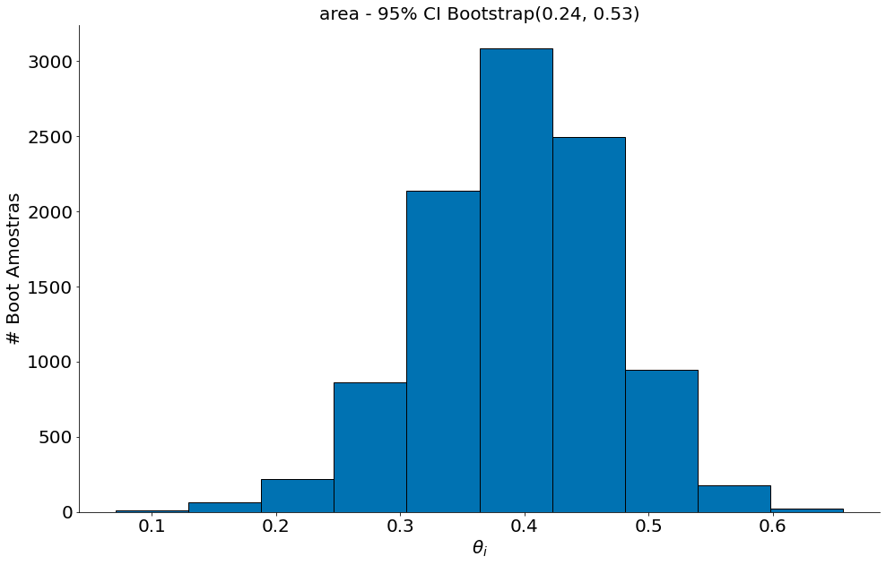
    


    
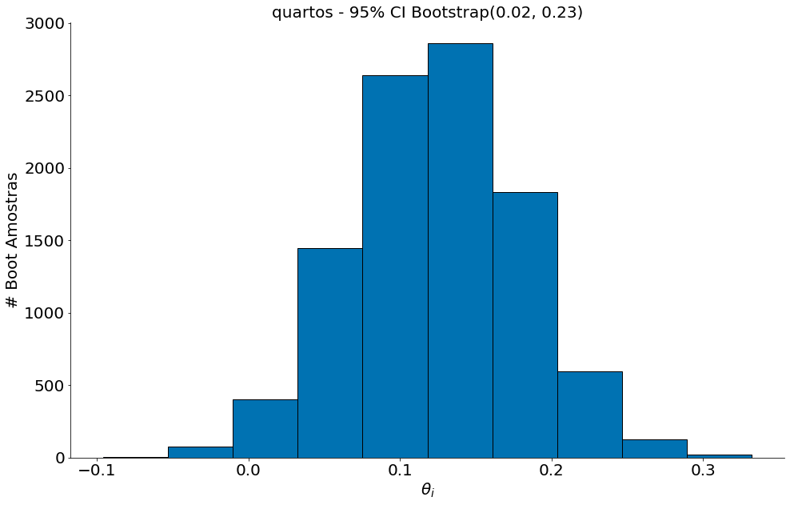
    


    
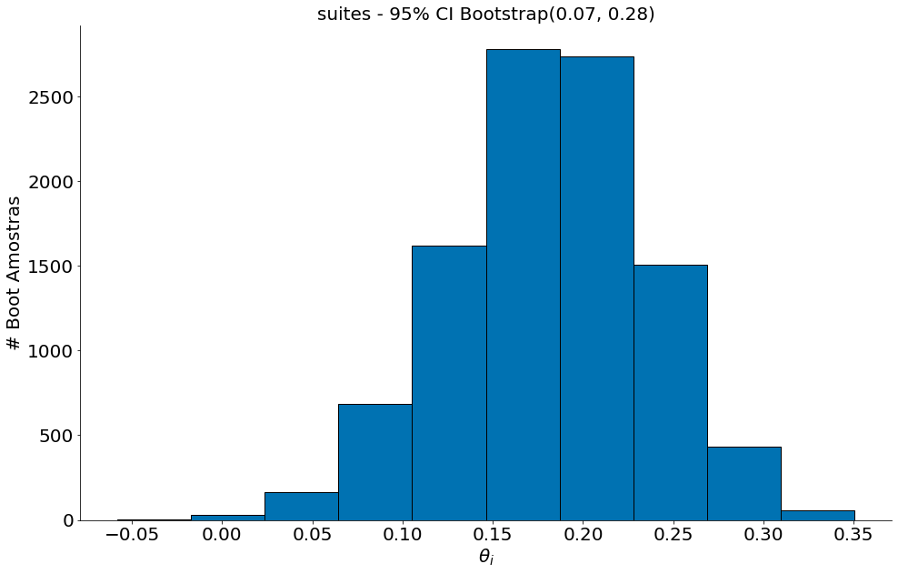
    


    
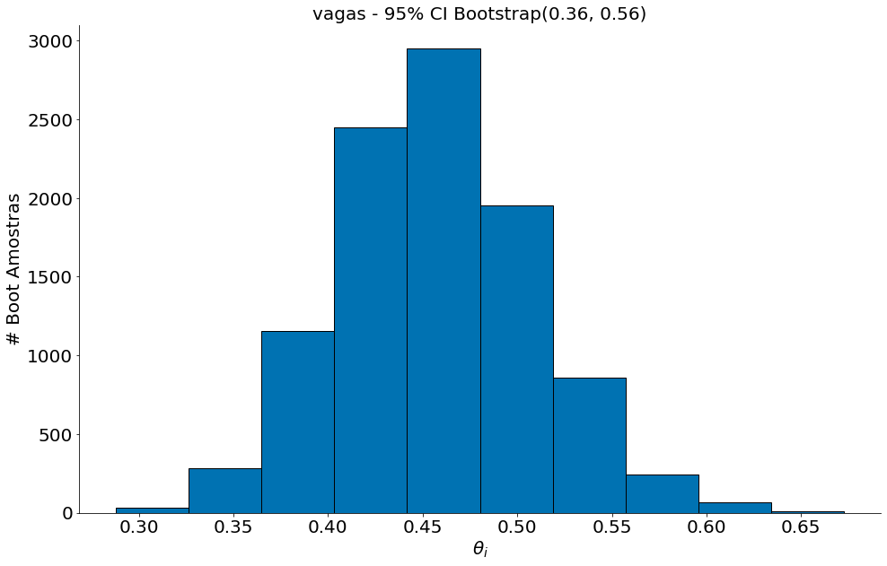
    


(2) Exemplo com a base dos carros. Aqui teremos fatores não relevantes. Procure o gráfico onde o CI do boostract contém o zero.


```python
#In: 
df = pd.read_csv('https://media.githubusercontent.com/media/icd-ufmg/material/master/aulas/19-Multipla/hybrid.csv')
df.head()
```


<div>
<style scoped>
    .dataframe tbody tr th:only-of-type {
        vertical-align: middle;
    }

    .dataframe tbody tr th {
        vertical-align: top;
    }

    .dataframe thead th {
        text-align: right;
    }
</style>
<table border="1" class="dataframe">
  <thead>
    <tr style="text-align: right;">
      <th></th>
      <th>vehicle</th>
      <th>year</th>
      <th>msrp</th>
      <th>acceleration</th>
      <th>mpg</th>
      <th>class</th>
    </tr>
  </thead>
  <tbody>
    <tr>
      <th>0</th>
      <td>Prius (1st Gen)</td>
      <td>1997</td>
      <td>24509.74</td>
      <td>7.46</td>
      <td>41.26</td>
      <td>Compact</td>
    </tr>
    <tr>
      <th>1</th>
      <td>Tino</td>
      <td>2000</td>
      <td>35354.97</td>
      <td>8.20</td>
      <td>54.10</td>
      <td>Compact</td>
    </tr>
    <tr>
      <th>2</th>
      <td>Prius (2nd Gen)</td>
      <td>2000</td>
      <td>26832.25</td>
      <td>7.97</td>
      <td>45.23</td>
      <td>Compact</td>
    </tr>
    <tr>
      <th>3</th>
      <td>Insight</td>
      <td>2000</td>
      <td>18936.41</td>
      <td>9.52</td>
      <td>53.00</td>
      <td>Two Seater</td>
    </tr>
    <tr>
      <th>4</th>
      <td>Civic (1st Gen)</td>
      <td>2001</td>
      <td>25833.38</td>
      <td>7.04</td>
      <td>47.04</td>
      <td>Compact</td>
    </tr>
  </tbody>
</table>
</div>


```python
#In: 
y = df['msrp'].values
names = ['acceleration', 'mpg', 'year']
X = df[names].values
T = bootstrap_regression(X, y)
for col in range(T.shape[1]):
    plt.hist(T[:, col], edgecolor='k')
    plt.title('{} - 95% CI Bootstrap({:.2f}, {:.2f})'.format(names[col],
                                                             np.percentile(T[:, col], 2.5),
                                                             np.percentile(T[:, col], 97.5)))
    plt.xlabel(r'$\theta_i$')
    plt.ylabel('# Boot Amostras')
    despine()
    plt.show()
```


    
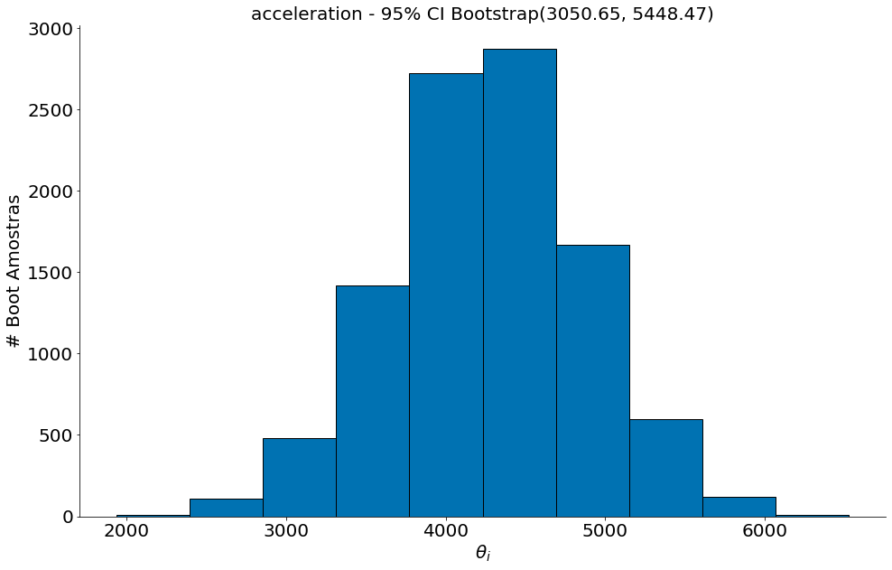
    


    
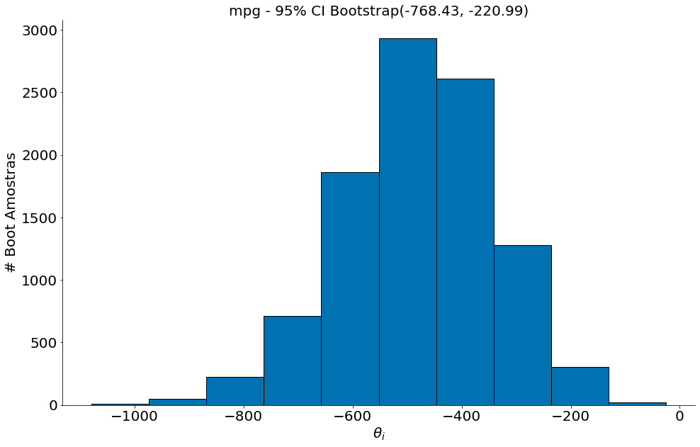
    


    
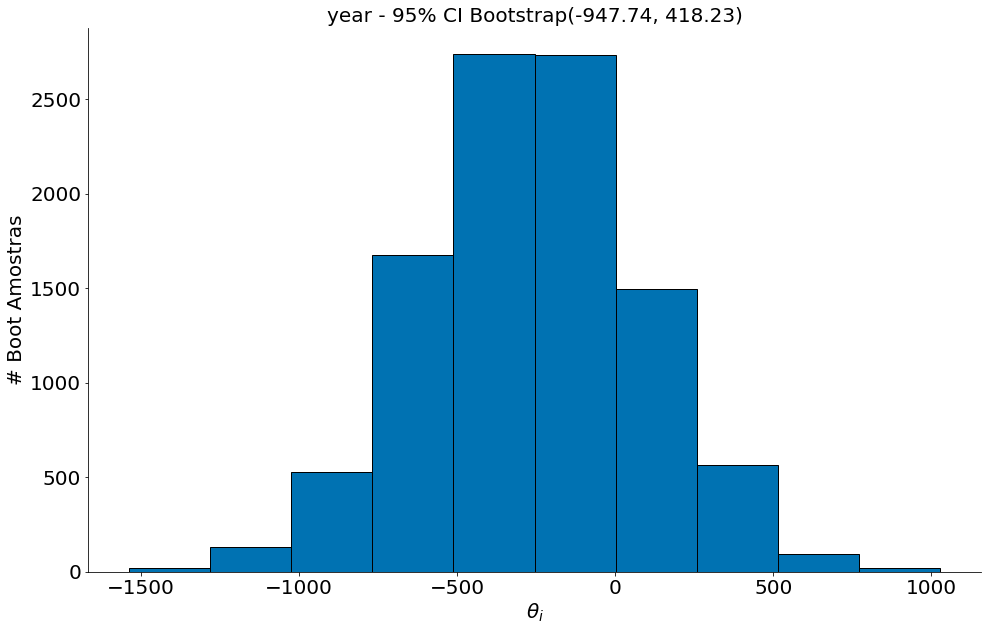
    


## Regressão Polinomial

WIP


```python
#In: 
x = np.random.randn(1000)
y = x * x + np.random.randn(1000) + 10
plt.scatter(x, y, edgecolor='k', alpha=0.6)
plt.xlabel('Random Normal X')
plt.ylabel('X * X + Random')
despine()
```


    
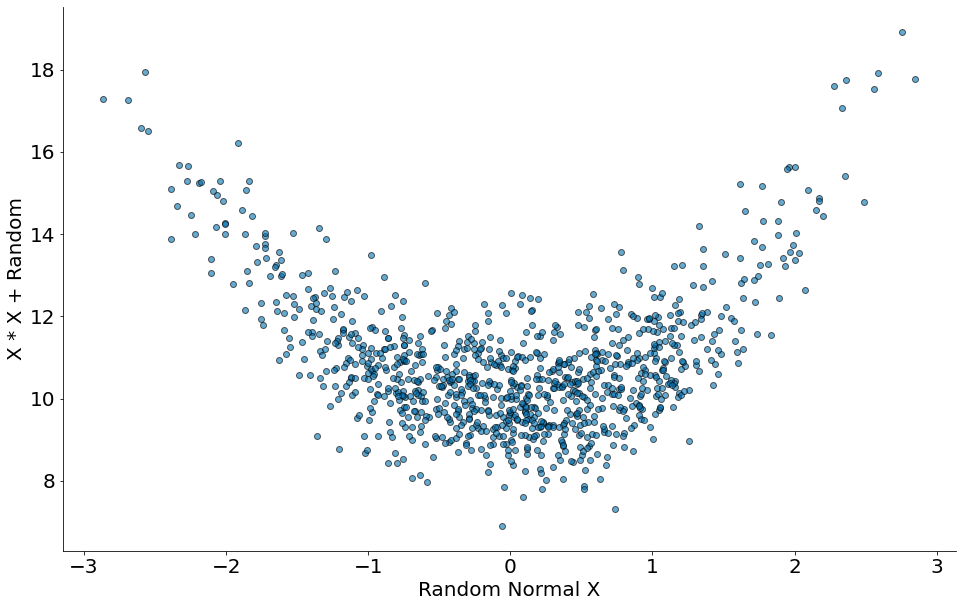
    


```python
#In: 
X = np.zeros(shape=(len(x), 2))
X[:, 0] = 1
X[:, 1] = x * x
X
```


    array([[1.        , 0.58954522],
           [1.        , 0.13122168],
           [1.        , 0.64241413],
           ...,
           [1.        , 0.57958625],
           [1.        , 0.93434325],
           [1.        , 1.20070348]])


```python
#In: 
theta = np.ones(2)
theta = gd(theta, derivadas_regressao, X, y, lambda_=0.01)
```

    Iter 0; theta =  [1. 1.]
    Iter 1; theta =  [1.17855287 1.16801526]
    Iter 2; theta =  [1.35038917 1.32431191]
    Iter 3; theta =  [1.51586263 1.46959987]
    Iter 4; theta =  [1.6753066  1.60454707]
    Iter 5; theta =  [1.82903527 1.72978191]
    Iter 6; theta =  [1.97734478 1.84589554]
    Iter 7; theta =  [2.12051426 1.95344414]
    Iter 8; theta =  [2.25880688 2.05295092]
    Iter 9; theta =  [2.39247073 2.14490807]
    Iter 10; theta =  [2.52173971 2.22977862]
    Iter 11; theta =  [2.64683441 2.30799811]
    Iter 12; theta =  [2.76796282 2.37997627]
    Iter 13; theta =  [2.88532112 2.44609849]
    Iter 14; theta =  [2.99909435 2.50672729]
    Iter 15; theta =  [3.10945704 2.56220363]
    Iter 16; theta =  [3.21657387 2.61284822]
    Iter 17; theta =  [3.32060023 2.65896271]
    Iter 18; theta =  [3.42168272 2.70083077]
    Iter 19; theta =  [3.51995972 2.73871923]
    Iter 20; theta =  [3.61556186 2.77287899]
    Iter 21; theta =  [3.70861242 2.80354601]
    Iter 22; theta =  [3.79922784 2.83094217]
    Iter 23; theta =  [3.88751806 2.85527614]
    Iter 24; theta =  [3.9735869  2.87674408]
    Iter 25; theta =  [4.05753245 2.89553047]
    Iter 26; theta =  [4.13944738 2.91180874]
    Iter 27; theta =  [4.21941925 2.92574193]
    Iter 28; theta =  [4.29753084 2.93748334]
    Iter 29; theta =  [4.37386037 2.94717704]
    Iter 30; theta =  [4.44848184 2.95495849]
    Iter 31; theta =  [4.52146519 2.960955  ]
    Iter 32; theta =  [4.59287662 2.9652862 ]
    Iter 33; theta =  [4.66277873 2.96806455]
    Iter 34; theta =  [4.73123078 2.96939573]
    Iter 35; theta =  [4.79828886 2.96937901]
    Iter 36; theta =  [4.8640061  2.96810769]
    Iter 37; theta =  [4.9284328  2.96566942]
    Iter 38; theta =  [4.99161661 2.96214654]
    Iter 39; theta =  [5.0536027  2.95761637]
    Iter 40; theta =  [5.11443388 2.95215157]
    Iter 41; theta =  [5.17415074 2.94582034]
    Iter 42; theta =  [5.2327918  2.93868674]
    Iter 43; theta =  [5.29039359 2.9308109 ]
    Iter 44; theta =  [5.34699079 2.9222493 ]
    Iter 45; theta =  [5.40261633 2.91305492]
    Iter 46; theta =  [5.45730149 2.90327749]
    Iter 47; theta =  [5.511076   2.89296369]
    Iter 48; theta =  [5.56396812 2.88215731]
    Iter 49; theta =  [5.6160047  2.87089943]
    Iter 50; theta =  [5.66721131 2.85922856]
    Iter 51; theta =  [5.71761229 2.84718083]
    Iter 52; theta =  [5.7672308  2.83479011]
    Iter 53; theta =  [5.81608892 2.82208816]
    Iter 54; theta =  [5.86420767 2.80910472]
    Iter 55; theta =  [5.91160712 2.79586767]
    Iter 56; theta =  [5.9583064  2.78240311]
    Iter 57; theta =  [6.00432377 2.7687355 ]
    Iter 58; theta =  [6.04967667 2.75488772]
    Iter 59; theta =  [6.09438176 2.7408812 ]
    Iter 60; theta =  [6.13845498 2.72673598]
    Iter 61; theta =  [6.18191156 2.7124708 ]
    Iter 62; theta =  [6.22476606 2.69810319]
    Iter 63; theta =  [6.26703247 2.68364952]
    Iter 64; theta =  [6.30872414 2.6691251 ]
    Iter 65; theta =  [6.34985389 2.65454421]
    Iter 66; theta =  [6.39043403 2.63992019]
    Iter 67; theta =  [6.43047635 2.62526548]
    Iter 68; theta =  [6.46999218 2.61059167]
    Iter 69; theta =  [6.50899242 2.59590957]
    Iter 70; theta =  [6.54748752 2.58122926]
    Iter 71; theta =  [6.58548755 2.56656009]
    Iter 72; theta =  [6.62300222 2.55191079]
    Iter 73; theta =  [6.66004085 2.53728944]
    Iter 74; theta =  [6.69661244 2.52270358]
    Iter 75; theta =  [6.73272567 2.50816016]
    Iter 76; theta =  [6.76838891 2.49366566]
    Iter 77; theta =  [6.80361024 2.47922606]
    Iter 78; theta =  [6.83839749 2.4648469 ]
    Iter 79; theta =  [6.87275818 2.45053329]
    Iter 80; theta =  [6.90669964 2.43628995]
    Iter 81; theta =  [6.94022892 2.42212123]
    Iter 82; theta =  [6.97335288 2.40803112]
    Iter 83; theta =  [7.00607815 2.39402329]
    Iter 84; theta =  [7.03841116 2.38010111]
    Iter 85; theta =  [7.07035816 2.36626765]
    Iter 86; theta =  [7.1019252 2.3525257]
    Iter 87; theta =  [7.13311817 2.33887784]
    Iter 88; theta =  [7.16394279 2.32532635]
    Iter 89; theta =  [7.19440462 2.31187335]
    Iter 90; theta =  [7.22450908 2.29852071]
    Iter 91; theta =  [7.25426143 2.28527011]
    Iter 92; theta =  [7.2836668  2.27212307]
    Iter 93; theta =  [7.31273021 2.25908091]
    Iter 94; theta =  [7.34145651 2.24614482]
    Iter 95; theta =  [7.36985047 2.23331581]
    Iter 96; theta =  [7.39791673 2.22059476]
    Iter 97; theta =  [7.42565982 2.20798244]
    Iter 98; theta =  [7.45308418 2.19547946]
    Iter 99; theta =  [7.48019412 2.18308636]
    Iter 100; theta =  [7.50699388 2.17080352]
    Iter 101; theta =  [7.5334876  2.15863128]
    Iter 102; theta =  [7.55967933 2.14656983]
    Iter 103; theta =  [7.58557303 2.13461932]
    Iter 104; theta =  [7.61117259 2.12277979]
    Iter 105; theta =  [7.63648182 2.11105121]
    Iter 106; theta =  [7.66150443 2.0994335 ]
    Iter 107; theta =  [7.6862441  2.08792648]
    Iter 108; theta =  [7.7107044  2.07652994]
    Iter 109; theta =  [7.73488886 2.06524361]
    Iter 110; theta =  [7.75880093 2.05406714]
    Iter 111; theta =  [7.78244399 2.04300017]
    Iter 112; theta =  [7.80582139 2.03204226]
    Iter 113; theta =  [7.82893639 2.02119297]
    Iter 114; theta =  [7.8517922  2.01045178]
    Iter 115; theta =  [7.87439199 1.99981816]
    Iter 116; theta =  [7.89673886 1.98929154]
    Iter 117; theta =  [7.91883587 1.97887132]
    Iter 118; theta =  [7.94068602 1.96855687]
    Iter 119; theta =  [7.96229227 1.95834755]
    Iter 120; theta =  [7.98365753 1.94824267]
    Iter 121; theta =  [8.00478466 1.93824155]
    Iter 122; theta =  [8.02567649 1.92834347]
    Iter 123; theta =  [8.04633579 1.91854769]
    Iter 124; theta =  [8.06676529 1.90885348]
    Iter 125; theta =  [8.0869677  1.89926006]
    Iter 126; theta =  [8.10694566 1.88976667]
    Iter 127; theta =  [8.12670179 1.88037253]
    Iter 128; theta =  [8.14623867 1.87107683]
    Iter 129; theta =  [8.16555885 1.86187877]
    Iter 130; theta =  [8.18466482 1.85277755]
    Iter 131; theta =  [8.20355907 1.84377235]
    Iter 132; theta =  [8.22224402 1.83486234]
    Iter 133; theta =  [8.24072208 1.82604669]
    Iter 134; theta =  [8.25899562 1.81732458]
    Iter 135; theta =  [8.27706698 1.80869518]
    Iter 136; theta =  [8.29493848 1.80015764]
    Iter 137; theta =  [8.31261237 1.79171112]
    Iter 138; theta =  [8.33009092 1.7833548 ]
    Iter 139; theta =  [8.34737635 1.77508783]
    Iter 140; theta =  [8.36447083 1.76690937]
    Iter 141; theta =  [8.38137654 1.75881858]
    Iter 142; theta =  [8.39809561 1.75081463]
    Iter 143; theta =  [8.41463015 1.74289668]
    Iter 144; theta =  [8.43098222 1.7350639 ]
    Iter 145; theta =  [8.4471539  1.72731546]
    Iter 146; theta =  [8.46314721 1.71965054]
    Iter 147; theta =  [8.47896415 1.7120683 ]
    Iter 148; theta =  [8.49460671 1.70456793]
    Iter 149; theta =  [8.51007683 1.69714862]
    Iter 150; theta =  [8.52537645 1.68980954]
    Iter 151; theta =  [8.54050748 1.6825499 ]
    Iter 152; theta =  [8.5554718  1.67536888]
    Iter 153; theta =  [8.57027127 1.6682657 ]
    Iter 154; theta =  [8.58490773 1.66123955]
    Iter 155; theta =  [8.59938301 1.65428965]
    Iter 156; theta =  [8.61369889 1.64741521]
    Iter 157; theta =  [8.62785716 1.64061545]
    Iter 158; theta =  [8.64185956 1.63388962]
    Iter 159; theta =  [8.65570783 1.62723692]
    Iter 160; theta =  [8.66940369 1.62065662]
    Iter 161; theta =  [8.68294882 1.61414794]
    Iter 162; theta =  [8.69634491 1.60771015]
    Iter 163; theta =  [8.70959359 1.60134249]
    Iter 164; theta =  [8.72269652 1.59504424]
    Iter 165; theta =  [8.7356553  1.58881466]
    Iter 166; theta =  [8.74847153 1.58265302]
    Iter 167; theta =  [8.76114679 1.57655861]
    Iter 168; theta =  [8.77368265 1.57053072]
    Iter 169; theta =  [8.78608064 1.56456864]
    Iter 170; theta =  [8.79834228 1.55867166]
    Iter 171; theta =  [8.8104691 1.5528391]
    Iter 172; theta =  [8.82246257 1.54707027]
    Iter 173; theta =  [8.83432418 1.54136449]
    Iter 174; theta =  [8.84605538 1.53572109]
    Iter 175; theta =  [8.8576576  1.53013939]
    Iter 176; theta =  [8.86913228 1.52461873]
    Iter 177; theta =  [8.88048082 1.51915847]
    Iter 178; theta =  [8.89170461 1.51375794]
    Iter 179; theta =  [8.90280504 1.50841652]
    Iter 180; theta =  [8.91378345 1.50313355]
    Iter 181; theta =  [8.92464121 1.49790842]
    Iter 182; theta =  [8.93537963 1.49274049]
    Iter 183; theta =  [8.94600003 1.48762915]
    Iter 184; theta =  [8.95650372 1.48257379]
    Iter 185; theta =  [8.96689198 1.47757381]
    Iter 186; theta =  [8.97716608 1.47262859]
    Iter 187; theta =  [8.98732728 1.46773756]
    Iter 188; theta =  [8.99737682 1.46290011]
    Iter 189; theta =  [9.00731594 1.45811568]
    Iter 190; theta =  [9.01714585 1.45338369]
    Iter 191; theta =  [9.02686775 1.44870356]
    Iter 192; theta =  [9.03648283 1.44407473]
    Iter 193; theta =  [9.04599227 1.43949665]
    Iter 194; theta =  [9.05539723 1.43496876]
    Iter 195; theta =  [9.06469886 1.43049052]
    Iter 196; theta =  [9.07389829 1.42606138]
    Iter 197; theta =  [9.08299666 1.42168082]
    Iter 198; theta =  [9.09199507 1.4173483 ]
    Iter 199; theta =  [9.10089463 1.41306329]
    Iter 200; theta =  [9.10969641 1.40882529]
    Iter 201; theta =  [9.1184015  1.40463378]
    Iter 202; theta =  [9.12701097 1.40048825]
    Iter 203; theta =  [9.13552585 1.39638819]
    Iter 204; theta =  [9.14394719 1.39233312]
    Iter 205; theta =  [9.15227603 1.38832254]
    Iter 206; theta =  [9.16051337 1.38435596]
    Iter 207; theta =  [9.16866023 1.38043291]
    Iter 208; theta =  [9.17671759 1.37655291]
    Iter 209; theta =  [9.18468645 1.37271548]
    Iter 210; theta =  [9.19256777 1.36892017]
    Iter 211; theta =  [9.20036252 1.36516651]
    Iter 212; theta =  [9.20807166 1.36145404]
    Iter 213; theta =  [9.21569611 1.35778232]
    Iter 214; theta =  [9.22323681 1.3541509 ]
    Iter 215; theta =  [9.23069468 1.35055934]
    Iter 216; theta =  [9.23807064 1.3470072 ]
    Iter 217; theta =  [9.24536558 1.34349405]
    Iter 218; theta =  [9.25258039 1.34001946]
    Iter 219; theta =  [9.25971595 1.33658302]
    Iter 220; theta =  [9.26677314 1.3331843 ]
    Iter 221; theta =  [9.27375282 1.32982289]
    Iter 222; theta =  [9.28065583 1.32649838]
    Iter 223; theta =  [9.28748302 1.32321036]
    Iter 224; theta =  [9.29423522 1.31995845]
    Iter 225; theta =  [9.30091327 1.31674223]
    Iter 226; theta =  [9.30751796 1.31356133]
    Iter 227; theta =  [9.31405011 1.31041534]
    Iter 228; theta =  [9.32051052 1.3073039 ]
    Iter 229; theta =  [9.32689996 1.30422662]
    Iter 230; theta =  [9.33321924 1.30118313]
    Iter 231; theta =  [9.3394691  1.29817305]
    Iter 232; theta =  [9.34565032 1.29519602]
    Iter 233; theta =  [9.35176365 1.29225168]
    Iter 234; theta =  [9.35780984 1.28933967]
    Iter 235; theta =  [9.36378962 1.28645964]
    Iter 236; theta =  [9.36970372 1.28361122]
    Iter 237; theta =  [9.37555287 1.28079409]
    Iter 238; theta =  [9.38133778 1.27800789]
    Iter 239; theta =  [9.38705915 1.27525228]
    Iter 240; theta =  [9.39271768 1.27252693]
    Iter 241; theta =  [9.39831407 1.2698315 ]
    Iter 242; theta =  [9.40384898 1.26716568]
    Iter 243; theta =  [9.40932311 1.26452913]
    Iter 244; theta =  [9.41473712 1.26192153]
    Iter 245; theta =  [9.42009167 1.25934256]
    Iter 246; theta =  [9.4253874  1.25679191]
    Iter 247; theta =  [9.43062498 1.25426928]
    Iter 248; theta =  [9.43580503 1.25177434]
    Iter 249; theta =  [9.44092819 1.24930681]
    Iter 250; theta =  [9.44599508 1.24686637]
    Iter 251; theta =  [9.45100632 1.24445273]
    Iter 252; theta =  [9.45596252 1.24206559]
    Iter 253; theta =  [9.4608643  1.23970467]
    Iter 254; theta =  [9.46571223 1.23736968]
    Iter 255; theta =  [9.47050692 1.23506033]
    Iter 256; theta =  [9.47524896 1.23277634]
    Iter 257; theta =  [9.47993891 1.23051743]
    Iter 258; theta =  [9.48457735 1.22828333]
    Iter 259; theta =  [9.48916485 1.22607376]
    Iter 260; theta =  [9.49370197 1.22388846]
    Iter 261; theta =  [9.49818926 1.22172716]
    Iter 262; theta =  [9.50262726 1.21958959]
    Iter 263; theta =  [9.50701652 1.2174755 ]
    Iter 264; theta =  [9.51135758 1.21538462]
    Iter 265; theta =  [9.51565096 1.21331671]
    Iter 266; theta =  [9.51989719 1.21127151]
    Iter 267; theta =  [9.52409678 1.20924877]
    Iter 268; theta =  [9.52825025 1.20724824]
    Iter 269; theta =  [9.5323581  1.20526968]
    Iter 270; theta =  [9.53642084 1.20331285]
    Iter 271; theta =  [9.54043895 1.20137751]
    Iter 272; theta =  [9.54441294 1.19946342]
    Iter 273; theta =  [9.54834328 1.19757036]
    Iter 274; theta =  [9.55223046 1.19569809]
    Iter 275; theta =  [9.55607494 1.19384637]
    Iter 276; theta =  [9.55987721 1.192015  ]
    Iter 277; theta =  [9.56363771 1.19020374]
    Iter 278; theta =  [9.56735691 1.18841236]
    Iter 279; theta =  [9.57103527 1.18664067]
    Iter 280; theta =  [9.57467323 1.18488843]
    Iter 281; theta =  [9.57827123 1.18315543]
    Iter 282; theta =  [9.58182972 1.18144146]
    Iter 283; theta =  [9.58534912 1.17974632]
    Iter 284; theta =  [9.58882988 1.1780698 ]
    Iter 285; theta =  [9.5922724  1.17641169]
    Iter 286; theta =  [9.59567712 1.17477178]
    Iter 287; theta =  [9.59904444 1.17314989]
    Iter 288; theta =  [9.60237479 1.17154581]
    Iter 289; theta =  [9.60566855 1.16995935]
    Iter 290; theta =  [9.60892615 1.16839031]
    Iter 291; theta =  [9.61214796 1.1668385 ]
    Iter 292; theta =  [9.61533439 1.16530374]
    Iter 293; theta =  [9.61848583 1.16378583]
    Iter 294; theta =  [9.62160265 1.16228459]
    Iter 295; theta =  [9.62468525 1.16079984]
    Iter 296; theta =  [9.62773399 1.15933139]
    Iter 297; theta =  [9.63074924 1.15787907]
    Iter 298; theta =  [9.63373138 1.1564427 ]
    Iter 299; theta =  [9.63668077 1.15502211]
    Iter 300; theta =  [9.63959777 1.15361712]
    Iter 301; theta =  [9.64248273 1.15222756]
    Iter 302; theta =  [9.645336   1.15085326]
    Iter 303; theta =  [9.64815794 1.14949405]
    Iter 304; theta =  [9.65094889 1.14814977]
    Iter 305; theta =  [9.65370918 1.14682026]
    Iter 306; theta =  [9.65643916 1.14550534]
    Iter 307; theta =  [9.65913916 1.14420487]
    Iter 308; theta =  [9.66180951 1.14291868]
    Iter 309; theta =  [9.66445052 1.14164661]
    Iter 310; theta =  [9.66706253 1.14038852]
    Iter 311; theta =  [9.66964586 1.13914424]
    Iter 312; theta =  [9.67220081 1.13791363]
    Iter 313; theta =  [9.67472771 1.13669653]
    Iter 314; theta =  [9.67722685 1.1354928 ]
    Iter 315; theta =  [9.67969854 1.13430229]
    Iter 316; theta =  [9.68214309 1.13312485]
    Iter 317; theta =  [9.68456079 1.13196035]
    Iter 318; theta =  [9.68695194 1.13080863]
    Iter 319; theta =  [9.68931683 1.12966957]
    Iter 320; theta =  [9.69165574 1.12854301]
    Iter 321; theta =  [9.69396897 1.12742883]
    Iter 322; theta =  [9.69625679 1.12632688]
    Iter 323; theta =  [9.69851949 1.12523704]
    Iter 324; theta =  [9.70075733 1.12415916]
    Iter 325; theta =  [9.7029706  1.12309312]
    Iter 326; theta =  [9.70515956 1.12203879]
    Iter 327; theta =  [9.70732448 1.12099604]
    Iter 328; theta =  [9.70946562 1.11996474]
    Iter 329; theta =  [9.71158325 1.11894477]
    Iter 330; theta =  [9.71367762 1.117936  ]
    Iter 331; theta =  [9.71574899 1.11693831]
    Iter 332; theta =  [9.71779761 1.11595158]
    Iter 333; theta =  [9.71982373 1.11497568]
    Iter 334; theta =  [9.7218276 1.1140105]
    Iter 335; theta =  [9.72380946 1.11305592]
    Iter 336; theta =  [9.72576956 1.11211182]
    Iter 337; theta =  [9.72770813 1.1111781 ]
    Iter 338; theta =  [9.7296254  1.11025463]
    Iter 339; theta =  [9.73152163 1.1093413 ]
    Iter 340; theta =  [9.73339702 1.108438  ]
    Iter 341; theta =  [9.73525182 1.10754462]
    Iter 342; theta =  [9.73708625 1.10666105]
    Iter 343; theta =  [9.73890053 1.10578719]
    Iter 344; theta =  [9.74069489 1.10492292]
    Iter 345; theta =  [9.74246953 1.10406815]
    Iter 346; theta =  [9.74422469 1.10322276]
    Iter 347; theta =  [9.74596058 1.10238666]
    Iter 348; theta =  [9.74767739 1.10155974]
    Iter 349; theta =  [9.74937536 1.1007419 ]
    Iter 350; theta =  [9.75105467 1.09993305]
    Iter 351; theta =  [9.75271554 1.09913307]
    Iter 352; theta =  [9.75435818 1.09834189]
    Iter 353; theta =  [9.75598277 1.09755939]
    Iter 354; theta =  [9.75758951 1.09678549]
    Iter 355; theta =  [9.75917862 1.09602008]
    Iter 356; theta =  [9.76075027 1.09526309]
    Iter 357; theta =  [9.76230466 1.0945144 ]
    Iter 358; theta =  [9.76384197 1.09377394]
    Iter 359; theta =  [9.76536241 1.09304161]
    Iter 360; theta =  [9.76686614 1.09231733]
    Iter 361; theta =  [9.76835336 1.09160099]
    Iter 362; theta =  [9.76982425 1.09089253]
    Iter 363; theta =  [9.77127898 1.09019185]
    Iter 364; theta =  [9.77271774 1.08949886]
    Iter 365; theta =  [9.77414069 1.08881348]
    Iter 366; theta =  [9.77554802 1.08813563]
    Iter 367; theta =  [9.77693989 1.08746522]
    Iter 368; theta =  [9.77831648 1.08680218]
    Iter 369; theta =  [9.77967794 1.08614642]
    Iter 370; theta =  [9.78102446 1.08549786]
    Iter 371; theta =  [9.78235618 1.08485642]
    Iter 372; theta =  [9.78367328 1.08422203]
    Iter 373; theta =  [9.78497591 1.08359461]
    Iter 374; theta =  [9.78626424 1.08297407]
    Iter 375; theta =  [9.78753842 1.08236035]
    Iter 376; theta =  [9.78879861 1.08175338]
    Iter 377; theta =  [9.79004495 1.08115306]
    Iter 378; theta =  [9.79127761 1.08055935]
    Iter 379; theta =  [9.79249673 1.07997215]
    Iter 380; theta =  [9.79370246 1.0793914 ]
    Iter 381; theta =  [9.79489494 1.07881703]
    Iter 382; theta =  [9.79607434 1.07824896]
    Iter 383; theta =  [9.79724077 1.07768714]
    Iter 384; theta =  [9.7983944  1.07713148]
    Iter 385; theta =  [9.79953536 1.07658193]
    Iter 386; theta =  [9.80066379 1.07603842]
    Iter 387; theta =  [9.80177982 1.07550087]
    Iter 388; theta =  [9.8028836  1.07496923]
    Iter 389; theta =  [9.80397525 1.07444342]
    Iter 390; theta =  [9.80505492 1.07392339]
    Iter 391; theta =  [9.80612273 1.07340907]
    Iter 392; theta =  [9.80717881 1.0729004 ]
    Iter 393; theta =  [9.80822329 1.07239732]
    Iter 394; theta =  [9.8092563  1.07189976]
    Iter 395; theta =  [9.81027797 1.07140767]
    Iter 396; theta =  [9.81128841 1.07092098]
    Iter 397; theta =  [9.81228776 1.07043963]
    Iter 398; theta =  [9.81327613 1.06996358]
    Iter 399; theta =  [9.81425365 1.06949275]
    Iter 400; theta =  [9.81522043 1.06902709]
    Iter 401; theta =  [9.8161766  1.06856654]
    Iter 402; theta =  [9.81712226 1.06811106]
    Iter 403; theta =  [9.81805754 1.06766057]
    Iter 404; theta =  [9.81898255 1.06721504]
    Iter 405; theta =  [9.81989739 1.06677439]
    Iter 406; theta =  [9.82080219 1.06633859]
    Iter 407; theta =  [9.82169705 1.06590757]
    Iter 408; theta =  [9.82258209 1.06548129]
    Iter 409; theta =  [9.8234574  1.06505969]
    Iter 410; theta =  [9.8243231  1.06464272]
    Iter 411; theta =  [9.8251793  1.06423032]
    Iter 412; theta =  [9.82602609 1.06382246]
    Iter 413; theta =  [9.82686358 1.06341908]
    Iter 414; theta =  [9.82769187 1.06302012]
    Iter 415; theta =  [9.82851106 1.06262555]
    Iter 416; theta =  [9.82932126 1.06223531]
    Iter 417; theta =  [9.83012256 1.06184936]
    Iter 418; theta =  [9.83091506 1.06146764]
    Iter 419; theta =  [9.83169886 1.06109012]
    Iter 420; theta =  [9.83247405 1.06071675]
    Iter 421; theta =  [9.83324072 1.06034747]
    Iter 422; theta =  [9.83399898 1.05998225]
    Iter 423; theta =  [9.8347489  1.05962104]
    Iter 424; theta =  [9.83549059 1.0592638 ]
    Iter 425; theta =  [9.83622414 1.05891048]
    Iter 426; theta =  [9.83694963 1.05856105]
    Iter 427; theta =  [9.83766715 1.05821545]
    Iter 428; theta =  [9.83837679 1.05787364]
    Iter 429; theta =  [9.83907864 1.05753559]
    Iter 430; theta =  [9.83977278 1.05720125]
    Iter 431; theta =  [9.84045929 1.05687059]
    Iter 432; theta =  [9.84113827 1.05654355]
    Iter 433; theta =  [9.84180979 1.05622011]
    Iter 434; theta =  [9.84247393 1.05590022]
    Iter 435; theta =  [9.84313078 1.05558384]
    Iter 436; theta =  [9.84378042 1.05527094]
    Iter 437; theta =  [9.84442292 1.05496148]
    Iter 438; theta =  [9.84505836 1.05465541]
    Iter 439; theta =  [9.84568683 1.0543527 ]
    Iter 440; theta =  [9.84630839 1.05405332]
    Iter 441; theta =  [9.84692313 1.05375723]
    Iter 442; theta =  [9.84753112 1.05346439]
    Iter 443; theta =  [9.84813242 1.05317476]
    Iter 444; theta =  [9.84872713 1.05288832]
    Iter 445; theta =  [9.8493153  1.05260502]
    Iter 446; theta =  [9.84989702 1.05232483]
    Iter 447; theta =  [9.85047234 1.05204772]
    Iter 448; theta =  [9.85104135 1.05177365]
    Iter 449; theta =  [9.85160411 1.0515026 ]
    Iter 450; theta =  [9.85216068 1.05123452]
    Iter 451; theta =  [9.85271115 1.05096938]
    Iter 452; theta =  [9.85325556 1.05070716]
    Iter 453; theta =  [9.853794   1.05044782]
    Iter 454; theta =  [9.85432653 1.05019132]
    Iter 455; theta =  [9.85485321 1.04993764]
    Iter 456; theta =  [9.8553741  1.04968675]
    Iter 457; theta =  [9.85588927 1.04943861]
    Iter 458; theta =  [9.85639879 1.0491932 ]
    Iter 459; theta =  [9.85690271 1.04895048]
    Iter 460; theta =  [9.85740109 1.04871043]
    Iter 461; theta =  [9.857894   1.04847302]
    Iter 462; theta =  [9.8583815  1.04823821]
    Iter 463; theta =  [9.85886364 1.04800598]
    Iter 464; theta =  [9.85934049 1.04777631]
    Iter 465; theta =  [9.8598121  1.04754915]
    Iter 466; theta =  [9.86027853 1.04732449]
    Iter 467; theta =  [9.86073984 1.0471023 ]
    Iter 468; theta =  [9.86119608 1.04688254]
    Iter 469; theta =  [9.86164732 1.0466652 ]
    Iter 470; theta =  [9.86209359 1.04645025]
    Iter 471; theta =  [9.86253497 1.04623766]
    Iter 472; theta =  [9.86297149 1.0460274 ]
    Iter 473; theta =  [9.86340323 1.04581946]
    Iter 474; theta =  [9.86383022 1.04561379]
    Iter 475; theta =  [9.86425252 1.04541039]
    Iter 476; theta =  [9.86467018 1.04520921]
    Iter 477; theta =  [9.86508326 1.04501025]
    Iter 478; theta =  [9.8654918  1.04481348]
    Iter 479; theta =  [9.86589586 1.04461886]
    Iter 480; theta =  [9.86629547 1.04442638]
    Iter 481; theta =  [9.8666907  1.04423602]
    Iter 482; theta =  [9.86708159 1.04404774]
    Iter 483; theta =  [9.86746818 1.04386154]
    Iter 484; theta =  [9.86785053 1.04367738]
    Iter 485; theta =  [9.86822868 1.04349524]
    Iter 486; theta =  [9.86860267 1.0433151 ]
    Iter 487; theta =  [9.86897256 1.04313694]
    Iter 488; theta =  [9.86933839 1.04296074]
    Iter 489; theta =  [9.86970019 1.04278647]
    Iter 490; theta =  [9.87005803 1.04261412]
    Iter 491; theta =  [9.87041193 1.04244366]
    Iter 492; theta =  [9.87076195 1.04227507]
    Iter 493; theta =  [9.87110812 1.04210833]
    Iter 494; theta =  [9.8714505  1.04194342]
    Iter 495; theta =  [9.87178911 1.04178033]
    Iter 496; theta =  [9.872124   1.04161902]
    Iter 497; theta =  [9.87245522 1.04145949]
    Iter 498; theta =  [9.87278279 1.04130171]
    Iter 499; theta =  [9.87310677 1.04114566]
    Iter 500; theta =  [9.87342719 1.04099133]
    Iter 501; theta =  [9.8737441  1.04083869]
    Iter 502; theta =  [9.87405752 1.04068773]
    Iter 503; theta =  [9.8743675  1.04053843]
    Iter 504; theta =  [9.87467407 1.04039076]
    Iter 505; theta =  [9.87497728 1.04024472]
    Iter 506; theta =  [9.87527716 1.04010028]
    Iter 507; theta =  [9.87557374 1.03995743]
    Iter 508; theta =  [9.87586707 1.03981614]
    Iter 509; theta =  [9.87615718 1.03967641]
    Iter 510; theta =  [9.8764441  1.03953821]
    Iter 511; theta =  [9.87672787 1.03940153]


```python
#In: 
plt.scatter(x, y, edgecolor='k', alpha=0.6)
plt.scatter(x, X @ theta)
plt.xlabel('Random Normal X')
plt.ylabel('X * X + Random')
```


    Text(0, 0.5, 'X * X + Random')


    
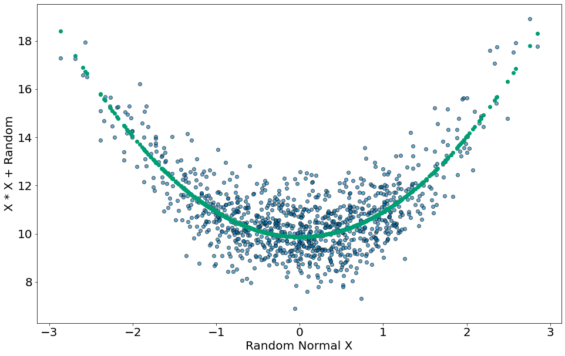
    


```python
#In: 

```
