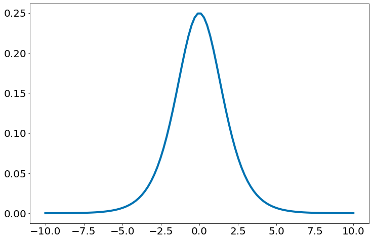

[](https://colab.research.google.com/github/icd-ufmg/icd-ufmg.github.io/blob/master/_lessons/19-logistica.ipynb)


# Regressão Logística

{: .no_toc .mb-2 }

Entendendo a regressão logística do zero!
{: .fs-6 .fw-300 }

{: .no_toc .text-delta }
Resultados Esperados

1. Entender classificação de dados
1. Saber usar e Entender a Logística.

---
**Sumário**
1. TOC
{:toc}
---


```python
#In: 
# -*- coding: utf8

from scipy import stats as ss
from sklearn import datasets

import seaborn as sns
import numpy as np
import matplotlib.pyplot as plt
import pandas as pd

plt.rcParams['figure.figsize']  = (18, 10)
plt.rcParams['axes.labelsize']  = 20
plt.rcParams['axes.titlesize']  = 20
plt.rcParams['legend.fontsize'] = 20
plt.rcParams['xtick.labelsize'] = 20
plt.rcParams['ytick.labelsize'] = 20
plt.rcParams['lines.linewidth'] = 4
```


```python
#In: 
plt.ion()
plt.style.use('seaborn-colorblind')
plt.rcParams['figure.figsize']  = (12, 8)
```


```python
#In: 
def despine(ax=None):
    if ax is None:
        ax = plt.gca()
    # Hide the right and top spines
    ax.spines['right'].set_visible(False)
    ax.spines['top'].set_visible(False)

    # Only show ticks on the left and bottom spines
    ax.yaxis.set_ticks_position('left')
    ax.xaxis.set_ticks_position('bottom')
```

## Regressão Logística

Abaixo, temos um conjunto de dados anônimos de aproximadamente 284 lances do jogador Lebron James. Como é comum em variáveis categóricas, representamos a variável dependente como 0 (errou a cesta) ou 1 (acertou a cesta). Esta será a nossa resposta que queremos prever. 


```python
#In: 
df = pd.read_csv('https://media.githubusercontent.com/media/icd-ufmg/material/master/aulas/21-Logistica/lebron.csv')
df.head()
```


<div>
<style scoped>
    .dataframe tbody tr th:only-of-type {
        vertical-align: middle;
    }

    .dataframe tbody tr th {
        vertical-align: top;
    }

    .dataframe thead th {
        text-align: right;
    }
</style>
<table border="1" class="dataframe">
  <thead>
    <tr style="text-align: right;">
      <th></th>
      <th>game_date</th>
      <th>minute</th>
      <th>opponent</th>
      <th>action_type</th>
      <th>shot_type</th>
      <th>shot_distance</th>
      <th>shot_made</th>
    </tr>
  </thead>
  <tbody>
    <tr>
      <th>0</th>
      <td>20170415</td>
      <td>10</td>
      <td>IND</td>
      <td>Driving Layup Shot</td>
      <td>2PT Field Goal</td>
      <td>0</td>
      <td>0</td>
    </tr>
    <tr>
      <th>1</th>
      <td>20170415</td>
      <td>11</td>
      <td>IND</td>
      <td>Driving Layup Shot</td>
      <td>2PT Field Goal</td>
      <td>0</td>
      <td>1</td>
    </tr>
    <tr>
      <th>2</th>
      <td>20170415</td>
      <td>14</td>
      <td>IND</td>
      <td>Layup Shot</td>
      <td>2PT Field Goal</td>
      <td>0</td>
      <td>1</td>
    </tr>
    <tr>
      <th>3</th>
      <td>20170415</td>
      <td>15</td>
      <td>IND</td>
      <td>Driving Layup Shot</td>
      <td>2PT Field Goal</td>
      <td>0</td>
      <td>1</td>
    </tr>
    <tr>
      <th>4</th>
      <td>20170415</td>
      <td>18</td>
      <td>IND</td>
      <td>Alley Oop Dunk Shot</td>
      <td>2PT Field Goal</td>
      <td>0</td>
      <td>1</td>
    </tr>
  </tbody>
</table>
</div>


```python
#In: 
df.shape
```


    (384, 7)


Vamos iniciar observando a quantidade de acertos por distância da cesta.


```python
#In: 
n = df.shape[0]
plt.scatter(df['shot_distance'],
            df['shot_made'],
            s=80, alpha=0.8, edgecolors='k')
plt.xlabel('Distância (feet)')
plt.ylabel('Cesta? (1=sim; 0=não)')
despine()
```


    

    


Adicionando algum ruído para melhorar o plot. Observe como os dados se concentram do lado esquerdo.


```python
#In: 
n = df.shape[0]
plt.scatter(df['shot_distance'] + np.random.normal(0, 0.05, size=n),
            df['shot_made'] + np.random.normal(0, 0.05, size=n),
            s=80, alpha=0.8, edgecolors='k')
plt.xlabel('Distância (feet)')
plt.ylabel('Cesta? (1=sim; 0=não) + Ruído.')
despine()
```


    

    


Como identificar quando Lebron acerta ou erra? Uma primeira tentativa óbvia é usar regressão linear e encontrar o melhor modelo. Observe como a mesma tenta capturar os locais de maior concentração de pontos.


```python
#In: 
sns.regplot(x='shot_distance', y='shot_made', data=df, n_boot=10000,
            x_jitter=.1, y_jitter=.1,
            line_kws={'color':'magenta', 'lw':4},
            scatter_kws={'edgecolor':'k', 's':80, 'alpha':0.8})
plt.xlabel('Distância (feet)')
plt.ylabel('Cesta? (1=sim; 0=não)')
despine()
```


    

    


O resultado é uma curva com inclinação negativa.


```python
#In: 
ss.linregress(df['shot_distance'], df['shot_made'])
```


    LinregressResult(slope=-0.01405519658334979, intercept=0.715428886374525, rvalue=-0.2986530102053083, pvalue=2.3711855177639454e-09, stderr=0.0022980071639352555, intercept_stderr=0.03449702671924952)


Mas essa abordagem leva a alguns problemas imediatos:

* Gostaríamos que nossos resultados previstos fossem 0 ou 1. Tudo bem se eles estiverem entre 0 e 1, já que podemos interpretá-los como probabilidades - uma saída de 0,25 pode significar 25% de chance de ser um membro que paga. Mas as saídas do modelo linear podem ser números positivos enormes ou até números negativos, o que não fica claro como interpretar.

* O que gostaríamos, ao contrário, é que valores positivos grandes de $\mathbf{x_i}~ . \mathbf{\theta}$ (ou `np.dot(x_i,theta)`) correspondam a probabilidades próximas a 1 e que valores negativos grandes correspondam a probabilidades próximas a 0. Podemos conseguir isso aplicando outra função ao resultado.

## A Função Logística

No caso da regressão logística, a gente usa a função logística:


```python
#In: 
def sigmoid(X, theta):
    return 1.0 / (1.0 + np.exp(-X.dot(theta)))
```

À medida que sua entrada se torna grande e positiva, ela se aproxima e se aproxima de 1. À medida que sua entrada se torna grande e negativa, ela se aproxima e se aproxima de 0. Além disso, ela tem a propriedade conveniente que sua derivada é dada por:


```python
#In: 
X = np.linspace(-10, 10, 100)[:, None] # vira um vetor coluna
y = sigmoid(X, theta=np.array([1]))
plt.plot(X, y)
despine()
```


    

    


A medida que sua entrada se torna grande e positiva, ela se aproxima e se aproxima de 1. À medida que sua entrada se torna grande e negativa, ela se aproxima e se aproxima de 0. Podemos inverter a mesma alterando o valor de theta.


```python
#In: 
X = np.linspace(-10, 10, 100)[:, None] # vira um vetor coluna
y = sigmoid(X, theta=np.array([-1]))
plt.plot(X, y)
despine()
```


    

    


Além disso, ela tem a propriedade conveniente que sua derivada é dada por:


```python
#In: 
def logistic_prime(X, theta):
    return sigmoid(X, theta) * (1 - sigmoid(X, theta))
```

Oberseve a derivada em cada ponto.


```python
#In: 
plt.plot(X, logistic_prime(X, np.array([1])))
```


    [<matplotlib.lines.Line2D at 0x7f3bca802770>]


    

    


Daqui a pouco vamos usar a mesma para ajustar um modelo:

$$y_i = f(x_i\theta) + \epsilon_i$$

onde $f$ é a função logística (`logistic`).

Note também que $x_i\theta$, para $j$ variáveis independentes, nada mais é que o modelo linear visto nas aulas anteriores, que é calculado e dado como entrada para a função logística:

$$x_i\theta = \theta_0 + \theta_1 x_1 + \cdots + \theta_j x_j$$

Lembre-se de que, para a regressão linear, ajustamos o modelo minimizando a soma dos erros quadrados, o que acaba escolhendo o $\theta$ que maximiza a probabilidade dos dados.

Aqui os dois não são equivalentes, por isso usaremos gradiente descendente para maximizar a verossimilhança diretamente. Isso significa que precisamos calcular a função de verossimilhança e seu gradiente.

Dado algum $\theta$, nosso modelo diz que cada $y_i$ deve ser igual a 1 com probabilidade $f(x_i\theta)$ e 0 com probabilidade $1 - f(x_i\theta)$.

Em particular, a PDF para $y_i$ pode ser escrita como:

$$p(y_i~|~x_i,\theta) = f(x_i\theta)^{y_i}(1-f(x_i\theta))^{1-y_i}$$

Se $y_i$ é $0$, isso é igual a:

$$1-f(x_i\theta)$$

e se $y_i$ é $1$, é igual a:

$$f(x_i\theta)$$

Acontece que é realmente mais simples maximizar o logaritmo da verossimilhança (*log likelihood*):

$$\log ll_{\theta}(y_i~|~x_i) = y_i \log f(x_i\theta) + (1-y_i) \log (1-f(x_i\theta))$$

Como o logaritmo é uma função estritamente crescente, qualquer $\theta$ que maximize o logaritmo da verossimilhança também maximiza a verossimilhança, e vice-versa.

## Cross Entropy

Ao invés de trabalhar na verossimilhança, vamos inverter a mesma (negar). Esta é a definição de cross entropy para a regressão logística. Nos slides da aula derivamos a equivalência entre as duas. [Slides](https://docs.google.com/presentation/d/1yGPETPe8o7PPOP6_CF38LHr3vpxgTEnF5LjP-1pkGIc/edit?usp=sharing).

$$L(\theta) = -n^{-1}\sum_i \big((1-y_i)\log_2(1-f_{\theta}(x_i)) + y_i\log_2(f_{\theta}(x_i))\big)$$

A equação acima é a cross-entropy média por observação.


```python
#In: 
def cross_entropy_one_sample(x_i, y_i, theta):
    # também podemos escrever y_i * np.log(sigmoid(np.dot(x_i, beta)))
    if y_i == 1:
        return -np.log(sigmoid(np.dot(x_i, theta)))
    else:
        return -np.log(1 - sigmoid(np.dot(x_i, theta)))
```

O clip abaixo limita os valores para 0.0001 e 0.9999, evita imprecisões numéricas. Ou seja, se o vetor tiver um valor 1.01 por erro numérico, corrigimos para 0.9999.


```python
#In: 
def cross_entropy_mean(X, y, theta):
    yp = y > 0.5
    logit = sigmoid(X, theta)
    logit = np.clip(logit, 0.00001, 0.99999)
    return -(yp * np.log(logit) + (1 - yp) * np.log(1 - logit)).mean()
```

A derivada da mesma tem uma forma similar ao da regressão linear. Veja a derivação nos [Slides](https://docs.google.com/presentation/d/1yGPETPe8o7PPOP6_CF38LHr3vpxgTEnF5LjP-1pkGIc/edit?usp=sharing). Partindo da derivada da logística acima, chegamos em:

$$
L'(\theta) = -n^{-1}\sum_i \big(-\frac{(1-y_i)f'_{\theta}(x_i)}{1- f_{\theta}(x_i)} + \frac{y_if'_{\theta}(x_i) }{f_{\theta}(x_i)}\big)
$$

Simplificando:

$$
L'(\theta) = -n^{-1}\sum_i \big(-\frac{(1-y_i)f'_{\theta}(x_i)}{1- f_{\theta}(x_i)} + \frac{y_if'_{\theta}(x_i) }{f_{\theta}(x_i)}\big) \\
L'(\theta) = -n^{-1}\sum_i \big(-\frac{(1-y_i)}{1- f_{\theta}(x_i)} + \frac{y_i}{f_{\theta}(x_i)}\big)f_{\theta}(x_i)(1-f_{\theta}(x_i)) \\
L'(\theta) = -n^{-1}\sum_i \big(-\frac{(1-y_i)}{1- f_{\theta}(x_i)} + \frac{y_i}{f_{\theta}(x_i)}\big)f_{\theta}(x_i)(1-f_{\theta}(x_i)) \\
L'(\theta) = -n^{-1}\sum_i (y_i - f_{\theta}(x_i)) x_i
$$

Escrevendo em forma vetorizada. Caso não entenda, veja o material da regressão linear múltipla.


```python
#In: 
def derivadas(theta, X, y):
    return -((y - sigmoid(X, theta)) * X.T).mean(axis=1)
```

Podemos otimizar por gradiente descendente.


```python
#In: 
def gd(X, y, lambda_=0.01, tol=0.0000001, max_iter=10000):
    theta = np.ones(X.shape[1])
    print('Iter {}; theta = '.format(0), theta)
    old_err = np.inf
    i = 0
    while True:
        # Computar as derivadas
        grad = derivadas(theta, X, y)
        # Atualizar
        theta_novo = theta - lambda_ * grad
        
        # Parar quando o erro convergir
        err = cross_entropy_mean(X, y, theta)
        if np.abs(old_err - err) <= tol:
            break
        theta = theta_novo
        old_err = err
        print('Iter {}; theta = {}; cross_e = {}'.format(i+1, theta, err))
        i += 1
        if i == max_iter:
            break
    return theta
```

Executando nos dados. Note o intercepto, necessário.


```python
#In: 
new_df = df[['shot_distance']].copy()
new_df['intercepto'] = 1
X = new_df[['intercepto', 'shot_distance']].values
y = df['shot_made'].values
X[:10]
```


    array([[ 1,  0],
           [ 1,  0],
           [ 1,  0],
           [ 1,  0],
           [ 1,  0],
           [ 1,  0],
           [ 1,  7],
           [ 1, 23],
           [ 1, 25],
           [ 1, 11]])


```python
#In: 
y[:10]
```


    array([0, 1, 1, 1, 1, 1, 1, 1, 1, 0])


```python
#In: 
theta = gd(X, y)
```

    Iter 0; theta =  [1. 1.]
    Iter 1; theta = [0.99639116 0.93815854]; cross_e = 3.8372185688014135
    Iter 2; theta = [0.99280026 0.87634372]; cross_e = 3.7972328908301627
    Iter 3; theta = [0.98922885 0.81455913]; cross_e = 3.7523457095542145
    Iter 4; theta = [0.98567869 0.7528091 ]; cross_e = 3.701900424045673
    Iter 5; theta = [0.98215177 0.69109896]; cross_e = 3.647864840031765
    Iter 6; theta = [0.97865039 0.62943541]; cross_e = 3.583606296758237
    Iter 7; theta = [0.97517726 0.56782707]; cross_e = 3.50879824690689
    Iter 8; theta = [0.97173556 0.50628547]; cross_e = 3.417271400163878
    Iter 9; theta = [0.96832919 0.44482658]; cross_e = 3.307931926255197
    Iter 10; theta = [0.96496306 0.38347379]; cross_e = 3.1751856571604953
    Iter 11; theta = [0.9616436  0.32226391]; cross_e = 2.9128724140347977
    Iter 12; theta = [0.95837982 0.26126117]; cross_e = 2.5431525030105306
    Iter 13; theta = [0.95518564 0.20059524]; cross_e = 2.1708964854025012
    Iter 14; theta = [0.95208606 0.14057961]; cross_e = 1.8035797342409914
    Iter 15; theta = [0.9491355  0.08211144]; cross_e = 1.4463534560501126
    Iter 16; theta = [0.94647105 0.02794264]; cross_e = 1.1139902278387301
    Iter 17; theta = [ 0.94439844 -0.01502339]; cross_e = 0.8454901148502353
    Iter 18; theta = [ 0.94319451 -0.03987182]; cross_e = 0.6962963655904879
    Iter 19; theta = [ 0.94262735 -0.05114948]; cross_e = 0.6510824204563155
    Iter 20; theta = [ 0.94235561 -0.05615747]; cross_e = 0.6418877615217594
    Iter 21; theta = [ 0.94221287 -0.05844412]; cross_e = 0.6400578721776015
    Iter 22; theta = [ 0.94212831 -0.0595079 ]; cross_e = 0.6396734531930218
    Iter 23; theta = [ 0.94207067 -0.06000727]; cross_e = 0.6395897388833359
    Iter 24; theta = [ 0.94202567 -0.06024238]; cross_e = 0.6395711075024405
    Iter 25; theta = [ 0.94198664 -0.06035289]; cross_e = 0.6395668558255755
    Iter 26; theta = [ 0.94195046 -0.06040444]; cross_e = 0.6395658136702747
    Iter 27; theta = [ 0.94191565 -0.06042805]; cross_e = 0.6395654915033199
    Iter 28; theta = [ 0.94188151 -0.06043842]; cross_e = 0.6395653313656807
    Iter 29; theta = [ 0.9418477 -0.0604425]; cross_e = 0.6395652078720264
    Iter 30; theta = [ 0.94181407 -0.06044359]; cross_e = 0.639565092809531
    Iter 31; theta = [ 0.94178054 -0.06044328]; cross_e = 0.6395649798259518
    Iter 32; theta = [ 0.94174707 -0.06044229]; cross_e = 0.6395648674903618
    Iter 33; theta = [ 0.94171366 -0.06044098]; cross_e = 0.6395647554800971
    Iter 34; theta = [ 0.94168029 -0.06043953]; cross_e = 0.6395646437221099
    Iter 35; theta = [ 0.94164695 -0.060438  ]; cross_e = 0.6395645321995785
    Iter 36; theta = [ 0.94161366 -0.06043644]; cross_e = 0.6395644209083472
    Iter 37; theta = [ 0.94158039 -0.06043487]; cross_e = 0.6395643098471138
    Iter 38; theta = [ 0.94154717 -0.06043329]; cross_e = 0.63956419901522
    Iter 39; theta = [ 0.94151397 -0.06043171]; cross_e = 0.6395640884121528
    Iter 40; theta = [ 0.94148081 -0.06043013]; cross_e = 0.6395639780374336
    Iter 41; theta = [ 0.94144769 -0.06042855]; cross_e = 0.6395638678905909
    Iter 42; theta = [ 0.9414146  -0.06042697]; cross_e = 0.6395637579711569
    Iter 43; theta = [ 0.94138154 -0.0604254 ]; cross_e = 0.6395636482786647
    Iter 44; theta = [ 0.94134852 -0.06042382]; cross_e = 0.639563538812648
    Iter 45; theta = [ 0.94131553 -0.06042225]; cross_e = 0.6395634295726422
    Iter 46; theta = [ 0.94128258 -0.06042068]; cross_e = 0.6395633205581834
    Iter 47; theta = [ 0.94124966 -0.0604191 ]; cross_e = 0.6395632117688083
    Iter 48; theta = [ 0.94121677 -0.06041754]; cross_e = 0.6395631032040551
    Iter 49; theta = [ 0.94118392 -0.06041597]; cross_e = 0.6395629948634624
    Iter 50; theta = [ 0.9411511 -0.0604144]; cross_e = 0.6395628867465701
    Iter 51; theta = [ 0.94111831 -0.06041284]; cross_e = 0.639562778852919
    Iter 52; theta = [ 0.94108556 -0.06041128]; cross_e = 0.6395626711820507
    Iter 53; theta = [ 0.94105285 -0.06040971]; cross_e = 0.6395625637335077
    Iter 54; theta = [ 0.94102016 -0.06040815]; cross_e = 0.6395624565068339
    Iter 55; theta = [ 0.94098751 -0.0604066 ]; cross_e = 0.6395623495015733
    Iter 56; theta = [ 0.9409549  -0.06040504]; cross_e = 0.6395622427172717
    Iter 57; theta = [ 0.94092232 -0.06040349]; cross_e = 0.639562136153475
    Iter 58; theta = [ 0.94088977 -0.06040193]; cross_e = 0.6395620298097308
    Iter 59; theta = [ 0.94085725 -0.06040038]; cross_e = 0.6395619236855871
    Iter 60; theta = [ 0.94082477 -0.06039883]; cross_e = 0.639561817780593
    Iter 61; theta = [ 0.94079233 -0.06039728]; cross_e = 0.6395617120942984
    Iter 62; theta = [ 0.94075991 -0.06039574]; cross_e = 0.6395616066262543
    Iter 63; theta = [ 0.94072753 -0.06039419]; cross_e = 0.6395615013760125
    Iter 64; theta = [ 0.94069519 -0.06039265]; cross_e = 0.6395613963431259
    Iter 65; theta = [ 0.94066287 -0.06039111]; cross_e = 0.6395612915271479
    Iter 66; theta = [ 0.94063059 -0.06038957]; cross_e = 0.6395611869276332
    Iter 67; theta = [ 0.94059835 -0.06038803]; cross_e = 0.6395610825441372
    Iter 68; theta = [ 0.94056613 -0.06038649]; cross_e = 0.6395609783762164
    Iter 69; theta = [ 0.94053395 -0.06038496]; cross_e = 0.6395608744234279
    Iter 70; theta = [ 0.94050181 -0.06038342]; cross_e = 0.63956077068533
    Iter 71; theta = [ 0.94046969 -0.06038189]; cross_e = 0.6395606671614817
    Iter 72; theta = [ 0.94043761 -0.06038036]; cross_e = 0.6395605638514431
    Iter 73; theta = [ 0.94040556 -0.06037883]; cross_e = 0.6395604607547749
    Iter 74; theta = [ 0.94037355 -0.0603773 ]; cross_e = 0.6395603578710389
    Iter 75; theta = [ 0.94034157 -0.06037578]; cross_e = 0.6395602551997979
    Iter 76; theta = [ 0.94030962 -0.06037425]; cross_e = 0.6395601527406152
    Iter 77; theta = [ 0.94027771 -0.06037273]; cross_e = 0.6395600504930554
    Iter 78; theta = [ 0.94024582 -0.06037121]; cross_e = 0.6395599484566838
    Iter 79; theta = [ 0.94021397 -0.06036969]; cross_e = 0.6395598466310667
    Iter 80; theta = [ 0.94018216 -0.06036817]; cross_e = 0.639559745015771
    Iter 81; theta = [ 0.94015037 -0.06036665]; cross_e = 0.6395596436103648
    Iter 82; theta = [ 0.94011862 -0.06036514]; cross_e = 0.6395595424144168
    Iter 83; theta = [ 0.94008691 -0.06036363]; cross_e = 0.639559441427497
    Iter 84; theta = [ 0.94005522 -0.06036211]; cross_e = 0.6395593406491759
    Iter 85; theta = [ 0.94002357 -0.0603606 ]; cross_e = 0.6395592400790248
    Iter 86; theta = [ 0.93999195 -0.0603591 ]; cross_e = 0.6395591397166162
    Iter 87; theta = [ 0.93996036 -0.06035759]; cross_e = 0.6395590395615234


Agora vamos pegar os valores maiores do que 0.5 como previsões.


```python
#In: 
previsoes = sigmoid(X, theta) > 0.5
print(previsoes)
```

    [ True  True  True  True  True  True  True False False  True  True  True
      True  True  True  True  True  True  True False  True  True False  True
      True  True False  True  True  True  True False False  True  True  True
     False  True False  True False  True False False  True  True False  True
     False  True  True  True False False  True False False False False  True
      True  True  True  True False False False  True  True  True  True  True
      True  True  True  True  True  True  True  True  True False  True  True
      True  True  True  True  True  True False False  True  True  True  True
      True False False  True  True  True  True False  True False False  True
     False False  True  True False False  True  True  True  True  True False
     False False  True  True  True False False  True False  True  True False
      True  True False  True False  True False False  True False False False
      True False  True False False  True  True False  True  True False False
      True  True False False False False False False False False  True False
      True  True  True  True  True  True  True False  True  True  True False
      True  True  True  True  True False  True  True False False False False
      True  True False  True  True  True False False False False  True  True
      True False False False  True False False False  True  True False  True
     False  True  True False  True False False False  True False  True  True
      True  True  True  True False False  True False  True  True  True  True
      True False  True False  True False False  True False  True  True  True
      True False False  True  True False  True  True  True False False  True
     False False False  True False  True False  True  True  True False  True
     False False False  True  True  True  True  True  True False  True  True
      True  True  True  True  True  True  True  True  True  True  True False
      True False False False  True  True False  True False False  True False
      True False False  True  True False  True False False  True  True  True
      True  True  True False  True  True  True False  True  True  True False
      True False  True  True False  True False  True  True  True  True False
     False False False False  True  True  True  True  True  True False False
      True False  True  True False  True  True False  True  True False  True
     False  True  True  True  True False  True  True  True  True  True  True]


Vamos ver nosso acerto


```python
#In: 
print(previsoes == y)
```

    [False  True  True  True  True  True  True False False False False  True
      True False False  True False False  True  True False  True False False
      True  True False  True  True False  True  True  True  True  True False
      True  True  True False False False False  True False  True False  True
      True False False False False  True  True False False  True  True  True
      True  True False  True False  True  True False  True  True False False
      True False False False  True  True  True  True  True  True  True  True
     False  True  True False False False False  True  True  True  True False
      True  True  True False False False  True False  True False  True False
     False False False  True False  True  True False  True False  True False
     False  True  True  True  True False False  True  True  True False  True
      True  True False False  True  True  True  True  True False  True False
      True  True  True  True False  True  True  True  True  True False  True
     False  True False  True False  True  True  True False  True False  True
      True  True  True  True  True  True  True  True False  True  True  True
     False  True False  True False  True  True  True False  True  True  True
      True False False  True False  True False False False  True False  True
      True False False  True  True  True False  True  True  True  True  True
      True False False  True False  True  True  True  True  True  True False
      True  True  True False  True False  True  True  True False  True  True
      True False False False  True  True False False  True  True  True  True
      True False  True  True  True  True False  True  True  True  True  True
     False False False False  True  True False  True  True  True  True False
     False  True  True  True  True False False False  True  True False  True
      True False False  True  True False False  True  True  True  True False
      True False  True  True  True  True False  True False  True  True False
      True False False  True False  True  True  True  True False  True False
      True False False False  True False False  True False  True False  True
      True False  True  True  True  True False False  True  True False  True
     False False  True  True False False  True  True  True False False False
     False  True False  True  True  True False False  True  True  True  True
      True  True  True False  True  True  True  True  True  True False  True]


Taxa de acertos


```python
#In: 
print((previsoes == y).mean())
```

    0.6171875


## Logística com SKLearn

Observe como otimiza a função de forma correta. Para não gastar mais tempo com código na mão, ajustes de taxas de perda, etc etc etc. Podemos usar sklearn


```python
#In: 
from sklearn.linear_model import LogisticRegression
```


```python
#In: 
# loss = log, logistic
# penalty = none, sem regularizar
# fit_intercept = false, colocamos na marra em X já um intercepto
# penalty == none pois não vamos regularizar
# solver indica como o sklearn vai otimizar
model = LogisticRegression(penalty='none', fit_intercept=False, solver='lbfgs')
model.fit(X, y) ### Execute gradiente descendente!!!
```


    LogisticRegression(fit_intercept=False, penalty='none')


Fazendo treino e testes!


```python
#In: 
X_train = X[:200]
X_test = X[200:]
y_train = y[:200]
y_test = y[200:]

model = LogisticRegression(penalty='none', fit_intercept=False, solver='lbfgs')
model = model.fit(X_train, y_train)
```

O modelo não é muito bom nessa base :-( Note que o resultado é quase o mesmo do nosso GD na mão.


```python
#In: 
model.predict(X_train)
(y_train == model.predict(X_train)).mean()
```


    0.6


```python
#In: 
model.predict(X_test)
(y_test == model.predict(X_test)).mean()
```


    0.6358695652173914


Colocando mais features


```python
#In: 
X = df[['shot_distance', 'minute']].values
X_train = X[:200]
X_test = X[200:]
y_train = y[:200]
y_test = y[200:]

model = LogisticRegression(penalty='none', fit_intercept=True, solver='lbfgs')
model = model.fit(X_train, y_train)
```


```python
#In: 
model.predict(X_test)
(y_test == model.predict(X_test)).mean()
```


    0.6630434782608695


Vamos agora colocar bastante features. Todo valor categórico vai virar uma coluna, esse é o onehot method.


```python
#In: 
df_dummies = pd.get_dummies(df, 'action_type', 'shot_type', 'opponent', drop_first=True)
del df_dummies['game_date']
df_dummies.head()
```


<div>
<style scoped>
    .dataframe tbody tr th:only-of-type {
        vertical-align: middle;
    }

    .dataframe tbody tr th {
        vertical-align: top;
    }

    .dataframe thead th {
        text-align: right;
    }
</style>
<table border="1" class="dataframe">
  <thead>
    <tr style="text-align: right;">
      <th></th>
      <th>minute</th>
      <th>shot_distance</th>
      <th>shot_made</th>
      <th>action_typeshot_typeGSW</th>
      <th>action_typeshot_typeIND</th>
      <th>action_typeshot_typeTOR</th>
      <th>action_typeshot_typenan</th>
      <th>action_typeshot_typeAlley Oop Layup shot</th>
      <th>action_typeshot_typeCutting Dunk Shot</th>
      <th>action_typeshot_typeCutting Finger Roll Layup Shot</th>
      <th>...</th>
      <th>action_typeshot_typeRunning Reverse Layup Shot</th>
      <th>action_typeshot_typeStep Back Jump shot</th>
      <th>action_typeshot_typeTip Layup Shot</th>
      <th>action_typeshot_typeTurnaround Fadeaway Bank Jump Shot</th>
      <th>action_typeshot_typeTurnaround Fadeaway shot</th>
      <th>action_typeshot_typeTurnaround Hook Shot</th>
      <th>action_typeshot_typeTurnaround Jump Shot</th>
      <th>action_typeshot_typenan</th>
      <th>action_typeshot_type3PT Field Goal</th>
      <th>action_typeshot_typenan</th>
    </tr>
  </thead>
  <tbody>
    <tr>
      <th>0</th>
      <td>10</td>
      <td>0</td>
      <td>0</td>
      <td>0</td>
      <td>1</td>
      <td>0</td>
      <td>0</td>
      <td>0</td>
      <td>0</td>
      <td>0</td>
      <td>...</td>
      <td>0</td>
      <td>0</td>
      <td>0</td>
      <td>0</td>
      <td>0</td>
      <td>0</td>
      <td>0</td>
      <td>0</td>
      <td>0</td>
      <td>0</td>
    </tr>
    <tr>
      <th>1</th>
      <td>11</td>
      <td>0</td>
      <td>1</td>
      <td>0</td>
      <td>1</td>
      <td>0</td>
      <td>0</td>
      <td>0</td>
      <td>0</td>
      <td>0</td>
      <td>...</td>
      <td>0</td>
      <td>0</td>
      <td>0</td>
      <td>0</td>
      <td>0</td>
      <td>0</td>
      <td>0</td>
      <td>0</td>
      <td>0</td>
      <td>0</td>
    </tr>
    <tr>
      <th>2</th>
      <td>14</td>
      <td>0</td>
      <td>1</td>
      <td>0</td>
      <td>1</td>
      <td>0</td>
      <td>0</td>
      <td>0</td>
      <td>0</td>
      <td>0</td>
      <td>...</td>
      <td>0</td>
      <td>0</td>
      <td>0</td>
      <td>0</td>
      <td>0</td>
      <td>0</td>
      <td>0</td>
      <td>0</td>
      <td>0</td>
      <td>0</td>
    </tr>
    <tr>
      <th>3</th>
      <td>15</td>
      <td>0</td>
      <td>1</td>
      <td>0</td>
      <td>1</td>
      <td>0</td>
      <td>0</td>
      <td>0</td>
      <td>0</td>
      <td>0</td>
      <td>...</td>
      <td>0</td>
      <td>0</td>
      <td>0</td>
      <td>0</td>
      <td>0</td>
      <td>0</td>
      <td>0</td>
      <td>0</td>
      <td>0</td>
      <td>0</td>
    </tr>
    <tr>
      <th>4</th>
      <td>18</td>
      <td>0</td>
      <td>1</td>
      <td>0</td>
      <td>1</td>
      <td>0</td>
      <td>0</td>
      <td>0</td>
      <td>0</td>
      <td>0</td>
      <td>...</td>
      <td>0</td>
      <td>0</td>
      <td>0</td>
      <td>0</td>
      <td>0</td>
      <td>0</td>
      <td>0</td>
      <td>0</td>
      <td>0</td>
      <td>0</td>
    </tr>
  </tbody>
</table>
<p>5 rows × 43 columns</p>
</div>


Atributos categóricos não podem ser usado como valores numéricos. Sempre pense em uma distância, não faz sentido para um shot-type. Ao colocar casa categoria em uma coluna, o algoritmo trata como presença e ausência do atributo.


```python
#In: 
X = df_dummies.values
X_train = X[:200]
X_test = X[200:]
y_train = y[:200]
y_test = y[200:]

model = LogisticRegression(penalty='none', fit_intercept=True, solver='lbfgs')
model = model.fit(X_train, y_train)
```

Quase perfeito


```python
#In: 
model.predict(X_test)
(y_test == model.predict(X_test)).mean()
```


    1.0


## Dados Sintéticos

Para garantir que nosso GD está mais ou menos ok, vamos usar dados sintéticos.

Observe com dados bem comportados como a previsão é quase perfeita! Como esperado.


```python
#In: 
X, y = datasets.make_blobs(n_samples=300, centers=2, n_features=2)
ones = y == 1
plt.scatter(X[:, 0][ones], X[:, 1][ones], edgecolors='k', s=80)
plt.scatter(X[:, 0][~ones], X[:, 1][~ones], edgecolors='k', s=80)
plt.xlabel('Feature 1')
plt.ylabel('Feature 2')
plt.title('A cor é a classe')
despine()
```


    

    


```python
#In: 
X_train = X[:200]
X_test = X[200:]
y_train = y[:200]
y_test = y[200:]

theta = gd(X_train, y_train)
```

    Iter 0; theta =  [1. 1.]
    Iter 1; theta = [1.00003459 0.99998913]; cross_e = 0.0005682805609359956
    Iter 2; theta = [1.00006917 0.99997827]; cross_e = 0.000568149185944687
    Iter 3; theta = [1.00010375 0.99996741]; cross_e = 0.0005680178731282264
    Iter 4; theta = [1.00013832 0.99995655]; cross_e = 0.0005678866224422724
    Iter 5; theta = [1.00017287 0.99994569]; cross_e = 0.000567755433842533
    Iter 6; theta = [1.00020742 0.99993484]; cross_e = 0.0005676243072847686
    Iter 7; theta = [1.00024197 0.99992399]; cross_e = 0.0005674932427247517
    Iter 8; theta = [1.0002765  0.99991314]; cross_e = 0.0005673622401183308
    Iter 9; theta = [1.00031103 0.99990229]; cross_e = 0.0005672312994213654
    Iter 10; theta = [1.00034554 0.99989145]; cross_e = 0.0005671004205897849
    Iter 11; theta = [1.00038005 0.99988061]; cross_e = 0.0005669696035795567
    Iter 12; theta = [1.00041455 0.99986977]; cross_e = 0.0005668388483466601
    Iter 13; theta = [1.00044905 0.99985893]; cross_e = 0.0005667081548471447
    Iter 14; theta = [1.00048353 0.99984809]; cross_e = 0.0005665775230371047
    Iter 15; theta = [1.00051801 0.99983726]; cross_e = 0.0005664469528726565
    Iter 16; theta = [1.00055247 0.99982643]; cross_e = 0.0005663164443099674
    Iter 17; theta = [1.00058693 0.9998156 ]; cross_e = 0.0005661859973052512
    Iter 18; theta = [1.00062139 0.99980477]; cross_e = 0.0005660556118147544
    Iter 19; theta = [1.00065583 0.99979395]; cross_e = 0.0005659252877947753
    Iter 20; theta = [1.00069026 0.99978313]; cross_e = 0.0005657950252016403
    Iter 21; theta = [1.00072469 0.99977231]; cross_e = 0.000565664823991745
    Iter 22; theta = [1.00075911 0.99976149]; cross_e = 0.0005655346841214816
    Iter 23; theta = [1.00079352 0.99975068]; cross_e = 0.0005654046055473221
    Iter 24; theta = [1.00082792 0.99973987]; cross_e = 0.0005652745882257557
    Iter 25; theta = [1.00086232 0.99972906]; cross_e = 0.0005651446321133358
    Iter 26; theta = [1.0008967  0.99971825]; cross_e = 0.0005650147371666394
    Iter 27; theta = [1.00093108 0.99970744]; cross_e = 0.0005648849033422798
    Iter 28; theta = [1.00096545 0.99969664]; cross_e = 0.0005647551305969393
    Iter 29; theta = [1.00099981 0.99968584]; cross_e = 0.0005646254188872984
    Iter 30; theta = [1.00103417 0.99967504]; cross_e = 0.000564495768170132
    Iter 31; theta = [1.00106851 0.99966424]; cross_e = 0.000564366178402213
    Iter 32; theta = [1.00110285 0.99965345]; cross_e = 0.0005642366495403741
    Iter 33; theta = [1.00113718 0.99964266]; cross_e = 0.000564107181541474
    Iter 34; theta = [1.0011715  0.99963187]; cross_e = 0.0005639777743624368
    Iter 35; theta = [1.00120581 0.99962108]; cross_e = 0.0005638484279601941
    Iter 36; theta = [1.00124012 0.9996103 ]; cross_e = 0.0005637191422917626
    Iter 37; theta = [1.00127441 0.99959952]; cross_e = 0.0005635899173141606
    Iter 38; theta = [1.0013087  0.99958873]; cross_e = 0.0005634607529844542
    Iter 39; theta = [1.00134298 0.99957796]; cross_e = 0.0005633316492597699
    Iter 40; theta = [1.00137725 0.99956718]; cross_e = 0.0005632026060972601
    Iter 41; theta = [1.00141152 0.99955641]; cross_e = 0.0005630736234540992
    Iter 42; theta = [1.00144577 0.99954564]; cross_e = 0.0005629447012875407
    Iter 43; theta = [1.00148002 0.99953487]; cross_e = 0.0005628158395548608
    Iter 44; theta = [1.00151426 0.9995241 ]; cross_e = 0.0005626870382133753
    Iter 45; theta = [1.00154849 0.99951334]; cross_e = 0.000562558297220425
    Iter 46; theta = [1.00158272 0.99950258]; cross_e = 0.0005624296165334195
    Iter 47; theta = [1.00161693 0.99949182]; cross_e = 0.0005623009961097784
    Iter 48; theta = [1.00165114 0.99948106]; cross_e = 0.0005621724359070073
    Iter 49; theta = [1.00168534 0.99947031]; cross_e = 0.0005620439358825902
    Iter 50; theta = [1.00171953 0.99945955]; cross_e = 0.0005619154959941096
    Iter 51; theta = [1.00175371 0.9994488 ]; cross_e = 0.000561787116199147
    Iter 52; theta = [1.00178789 0.99943805]; cross_e = 0.0005616587964553375
    Iter 53; theta = [1.00182206 0.99942731]; cross_e = 0.0005615305367203725
    Iter 54; theta = [1.00185621 0.99941657]; cross_e = 0.0005614023369519481
    Iter 55; theta = [1.00189037 0.99940582]; cross_e = 0.0005612741971078299
    Iter 56; theta = [1.00192451 0.99939509]; cross_e = 0.0005611461171458163
    Iter 57; theta = [1.00195864 0.99938435]; cross_e = 0.0005610180970237453
    Iter 58; theta = [1.00199277 0.99937361]; cross_e = 0.0005608901366994755
    Iter 59; theta = [1.00202689 0.99936288]; cross_e = 0.0005607622361309381
    Iter 60; theta = [1.002061   0.99935215]; cross_e = 0.0005606343952760788
    Iter 61; theta = [1.0020951  0.99934142]; cross_e = 0.0005605066140929036
    Iter 62; theta = [1.0021292 0.9993307]; cross_e = 0.0005603788925394142
    Iter 63; theta = [1.00216328 0.99931998]; cross_e = 0.0005602512305737197
    Iter 64; theta = [1.00219736 0.99930926]; cross_e = 0.0005601236281539195
    Iter 65; theta = [1.00223143 0.99929854]; cross_e = 0.0005599960852381626
    Iter 66; theta = [1.0022655  0.99928782]; cross_e = 0.0005598686017846459
    Iter 67; theta = [1.00229955 0.99927711]; cross_e = 0.0005597411777515758
    Iter 68; theta = [1.0023336 0.9992664]; cross_e = 0.0005596138130972555
    Iter 69; theta = [1.00236764 0.99925569]; cross_e = 0.0005594865077799713
    Iter 70; theta = [1.00240167 0.99924498]; cross_e = 0.0005593592617580774
    Iter 71; theta = [1.00243569 0.99923427]; cross_e = 0.0005592320749899624
    Iter 72; theta = [1.0024697  0.99922357]; cross_e = 0.0005591049474340458
    Iter 73; theta = [1.00250371 0.99921287]; cross_e = 0.0005589778790487897
    Iter 74; theta = [1.00253771 0.99920217]; cross_e = 0.0005588508697927078
    Iter 75; theta = [1.0025717  0.99919148]; cross_e = 0.0005587239196243432
    Iter 76; theta = [1.00260568 0.99918078]; cross_e = 0.0005585970285022584
    Iter 77; theta = [1.00263966 0.99917009]; cross_e = 0.0005584701963850991
    Iter 78; theta = [1.00267362 0.9991594 ]; cross_e = 0.0005583434232315114
    Iter 79; theta = [1.00270758 0.99914872]; cross_e = 0.000558216709000186
    Iter 80; theta = [1.00274153 0.99913803]; cross_e = 0.0005580900536498642
    Iter 81; theta = [1.00277548 0.99912735]; cross_e = 0.0005579634571393318
    Iter 82; theta = [1.00280941 0.99911667]; cross_e = 0.0005578369194273833
    Iter 83; theta = [1.00284334 0.99910599]; cross_e = 0.0005577104404728859
    Iter 84; theta = [1.00287726 0.99909532]; cross_e = 0.0005575840202347123
    Iter 85; theta = [1.00291117 0.99908464]; cross_e = 0.0005574576586718069
    Iter 86; theta = [1.00294507 0.99907397]; cross_e = 0.0005573313557431336
    Iter 87; theta = [1.00297897 0.9990633 ]; cross_e = 0.000557205111407697
    Iter 88; theta = [1.00301285 0.99905264]; cross_e = 0.0005570789256245359
    Iter 89; theta = [1.00304673 0.99904197]; cross_e = 0.0005569527983527445
    Iter 90; theta = [1.0030806  0.99903131]; cross_e = 0.0005568267295514359
    Iter 91; theta = [1.00311447 0.99902065]; cross_e = 0.000556700719179764
    Iter 92; theta = [1.00314832 0.99900999]; cross_e = 0.0005565747671969201
    Iter 93; theta = [1.00318217 0.99899934]; cross_e = 0.0005564488735621529
    Iter 94; theta = [1.00321601 0.99898869]; cross_e = 0.0005563230382347398
    Iter 95; theta = [1.00324984 0.99897803]; cross_e = 0.000556197261173969
    Iter 96; theta = [1.00328367 0.99896739]; cross_e = 0.0005560715423392064
    Iter 97; theta = [1.00331748 0.99895674]; cross_e = 0.0005559458816898225
    Iter 98; theta = [1.00335129 0.9989461 ]; cross_e = 0.0005558202791852617
    Iter 99; theta = [1.00338509 0.99893545]; cross_e = 0.0005556947347849813
    Iter 100; theta = [1.00341888 0.99892481]; cross_e = 0.0005555692484484599
    Iter 101; theta = [1.00345267 0.99891418]; cross_e = 0.0005554438201352601
    Iter 102; theta = [1.00348645 0.99890354]; cross_e = 0.0005553184498049399
    Iter 103; theta = [1.00352021 0.99889291]; cross_e = 0.0005551931374171325
    Iter 104; theta = [1.00355397 0.99888228]; cross_e = 0.0005550678829314682
    Iter 105; theta = [1.00358773 0.99887165]; cross_e = 0.0005549426863076482
    Iter 106; theta = [1.00362147 0.99886102]; cross_e = 0.0005548175475053881
    Iter 107; theta = [1.00365521 0.9988504 ]; cross_e = 0.0005546924664844613
    Iter 108; theta = [1.00368894 0.99883978]; cross_e = 0.0005545674432046506
    Iter 109; theta = [1.00372266 0.99882916]; cross_e = 0.0005544424776258165
    Iter 110; theta = [1.00375637 0.99881854]; cross_e = 0.0005543175697078168
    Iter 111; theta = [1.00379008 0.99880792]; cross_e = 0.000554192719410566
    Iter 112; theta = [1.00382378 0.99879731]; cross_e = 0.0005540679266940238
    Iter 113; theta = [1.00385747 0.9987867 ]; cross_e = 0.0005539431915181715
    Iter 114; theta = [1.00389115 0.99877609]; cross_e = 0.0005538185138430185
    Iter 115; theta = [1.00392483 0.99876549]; cross_e = 0.0005536938936286561
    Iter 116; theta = [1.00395849 0.99875488]; cross_e = 0.0005535693308351587
    Iter 117; theta = [1.00399215 0.99874428]; cross_e = 0.0005534448254226657
    Iter 118; theta = [1.0040258  0.99873368]; cross_e = 0.0005533203773513519
    Iter 119; theta = [1.00405945 0.99872308]; cross_e = 0.000553195986581426
    Iter 120; theta = [1.00409308 0.99871249]; cross_e = 0.0005530716530731354
    Iter 121; theta = [1.00412671 0.9987019 ]; cross_e = 0.0005529473767867611
    Iter 122; theta = [1.00416033 0.99869131]; cross_e = 0.0005528231576826263
    Iter 123; theta = [1.00419394 0.99868072]; cross_e = 0.0005526989957210753
    Iter 124; theta = [1.00422755 0.99867013]; cross_e = 0.0005525748908625145
    Iter 125; theta = [1.00426114 0.99865955]; cross_e = 0.0005524508430673697
    Iter 126; theta = [1.00429473 0.99864896]; cross_e = 0.0005523268522961054
    Iter 127; theta = [1.00432831 0.99863838]; cross_e = 0.0005522029185092228
    Iter 128; theta = [1.00436188 0.99862781]; cross_e = 0.0005520790416672722
    Iter 129; theta = [1.00439545 0.99861723]; cross_e = 0.000551955221730819
    Iter 130; theta = [1.00442901 0.99860666]; cross_e = 0.0005518314586604684
    Iter 131; theta = [1.00446256 0.99859609]; cross_e = 0.0005517077524168951
    Iter 132; theta = [1.0044961  0.99858552]; cross_e = 0.0005515841029607516
    Iter 133; theta = [1.00452963 0.99857495]; cross_e = 0.0005514605102527955
    Iter 134; theta = [1.00456316 0.99856439]; cross_e = 0.0005513369742537477
    Iter 135; theta = [1.00459668 0.99855383]; cross_e = 0.0005512134949244283
    Iter 136; theta = [1.00463019 0.99854327]; cross_e = 0.0005510900722256607
    Iter 137; theta = [1.00466369 0.99853271]; cross_e = 0.0005509667061183161
    Iter 138; theta = [1.00469719 0.99852215]; cross_e = 0.0005508433965632832
    Iter 139; theta = [1.00473068 0.9985116 ]; cross_e = 0.0005507201435215124
    Iter 140; theta = [1.00476416 0.99850105]; cross_e = 0.0005505969469539796
    Iter 141; theta = [1.00479763 0.9984905 ]; cross_e = 0.0005504738068216886
    Iter 142; theta = [1.00483109 0.99847995]; cross_e = 0.0005503507230856785
    Iter 143; theta = [1.00486455 0.99846941]; cross_e = 0.0005502276957070574
    Iter 144; theta = [1.004898   0.99845887]; cross_e = 0.0005501047246469286
    Iter 145; theta = [1.00493144 0.99844833]; cross_e = 0.0005499818098664372
    Iter 146; theta = [1.00496487 0.99843779]; cross_e = 0.0005498589513267905
    Iter 147; theta = [1.0049983  0.99842725]; cross_e = 0.0005497361489892126
    Iter 148; theta = [1.00503172 0.99841672]; cross_e = 0.0005496134028149664
    Iter 149; theta = [1.00506513 0.99840619]; cross_e = 0.0005494907127653231
    Iter 150; theta = [1.00509853 0.99839566]; cross_e = 0.0005493680788016456
    Iter 151; theta = [1.00513193 0.99838513]; cross_e = 0.000549245500885301
    Iter 152; theta = [1.00516531 0.99837461]; cross_e = 0.0005491229789776817
    Iter 153; theta = [1.00519869 0.99836409]; cross_e = 0.0005490005130402309
    Iter 154; theta = [1.00523206 0.99835357]; cross_e = 0.0005488781030344273
    Iter 155; theta = [1.00526543 0.99834305]; cross_e = 0.0005487557489217763
    Iter 156; theta = [1.00529879 0.99833253]; cross_e = 0.0005486334506638194
    Iter 157; theta = [1.00533213 0.99832202]; cross_e = 0.0005485112082221601
    Iter 158; theta = [1.00536548 0.99831151]; cross_e = 0.0005483890215583837
    Iter 159; theta = [1.00539881 0.998301  ]; cross_e = 0.0005482668906341616
    Iter 160; theta = [1.00543213 0.99829049]; cross_e = 0.0005481448154111977
    Iter 161; theta = [1.00546545 0.99827998]; cross_e = 0.000548022795851175
    Iter 162; theta = [1.00549876 0.99826948]; cross_e = 0.0005479008319158724
    Iter 163; theta = [1.00553207 0.99825898]; cross_e = 0.0005477789235670888
    Iter 164; theta = [1.00556536 0.99824848]; cross_e = 0.0005476570707666401
    Iter 165; theta = [1.00559865 0.99823798]; cross_e = 0.000547535273476392
    Iter 166; theta = [1.00563193 0.99822749]; cross_e = 0.0005474135316582461
    Iter 167; theta = [1.0056652 0.998217 ]; cross_e = 0.0005472918452741316
    Iter 168; theta = [1.00569847 0.99820651]; cross_e = 0.0005471702142860167
    Iter 169; theta = [1.00573172 0.99819602]; cross_e = 0.0005470486386559062
    Iter 170; theta = [1.00576497 0.99818554]; cross_e = 0.0005469271183458259
    Iter 171; theta = [1.00579821 0.99817505]; cross_e = 0.0005468056533178699
    Iter 172; theta = [1.00583145 0.99816457]; cross_e = 0.0005466842435341229
    Iter 173; theta = [1.00586468 0.99815409]; cross_e = 0.0005465628889567439
    Iter 174; theta = [1.00589789 0.99814361]; cross_e = 0.0005464415895478916
    Iter 175; theta = [1.00593111 0.99813314]; cross_e = 0.0005463203452697901
    Iter 176; theta = [1.00596431 0.99812267]; cross_e = 0.000546199156084683
    Iter 177; theta = [1.00599751 0.9981122 ]; cross_e = 0.0005460780219548398
    Iter 178; theta = [1.00603069 0.99810173]; cross_e = 0.0005459569428425902
    Iter 179; theta = [1.00606387 0.99809126]; cross_e = 0.000545835918710277
    Iter 180; theta = [1.00609705 0.9980808 ]; cross_e = 0.0005457149495202866
    Iter 181; theta = [1.00613021 0.99807034]; cross_e = 0.0005455940352350145
    Iter 182; theta = [1.00616337 0.99805988]; cross_e = 0.0005454731758169531
    Iter 183; theta = [1.00619652 0.99804942]; cross_e = 0.0005453523712285521
    Iter 184; theta = [1.00622966 0.99803896]; cross_e = 0.0005452316214323448
    Iter 185; theta = [1.0062628  0.99802851]; cross_e = 0.0005451109263909043
    Iter 186; theta = [1.00629593 0.99801806]; cross_e = 0.0005449902860667898
    Iter 187; theta = [1.00632905 0.99800761]; cross_e = 0.0005448697004226438
    Iter 188; theta = [1.00636216 0.99799716]; cross_e = 0.0005447491694211153
    Iter 189; theta = [1.00639527 0.99798672]; cross_e = 0.0005446286930248988
    Iter 190; theta = [1.00642836 0.99797628]; cross_e = 0.0005445082711967175
    Iter 191; theta = [1.00646145 0.99796584]; cross_e = 0.0005443879038993418
    Iter 192; theta = [1.00649454 0.9979554 ]; cross_e = 0.0005442675910955469
    Iter 193; theta = [1.00652761 0.99794496]; cross_e = 0.0005441473327481727
    Iter 194; theta = [1.00656068 0.99793453]; cross_e = 0.0005440271288200785
    Iter 195; theta = [1.00659374 0.9979241 ]; cross_e = 0.0005439069792741525
    Iter 196; theta = [1.00662679 0.99791367]; cross_e = 0.0005437868840733318
    Iter 197; theta = [1.00665983 0.99790324]; cross_e = 0.0005436668431805846
    Iter 198; theta = [1.00669287 0.99789282]; cross_e = 0.0005435468565588919
    Iter 199; theta = [1.0067259  0.99788239]; cross_e = 0.0005434269241712857
    Iter 200; theta = [1.00675892 0.99787197]; cross_e = 0.0005433070459808392
    Iter 201; theta = [1.00679194 0.99786155]; cross_e = 0.0005431872219506529
    Iter 202; theta = [1.00682494 0.99785114]; cross_e = 0.0005430674520438363
    Iter 203; theta = [1.00685794 0.99784072]; cross_e = 0.0005429477362235822
    Iter 204; theta = [1.00689094 0.99783031]; cross_e = 0.0005428280744530588
    Iter 205; theta = [1.00692392 0.9978199 ]; cross_e = 0.0005427084666955235
    Iter 206; theta = [1.0069569  0.99780949]; cross_e = 0.0005425889129142196
    Iter 207; theta = [1.00698987 0.99779908]; cross_e = 0.0005424694130724678
    Iter 208; theta = [1.00702283 0.99778868]; cross_e = 0.0005423499671335826
    Iter 209; theta = [1.00705578 0.99777828]; cross_e = 0.0005422305750609315
    Iter 210; theta = [1.00708873 0.99776788]; cross_e = 0.0005421112368179243
    Iter 211; theta = [1.00712167 0.99775748]; cross_e = 0.0005419919523679716
    Iter 212; theta = [1.0071546  0.99774709]; cross_e = 0.0005418727216745503
    Iter 213; theta = [1.00718753 0.99773669]; cross_e = 0.0005417535447011741
    Iter 214; theta = [1.00722044 0.9977263 ]; cross_e = 0.0005416344214113377
    Iter 215; theta = [1.00725335 0.99771591]; cross_e = 0.0005415153517686329
    Iter 216; theta = [1.00728625 0.99770553]; cross_e = 0.0005413963357366435
    Iter 217; theta = [1.00731915 0.99769514]; cross_e = 0.0005412773732790065
    Iter 218; theta = [1.00735204 0.99768476]; cross_e = 0.0005411584643593856
    Iter 219; theta = [1.00738492 0.99767438]; cross_e = 0.0005410396089414737
    Iter 220; theta = [1.00741779 0.997664  ]; cross_e = 0.0005409208069889932
    Iter 221; theta = [1.00745065 0.99765362]; cross_e = 0.000540802058465711
    Iter 222; theta = [1.00748351 0.99764325]; cross_e = 0.00054068336333543
    Iter 223; theta = [1.00751636 0.99763288]; cross_e = 0.0005405647215619659
    Iter 224; theta = [1.0075492  0.99762251]; cross_e = 0.0005404461331091807
    Iter 225; theta = [1.00758204 0.99761214]; cross_e = 0.0005403275979409668
    Iter 226; theta = [1.00761486 0.99760178]; cross_e = 0.0005402091160212578
    Iter 227; theta = [1.00764768 0.99759141]; cross_e = 0.000540090687313997
    Iter 228; theta = [1.0076805  0.99758105]; cross_e = 0.0005399723117831992
    Iter 229; theta = [1.0077133  0.99757069]; cross_e = 0.0005398539893928492
    Iter 230; theta = [1.0077461  0.99756033]; cross_e = 0.0005397357201070393
    Iter 231; theta = [1.00777889 0.99754998]; cross_e = 0.0005396175038898435
    Iter 232; theta = [1.00781167 0.99753963]; cross_e = 0.0005394993407053726
    Iter 233; theta = [1.00784445 0.99752928]; cross_e = 0.0005393812305178014
    Iter 234; theta = [1.00787722 0.99751893]; cross_e = 0.0005392631732912981
    Iter 235; theta = [1.00790998 0.99750858]; cross_e = 0.0005391451689900811
    Iter 236; theta = [1.00794273 0.99749824]; cross_e = 0.0005390272175784037
    Iter 237; theta = [1.00797548 0.99748789]; cross_e = 0.0005389093190205501
    Iter 238; theta = [1.00800821 0.99747755]; cross_e = 0.0005387914732808355
    Iter 239; theta = [1.00804095 0.99746721]; cross_e = 0.0005386736803236074
    Iter 240; theta = [1.00807367 0.99745688]; cross_e = 0.0005385559401132425
    Iter 241; theta = [1.00810639 0.99744654]; cross_e = 0.000538438252614144
    Iter 242; theta = [1.00813909 0.99743621]; cross_e = 0.0005383206177907708
    Iter 243; theta = [1.0081718  0.99742588]; cross_e = 0.0005382030356075887
    Iter 244; theta = [1.00820449 0.99741556]; cross_e = 0.0005380855060290971
    Iter 245; theta = [1.00823718 0.99740523]; cross_e = 0.0005379680290198471
    Iter 246; theta = [1.00826986 0.99739491]; cross_e = 0.0005378506045444075
    Iter 247; theta = [1.00830253 0.99738459]; cross_e = 0.0005377332325673806
    Iter 248; theta = [1.00833519 0.99737427]; cross_e = 0.0005376159130534059
    Iter 249; theta = [1.00836785 0.99736395]; cross_e = 0.0005374986459671402
    Iter 250; theta = [1.0084005  0.99735363]; cross_e = 0.0005373814312732795
    Iter 251; theta = [1.00843314 0.99734332]; cross_e = 0.0005372642689365697
    Iter 252; theta = [1.00846578 0.99733301]; cross_e = 0.0005371471589217643
    Iter 253; theta = [1.00849841 0.9973227 ]; cross_e = 0.0005370301011936462
    Iter 254; theta = [1.00853103 0.99731239]; cross_e = 0.0005369130957170594
    Iter 255; theta = [1.00856364 0.99730209]; cross_e = 0.0005367961424568501
    Iter 256; theta = [1.00859624 0.99729179]; cross_e = 0.0005366792413779095
    Iter 257; theta = [1.00862884 0.99728149]; cross_e = 0.0005365623924451522
    Iter 258; theta = [1.00866143 0.99727119]; cross_e = 0.0005364455956235459
    Iter 259; theta = [1.00869402 0.99726089]; cross_e = 0.000536328850878055
    Iter 260; theta = [1.00872659 0.9972506 ]; cross_e = 0.0005362121581736979
    Iter 261; theta = [1.00875916 0.99724031]; cross_e = 0.0005360955174755289
    Iter 262; theta = [1.00879173 0.99723002]; cross_e = 0.0005359789287486197
    Iter 263; theta = [1.00882428 0.99721973]; cross_e = 0.0005358623919580787
    Iter 264; theta = [1.00885683 0.99720944]; cross_e = 0.0005357459070690432
    Iter 265; theta = [1.00888937 0.99719916]; cross_e = 0.000535629474046689
    Iter 266; theta = [1.0089219  0.99718888]; cross_e = 0.0005355130928562182
    Iter 267; theta = [1.00895443 0.9971786 ]; cross_e = 0.0005353967634628597
    Iter 268; theta = [1.00898694 0.99716832]; cross_e = 0.0005352804858318808
    Iter 269; theta = [1.00901945 0.99715805]; cross_e = 0.0005351642599285846
    Iter 270; theta = [1.00905196 0.99714777]; cross_e = 0.0005350480857182928
    Iter 271; theta = [1.00908445 0.9971375 ]; cross_e = 0.0005349319631663518
    Iter 272; theta = [1.00911694 0.99712723]; cross_e = 0.0005348158922381592
    Iter 273; theta = [1.00914942 0.99711696]; cross_e = 0.00053469987289915
    Iter 274; theta = [1.0091819 0.9971067]; cross_e = 0.0005345839051147506
    Iter 275; theta = [1.00921437 0.99709644]; cross_e = 0.0005344679888504635
    Iter 276; theta = [1.00924683 0.99708618]; cross_e = 0.0005343521240717733
    Iter 277; theta = [1.00927928 0.99707592]; cross_e = 0.0005342363107442565
    Iter 278; theta = [1.00931172 0.99706566]; cross_e = 0.000534120548833474
    Iter 279; theta = [1.00934416 0.99705541]; cross_e = 0.000534004838305029
    Iter 280; theta = [1.00937659 0.99704515]; cross_e = 0.000533889179124549
    Iter 281; theta = [1.00940901 0.9970349 ]; cross_e = 0.0005337735712577154
    Iter 282; theta = [1.00944143 0.99702465]; cross_e = 0.0005336580146702265
    Iter 283; theta = [1.00947384 0.99701441]; cross_e = 0.0005335425093277951
    Iter 284; theta = [1.00950624 0.99700416]; cross_e = 0.0005334270551961914
    Iter 285; theta = [1.00953864 0.99699392]; cross_e = 0.000533311652241199
    Iter 286; theta = [1.00957102 0.99698368]; cross_e = 0.0005331963004286424
    Iter 287; theta = [1.0096034  0.99697344]; cross_e = 0.0005330809997243645
    Iter 288; theta = [1.00963578 0.99696321]; cross_e = 0.0005329657500942538
    Iter 289; theta = [1.00966814 0.99695297]; cross_e = 0.0005328505515042189
    Iter 290; theta = [1.0097005  0.99694274]; cross_e = 0.0005327354039202049
    Iter 291; theta = [1.00973285 0.99693251]; cross_e = 0.0005326203073081664
    Iter 292; theta = [1.00976519 0.99692228]; cross_e = 0.0005325052616341193
    Iter 293; theta = [1.00979753 0.99691206]; cross_e = 0.0005323902668641008
    Iter 294; theta = [1.00982986 0.99690183]; cross_e = 0.0005322753229641788
    Iter 295; theta = [1.00986218 0.99689161]; cross_e = 0.0005321604299004225
    Iter 296; theta = [1.0098945  0.99688139]; cross_e = 0.0005320455876389564
    Iter 297; theta = [1.0099268  0.99687118]; cross_e = 0.0005319307961459665
    Iter 298; theta = [1.00995911 0.99686096]; cross_e = 0.0005318160553876042
    Iter 299; theta = [1.0099914  0.99685075]; cross_e = 0.0005317013653300976
    Iter 300; theta = [1.01002368 0.99684054]; cross_e = 0.0005315867259396839
    Iter 301; theta = [1.01005596 0.99683033]; cross_e = 0.0005314721371826418
    Iter 302; theta = [1.01008824 0.99682012]; cross_e = 0.0005313575990252666
    Iter 303; theta = [1.0101205  0.99680991]; cross_e = 0.0005312431114339011
    Iter 304; theta = [1.01015276 0.99679971]; cross_e = 0.0005311286743749015
    Iter 305; theta = [1.01018501 0.99678951]; cross_e = 0.0005310142878146627
    Iter 306; theta = [1.01021725 0.99677931]; cross_e = 0.0005308999517196216
    Iter 307; theta = [1.01024949 0.99676911]; cross_e = 0.000530785666056213
    Iter 308; theta = [1.01028171 0.99675892]; cross_e = 0.0005306714307909233
    Iter 309; theta = [1.01031394 0.99674873]; cross_e = 0.0005305572458902746
    Iter 310; theta = [1.01034615 0.99673854]; cross_e = 0.0005304431113207939
    Iter 311; theta = [1.01037836 0.99672835]; cross_e = 0.0005303290270490739
    Iter 312; theta = [1.01041056 0.99671816]; cross_e = 0.000530214993041704
    Iter 313; theta = [1.01044275 0.99670798]; cross_e = 0.0005301010092653062
    Iter 314; theta = [1.01047494 0.99669779]; cross_e = 0.0005299870756865605
    Iter 315; theta = [1.01050711 0.99668761]; cross_e = 0.0005298731922721502
    Iter 316; theta = [1.01053929 0.99667743]; cross_e = 0.0005297593589887877
    Iter 317; theta = [1.01057145 0.99666726]; cross_e = 0.0005296455758032312
    Iter 318; theta = [1.01060361 0.99665708]; cross_e = 0.0005295318426822541
    Iter 319; theta = [1.01063576 0.99664691]; cross_e = 0.0005294181595926734
    Iter 320; theta = [1.0106679  0.99663674]; cross_e = 0.0005293045265013152
    Iter 321; theta = [1.01070004 0.99662657]; cross_e = 0.0005291909433750635
    Iter 322; theta = [1.01073217 0.9966164 ]; cross_e = 0.0005290774101807959
    Iter 323; theta = [1.01076429 0.99660624]; cross_e = 0.0005289639268854552
    Iter 324; theta = [1.0107964  0.99659608]; cross_e = 0.0005288504934559783
    Iter 325; theta = [1.01082851 0.99658592]; cross_e = 0.0005287371098593661
    Iter 326; theta = [1.01086061 0.99657576]; cross_e = 0.0005286237760626224
    Iter 327; theta = [1.0108927 0.9965656]; cross_e = 0.0005285104920327918
    Iter 328; theta = [1.01092479 0.99655545]; cross_e = 0.0005283972577369557
    Iter 329; theta = [1.01095687 0.9965453 ]; cross_e = 0.0005282840731422008
    Iter 330; theta = [1.01098894 0.99653515]; cross_e = 0.0005281709382156699
    Iter 331; theta = [1.011021 0.996525]; cross_e = 0.0005280578529245082
    Iter 332; theta = [1.01105306 0.99651485]; cross_e = 0.0005279448172359161
    Iter 333; theta = [1.01108511 0.99650471]; cross_e = 0.0005278318311171089
    Iter 334; theta = [1.01111715 0.99649457]; cross_e = 0.0005277188945353287
    Iter 335; theta = [1.01114919 0.99648443]; cross_e = 0.0005276060074578557
    Iter 336; theta = [1.01118122 0.99647429]; cross_e = 0.0005274931698519775
    Iter 337; theta = [1.01121324 0.99646415]; cross_e = 0.0005273803816850524
    Iter 338; theta = [1.01124526 0.99645402]; cross_e = 0.0005272676429244199
    Iter 339; theta = [1.01127726 0.99644389]; cross_e = 0.0005271549535374862
    Iter 340; theta = [1.01130927 0.99643376]; cross_e = 0.000527042313491662
    Iter 341; theta = [1.01134126 0.99642363]; cross_e = 0.0005269297227543895
    Iter 342; theta = [1.01137325 0.9964135 ]; cross_e = 0.0005268171812931654
    Iter 343; theta = [1.01140523 0.99640338]; cross_e = 0.0005267046890754762
    Iter 344; theta = [1.0114372  0.99639326]; cross_e = 0.000526592246068859
    Iter 345; theta = [1.01146916 0.99638314]; cross_e = 0.0005264798522408771
    Iter 346; theta = [1.01150112 0.99637302]; cross_e = 0.0005263675075591385
    Iter 347; theta = [1.01153307 0.9963629 ]; cross_e = 0.0005262552119912327
    Iter 348; theta = [1.01156502 0.99635279]; cross_e = 0.0005261429655048268
    Iter 349; theta = [1.01159696 0.99634268]; cross_e = 0.0005260307680675996
    Iter 350; theta = [1.01162889 0.99633257]; cross_e = 0.0005259186196472488
    Iter 351; theta = [1.01166081 0.99632246]; cross_e = 0.0005258065202115013
    Iter 352; theta = [1.01169273 0.99631236]; cross_e = 0.0005256944697281334
    Iter 353; theta = [1.01172464 0.99630225]; cross_e = 0.0005255824681649277
    Iter 354; theta = [1.01175654 0.99629215]; cross_e = 0.0005254705154896976
    Iter 355; theta = [1.01178843 0.99628205]; cross_e = 0.0005253586116703031
    Iter 356; theta = [1.01182032 0.99627195]; cross_e = 0.0005252467566746041
    Iter 357; theta = [1.0118522  0.99626186]; cross_e = 0.0005251349504705145
    Iter 358; theta = [1.01188408 0.99625176]; cross_e = 0.0005250231930259667
    Iter 359; theta = [1.01191594 0.99624167]; cross_e = 0.0005249114843089139
    Iter 360; theta = [1.0119478  0.99623158]; cross_e = 0.0005247998242873487
    Iter 361; theta = [1.01197966 0.99622149]; cross_e = 0.0005246882129292754
    Iter 362; theta = [1.0120115  0.99621141]; cross_e = 0.0005245766502027617
    Iter 363; theta = [1.01204334 0.99620132]; cross_e = 0.0005244651360758564
    Iter 364; theta = [1.01207517 0.99619124]; cross_e = 0.000524353670516663
    Iter 365; theta = [1.012107   0.99618116]; cross_e = 0.0005242422534933161
    Iter 366; theta = [1.01213882 0.99617109]; cross_e = 0.0005241308849739811
    Iter 367; theta = [1.01217063 0.99616101]; cross_e = 0.0005240195649268134
    Iter 368; theta = [1.01220243 0.99615094]; cross_e = 0.0005239082933200499
    Iter 369; theta = [1.01223423 0.99614086]; cross_e = 0.000523797070121919
    Iter 370; theta = [1.01226602 0.9961308 ]; cross_e = 0.0005236858953007007
    Iter 371; theta = [1.0122978  0.99612073]; cross_e = 0.0005235747688246646
    Iter 372; theta = [1.01232958 0.99611066]; cross_e = 0.0005234636906621609
    Iter 373; theta = [1.01236135 0.9961006 ]; cross_e = 0.0005233526607815269
    Iter 374; theta = [1.01239311 0.99609054]; cross_e = 0.0005232416791511347
    Iter 375; theta = [1.01242487 0.99608048]; cross_e = 0.0005231307457394023
    Iter 376; theta = [1.01245662 0.99607042]; cross_e = 0.0005230198605147687
    Iter 377; theta = [1.01248836 0.99606036]; cross_e = 0.0005229090234456738
    Iter 378; theta = [1.01252009 0.99605031]; cross_e = 0.0005227982345006163
    Iter 379; theta = [1.01255182 0.99604026]; cross_e = 0.0005226874936481251
    Iter 380; theta = [1.01258354 0.99603021]; cross_e = 0.0005225768008567264
    Iter 381; theta = [1.01261525 0.99602016]; cross_e = 0.0005224661560950006
    Iter 382; theta = [1.01264696 0.99601011]; cross_e = 0.0005223555593315424
    Iter 383; theta = [1.01267866 0.99600007]; cross_e = 0.0005222450105349868
    Iter 384; theta = [1.01271035 0.99599003]; cross_e = 0.0005221345096739686
    Iter 385; theta = [1.01274204 0.99597999]; cross_e = 0.0005220240567171927
    Iter 386; theta = [1.01277372 0.99596995]; cross_e = 0.0005219136516333592
    Iter 387; theta = [1.01280539 0.99595992]; cross_e = 0.0005218032943911919
    Iter 388; theta = [1.01283706 0.99594988]; cross_e = 0.0005216929849594605
    Iter 389; theta = [1.01286871 0.99593985]; cross_e = 0.000521582723306971
    Iter 390; theta = [1.01290037 0.99592982]; cross_e = 0.0005214725094025255
    Iter 391; theta = [1.01293201 0.99591979]; cross_e = 0.0005213623432149565
    Iter 392; theta = [1.01296365 0.99590977]; cross_e = 0.0005212522247131595
    Iter 393; theta = [1.01299528 0.99589974]; cross_e = 0.0005211421538660276
    Iter 394; theta = [1.0130269  0.99588972]; cross_e = 0.0005210321306424697
    Iter 395; theta = [1.01305852 0.9958797 ]; cross_e = 0.0005209221550114664
    Iter 396; theta = [1.01309013 0.99586968]; cross_e = 0.0005208122269419755
    Iter 397; theta = [1.01312173 0.99585966]; cross_e = 0.0005207023464030136
    Iter 398; theta = [1.01315333 0.99584965]; cross_e = 0.0005205925133636153
    Iter 399; theta = [1.01318492 0.99583964]; cross_e = 0.000520482727792838
    Iter 400; theta = [1.0132165  0.99582963]; cross_e = 0.000520372989659776
    Iter 401; theta = [1.01324808 0.99581962]; cross_e = 0.0005202632989335397
    Iter 402; theta = [1.01327964 0.99580961]; cross_e = 0.0005201536555832606
    Iter 403; theta = [1.01331121 0.99579961]; cross_e = 0.0005200440595781285
    Iter 404; theta = [1.01334276 0.99578961]; cross_e = 0.0005199345108873337
    Iter 405; theta = [1.01337431 0.99577961]; cross_e = 0.0005198250094800877
    Iter 406; theta = [1.01340585 0.99576961]; cross_e = 0.0005197155553256429
    Iter 407; theta = [1.01343738 0.99575961]; cross_e = 0.0005196061483932806
    Iter 408; theta = [1.01346891 0.99574962]; cross_e = 0.0005194967886522996
    Iter 409; theta = [1.01350043 0.99573963]; cross_e = 0.0005193874760720212
    Iter 410; theta = [1.01353195 0.99572963]; cross_e = 0.0005192782106218187
    Iter 411; theta = [1.01356345 0.99571965]; cross_e = 0.0005191689922710668
    Iter 412; theta = [1.01359495 0.99570966]; cross_e = 0.00051905982098917
    Iter 413; theta = [1.01362645 0.99569967]; cross_e = 0.000518950696745559
    Iter 414; theta = [1.01365793 0.99568969]; cross_e = 0.0005188416195097104
    Iter 415; theta = [1.01368941 0.99567971]; cross_e = 0.0005187325892510964
    Iter 416; theta = [1.01372089 0.99566973]; cross_e = 0.0005186236059392546
    Iter 417; theta = [1.01375235 0.99565976]; cross_e = 0.0005185146695437011
    Iter 418; theta = [1.01378381 0.99564978]; cross_e = 0.0005184057800340286
    Iter 419; theta = [1.01381526 0.99563981]; cross_e = 0.0005182969373798033
    Iter 420; theta = [1.01384671 0.99562984]; cross_e = 0.0005181881415506664
    Iter 421; theta = [1.01387815 0.99561987]; cross_e = 0.0005180793925162559
    Iter 422; theta = [1.01390958 0.9956099 ]; cross_e = 0.0005179706902462542
    Iter 423; theta = [1.013941   0.99559994]; cross_e = 0.0005178620347103542
    Iter 424; theta = [1.01397242 0.99558997]; cross_e = 0.0005177534258782696
    Iter 425; theta = [1.01400383 0.99558001]; cross_e = 0.000517644863719779
    Iter 426; theta = [1.01403524 0.99557005]; cross_e = 0.0005175363482046332
    Iter 427; theta = [1.01406663 0.99556009]; cross_e = 0.0005174278793026467
    Iter 428; theta = [1.01409803 0.99555014]; cross_e = 0.0005173194569836594
    Iter 429; theta = [1.01412941 0.99554019]; cross_e = 0.0005172110812175175
    Iter 430; theta = [1.01416079 0.99553023]; cross_e = 0.000517102751974111
    Iter 431; theta = [1.01419216 0.99552028]; cross_e = 0.0005169944692233358
    Iter 432; theta = [1.01422352 0.99551034]; cross_e = 0.0005168862329351336
    Iter 433; theta = [1.01425488 0.99550039]; cross_e = 0.0005167780430794739
    Iter 434; theta = [1.01428623 0.99549045]; cross_e = 0.0005166698996263206
    Iter 435; theta = [1.01431757 0.99548051]; cross_e = 0.0005165618025457044
    Iter 436; theta = [1.01434891 0.99547057]; cross_e = 0.0005164537518076505
    Iter 437; theta = [1.01438024 0.99546063]; cross_e = 0.0005163457473822447
    Iter 438; theta = [1.01441156 0.99545069]; cross_e = 0.0005162377892395573
    Iter 439; theta = [1.01444288 0.99544076]; cross_e = 0.0005161298773497057
    Iter 440; theta = [1.01447419 0.99543083]; cross_e = 0.0005160220116828429
    Iter 441; theta = [1.01450549 0.9954209 ]; cross_e = 0.0005159141922091229
    Iter 442; theta = [1.01453678 0.99541097]; cross_e = 0.0005158064188987463
    Iter 443; theta = [1.01456807 0.99540104]; cross_e = 0.0005156986917219257
    Iter 444; theta = [1.01459936 0.99539112]; cross_e = 0.0005155910106489095
    Iter 445; theta = [1.01463063 0.9953812 ]; cross_e = 0.0005154833756499721
    Iter 446; theta = [1.0146619  0.99537128]; cross_e = 0.0005153757866953996
    Iter 447; theta = [1.01469316 0.99536136]; cross_e = 0.0005152682437555246
    Iter 448; theta = [1.01472442 0.99535144]; cross_e = 0.0005151607468006846
    Iter 449; theta = [1.01475567 0.99534153]; cross_e = 0.0005150532958012535
    Iter 450; theta = [1.01478691 0.99533161]; cross_e = 0.0005149458907276322
    Iter 451; theta = [1.01481814 0.9953217 ]; cross_e = 0.0005148385315502388
    Iter 452; theta = [1.01484937 0.99531179]; cross_e = 0.0005147312182395346
    Iter 453; theta = [1.0148806  0.99530189]; cross_e = 0.000514623950765971
    Iter 454; theta = [1.01491181 0.99529198]; cross_e = 0.0005145167291000615
    Iter 455; theta = [1.01494302 0.99528208]; cross_e = 0.0005144095532123419
    Iter 456; theta = [1.01497422 0.99527218]; cross_e = 0.0005143024230733424
    Iter 457; theta = [1.01500542 0.99526228]; cross_e = 0.0005141953386536516
    Iter 458; theta = [1.0150366  0.99525238]; cross_e = 0.0005140882999238573
    Iter 459; theta = [1.01506778 0.99524249]; cross_e = 0.0005139813068546057
    Iter 460; theta = [1.01509896 0.99523259]; cross_e = 0.0005138743594165308
    Iter 461; theta = [1.01513013 0.9952227 ]; cross_e = 0.0005137674575803128
    Iter 462; theta = [1.01516129 0.99521281]; cross_e = 0.0005136606013166608
    Iter 463; theta = [1.01519244 0.99520292]; cross_e = 0.0005135537905962889
    Iter 464; theta = [1.01522359 0.99519304]; cross_e = 0.0005134470253899611
    Iter 465; theta = [1.01525473 0.99518315]; cross_e = 0.0005133403056684538
    Iter 466; theta = [1.01528587 0.99517327]; cross_e = 0.000513233631402556
    Iter 467; theta = [1.015317   0.99516339]; cross_e = 0.000513127002563114
    Iter 468; theta = [1.01534812 0.99515351]; cross_e = 0.0005130204191209686
    Iter 469; theta = [1.01537923 0.99514364]; cross_e = 0.0005129138810469865
    Iter 470; theta = [1.01541034 0.99513376]; cross_e = 0.0005128073883120893
    Iter 471; theta = [1.01544144 0.99512389]; cross_e = 0.0005127009408872048
    Iter 472; theta = [1.01547254 0.99511402]; cross_e = 0.0005125945387432782
    Iter 473; theta = [1.01550362 0.99510415]; cross_e = 0.0005124881818512734
    Iter 474; theta = [1.0155347  0.99509429]; cross_e = 0.0005123818701822015
    Iter 475; theta = [1.01556578 0.99508442]; cross_e = 0.0005122756037071038
    Iter 476; theta = [1.01559685 0.99507456]; cross_e = 0.0005121693823970126
    Iter 477; theta = [1.01562791 0.9950647 ]; cross_e = 0.0005120632062230116
    Iter 478; theta = [1.01565896 0.99505484]; cross_e = 0.000511957075156202
    Iter 479; theta = [1.01569001 0.99504498]; cross_e = 0.0005118509891677084
    Iter 480; theta = [1.01572105 0.99503513]; cross_e = 0.0005117449482286808
    Iter 481; theta = [1.01575209 0.99502527]; cross_e = 0.0005116389523102995
    Iter 482; theta = [1.01578311 0.99501542]; cross_e = 0.0005115330013837556
    Iter 483; theta = [1.01581414 0.99500557]; cross_e = 0.0005114270954202691
    Iter 484; theta = [1.01584515 0.99499573]; cross_e = 0.000511321234391103
    Iter 485; theta = [1.01587616 0.99498588]; cross_e = 0.0005112154182675274
    Iter 486; theta = [1.01590716 0.99497604]; cross_e = 0.0005111096470208318
    Iter 487; theta = [1.01593815 0.99496619]; cross_e = 0.0005110039206223524
    Iter 488; theta = [1.01596914 0.99495635]; cross_e = 0.0005108982390434238
    Iter 489; theta = [1.01600012 0.99494652]; cross_e = 0.0005107926022554251
    Iter 490; theta = [1.0160311  0.99493668]; cross_e = 0.0005106870102297373
    Iter 491; theta = [1.01606207 0.99492685]; cross_e = 0.0005105814629378008
    Iter 492; theta = [1.01609303 0.99491701]; cross_e = 0.0005104759603510411
    Iter 493; theta = [1.01612398 0.99490718]; cross_e = 0.000510370502440956
    Iter 494; theta = [1.01615493 0.99489736]; cross_e = 0.0005102650891790098
    Iter 495; theta = [1.01618587 0.99488753]; cross_e = 0.0005101597205367311
    Iter 496; theta = [1.01621681 0.9948777 ]; cross_e = 0.0005100543964856628
    Iter 497; theta = [1.01624774 0.99486788]; cross_e = 0.000509949116997374
    Iter 498; theta = [1.01627866 0.99485806]; cross_e = 0.0005098438820434339
    Iter 499; theta = [1.01630958 0.99484824]; cross_e = 0.0005097386915954933
    Iter 500; theta = [1.01634048 0.99483842]; cross_e = 0.0005096335456251608
    Iter 501; theta = [1.01637139 0.99482861]; cross_e = 0.0005095284441041196
    Iter 502; theta = [1.01640228 0.9948188 ]; cross_e = 0.000509423387004033
    Iter 503; theta = [1.01643317 0.99480898]; cross_e = 0.0005093183742966303
    Iter 504; theta = [1.01646405 0.99479917]; cross_e = 0.0005092134059536569
    Iter 505; theta = [1.01649493 0.99478937]; cross_e = 0.0005091084819468481
    Iter 506; theta = [1.0165258  0.99477956]; cross_e = 0.0005090036022479916
    Iter 507; theta = [1.01655666 0.99476976]; cross_e = 0.000508898766828909
    Iter 508; theta = [1.01658752 0.99475996]; cross_e = 0.0005087939756614243
    Iter 509; theta = [1.01661837 0.99475016]; cross_e = 0.0005086892287173848
    Iter 510; theta = [1.01664921 0.99474036]; cross_e = 0.0005085845259686677
    Iter 511; theta = [1.01668005 0.99473056]; cross_e = 0.0005084798673871994
    Iter 512; theta = [1.01671088 0.99472077]; cross_e = 0.0005083752529448848
    Iter 513; theta = [1.0167417  0.99471097]; cross_e = 0.0005082706826136849
    Iter 514; theta = [1.01677252 0.99470118]; cross_e = 0.0005081661563655599
    Iter 515; theta = [1.01680333 0.99469139]; cross_e = 0.000508061674172532
    Iter 516; theta = [1.01683413 0.99468161]; cross_e = 0.0005079572360066071
    Iter 517; theta = [1.01686493 0.99467182]; cross_e = 0.0005078528418398335
    Iter 518; theta = [1.01689572 0.99466204]; cross_e = 0.0005077484916442761
    Iter 519; theta = [1.0169265  0.99465226]; cross_e = 0.0005076441853920352
    Iter 520; theta = [1.01695728 0.99464248]; cross_e = 0.0005075399230552251
    Iter 521; theta = [1.01698805 0.9946327 ]; cross_e = 0.0005074357046059937
    Iter 522; theta = [1.01701882 0.99462293]; cross_e = 0.0005073315300164891
    Iter 523; theta = [1.01704958 0.99461315]; cross_e = 0.0005072273992589147
    Iter 524; theta = [1.01708033 0.99460338]; cross_e = 0.0005071233123054672
    Iter 525; theta = [1.01711107 0.99459361]; cross_e = 0.0005070192691283979
    Iter 526; theta = [1.01714181 0.99458384]; cross_e = 0.0005069152696999571
    Iter 527; theta = [1.01717254 0.99457408]; cross_e = 0.0005068113139924192
    Iter 528; theta = [1.01720327 0.99456431]; cross_e = 0.0005067074019781028
    Iter 529; theta = [1.01723399 0.99455455]; cross_e = 0.000506603533629324
    Iter 530; theta = [1.0172647  0.99454479]; cross_e = 0.0005064997089184533
    Iter 531; theta = [1.0172954  0.99453503]; cross_e = 0.0005063959278178417
    Iter 532; theta = [1.0173261  0.99452527]; cross_e = 0.0005062921902999072
    Iter 533; theta = [1.0173568  0.99451552]; cross_e = 0.0005061884963370719
    Iter 534; theta = [1.01738748 0.99450576]; cross_e = 0.0005060848459017687
    Iter 535; theta = [1.01741816 0.99449601]; cross_e = 0.0005059812389664668
    Iter 536; theta = [1.01744884 0.99448626]; cross_e = 0.0005058776755036712
    Iter 537; theta = [1.0174795  0.99447652]; cross_e = 0.0005057741554858867
    Iter 538; theta = [1.01751016 0.99446677]; cross_e = 0.0005056706788856553
    Iter 539; theta = [1.01754082 0.99445703]; cross_e = 0.0005055672456755506
    Iter 540; theta = [1.01757147 0.99444728]; cross_e = 0.000505463855828142
    Iter 541; theta = [1.01760211 0.99443754]; cross_e = 0.0005053605093160302
    Iter 542; theta = [1.01763274 0.99442781]; cross_e = 0.0005052572061118655
    Iter 543; theta = [1.01766337 0.99441807]; cross_e = 0.0005051539461882994
    Iter 544; theta = [1.01769399 0.99440834]; cross_e = 0.0005050507295179977
    Iter 545; theta = [1.01772461 0.9943986 ]; cross_e = 0.0005049475560736715
    Iter 546; theta = [1.01775521 0.99438887]; cross_e = 0.0005048444258280358
    Iter 547; theta = [1.01778582 0.99437914]; cross_e = 0.0005047413387538379
    Iter 548; theta = [1.01781641 0.99436942]; cross_e = 0.0005046382948238698
    Iter 549; theta = [1.017847   0.99435969]; cross_e = 0.0005045352940108888
    Iter 550; theta = [1.01787758 0.99434997]; cross_e = 0.0005044323362877397
    Iter 551; theta = [1.01790816 0.99434025]; cross_e = 0.0005043294216272295
    Iter 552; theta = [1.01793873 0.99433053]; cross_e = 0.0005042265500022461
    Iter 553; theta = [1.01796929 0.99432081]; cross_e = 0.0005041237213856692
    Iter 554; theta = [1.01799985 0.99431109]; cross_e = 0.0005040209357503951
    Iter 555; theta = [1.0180304  0.99430138]; cross_e = 0.0005039181930693606
    Iter 556; theta = [1.01806094 0.99429167]; cross_e = 0.0005038154933155227
    Iter 557; theta = [1.01809148 0.99428196]; cross_e = 0.0005037128364618421
    Iter 558; theta = [1.01812201 0.99427225]; cross_e = 0.0005036102224813284
    Iter 559; theta = [1.01815254 0.99426254]; cross_e = 0.0005035076513470026
    Iter 560; theta = [1.01818306 0.99425284]; cross_e = 0.0005034051230319003
    Iter 561; theta = [1.01821357 0.99424313]; cross_e = 0.0005033026375090875
    Iter 562; theta = [1.01824407 0.99423343]; cross_e = 0.0005032001947516629
    Iter 563; theta = [1.01827457 0.99422373]; cross_e = 0.0005030977947327306
    Iter 564; theta = [1.01830507 0.99421403]; cross_e = 0.0005029954374254223
    Iter 565; theta = [1.01833555 0.99420434]; cross_e = 0.0005028931228028906
    Iter 566; theta = [1.01836603 0.99419464]; cross_e = 0.0005027908508383335
    Iter 567; theta = [1.01839651 0.99418495]; cross_e = 0.0005026886215049366
    Iter 568; theta = [1.01842697 0.99417526]; cross_e = 0.0005025864347759236
    Iter 569; theta = [1.01845743 0.99416557]; cross_e = 0.0005024842906245406
    Iter 570; theta = [1.01848789 0.99415589]; cross_e = 0.0005023821890240608
    Iter 571; theta = [1.01851834 0.9941462 ]; cross_e = 0.0005022801299477854
    Iter 572; theta = [1.01854878 0.99413652]; cross_e = 0.0005021781133690037
    Iter 573; theta = [1.01857921 0.99412684]; cross_e = 0.0005020761392610733
    Iter 574; theta = [1.01860964 0.99411716]; cross_e = 0.000501974207597339
    Iter 575; theta = [1.01864006 0.99410748]; cross_e = 0.0005018723183511875
    Iter 576; theta = [1.01867048 0.99409781]; cross_e = 0.0005017704714960266
    Iter 577; theta = [1.01870089 0.99408813]; cross_e = 0.0005016686670052729
    Iter 578; theta = [1.01873129 0.99407846]; cross_e = 0.0005015669048523741
    Iter 579; theta = [1.01876169 0.99406879]; cross_e = 0.000501465185010809
    Iter 580; theta = [1.01879208 0.99405913]; cross_e = 0.0005013635074540506
    Iter 581; theta = [1.01882246 0.99404946]; cross_e = 0.0005012618721556359
    Iter 582; theta = [1.01885284 0.99403979]; cross_e = 0.0005011602790890921
    Iter 583; theta = [1.01888321 0.99403013]; cross_e = 0.0005010587282279704
    Iter 584; theta = [1.01891358 0.99402047]; cross_e = 0.0005009572195458583
    Iter 585; theta = [1.01894394 0.99401081]; cross_e = 0.000500855753016367
    Iter 586; theta = [1.01897429 0.99400116]; cross_e = 0.0005007543286130932
    Iter 587; theta = [1.01900463 0.9939915 ]; cross_e = 0.0005006529463097175
    Iter 588; theta = [1.01903497 0.99398185]; cross_e = 0.0005005516060798954
    Iter 589; theta = [1.01906531 0.9939722 ]; cross_e = 0.0005004503078973047
    Iter 590; theta = [1.01909563 0.99396255]; cross_e = 0.0005003490517356808
    Iter 591; theta = [1.01912595 0.9939529 ]; cross_e = 0.0005002478375687474
    Iter 592; theta = [1.01915627 0.99394325]; cross_e = 0.0005001466653702557
    Iter 593; theta = [1.01918658 0.99393361]; cross_e = 0.0005000455351139827
    Iter 594; theta = [1.01921688 0.99392396]; cross_e = 0.000499944446773746
    Iter 595; theta = [1.01924717 0.99391432]; cross_e = 0.0004998434003233516
    Iter 596; theta = [1.01927746 0.99390469]; cross_e = 0.0004997423957366565
    Iter 597; theta = [1.01930774 0.99389505]; cross_e = 0.000499641432987518
    Iter 598; theta = [1.01933802 0.99388541]; cross_e = 0.0004995405120498325
    Iter 599; theta = [1.01936829 0.99387578]; cross_e = 0.0004994396328974966
    Iter 600; theta = [1.01939855 0.99386615]; cross_e = 0.0004993387955044402
    Iter 601; theta = [1.01942881 0.99385652]; cross_e = 0.0004992379998446328
    Iter 602; theta = [1.01945906 0.99384689]; cross_e = 0.000499137245892045
    Iter 603; theta = [1.01948931 0.99383727]; cross_e = 0.0004990365336206711
    Iter 604; theta = [1.01951954 0.99382764]; cross_e = 0.0004989358630045172
    Iter 605; theta = [1.01954978 0.99381802]; cross_e = 0.0004988352340176338
    Iter 606; theta = [1.01958   0.9938084]; cross_e = 0.0004987346466340922
    Iter 607; theta = [1.01961022 0.99379878]; cross_e = 0.0004986341008279575
    Iter 608; theta = [1.01964043 0.99378916]; cross_e = 0.0004985335965733465
    Iter 609; theta = [1.01967064 0.99377955]; cross_e = 0.0004984331338443739
    Iter 610; theta = [1.01970084 0.99376993]; cross_e = 0.0004983327126152094
    Iter 611; theta = [1.01973104 0.99376032]; cross_e = 0.0004982323328599942
    Iter 612; theta = [1.01976122 0.99375071]; cross_e = 0.0004981319945529324
    Iter 613; theta = [1.01979141 0.9937411 ]; cross_e = 0.00049803169766824
    Iter 614; theta = [1.01982158 0.9937315 ]; cross_e = 0.0004979314421801456
    Iter 615; theta = [1.01985175 0.99372189]; cross_e = 0.0004978312280628928
    Iter 616; theta = [1.01988191 0.99371229]; cross_e = 0.0004977310552907912
    Iter 617; theta = [1.01991207 0.99370269]; cross_e = 0.0004976309238381007
    Iter 618; theta = [1.01994222 0.99369309]; cross_e = 0.000497530833679161
    Iter 619; theta = [1.01997236 0.9936835 ]; cross_e = 0.0004974307847883134
    Iter 620; theta = [1.0200025 0.9936739]; cross_e = 0.0004973307771399127


```python
#In: 
y_pred = sigmoid(X_test, theta) > 0.5
(y_pred == y_test).mean()
```


    1.0


